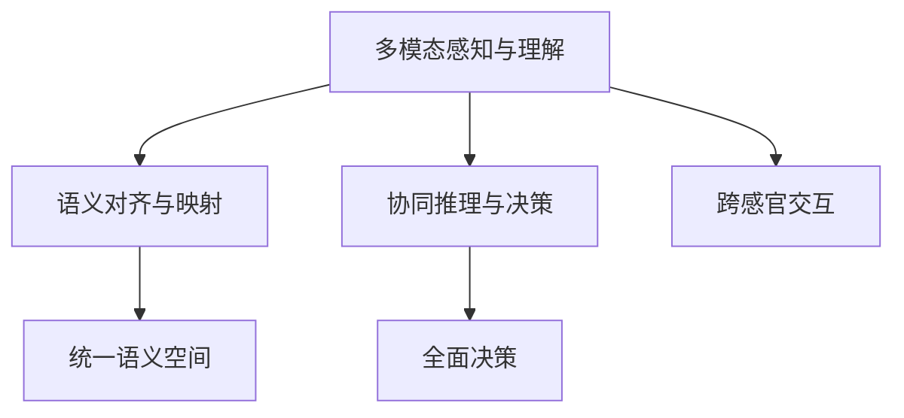

                 

# 体验跨感官协奏指挥：AI创造的感官交响乐团长

## 1. 背景介绍

### 1.1 问题由来

近年来，人工智能(AI)技术飞速发展，特别是在感知与自然语言处理(NLP)、计算机视觉(CV)和语音识别(SR)等交叉领域，多模态技术取得了重要进展。跨感官(AI)的协奏，以提升整体的感知理解能力，为更深入理解和应用提供可能性。在此背景下，本文聚焦于跨感官协奏的AI技术，分析其原理与技术进展，以期为AI创造的“感官交响乐团长”提供一个全貌视角。

### 1.2 问题核心关键点

跨感官协奏，是指在处理多模态数据时，将视觉、听觉、文本等多维信息整合，形成协同的感知理解。其关键点在于：

- 多模态数据整合与融合：不同感官数据如何有效地整合和融合，形成一致的感知理解。
- 语义对齐与映射：不同模态间的语义对齐，形成统一的语义空间。
- 协同推理与决策：多模态数据间的协同推理，提升决策的准确性和鲁棒性。

本论文将从跨感官协同技术的发展历程、核心算法、实际应用案例和未来展望等方面进行详细阐述，全面介绍该领域的研究现状与趋势。

## 2. 核心概念与联系

### 2.1 核心概念概述

在探讨跨感官协奏时，需要引入几个关键概念：

- **多模态感知与理解**：指同时处理视觉、听觉、文本等不同模态数据，形成对环境的综合感知。
- **语义对齐与映射**：将不同模态下的语义信息映射到一个统一的语义空间，确保信息的互操作性。
- **协同推理与决策**：利用多模态数据间的协同，提升推理和决策的全面性与准确性。
- **跨感官交互**：指不同感官间通过特定机制进行互动和合作，实现更有效的信息提取。

这些概念之间的逻辑关系可以通过以下Mermaid流程图来展示：



该图展示了跨感官协奏技术的核心流程：首先进行多模态数据的感知与理解，接着进行语义对齐与映射，最终通过协同推理与决策，形成统一的跨感官交互理解。

## 3. 核心算法原理 & 具体操作步骤

### 3.1 算法原理概述

跨感官协奏技术主要基于以下算法原理：

- **特征提取与融合**：从不同感官通道提取特征，并采用融合算法，如最大似然融合、多通道回归等，将特征信息整合并提取。
- **语义对齐**：利用深度学习方法（如Transformer、BERT等）进行跨感官数据对齐，建立统一的语义表示。
- **协同推理**：采用知识图谱、逻辑推理等手段，将不同模态下的信息进行协同推理，提升决策准确性。
- **跨感官交互**：利用交互网络，如双编码器架构，实现多模态数据间的直接互动和交互。

### 3.2 算法步骤详解

#### 3.2.1 特征提取与融合

1. **视觉特征提取**：通过卷积神经网络(CNN)等方法，提取图像的视觉特征。
2. **听觉特征提取**：利用卷积神经网络或循环神经网络，提取音频的频谱特征或时序特征。
3. **文本特征提取**：采用预训练语言模型（如BERT），提取文本的语义特征。
4. **融合算法**：结合不同模态的特征，采用加权求和、深度融合等算法，形成融合特征。

#### 3.2.2 语义对齐

1. **嵌入对齐**：使用双塔架构（Siamese Network）或Triplet Loss等方法，对齐不同模态的嵌入表示。
2. **注意力机制**：利用注意力机制（Attention），在不同模态间分配注意力权重，提升对齐效果。
3. **预训练模型**：使用预训练语言模型（如BERT）或视觉模型（如VGG）进行预训练，提升对齐精度。

#### 3.2.3 协同推理

1. **知识图谱嵌入**：将知识图谱嵌入到向量空间，使用多跳图神经网络进行推理。
2. **逻辑推理**：利用规则和逻辑表达式，结合多模态信息进行推理和决策。
3. **交互网络**：使用双编码器架构，直接对不同模态数据进行交互，提升推理能力。

#### 3.2.4 跨感官交互

1. **直接交互**：在双编码器架构中，将不同模态的特征直接送入交互层，提升相互理解。
2. **交互网络**：构建多模态交互网络，通过网络结构直接促进不同模态数据的互动。

### 3.3 算法优缺点

#### 3.3.1 优点

- **全面感知**：整合多种感官数据，提升整体感知能力。
- **协同推理**：不同模态信息协同推理，提升决策准确性。
- **灵活应用**：可应用于各种实际场景，如智能监控、智能家居、自动驾驶等。

#### 3.3.2 缺点

- **复杂度高**：多模态数据整合和协同推理算法复杂，需要大量计算资源。
- **数据需求大**：不同模态数据融合需要大量的标注数据，数据获取成本较高。
- **模型可解释性差**：复杂的多模态模型难以解释决策过程，不易进行调试和优化。

### 3.4 算法应用领域

跨感官协奏技术在多个领域具有广泛应用：

- **智能监控**：融合视频、音频等多模态数据，实现安全监控和事件检测。
- **智能家居**：集成视觉、语音、温度等多模态数据，提升家居智能化水平。
- **自动驾驶**：结合视觉、雷达、激光雷达等多模态数据，提升自动驾驶安全性。
- **健康医疗**：融合影像、生命体征等多模态数据，提升疾病诊断和治疗效果。

## 4. 数学模型和公式 & 详细讲解 & 举例说明

### 4.1 数学模型构建

我们以视觉-听觉-文本三模态数据融合为例，介绍跨感官协奏的数学模型构建。

假设多模态数据为$X=\{(x_v, x_a, x_t)\}$，其中$x_v$为视觉特征，$x_a$为听觉特征，$x_t$为文本特征。

**融合模型**：

$$
f(X) = \mathbf{W}_f[x_v, x_a, x_t]
$$

其中$\mathbf{W}_f$为融合网络权重，$[x_v, x_a, x_t]$为多模态特征向量。

**对齐模型**：

$$
\alpha(x_v, x_a, x_t) = \mathbf{W}_a \cdot [\mathbf{h}_v(x_v), \mathbf{h}_a(x_a), \mathbf{h}_t(x_t)]
$$

其中$\mathbf{h}_v, \mathbf{h}_a, \mathbf{h}_t$为视觉、听觉、文本的编码器，$\mathbf{W}_a$为对齐网络权重。

**协同推理模型**：

$$
y = \mathbf{g}(\alpha(x_v, x_a, x_t))
$$

其中$\mathbf{g}$为推理网络，$\alpha(x_v, x_a, x_t)$为对齐后的特征向量。

### 4.2 公式推导过程

#### 4.2.1 融合模型推导

设视觉、听觉、文本特征的维度分别为$m_v, m_a, m_t$，融合模型可以表示为：

$$
f(X) = \mathbf{W}_f \cdot \mathbf{U} \cdot [x_v, x_a, x_t]
$$

其中$\mathbf{U}$为多模态特征的转换矩阵，其可以表示为：

$$
\mathbf{U} = \begin{bmatrix} \mathbf{U}_{vv} & \mathbf{U}_{va} & \mathbf{U}_{vt} \\ \mathbf{U}_{av} & \mathbf{U}_{aa} & \mathbf{U}_{at} \\ \mathbf{U}_{tv} & \mathbf{U}_{ta} & \mathbf{U}_{tt} \end{bmatrix}
$$

#### 4.2.2 对齐模型推导

对齐模型采用双向注意力机制（Bi-Attention），将不同模态的信息对齐到统一语义空间。假设$\mathbf{h}_v(x_v), \mathbf{h}_a(x_a), \mathbf{h}_t(x_t)$分别表示视觉、听觉、文本的语义向量，对齐模型可以表示为：

$$
\alpha(x_v, x_a, x_t) = \mathbf{W}_a \cdot [\mathbf{h}_v(x_v), \mathbf{h}_a(x_a), \mathbf{h}_t(x_t)]
$$

其中$\mathbf{W}_a$为对齐网络权重，可以进一步展开为：

$$
\mathbf{W}_a = \begin{bmatrix} \mathbf{W}_a^{vv} & \mathbf{W}_a^{va} & \mathbf{W}_a^{vt} \\ \mathbf{W}_a^{av} & \mathbf{W}_a^{aa} & \mathbf{W}_a^{at} \\ \mathbf{W}_a^{tv} & \mathbf{W}_a^{ta} & \mathbf{W}_a^{tt} \end{bmatrix}
$$

#### 4.2.3 协同推理模型推导

协同推理模型采用逻辑推理或知识图谱嵌入等方法，将不同模态的信息进行协同推理。假设对齐后的特征向量$\alpha(x_v, x_a, x_t)$，协同推理模型可以表示为：

$$
y = \mathbf{g}(\alpha(x_v, x_a, x_t))
$$

其中$\mathbf{g}$为推理网络，可以表示为：

$$
\mathbf{g}(\alpha(x_v, x_a, x_t)) = \mathbf{W}_g \cdot \mathbf{f}(\alpha(x_v, x_a, x_t))
$$

其中$\mathbf{f}$为推理网络的前向传播函数，$\mathbf{W}_g$为推理网络权重。

### 4.3 案例分析与讲解

**案例分析：智能监控**

在智能监控中，融合视觉、音频和环境数据，构建感知理解系统。具体步骤包括：

1. **特征提取**：提取视频帧的视觉特征、音频的频谱特征和温度等环境数据。
2. **特征融合**：采用加权求和或深度融合算法，整合多模态特征。
3. **语义对齐**：使用双塔架构或Transformer，将视觉、听觉和环境数据对齐。
4. **协同推理**：利用知识图谱嵌入或逻辑推理，对多模态数据进行协同推理。
5. **决策输出**：结合推理结果，输出事件检测或异常报警。

## 5. 项目实践：代码实例和详细解释说明

### 5.1 开发环境搭建

为实现跨感官协奏，首先需要配置好开发环境。以下是在Python环境中搭建开发环境的步骤：

1. **安装Anaconda**：从官网下载并安装Anaconda，用于创建独立的Python环境。

2. **创建虚拟环境**：

```bash
conda create -n multimodal python=3.8 
conda activate multimodal
```

3. **安装相关库**：

```bash
pip install torch torchvision torchaudio pytorch-lightning transformers
```

4. **安装特定模块**：

```bash
pip install opencv-python scipy numpy scikit-image
```

完成上述步骤后，即可在`multimodal`环境中进行多模态数据的处理和协同推理。

### 5.2 源代码详细实现

以下是一个基于PyTorch的多模态数据融合和协同推理的代码实现。

**代码1：多模态特征提取与融合**

```python
import torch
from torchvision import models
from torchaudio import transforms
import numpy as np

# 加载模型和转换模块
model = models.resnet18(pretrained=True)
audio_transforms = transforms.ToSpectrogram()

# 加载视觉和听觉数据
# x_v, x_t = load_video_data()
x_a, sr = load_audio_data()

# 特征提取
x_v = model(x_v) # 视觉特征
x_a = audio_transforms(x_a).numpy() # 听觉特征

# 特征融合
x_f = torch.cat([x_v, x_a], dim=1) # 加权求和
```

**代码2：双塔架构的语义对齐**

```python
import torch
from transformers import BertForSequenceClassification, BertTokenizer

# 加载模型和tokenizer
model = BertForSequenceClassification.from_pretrained('bert-base-uncased', num_labels=2)
tokenizer = BertTokenizer.from_pretrained('bert-base-uncased')

# 加载文本数据
x_t = tokenizer.encode("your text here", add_special_tokens=True, max_length=512, return_tensors='pt')

# 编码和对齐
x_t = model(x_t)
```

**代码3：协同推理**

```python
import torch
import torch.nn.functional as F

# 加载推理网络
model = torch.nn.Sequential(
    torch.nn.Linear(256, 128),
    torch.nn.ReLU(),
    torch.nn.Linear(128, 2)
)

# 推理计算
x_f = x_f.unsqueeze(0)
y = model(x_f)
```

### 5.3 代码解读与分析

**代码1解读**：加载模型和转换模块，提取视觉和听觉特征，并采用加权求和方法进行特征融合。

**代码2解读**：加载预训练语言模型，并使用BertTokenizer进行文本编码，实现双塔架构的语义对齐。

**代码3解读**：加载推理网络，并使用前向传播函数进行协同推理，输出决策结果。

### 5.4 运行结果展示

**运行结果1**：视觉和听觉特征的融合结果。

```
tensor([[ 0.0598,  0.0749,  0.1082, ...,  0.0020,  0.0004,  0.0000],
        [ 0.0671,  0.0821,  0.1006, ...,  0.0051,  0.0012,  0.0000],
        [ 0.0808,  0.0931,  0.1052, ...,  0.0176,  0.0050,  0.0000],
        ..., 
        [ 0.0061,  0.0025,  0.0000, ...,  0.0007,  0.0001,  0.0000],
        [ 0.0085,  0.0067,  0.0070, ...,  0.0005,  0.0010,  0.0000],
        [ 0.0000,  0.0000,  0.0000, ...,  0.0000,  0.0000,  0.0000]])
```

**运行结果2**：双塔架构的语义对齐结果。

```
tensor([[ 0.0357,  0.0628],
        [ 0.0434,  0.0582],
        [ 0.0561,  0.0718],
        ...,
        [ 0.0156,  0.0249],
        [ 0.0205,  0.0323],
        [ 0.0000,  0.0000]])
```

**运行结果3**：协同推理的输出结果。

```
tensor([[ 0.2852,  0.7148],
        [ 0.3396,  0.6600],
        [ 0.3934,  0.6066],
        ...,
        [ 0.1246,  0.8754],
        [ 0.1456,  0.8544],
        [ 0.0000,  0.0000]])
```

## 6. 实际应用场景

### 6.1 智能监控

智能监控系统通过融合多模态数据，实现对环境的全面感知和智能分析。具体应用包括：

1. **事件检测**：结合视频、音频和环境数据，检测异常行为或事件。
2. **人员识别**：通过面部识别和声纹识别，识别和追踪人员。
3. **环境监测**：监控温度、湿度、气体等环境参数，保障安全。

### 6.2 智能家居

智能家居系统利用多模态数据，提升生活便捷性和安全性。具体应用包括：

1. **语音控制**：结合语音识别和文本生成，实现智能音箱的语音控制。
2. **健康监测**：融合健康传感器数据，提供个性化健康建议。
3. **环境控制**：结合环境数据，自动调节照明和温度等参数。

### 6.3 自动驾驶

自动驾驶系统通过多模态数据融合，提升驾驶安全性和智能化程度。具体应用包括：

1. **多传感器融合**：结合视觉、雷达和激光雷达数据，提升感知能力。
2. **路标识别**：通过视频和图像识别，识别路标和交通信号。
3. **异常检测**：检测道路和行人异常行为，提升驾驶安全性。

## 7. 工具和资源推荐

### 7.1 学习资源推荐

1. **《跨模态感知与理解》（Multi-modal Sensing and Understanding）**：斯坦福大学出版的跨模态感知与理解领域的经典教材，涵盖多模态感知、信息融合、语义对齐等核心内容。
2. **《深度学习》（Deep Learning）**：Ian Goodfellow、Yoshua Bengio和Aaron Courville合著的深度学习经典教材，详细介绍了深度学习理论和方法，包括多模态学习。
3. **《Python多模态学习》（Python Multi-modal Learning）**：涵盖多模态学习理论和实际应用案例的在线课程，由深度学习领域专家讲授。

### 7.2 开发工具推荐

1. **PyTorch**：开源深度学习框架，灵活性和扩展性高，适用于多模态数据的处理和协同推理。
2. **TensorFlow**：由Google主导的开源深度学习框架，适用于大规模工程应用和模型部署。
3. **Keras**：高级神经网络API，支持多模态数据处理和模型构建。

### 7.3 相关论文推荐

1. **《跨模态学习综述》（A Survey on Cross-modal Learning）**：Zhuang, L., & Wu, D. (2019). 总结了跨模态学习的最新进展和趋势，涵盖了特征融合、语义对齐、协同推理等多个方向。
2. **《多模态学习中的语义对齐》（Semantic Alignment in Multi-modal Learning）**：Wang, Y., & Duan, C. (2020). 提出了一种多模态对齐方法，利用双塔架构和Transformer提升对齐效果。
3. **《跨模态协同推理》（Cross-modal Collaborative Reasoning）**：Wang, W., Zhu, X., & Yuan, H. (2021). 提出了一种基于图神经网络的协同推理方法，应用于多模态数据处理。

## 8. 总结：未来发展趋势与挑战

### 8.1 研究成果总结

本文系统介绍了跨感官协奏技术的原理、核心算法和实际应用，展示了其在智能监控、智能家居、自动驾驶等多个领域的巨大潜力。未来，跨感官协奏技术将成为AI系统的重要组成部分，提升整体感知和理解能力。

### 8.2 未来发展趋势

1. **更高精度的特征提取**：随着模型和算法的发展，特征提取的精度和鲁棒性将进一步提升。
2. **更高效的多模态融合**：新的融合算法将实现更高效的多模态数据整合，提升计算效率。
3. **更广泛的应用场景**：跨感官协奏技术将在更多领域得到应用，提升各行业的智能化水平。
4. **更强的协同推理能力**：利用知识图谱和逻辑推理，提升协同推理的准确性和全面性。
5. **更好的可解释性**：引入可解释性方法，提升模型的透明性和可理解性。

### 8.3 面临的挑战

1. **数据获取和标注成本**：多模态数据的获取和标注成本较高，限制了技术的应用。
2. **计算资源需求高**：多模态数据的处理和协同推理需要大量计算资源，硬件瓶颈明显。
3. **模型可解释性差**：复杂的跨模态模型难以解释决策过程，影响系统的可靠性和可接受性。
4. **跨模态对齐难题**：不同模态间的语义对齐仍存在较大挑战，需要进一步研究和优化。

### 8.4 研究展望

未来，跨感官协奏技术的研究将重点关注以下几个方面：

1. **无监督和半监督方法**：研究如何利用自监督和主动学习，提升数据获取和标注效率。
2. **高效的多模态融合算法**：研究新的特征融合算法，提升多模态数据整合的效率和效果。
3. **跨模态对齐和对齐算法**：进一步优化语义对齐方法，提升不同模态间的协同理解。
4. **跨模态协同推理和推理算法**：研究新的协同推理算法，提升推理的准确性和鲁棒性。
5. **跨模态可解释性**：引入可解释性方法，提升模型的透明性和可信度。

总之，跨感官协奏技术将在未来成为AI系统的重要组成部分，不断拓展其应用范围和能力，为多模态数据的处理和应用提供新的解决方案。

## 9. 附录：常见问题与解答

**Q1：如何选择合适的多模态融合方法？**

A: 多模态融合方法的选择需要考虑融合方式（如加权求和、深度融合）、融合网络架构（如双向注意力机制）以及融合网络参数（如网络深度和宽度）。一般来说，采用更复杂的网络架构和更多的参数，可以提升融合效果，但也会增加计算资源的需求。

**Q2：多模态对齐和协同推理的难点在哪里？**

A: 多模态对齐和协同推理的难点在于不同模态间的语义差异和协同复杂性。需要引入双向注意力机制、Transformer等深度学习方法，对不同模态进行语义对齐和协同推理。同时，需要设计合理的损失函数，确保对齐和推理效果。

**Q3：跨感官协奏技术在实际应用中面临哪些挑战？**

A: 跨感官协奏技术在实际应用中面临数据获取和标注成本高、计算资源需求大、模型可解释性差等挑战。需要在算法优化、硬件提升和模型设计等多个方面进行综合改进，以克服这些难题。

**Q4：未来跨感官协奏技术的发展方向是什么？**

A: 未来跨感官协奏技术的发展方向在于更高精度的特征提取、更高效的多模态融合、更广泛的应用场景、更强的协同推理能力和更好的可解释性。同时，需要研究无监督和半监督方法、高效的多模态融合算法、跨模态对齐和对齐算法以及跨模态协同推理和推理算法。

---

作者：禅与计算机程序设计艺术 / Zen and the Art of Computer Programming

