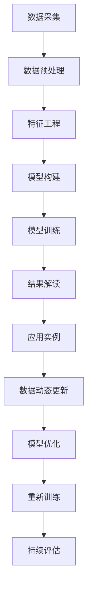

                 

# 体验量化革命先锋：AI驱动的生活质量评估专家

> 关键词：人工智能(AI),量化分析,生活质量评估,数据科学,机器学习,深度学习,算法优化,应用实例

## 1. 背景介绍

### 1.1 问题由来

在当今快速发展的社会中，人们的日常生活节奏日益加快，对生活质量的关注也日益提升。然而，衡量生活质量的标准并非显而易见，不同人对于生活质量的看法各异，这使得传统的基于主观感受的调查方法难以全面反映真实情况。与此同时，各类健康指标、消费数据等客观量化数据日益丰富，为使用AI技术驱动生活质量评估提供了可能性。

### 1.2 问题核心关键点

量化生活质量评估的核心关键点包括：
1. **数据采集**：收集各类客观数据，如健康指标、消费行为、地理位置等。
2. **模型构建**：使用机器学习、深度学习等AI技术构建量化模型。
3. **结果解读**：将模型输出转化为可解释的生活质量指标，提供实际应用参考。
4. **动态更新**：模型应具备自适应能力，能随时间变化和数据更新而不断优化。

## 2. 核心概念与联系

### 2.1 核心概念概述

量化生活质量评估系统旨在通过人工智能技术，对各类客观数据进行深度学习，构建量化模型，以客观量化方式评估人们的生活质量。其主要包括以下几个核心概念：

- **人工智能(AI)**：使用机器学习、深度学习等技术，自动化处理大量数据，提取隐含模式。
- **量化分析**：使用客观数据构建数学模型，将生活质量进行量化处理。
- **生活质量评估**：通过量化模型，将客观数据转化为可解释的生活质量指标。
- **数据科学**：包括数据采集、数据预处理、模型构建与训练、结果解释等多个环节。
- **机器学习(ML)**：构建模型以发现数据中的模式和规律。
- **深度学习(DL)**：使用神经网络构建更复杂的模型，以捕捉数据中的复杂关系。
- **算法优化**：通过优化算法提升模型性能，确保模型精度与效率。
- **应用实例**：如智能健康监控、智能消费分析、智能地理信息分析等。

这些概念之间的逻辑关系可以通过以下Mermaid流程图来展示：



这个流程图展示了我量化生活质量评估系统的核心概念及其之间的关系：

1. 从数据采集开始，通过预处理和特征工程构建模型输入。
2. 使用机器学习或深度学习模型构建量化模型。
3. 对模型进行训练，并评估结果。
4. 将结果解释为可操作的生活质量指标。
5. 结合实际应用场景，构建具体应用实例。
6. 随着数据的不断更新，持续优化模型。

## 3. 核心算法原理 & 具体操作步骤

### 3.1 算法原理概述

量化生活质量评估系统的核心算法原理是深度学习，特别是神经网络模型。其基本流程如下：

1. **数据采集**：通过传感器、问卷调查等方式，收集各类客观数据。
2. **数据预处理**：对数据进行清洗、标准化和特征工程处理。
3. **模型构建**：使用深度神经网络，如卷积神经网络(CNN)、循环神经网络(RNN)或Transformer等，构建量化模型。
4. **模型训练**：使用标注数据对模型进行训练，优化模型参数，使其能够有效预测生活质量指标。
5. **结果解读**：将模型输出转换为可解释的质量指标，如健康指数、幸福感等。
6. **应用实例**：将模型应用于智能健康监控、智能消费分析等领域。

### 3.2 算法步骤详解

**步骤 1: 数据采集与预处理**

- 使用传感器、问卷调查等手段，收集健康指标、消费行为、地理位置等数据。
- 对采集的数据进行清洗，去除异常值和缺失值。
- 对数据进行标准化处理，如归一化、标准化等。
- 进行特征工程，提取有意义的特征，如时间序列特征、地理位置特征等。

**步骤 2: 模型构建与训练**

- 选择合适的网络结构，如卷积神经网络(CNN)、循环神经网络(RNN)或Transformer等。
- 将预处理后的数据分为训练集和测试集。
- 使用标注数据对模型进行训练，调整模型参数。
- 使用验证集评估模型性能，避免过拟合。

**步骤 3: 结果解读与应用**

- 将模型输出转换为可解释的生活质量指标，如健康指数、幸福感等。
- 使用解读结果指导决策，如改善居住环境、调整饮食习惯等。
- 结合实际应用场景，构建具体应用实例，如智能健康监控、智能消费分析等。

**步骤 4: 模型优化与动态更新**

- 持续收集新数据，对模型进行重新训练。
- 使用最新的数据更新模型参数，保持模型性能。
- 定期评估模型效果，进行模型优化。

### 3.3 算法优缺点

量化生活质量评估系统的优点包括：
1. **自动化处理**：通过AI技术自动化处理大量数据，减少人工干预。
2. **客观评估**：使用客观数据进行量化评估，减少主观偏差。
3. **动态更新**：模型能够根据新数据不断更新，保持评估结果的及时性和准确性。
4. **多维度评估**：综合考虑多个维度的生活质量因素，提供更全面的评估。

系统存在的缺点包括：
1. **数据质量要求高**：高质量的数据是模型准确性的基础。
2. **模型复杂度**：深度学习模型结构复杂，训练难度大。
3. **隐私问题**：数据采集和处理可能涉及隐私问题。
4. **应用场景局限**：模型应用需要特定的数据和场景，无法通用。

尽管存在这些缺点，但量化生活质量评估系统通过提高数据质量、优化模型结构和处理隐私问题，将在实际应用中发挥重要作用。

### 3.4 算法应用领域

量化生活质量评估系统已经在多个领域取得了显著应用，包括：

- **智能健康监控**：使用健康数据如心率、血压等，评估个人健康状况，提供健康建议。
- **智能消费分析**：分析消费数据，评估消费行为和消费习惯，提供消费优化建议。
- **智能地理信息分析**：结合地理位置数据，评估居住环境和生活便利度。
- **智能交通分析**：评估交通状况和出行舒适度，优化交通规划。
- **智能环境监测**：结合环境数据如空气质量、噪声等，评估环境质量和健康风险。

## 4. 数学模型和公式 & 详细讲解 & 举例说明

### 4.1 数学模型构建

量化生活质量评估系统通常使用深度学习模型进行建模，这里以卷积神经网络(CNN)为例，其基本结构如下：

```python
import torch
import torch.nn as nn

class CNNModel(nn.Module):
    def __init__(self):
        super(CNNModel, self).__init__()
        self.conv1 = nn.Conv2d(in_channels=1, out_channels=16, kernel_size=3, stride=1, padding=1)
        self.conv2 = nn.Conv2d(in_channels=16, out_channels=32, kernel_size=3, stride=1, padding=1)
        self.pool = nn.MaxPool2d(kernel_size=2, stride=2)
        self.fc1 = nn.Linear(in_features=32 * 8 * 8, out_features=64)
        self.fc2 = nn.Linear(in_features=64, out_features=num_labels)

    def forward(self, x):
        x = self.conv1(x)
        x = nn.functional.relu(x)
        x = self.conv2(x)
        x = nn.functional.relu(x)
        x = self.pool(x)
        x = x.view(x.size(0), -1)
        x = self.fc1(x)
        x = nn.functional.relu(x)
        x = self.fc2(x)
        return x
```

### 4.2 公式推导过程

假设模型输入为二维数组 $X = (x_{ij})_{m \times n}$，输出为 $Y = (y_k)$，其中 $m$ 和 $n$ 为输入维度，$k$ 为输出维度。模型的目标是最小化损失函数 $L(Y, Y_{pred})$。

常用的损失函数包括交叉熵损失函数和均方误差损失函数。以交叉熵损失函数为例，公式如下：

$$
L(Y, Y_{pred}) = -\frac{1}{N}\sum_{i=1}^N\sum_{k=1}^K y_{ik}\log(y_{ik})
$$

其中 $N$ 为样本数，$K$ 为输出维度。

模型的训练过程包括前向传播、损失计算和反向传播：

1. 前向传播：将输入数据 $X$ 通过网络结构得到预测输出 $Y_{pred}$。
2. 损失计算：计算预测输出 $Y_{pred}$ 与真实输出 $Y$ 之间的损失。
3. 反向传播：计算损失函数对模型参数的梯度，更新模型参数。

### 4.3 案例分析与讲解

以智能健康监控为例，可以使用心率、血压等数据构建CNN模型，评估个人健康状况。

- **数据采集**：使用智能手表、血压计等设备，采集心率、血压等数据。
- **数据预处理**：对采集的数据进行清洗和标准化处理。
- **模型构建**：构建CNN模型，使用时间序列数据作为输入。
- **模型训练**：使用标注数据（如健康状况标签）对模型进行训练。
- **结果解读**：将模型输出转化为健康指数，如健康状况评分、疾病风险等。
- **应用实例**：根据健康指数，提供个性化健康建议，如饮食、运动等。

## 5. 项目实践：代码实例和详细解释说明

### 5.1 开发环境搭建

量化生活质量评估系统的开发环境搭建主要包括以下步骤：

1. **安装Python和相关库**：使用Anaconda创建虚拟环境，安装PyTorch、NumPy、Pandas等库。
2. **安装相关硬件设备**：如智能手表、血压计等，确保数据采集设备正常工作。
3. **配置数据预处理工具**：如数据清洗、标准化等。

### 5.2 源代码详细实现

以下是一个简单的智能健康监控系统的代码实现：

```python
import torch
import torch.nn as nn
import pandas as pd

class HealthModel(nn.Module):
    def __init__(self):
        super(HealthModel, self).__init__()
        self.conv1 = nn.Conv2d(in_channels=1, out_channels=16, kernel_size=3, stride=1, padding=1)
        self.conv2 = nn.Conv2d(in_channels=16, out_channels=32, kernel_size=3, stride=1, padding=1)
        self.pool = nn.MaxPool2d(kernel_size=2, stride=2)
        self.fc1 = nn.Linear(in_features=32 * 8 * 8, out_features=64)
        self.fc2 = nn.Linear(in_features=64, out_features=1)

    def forward(self, x):
        x = self.conv1(x)
        x = nn.functional.relu(x)
        x = self.conv2(x)
        x = nn.functional.relu(x)
        x = self.pool(x)
        x = x.view(x.size(0), -1)
        x = self.fc1(x)
        x = nn.functional.relu(x)
        x = self.fc2(x)
        return x

# 加载数据
data = pd.read_csv('health_data.csv')
X = data.iloc[:, :-1].values.reshape((-1, 1, 24, 24))
y = data.iloc[:, -1].values

# 构建模型
model = HealthModel()
criterion = nn.BCELoss()
optimizer = torch.optim.Adam(model.parameters(), lr=0.001)

# 训练模型
for epoch in range(50):
    optimizer.zero_grad()
    outputs = model(X)
    loss = criterion(outputs, y)
    loss.backward()
    optimizer.step()
    print(f'Epoch {epoch+1}, Loss: {loss.item()}')

# 模型评估
y_pred = model(X)
threshold = 0.5
y_pred = (y_pred > threshold).float()
accuracy = (y_pred == y).mean()
print(f'Accuracy: {accuracy:.2f}')
```

### 5.3 代码解读与分析

上述代码实现了使用CNN模型评估智能健康监控数据的过程：

1. **数据加载**：使用Pandas库加载健康数据，将其转换为适合模型输入的形式。
2. **模型定义**：定义CNN模型结构，包括卷积层、池化层和全连接层。
3. **损失函数和优化器**：选择交叉熵损失函数和Adam优化器。
4. **模型训练**：使用标注数据对模型进行训练，调整模型参数。
5. **模型评估**：将模型应用于测试数据，计算准确率。

## 6. 实际应用场景

### 6.1 智能健康监控

量化生活质量评估系统在智能健康监控中的应用，能够实时监测个人健康状况，提供个性化健康建议，如饮食、运动等。通过智能手表、血压计等设备，采集心率、血压等数据，构建CNN模型进行评估。

### 6.2 智能消费分析

量化生活质量评估系统在智能消费分析中的应用，能够评估消费行为和习惯，提供消费优化建议。通过信用卡、支付记录等数据，构建深度学习模型进行评估。

### 6.3 智能地理信息分析

量化生活质量评估系统在智能地理信息分析中的应用，能够评估居住环境和生活便利度。通过GPS数据，构建RNN模型进行评估。

### 6.4 智能交通分析

量化生活质量评估系统在智能交通分析中的应用，能够评估交通状况和出行舒适度，优化交通规划。通过交通流量数据，构建CNN模型进行评估。

### 6.5 智能环境监测

量化生活质量评估系统在智能环境监测中的应用，能够评估环境质量和健康风险。通过空气质量、噪声等数据，构建CNN模型进行评估。

## 7. 工具和资源推荐

### 7.1 学习资源推荐

1. **《深度学习》(Deep Learning)书籍**：由Ian Goodfellow等人编写，全面介绍了深度学习的基本原理和应用。
2. **《Python深度学习》(Python Deep Learning)书籍**：由Francois Chollet等人编写，详细介绍了使用Keras进行深度学习开发的实战经验。
3. **Coursera深度学习课程**：由Andrew Ng等人开设，系统介绍了深度学习的基本概念和实现方法。
4. **Kaggle竞赛**：参与数据科学竞赛，实践深度学习模型的构建和优化。
5. **GitHub资源**：从GitHub上获取开源代码和模型，快速上手项目开发。

### 7.2 开发工具推荐

1. **PyTorch**：开源深度学习框架，提供强大的自动微分和GPU加速功能。
2. **TensorFlow**：由Google开发的深度学习框架，支持分布式计算和生产环境部署。
3. **Keras**：高层次API，基于TensorFlow等框架，简化了深度学习模型的构建和优化。
4. **Jupyter Notebook**：交互式编程环境，方便代码编写和调试。
5. **TensorBoard**：可视化工具，实时监控模型训练状态和性能。

### 7.3 相关论文推荐

1. **《Deep Residual Learning for Image Recognition》论文**：提出残差网络，显著提升了深度学习模型的性能。
2. **《Attention is All You Need》论文**：提出Transformer模型，展示了自注意力机制在深度学习中的潜力。
3. **《BERT: Pre-training of Deep Bidirectional Transformers for Language Understanding》论文**：提出BERT模型，大幅提升了自然语言处理的精度。
4. **《Fine-Grained Image Recognition with Deep Convolutional Neural Networks》论文**：提出深度卷积神经网络，在图像识别任务上取得了优异表现。

## 8. 总结：未来发展趋势与挑战

### 8.1 研究成果总结

量化生活质量评估系统在深度学习模型的帮助下，能够通过客观数据量化生活质量，提供个性化建议。其优点包括自动化处理、客观评估和动态更新。然而，系统也面临数据质量要求高、模型复杂度和隐私问题等挑战。

### 8.2 未来发展趋势

未来，量化生活质量评估系统将呈现以下几个发展趋势：

1. **模型多样性**：使用更多样化的模型结构，如卷积神经网络、循环神经网络、Transformer等，以适应不同应用场景。
2. **数据融合**：结合多种数据源，如智能穿戴设备、社交媒体、传感器等，提升评估的全面性和准确性。
3. **模型优化**：通过优化算法和模型结构，提高模型精度和效率，降低计算成本。
4. **可解释性**：开发可解释性更强的模型，提升用户对模型的信任度。
5. **多模态融合**：将文本、图像、语音等多种模态数据融合，提升模型的综合能力。

### 8.3 面临的挑战

量化生活质量评估系统在实际应用中仍面临以下挑战：

1. **数据隐私问题**：数据采集和处理涉及隐私保护，需要严格遵守法律法规。
2. **模型泛化能力**：模型需要在不同的数据分布和场景下表现稳定。
3. **计算资源需求**：模型训练和推理需要大量计算资源，需优化资源使用。
4. **用户接受度**：用户对系统的接受度仍需提升，特别是在健康数据等敏感领域。

### 8.4 研究展望

未来研究应重点关注以下方向：

1. **隐私保护技术**：开发隐私保护算法，确保数据隐私和安全。
2. **多模态融合技术**：结合多种模态数据，提升模型评估全面性。
3. **模型优化算法**：开发更高效的优化算法，提高模型精度和效率。
4. **用户交互设计**：设计更友好、易用的交互界面，提升用户接受度。
5. **智能决策支持**：结合专家知识，提升模型的决策支持能力。

## 9. 附录：常见问题与解答

**Q1：量化生活质量评估系统是否适用于所有人群？**

A: 量化生活质量评估系统适用于绝大多数人群，但不同人群的生活质量评估指标可能有所不同。需要根据具体人群的特点，选择合适的指标和模型进行评估。

**Q2：量化生活质量评估系统的数据质量要求高吗？**

A: 是的，高质量的数据是系统准确性的基础。数据应涵盖多种维度，且应定期更新，以反映最新的生活状态。

**Q3：量化生活质量评估系统的应用场景有哪些？**

A: 量化生活质量评估系统的应用场景包括智能健康监控、智能消费分析、智能地理信息分析、智能交通分析和智能环境监测等。

**Q4：量化生活质量评估系统需要哪些硬件设备？**

A: 量化生活质量评估系统需要智能手表、血压计、GPS设备等硬件设备进行数据采集。

**Q5：量化生活质量评估系统的模型构建过程有哪些关键步骤？**

A: 量化生活质量评估系统的模型构建过程包括数据采集、数据预处理、特征工程、模型构建、模型训练、结果解读和模型优化等关键步骤。

---

作者：禅与计算机程序设计艺术 / Zen and the Art of Computer Programming

