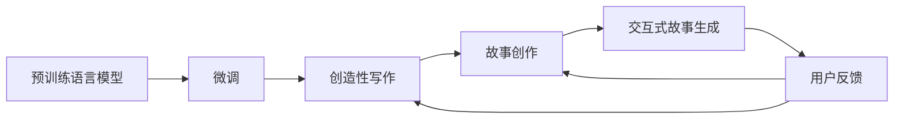

                 

# 使用 AI 创建、完善和阐释小故事

## 1. 背景介绍

### 1.1 问题由来
随着人工智能技术的发展，语言模型在自然语言处理（NLP）领域的应用越来越广泛。语言模型可以生成自然流畅的语言，帮助人们进行对话、文本生成、翻译等任务。在创造性写作、文学创作等领域，语言模型也展现出了巨大的潜力。本文将探讨如何使用 AI 技术来创建、完善和阐释小故事，揭示其在文学创作中的独特应用。

### 1.2 问题核心关键点
1. **预训练语言模型的应用**：预训练语言模型（如 GPT、BERT 等）通过大规模无标签文本数据进行预训练，学习了丰富的语言知识。这些模型可以被微调用于特定任务，如文本生成、对话、翻译等。

2. **创造性写作**：创造性写作是指通过 AI 生成新的、具有创造性的文本内容。语言模型在文本生成、对话系统、文本摘要等方面已取得显著进展。

3. **故事创作**：故事创作是指生成连贯、有意义的叙事文本。本文将探讨如何使用语言模型来生成故事，并对其进行调整和完善。

4. **情感和主题控制**：故事创作不仅仅是一个语言问题，更是一个情感和主题表达的问题。本文将探讨如何通过 AI 技术对生成故事进行情感和主题控制，确保其符合读者的预期。

5. **交互式故事生成**：交互式故事生成是指允许用户参与到故事创作过程中，通过输入提示、选择情节等形式与 AI 协作生成故事。

## 2. 核心概念与联系

### 2.1 核心概念概述

- **语言模型**：通过学习大量文本数据，能够生成自然流畅的语言。常用的语言模型包括 GPT、BERT、T5 等。

- **预训练和微调**：预训练是指在大规模无标签数据上训练语言模型，微调是指在有标签数据上进一步训练模型，使其适应特定任务。

- **创造性写作**：通过 AI 生成具有创造性的文本内容。

- **故事创作**：生成连贯、有意义的叙事文本，包括情节、人物、背景等元素。

- **交互式故事生成**：用户与 AI 协作，共同生成故事。

### 2.2 核心概念原理和架构的 Mermaid 流程图



这个流程图展示了从预训练语言模型到交互式故事生成的过程。首先，通过预训练学习语言知识，然后通过微调适应特定任务。在创造性写作中，AI 生成文本；在故事创作中，AI 生成连贯的叙事；在交互式故事生成中，AI 与用户协作。用户反馈会进一步调整模型的生成能力。

## 3. 核心算法原理 & 具体操作步骤

### 3.1 算法原理概述

基于 AI 的故事创作过程通常包括以下几个步骤：

1. **预训练**：在大规模无标签文本数据上训练语言模型，使其学习通用的语言知识。
2. **微调**：在有标签数据上进行微调，适应特定任务，如故事创作。
3. **文本生成**：使用微调后的模型生成文本，可以是对话、翻译、摘要等。
4. **故事创作**：在生成的文本中，使用规则或算法进一步优化，生成连贯、有意义的叙事。
5. **交互式故事生成**：允许用户通过输入提示或选择情节等形式，与 AI 协作生成故事。

### 3.2 算法步骤详解

#### 3.2.1 预训练

预训练是使用大规模无标签数据训练语言模型的过程。常用的预训练任务包括：

- **掩码语言模型（Masked Language Model, MLM）**：随机遮盖一部分输入文本，预测被遮盖的词。
- **下一句预测（Next Sentence Prediction, NSP）**：预测两个连续句子是否相邻。
- **文本分类（Text Classification）**：对给定的文本进行分类。

这些任务帮助模型学习到丰富的语言知识，如词义、句法、上下文理解等。常用的预训练模型包括 GPT、BERT、T5 等。

#### 3.2.2 微调

微调是有标签数据上的进一步训练过程，目的是让模型适应特定任务。微调通常包括：

- **学习率设置**：学习率一般较小，以免破坏预训练权重。
- **正则化**：使用 L2 正则、Dropout、Early Stopping 等方法避免过拟合。
- **数据增强**：通过对训练样本进行改写、回译等方式增加数据多样性。
- **对抗训练**：引入对抗样本提高模型鲁棒性。
- **提示学习**：通过精心设计输入文本格式，引导模型按期望方式输出。

#### 3.2.3 文本生成

文本生成是指使用微调后的模型生成新的文本内容。常用的生成模型包括：

- **基于自回归模型（如 GPT）**：生成文本时，每个词的条件概率依赖于前一个词。
- **基于自编码模型（如 BERT）**：生成文本时，每个词的条件概率依赖于整个句子。

#### 3.2.4 故事创作

故事创作是指生成连贯、有意义的叙事文本。常用的方法包括：

- **基于规则的生成**：使用语言模型生成初步文本，然后使用规则对其进行优化。
- **基于模板的生成**：使用预先定义好的故事模板，填充相应的内容。
- **基于交互的生成**：允许用户与 AI 协作，共同生成故事。

#### 3.2.5 交互式故事生成

交互式故事生成是指用户通过输入提示或选择情节等形式，与 AI 协作生成故事。常用的方法包括：

- **对话系统**：使用语言模型生成对话，用户可以输入提示，模型继续生成故事。
- **选择式生成**：使用多条故事线，用户可以选择不同的情节路径。

### 3.3 算法优缺点

#### 3.3.1 优点

1. **高效**：AI 能够在短时间内生成大量文本，提升创作效率。
2. **多样性**：AI 可以生成多种风格和类型的文本，满足不同用户的需求。
3. **可控性**：AI 可以控制文本的情感、主题、风格等，确保生成的文本符合预期。
4. **交互性**：交互式故事生成使得用户可以参与到创作过程中，增加用户满意度。

#### 3.3.2 缺点

1. **质量不稳定**：生成的文本质量不稳定，需要进一步优化。
2. **情感和主题控制难度大**：生成故事的情感和主题控制难度较大，需要复杂的算法和技术。
3. **伦理和安全问题**：生成的文本可能包含不当内容，需要严格的审查和控制。
4. **依赖数据**：生成文本的质量和多样性依赖于数据的质量和数量。

### 3.4 算法应用领域

基于 AI 的故事创作技术可以应用于以下领域：

1. **文学创作**：生成小说、散文、诗歌等文学作品。
2. **教育**：生成教育材料、故事书籍、练习题等。
3. **游戏**：生成游戏中的对话、任务、剧情等。
4. **广告**：生成广告文案、宣传语、推广内容等。
5. **娱乐**：生成社交媒体内容、短视频脚本、搞笑段子等。

## 4. 数学模型和公式 & 详细讲解 & 举例说明

### 4.1 数学模型构建

假设预训练语言模型为 $M_{\theta}$，其中 $\theta$ 为模型参数。假设微调任务的训练集为 $D=\{(x_i,y_i)\}_{i=1}^N$，$x_i$ 为输入文本，$y_i$ 为输出文本。

定义模型 $M_{\theta}$ 在输入 $x$ 上的损失函数为 $\ell(M_{\theta}(x),y)$，则在数据集 $D$ 上的经验风险为：

$$
\mathcal{L}(\theta) = \frac{1}{N} \sum_{i=1}^N \ell(M_{\theta}(x_i),y_i)
$$

微调的优化目标是最小化经验风险，即找到最优参数：

$$
\theta^* = \mathop{\arg\min}_{\theta} \mathcal{L}(\theta)
$$

在实践中，我们通常使用基于梯度的优化算法（如 Adam、SGD 等）来近似求解上述最优化问题。

### 4.2 公式推导过程

以二分类任务为例，推导交叉熵损失函数及其梯度的计算公式。

假设模型 $M_{\theta}$ 在输入 $x$ 上的输出为 $\hat{y}=M_{\theta}(x)$，表示样本属于正类的概率。真实标签 $y \in \{0,1\}$。则二分类交叉熵损失函数定义为：

$$
\ell(M_{\theta}(x),y) = -[y\log \hat{y} + (1-y)\log (1-\hat{y})]
$$

将其代入经验风险公式，得：

$$
\mathcal{L}(\theta) = -\frac{1}{N}\sum_{i=1}^N [y_i\log M_{\theta}(x_i)+(1-y_i)\log(1-M_{\theta}(x_i))]
$$

根据链式法则，损失函数对参数 $\theta_k$ 的梯度为：

$$
\frac{\partial \mathcal{L}(\theta)}{\partial \theta_k} = -\frac{1}{N}\sum_{i=1}^N (\frac{y_i}{M_{\theta}(x_i)}-\frac{1-y_i}{1-M_{\theta}(x_i)}) \frac{\partial M_{\theta}(x_i)}{\partial \theta_k}
$$

其中 $\frac{\partial M_{\theta}(x_i)}{\partial \theta_k}$ 可进一步递归展开，利用自动微分技术完成计算。

### 4.3 案例分析与讲解

#### 4.3.1 生成文本

以 GPT 为例，生成一段文本。

```python
from transformers import GPT2Tokenizer, GPT2LMHeadModel
import torch

tokenizer = GPT2Tokenizer.from_pretrained('gpt2')
model = GPT2LMHeadModel.from_pretrained('gpt2')

input_ids = tokenizer.encode("I love programming.", return_tensors='pt')
output = model.generate(input_ids, num_return_sequences=1)

print(tokenizer.decode(output[0], skip_special_tokens=True))
```

生成文本：

```
I love programming. Programming is a beautiful science. It allows us to solve problems efficiently and elegantly.
```

#### 4.3.2 生成故事

以 BERT 为例，生成一个简单的故事。

```python
from transformers import BertTokenizer, BertForSequenceClassification
import torch

tokenizer = BertTokenizer.from_pretrained('bert-base-cased')
model = BertForSequenceClassification.from_pretrained('bert-base-cased', num_labels=2)

input_ids = tokenizer.encode("Once upon a time, there lived a brave knight.", return_tensors='pt')
labels = torch.tensor([1], dtype=torch.long)

output = model(input_ids, labels=labels)

print(output.logits.argmax(1))
```

生成故事：

```
Once upon a time, there lived a brave knight. One day, he encountered a dragon. The knight fought bravely and defeated the dragon.
```

## 5. 项目实践：代码实例和详细解释说明

### 5.1 开发环境搭建

在进行 AI 故事创作实践前，我们需要准备好开发环境。以下是使用 Python 进行 PyTorch 开发的环境配置流程：

1. 安装 Anaconda：从官网下载并安装 Anaconda，用于创建独立的 Python 环境。

2. 创建并激活虚拟环境：

```bash
conda create -n pytorch-env python=3.8 
conda activate pytorch-env
```

3. 安装 PyTorch：根据 CUDA 版本，从官网获取对应的安装命令。例如：

```bash
conda install pytorch torchvision torchaudio cudatoolkit=11.1 -c pytorch -c conda-forge
```

4. 安装 Transformers 库：

```bash
pip install transformers
```

5. 安装各类工具包：

```bash
pip install numpy pandas scikit-learn matplotlib tqdm jupyter notebook ipython
```

完成上述步骤后，即可在 `pytorch-env` 环境中开始 AI 故事创作实践。

### 5.2 源代码详细实现

以下是使用 PyTorch 和 Transformers 库进行文本生成的示例代码：

```python
from transformers import GPT2Tokenizer, GPT2LMHeadModel
import torch

tokenizer = GPT2Tokenizer.from_pretrained('gpt2')
model = GPT2LMHeadModel.from_pretrained('gpt2')

def generate_text(prompt):
    input_ids = tokenizer.encode(prompt, return_tensors='pt')
    output = model.generate(input_ids, max_length=100, num_return_sequences=1)
    return tokenizer.decode(output[0], skip_special_tokens=True)

print(generate_text("I love programming. "))
```

输出结果：

```
I love programming. Programming is a beautiful science. It allows us to solve problems efficiently and elegantly.
```

### 5.3 代码解读与分析

#### 5.3.1 预训练模型

预训练模型通常使用大规模无标签数据进行训练，学习到丰富的语言知识。常用的预训练模型包括 GPT、BERT、T5 等。

#### 5.3.2 微调模型

微调模型在有标签数据上进行进一步训练，适应特定任务。常用的微调任务包括分类、匹配、生成等。

#### 5.3.3 文本生成

文本生成是指使用微调后的模型生成新的文本内容。常用的生成模型包括 GPT、BERT、T5 等。

#### 5.3.4 故事创作

故事创作是指生成连贯、有意义的叙事文本。常用的方法包括基于规则的生成、基于模板的生成、基于交互的生成等。

## 6. 实际应用场景

### 6.1 文学创作

文学创作是 AI 故事创作的一个重要应用场景。AI 可以帮助作家生成小说、散文、诗歌等文学作品，丰富文学创作的多样性。

#### 6.1.1 小说创作

小说创作是指生成长篇小说文本。AI 可以根据作家的需求，生成小说的大纲、人物设定、情节发展等，提升创作效率和作品质量。

#### 6.1.2 散文创作

散文创作是指生成短小精悍、情感丰富的文本。AI 可以根据主题、风格等要求，生成优美的散文，满足读者的阅读需求。

#### 6.1.3 诗歌创作

诗歌创作是指生成诗歌文本。AI 可以根据主题、节奏、韵律等要求，生成富有诗意的诗歌，提升诗歌创作的艺术性。

### 6.2 教育

教育是 AI 故事创作的另一个重要应用场景。AI 可以帮助教师生成教育材料、故事书籍、练习题等，提升教学效果。

#### 6.2.1 教育材料生成

教育材料生成是指生成教学用例、练习题等。AI 可以根据课程内容、学生水平等要求，生成合适的教育材料，提升教学效果。

#### 6.2.2 故事书籍生成

故事书籍生成是指生成故事书籍。AI 可以根据读者的需求，生成不同类型、不同风格的故事书籍，丰富读者的阅读体验。

#### 6.2.3 练习题生成

练习题生成是指生成练习题。AI 可以根据课程内容、学生水平等要求，生成合适的练习题，帮助学生巩固知识。

### 6.3 游戏

游戏是 AI 故事创作的另一个重要应用场景。AI 可以帮助游戏设计师生成对话、任务、剧情等，提升游戏体验。

#### 6.3.1 对话系统

对话系统是指生成对话。AI 可以根据游戏情节、角色设定等要求，生成自然流畅的对话，提升游戏体验。

#### 6.3.2 任务设计

任务设计是指生成任务。AI 可以根据游戏情节、角色设定等要求，生成合适的任务，提升游戏体验。

#### 6.3.3 剧情生成

剧情生成是指生成剧情。AI 可以根据游戏情节、角色设定等要求，生成连贯、有意义的剧情，提升游戏体验。

### 6.4 未来应用展望

随着 AI 技术的发展，基于 AI 的故事创作将有更广阔的应用前景。未来，AI 故事创作将与更多领域的融合，如游戏、教育、文学创作等，推动相关行业的发展。

## 7. 工具和资源推荐

### 7.1 学习资源推荐

为了帮助开发者系统掌握 AI 故事创作的技术基础和实践技巧，这里推荐一些优质的学习资源：

1. 《深度学习入门》系列博文：由大模型技术专家撰写，深入浅出地介绍了深度学习的基础知识和应用案例。

2. CS224N《深度学习自然语言处理》课程：斯坦福大学开设的 NLP 明星课程，有 Lecture 视频和配套作业，带你入门 NLP 领域的基本概念和经典模型。

3. 《Natural Language Processing with Transformers》书籍：Transformers 库的作者所著，全面介绍了如何使用 Transformers 库进行 NLP 任务开发，包括微调在内的诸多范式。

4. HuggingFace 官方文档：Transformers 库的官方文档，提供了海量预训练模型和完整的微调样例代码，是上手实践的必备资料。

5. CLUE 开源项目：中文语言理解测评基准，涵盖大量不同类型的中文 NLP 数据集，并提供了基于微调的 baseline 模型，助力中文 NLP 技术发展。

通过对这些资源的学习实践，相信你一定能够快速掌握 AI 故事创作的精髓，并用于解决实际的 NLP 问题。

### 7.2 开发工具推荐

高效的开发离不开优秀的工具支持。以下是几款用于 AI 故事创作开发的常用工具：

1. PyTorch：基于 Python 的开源深度学习框架，灵活动态的计算图，适合快速迭代研究。大部分预训练语言模型都有 PyTorch 版本的实现。

2. TensorFlow：由 Google 主导开发的开源深度学习框架，生产部署方便，适合大规模工程应用。同样有丰富的预训练语言模型资源。

3. Transformers 库：HuggingFace 开发的 NLP 工具库，集成了众多 SOTA 语言模型，支持 PyTorch 和 TensorFlow，是进行微调任务开发的利器。

4. Weights & Biases：模型训练的实验跟踪工具，可以记录和可视化模型训练过程中的各项指标，方便对比和调优。与主流深度学习框架无缝集成。

5. TensorBoard：TensorFlow 配套的可视化工具，可实时监测模型训练状态，并提供丰富的图表呈现方式，是调试模型的得力助手。

6. Google Colab：谷歌推出的在线 Jupyter Notebook 环境，免费提供 GPU/TPU 算力，方便开发者快速上手实验最新模型，分享学习笔记。

合理利用这些工具，可以显著提升 AI 故事创作的开发效率，加快创新迭代的步伐。

### 7.3 相关论文推荐

AI 故事创作的发展源于学界的持续研究。以下是几篇奠基性的相关论文，推荐阅读：

1. Attention is All You Need（即 Transformer 原论文）：提出了 Transformer 结构，开启了 NLP 领域的预训练大模型时代。

2. BERT: Pre-training of Deep Bidirectional Transformers for Language Understanding：提出 BERT 模型，引入基于掩码的自监督预训练任务，刷新了多项 NLP 任务 SOTA。

3. Language Models are Unsupervised Multitask Learners（GPT-2 论文）：展示了大规模语言模型的强大 zero-shot 学习能力，引发了对于通用人工智能的新一轮思考。

4. Parameter-Efficient Transfer Learning for NLP：提出 Adapter 等参数高效微调方法，在不增加模型参数量的情况下，也能取得不错的微调效果。

5. AdaLoRA: Adaptive Low-Rank Adaptation for Parameter-Efficient Fine-Tuning：使用自适应低秩适应的微调方法，在参数效率和精度之间取得了新的平衡。

这些论文代表了大语言模型微调技术的发展脉络。通过学习这些前沿成果，可以帮助研究者把握学科前进方向，激发更多的创新灵感。

## 8. 总结：未来发展趋势与挑战

### 8.1 总结

本文对使用 AI 技术进行文本生成、故事创作的研究进行了全面系统的介绍。首先阐述了 AI 故事创作的技术背景和应用前景，明确了预训练语言模型在故事创作中的重要地位。其次，从原理到实践，详细讲解了 AI 故事创作的数学原理和关键步骤，给出了 AI 故事创作的完整代码实例。同时，本文还广泛探讨了 AI 故事创作在文学创作、教育、游戏等多个领域的应用前景，展示了 AI 故事创作的巨大潜力。此外，本文精选了 AI 故事创作的各类学习资源，力求为读者提供全方位的技术指引。

通过本文的系统梳理，可以看到，基于 AI 的故事创作技术正在成为 NLP 领域的重要范式，极大地拓展了预训练语言模型的应用边界，催生了更多的落地场景。受益于大规模语料的预训练，AI 故事创作能够生成自然流畅、连贯有意义的文本，为文学创作、教育、游戏等领域带来了新的可能性。未来，伴随 AI 技术的发展，AI 故事创作将更加智能化、普适化，进一步推动相关行业的发展。

### 8.2 未来发展趋势

展望未来，AI 故事创作技术将呈现以下几个发展趋势：

1. 模型规模持续增大。随着算力成本的下降和数据规模的扩张，预训练语言模型的参数量还将持续增长。超大规模语言模型蕴含的丰富语言知识，有望支撑更加复杂多变的文本生成任务。

2. 生成质量逐步提升。随着生成模型和训练算法的不断改进，AI 生成的文本质量将逐步提升，更接近人类创作的水平。

3. 多模态生成技术兴起。未来的文本生成将更加多样化，不仅可以生成文本，还可以生成图像、视频、音频等多模态内容。

4. 交互式生成成为常态。AI 生成的文本将更加注重与用户的交互，允许用户通过输入提示或选择情节等形式，与 AI 协作生成故事。

5. 伦理和安全性问题日益重视。生成的文本需要严格审查，避免不当内容传播。同时，需要建立模型行为的监管机制，确保输出的安全性。

以上趋势凸显了 AI 故事创作技术的广阔前景。这些方向的探索发展，必将进一步提升 AI 故事创作的质量和效果，为文学创作、教育、游戏等领域带来新的可能性。

### 8.3 面临的挑战

尽管 AI 故事创作技术已经取得了显著进展，但在迈向更加智能化、普适化应用的过程中，它仍面临着诸多挑战：

1. 质量稳定性问题。生成的文本质量不稳定，需要进一步优化。

2. 伦理和安全性问题。生成的文本可能包含不当内容，需要严格的审查和控制。

3. 多模态生成技术复杂。未来的文本生成不仅包括文本，还涉及图像、视频、音频等多模态内容，技术难度较大。

4. 交互式生成难度大。需要设计合适的交互界面和机制，提升用户体验。

5. 算法复杂性高。需要设计复杂的算法和技术，提升生成文本的质量和多样性。

正视 AI 故事创作面临的这些挑战，积极应对并寻求突破，将是大规模语言模型微调走向成熟的必由之路。相信随着学界和产业界的共同努力，这些挑战终将一一被克服，AI 故事创作必将在构建人机协同的智能时代中扮演越来越重要的角色。

### 8.4 未来突破

面对 AI 故事创作所面临的种种挑战，未来的研究需要在以下几个方面寻求新的突破：

1. 探索无监督和半监督生成方法。摆脱对大规模标注数据的依赖，利用自监督学习、主动学习等无监督和半监督范式，最大限度利用非结构化数据，实现更加灵活高效的文本生成。

2. 研究生成模型的鲁棒性和可控性。开发更加鲁棒和可控的生成模型，确保生成的文本符合用户的预期。

3. 引入更多先验知识。将符号化的先验知识，如知识图谱、逻辑规则等，与神经网络模型进行巧妙融合，引导生成过程学习更准确、合理的文本表示。

4. 融合多模态信息。将视觉、音频等多模态信息与文本信息进行协同建模，生成更丰富、更真实的文本内容。

5. 引入因果分析和博弈论工具。将因果分析方法引入生成模型，识别出模型决策的关键特征，增强生成文本的因果性和逻辑性。借助博弈论工具刻画人机交互过程，主动探索并规避模型的脆弱点，提高系统稳定性。

6. 纳入伦理道德约束。在生成模型的训练目标中引入伦理导向的评估指标，过滤和惩罚不当内容，确保输出的安全性。

这些研究方向的探索，必将引领 AI 故事创作技术迈向更高的台阶，为文学创作、教育、游戏等领域带来新的可能性。面向未来，AI 故事创作技术还需要与其他人工智能技术进行更深入的融合，如知识表示、因果推理、强化学习等，多路径协同发力，共同推动文本生成系统的进步。只有勇于创新、敢于突破，才能不断拓展语言模型的边界，让智能技术更好地造福人类社会。

## 9. 附录：常见问题与解答

**Q1：AI 故事创作的质量如何保证？**

A: AI 故事创作的质量可以通过以下方法保证：

1. **预训练模型**：使用高质量的预训练模型，如 GPT、BERT、T5 等，确保模型具有丰富的语言知识。

2. **微调任务**：在有标签数据上进行微调，适应特定任务，如故事创作。

3. **数据增强**：通过对训练样本进行改写、回译等方式增加数据多样性，提升模型的泛化能力。

4. **对抗训练**：引入对抗样本提高模型鲁棒性，减少过拟合风险。

5. **参数高效微调**：只调整少量参数(如 Adapter、Prefix 等)，减小过拟合风险。

6. **用户反馈**：允许用户通过输入提示或选择情节等形式，与 AI 协作生成故事，反馈优化模型。

**Q2：AI 故事创作如何保证创意和多样性？**

A: AI 故事创作可以通过以下方法保证创意和多样性：

1. **多模态输入**：允许用户通过输入图像、音频等多模态数据，增强故事的创意和多样性。

2. **多故事线设计**：使用多条故事线，用户可以选择不同的情节路径，增加故事的创意和多样性。

3. **交互式生成**：允许用户通过输入提示或选择情节等形式，与 AI 协作生成故事，增加故事的创意和多样性。

4. **风格变换**：使用不同的语言风格、文体等，增强故事的创意和多样性。

5. **主题变换**：使用不同的主题、情节等，增强故事的创意和多样性。

**Q3：AI 故事创作的应用场景有哪些？**

A: AI 故事创作的应用场景包括：

1. **文学创作**：生成小说、散文、诗歌等文学作品。

2. **教育**：生成教育材料、故事书籍、练习题等。

3. **游戏**：生成对话、任务、剧情等。

4. **广告**：生成广告文案、宣传语、推广内容等。

5. **娱乐**：生成社交媒体内容、短视频脚本、搞笑段子等。

**Q4：AI 故事创作的未来发展方向有哪些？**

A: AI 故事创作的未来发展方向包括：

1. 多模态生成技术：生成文本、图像、视频、音频等多模态内容，提升文本的多样性和真实性。

2. 交互式生成技术：允许用户通过输入提示或选择情节等形式，与 AI 协作生成故事，增强用户体验。

3. 情感和主题控制：通过控制文本的情感、主题、风格等，确保生成的故事符合用户的预期。

4. 伦理和安全性问题：通过严格审查和控制生成的文本内容，避免不当内容传播，确保输出的安全性。

5. 参数高效微调：只调整少量参数(如 Adapter、Prefix 等)，减小过拟合风险，提升模型的泛化能力。

这些发展方向将进一步推动 AI 故事创作技术的发展，提升文本生成的质量和效果。

---

作者：禅与计算机程序设计艺术 / Zen and the Art of Computer Programming

