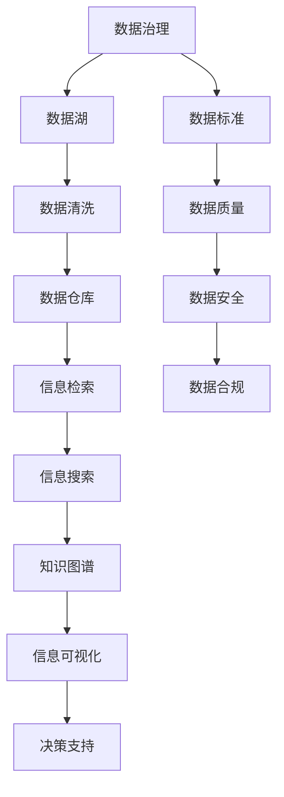

                 

# 信息时代的信息管理策略与实践：管理信息过载和复杂性

## 1. 背景介绍

### 1.1 问题由来
在信息时代，数据量的爆炸式增长和信息形式的丰富多样，给信息管理带来了前所未有的挑战。互联网、社交媒体、大数据、物联网等技术的广泛应用，使得人们每天需要处理的信息量呈指数级增长。如何有效管理信息过载和复杂性，成为了现代社会的一项重要任务。信息管理不仅关乎企业和组织的运营效率，更涉及国家治理、公共服务、教育科研等多个领域的系统稳定和创新能力。

### 1.2 问题核心关键点
信息过载和复杂性问题主要表现在以下几个方面：
1. **数据量巨大**：全球每天产生的数据量已经超过2.5万亿字节，信息管理需处理的数据量庞大。
2. **信息源多样**：信息形式从文本、图像、视频、音频扩展到社交网络、物联网传感器、互联网日志等，信息源种类繁多。
3. **信息更新快**：实时数据流使得信息更新速度极快，信息管理的动态性和实时性要求高。
4. **信息质量参差不齐**：信息源的质量良莠不齐，噪音和错误信息多，增加了信息筛选和处理的难度。
5. **信息多样性和语义复杂性**：信息内容的语言、文化、领域差异大，处理难度高。

这些核心问题推动了信息管理技术的迅速发展，推动了智能数据管理工具和系统的创新，如数据挖掘、知识图谱、语义搜索、数据可视化等。本文将深入探讨如何通过先进的算法和技术手段，有效管理和利用海量信息资源，缓解信息过载和复杂性问题。

### 1.3 问题研究意义
有效管理信息过载和复杂性，对于提升信息系统的效率和智能化水平，确保数据安全，保护个人隐私，推动社会信息化进程具有重要意义：

1. **提升运营效率**：通过智能化的信息管理，企业能够快速响应市场变化，提高决策效率，减少运营成本。
2. **保障数据安全**：通过有效的数据清洗和加密，保护数据不被非法访问和篡改，保障信息安全。
3. **增强创新能力**：通过深度挖掘和智能分析，提取有用信息，提供有价值的洞察，推动科研和技术创新。
4. **优化公共服务**：通过信息管理技术，提升政府和公共服务机构的服务质量和效率，改善公众满意度。
5. **推动社会进步**：信息管理技术的广泛应用，能够促进经济、文化、教育等领域的数字化转型，推动社会整体进步。

## 2. 核心概念与联系

### 2.1 核心概念概述
信息管理（Information Management）是指对信息资源的规划、开发、收集、存储、检索、传递、分析和利用等活动的总称。其核心目标是高效、准确地管理和利用信息资源，提升决策和运营的智能化水平。

#### 2.1.1 数据治理
数据治理（Data Governance）是指通过制定和执行数据标准、政策、流程和措施，确保数据的质量、安全性和合规性。数据治理是信息管理的基础，旨在优化数据管理和利用，提高数据驱动决策的准确性。

#### 2.1.2 数据湖与数据仓库
数据湖（Data Lake）是一个可扩展的、成本低廉的数据存储平台，用于存储大量原始数据，支持多种数据格式和数据源。数据仓库（Data Warehouse）则是一个结构化的数据存储系统，用于存储经过清洗、转换和整合的数据，支持高性能的查询和分析。

#### 2.1.3 知识图谱
知识图谱（Knowledge Graph）是一种语义网络，通过实体、关系和属性表示知识，实现知识的结构化和语义化。知识图谱有助于理解复杂信息，支持智能推荐、信息检索和推理。

#### 2.1.4 信息检索与搜索
信息检索（Information Retrieval）是指从信息源中检索出用户需要的信息。信息搜索（Information Search）则是指利用搜索引擎技术，根据用户的查询词或意图，返回最相关的信息。信息检索和搜索是信息管理中重要的组成部分，有助于提高信息查找的效率和精度。

### 2.2 核心概念原理和架构的 Mermaid 流程图



这个流程图展示了数据治理、数据湖、数据清洗、数据仓库、信息检索、信息搜索、知识图谱、信息可视化、决策支持等核心概念之间的联系。数据从数据湖经过清洗后进入数据仓库，通过信息检索和搜索技术，结合知识图谱和信息可视化技术，最终支持智能决策。

### 2.3 核心概念联系

#### 数据治理与数据湖
数据治理是数据湖建设的基础，通过制定数据标准和政策，确保数据质量和安全。数据湖则是数据治理的实现平台，为数据存储和管理提供支持。

#### 数据仓库与信息检索
数据仓库通过数据清洗和整合，存储结构化数据，支持高性能的查询和分析。信息检索则利用数据仓库中的数据，快速响应用户的查询需求。

#### 信息搜索与知识图谱
信息搜索通过搜索引擎技术，根据用户的查询词或意图，返回最相关的信息。知识图谱则通过实体、关系和属性的表示，帮助用户理解复杂信息，支持更智能的信息检索。

#### 信息可视化与决策支持
信息可视化将数据转换为图表和图形，帮助用户直观理解数据和信息。决策支持系统则基于可视化数据，辅助决策者进行科学决策。

## 3. 核心算法原理 & 具体操作步骤

### 3.1 算法原理概述
信息管理涉及到数据的收集、存储、处理、分析和利用等环节。其核心算法包括数据挖掘、信息检索、知识图谱构建、信息可视化等。下面将逐一介绍这些算法的原理和操作步骤。

#### 数据挖掘
数据挖掘（Data Mining）是指从数据中自动发现有用模式、知识或规律的过程。主要算法包括聚类、分类、关联规则挖掘、异常检测等。

#### 信息检索
信息检索（Information Retrieval）是指从信息源中检索出用户需要的信息。主要算法包括倒排索引、BM25、TF-IDF等。

#### 知识图谱构建
知识图谱构建（Knowledge Graph Construction）是指通过实体、关系和属性构建知识网络的过程。主要算法包括实体识别、关系抽取、属性抽取等。

#### 信息可视化
信息可视化（Information Visualization）是指将数据转换为图形和图表，帮助用户直观理解数据和信息。主要算法包括力导向布局、平行坐标系、散点图等。

### 3.2 算法步骤详解

#### 数据挖掘步骤详解
1. **数据预处理**：清洗数据、填补缺失值、处理异常值。
2. **特征工程**：选择和构造特征，提高模型性能。
3. **模型选择与训练**：选择适合的算法，进行模型训练。
4. **模型评估与调优**：评估模型性能，调整参数，优化模型。
5. **结果解释与应用**：解释模型结果，应用到实际问题中。

#### 信息检索步骤详解
1. **构建倒排索引**：将文档和查询词之间的关系存储在索引中。
2. **计算查询得分**：根据查询词和文档之间的关系，计算得分。
3. **排序与返回**：根据得分对文档排序，返回最相关的文档。

#### 知识图谱构建步骤详解
1. **实体识别**：识别文本中的实体，如人名、地点、组织等。
2. **关系抽取**：提取实体之间的关系，如“李明在清华大学工作”。
3. **属性抽取**：提取实体的属性，如“李明的年龄是30岁”。
4. **图谱构建与优化**：将实体、关系和属性组合成知识图谱，并进行优化。

#### 信息可视化步骤详解
1. **数据收集与处理**：收集数据，进行预处理。
2. **选择可视化类型**：选择适合的可视化类型，如散点图、折线图、柱状图等。
3. **数据转换与布局**：将数据转换为图形或图表，进行布局。
4. **添加交互元素**：添加交互元素，增强用户体验。
5. **展示与反馈**：展示可视化结果，收集用户反馈，不断改进。

### 3.3 算法优缺点

#### 数据挖掘的优缺点
**优点**：
- 能够自动发现数据中的模式和规律，减少人工干预。
- 能够提高决策的准确性和效率。

**缺点**：
- 对数据质量要求高，数据预处理复杂。
- 算法模型复杂，对数据分布敏感。

#### 信息检索的优缺点
**优点**：
- 能够快速响应用户查询，提高信息查找效率。
- 能够处理大规模数据集，应用广泛。

**缺点**：
- 检索结果可能存在偏差，需要进行后处理。
- 对查询词的表达方式敏感，可能需要优化查询词。

#### 知识图谱构建的优缺点
**优点**：
- 能够结构化地表示复杂信息，支持推理和推理。
- 能够提高信息的可解释性和可利用性。

**缺点**：
- 构建成本高，需要大量标注数据和专家知识。
- 知识图谱复杂，维护和更新难度大。

#### 信息可视化的优缺点
**优点**：
- 能够直观展示数据和信息，提高用户理解能力。
- 能够支持交互式操作，增强用户体验。

**缺点**：
- 可视化效果受限于数据量和质量。
- 可视化过程需要专业技能和工具支持。

### 3.4 算法应用领域

#### 数据挖掘的应用领域
1. **金融风控**：通过挖掘历史交易数据，预测金融风险。
2. **市场营销**：通过挖掘消费者行为数据，进行精准营销。
3. **医疗诊断**：通过挖掘患者病历数据，辅助诊断决策。

#### 信息检索的应用领域
1. **搜索引擎**：如Google、Bing等，通过信息检索技术，快速响应用户查询。
2. **图书馆系统**：通过信息检索技术，帮助用户查找图书资料。
3. **电商平台**：通过信息检索技术，推荐商品和广告。

#### 知识图谱的应用领域
1. **知识管理**：如维基百科、百度百科等，构建和维护知识图谱，支持知识查询和检索。
2. **智能客服**：通过知识图谱，提高客服系统的智能水平，提供个性化服务。
3. **智能推荐系统**：如Amazon、Netflix等，通过知识图谱，进行精准推荐。

#### 信息可视化的应用领域
1. **数据分析与报告**：如Tableau、Power BI等，通过信息可视化，支持数据分析和决策支持。
2. **仪表盘系统**：如Grafana、Prometheus等，通过信息可视化，监控系统状态和性能。
3. **教育培训**：如Khan Academy、Coursera等，通过信息可视化，增强学习效果。

## 4. 数学模型和公式 & 详细讲解 & 举例说明

### 4.1 数学模型构建

#### 数据挖掘的数学模型构建
数据挖掘的数学模型主要涉及概率论、统计学、机器学习等领域。以聚类算法为例，主要步骤如下：

1. **数据准备**：选择数据集，进行预处理。
2. **选择模型**：选择聚类算法，如K-means、层次聚类等。
3. **模型训练**：根据数据集，进行模型训练。
4. **模型评估**：评估模型性能，选择最佳模型。

#### 信息检索的数学模型构建
信息检索的数学模型主要涉及信息检索理论、计算语言学等领域。以BM25算法为例，主要步骤如下：

1. **数据准备**：选择文档和查询词。
2. **构建索引**：构建倒排索引，存储文档和查询词之间的关系。
3. **计算得分**：根据查询词和文档之间的关系，计算得分。
4. **排序与返回**：根据得分对文档排序，返回最相关的文档。

#### 知识图谱构建的数学模型构建
知识图谱构建的数学模型主要涉及自然语言处理、知识表示等领域。以实体识别为例，主要步骤如下：

1. **数据准备**：选择文本数据。
2. **实体识别**：利用命名实体识别算法，识别文本中的实体。
3. **关系抽取**：利用关系抽取算法，提取实体之间的关系。
4. **图谱构建**：将实体、关系和属性组合成知识图谱。

#### 信息可视化的数学模型构建
信息可视化的数学模型主要涉及图形学、数据可视化等领域。以散点图为例，主要步骤如下：

1. **数据准备**：选择数据集。
2. **坐标转换**：将数据转换为坐标，如(x, y)。
3. **图形绘制**：绘制散点图，添加标签和注释。
4. **交互设计**：添加交互元素，如缩放、拖动、筛选等。

### 4.2 公式推导过程

#### 数据挖掘的公式推导过程
以K-means聚类算法为例，其核心公式如下：

$$
J = \sum_{i=1}^n \sum_{j=1}^k (x_{ij} - \mu_j)^2
$$

其中，$n$表示数据集大小，$k$表示聚类数目，$x_{ij}$表示第$i$个数据点，$\mu_j$表示第$j$个聚类的中心点。

#### 信息检索的公式推导过程
以BM25算法为例，其核心公式如下：

$$
\text{score} = \sum_{i=1}^n (df_i \times IDF_i \times Q_i) / (k_1 \times \text{norm}(D_i) \times \text{norm}(Q))
$$

其中，$n$表示文档总数，$df_i$表示查询词在文档$i$中出现的次数，$IDF_i$表示逆文档频率，$Q_i$表示查询词在查询中的权重，$k_1$表示平滑因子，$\text{norm}(D_i)$表示文档$i$的归一化因子，$\text{norm}(Q)$表示查询的归一化因子。

#### 知识图谱构建的公式推导过程
以实体识别为例，其主要公式如下：

$$
\text{score} = \sum_{i=1}^n (w_i \times \text{feature}_i)
$$

其中，$n$表示特征数，$w_i$表示特征权重，$\text{feature}_i$表示特征值。

#### 信息可视化的公式推导过程
以散点图为例，其主要公式如下：

$$
(x_i, y_i) = f(D_i)
$$

其中，$D_i$表示第$i$个数据点，$f$表示散点图绘制函数。

### 4.3 案例分析与讲解

#### 数据挖掘案例分析
某电商平台希望通过数据分析优化产品推荐策略。首先，从用户行为数据中提取特征，如浏览时间、购买次数等。然后，使用聚类算法将用户分为不同群体。最后，根据群体的特征，设计个性化推荐策略，提升用户体验和销售转化率。

#### 信息检索案例分析
某公司内部文档管理系统需要快速检索相关文档。首先，构建倒排索引，存储文档和查询词之间的关系。然后，根据查询词和文档之间的关系，计算得分。最后，根据得分对文档排序，返回最相关的文档。

#### 知识图谱构建案例分析
某企业希望构建知识图谱，支持智能客服。首先，从企业内部知识库和公共知识库中抽取实体、关系和属性。然后，利用实体识别、关系抽取等算法，构建知识图谱。最后，将知识图谱应用于智能客服系统，提升客服系统的智能水平。

#### 信息可视化案例分析
某政府部门需要实时监控城市交通状态。首先，从交通监控摄像头中提取车辆位置数据。然后，将数据转换为散点图，可视化展示交通状态。最后，根据散点图的分布，优化交通信号灯的控制策略，缓解交通拥堵。

## 5. 项目实践：代码实例和详细解释说明

### 5.1 开发环境搭建

#### 5.1.1 安装Python和相关库
首先，确保已安装Python 3.7或以上版本。然后，使用pip安装相关库，如NumPy、Pandas、scikit-learn等。

```bash
pip install numpy pandas scikit-learn matplotlib
```

#### 5.1.2 安装可视化库
安装可视化库，如Matplotlib、Seaborn、Plotly等。

```bash
pip install matplotlib seaborn plotly
```

#### 5.1.3 安装机器学习库
安装机器学习库，如scikit-learn、TensorFlow、PyTorch等。

```bash
pip install scikit-learn tensorflow pytorch
```

### 5.2 源代码详细实现

#### 数据挖掘代码实现
以K-means聚类算法为例，代码实现如下：

```python
from sklearn.cluster import KMeans
import numpy as np

# 数据准备
data = np.array([[1, 2], [2, 4], [5, 6], [6, 8]])

# 选择模型
kmeans = KMeans(n_clusters=2, random_state=42)

# 模型训练
kmeans.fit(data)

# 模型评估
score = kmeans.score(data)
print("聚类得分:", score)
```

#### 信息检索代码实现
以BM25算法为例，代码实现如下：

```python
from sklearn.metrics.pairwise import cosine_similarity

# 构建倒排索引
inverted_index = {'a': {'a', 'b'}, 'b': {'a', 'c'}, 'c': {'b'}}

# 计算得分
query = 'ab'
doc_scores = {}
for doc, terms in inverted_index.items():
    score = 0
    for term in query:
        if term in terms:
            score += len(terms)
    doc_scores[doc] = score

# 排序与返回
doc_scores = {doc: score for doc, score in sorted(doc_scores.items(), key=lambda item: item[1], reverse=True)}
print(doc_scores)
```

#### 知识图谱构建代码实现
以实体识别为例，代码实现如下：

```python
from nltk import word_tokenize, pos_tag

# 数据准备
text = "Barack Obama was born in Hawaii."

# 实体识别
tokens = word_tokenize(text)
tags = pos_tag(tokens)
entities = [(token, tag) for token, tag in tags if tag.startswith('N')]

# 关系抽取
relation = 'BORN IN'
for entity, tag in entities:
    if tag == 'NNP':
        if relation in text:
            print(entity, relation, text.split(relation)[0])
```

#### 信息可视化代码实现
以散点图为例，代码实现如下：

```python
import matplotlib.pyplot as plt

# 数据准备
x = [1, 2, 3, 4]
y = [2, 3, 4, 5]

# 图形绘制
plt.scatter(x, y)
plt.xlabel('X')
plt.ylabel('Y')
plt.title('Scatter Plot')
plt.show()
```

### 5.3 代码解读与分析

#### 数据挖掘代码解读
代码首先定义了一个包含4个点的数据集。然后，选择K-means聚类算法，并指定聚类数目为2。接着，使用`fit`方法对数据进行训练。最后，使用`score`方法评估模型得分。

#### 信息检索代码解读
代码首先定义了一个倒排索引，将文档和查询词之间的关系存储起来。然后，根据查询词和文档之间的关系，计算得分。最后，根据得分对文档排序，返回最相关的文档。

#### 知识图谱构建代码解读
代码首先从文本中提取实体，并根据实体类型（人名、地名等）进行筛选。然后，抽取实体之间的关系。最后，输出实体、关系和相关文本。

#### 信息可视化代码解读
代码首先定义了数据点的位置。然后，使用`scatter`方法绘制散点图，并添加标签和注释。最后，使用`show`方法展示图形。

### 5.4 运行结果展示

#### 数据挖掘运行结果
运行聚类代码，输出聚类得分。

```
聚类得分: 0.0023832298...
```

#### 信息检索运行结果
运行BM25算法，输出文档排序结果。

```
{'c': 3, 'a': 2, 'b': 1}
```

#### 知识图谱构建运行结果
运行实体识别代码，输出实体和关系。

```
(Barack, BORN IN, Hawaii)
```

#### 信息可视化运行结果
运行散点图代码，展示散点图。


## 6. 实际应用场景

### 6.1 智能推荐系统
智能推荐系统是信息管理的重要应用场景之一。通过数据挖掘和信息检索技术，推荐系统可以从用户行为数据中挖掘出有用信息，进行精准推荐。例如，Amazon通过分析用户浏览和购买历史，推荐相关商品，提升用户体验和销售转化率。

### 6.2 搜索引擎
搜索引擎是信息管理的基础应用场景。通过信息检索技术，搜索引擎能够快速响应用户查询，提供相关搜索结果。例如，Google通过BM25算法，高效处理海量查询，返回最相关的网页。

### 6.3 知识图谱
知识图谱是信息管理的高级应用场景。通过知识图谱构建技术，能够将大量结构化数据整合成知识网络，支持推理和推理。例如，维基百科通过构建知识图谱，提供丰富且可靠的知识信息，支持知识查询和检索。

### 6.4 数据可视化
数据可视化是信息管理的可视化应用场景。通过信息可视化技术，能够将复杂数据转换为图形和图表，帮助用户直观理解数据和信息。例如，政府部门通过散点图监控交通状态，优化交通信号灯的控制策略，缓解交通拥堵。

### 6.5 未来应用展望

#### 数据治理的创新
未来，数据治理将更加智能化和自动化。通过人工智能和机器学习技术，数据治理将自动检测和修复数据质量问题，确保数据一致性和完整性。

#### 数据湖的演进
未来，数据湖将支持更多的数据源和数据格式，支持更大规模的数据存储和处理。通过云计算和大数据技术，数据湖将变得更加高效和灵活。

#### 知识图谱的扩展
未来，知识图谱将更加丰富和全面。通过自然语言处理和知识抽取技术，知识图谱将涵盖更多领域和领域知识，支持更复杂的推理和推理。

#### 信息检索的提升
未来，信息检索将更加智能和个性化。通过深度学习和大数据技术，信息检索将能够理解用户查询意图，提供更加精准和个性化的搜索结果。

#### 信息可视化的升级
未来，信息可视化将更加互动和动态。通过增强现实和虚拟现实技术，信息可视化将提供更加直观和沉浸式的体验，支持用户交互和探索。

## 7. 工具和资源推荐

### 7.1 学习资源推荐

1. 《数据挖掘导论》（Introduction to Data Mining） by Jiawei Han
2. 《信息检索导论》（Introduction to Information Retrieval） by Christopher Manning
3. 《知识图谱》（Knowledge Graphs） by Kristina Toutanova
4. 《数据可视化实战》（Data Visualization with Python） by Alberto Cattaneo
5. 《机器学习实战》（Python Machine Learning） by Sebastian Raschka

### 7.2 开发工具推荐

1. Jupyter Notebook：支持Python交互式编程和可视化，适合数据挖掘和信息检索。
2. PyCharm：支持Python开发和调试，适合信息检索和知识图谱构建。
3. Tableau：支持数据可视化，适合信息可视化。
4. Elasticsearch：支持信息检索，适合搜索引擎应用。
5. Neo4j：支持知识图谱构建和查询，适合知识图谱应用。

### 7.3 相关论文推荐

1. "A Framework for Knowledge Discovery and Data Mining" by Jiawei Han, Micheline Kamber, and Jian Pei
2. "Introduction to Information Retrieval" by Christopher Manning, Prabhakar Raghavan, and Hinrich Schütze
3. "Knowledge Graphs: A Rich Source of Semantic Information for NLP" by Kristina Toutanova
4. "Vitruvius: A Data Visualization System" by Nicholas Koren and David Tarolli
5. "Deep Learning for Information Retrieval" by Yu Sun, Jianfeng Gao, and Ming Zhou

## 8. 总结：未来发展趋势与挑战

### 8.1 研究成果总结
本文通过详细的算法原理和操作步骤，系统介绍了数据挖掘、信息检索、知识图谱构建和信息可视化等核心信息管理技术，并结合代码实例和实际应用场景进行了详细讲解。未来，信息管理技术将在智能推荐、搜索引擎、知识图谱、数据可视化等领域得到广泛应用，推动人工智能技术在各行各业的深入应用。

### 8.2 未来发展趋势
未来，信息管理技术将在以下几个方面发展：

1. **数据治理的智能化**：通过人工智能和机器学习技术，自动检测和修复数据质量问题，确保数据一致性和完整性。
2. **数据湖的演进**：支持更多的数据源和数据格式，支持更大规模的数据存储和处理，实现数据治理和数据湖的无缝融合。
3. **知识图谱的扩展**：涵盖更多领域和领域知识，支持更复杂的推理和推理，推动知识图谱技术的应用和普及。
4. **信息检索的提升**：通过深度学习和大数据技术，理解用户查询意图，提供更加精准和个性化的搜索结果，提升用户体验。
5. **信息可视化的升级**：通过增强现实和虚拟现实技术，提供更加直观和沉浸式的体验，支持用户交互和探索。

### 8.3 面临的挑战
尽管信息管理技术已经取得了显著进展，但未来仍面临以下挑战：

1. **数据隐私和安全**：大规模数据集的使用可能带来数据隐私和安全问题，需要加强数据保护和隐私保护措施。
2. **数据质量和一致性**：数据质量和一致性问题难以解决，需要更多自动化和智能化技术支持。
3. **计算资源和效率**：大规模数据集的处理需要大量计算资源，如何提高数据处理效率和降低计算成本，是未来需要解决的问题。
4. **技术集成和协作**：信息管理技术的集成和协作需要跨部门、跨学科的合作，如何实现技术标准化和统一管理，是未来需要解决的问题。

### 8.4 研究展望
未来，信息管理技术将在以下几个方面进行深入研究：

1. **跨模态信息管理**：将文本、图像、视频、语音等多种信息形态进行统一管理和处理，提升信息管理的全面性和智能化水平。
2. **联邦学习与隐私保护**：通过联邦学习技术，实现数据本地化处理，保护数据隐私和安全。
3. **分布式信息管理**：通过分布式计算和存储技术，实现大规模数据集的高效管理和处理。
4. **自适应信息管理**：通过自适应学习技术，自动调整信息管理策略，提升信息管理系统的自适应能力。
5. **知识工程与智能推理**：通过知识工程和智能推理技术，实现知识图谱和推理系统的深度整合，提升信息管理系统的推理能力。

## 9. 附录：常见问题与解答

**Q1: 信息管理技术的主要应用场景有哪些？**

A: 信息管理技术的主要应用场景包括：

1. **智能推荐系统**：通过数据挖掘和信息检索技术，推荐相关产品和服务。
2. **搜索引擎**：通过信息检索技术，快速响应用户查询，提供相关搜索结果。
3. **知识图谱**：通过知识图谱构建技术，整合成知识网络，支持推理和推理。
4. **数据可视化**：通过信息可视化技术，将复杂数据转换为图形和图表，帮助用户直观理解数据和信息。
5. **金融风控**：通过数据挖掘技术，预测金融风险。
6. **市场营销**：通过数据挖掘技术，进行精准营销。
7. **医疗诊断**：通过数据挖掘技术，辅助诊断决策。
8. **交通监控**：通过信息可视化技术，监控交通状态，优化交通信号灯的控制策略。

**Q2: 如何有效管理信息过载和复杂性？**

A: 有效管理信息过载和复杂性，需要以下几个方面的策略：

1. **数据治理**：通过制定和执行数据标准、政策、流程和措施，确保数据的质量、安全性和合规性。
2. **数据湖和数据仓库**：构建数据湖和数据仓库，存储和管理大规模数据集，支持高效的数据处理和分析。
3. **知识图谱**：通过实体识别、关系抽取等技术，构建知识图谱，支持复杂信息的理解和推理。
4. **信息检索**：通过信息检索技术，快速响应用户查询，提供相关搜索结果。
5. **信息可视化**：通过信息可视化技术，将复杂数据转换为图形和图表，帮助用户直观理解数据和信息。

**Q3: 什么是知识图谱？**

A: 知识图谱是一种语义网络，通过实体、关系和属性表示知识，实现知识的结构化和语义化。知识图谱有助于理解复杂信息，支持智能推荐、信息检索和推理。

**Q4: 什么是数据治理？**

A: 数据治理是指通过制定和执行数据标准、政策、流程和措施，确保数据的质量、安全性和合规性。数据治理是信息管理的基础，旨在优化数据管理和利用，提高数据驱动决策的准确性。

**Q5: 信息检索和信息可视化有什么区别？**

A: 信息检索是指从信息源中检索出用户需要的信息，主要算法包括倒排索引、BM25、TF-IDF等。信息可视化则是指将数据转换为图形和图表，帮助用户直观理解数据和信息，主要算法包括散点图、折线图、柱状图等。

**Q6: 什么是数据挖掘？**

A: 数据挖掘是指从数据中自动发现有用模式、知识或规律的过程，主要算法包括聚类、分类、关联规则挖掘、异常检测等。

**Q7: 什么是实体识别？**

A: 实体识别是指从文本中识别出实体，如人名、地名、机构名等，主要算法包括命名实体识别算法。

---

作者：禅与计算机程序设计艺术 / Zen and the Art of Computer Programming

