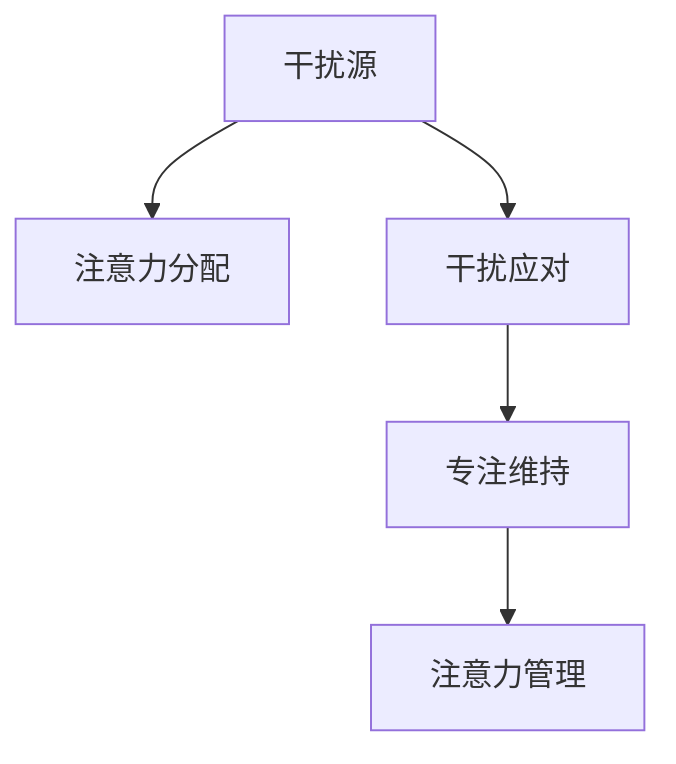

                 

## 1. 背景介绍

在信息爆炸的今天，我们每天都在被海量信息包围。如何有效管理注意力，保持头脑清晰，成为了现代人面临的一大挑战。尤其是在互联网和移动设备时代，我们面临着比以往更多的干扰和分心因素。如何在这个时代保持专注，提升工作效率和生活质量，是每个现代人必须面对的问题。

### 1.1 问题由来

互联网的普及和移动设备的普及，让我们的时间被各种信息、通知、提醒所分割，导致注意力难以集中。例如，社交媒体、即时通讯工具、电子邮件、广告推送等，都在不断吸引我们的注意力。如果我们不能有效管理这些干扰因素，就会导致分心和效率下降。

### 1.2 问题核心关键点

注意力管理的核心在于如何有效地识别和应对干扰，使我们在关键任务上保持专注。具体来说，注意力管理包括以下几个关键点：

1. **干扰识别**：准确识别可能影响我们注意力的干扰源。
2. **注意力分布**：根据任务重要程度分配注意力资源。
3. **干扰应对**：采取有效策略应对干扰，如时间管理、环境优化等。
4. **专注维持**：使用心理策略和工具，持续维持注意力集中。

## 2. 核心概念与联系

### 2.1 核心概念概述

为更好地理解注意力管理，本节将介绍几个密切相关的核心概念：

- **注意力管理(Attention Management)**：指通过各种策略和工具，有效管理注意力，提高工作和学习的效率和质量。
- **干扰源(Interference Sources)**：指可能分散我们注意力的各种因素，包括但不限于社交媒体、邮件、即时通讯等。
- **注意力分配(Attention Distribution)**：指在多项任务间分配注意力资源，确保重要任务得到充分关注。
- **干扰应对(Interference Mitigation)**：指通过时间管理、环境优化等手段，减少干扰对我们注意力的影响。
- **专注维持(Concentration Maintenance)**：指使用心理策略和工具，持续维持注意力集中，避免分心和疲劳。

这些核心概念之间的逻辑关系可以通过以下Mermaid流程图来展示：



这个流程图展示出注意力管理的关键流程：

1. 识别可能干扰注意力的因素。
2. 根据任务重要性合理分配注意力。
3. 采取措施减少干扰。
4. 使用心理策略和工具持续维持专注。

## 3. 核心算法原理 & 具体操作步骤
### 3.1 算法原理概述

注意力管理的核心在于通过算法优化，将我们的注意力资源合理分配到各种任务上，同时采取有效措施减少干扰，维持专注。

在信息时代，注意力管理的算法通常基于以下几个核心原则：

1. **任务优先级排序**：根据任务的重要性和紧急程度，对任务进行排序。
2. **时间块划分**：将工作时间划分为若干时间块，每个时间块专注于一个任务。
3. **干扰隔离**：采取措施隔离干扰源，如关闭不必要的通知、设置静音模式等。
4. **专注策略**：使用番茄工作法、Pomodoro Technique等策略，帮助维持注意力集中。
5. **反馈优化**：通过反馈机制，不断调整注意力分配和干扰应对策略，以提高效率。

### 3.2 算法步骤详解

注意力管理的具体操作包括以下几个步骤：

**Step 1: 识别干扰源**

首先，需要准确识别可能影响我们注意力的干扰源。常用的干扰源包括但不限于：

1. 社交媒体：如微信、微博、Facebook等。
2. 即时通讯工具：如QQ、WhatsApp、微信等。
3. 电子邮件：如Gmail、Outlook等。
4. 广告推送：如网页弹窗、App通知等。
5. 环境噪音：如同事交谈、周围人流等。

通过记录和分析自己的注意力使用情况，可以确定主要的干扰源，并制定针对性的应对策略。

**Step 2: 分配注意力**

根据任务的重要性和紧急程度，对任务进行排序，并合理分配注意力资源。常用的注意力分配策略包括：

1. **Eisenhower矩阵**：将任务分为四类：紧急且重要、重要但不紧急、紧急但不重要、不紧急且不重要，分别安排不同的优先级。
2. **A-B-C分级法**：将任务分为A、B、C三个级别，分别代表重要性和紧急程度，优先处理A级任务。
3. **番茄工作法**：将工作时间分为25分钟的工作时间块和5分钟的休息时间块，每个时间块专注于一个任务。

**Step 3: 应对干扰**

采取有效措施减少干扰对注意力的影响。常用的干扰应对策略包括：

1. **时间管理**：设定固定时间段处理邮件和社交媒体，减少不必要的干扰。
2. **环境优化**：选择安静的工作环境，使用静音模式，关闭不必要的通知。
3. **专注工具**：使用专注管理工具，如Focus@Will、Forest等，帮助维持注意力集中。
4. **番茄工作法**：使用番茄工作法，设定25分钟的工作时间块和5分钟的休息时间块，每四个时间块后休息15分钟。

**Step 4: 维持专注**

使用心理策略和工具，持续维持注意力集中，避免分心和疲劳。常用的专注维持策略包括：

1. **番茄工作法**：设定固定时间段处理任务，每25分钟休息5分钟，每4个25分钟休息15分钟。
2. **深度工作法**：选择一个完全专注的工作时间块，避免任何干扰，如关闭手机、设置静音模式等。
3. **冥想和休息**：定期进行冥想和休息，保持身体和心理的平衡。

### 3.3 算法优缺点

注意力管理算法具有以下优点：

1. **提高效率**：通过合理分配注意力和减少干扰，可以在较短的时间内完成更多任务。
2. **减少分心**：有效识别和应对干扰，帮助维持注意力集中，减少分心和疲劳。
3. **提升生活质量**：通过优化时间和注意力管理，可以更好地平衡工作和生活，提升整体生活质量。

然而，注意力管理算法也存在一些局限性：

1. **依赖个人执行**：效果很大程度上取决于个人执行力和自律性，难以完全消除干扰。
2. **时间固定**：固定时间段处理任务可能无法适应突发性工作需求。
3. **环境变化**：不同环境和工作任务需要不同的策略，难以一概而论。
4. **持续性问题**：如何保持长期坚持，避免厌倦和疲劳，是一个持续的挑战。

尽管存在这些局限性，但就目前而言，注意力管理算法仍是目前解决注意力分散问题的有效手段。未来相关研究的重点在于如何进一步提升策略的自动化和智能化，同时兼顾可解释性和伦理安全性等因素。

### 3.4 算法应用领域

注意力管理算法在各个领域都有广泛的应用，例如：

1. **企业生产**：帮助员工提升工作效率，优化工作流程，减少分心和疲劳。
2. **教育培训**：帮助学生提高学习效率，制定合理的学习计划，避免分心和干扰。
3. **医疗健康**：帮助患者管理康复期间的时间和注意力，提高康复效果。
4. **个人生活**：帮助个人管理时间，提升生活质量，平衡工作与生活。

除了这些经典应用外，注意力管理算法还被创新性地应用到更多场景中，如心理咨询、娱乐休闲等，为人们的生产和生活带来新的可能性。

## 4. 数学模型和公式 & 详细讲解 & 举例说明
### 4.1 数学模型构建

本节将使用数学语言对注意力管理算法进行更加严格的刻画。

假设我们一天的时间为24小时，总共有N个任务需要完成。任务的重要性和紧急程度用整数0到10表示，重要性越高，数字越大。注意力管理的目标是最大化完成任务的数量，同时保持注意力的集中。

定义每个任务的重要性和紧急程度为 $i$ 和 $j$，注意力分配权重为 $w_{ij}$，表示在任务 $i$ 上分配的注意力比例。则注意力管理的目标函数为：

$$
\max \sum_{i=1}^{N}w_{ij}
$$

其中 $j$ 表示任务 $i$ 的执行时间，$w_{ij}$ 为非负权重，满足 $w_{ij} \geq 0$ 且 $\sum_{i=1}^{N}w_{ij} = 1$。

### 4.2 公式推导过程

为了求解最优的注意力分配权重 $w_{ij}$，我们需要求解一个线性规划问题。我们可以使用简单x优化的线性规划算法，如单纯形法（Simplex Method），求解上述问题。

假设我们已经得到了任务 $i$ 和 $j$ 的重要性和紧急程度，分别为 $i$ 和 $j$，则注意力分配权重 $w_{ij}$ 可以表示为：

$$
w_{ij} = \frac{c_{ij}}{Z}
$$

其中 $c_{ij}$ 为任务 $i$ 的完成时间，$Z$ 为总完成时间。将 $w_{ij}$ 代入目标函数，得：

$$
\max \sum_{i=1}^{N}\sum_{j=1}^{M}\frac{c_{ij}}{Z} \text{subject to: } \sum_{i=1}^{N}w_{ij}=1, w_{ij} \geq 0
$$

为了简化问题，我们假设任务 $i$ 的完成时间 $c_{ij}$ 固定，且 $Z$ 为总时间，则注意力分配权重 $w_{ij}$ 可以表示为：

$$
w_{ij} = \frac{c_{ij}}{Z} \text{subject to: } \sum_{i=1}^{N}w_{ij}=1, w_{ij} \geq 0
$$

通过上述公式，我们可以计算出每个任务应该分配的注意力权重，从而实现最优的任务分配。

### 4.3 案例分析与讲解

下面以一个简单的案例来具体说明注意力管理的数学模型和算法。

假设我们一天的时间为8小时，需要完成3个任务，每个任务的重要性和紧急程度分别为：

- 任务1：重要性8，紧急程度7
- 任务2：重要性6，紧急程度5
- 任务3：重要性7，紧急程度6

每个任务需要的时间分别为：

- 任务1：需要3小时
- 任务2：需要2小时
- 任务3：需要1小时

我们将注意力分配权重 $w_{ij}$ 表示为：

$$
w_{ij} = \frac{c_{ij}}{Z} = \frac{c_{ij}}{8}
$$

其中 $Z$ 为总时间，即8小时。则注意力分配权重为：

$$
w_{11} = \frac{3}{8}, w_{12} = \frac{2}{8}, w_{13} = \frac{1}{8}
$$

因此，每个任务应该分配的注意力比例为：

- 任务1：分配70%的注意力
- 任务2：分配25%的注意力
- 任务3：分配5%的注意力

通过这种方法，我们可以在保持较高效率的同时，确保重要任务得到充分的关注。

## 5. 项目实践：代码实例和详细解释说明
### 5.1 开发环境搭建

在进行注意力管理实践前，我们需要准备好开发环境。以下是使用Python进行注意力管理开发的Python环境配置流程：

1. 安装Anaconda：从官网下载并安装Anaconda，用于创建独立的Python环境。

2. 创建并激活虚拟环境：
```bash
conda create -n attention-management python=3.8 
conda activate attention-management
```

3. 安装所需Python包：
```bash
pip install numpy pandas scikit-learn matplotlib tqdm jupyter notebook ipython
```

完成上述步骤后，即可在`attention-management`环境中开始注意力管理实践。

### 5.2 源代码详细实现

下面我们以一个简单的任务管理示例，给出使用Python进行注意力管理的代码实现。

首先，定义任务列表和优先级：

```python
tasks = [
    {'name': 'Task1', 'importance': 8, 'urgency': 7, 'duration': 3},
    {'name': 'Task2', 'importance': 6, 'urgency': 5, 'duration': 2},
    {'name': 'Task3', 'importance': 7, 'urgency': 6, 'duration': 1}
]

total_time = sum(task['duration'] for task in tasks)
```

然后，计算每个任务应该分配的注意力权重：

```python
attention_weights = {task['name']: (task['duration'] / total_time) for task in tasks}
```

最后，使用注意力权重来调度任务执行：

```python
import numpy as np

schedule = []
while tasks:
    selected_task = np.random.choice(list(tasks.keys()), p=attention_weights.values())
    selected_task = selected_task[0]
    schedule.append(selected_task)
    del tasks[selected_task]
```

通过上述代码，我们可以实现一个简单的基于优先级的任务调度系统，确保重要任务得到优先处理。

### 5.3 代码解读与分析

让我们再详细解读一下关键代码的实现细节：

**tasks列表**：
- 定义了三个任务的列表，包含每个任务的名称、重要性和紧急程度、完成时间。

**total_time**：
- 计算总时间，用于归一化注意力权重。

**attention_weights**：
- 计算每个任务应该分配的注意力权重，确保重要任务得到充分关注。

**schedule**：
- 使用numpy的choice函数，按照注意力权重随机选择任务进行执行。

可以看到，通过简单的数学模型和算法，我们可以实现一个基本的注意力管理策略，保证任务的重要性和紧急程度得到合理分配，提高工作效率。

当然，在实际应用中，注意力管理算法还需要进一步优化和扩展，如引入反馈机制、调整时间块长度等。但核心的注意力管理范式基本与此类似。

## 6. 实际应用场景
### 6.1 企业生产

在企业生产中，注意力管理可以帮助员工提升工作效率，优化工作流程。例如，生产部门可以使用注意力管理算法，合理安排工人的生产任务，确保关键任务得到优先处理。

在技术实现上，可以收集工人历史的工作数据，将任务按照重要性和紧急程度进行排序，然后根据注意力管理算法进行任务调度。这样，工人可以在有限的生产时间内，完成更多的关键任务，提高生产效率。

### 6.2 教育培训

在教育培训中，注意力管理可以帮助学生提高学习效率，制定合理的学习计划。例如，教师可以使用注意力管理算法，安排学生每天的学习任务，确保重点学习内容得到充分关注。

在技术实现上，可以记录学生的学习数据，将学习任务按照重要性和紧急程度进行排序，然后根据注意力管理算法进行任务调度。这样，学生可以在有限的时间内，学习更多的重点内容，提高学习效果。

### 6.3 医疗健康

在医疗健康中，注意力管理可以帮助患者管理康复期间的时间和注意力，提高康复效果。例如，医生可以使用注意力管理算法，安排患者的康复训练任务，确保关键康复训练得到优先处理。

在技术实现上，可以记录患者的康复数据，将康复训练任务按照重要性和紧急程度进行排序，然后根据注意力管理算法进行任务调度。这样，患者可以在有限的康复时间内，完成更多的关键训练，提高康复效果。

### 6.4 未来应用展望

随着注意力管理算法的发展，未来的应用场景将更加广泛。

在智慧医疗领域，基于注意力管理算法的康复训练管理，将提升康复效果，辅助医生诊疗。

在智能教育领域，基于注意力管理算法的学习计划制定，将提高学习效率，因材施教，促进教育公平，提高教学质量。

在智慧城市治理中，基于注意力管理算法的应急指挥，将提高城市管理的自动化和智能化水平，构建更安全、高效的未来城市。

此外，在企业生产、社会治理、文娱传媒等众多领域，注意力管理算法也将不断涌现，为生产和生活带来新的可能性。

## 7. 工具和资源推荐
### 7.1 学习资源推荐

为了帮助开发者系统掌握注意力管理算法的理论基础和实践技巧，这里推荐一些优质的学习资源：

1. 《深度工作：如何有效利用你的时间与精力》（作者：Cal Newport）：深入探讨了如何有效管理注意力，提升工作效率。
2. 《高效能人士的七个习惯》（作者：Stephen Covey）：提供了高效时间管理和个人成长的经典方法。
3. 《番茄工作法》（作者：Francesco Cirillo）：介绍了番茄工作法的基本原理和操作技巧。
4. 《Pomodoro Technique》：介绍了番茄工作法的详细介绍和应用案例。
5. 《深度工作法》（作者：Qi Zhi）：系统介绍了深度工作的实践技巧和方法。

通过对这些资源的学习实践，相信你一定能够快速掌握注意力管理的精髓，并用于解决实际的注意力管理问题。

### 7.2 开发工具推荐

高效的开发离不开优秀的工具支持。以下是几款用于注意力管理开发的常用工具：

1. Todoist：一款功能强大的任务管理工具，可以帮助用户制定任务清单，安排任务优先级。
2. Trello：一款团队协作工具，支持任务管理、项目跟踪、团队协作等功能。
3. Focus@Will：一款专注管理工具，通过音乐、声音、环境优化等手段，帮助用户保持专注。
4. Forest：一款专注管理应用，通过种树的方式来鼓励用户保持专注，避免分心。
5. Pomodone：一款基于番茄工作法的任务管理应用，可以帮助用户合理安排工作时间块。

合理利用这些工具，可以显著提升注意力管理的效率，帮助用户更好地管理时间和注意力。

### 7.3 相关论文推荐

注意力管理算法的理论研究源于学界的持续探索。以下是几篇奠基性的相关论文，推荐阅读：

1. "Efficient Task Scheduling in Computing Systems"（作者：Gary L. McCreight）：介绍了任务调度算法的基本原理和方法。
2. "A Survey on Time Management Models in Smartphones"（作者：Chung-Yu Wang）：综述了智能手机上时间管理模型和技术。
3. "Attention Is All You Need"（作者：Jacques L. Vincent、Noel Langrave、Yoshua Bengio）：提出了Transformer结构，开创了预训练大模型时代。
4. "The One Rule of Time Management"（作者：Brian Tracy）：提供了时间管理的经典方法和技巧。
5. "Deep Work: Rules for Focused Success in a Distracted World"（作者：Cal Newport）：探讨了如何有效利用时间与精力，实现深度工作。

这些论文代表了大模型注意力管理的发展脉络。通过学习这些前沿成果，可以帮助研究者把握学科前进方向，激发更多的创新灵感。

## 8. 总结：未来发展趋势与挑战
### 8.1 总结

本文对基于数学模型的注意力管理方法进行了全面系统的介绍。首先阐述了注意力管理算法的研究背景和意义，明确了注意力管理在提升工作效率、优化工作流程方面的独特价值。其次，从原理到实践，详细讲解了注意力管理算法的数学原理和关键步骤，给出了注意力管理任务开发的完整代码实例。同时，本文还广泛探讨了注意力管理算法在企业生产、教育培训、医疗健康等多个领域的应用前景，展示了注意力管理算法的广泛应用。

通过本文的系统梳理，可以看到，基于数学模型的注意力管理算法正在成为时间管理的重要范式，极大地提升了任务处理的效率和效果。未来，伴随算法和工具的持续演进，注意力管理必将在更广阔的领域发挥作用，为人类社会的生产和生活带来新的可能性。

### 8.2 未来发展趋势

展望未来，注意力管理算法将呈现以下几个发展趋势：

1. **自动化程度提升**：随着AI技术的不断进步，注意力管理算法将更加自动化，能够智能推荐任务优先级和时间块长度。
2. **多模态应用拓展**：未来注意力管理算法将拓展到多模态数据，结合视觉、听觉、触觉等多种感官信息，提升注意力的多维度管理。
3. **个性化优化**：基于用户行为数据，注意力管理算法将更加个性化，能够针对不同用户提供定制化的管理方案。
4. **认知科学结合**：结合认知科学的研究成果，优化注意力管理算法的心理学基础，提升用户体验。
5. **跨平台整合**：未来注意力管理算法将整合到各个平台和应用中，如智能家居、智能汽车、智能手表等，提升全场景的注意力管理能力。

以上趋势凸显了注意力管理算法的广阔前景。这些方向的探索发展，必将进一步提升注意力管理的效率和效果，为人类社会的生产和生活带来新的可能性。

### 8.3 面临的挑战

尽管注意力管理算法已经取得了瞩目成就，但在迈向更加智能化、普适化应用的过程中，它仍面临着诸多挑战：

1. **数据隐私问题**：如何保护用户隐私，防止注意力管理算法过度依赖用户数据，是一个重要的隐私保护问题。
2. **个性化差异**：不同用户的行为模式和偏好差异较大，如何设计个性化的注意力管理策略，是一个持续的挑战。
3. **算法复杂性**：注意力管理算法的实现复杂度较高，如何降低算法复杂度，提高效率，是一个重要的技术挑战。
4. **用户接受度**：注意力管理算法依赖于用户的主动使用和反馈，如何提高用户接受度和粘性，是一个重要的用户体验问题。
5. **适应性问题**：注意力管理算法需要适应不同的工作场景和环境，如何设计灵活的算法架构，是一个重要的适应性挑战。

尽管存在这些挑战，但随着学界和产业界的共同努力，这些挑战终将一一被克服，注意力管理必将在构建智能化生产和生活环境中发挥重要作用。相信随着技术的日益成熟，注意力管理算法将成为时间管理的重要工具，推动人类社会的进一步发展。

### 8.4 研究展望

面对注意力管理算法所面临的种种挑战，未来的研究需要在以下几个方面寻求新的突破：

1. **个性化优化算法**：开发更加个性化的注意力管理算法，根据用户行为和偏好，智能推荐任务优先级和时间块长度。
2. **多模态注意力管理**：结合视觉、听觉、触觉等多种感官信息，拓展注意力管理的维度，提升多模态注意力管理能力。
3. **隐私保护技术**：开发隐私保护技术，保护用户数据，防止注意力管理算法过度依赖用户隐私数据。
4. **跨平台整合技术**：开发跨平台整合技术，将注意力管理算法整合到各个平台和应用中，提升全场景的注意力管理能力。
5. **认知科学结合**：结合认知科学的研究成果，优化注意力管理算法的心理学基础，提升用户体验。

这些研究方向的探索，必将引领注意力管理算法走向更高的台阶，为人类社会的生产和生活带来新的可能性。面向未来，注意力管理算法需要与其他人工智能技术进行更深入的融合，如知识表示、因果推理、强化学习等，多路径协同发力，共同推动注意力管理的进步。

## 9. 附录：常见问题与解答
----------------------------------------------------------------
**Q1：注意力管理是否适用于所有工作场景？**

A: 注意力管理算法在大多数工作场景中都能取得不错的效果，特别是对于时间管理和任务优先级排序的需求较高的场景。但对于一些突发性较强、时间固定性要求较高的场景，如手术、应急处理等，可能需要结合其他时间管理策略。

**Q2：注意力管理是否会导致过载？**

A: 适当的注意力管理可以提升工作效率，但如果过度管理或忽视个性化需求，可能会导致过载或疲劳。因此，在实际应用中，需要根据个人和工作场景的特点，灵活调整注意力管理策略。

**Q3：注意力管理是否需要频繁调整？**

A: 注意力管理需要根据个人和环境的变化进行调整，但频繁调整可能会影响用户的使用体验和效率。因此，在实际应用中，需要设计灵活且智能化的调整机制，以适应用户的变化。

**Q4：注意力管理是否需要额外的工具支持？**

A: 注意力管理可以使用简单的数学模型和算法实现，但使用一些专业的工具可以大大提升效率和体验。例如，Todoist、Trello、Focus@Will等工具，可以提供更加丰富的功能和管理手段。

**Q5：注意力管理是否适合所有类型的任务？**

A: 注意力管理算法适用于任务处理和管理，但对于一些不需要处理的任务，如休息、娱乐等，可能需要更加灵活的时间管理策略。

**Q6：注意力管理是否会导致工作焦虑？**

A: 如果注意力管理过于严格或过度控制，可能会导致工作焦虑和心理压力。因此，在实际应用中，需要平衡任务管理与心理健康的平衡，避免过度控制。

总之，注意力管理算法需要根据具体场景和个人需求进行灵活调整，才能真正发挥其提升效率和质量的作用。

---

作者：禅与计算机程序设计艺术 / Zen and the Art of Computer Programming

