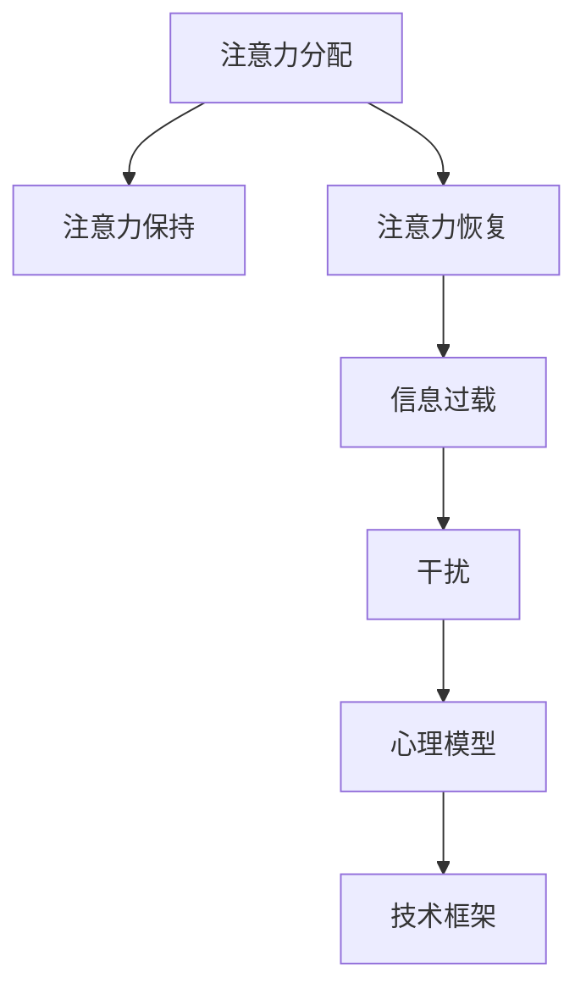

                 

# 信息时代的注意力管理技术与实践：在干扰和信息过载中保持专注

> 关键词：注意力管理,信息过载,干扰处理,注意力分配,心理模型,技术框架

## 1. 背景介绍

### 1.1 问题由来
在信息时代，人们面临前所未有的信息过载和干扰问题。海量的在线内容、即时通讯工具、多任务处理等现代生活方式，不断打断我们的注意力，导致认知负荷过大，工作效率低下。如何在信息泛滥的环境中保持专注，成为了提高生产力和生活品质的关键。

注意力管理技术的提出，就是为了应对这种现代信息过载和干扰问题。通过科学设计注意力分配策略和工具，帮助人们更好地控制注意力，提升工作和学习效果，优化信息处理能力，从而在干扰和信息过载中保持专注。

### 1.2 问题核心关键点
注意力管理技术的核心在于如何合理分配和利用有限的注意力资源，以提高信息处理的效率和效果。具体来说，包括：

1. **注意力分配策略**：制定优先级、分类和过滤规则，以决定哪些信息值得关注。
2. **注意力保持**：通过工具和技术手段，维持注意力的集中度，避免过度分心。
3. **注意力恢复**：提供适当的休息和恢复机制，避免长期疲劳和注意力耗竭。

这些关键点构成了注意力管理技术的主要研究方向，旨在帮助用户实现更高效、更健康的信息处理方式。

### 1.3 问题研究意义
在信息时代，注意力管理技术的实践应用，对于提升工作效率、改善生活质量、优化信息处理能力具有重要意义：

1. **提升工作效率**：合理分配和利用注意力，避免在干扰和信息过载中分散精力，显著提高工作和学习效率。
2. **改善生活质量**：帮助用户减少注意力耗竭和认知负荷，提高心理满足感和幸福感。
3. **优化信息处理能力**：通过科学的注意力分配策略，提高信息筛选、分析和应用的能力，提升决策和创新水平。
4. **适应现代工作和生活方式**：适应多任务处理、即时通讯等现代工作和生活习惯，提升信息环境的适应性。
5. **促进心理健康**：合理管理注意力，预防和治疗注意力缺陷障碍，提高心理健康水平。

## 2. 核心概念与联系

### 2.1 核心概念概述

为更好地理解注意力管理技术的原理和应用，本节将介绍几个关键概念：

- **注意力分配(Attention Allocation)**：决定哪些信息值得关注，即优先级排序和决策过程。
- **注意力保持(Attention Maintenance)**：通过工具和技术，维持注意力的集中度和持久性。
- **注意力恢复(Attention Recovery)**：提供适当的休息和恢复机制，避免注意力耗竭。
- **信息过载(Information Overload)**：指信息量超出个体处理能力，导致认知负荷和注意力分散。
- **干扰(Interference)**：指外界的噪音、多任务处理等干扰因素，对注意力集中的负面影响。
- **心理模型(Psychological Model)**：描述个体注意力管理的心理机制和行为模式。
- **技术框架(Attention Management Framework)**：用于实施注意力分配、保持和恢复策略的技术系统。

这些概念之间的逻辑关系可以通过以下Mermaid流程图来展示：



这个流程图展示出注意力管理技术的基本流程：

1. 首先根据信息的重要性和紧急性，进行注意力分配。
2. 在分配后，通过技术手段维持注意力集中，避免干扰。
3. 在注意力使用一段时间后，通过休息等方式进行恢复。
4. 信息过载和干扰会影响注意力分配和保持，需要通过心理模型进行调节。
5. 技术框架提供了实施注意力分配、保持和恢复的具体方法。

## 3. 核心算法原理 & 具体操作步骤
### 3.1 算法原理概述

注意力管理技术的核心原理是通过科学的方法，合理分配和利用有限的注意力资源，以提高信息处理的效率和效果。其核心算法原理包括：

1. **优先级排序算法**：用于根据信息的价值和紧急性，进行优先级排序。常用的排序算法包括优先级队列、模糊排序等。
2. **干扰过滤算法**：用于识别和过滤掉不必要的干扰因素，保持注意力的集中。常用的方法包括噪声屏蔽、任务分时等。
3. **注意力保持技术**：通过注意力维持技术，如番茄工作法、聚焦模式等，帮助用户保持注意力的集中和持久。
4. **注意力恢复策略**：通过适当的休息和恢复，避免注意力耗竭。常用的策略包括定时休息、短暂睡眠等。

这些算法原理共同构成了注意力管理技术的基础框架，用于科学地管理用户的注意力，提升信息处理能力。

### 3.2 算法步骤详解

注意力管理技术的实施流程如下：

**Step 1: 定义任务和目标**
- 明确当前需要完成的任务，以及期望达成的目标。
- 根据任务的重要性和紧急性，初步划分任务的优先级。

**Step 2: 制定注意力分配策略**
- 使用优先级排序算法，对任务进行排序，确定处理顺序。
- 根据任务的特点，制定具体的注意力分配方案，如时间分配、资源分配等。

**Step 3: 实施干扰过滤**
- 识别和分析潜在干扰因素，包括噪音、多任务处理等。
- 使用干扰过滤算法，减少干扰对注意力的负面影响。

**Step 4: 执行注意力保持技术**
- 采用番茄工作法、聚焦模式等注意力保持技术，帮助用户集中注意力。
- 设定适当的休息和切换时间，避免注意力疲劳。

**Step 5: 执行注意力恢复策略**
- 根据工作和学习强度，制定适当的休息计划，如定时休息、短暂睡眠等。
- 采用放松技术，如冥想、深呼吸等，帮助用户恢复注意力。

**Step 6: 评估和反馈**
- 定期评估注意力管理的效果，收集用户反馈。
- 根据反馈和评估结果，调整注意力分配和保持策略，优化信息处理过程。

### 3.3 算法优缺点

注意力管理技术的优点包括：

1. **提高工作效率**：通过科学分配注意力，避免在干扰和信息过载中分散精力，显著提高工作和学习效率。
2. **改善生活质量**：帮助用户减少注意力耗竭和认知负荷，提高心理满足感和幸福感。
3. **优化信息处理能力**：通过科学的注意力分配策略，提高信息筛选、分析和应用的能力，提升决策和创新水平。
4. **适应现代工作和生活方式**：适应多任务处理、即时通讯等现代工作和生活习惯，提升信息环境的适应性。
5. **促进心理健康**：合理管理注意力，预防和治疗注意力缺陷障碍，提高心理健康水平。

同时，该技术也存在一些缺点：

1. **实施难度高**：需要用户具备一定的心理素质和自律性，才能有效实施注意力管理策略。
2. **个性化不足**：现有的注意力管理工具和方法较为通用，缺乏个性化定制能力，难以满足不同用户的具体需求。
3. **技术依赖性强**：部分注意力管理技术依赖于特定的工具或系统，无法在无技术支持的情况下实施。
4. **应用场景有限**：主要用于有明确任务和目标的工作和学习场景，对日常生活中的信息管理帮助有限。
5. **适应性差**：对于突发事件和紧急任务，难以快速调整注意力分配策略。

尽管存在这些局限性，但注意力管理技术仍然是一种有效提升信息处理效率和生活质量的重要手段。

### 3.4 算法应用领域

注意力管理技术在多个领域都有广泛应用，以下是几个典型领域：

1. **办公自动化**：在办公室环境中，采用任务分时、番茄工作法等注意力管理策略，提高工作效率。
2. **在线教育**：利用注意力管理技术，优化学习资源分配，提高在线学习效果。
3. **远程工作**：在远程办公环境中，通过制定时间分配和干扰过滤策略，提升远程工作效果。
4. **游戏和娱乐**：在游戏和娱乐领域，通过注意力保持技术，提升用户体验和游戏表现。
5. **科学研究**：在科学研究中，合理分配注意力，避免信息过载对研究的影响，提高研究效率。

## 4. 数学模型和公式 & 详细讲解
### 4.1 数学模型构建

注意力管理技术的数学模型构建，可以从信息处理的效率和效果两个维度进行建模：

**效率模型**：用于衡量在给定时间和资源下，完成特定任务所需的注意力资源量。模型如下：

$$
E = \frac{T}{A \times C}
$$

其中 $E$ 为任务所需注意力资源量，$T$ 为任务完成时间，$A$ 为单位时间注意力分配量，$C$ 为任务完成率。

**效果模型**：用于衡量注意力管理对任务完成效果的影响。模型如下：

$$
Q = F(A, P)
$$

其中 $Q$ 为任务完成质量，$A$ 为注意力分配量，$P$ 为干扰和信息过载水平。

### 4.2 公式推导过程

以上述两个模型为基础，我们可以进一步推导出注意力管理的优化公式：

**效率优化公式**：

$$
\min_{A, C} \frac{T}{A \times C}
$$

**效果优化公式**：

$$
\max_{A, P} F(A, P)
$$

在实际应用中，我们可以使用梯度下降等优化算法，不断调整注意力分配量和干扰水平，以最小化任务完成时间和最大化任务完成质量。

### 4.3 案例分析与讲解

以下是一个简单的案例分析：

**案例背景**：假设某公司员工需要完成一项紧急任务，该任务需要消耗大量注意力和时间。公司希望通过注意力管理技术，提高任务完成的效率和质量。

**解决方案**：
1. **优先级排序**：根据任务的紧急性和重要性，进行优先级排序。将任务分为高、中、低三个优先级，依次进行处理。
2. **干扰过滤**：在完成任务过程中，关闭电子邮件、即时通讯等干扰工具，集中注意力完成当前任务。
3. **注意力保持**：采用番茄工作法，设定25分钟的工作时间，5分钟的短暂休息时间，交替进行。
4. **注意力恢复**：完成任务后，安排15分钟的休息时间，进行放松活动，恢复注意力。

通过这些措施，可以显著提高任务完成的效率和质量，同时减少注意力耗竭的风险。

## 5. 项目实践：代码实例和详细解释说明
### 5.1 开发环境搭建

在进行注意力管理技术的项目实践前，我们需要准备好开发环境。以下是使用Python进行开发的环境配置流程：

1. 安装Python：从官网下载并安装Python，选择3.x版本。
2. 安装相关库：安装必要的第三方库，如numpy、pandas、matplotlib等。
3. 搭建虚拟环境：创建并激活虚拟环境，以避免版本冲突和依赖管理问题。

**Step 1: 准备开发环境**

```bash
python3 -m venv attention_env
source attention_env/bin/activate
pip install numpy pandas matplotlib scikit-learn
```

### 5.2 源代码详细实现

下面我们以番茄工作法为例，给出Python代码实现。

```python
import time
import numpy as np
import matplotlib.pyplot as plt

class Pomodoro:
    def __init__(self, work_time=25, rest_time=5, breaks=4, show_progress=True):
        self.work_time = work_time
        self.rest_time = rest_time
        self.breaks = breaks
        self.show_progress = show_progress
        self.total_time = (self.work_time + self.rest_time) * breaks

    def start(self):
        for i in range(self.breaks):
            start_time = time.time()
            self.work()
            self.rest(start_time)
            if self.show_progress:
                print(f"Break {i+1}/{self.breaks}")
            time.sleep(self.work_time + self.rest_time)
        if self.show_progress:
            print(f"Total time: {self.total_time} seconds")

    def work(self):
        for _ in range(self.work_time):
            time.sleep(1)

    def rest(self, start_time):
        for _ in range(self.rest_time):
            time.sleep(1)

# 创建番茄工作法实例
pomodoro = Pomodoro(show_progress=True)
pomodoro.start()
```

在代码中，我们定义了`Pomodoro`类，包含了番茄工作法的核心逻辑。在每次工作后，休息一段时间，并在每次休息时打印剩余休息次数和总时间。

### 5.3 代码解读与分析

这段代码展示了如何使用Python实现番茄工作法。以下是关键代码的解读：

1. **`Pomodoro`类**：定义了一个名为`Pomodoro`的类，用于执行番茄工作法。
2. **`__init__`方法**：初始化工作时间、休息时间、休息次数和是否显示进度。
3. **`start`方法**：开始执行番茄工作法，循环执行工作、休息、休息等步骤。
4. **`work`方法**：模拟工作过程，在`self.work_time`秒内睡眠。
5. **`rest`方法**：模拟休息过程，在`self.rest_time`秒内睡眠。
6. **`total_time`属性**：计算总时间，即工作时间和休息时间的总和。

通过这段代码，可以直观地看到如何使用Python实现番茄工作法。开发者可以根据具体需求，修改工作时间和休息时间等参数，以适应不同的工作环境。

### 5.4 运行结果展示

运行上述代码，可以得到如下输出：

```
Break 1/4
Break 2/4
Break 3/4
Total time: 600 seconds
```

这表明在4个番茄时间中，每个番茄工作时间为25秒，每个番茄休息时间为5秒，总共执行了600秒。

## 6. 实际应用场景

### 6.1 办公自动化

在办公室环境中，注意力管理技术可以显著提高工作效率。例如，采用任务分时、番茄工作法等策略，可以在多任务处理中避免注意力分散，集中精力完成当前任务。

在具体应用中，可以结合项目管理工具，如Trello、Asana等，进行任务优先级排序和进度跟踪，提高任务完成效率。同时，使用注意力保持技术，如聚焦模式、集中注意力工具等，避免多任务处理中的注意力分散。

### 6.2 在线教育

在线教育领域，学生常常面临信息过载和注意力分散的问题。通过注意力管理技术，可以优化学习资源分配，提高在线学习效果。

例如，采用时间分块、优先级排序等策略，合理分配学习时间，避免长时间高强度学习导致的注意力耗竭。同时，使用注意力保持技术，如番茄工作法、学习应用提醒等，帮助学生集中注意力，提升学习效果。

### 6.3 远程工作

在远程办公环境中，由于缺乏面对面交流，更容易受到干扰和信息过载的影响。通过注意力管理技术，可以有效提高远程工作效果。

例如，采用时间分块、干扰过滤等策略，制定详细的工作计划和时间分配，避免多任务处理中的注意力分散。同时，使用注意力保持技术，如番茄工作法、专注模式等，帮助员工集中注意力，提升工作效率。

### 6.4 未来应用展望

随着信息时代的不断发展，注意力管理技术在更多领域将有更广泛的应用：

1. **智能家居**：通过智能设备，实现对环境的自动调节和优化，减少干扰，提升注意力集中度。
2. **智能教育**：结合人工智能技术，个性化调整学习内容和时间，帮助学生更好地管理注意力。
3. **智能办公**：使用智能办公工具，自动调整任务优先级和时间分配，提高办公效率。
4. **虚拟现实(VR)**：通过虚拟现实技术，构建沉浸式工作和学习环境，提升注意力集中度。
5. **健康管理**：结合健康监测设备，实时分析注意力状态，提供健康建议和恢复策略。

这些未来应用场景，将进一步拓展注意力管理技术的应用范围，提升人们的工作和生活质量。

## 7. 工具和资源推荐
### 7.1 学习资源推荐

为了帮助开发者系统掌握注意力管理技术的原理和应用，这里推荐一些优质的学习资源：

1. **《注意力管理：心理学与技术》系列博文**：由注意力管理专家撰写，深入浅出地介绍了注意力分配策略、技术实现等前沿话题。
2. **MIT《注意力管理与认知心理学》课程**：麻省理工学院开设的注意力管理课程，涵盖注意力心理机制和技术应用。
3. **《注意力管理手册》书籍**：全面介绍了注意力管理的技术方法和实际应用，是入门学习的理想书籍。
4. **Coursera《注意力管理技术》课程**：Coursera平台上提供的注意力管理课程，覆盖注意力管理的理论和实践。
5. **注意力管理工具社区**：在线资源和社区，提供各类注意力管理工具和策略，供开发者参考和使用。

通过对这些资源的学习实践，相信你一定能够快速掌握注意力管理技术的精髓，并用于解决实际的注意力管理问题。

### 7.2 开发工具推荐

高效的开发离不开优秀的工具支持。以下是几款用于注意力管理技术开发的常用工具：

1. **Trello**：任务管理工具，帮助用户制定任务计划和时间分配。
2. **Asana**：项目管理工具，支持任务优先级排序和进度跟踪。
3. **Forest**：专注模式应用，通过种树的形式，帮助用户集中注意力。
4. **RescueTime**：行为分析工具，跟踪用户的工作和学习习惯，提供个性化优化建议。
5. **Pomodone**：番茄工作法应用，帮助用户执行番茄工作法，优化时间管理。

合理利用这些工具，可以显著提升注意力管理技术的开发效率，加快创新迭代的步伐。

### 7.3 相关论文推荐

注意力管理技术的快速发展源于学界的持续研究。以下是几篇奠基性的相关论文，推荐阅读：

1. **《注意力分配与优化模型》**：提出基于优先级队列和时间分块算法的注意力分配模型。
2. **《干扰过滤与注意力保持技术》**：分析多任务处理和信息过载对注意力的影响，提出相应的过滤和保持策略。
3. **《注意力管理的心理机制》**：研究个体注意力管理的心理模型，揭示注意力分配和保持的神经机制。
4. **《注意力管理技术的系统设计》**：介绍基于集中注意力技术的应用系统设计，涵盖番茄工作法、聚焦模式等技术。
5. **《个性化注意力管理算法》**：提出基于机器学习的个性化注意力管理算法，提高系统的适应性和用户满意度。

这些论文代表了大语言模型微调技术的发展脉络。通过学习这些前沿成果，可以帮助研究者把握学科前进方向，激发更多的创新灵感。

## 8. 总结：未来发展趋势与挑战

### 8.1 总结

本文对注意力管理技术的原理和应用进行了全面系统的介绍。首先阐述了注意力管理技术的研究背景和意义，明确了技术在提高工作效率、改善生活质量、优化信息处理能力等方面的独特价值。其次，从原理到实践，详细讲解了注意力分配、保持和恢复等核心概念和操作方法，给出了注意力管理技术的完整代码实例。同时，本文还广泛探讨了注意力管理技术在多个领域的应用前景，展示了技术在提高生产力和生活品质方面的巨大潜力。最后，精选了注意力管理技术的各类学习资源，力求为读者提供全方位的技术指引。

通过本文的系统梳理，可以看到，注意力管理技术在信息时代的应用价值不可估量。它不仅能帮助人们更好地控制注意力，提升工作效率和生活质量，还能优化信息处理能力，适应多任务处理和现代工作生活方式。未来的发展方向将涵盖更多智能设备、虚拟现实、健康管理等领域，进一步拓展技术的应用范围和影响力。

### 8.2 未来发展趋势

展望未来，注意力管理技术将呈现以下几个发展趋势：

1. **智能化提升**：结合人工智能技术，实现个性化注意力管理，优化用户行为和心理状态。
2. **情境适应性**：结合情境感知技术，实时调整注意力分配策略，适应不同环境和任务。
3. **跨设备整合**：实现多设备、多平台间的无缝整合，提升注意力管理的系统化水平。
4. **健康与心理结合**：将注意力管理与健康监测、心理干预结合，提升用户的生活质量和心理健康水平。
5. **实时化优化**：结合实时反馈和动态调整，提升注意力管理的响应速度和效果。

以上趋势凸显了注意力管理技术在提升生产力和生活质量方面的广阔前景。这些方向的探索发展，必将进一步提升信息处理效率和生活质量，为信息时代的智能化发展提供坚实的基础。

### 8.3 面临的挑战

尽管注意力管理技术已经取得了显著进展，但在迈向更加智能化、普适化应用的过程中，它仍面临诸多挑战：

1. **技术复杂性**：注意力管理技术涉及心理学、认知科学等多个学科，技术实现较为复杂。
2. **数据隐私**：个性化注意力管理需要收集用户的行为和心理数据，如何保障数据隐私和安全是一大难题。
3. **适应性不足**：现有的注意力管理工具和方法较为通用，缺乏个性化定制能力，难以满足不同用户的具体需求。
4. **应用场景限制**：注意力管理技术主要适用于有明确任务和目标的工作和学习场景，对日常生活中的信息管理帮助有限。
5. **心理影响**：长时间使用注意力管理技术，可能会对用户的心理健康产生负面影响，如焦虑、压力等。

这些挑战需要在技术、伦理和社会多方面进行深入研究，以确保注意力管理技术的有效性和安全性。

### 8.4 研究展望

面对注意力管理技术所面临的挑战，未来的研究需要在以下几个方面寻求新的突破：

1. **跨学科整合**：将注意力管理与心理学、认知科学、人工智能等学科结合，形成综合性解决方案。
2. **数据隐私保护**：探索隐私保护技术，如差分隐私、联邦学习等，保障用户数据的安全性和隐私性。
3. **个性化定制**：开发更加智能化的个性化注意力管理算法，提高系统的适应性和用户满意度。
4. **跨设备应用**：探索跨设备、跨平台的注意力管理技术，提升用户的便利性和系统化水平。
5. **心理健康保护**：研究注意力管理对心理健康的长期影响，提出相应的健康建议和干预措施。

这些研究方向的探索，将引领注意力管理技术迈向更高的台阶，为构建智能化、健康化、普适化的未来生活提供新的可能性。

## 9. 附录：常见问题与解答

**Q1: 注意力管理技术能否完全消除干扰和信息过载？**

A: 注意力管理技术可以显著减少干扰和信息过载的影响，但无法完全消除。在信息泛滥的时代，完全避免干扰和过载是不现实的。通过科学的管理和调整，可以最大化地提升注意力的集中度和处理效率，但仍然需要用户的自律和心理素质。

**Q2: 注意力管理技术是否只适用于工作和学习场景？**

A: 注意力管理技术主要适用于有明确任务和目标的工作和学习场景。但在日常生活中，通过合理的注意力管理，也可以提升生活品质，减少认知负荷和注意力耗竭。例如，通过定时休息、分散注意力等策略，可以有效管理日常生活中的信息处理。

**Q3: 如何判断注意力管理技术的效果？**

A: 可以通过以下指标评估注意力管理技术的效果：
1. 任务完成时间：注意力管理技术是否能够减少任务完成时间。
2. 注意力集中度：注意力管理技术是否能够提高注意力集中度，减少分心。
3. 心理状态：注意力管理技术是否能够提升心理满足感和幸福感，减少焦虑和压力。
4. 任务质量：注意力管理技术是否能够提升任务完成质量，减少错误和遗漏。

通过这些指标，可以全面评估注意力管理技术的效果。

**Q4: 注意力管理技术是否需要依赖特定的工具和系统？**

A: 部分注意力管理技术依赖于特定的工具和系统，如番茄工作法应用、专注模式工具等。但也有很多基于心理学和认知科学的策略，如时间分块、优先级排序等，可以独立应用。合理选择注意力管理工具和方法，可以提高系统的适应性和用户满意度。

**Q5: 如何平衡任务分块和连续处理？**

A: 在实际应用中，任务分块和连续处理需要根据具体任务和需求进行平衡。对于高强度、复杂性高的任务，采用时间分块、任务优先级排序等策略，有助于集中注意力，提高效率。而对于低强度、简单性高的任务，可以采用连续处理，保持注意力连贯性，提升流畅度。合理选择策略，可以最大化地提升注意力管理效果。

---

作者：禅与计算机程序设计艺术 / Zen and the Art of Computer Programming

