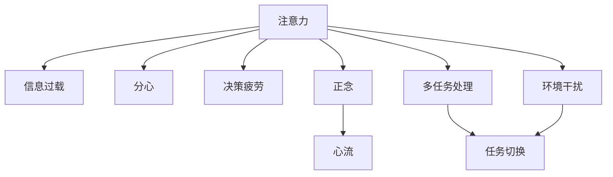

                 

## 1. 背景介绍

### 1.1 问题由来

在信息爆炸的时代，无论是工作还是生活，人们都面临着前所未有的干扰和信息压力。社交媒体、电子邮件、即时通讯等工具，虽然极大地丰富了我们的沟通方式，但也带来了严重的注意力分散问题。如何高效管理注意力，提高工作和学习的专注度，成为当前科技公司和个体面临的共同挑战。

### 1.2 问题核心关键点

信息时代的注意力管理问题主要集中在以下几个方面：

- **信息过载**：大量无用信息不断涌入，难以进行有效筛选。
- **注意力分散**：多重任务处理导致无法长时间专注在一项任务上。
- **决策困难**：大量信息带来的选择困难，难以快速做出合理决策。
- **心理压力**：不断被打扰和信息刷新，导致焦虑和压力感。

这些问题直接影响了我们的工作效率和生活质量。随着智能设备和互联网应用的普及，注意力管理问题愈发严重，亟需新的解决方案。

### 1.3 问题研究意义

高效管理注意力不仅有助于提升个人的工作学习效率，还能改善生活质量，减少心理压力。研究注意力管理方法，对于智能设备的优化设计、企业生产力的提升、社会整体的精神健康具有重要意义：

- 提升生产力：通过优化注意力管理，企业可以大幅提高员工的工作效率，缩短项目周期，降低成本。
- 改善用户体验：减少干扰，提高设备操作的流畅性和便捷性，提升用户满意度和忠诚度。
- 维护心理健康：有效的注意力管理能减轻焦虑和压力，促进身心健康，延长人的使用寿命。
- 促进社会进步：注意力管理技术的普及有助于提升社会整体的认知能力和创新能力，推动科技进步和社会发展。

## 2. 核心概念与联系

### 2.1 核心概念概述

为了更好地理解注意力管理的方法和策略，本节将介绍几个密切相关的核心概念：

- **注意力（Attention）**：大脑对特定信息或任务的集中关注程度。
- **信息过载（Information Overload）**：获取的信息超出了大脑的处理能力，导致注意力分散。
- **分心（Distraction）**：外界干扰导致注意力偏离当前任务，降低效率。
- **决策疲劳（Decision Fatigue）**：大量信息带来的决策困难，导致注意力和精力耗尽。
- **正念（Mindfulness）**：通过觉察和调节自身的注意力，达到心理平衡。
- **心流（Flow）**：在高度专注和自我驱动的状态下，完成富有创造力的工作。

这些概念之间的逻辑关系可以通过以下Mermaid流程图来展示：



这个流程图展示了一些核心概念及其之间的关系：

1. 注意力是影响信息处理的关键因素。
2. 信息过载、分心、决策疲劳都是影响注意力集中的重要因素。
3. 正念和心流是提高注意力集中度的有效手段。
4. 多任务处理和环境干扰会加剧注意力分散。

这些概念共同构成了注意力管理的理论基础，帮助我们从不同角度理解注意力管理的挑战和策略。

## 3. 核心算法原理 & 具体操作步骤
### 3.1 算法原理概述

注意力管理技术主要基于心理学和认知科学的研究成果，通过算法和工程实现，帮助个体和系统更高效地管理注意力资源。其核心思想是利用心理学的注意力理论，结合计算机科学的算法和工程实践，提供自动化的注意力干预和调节机制。

常见的注意力管理算法包括：

- **信息过滤**：通过算法对大量信息进行筛选和分类，只推送相关和重要的信息。
- **分时处理**：利用时间管理算法，对多任务进行合理的分配和切换。
- **决策支持**：利用决策树、推荐系统等技术，帮助用户做出快速有效的决策。
- **正念引导**：结合心理学和神经科学的研究，通过冥想、呼吸调节等方法引导用户进入正念状态。
- **心流增强**：利用状态跟踪和优化算法，帮助用户进入心流状态，提高创造力。

### 3.2 算法步骤详解

注意力管理的实际操作包括以下几个关键步骤：

**Step 1: 数据收集与预处理**

- 通过各种传感器和设备收集用户的行为数据，如键盘敲击、鼠标移动、屏幕亮度等。
- 对收集到的数据进行清洗和预处理，去除噪声和异常值。

**Step 2: 模型训练与适配**

- 根据用户的行为数据，训练注意力管理模型，如分类、回归、序列模型等。
- 对模型进行参数调优，确保其在特定用户群体和场景下表现最佳。

**Step 3: 注意力干预**

- 根据当前环境和任务需求，应用模型进行注意力干预，如推送相关信息、调整工作时间、提醒用户休息等。
- 实时监控用户注意力状态，调整干预策略，确保用户保持在高效工作状态。

**Step 4: 反馈与优化**

- 收集用户对注意力管理策略的反馈，调整模型参数。
- 根据用户表现，不断优化模型和策略，提高用户的满意度。

### 3.3 算法优缺点

注意力管理技术具有以下优点：

1. **自动化干预**：通过算法实现自动化的注意力管理，减少人工干预，提高效率。
2. **个性化优化**：根据用户行为和偏好，提供个性化的注意力管理策略。
3. **即时响应**：实时监控和响应用户状态，及时调整策略，提高用户体验。

同时，该技术也存在一些局限性：

1. **隐私问题**：收集和分析用户行为数据可能涉及隐私问题，需严格遵循法律法规。
2. **误判风险**：模型可能因噪声和数据偏差，导致误判和过度干预，影响用户体验。
3. **依赖性强**：注意力管理技术依赖于高精度传感器和设备，需保证设备和数据的可靠性。
4. **长期效果**：依赖用户持续使用和反馈，长期效果需要持续优化和改进。

尽管存在这些局限性，但就目前而言，注意力管理技术仍是大数据和人工智能技术在提升用户体验和生产力方面的重要应用范式。未来相关研究的方向将继续聚焦于如何提高模型的准确性和可靠性，提升用户满意度。

### 3.4 算法应用领域

注意力管理技术在多个领域得到了广泛应用，以下是一些典型的应用场景：

- **智能办公软件**：如Microsoft Office 365、Google Workspace等，通过数据分析和算法，帮助用户管理时间、任务和注意力。
- **智能家居系统**：如Amazon Alexa、Google Home等，利用语音和视觉交互，提供智能化的生活和工作辅助。
- **企业生产管理系统**：如ERP系统、项目管理软件等，通过自动化和决策支持，优化工作流程，提高生产效率。
- **个性化健康设备**：如智能手表、健身设备等，通过实时监测和数据分析，指导用户进行健康管理。
- **智能广告系统**：如Google Ads、Facebook Ads等，通过用户行为分析，精准推送广告内容，提高广告转化率。
- **智慧城市系统**：如智能交通系统、智慧能源管理等，通过实时数据监控和分析，优化城市管理，提高生活质量。

这些应用场景展示了注意力管理技术的广泛影响力和应用潜力，未来随着技术的进步和用户需求的不断变化，注意力管理技术将在更多领域得到深入探索和应用。

## 4. 数学模型和公式 & 详细讲解  
### 4.1 数学模型构建

本节将使用数学语言对注意力管理的方法进行更加严格的刻画。

记用户注意力状态为 $A(t)$，其中 $t$ 为时间戳。注意力状态由多种因素决定，包括当前任务、环境干扰、用户偏好等。设 $X(t)$ 为用户行为数据，$Y(t)$ 为注意力状态，则注意力管理的数学模型可以表示为：

$$
A(t) = f(X(t); \theta)
$$

其中 $f$ 为注意力管理模型，$\theta$ 为模型参数。

### 4.2 公式推导过程

以下我们以决策树模型为例，推导注意力管理的决策支持算法。

假设用户当前面临多个任务 $T=\{T_1, T_2, ..., T_n\}$，每个任务对应的收益为 $R=\{R_1, R_2, ..., R_n\}$，代价为 $C=\{C_1, C_2, ..., C_n\}$。用户需要选择最优的任务进行处理。

设 $P(T_i; A(t))$ 为用户在注意力状态 $A(t)$ 下选择任务 $T_i$ 的概率，根据决策树模型，有：

$$
P(T_i; A(t)) = \frac{R_i}{\sum_{j=1}^n R_j} + \delta \times C_i
$$

其中 $\delta$ 为代价的权重系数，反映用户对代价的敏感度。

根据上述模型，可以计算出用户选择每个任务的概率，从而决定当前任务的优先级。

### 4.3 案例分析与讲解

假设用户当前处于决策疲劳状态，面临两个任务：写一篇论文和回复邮件。每个任务的收益和代价如下：

| 任务         | 收益   | 代价 | 优先级   |
| ------------ | ------ | ---- | -------- |
| 写论文       | 2.5    | 3   | 高       |
| 回复邮件     | 1.2    | 0.5  | 中低     |

设 $\delta = 1$，则根据上述公式计算，用户选择写论文的概率为 $P(T_1) = \frac{2.5}{2.5+1.2} = 0.68$，选择回复邮件的概率为 $P(T_2) = \frac{1.2}{2.5+1.2} = 0.32$。

因此，用户应该首先选择写论文，以获得更高的收益。通过自动化决策支持，用户可以更高效地分配注意力，避免因决策困难导致的注意力分散。

## 5. 项目实践：代码实例和详细解释说明
### 5.1 开发环境搭建

在进行注意力管理实践前，我们需要准备好开发环境。以下是使用Python进行开发的环境配置流程：

1. 安装Anaconda：从官网下载并安装Anaconda，用于创建独立的Python环境。

2. 创建并激活虚拟环境：
```bash
conda create -n attention-env python=3.8 
conda activate attention-env
```

3. 安装PyTorch：根据CUDA版本，从官网获取对应的安装命令。例如：
```bash
conda install pytorch torchvision torchaudio cudatoolkit=11.1 -c pytorch -c conda-forge
```

4. 安装各类工具包：
```bash
pip install numpy pandas scikit-learn matplotlib tqdm jupyter notebook ipython
```

完成上述步骤后，即可在`attention-env`环境中开始注意力管理的开发。

### 5.2 源代码详细实现

这里我们以基于决策树的注意力管理模型为例，给出使用Python和Scikit-learn库进行开发的代码实现。

首先，定义决策树模型：

```python
from sklearn.tree import DecisionTreeClassifier
from sklearn.metrics import accuracy_score

# 创建决策树模型
model = DecisionTreeClassifier(max_depth=5, random_state=42)
```

然后，准备训练数据：

```python
# 准备训练数据
train_data = {'X': np.array([[2.5, 3, 1], [1.2, 0.5, 2]]), 'Y': np.array([0, 1])}
```

接着，训练模型并输出结果：

```python
# 训练模型
model.fit(train_data['X'], train_data['Y'])

# 预测用户选择任务的概率
predictions = model.predict_proba([[2.5, 3, 1]])
print(predictions)
```

最后，评估模型的准确性：

```python
# 计算模型准确率
accuracy = accuracy_score(train_data['Y'], model.predict(train_data['X']))
print(f"Accuracy: {accuracy:.2f}")
```

以上就是使用Python和Scikit-learn库进行决策树注意力管理模型开发的完整代码实现。可以看到，借助成熟的机器学习库，开发者可以快速搭建和训练注意力管理模型。

### 5.3 代码解读与分析

让我们再详细解读一下关键代码的实现细节：

**决策树模型定义**：
- `from sklearn.tree import DecisionTreeClassifier`：导入Scikit-learn中的决策树分类器。
- `model = DecisionTreeClassifier(max_depth=5, random_state=42)`：创建决策树模型，设置最大深度为5，随机种子为42。

**训练数据准备**：
- `train_data = {'X': np.array([[2.5, 3, 1], [1.2, 0.5, 2]]), 'Y': np.array([0, 1])}`：定义训练数据，其中 `X` 为任务参数，`Y` 为任务选择的概率标签。

**模型训练与预测**：
- `model.fit(train_data['X'], train_data['Y'])`：使用训练数据训练决策树模型。
- `predictions = model.predict_proba([[2.5, 3, 1]])`：预测用户选择任务的概率，其中 `predict_proba` 方法返回每个任务的概率。

**模型评估**：
- `accuracy = accuracy_score(train_data['Y'], model.predict(train_data['X']))`：计算模型准确率，其中 `accuracy_score` 方法比较预测结果与真实标签。

通过上述代码，我们可以快速搭建和使用基于决策树的注意力管理模型。当然，在实际应用中，还需要考虑更多因素，如模型选择、参数调优、性能评估等。

## 6. 实际应用场景
### 6.1 智能办公软件

智能办公软件如Microsoft Office 365、Google Workspace等，利用注意力管理技术，帮助用户更高效地管理时间和任务。通过分析用户的工作习惯和生产力数据，这些工具可以自动推荐任务优先级，提供智能提醒和决策支持，大幅提升工作效率。

具体实现上，可以集成注意力管理模型到办公软件的界面，根据用户的注意力状态和当前任务，实时调整界面的显示和提示。例如，在用户专注于写报告时，界面应尽量减少干扰，提供快速的打字提示和自动保存功能；而在用户回复邮件时，界面应显示最新的邮件通知和回复建议。

### 6.2 企业生产管理系统

企业生产管理系统，如ERP系统、项目管理软件等，通过注意力管理技术，优化生产流程和工作分配。这些系统可以收集员工的工作数据，如任务完成时间、会议时间、休息时间等，结合注意力管理模型，自动调整工作计划和任务分配，提高生产效率和员工满意度。

例如，根据员工的工作习惯和注意力状态，系统可以推荐最优的工作时间段，避免疲劳和分心。同时，系统还可以根据任务的复杂度和紧急程度，动态调整任务优先级，确保重要任务得到及时处理。

### 6.3 个性化健康设备

个性化健康设备，如智能手表、健身设备等，通过注意力管理技术，指导用户进行健康管理。这些设备可以实时监测用户的心率、血压、睡眠质量等生理指标，结合注意力管理模型，提供个性化的健康建议和调节策略。

例如，根据用户的注意力状态和睡眠模式，设备可以提醒用户进行短暂休息和冥想，帮助用户缓解压力和疲劳。同时，设备还可以根据用户的活动数据，推荐最优的锻炼计划和休息时间，提升用户的整体健康水平。

### 6.4 未来应用展望

随着注意力管理技术的不断发展，未来将在更多领域得到广泛应用，提升用户体验和生产力。以下是一些未来应用展望：

- **智能广告系统**：利用用户注意力状态，提供个性化广告推送，提高广告点击率和转化率。例如，在用户处于注意力集中的时间段，推送相关广告，提升广告效果。
- **智慧城市系统**：通过实时监测用户注意力状态，优化城市管理和服务。例如，在交通高峰期，提醒用户避开拥堵路段，选择最优出行路线，提升出行效率。
- **智能教育系统**：利用注意力管理技术，优化在线教育和培训体验。例如，根据学生的注意力状态和学习进度，动态调整教学内容和难度，提高学习效果。
- **虚拟现实系统**：通过注意力管理技术，提升虚拟现实游戏的沉浸感和互动性。例如，根据用户的注意力状态和行为数据，动态调整游戏场景和内容，增强用户体验。

总之，随着技术的不断进步和应用场景的拓展，注意力管理技术将在更多领域得到深入探索和应用，为提升人类的生产力和生活质量提供新的解决方案。

## 7. 工具和资源推荐
### 7.1 学习资源推荐

为了帮助开发者系统掌握注意力管理理论和技术，这里推荐一些优质的学习资源：

1. 《注意力：智能系统中的核心要素》（Attention is All You Need）论文：提出Transformer结构，展示了注意力机制在自然语言处理中的应用效果。

2. 《深度学习》（Deep Learning）课程：由Goodfellow等人编写，介绍了深度学习的基本概念和应用，包括注意力机制。

3. 《人工智能：现代方法》（Artificial Intelligence: A Modern Approach）书籍：由Russell和Norvig编写，系统介绍了人工智能的核心算法和技术，包括注意力机制。

4. 《注意力与认知科学》（Attention and Cognitive Science）书籍：由Glenberg等人编写，从认知科学的角度探讨注意力机制的理论基础和应用。

通过这些资源的学习实践，相信你一定能够快速掌握注意力管理的理论基础和技术细节，并用于解决实际问题。

### 7.2 开发工具推荐

高效的开发离不开优秀的工具支持。以下是几款用于注意力管理开发的常用工具：

1. Jupyter Notebook：免费的交互式编程环境，支持Python和多种数据分析库。

2. TensorFlow：由Google主导开发的深度学习框架，支持分布式计算和模型优化。

3. PyTorch：基于Python的开源深度学习框架，支持动态图和静态图两种计算图模式。

4. Scikit-learn：Python机器学习库，包含多种机器学习算法和工具。

5. NumPy：Python数值计算库，支持高效的数组和矩阵计算。

6. Matplotlib：Python绘图库，支持丰富的可视化效果。

合理利用这些工具，可以显著提升注意力管理系统的开发效率，加快创新迭代的步伐。

### 7.3 相关论文推荐

注意力管理技术的发展源于学界的持续研究。以下是几篇奠基性的相关论文，推荐阅读：

1. Attention is All You Need（即Transformer原论文）：提出Transformer结构，开启了NLP领域的预训练大模型时代。

2. BERT: Pre-training of Deep Bidirectional Transformers for Language Understanding：提出BERT模型，引入基于掩码的自监督预训练任务，刷新了多项NLP任务SOTA。

3. Google AI Blog: Attention is All You Need — a Revolutionary Approach to Natural Language Processing：详细介绍了Transformer结构在自然语言处理中的应用效果。

4. Parameter-Efficient Attention is All You Need：提出参数高效的注意力机制，在保证模型性能的同时，减少计算资源消耗。

5. Deep Residual Learning for Image Recognition：提出ResNet结构，利用残差连接解决深度网络训练问题，为注意力机制提供了理论支持。

这些论文代表了大语言模型注意力管理的最新进展，通过学习这些前沿成果，可以帮助研究者把握学科前进方向，激发更多的创新灵感。

## 8. 总结：未来发展趋势与挑战
### 8.1 总结

本文对注意力管理方法进行了全面系统的介绍。首先阐述了信息时代注意力管理的问题由来和研究意义，明确了注意力管理在提升生产力和改善用户体验方面的重要价值。其次，从原理到实践，详细讲解了注意力管理模型的构建和操作流程，给出了注意力管理任务开发的完整代码实例。同时，本文还广泛探讨了注意力管理技术在多个行业领域的应用前景，展示了其广阔的影响力和应用潜力。

通过本文的系统梳理，可以看到，注意力管理技术正在成为大数据和人工智能技术在提升用户体验和生产力方面的重要应用范式，极大地拓展了计算机应用领域的边界，促进了科技和社会的进步。

### 8.2 未来发展趋势

展望未来，注意力管理技术将呈现以下几个发展趋势：

1. **个性化增强**：结合用户行为数据和生理指标，提供更加个性化的注意力管理策略。例如，根据用户的生物钟和活动模式，动态调整工作时间和休息间隔。

2. **多模态融合**：结合视觉、听觉、触觉等多种模态数据，提供更全面、更真实的注意力状态判断。例如，通过摄像头和麦克风监测用户的表情和语调，结合生理传感器数据，综合评估用户的注意力状态。

3. **实时优化**：利用实时数据流处理技术，动态调整注意力管理策略，提高系统的响应速度和用户体验。例如，在用户注意力状态变化时，实时调整任务的优先级和提醒策略。

4. **跨平台协同**：在不同设备和应用之间实现跨平台协同，提供一致的注意力管理体验。例如，在智能手表和手机之间同步注意力状态和任务优先级，实现无缝切换。

5. **伦理和安全**：在注意力管理技术中引入伦理和安全机制，确保用户隐私和数据安全。例如，通过差分隐私技术和联邦学习，保护用户隐私，避免数据泄露。

这些趋势展示了注意力管理技术的未来发展方向，推动其在更多领域得到应用和普及。随着技术的不断进步和用户需求的不断变化，注意力管理技术将在更多场景下发挥重要作用。

### 8.3 面临的挑战

尽管注意力管理技术已经取得了显著进展，但在应用过程中仍面临一些挑战：

1. **数据隐私**：收集用户行为数据和生理指标涉及隐私问题，需严格遵守法律法规，保护用户隐私。

2. **数据噪声**：用户行为数据可能存在噪声和异常值，影响模型的准确性。

3. **模型泛化**：注意力管理模型需要适应不同场景和用户群体，保证在不同环境下的鲁棒性和泛化能力。

4. **实时性**：实时处理和调整注意力管理策略，需要高效的计算和存储能力，避免系统延迟和卡顿。

5. **用户接受度**：用户对注意力管理技术的接受程度和适应性需要持续优化，确保用户的使用体验。

6. **跨设备协同**：在不同设备和应用之间实现无缝切换和协同，需要解决兼容性和交互问题。

这些挑战需要学术界和工业界共同努力，持续优化模型和算法，提升系统的可靠性和用户体验。

### 8.4 研究展望

面对注意力管理技术面临的挑战，未来的研究需要在以下几个方面寻求新的突破：

1. **无监督和半监督学习**：利用无监督和半监督学习算法，提高模型的鲁棒性和泛化能力。例如，通过生成对抗网络和自监督学习，增强模型的泛化性和自适应能力。

2. **多模态信息融合**：结合多种传感器数据，提供更加全面和准确的注意力状态判断。例如，利用摄像头和麦克风数据，结合生理传感器数据，综合评估用户的注意力状态。

3. **实时数据处理**：采用流处理技术和边缘计算，实现实时数据采集和处理，提升系统的响应速度。

4. **跨设备协同**：开发跨平台协同框架，实现不同设备和应用之间的无缝切换和协同。

5. **用户反馈优化**：引入用户反馈机制，动态调整注意力管理策略，提高系统的适应性和用户满意度。

6. **伦理和安全保障**：在注意力管理技术中引入伦理和安全机制，确保用户隐私和数据安全。例如，通过差分隐私技术和联邦学习，保护用户隐私，避免数据泄露。

这些研究方向的探索，必将引领注意力管理技术迈向更高的台阶，为构建安全、可靠、智能的用户体验提供新的解决方案。

## 9. 附录：常见问题与解答

**Q1：注意力管理技术是否适用于所有用户？**

A: 注意力管理技术适用于大部分用户，但需注意个体差异和偏好。例如，有些用户可能对智能设备的提醒敏感度较高，需要调整提醒的频率和强度。

**Q2：注意力管理技术如何处理多任务情况？**

A: 注意力管理技术通常使用决策树、神经网络等模型，对任务进行优先级排序，并根据当前注意力状态和任务需求，动态调整任务的优先级和处理方式。例如，在用户进行多项任务时，系统可以提醒用户优先处理重要性更高的任务，避免分心和遗漏。

**Q3：注意力管理技术对用户隐私有何影响？**

A: 注意力管理技术通常需要收集用户的行为数据和生理指标，涉及隐私问题。为了保护用户隐私，系统需采用差分隐私、联邦学习等技术，确保数据安全和匿名性。同时，需严格遵守法律法规，保护用户隐私权。

**Q4：注意力管理技术在实际应用中如何提升效率？**

A: 通过自动化的注意力管理，系统可以优化任务优先级，减少用户的决策疲劳，提高工作效率。例如，根据用户的行为数据和生理指标，系统可以推荐最优的工作时间段和任务安排，避免疲劳和分心。

**Q5：注意力管理技术在未来有哪些应用前景？**

A: 随着技术的不断进步，注意力管理技术将在更多领域得到广泛应用，例如智能广告、智慧城市、虚拟现实等。通过实时监测和优化用户的注意力状态，系统可以提供更加个性化和高效的服务，提升用户的体验和生产力。

---

作者：禅与计算机程序设计艺术 / Zen and the Art of Computer Programming

