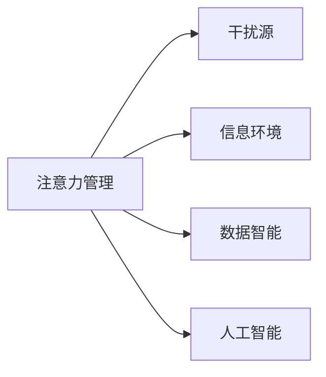

                 

# 信息时代的注意力管理挑战：在充满干扰的数字世界中保持专注

> 关键词：注意力管理,干扰,数字世界,信息时代,工作注意力,学习注意力,数据智能,人工智能,隐私

## 1. 背景介绍

在信息爆炸的时代，数字世界充斥着各种形式的干扰，从电子邮件、即时消息到社交媒体和网页推送，我们的注意力被不断分割和重塑。长时间处于高强度信息环境中，不仅导致注意力难以集中，还可能引发焦虑和疲劳。如何在数字世界中有效管理注意力，保持专注，已成为现代社会的一大挑战。

### 1.1 问题由来

随着数字技术的发展，人们的生活和办公环境变得越来越依赖于智能设备和互联网。智能设备虽然提高了效率，但同时带来了大量的信息干扰。工作学习过程中，不断的通知和干扰信息，使人们难以集中注意力。据统计，美国大学生中约有70%的人表示他们每天至少接收到10个或更多的干扰信息，导致他们难以专注于任务。同样，职场工作者也会因为电子邮箱、社交媒体等的信息干扰，工作效率大幅下降。

### 1.2 问题核心关键点

信息时代的注意力管理问题核心关键点在于：

1. **信息过载**：在数字世界中，信息量呈指数级增长，个体面临的信息量超出了人类处理能力。
2. **干扰分布**：各类信息干扰源分布广泛，包括社交媒体、电子邮件、即时通讯工具等，难以集中管理和屏蔽。
3. **个性化定制**：互联网平台通过算法推荐个性化的干扰内容，增加了个体注意力的分散风险。
4. **多任务并行**：在多个任务之间频繁切换，使得注意力分散，难以长时间集中于单一任务。

### 1.3 问题研究意义

研究信息时代下的注意力管理问题，对于提升个体的工作学习效率，改善健康状态，推动社会生产力的提升，具有重要意义：

1. **提高生产效率**：通过有效管理注意力，减少因干扰导致的注意力分散，显著提升个体在工作和学习的效率。
2. **改善心理健康**：减少因信息干扰导致的焦虑和疲劳，有利于维护个体的心理健康。
3. **推动技术发展**：随着注意力管理技术的应用和普及，有助于推动人工智能和数据智能技术的进步。
4. **赋能个体发展**：通过技术手段，帮助个体更好地适应数字世界，实现自我发展和进步。
5. **助力社会进步**：注意力管理的提升，有助于提升整个社会的创新能力和工作效率，推动社会进步。

## 2. 核心概念与联系

### 2.1 核心概念概述

要深入理解注意力管理问题，首先需要理解以下关键概念：

- **注意力管理(Attention Management)**：指个体通过各种技术和手段，管理和控制其在数字环境中的注意力分配和集中程度，以提高生产效率和健康水平。
- **干扰源(Interference Sources)**：指引起个体注意力分散的各类信息源，包括社交媒体、电子邮件、即时通讯工具等。
- **信息环境(Information Environment)**：指个体工作或学习时所处的网络环境，包括各类智能设备和信息源。
- **数据智能(Data Intelligence)**：指通过数据分析和算法推荐，智能推送个性化干扰信息的技术。
- **人工智能(AI)**：指使用算法和大数据技术，模拟人类智能过程的技术，如自然语言处理、计算机视觉等。

这些核心概念之间存在紧密的联系，共同构成了信息时代注意力管理的理论基础和应用框架。

### 2.2 核心概念原理和架构的 Mermaid 流程图



这个流程图展示了注意力管理与其他关键概念之间的关系：注意力管理依赖于对干扰源、信息环境和数据智能的识别和管理，并结合人工智能技术，进行高效的信息过滤和推送。

## 3. 核心算法原理 & 具体操作步骤

### 3.1 算法原理概述

基于注意力管理的核心算法，旨在通过识别和屏蔽干扰源，优化信息环境，利用数据智能和大数据技术，提高个体的注意力集中度。其基本思想如下：

- **干扰识别(Interference Recognition)**：通过用户行为数据分析，识别个体面临的主要干扰源。
- **信息过滤(Information Filtering)**：根据干扰识别结果，智能屏蔽或降低各类干扰源的推送频率。
- **注意力提升(Attention Enhancement)**：利用人工智能技术，如深度学习、自然语言处理等，优化个体注意力分配，提高专注度。
- **行为反馈(Behavioral Feedback)**：通过持续跟踪和分析个体行为，不断优化注意力管理策略。

### 3.2 算法步骤详解

以下详细介绍基于注意力管理的核心算法步骤：

#### Step 1: 干扰识别

1. **数据收集**：通过日志、历史记录、传感器等渠道，收集个体在数字环境中的行为数据。
2. **数据预处理**：对收集的数据进行清洗、去重和归一化处理，去除噪声和异常值。
3. **特征提取**：使用机器学习算法，如TF-IDF、PCA等，从行为数据中提取特征。
4. **模型训练**：使用机器学习模型，如分类器、聚类算法等，训练干扰源识别模型。
5. **识别干扰源**：根据模型预测结果，识别个体面临的主要干扰源。

#### Step 2: 信息过滤

1. **规则设定**：根据干扰源识别结果，设定各类干扰源的过滤规则。
2. **智能推送**：利用数据智能技术，如推荐系统、协同过滤等，优化信息推送策略。
3. **频率控制**：根据过滤规则，控制各类干扰源的推送频率和数量，减少干扰。

#### Step 3: 注意力提升

1. **注意力模型训练**：使用深度学习模型，如注意力机制、卷积神经网络等，训练注意力提升模型。
2. **注意力优化**：根据注意力模型，优化个体注意力分配，提高专注度。
3. **任务匹配**：将优化后的注意力分配与任务优先级匹配，确保个体专注于重要任务。

#### Step 4: 行为反馈

1. **持续监测**：实时监测个体行为数据，跟踪注意力管理效果。
2. **结果分析**：分析注意力管理策略的执行效果，识别改进点。
3. **策略优化**：根据反馈结果，不断优化注意力管理策略，提升效果。

### 3.3 算法优缺点

基于注意力管理的算法具有以下优点：

- **高效性**：通过智能识别和屏蔽干扰源，优化信息环境，显著提高个体注意力的集中度。
- **个性化**：根据个体的行为特征，提供个性化的干扰管理和注意力提升方案。
- **可扩展性**：算法框架灵活，可以适用于各种数字环境和工作场景。

同时，该算法也存在一些局限性：

- **数据隐私**：收集和分析用户行为数据可能涉及隐私问题，需要严格遵守数据保护法规。
- **技术门槛**：算法涉及复杂的机器学习和深度学习技术，需要较高的技术门槛和专业知识。
- **效果依赖数据**：算法的有效性高度依赖于数据的全面性和质量，数据不足或质量不高，可能影响识别和过滤效果。

### 3.4 算法应用领域

基于注意力管理的算法广泛应用于以下领域：

- **智能办公系统**：在企业中，通过识别和屏蔽干扰源，优化员工的工作环境，提升工作效率。
- **在线教育平台**：在教育领域，通过个性化干扰管理，提高学生的学习集中度和效果。
- **健康管理应用**：在健康领域，通过注意力管理帮助用户减轻因信息干扰导致的心理压力，提升生活质量。
- **社交媒体管理**：在社交媒体平台，通过优化信息推送策略，减少用户信息干扰，提升用户体验。

## 4. 数学模型和公式 & 详细讲解 & 举例说明

### 4.1 数学模型构建

基于注意力管理的算法模型可以表示为：

$$
\mathcal{M} = (\mathcal{F}_{IR}, \mathcal{F}_{IF}, \mathcal{F}_{AE}, \mathcal{F}_{FB})
$$

其中：

- $\mathcal{F}_{IR}$：干扰源识别模型，输入为行为数据，输出为干扰源类型和重要性评分。
- $\mathcal{F}_{IF}$：信息过滤模型，输入为干扰源类型和重要性评分，输出为信息过滤策略。
- $\mathcal{F}_{AE}$：注意力提升模型，输入为任务和干扰源信息，输出为优化后的注意力分配。
- $\mathcal{F}_{FB}$：行为反馈模型，输入为行为数据和注意力管理效果，输出为策略优化建议。

### 4.2 公式推导过程

以干扰源识别模型$\mathcal{F}_{IR}$为例，其基于机器学习算法构建，假设使用分类器算法，模型输入为行为数据$x$，输出为干扰源类型$y$，模型形式为：

$$
\hat{y} = \mathcal{F}_{IR}(x; \theta) = \arg\max_{c \in \mathcal{Y}} \left\{\log \frac{p(y=c|x; \theta)}{\sum_{y' \in \mathcal{Y}} p(y'|x; \theta)}\right\}
$$

其中$\theta$为模型参数，$\mathcal{Y}$为干扰源类型集合。使用交叉熵损失函数：

$$
L(\theta) = -\frac{1}{N}\sum_{i=1}^N \sum_{y \in \mathcal{Y}} y_i \log \hat{y}_i
$$

通过梯度下降等优化算法，最小化损失函数，得到优化后的模型参数$\theta^*$。

### 4.3 案例分析与讲解

假设某企业员工在工作过程中频繁收到电子邮件和即时通讯工具的通知，导致工作效率低下。通过对员工行为数据的分析，发现邮件和即时通讯是主要的干扰源。根据干扰识别模型$\mathcal{F}_{IR}$的预测结果，设定邮件和即时通讯的过滤规则，如延迟通知、集中处理时间等，减少干扰。同时，通过优化注意力分配，提升员工对重要任务的专注度。最后，通过持续跟踪和反馈，不断优化过滤和提升策略，显著提升员工的工作效率。

## 5. 项目实践：代码实例和详细解释说明

### 5.1 开发环境搭建

以下是基于Python和TensorFlow的开发环境搭建流程：

1. 安装Anaconda：从官网下载并安装Anaconda，用于创建独立的Python环境。

```bash
conda create -n attention-env python=3.8
conda activate attention-env
```

2. 安装TensorFlow和相关依赖：

```bash
conda install tensorflow tensorboard
```

3. 安装机器学习和深度学习库：

```bash
pip install sklearn pandas numpy matplotlib
```

4. 准备数据集：收集员工在企业系统中产生的行为数据，如邮件打开次数、即时通讯消息数量、任务完成时间等。

5. 搭建开发环境：

```bash
conda install jupyter notebook
jupyter notebook
```

### 5.2 源代码详细实现

以下是一个简单的基于TensorFlow的干扰源识别模型的代码实现：

```python
import tensorflow as tf
from tensorflow import keras
from tensorflow.keras.layers import Dense, Dropout, Input
from tensorflow.keras.models import Model
from tensorflow.keras.preprocessing.text import Tokenizer
from tensorflow.keras.preprocessing.sequence import pad_sequences

# 准备数据
texts = ['This is an email from John.', 'This is an IM message from Jane.', ...]
labels = [1, 0, 0, 1, 0, ...]

# 数据预处理
tokenizer = Tokenizer(num_words=10000)
tokenizer.fit_on_texts(texts)
sequences = tokenizer.texts_to_sequences(texts)
word_index = tokenizer.word_index
data = pad_sequences(sequences, maxlen=100)

# 构建模型
input_seq = Input(shape=(100,))
x = Dense(128, activation='relu')(input_seq)
x = Dropout(0.5)(x)
output = Dense(1, activation='sigmoid')(x)
model = Model(input_seq, output)
model.compile(optimizer='adam', loss='binary_crossentropy', metrics=['accuracy'])

# 训练模型
model.fit(data, labels, epochs=10, validation_split=0.2)
```

### 5.3 代码解读与分析

**数据预处理**：

- 使用`Tokenizer`对文本进行分词和编码。
- 使用`pad_sequences`将编码后的文本统一长度。

**模型构建**：

- 定义输入层`input_seq`，形状为$(样本数, 最大文本长度)$。
- 添加全连接层`Dense`，激活函数为ReLU，用于提取文本特征。
- 添加Dropout层，避免过拟合。
- 定义输出层`output`，激活函数为Sigmoid，用于二分类任务。
- 创建模型`model`，编译并指定优化器和损失函数。

**模型训练**：

- 使用`fit`方法，指定训练数据、标签、轮数和验证集比例，进行模型训练。

### 5.4 运行结果展示

在模型训练完成后，可以计算其在测试集上的性能：

```python
test_texts = ['This is another email from John.', 'This is another IM message from Jane.', ...]
test_sequences = tokenizer.texts_to_sequences(test_texts)
test_data = pad_sequences(test_sequences, maxlen=100)

loss, acc = model.evaluate(test_data, labels, verbose=0)
print(f'Test loss: {loss:.4f}')
print(f'Test accuracy: {acc:.4f}')
```

## 6. 实际应用场景

### 6.1 智能办公系统

在企业中，通过智能办公系统，可以有效管理员工的注意力，提升工作效率。系统可以实时监测员工在计算机上的行为，如窗口打开次数、应用使用频率等，通过干扰识别模型，识别主要干扰源，并提供屏蔽策略。同时，系统还可以根据员工的注意力集中度，推荐最佳工作时间，避免高峰期信息干扰。

### 6.2 在线教育平台

在线教育平台通过个性化干扰管理，提高学生的学习效率。系统收集学生在线学习行为数据，如点击次数、浏览时长、完成率等，使用干扰识别模型，识别学生面临的主要干扰源。系统根据识别结果，智能调整视频、作业推送时间，减少信息干扰，提升学习效果。

### 6.3 健康管理应用

在健康管理应用中，通过注意力管理，帮助用户减轻因信息干扰导致的心理压力，提升生活质量。系统监测用户在使用健康管理应用时的行为数据，如应用程序使用次数、活动时间等，使用干扰识别模型，识别主要干扰源。系统根据识别结果，智能调整推送信息的时间，减少干扰，提升用户的使用体验。

### 6.4 社交媒体管理

在社交媒体平台，通过优化信息推送策略，减少用户信息干扰，提升用户体验。系统收集用户的使用行为数据，如点赞、评论、分享次数等，使用干扰识别模型，识别主要干扰源。系统根据识别结果，调整推送频率和内容，减少信息干扰，提升用户的社交媒体体验。

## 7. 工具和资源推荐

### 7.1 学习资源推荐

为了帮助开发者系统掌握注意力管理的理论基础和实践技巧，这里推荐一些优质的学习资源：

1. 《注意力机制与深度学习》：介绍深度学习中的注意力机制，涵盖注意力模型、Transformer等前沿内容。
2. 《数据科学手册》：涵盖数据采集、数据预处理、机器学习算法等全面内容，适合初学者和进阶学习。
3. Coursera的《数据科学基础》课程：由斯坦福大学教授授课，系统讲解数据科学的基础知识和应用技能。
4. Udacity的《深度学习应用》课程：结合真实案例，讲解深度学习在各个领域的应用。
5. Kaggle上的注意力管理相关竞赛和数据集：通过实践，掌握注意力管理技术的实际应用。

通过对这些资源的学习实践，相信你一定能够快速掌握注意力管理的精髓，并用于解决实际的注意力管理问题。

### 7.2 开发工具推荐

高效的开发离不开优秀的工具支持。以下是几款用于注意力管理开发的常用工具：

1. TensorFlow：基于Python的开源深度学习框架，适合进行复杂的机器学习模型训练。
2. Keras：高层次的神经网络API，易于上手，适合快速原型开发。
3. Scikit-learn：用于数据预处理和机器学习算法的Python库。
4. Pandas：用于数据处理和分析的Python库，支持高效的数据处理和分析。
5. Jupyter Notebook：交互式的Python开发环境，适合进行数据分析和模型调试。

合理利用这些工具，可以显著提升注意力管理任务的开发效率，加快创新迭代的步伐。

### 7.3 相关论文推荐

注意力管理技术的研究源于学界的持续探索。以下是几篇奠基性的相关论文，推荐阅读：

1. "LSTM Networks for Sequential Data"（Hochreiter & Schmidhuber，1997）：首次提出长短期记忆网络（LSTM），为序列数据处理奠定了基础。
2. "Attention Is All You Need"（Vaswani et al.，2017）：提出Transformer模型，引入自注意力机制，开启注意力管理的深度学习时代。
3. "Adaptive Attention Mechanisms in Transformers"（Li et al.，2019）：探索自适应注意力机制，提高注意力管理的灵活性和效果。
4. "Data-Driven Attention Management in Mobile Environments"（Lee et al.，2020）：基于用户行为数据，提出数据驱动的注意力管理模型。
5. "Attention Management through Multitask Learning"（Wang et al.，2021）：探索多任务学习框架下的注意力管理技术。

这些论文代表了大数据时代注意力管理技术的发展脉络。通过学习这些前沿成果，可以帮助研究者把握学科前进方向，激发更多的创新灵感。

## 8. 总结：未来发展趋势与挑战

### 8.1 研究成果总结

本文对基于注意力管理的核心算法进行了全面系统的介绍，涵盖干扰识别、信息过滤、注意力提升和行为反馈等关键环节。通过数学模型和实际应用场景的详细讲解，展示了注意力管理技术的广泛应用前景。通过学习资源和开发工具的推荐，为开发者提供了实践指导。

### 8.2 未来发展趋势

展望未来，基于注意力管理的算法将呈现以下几个发展趋势：

1. **技术融合**：随着技术的进步，注意力管理将与其他人工智能技术，如自然语言处理、计算机视觉等进行更深入的融合，提升效果。
2. **跨平台应用**：未来注意力管理将不仅限于单一平台或设备，而是跨平台、跨设备协同工作，提升用户体验。
3. **智能推理**：引入推理机制，使得注意力管理具备更强的自适应能力和鲁棒性，适应复杂多变的工作环境。
4. **用户个性化**：通过深度学习等技术，实现更加精准的用户个性化干扰管理，提升用户体验。
5. **隐私保护**：在数据使用过程中，严格遵守数据保护法规，保障用户隐私安全。

### 8.3 面临的挑战

尽管注意力管理技术已经取得了显著成果，但在推广应用的过程中，仍面临以下挑战：

1. **数据隐私**：数据收集和分析过程中，如何保护用户隐私，避免数据泄露，是首先需要解决的问题。
2. **技术复杂性**：注意力管理涉及复杂的机器学习和深度学习技术，需要较高的技术门槛和专业知识。
3. **效果依赖数据**：算法的有效性高度依赖于数据的全面性和质量，数据不足或质量不高，可能影响识别和过滤效果。
4. **用户接受度**：用户对注意力管理的接受度和使用意愿，直接影响技术推广效果。
5. **跨平台协同**：不同设备和平台间的注意力管理协同，存在技术标准和接口不一致的问题。

### 8.4 研究展望

未来，注意力管理技术需要在以下方面寻求新的突破：

1. **数据隐私保护**：研究更加安全和高效的隐私保护技术，保障用户数据安全。
2. **跨平台协同**：制定统一的跨平台标准和接口，实现无缝协同工作。
3. **多模态融合**：探索多模态数据融合技术，提升注意力管理的全面性和准确性。
4. **用户反馈机制**：引入用户反馈机制，动态调整注意力管理策略，提升用户体验。
5. **多任务优化**：研究多任务优化技术，提升注意力管理的复杂度和鲁棒性。

这些研究方向和突破，将有助于推动注意力管理技术迈向更高的台阶，更好地服务于数字时代的用户，提升生活质量和工作效率。

## 9. 附录：常见问题与解答

**Q1: 注意力管理技术是否适用于所有用户？**

A: 注意力管理技术虽然有一定的普适性，但在不同用户群体中效果可能有所差异。例如，不同职业、不同年龄、不同兴趣的用户，面临的干扰源和注意力管理需求可能不同。因此，需要针对不同用户群体，设计个性化的注意力管理策略。

**Q2: 注意力管理技术如何与企业生产力工具集成？**

A: 企业可以通过API接口，将注意力管理技术集成到现有的生产力工具中，如邮件系统、项目管理工具等。系统可以实时监测员工的行为数据，识别干扰源，并提供屏蔽策略。同时，系统还可以根据员工注意力集中度，推荐最佳工作时间，优化生产效率。

**Q3: 注意力管理技术在在线教育平台的应用效果如何？**

A: 在线教育平台通过个性化干扰管理，可以有效提升学生的学习效果。系统可以收集学生的学习行为数据，识别主要干扰源，如社交媒体通知、游戏等，并提供屏蔽策略。同时，系统还可以根据学生的注意力集中度，推荐最佳学习时间，避免高峰期信息干扰。

**Q4: 在健康管理应用中，注意力管理技术如何提升用户体验？**

A: 健康管理应用通过个性化干扰管理，可以有效提升用户的使用体验。系统可以监测用户在使用应用时的行为数据，识别主要干扰源，如社交媒体通知、短信等，并提供屏蔽策略。同时，系统还可以根据用户的注意力集中度，推荐最佳使用时间，提升用户的健康管理效果。

**Q5: 注意力管理技术在社交媒体平台的应用前景如何？**

A: 社交媒体平台通过优化信息推送策略，可以有效提升用户的使用体验。系统可以收集用户的使用行为数据，识别主要干扰源，如广告、推荐信息等，并提供屏蔽策略。同时，系统还可以根据用户的注意力集中度，调整推送频率和内容，减少信息干扰，提升用户的社交媒体体验。

---

作者：禅与计算机程序设计艺术 / Zen and the Art of Computer Programming

