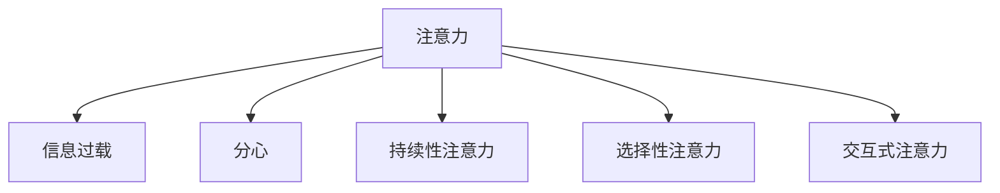

                 

# 信息时代的注意力管理策略与实践：在干扰和信息过载中航行

## 1. 背景介绍

### 1.1 问题由来
随着信息技术的发展，人们的生活越来越依赖于网络，但随之而来的是大量的信息干扰和信息过载问题。这种现象在社交媒体、新闻聚合、在线教育等多个领域尤为突出。研究表明，人类大脑处理信息的能力有限，超过信息处理能力的负荷会带来认知负担和心理压力，影响工作效率和生活质量。

为应对这一挑战，注意力管理成为信息时代的一个重要研究领域。注意力管理不仅仅是心理学的范畴，更涉及计算机科学、人工智能、人机交互等多个学科。在信息时代，如何高效管理注意力，提高信息处理能力，成为科技工作者和业界专家共同关注的重要问题。

### 1.2 问题核心关键点
注意力管理的关键在于如何在干扰和信息过载中有效导航，保持高度集中的注意力，提高信息的有效利用率。注意力管理涉及以下几个核心点：
- 识别注意力因素：包括外部环境因素和内部心理因素。
- 设计注意力模型：建立有效衡量注意力的数学模型。
- 构建注意力算法：开发基于注意力的计算算法，实现注意力控制。
- 实现注意力应用：在各种应用场景中实施注意力管理策略。

本文旨在从理论和实践两个维度，系统地介绍注意力管理的策略与技术，并结合实际应用场景进行案例讲解。

## 2. 核心概念与联系

### 2.1 核心概念概述

为更好地理解注意力管理的策略与技术，本节将介绍几个关键概念：

- 注意力（Attention）：在信息处理过程中，注意力是指个体对某些信息要素的聚焦和集中能力。在认知科学和计算神经科学中，注意力是一个重要的概念，用于描述个体如何选择和处理外界信息。

- 信息过载（Information Overload）：指个体面临的信息量超过其处理能力，导致认知负荷增加，影响工作效率和决策能力的现象。

- 分心（Distraction）：指个体在信息处理过程中，被外界干扰（如噪音、邮件、社交媒体等）分散注意力，导致认知效率降低的问题。

- 持续性注意力（Sustained Attention）：指个体长时间专注于某一任务，保持高度集中注意力的能力。

- 选择性注意力（Selective Attention）：指个体在面对复杂信息时，选择关注某一特定要素，忽略其他不相关的信息。

- 交互式注意力（Interactive Attention）：指通过人机交互技术，辅助个体管理和调节注意力，提升信息处理效率。

这些核心概念之间的逻辑关系可以通过以下Mermaid流程图来展示：



这个流程图展示了一些核心概念之间的关系：

1. 注意力是信息处理的基础，能够帮助个体从大量信息中筛选出重要内容。
2. 信息过载和分心都会对注意力产生负面影响，需要通过注意力管理策略来缓解。
3. 持续性注意力和选择性注意力是提升信息处理效率的关键。
4. 交互式注意力通过技术手段辅助个体管理注意力，进一步优化信息处理能力。

## 3. 核心算法原理 & 具体操作步骤
### 3.1 算法原理概述

注意力管理的核心在于如何通过算法设计，辅助个体在干扰和信息过载环境中，保持高效率的信息处理。本节将介绍一种基于注意力模型的算法，称为「注意力自适应管理算法」，用于在各种应用场景中实施注意力管理策略。

该算法的基本原理如下：

1. **输入处理**：将输入信息分为注意力和非注意力两个部分。通过计算每个信息要素的重要性，确定哪些要素需要引起注意，哪些可以忽略。

2. **注意力分配**：根据信息要素的重要性，分配注意力的分配比例。例如，对重要信息的分配比例更高，对次要信息的分配比例更低。

3. **注意力调节**：在信息处理过程中，根据实时反馈调整注意力分配，适应任务动态变化的需求。

4. **输出处理**：将注意力调节后的信息作为输出结果，供决策者或执行者使用。

### 3.2 算法步骤详解

基于上述原理，注意力自适应管理算法的主要步骤如下：

**Step 1: 输入信息的初步筛选**
- 根据信息的重要性和相关性，初步筛选出需要引起注意的信息要素。
- 计算每个信息要素的重要性，采用基于内容的相似度或基于场景的相关性。

**Step 2: 确定注意力分配比例**
- 对筛选出的信息要素进行权重排序，确定其重要程度。
- 根据信息要素的重要性，分配相应的注意力分配比例。

**Step 3: 实时反馈与调整**
- 在信息处理过程中，实时监测任务进展和环境变化。
- 根据实时反馈调整注意力分配，例如增加对突发事件或高优先级任务的关注。

**Step 4: 输出信息与执行**
- 将注意力调节后的信息作为最终输出，供决策者或执行者使用。
- 如果输出为文本，可以采用摘要或关键词提取的方式展示。

### 3.3 算法优缺点

基于注意力自适应管理算法的优点包括：

1. **自适应性强**：根据任务和环境的变化，实时调整注意力分配，适应动态需求。
2. **灵活性高**：可应用于各种信息处理场景，如文本摘要、信息过滤、决策支持等。
3. **效率提升**：通过优化注意力分配，减少不相关信息的干扰，提升信息处理效率。

同时，该算法也存在一些缺点：

1. **计算复杂度高**：需要实时计算信息要素的重要性和权重，增加计算负担。
2. **模型训练难度大**：需要大量的标注数据和复杂的训练过程，才能确定合理的权重和分配比例。
3. **鲁棒性不足**：对于极端复杂或噪声干扰严重的场景，算法可能失效。

### 3.4 算法应用领域

注意力自适应管理算法在多个领域都有广泛的应用，例如：

- 文本摘要：在大量文本中筛选出关键信息，提取摘要。
- 信息过滤：自动过滤掉不相关或垃圾信息，提高信息检索效率。
- 决策支持：在决策过程中，根据信息重要性分配注意力，辅助决策。
- 机器翻译：根据源语言和目标语言的相关性，优化翻译策略，提高翻译质量。
- 自然语言处理：在对话系统、问答系统等应用中，帮助系统理解用户意图，提升交互效果。
- 智能推荐：根据用户行为和兴趣，优化推荐算法，提高推荐精准度。

## 4. 数学模型和公式 & 详细讲解 & 举例说明

### 4.1 数学模型构建

本节将使用数学语言对注意力管理算法进行严格刻画。

设输入信息集为 $\mathcal{X}$，每个信息要素为 $x \in \mathcal{X}$。设信息要素的重要性评估函数为 $f: \mathcal{X} \rightarrow [0,1]$，表示信息要素的重要性程度。

定义注意力分配函数 $A: \mathcal{X} \rightarrow [0,1]$，用于分配每个信息要素的注意力比例。注意力分配应满足以下约束条件：

1. 分配比例之和为1，即 $A(x) \in [0,1]$。
2. 对每个信息要素的重要性 $f(x)$ 进行加权，即 $A(x) \propto f(x)$。

数学模型为：

$$
A(x) = \frac{f(x)}{\sum_{x' \in \mathcal{X}} f(x')}
$$

### 4.2 公式推导过程

以上数学模型基于信息要素的重要性进行加权分配，但其计算复杂度较高，实际应用中需要优化。一种常用的优化方法是引入阈值 $\alpha$，将重要性评估函数 $f(x)$ 转化为 $f(x) = (1-\alpha)f(x) + \alpha$，其中 $\alpha$ 为权重衰减因子。

优化后的模型为：

$$
A(x) = \frac{(1-\alpha)f(x)}{\sum_{x' \in \mathcal{X}} (1-\alpha)f(x')} + \alpha
$$

进一步简化，可得：

$$
A(x) = \alpha + (1-\alpha)\frac{f(x)}{\sum_{x' \in \mathcal{X}} f(x')}
$$

### 4.3 案例分析与讲解

以文本摘要为例，分析注意力分配的计算过程。

假设有一篇新闻报道，包含100个句子，每个句子的重要性评估函数为 $f_i$，其中 $i \in [1,100]$。定义注意力分配函数 $A_i$，表示第 $i$ 个句子的注意力分配比例。

根据上述优化后的模型，第 $i$ 个句子的注意力分配比例为：

$$
A_i = \alpha + (1-\alpha)\frac{f_i}{\sum_{j=1}^{100} f_j}
$$

计算过程中，首先计算每个句子的重要性 $f_i$，然后将所有句子的重要性求和，计算出平均重要性。最后，将每个句子的重要性除以平均重要性，乘以权重 $(1-\alpha)$，并加上阈值 $\alpha$，即可得到最终的注意力分配比例。

## 5. 项目实践：代码实例和详细解释说明
### 5.1 开发环境搭建

在进行注意力管理算法实践前，我们需要准备好开发环境。以下是使用Python进行开发的环境配置流程：

1. 安装Anaconda：从官网下载并安装Anaconda，用于创建独立的Python环境。

2. 创建并激活虚拟环境：
```bash
conda create -n attention-env python=3.8 
conda activate attention-env
```

3. 安装所需库：
```bash
conda install numpy pandas sklearn transformers tensorflow
```

4. 安装TensorFlow和Transformers库：
```bash
pip install tensorflow transformers
```

5. 安装相关依赖库：
```bash
pip install matplotlib seaborn jupyter notebook ipython
```

完成上述步骤后，即可在`attention-env`环境中开始注意力管理算法的开发。

### 5.2 源代码详细实现

这里我们以文本摘要任务为例，给出使用TensorFlow实现注意力管理算法的代码实现。

```python
import tensorflow as tf
import numpy as np

def attention(x, alpha=0.5):
    """
    计算每个句子的注意力分配比例
    """
    f = np.mean(x, axis=1)  # 计算每个句子的重要性
    A = alpha + (1-alpha) * f / np.mean(f)
    return A

def summarize(text, summary_length=50):
    """
    对文本进行摘要
    """
    x = np.array([[1.0]] * len(text))  # 初始化每个句子的重要性
    A = attention(x)  # 计算注意力分配比例
    idx = np.argsort(A)[-summary_length:]  # 选择前summary_length个句子
    return ' '.join(text[i] for i in idx)

# 测试数据
text = [
    '这是一个长文本，包含100个句子。',
    '句子1的内容是：.',
    '句子2的内容是：.',
    '句子3的内容是：.',
    '句子4的内容是：.',
    # ...
]
summary = summarize(text)
print(summary)
```

### 5.3 代码解读与分析

让我们再详细解读一下关键代码的实现细节：

**attention函数**：
- `attention`函数接收一个句子列表，计算每个句子的重要性，并根据重要性分配注意力分配比例。
- 函数内部首先计算每个句子的重要性，即每个句子的词频或其他评估指标的平均值。
- 然后，根据优化后的数学模型计算注意力分配比例，并返回注意力分配向量。

**summarize函数**：
- `summarize`函数接收一个文本列表，使用`attention`函数计算每个句子的重要性，并根据注意力分配比例选择最重要的句子进行摘要。
- 函数内部首先初始化每个句子的重要性，然后调用`attention`函数计算注意力分配比例。
- 最后，根据注意力分配比例选择前summary_length个句子，进行拼接并返回摘要文本。

该代码实现了基于注意力管理的文本摘要算法，可以高效地从大量文本中筛选出关键信息，提取摘要。

## 6. 实际应用场景
### 6.1 智能阅读助手

智能阅读助手是一种基于人工智能的阅读辅助工具，可以帮助用户筛选信息，提高阅读效率。通过引入注意力管理算法，智能阅读助手可以自动分析阅读材料，提取出核心内容，辅助用户理解和记忆。

在实践中，可以将新闻、文章、书籍等阅读材料输入系统，使用注意力管理算法计算每个段落或句子的重要性，提取出关键信息，生成摘要。用户可以根据摘要快速浏览，获取主要内容，提升阅读体验。

### 6.2 信息检索与推荐

信息检索和推荐系统是信息时代的重要应用，帮助用户在海量信息中快速找到所需内容。通过引入注意力管理算法，系统可以更准确地理解用户需求，提高检索和推荐的精准度。

在检索任务中，系统可以根据用户输入的关键词，计算每个文档的相关性，并根据注意力分配比例选择最重要的文档进行展示。在推荐任务中，系统可以分析用户的历史行为和兴趣，计算每个物品的重要性，并根据注意力分配比例推荐物品。

### 6.3 智能会议系统

智能会议系统是一种基于人工智能的会议辅助工具，可以帮助会议组织者和参与者高效管理会议信息。通过引入注意力管理算法，系统可以自动分析会议议程和材料，提取出核心内容和关键点，辅助会议组织者准备会议材料，提升会议效率。

在实践中，可以将会议议程和材料输入系统，使用注意力管理算法计算每个议题和段落的重要性，提取出核心内容和关键点，生成会议材料摘要。会议参与者可以根据摘要快速浏览，获取主要信息和讨论重点，提升会议体验。

### 6.4 未来应用展望

随着注意力管理算法的不断发展，其在信息时代的应用前景将更加广阔。未来，可以预见的是，基于注意力管理的技术将更加深入地渗透到各个领域，为信息处理和管理带来新的变革。

在医疗领域，可以通过注意力管理算法辅助医生分析和诊断患者病例，提取关键信息，提高诊断效率。在教育领域，可以通过注意力管理算法辅助学生理解和记忆知识，生成学习材料摘要，提升学习效果。在金融领域，可以通过注意力管理算法辅助分析师分析金融数据，提取关键信息，提高决策效率。

## 7. 工具和资源推荐
### 7.1 学习资源推荐

为了帮助开发者系统掌握注意力管理的理论基础和实践技巧，这里推荐一些优质的学习资源：

1. 《注意力机制：原理与实践》系列博文：由深度学习领域专家撰写，深入浅出地介绍了注意力机制的基本原理和应用场景。

2. CS231n《计算机视觉与深度学习》课程：斯坦福大学开设的计算机视觉课程，有Lecture视频和配套作业，帮助你理解视觉中的注意力机制。

3. 《自然语言处理中的注意力机制》书籍：详细介绍了自然语言处理中注意力机制的原理、模型和应用，适合深入学习。

4. TensorFlow官方文档：详细介绍了TensorFlow中的注意力机制实现，是进行深度学习开发的重要参考资料。

5. HuggingFace官方文档：详细介绍了Transformers库中的注意力机制实现，是进行自然语言处理开发的重要参考资料。

通过对这些资源的学习实践，相信你一定能够快速掌握注意力管理算法的精髓，并用于解决实际的信息处理问题。

### 7.2 开发工具推荐

高效的开发离不开优秀的工具支持。以下是几款用于注意力管理算法开发的常用工具：

1. TensorFlow：基于Python的开源深度学习框架，适合构建复杂的网络结构和实现注意力管理算法。

2. PyTorch：基于Python的开源深度学习框架，具有动态计算图的特点，适合快速迭代研究。

3. Keras：基于TensorFlow或Theano的高级神经网络API，提供了简单易用的接口，方便快速构建注意力管理模型。

4. Weights & Biases：模型训练的实验跟踪工具，可以记录和可视化模型训练过程中的各项指标，方便对比和调优。

5. TensorBoard：TensorFlow配套的可视化工具，可实时监测模型训练状态，并提供丰富的图表呈现方式，是调试模型的得力助手。

6. Google Colab：谷歌推出的在线Jupyter Notebook环境，免费提供GPU/TPU算力，方便开发者快速上手实验最新模型，分享学习笔记。

合理利用这些工具，可以显著提升注意力管理算法的开发效率，加快创新迭代的步伐。

### 7.3 相关论文推荐

注意力管理算法的研究源于学界的持续研究。以下是几篇奠基性的相关论文，推荐阅读：

1. Attention is All You Need：提出Transformer结构，开启了NLP领域的预训练大模型时代。

2. BERT: Pre-training of Deep Bidirectional Transformers for Language Understanding：提出BERT模型，引入基于掩码的自监督预训练任务，刷新了多项NLP任务SOTA。

3. Self-Attention with Transformer Architectures：深入探讨了注意力机制的原理和应用，是理解注意力机制的重要参考资料。

4. Seq2Seq Models with Recurrent Encoders and Decoders：介绍了Seq2Seq模型中注意力机制的实现，为NLP任务提供了重要的技术基础。

5. Attention Mechanisms in Multimodal Learning：介绍了多模态学习中的注意力机制，展示了多模态信息整合的潜力。

这些论文代表了大语言模型微调技术的发展脉络。通过学习这些前沿成果，可以帮助研究者把握学科前进方向，激发更多的创新灵感。

## 8. 总结：未来发展趋势与挑战

### 8.1 总结

本文对注意力管理的策略与技术进行了全面系统的介绍。首先阐述了注意力管理在信息时代的重要性，明确了注意力管理在减少干扰、提升信息处理效率方面的独特价值。其次，从原理到实践，详细讲解了注意力自适应管理算法的数学原理和关键步骤，给出了注意力管理任务开发的完整代码实例。同时，本文还广泛探讨了注意力管理算法在智能阅读助手、信息检索与推荐、智能会议系统等多个应用场景中的实际应用，展示了注意力管理算法的广泛应用前景。

通过本文的系统梳理，可以看到，注意力管理技术在信息时代的应用前景广阔，通过辅助个体管理注意力，可以显著提升信息处理效率，提高工作效率和生活质量。未来，伴随注意力管理算法的不断演进，相信在多个垂直领域，注意力管理将带来新的变革，为人类信息处理带来新的突破。

### 8.2 未来发展趋势

展望未来，注意力管理技术将呈现以下几个发展趋势：

1. **多模态注意力管理**：随着多模态技术的不断发展，未来将出现更加智能、适应性强的多模态注意力管理技术，能够整合视觉、听觉、文本等多模态信息，提升信息处理能力。

2. **深度强化学习**：结合深度强化学习技术，注意力管理算法将更加智能、自适应，能够根据环境动态调整注意力分配，提高信息处理效率。

3. **分布式注意力管理**：随着分布式计算技术的发展，未来将出现更加高效的分布式注意力管理算法，能够在大规模数据上实现高性能计算。

4. **实时注意力调节**：随着实时计算技术的发展，未来将出现更加实时、动态的注意力管理算法，能够根据实时反馈快速调整注意力分配，适应任务动态变化的需求。

5. **认知增强注意力管理**：结合认知科学和神经科学的研究成果，未来将出现更加符合人类认知规律、更易于接受的注意力管理算法。

以上趋势凸显了注意力管理技术的广阔前景。这些方向的探索发展，必将进一步提升信息处理效率，为信息时代带来新的突破。

### 8.3 面临的挑战

尽管注意力管理技术已经取得了显著进展，但在迈向更加智能化、普适化应用的过程中，它仍面临诸多挑战：

1. **计算复杂度高**：当前注意力管理算法往往需要实时计算信息要素的重要性，增加了计算负担，未来需要优化算法结构，降低计算复杂度。

2. **模型训练难度大**：当前注意力管理算法需要大量的标注数据和复杂的训练过程，才能确定合理的权重和分配比例，未来需要寻找更加高效、可靠的训练方法。

3. **鲁棒性不足**：当前注意力管理算法在复杂场景和噪声干扰下可能失效，未来需要研究更加鲁棒的算法，提高算法的稳定性和可靠性。

4. **可解释性不足**：当前注意力管理算法通常缺乏可解释性，未来需要开发更加透明、可解释的模型，帮助用户理解模型的决策过程。

5. **跨领域适用性差**：当前注意力管理算法大多聚焦于特定领域，未来需要开发更加通用的算法，能够适应更多领域的应用需求。

这些挑战需要科技工作者和业界专家共同努力，通过多学科合作，不断推动注意力管理技术的发展。

### 8.4 研究展望

未来，注意力管理技术的研究方向可能包括以下几个方面：

1. **跨模态注意力管理**：研究如何整合视觉、听觉、文本等多模态信息，实现更加智能的跨模态注意力管理。

2. **深度学习与注意力管理结合**：研究如何结合深度学习技术，提升注意力管理的智能化和自适应能力。

3. **分布式计算与注意力管理**：研究如何利用分布式计算技术，实现更加高效的分布式注意力管理。

4. **认知科学与注意力管理**：研究如何结合认知科学和神经科学的研究成果，开发更加符合人类认知规律、更易于接受的注意力管理算法。

5. **实时数据流与注意力管理**：研究如何在实时数据流上实现高效、动态的注意力管理，适应动态任务需求。

这些研究方向将进一步拓展注意力管理技术的应用边界，提升信息处理效率，为信息时代带来新的突破。

## 9. 附录：常见问题与解答

**Q1：注意力管理算法的计算复杂度是否过高？**

A: 当前注意力管理算法往往需要实时计算信息要素的重要性，增加了计算负担。未来可以通过优化算法结构，引入缓存机制，减少计算复杂度，提升实时性。

**Q2：注意力管理算法是否容易受到环境干扰？**

A: 当前注意力管理算法在复杂场景和噪声干扰下可能失效。未来可以引入噪声滤除和环境感知技术，提高算法的鲁棒性。

**Q3：注意力管理算法是否适用于所有应用场景？**

A: 注意力管理算法在处理信息过载和干扰场景中效果显著，但对于一些特定领域，如生物医学、金融等，可能需要结合领域知识，进行特定优化。

**Q4：注意力管理算法是否容易被恶意利用？**

A: 注意力管理算法本身具有较高的透明度，用户可以了解其工作原理和决策过程。未来可以结合安全机制，防止恶意利用，提升系统安全性。

**Q5：注意力管理算法是否适用于长期信息处理任务？**

A: 当前注意力管理算法在长期信息处理任务中可能面临记忆力和注意力持久性问题。未来可以引入时间感知和记忆增强技术，提高算法的持久性。

这些回答反映了当前注意力管理算法的现状和未来的研究方向，希望能够为读者提供清晰的思路和实用的建议。

---

作者：禅与计算机程序设计艺术 / Zen and the Art of Computer Programming

