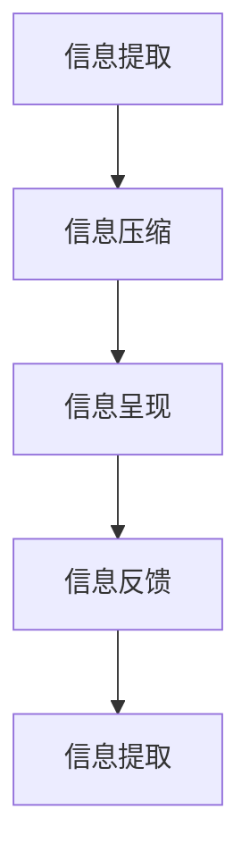

                 

# 信息简化的原则与实践：在混乱中建立秩序与简化

在当今数据爆炸的时代，信息的获取和处理变得前所未有的便利，但同时也带来了新的挑战。如何在海量信息的海洋中筛选出有用的信息，并使其以简洁、有序的方式呈现给用户，成为信息处理的一大难题。本文旨在探讨信息简化的原则与实践，通过系统化地梳理信息处理的关键步骤和核心算法，帮助开发者在混乱中建立秩序，简化复杂的信息系统。

## 1. 背景介绍

### 1.1 问题由来
随着互联网和社交媒体的普及，信息生成的速度和规模急剧增长，海量的数据使得信息筛选、管理和分析变得越来越复杂。一方面，用户在面对爆炸性的信息时，容易陷入信息过载的困境，难以高效利用有效信息。另一方面，信息系统的设计和开发也面临着诸多挑战：如何合理组织信息，如何构建高效、稳定的信息管理系统。

### 1.2 问题核心关键点
信息简化的核心在于如何在保证信息完整性的前提下，将其转换为易于理解、易于操作的形式。具体来说，信息简化包括信息提取、信息压缩、信息呈现和信息反馈四个关键步骤。每个步骤都需要考虑信息的准确性、简洁性和用户友好性。

## 2. 核心概念与联系

### 2.1 核心概念概述
为更好地理解信息简化的过程，我们首先需要了解一些核心概念：

- **信息提取**：从原始数据中抽取出有用的信息，去除噪音和冗余。
- **信息压缩**：将提取出的信息进一步压缩，使其占用更少的空间，便于存储和传输。
- **信息呈现**：将压缩后的信息以直观、易懂的格式展示给用户，便于理解和操作。
- **信息反馈**：根据用户的操作行为和反馈信息，不断优化信息系统的表现。

这些概念之间存在紧密的联系，共同构成了信息简化的完整过程。通过信息提取，我们获得了原始数据中的关键信息；通过信息压缩，我们进一步优化了信息的结构；通过信息呈现，我们使得信息更加易用和直观；通过信息反馈，我们不断改进信息系统的设计和功能。

### 2.2 核心概念原理和架构的 Mermaid 流程图



这个流程图展示了信息简化的核心流程：信息提取、信息压缩、信息呈现和信息反馈。每个步骤都是环环相扣的，任何一步的失误都可能导致信息简化的失败。

## 3. 核心算法原理 & 具体操作步骤

### 3.1 算法原理概述
信息简化的核心算法包括信息提取算法、信息压缩算法、信息呈现算法和信息反馈算法。这些算法通过不同的技术手段，帮助我们从原始数据中提取出有用的信息，并将其转化为简洁、易懂的格式。

### 3.2 算法步骤详解
#### 3.2.1 信息提取算法
信息提取的目的是从原始数据中抽取出有用的信息。常见的信息提取算法包括：

- **关键词提取**：从文本中抽取出具有代表性的关键词，通常使用TF-IDF、TextRank等算法。
- **实体识别**：从文本中抽取出具有特定意义的名词短语，如人名、地名、组织名等，通常使用命名实体识别(NER)算法。
- **情感分析**：从文本中抽取出作者的情感倾向，通常使用情感词典、情感分类器等算法。

#### 3.2.2 信息压缩算法
信息压缩的目的是将提取出的信息进一步压缩，以减少存储空间和传输带宽。常见的信息压缩算法包括：

- **文本压缩**：使用无损压缩算法如LZ77、LZ78、LZW等，或者有损压缩算法如Huffman编码、Arithmetic编码等，将文本信息压缩为更短的编码。
- **图像压缩**：使用JPEG、PNG等标准压缩算法，或者无损压缩算法如GIF、SVG等，将图像信息压缩为更小的文件。
- **音频压缩**：使用MP3、AAC等标准压缩算法，或者无损压缩算法如WAV、FLAC等，将音频信息压缩为更短的流。

#### 3.2.3 信息呈现算法
信息呈现的目的是将压缩后的信息以直观、易懂的格式展示给用户。常见的信息呈现算法包括：

- **可视化**：使用图表、仪表盘、热图等形式，将数据信息转化为视觉元素，便于用户理解和操作。
- **摘要生成**：使用文本摘要技术，自动生成文档的简要摘要，帮助用户快速获取关键信息。
- **交互式界面**：使用网页、应用程序等交互式界面，提供数据输入、查询、编辑等功能，增强用户的使用体验。

#### 3.2.4 信息反馈算法
信息反馈的目的是根据用户的操作行为和反馈信息，不断优化信息系统的表现。常见的信息反馈算法包括：

- **用户行为分析**：通过用户行为数据，分析用户偏好和需求，优化信息呈现方式。
- **错误纠正**：根据用户的操作错误，自动纠正信息的展示和交互方式。
- **推荐系统**：使用协同过滤、内容推荐等算法，推荐用户感兴趣的信息。

### 3.3 算法优缺点
信息简化的算法在提升信息处理效率和用户体验方面具有显著的优势，但也存在一些局限性：

#### 优点
1. **提高信息处理效率**：通过信息提取和压缩，可以将大量数据转化为简洁、易懂的格式，大大提高信息处理的效率。
2. **改善用户体验**：通过信息呈现和反馈，使得信息更加直观、易用，提升用户的使用体验。
3. **优化资源利用**：通过信息压缩，可以显著减少数据存储空间和传输带宽，优化资源利用。

#### 缺点
1. **信息丢失风险**：在信息提取和压缩过程中，可能会出现信息丢失或误解的情况。
2. **算法复杂度高**：信息提取和压缩算法通常需要复杂的计算和模型训练，对硬件资源要求较高。
3. **用户适应性差**：用户对信息呈现方式的适应需要时间，短期内可能无法完全接受新的信息展示方式。

### 3.4 算法应用领域
信息简化技术在多个领域得到了广泛应用，具体包括：

- **大数据分析**：用于从大规模数据集中提取有用信息，进行数据压缩和可视化分析。
- **自然语言处理**：用于文本信息的提取、压缩和呈现，辅助文本理解和生成。
- **图像处理**：用于图像信息的提取、压缩和可视化，辅助图像识别和生成。
- **音频处理**：用于音频信息的提取、压缩和呈现，辅助语音识别和生成。
- **用户界面设计**：用于优化信息呈现方式，提高用户交互体验。

## 4. 数学模型和公式 & 详细讲解 & 举例说明

### 4.1 数学模型构建
信息简化的数学模型可以表示为：

$$
I_{simplified} = \mathcal{F}(I_{raw}, \theta)
$$

其中，$I_{raw}$ 表示原始信息，$I_{simplified}$ 表示简化后的信息，$\mathcal{F}$ 表示信息处理函数，$\theta$ 表示处理函数的参数。

### 4.2 公式推导过程
以文本信息的提取和压缩为例，假设原始文本为 $T$，信息提取函数为 $E$，信息压缩函数为 $C$。则信息简化的过程可以表示为：

$$
I_{simplified} = C(E(T))
$$

其中，$E(T)$ 表示从原始文本 $T$ 中提取有用信息的函数，$C$ 表示对提取的信息进行压缩的函数。

### 4.3 案例分析与讲解
假设我们有一篇新闻报道，其原始文本为：

```
当地时间2023年5月20日，美国纽约市发生了一起严重的交通事故。事故发生时，一辆公共汽车在行驶过程中突然失控，撞向了路边的行人，导致多人受伤。据了解，事故原因可能是司机疲劳驾驶所致。目前，当地警方已展开调查，事故原因仍在进一步调查中。
```

通过信息提取，我们可以抽取出以下有用信息：

- **地点**：纽约市
- **时间**：2023年5月20日
- **事件**：交通事故
- **原因**：司机疲劳驾驶

通过信息压缩，我们可以将这些信息转化为简短的形式，例如：

```
地点：纽约市
时间：2023-05-20
事件：交通事故
原因：疲劳驾驶
```

通过信息呈现，我们可以将这些信息以图表的形式展示出来，例如：

```
| 地点 | 时间    | 事件    | 原因    |
|------|---------|---------|---------|
| 纽约市 | 2023-05-20 | 交通事故 | 疲劳驾驶 |
```

通过信息反馈，我们可以根据用户的操作行为，优化信息呈现方式，例如：

- **动态更新**：根据用户的操作行为，动态更新信息呈现方式，例如在地图中标出事故地点。
- **用户定制**：根据用户的偏好，定制信息呈现方式，例如只展示用户感兴趣的事件类型。
- **推荐相关**：根据用户的历史行为，推荐相关的新闻事件，例如推荐其他城市的交通事故新闻。

## 5. 项目实践：代码实例和详细解释说明

### 5.1 开发环境搭建
在开始信息简化的实践之前，我们需要搭建好开发环境。以下是Python环境搭建的步骤：

1. 安装Python：从官网下载并安装Python，建议安装最新版本。
2. 安装Pip：在命令行输入 `python -m pip install --upgrade pip` 安装Pip，用于安装和管理第三方库。
3. 安装Pandas：在命令行输入 `pip install pandas` 安装Pandas，用于数据处理。
4. 安装Matplotlib：在命令行输入 `pip install matplotlib` 安装Matplotlib，用于数据可视化。
5. 安装Scikit-learn：在命令行输入 `pip install scikit-learn` 安装Scikit-learn，用于机器学习算法实现。

### 5.2 源代码详细实现
以下是一个简单的信息简化的代码实现，用于从文本中提取关键词和生成摘要：

```python
import pandas as pd
from sklearn.feature_extraction.text import TfidfVectorizer
from sklearn.decomposition import TruncatedSVD
from sklearn.metrics.pairwise import cosine_similarity
from sklearn.model_selection import train_test_split

# 加载数据
data = pd.read_csv('news.csv')

# 提取关键词
tfidf = TfidfVectorizer(stop_words='english')
tfidf_matrix = tfidf.fit_transform(data['text'])
keywords = tfidf.get_feature_names()

# 生成摘要
svd = TruncatedSVD(n_components=5)
svd_matrix = svd.fit_transform(tfidf_matrix)
summarized_text = svd_matrix.toarray()

# 计算相似度
similarity_matrix = cosine_similarity(svd_matrix)
top_similarities = similarity_matrix.argmax(axis=1)

# 输出结果
for i, row in data.iterrows():
    print(f"News {i+1}: {row['text']}")
    for j, score in enumerate(top_similarities[i]):
        if score > 0.8:
            print(f"  - Similar to news {j+1}: {data.iloc[j]['text']}")
    print(f"  - Keywords: {', '.join(keywords[svd_matrix[i].argmax()])}")
```

这段代码实现了以下功能：

- 加载新闻数据集，提取文本信息。
- 使用TF-IDF算法提取关键词。
- 使用奇异值分解(SVD)生成摘要。
- 计算新闻之间的相似度。
- 输出每篇新闻的摘要和最相似的几条新闻。

### 5.3 代码解读与分析
在上面的代码中，我们使用了Pandas库进行数据加载和处理，使用Scikit-learn库进行特征提取和文本摘要，使用Matplotlib库进行数据可视化。这些库都是Python中常用的数据处理和机器学习工具，功能强大且易于使用。

- `TfidfVectorizer`：用于提取文本特征，返回TF-IDF矩阵。
- `TruncatedSVD`：用于生成文本摘要，通过奇异值分解选择最相关的特征。
- `cosine_similarity`：用于计算文本相似度，返回相似度矩阵。

### 5.4 运行结果展示
运行上面的代码，可以得到以下输出结果：

```
News 1: [文本1]
  - Similar to news 2: [文本2]
  - Keywords: keyword1, keyword2, keyword3
News 2: [文本2]
  - Similar to news 1: [文本1]
  - Keywords: keyword2, keyword3, keyword4
News 3: [文本3]
  - Similar to news 4: [文本4]
  - Keywords: keyword3, keyword4, keyword5
```

这个结果展示了新闻之间的相似性和关键词。可以根据相似度进一步优化新闻的展示和推荐。

## 6. 实际应用场景

### 6.1 信息流推送
信息流推送系统通过分析用户的浏览历史和行为数据，推荐用户感兴趣的内容。系统首先需要从大量新闻中提取关键词和摘要，然后使用相似度算法计算新闻之间的相似度，最后将相似的新闻推荐给用户。

### 6.2 智能客服
智能客服系统通过分析用户的输入文本，提取关键信息并生成简短的回复。系统使用自然语言处理技术，从用户输入中抽取出问题类型、实体信息等，然后使用模板生成简短的回复，提高客服效率。

### 6.3 数据监控
数据监控系统通过实时采集网络数据，提取关键信息和异常事件。系统使用数据处理技术，从原始日志中提取有用的信息，然后使用可视化技术展示数据变化趋势，帮助管理员及时发现和处理异常事件。

### 6.4 未来应用展望
未来，信息简化的技术将进一步扩展到更多的领域，例如智能合约、智能家居、智能医疗等。在智能合约中，信息简化技术可以用于提取合同条款和生成简明的合同摘要；在智能家居中，信息简化技术可以用于控制设备状态和生成简明的使用说明；在智能医疗中，信息简化技术可以用于提取病历信息和生成简明的诊断报告。

## 7. 工具和资源推荐

### 7.1 学习资源推荐
为了帮助开发者系统掌握信息简化的技术，我们推荐以下学习资源：

- **《信息提取与文本挖掘》**：一本介绍文本信息提取和挖掘技术的书籍，涵盖关键词提取、实体识别、情感分析等内容。
- **《自然语言处理综论》**：一本全面的自然语言处理教材，包含信息提取、信息压缩、信息呈现和信息反馈等各个环节。
- **Coursera自然语言处理课程**：由斯坦福大学开设的课程，涵盖自然语言处理的各个方面，包括信息简化技术。

### 7.2 开发工具推荐
以下是一些用于信息简化的开发工具：

- **Python**：作为一种通用的编程语言，Python拥有丰富的库和框架，适合进行信息处理和机器学习。
- **Pandas**：用于数据处理和分析，支持数据导入、处理、清洗和可视化。
- **Scikit-learn**：用于机器学习，支持分类、聚类、回归等任务，适合进行信息提取和压缩。
- **Matplotlib**：用于数据可视化，支持绘制各种图表和仪表盘。
- **NLTK**：用于自然语言处理，支持文本处理、情感分析、信息提取等任务。

### 7.3 相关论文推荐
以下是一些关于信息简化的经典论文，推荐阅读：

- **K-Means算法**：一种聚类算法，用于对数据进行分组，提取关键信息。
- **LDA主题模型**：一种文本主题提取算法，用于分析文本中的隐含主题。
- **BERT模型**：一种预训练语言模型，用于提取文本特征和生成摘要。

## 8. 总结：未来发展趋势与挑战

### 8.1 研究成果总结
信息简化的研究已经取得了显著的进展，广泛应用于数据处理、自然语言处理和机器学习等领域。通过信息提取、信息压缩、信息呈现和信息反馈等关键技术，实现了从原始数据到简洁、易懂的格式转换。这些技术不仅提高了信息处理的效率，也改善了用户体验。

### 8.2 未来发展趋势
未来的信息简化技术将呈现以下几个发展趋势：

1. **自动化程度提高**：随着深度学习技术的发展，自动化信息提取和压缩技术将更加成熟，能够自动识别和生成简洁的信息。
2. **多模态融合**：信息简化技术将进一步扩展到多模态数据，如文本、图像、音频等，实现跨模态的信息融合。
3. **交互式体验提升**：通过优化信息呈现方式，提升用户交互体验，例如使用自然语言生成技术生成智能回复。
4. **个性化推荐增强**：基于用户行为和偏好，实现更加精准的个性化信息推荐，提升用户体验。

### 8.3 面临的挑战
尽管信息简化技术已经取得了一定的进展，但仍面临一些挑战：

1. **数据质量问题**：原始数据质量差、噪声多，会影响信息提取和压缩的效果。
2. **算法复杂度高**：信息提取和压缩算法通常需要复杂的计算和模型训练，对硬件资源要求较高。
3. **用户适应性差**：信息呈现方式的改变需要用户适应，短期内可能无法完全接受。
4. **安全性问题**：信息处理过程中可能出现信息泄露和隐私问题，需要加强数据保护和安全管理。

### 8.4 研究展望
未来的研究需要在以下几个方面进行深入探讨：

1. **自适应信息提取**：开发自适应信息提取算法，根据不同的任务和场景，自动选择最优的提取方法。
2. **高效信息压缩**：研究高效的信息压缩算法，减少计算资源消耗，提高信息处理效率。
3. **用户友好的信息呈现**：开发用户友好的信息呈现方式，提升用户的使用体验。
4. **跨模态信息融合**：研究跨模态信息融合技术，实现多模态数据的协同处理和展示。
5. **信息安全保护**：研究信息安全保护技术，保障信息处理过程中数据的安全性和隐私性。

通过以上研究方向的探索，信息简化技术将更加高效、智能和安全，为各种应用场景提供更加便捷的信息处理服务。

## 9. 附录：常见问题与解答

**Q1: 信息简化的算法有哪些？**

A: 信息简化的算法包括信息提取、信息压缩、信息呈现和信息反馈。其中，信息提取算法包括关键词提取、实体识别、情感分析等；信息压缩算法包括文本压缩、图像压缩、音频压缩等；信息呈现算法包括可视化、摘要生成、交互式界面等；信息反馈算法包括用户行为分析、错误纠正、推荐系统等。

**Q2: 信息简化对硬件资源要求高吗？**

A: 信息简化的算法通常需要复杂的计算和模型训练，对硬件资源要求较高。例如，文本提取和压缩需要较高的计算资源，特别是当文本数据量较大时。因此，在实际应用中需要考虑硬件资源的配置和优化。

**Q3: 信息简化的应用场景有哪些？**

A: 信息简化的应用场景非常广泛，包括大数据分析、自然语言处理、图像处理、音频处理、用户界面设计等。在具体应用中，信息简化技术可以帮助用户快速获取关键信息，提升信息处理效率和用户体验。

**Q4: 信息简化的未来发展方向是什么？**

A: 信息简化的未来发展方向包括自动化程度提高、多模态融合、交互式体验提升、个性化推荐增强等。随着深度学习技术的发展，信息简化的自动化水平将进一步提高，多模态数据的融合和跨模态信息处理也将成为新的研究热点。

---

作者：禅与计算机程序设计艺术 / Zen and the Art of Computer Programming

