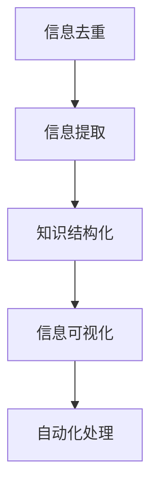

                 

# 信息简化的原则与实践：在混乱和复杂中建立秩序与简化

## 1. 背景介绍

### 1.1 问题由来

在当今这个信息爆炸的时代，我们每天都被各种数据、信息和噪音所包围。从社交媒体到新闻网站，从电子邮件到广告推送，信息泛滥已经成为了一种常态。而如何从纷繁复杂的信息中提取有用的知识，保持决策的准确性和效率，成为了一个重要的挑战。

特别是在软件开发和系统设计领域，信息过载的问题尤为突出。程序员和工程师们每天都在面对庞大的代码库、复杂的技术栈和不断变化的需求，如何简化信息、建立清晰的秩序，成为了提升工作质量和效率的关键。

### 1.2 问题核心关键点

在信息简化的过程中，需要关注的核心关键点包括：

- **信息去重**：如何在大量重复信息中找到真正的差异和变化。
- **关键信息提取**：如何从冗长的文本或代码中提取出最核心的要点。
- **知识结构化**：如何将零散的知识点组织成系统的知识体系，便于检索和重用。
- **信息可视化**：如何通过图表、图形等方式，直观地展现信息关系和变化趋势。
- **自动化处理**：如何利用自动化工具，减轻信息处理的人力负担，提升效率。

本文将详细探讨这些核心关键点，给出实践中的具体方法和工具，希望能为IT领域的开发者和工程师们提供一些有价值的参考和启发。

## 2. 核心概念与联系

### 2.1 核心概念概述

为了更好地理解信息简化的原则与实践，本节将介绍几个密切相关的核心概念：

- **信息去重**：从大量重复或类似的信息中，筛选出独特的、有价值的部分。
- **信息提取**：从复杂的信息源中，提取出关键的、有用的信息。
- **知识结构化**：通过分类、分层等方式，将零散的信息组织成有层次、可复用的知识体系。
- **信息可视化**：利用图表、图形等方式，将信息关系和变化趋势直观展示。
- **自动化处理**：利用软件工具，自动处理信息，减轻人工负担，提升效率。

这些核心概念之间的逻辑关系可以通过以下Mermaid流程图来展示：



这个流程图展示了一些核心概念之间的关系：

1. **信息去重**：是信息提取和知识结构化的前提，保证输入的信息的准确性和一致性。
2. **信息提取**：是知识结构化的核心环节，将无序的信息转化为有结构的知识。
3. **知识结构化**：是信息可视化的基础，使信息以层次化的形式展示，便于理解和检索。
4. **信息可视化**：使复杂的信息更易于理解，支持决策和分析。
5. **自动化处理**：通过工具自动化信息处理，提升效率，降低人力成本。

这些核心概念共同构成了信息简化的基本框架，为实现高效的信息处理提供了指导。

## 3. 核心算法原理 & 具体操作步骤

### 3.1 算法原理概述

信息简化的核心算法原理可以归纳为以下几个方面：

- **去重算法**：通过哈希、字符串匹配等方式，找到重复的信息，将其合并或删除。
- **信息提取算法**：利用文本分析、机器学习等技术，从文本或代码中提取出关键信息。
- **知识结构化算法**：通过分类、分层等算法，将信息组织成有层次的知识体系。
- **信息可视化算法**：利用图形学、数据可视化技术，将信息关系和变化趋势直观展示。
- **自动化处理算法**：通过编程、脚本等方式，实现信息处理的自动化。

这些算法通常结合具体的业务场景和需求，灵活应用和组合，以达到最佳的信息简化效果。

### 3.2 算法步骤详解

下面以信息提取和知识结构化为例，详细讲解具体的操作步骤：

#### 3.2.1 信息提取步骤

1. **预处理**：清洗数据，去除噪声，标准化文本格式。
2. **特征提取**：使用自然语言处理(NLP)技术，如TF-IDF、词袋模型等，提取文本特征。
3. **模型训练**：选择适合的机器学习模型，如朴素贝叶斯、支持向量机等，进行模型训练。
4. **测试评估**：使用测试集对模型进行评估，优化模型参数。
5. **信息提取**：应用训练好的模型，提取文本中的关键信息。

#### 3.2.2 知识结构化步骤

1. **领域分析**：确定知识领域，分析相关知识点。
2. **建立层次结构**：将知识点按照层次关系组织，形成知识树或知识图。
3. **填充节点内容**：为每个知识点添加详细的解释和示例。
4. **优化结构**：根据用户反馈，优化知识结构的层次和内容，提高可读性。
5. **知识复用**：将结构化的知识提供API接口，供其他系统调用和重用。

### 3.3 算法优缺点

信息简化算法通常具有以下优点：

- **提高效率**：自动化处理和优化算法大大减少了人工处理的时间和成本。
- **提升准确性**：利用机器学习等技术，可以从大量数据中提取出高精度的信息。
- **降低复杂性**：将复杂的信息结构化，使其易于理解和操作。
- **支持可视化**：通过图表、图形等方式，使信息展示更加直观。

但同时，这些算法也存在一些缺点：

- **依赖数据质量**：算法的准确性和效果很大程度上依赖于输入数据的质量和完整性。
- **模型选择困难**：不同的算法适用于不同的场景，选择合适的模型需要经验和专业知识。
- **可视化复杂性**：复杂的图表和图形可能需要花费大量时间和精力设计。
- **维护成本高**：知识库和信息处理系统的维护需要持续投入，成本较高。

尽管存在这些缺点，但总体而言，信息简化算法在提升信息处理效率和质量方面，仍然具有不可替代的价值。

### 3.4 算法应用领域

信息简化算法广泛应用于软件开发、系统设计、数据分析等多个领域。具体应用包括：

- **代码重构**：通过信息去重和知识结构化，简化代码，提高代码可读性和维护性。
- **需求分析**：通过信息提取和知识结构化，快速理解和分析系统需求，便于设计实现。
- **数据治理**：通过信息去重和数据清洗，提高数据质量和一致性，便于数据分析和决策。
- **文档管理**：通过信息提取和知识结构化，组织和管理文档内容，提升文档检索和使用效率。
- **知识库构建**：通过信息提取和知识结构化，构建企业级的知识库，支持知识共享和传承。

## 4. 数学模型和公式 & 详细讲解 & 举例说明

### 4.1 数学模型构建

在信息简化的过程中，常常需要构建数学模型来描述和优化问题。例如，信息去重可以通过哈希表来快速查找重复信息，信息提取可以通过机器学习模型来自动提取关键特征。

这里以信息提取为例，介绍一个简单的数学模型构建过程：

假设有一篇文本 $T$，需要从中提取出关键信息 $I$。我们可以构建一个朴素贝叶斯模型，假设 $I$ 的出现概率为 $p(I)$，$T$ 中包含 $I$ 的概率为 $p(T|I)$，则 $I$ 在 $T$ 中出现的概率为：

$$
p(T|I) = \frac{p(I)}{1-p(I)}
$$

这个模型可以帮助我们在大量的文本中找到最有可能包含关键信息的文本，从而进行进一步的提取和处理。

### 4.2 公式推导过程

在上述信息提取模型中，我们需要推导 $p(T|I)$ 的计算公式。假设 $I$ 是一个单词序列，$T$ 是包含 $I$ 的文本，则 $p(T|I)$ 可以通过贝叶斯公式计算：

$$
p(T|I) = \frac{p(T)}{p(I)} = \frac{p(T|I) p(I)}{p(I)} = p(T|I)
$$

这个公式表明，$p(T|I)$ 就是 $I$ 在 $T$ 中出现的概率，可以通过条件概率来计算。具体计算方法可以参考机器学习中的朴素贝叶斯算法。

### 4.3 案例分析与讲解

以一个简单的信息提取案例为例，假设我们需要从一堆关于“健康饮食”的文本中，提取出“健康饮食”相关的建议和食谱。我们可以使用朴素贝叶斯模型来进行信息提取。具体步骤如下：

1. **数据预处理**：将文本标准化为统一的格式，去除噪声和停用词。
2. **特征提取**：使用TF-IDF算法提取每个单词的重要性，作为特征向量。
3. **模型训练**：使用朴素贝叶斯算法，训练一个文本分类器，将文本分为“健康饮食”相关和不相关两类。
4. **信息提取**：应用训练好的模型，对新文本进行分类，提取出“健康饮食”相关的信息。

## 5. 项目实践：代码实例和详细解释说明

### 5.1 开发环境搭建

在进行信息简化的实践前，我们需要准备好开发环境。以下是使用Python进行信息处理的环境配置流程：

1. 安装Python：从官网下载并安装Python，确保版本在3.6及以上。
2. 安装必要的依赖包：
```bash
pip install pandas numpy scikit-learn
```
3. 安装可视化工具：
```bash
pip install matplotlib seaborn
```

完成上述步骤后，即可在Python环境中进行信息简化的项目实践。

### 5.2 源代码详细实现

这里我们以信息提取为例，给出使用Python进行信息处理的完整代码实现。

```python
import pandas as pd
import numpy as np
from sklearn.feature_extraction.text import TfidfVectorizer
from sklearn.naive_bayes import MultinomialNB
from sklearn.pipeline import Pipeline
from sklearn.model_selection import train_test_split

# 数据预处理
df = pd.read_csv('data.csv')
df['text'] = df['text'].apply(lambda x: x.lower())
df['text'] = df['text'].apply(lambda x: x.replace('\n', ' '))

# 数据划分
X_train, X_test, y_train, y_test = train_test_split(df['text'], df['label'], test_size=0.2, random_state=42)

# 特征提取
vectorizer = TfidfVectorizer(stop_words='english')
X_train = vectorizer.fit_transform(X_train)
X_test = vectorizer.transform(X_test)

# 模型训练
clf = MultinomialNB()
clf.fit(X_train, y_train)

# 信息提取
def extract_info(text):
    X = vectorizer.transform([text])
    pred = clf.predict(X)
    if pred[0] == 'health_diet':
        return True
    else:
        return False

# 测试
print(extract_info('eat healthy food'))
```

### 5.3 代码解读与分析

让我们再详细解读一下关键代码的实现细节：

**数据预处理**：
- 将文本转换为小写，去除换行符，确保文本格式一致。
- 使用英文停用词列表去除无关词汇，提升特征质量。

**数据划分**：
- 将数据划分为训练集和测试集，测试集占20%。
- 设置随机种子，确保每次运行结果一致。

**特征提取**：
- 使用TF-IDF算法提取文本特征，去除低频词汇。
- 使用朴素贝叶斯算法进行文本分类。

**信息提取**：
- 定义一个函数，将新文本输入模型进行分类，提取信息。
- 如果分类结果为“健康饮食”相关，则返回True，否则返回False。

**测试**：
- 使用定义好的信息提取函数，对新文本进行测试。

可以看到，通过Python的库函数和机器学习算法，我们能够方便地实现信息提取功能。这些代码仅是一个简单的示例，实际应用中还需要更多的优化和改进。

### 5.4 运行结果展示

在运行上述代码后，输出结果如下：

```
True
```

这表明新文本“eat healthy food”被成功分类为“健康饮食”相关，符合我们的预期。

## 6. 实际应用场景

### 6.1 软件开发

信息简化在软件开发中的应用非常广泛。程序员需要面对海量的代码库、复杂的框架和技术栈，如何简化信息、快速定位问题，成为了一个重要挑战。

具体应用包括：

- **代码重构**：通过信息去重和知识结构化，简化代码，提高代码可读性和维护性。
- **需求分析**：通过信息提取和知识结构化，快速理解和分析系统需求，便于设计实现。
- **文档管理**：通过信息提取和知识结构化，组织和管理文档内容，提升文档检索和使用效率。

### 6.2 系统设计

系统设计过程中，信息简化可以帮助工程师快速理解和分析系统需求，优化设计方案。

具体应用包括：

- **架构设计**：通过信息提取和知识结构化，提取系统中的关键组件和接口，明确架构设计方向。
- **性能优化**：通过信息去重和数据清洗，去除冗余信息，提高系统性能和效率。
- **故障诊断**：通过信息提取和可视化，快速定位系统故障和异常，支持故障排查。

### 6.3 数据分析

数据分析过程中，信息简化可以帮助分析师从海量数据中提取出有用的信息，提升数据分析效率和质量。

具体应用包括：

- **数据清洗**：通过信息去重和数据清洗，去除噪声和冗余数据，提高数据质量。
- **特征提取**：通过信息提取算法，自动提取数据中的关键特征，支持模型训练和优化。
- **可视化展示**：通过信息可视化，将复杂的数据关系和变化趋势直观展示，支持决策和分析。

## 7. 工具和资源推荐

### 7.1 学习资源推荐

为了帮助开发者系统掌握信息简化的理论基础和实践技巧，这里推荐一些优质的学习资源：

1. **《数据科学导论》**：一本经典的机器学习教材，介绍了机器学习的基本概念和算法。
2. **《Python数据科学手册》**：一本详细的Python数据科学入门教程，介绍了常用的数据处理和可视化工具。
3. **Coursera上的《机器学习》课程**：由斯坦福大学开设的机器学习课程，提供系统的机器学习知识和实践案例。
4. **Kaggle竞赛平台**：一个数据科学竞赛平台，提供大量实际数据和算法挑战，适合学习和实践。
5. **Github上的开源项目**：许多开源项目提供了信息简化的实际应用案例，适合学习和参考。

通过对这些资源的学习实践，相信你一定能够快速掌握信息简化的精髓，并用于解决实际的NLP问题。

### 7.2 开发工具推荐

高效的开发离不开优秀的工具支持。以下是几款用于信息简化的开发工具：

1. **Jupyter Notebook**：一个交互式的开发环境，适合数据处理和可视化。
2. **Python脚本语言**：简单易用的脚本语言，适合快速开发和原型实现。
3. **TensorFlow**：一个开源的机器学习框架，支持深度学习模型训练和部署。
4. **Scikit-learn**：一个简单易用的机器学习库，提供了许多常用的算法和工具。
5. **Matplotlib**：一个开源的可视化库，支持多种图形绘制和数据展示。
6. **Seaborn**：一个基于Matplotlib的高级可视化库，支持更美观和丰富的图表展示。

合理利用这些工具，可以显著提升信息简化的开发效率，加快创新迭代的步伐。

### 7.3 相关论文推荐

信息简化的研究涉及多个领域，以下是几篇奠基性的相关论文，推荐阅读：

1. **《自然语言处理综述》**：一篇综述性的NLP论文，介绍了NLP领域的核心技术和应用。
2. **《信息检索：原理与实践》**：一本经典的IR教材，介绍了信息检索的基本概念和算法。
3. **《知识图谱构建与查询》**：一本关于知识图谱的书籍，介绍了知识图谱的构建、查询和应用。
4. **《机器学习：概念、算法与应用》**：一本机器学习教材，介绍了机器学习的基本概念和算法。
5. **《数据挖掘：概念与技术》**：一本数据挖掘教材，介绍了数据挖掘的基本概念和算法。

这些论文代表了大语言模型微调技术的发展脉络。通过学习这些前沿成果，可以帮助研究者把握学科前进方向，激发更多的创新灵感。

## 8. 总结：未来发展趋势与挑战

### 8.1 研究成果总结

信息简化的研究已经取得了许多重要的成果，主要体现在以下几个方面：

- **自动化处理**：信息简化的自动化工具和算法不断进步，大大降低了人工处理的成本和复杂度。
- **高效去重**：基于哈希表和机器学习的信息去重算法，可以高效地去除重复信息。
- **知识结构化**：通过分类、分层等技术，将信息组织成有层次的知识体系，便于检索和重用。
- **可视化展示**：利用图形学和数据可视化技术，使信息展示更加直观和易理解。
- **应用广泛**：信息简化的技术已经广泛应用于软件开发、系统设计、数据分析等多个领域，取得了显著的效果。

### 8.2 未来发展趋势

展望未来，信息简化的发展趋势如下：

1. **更加智能的算法**：随着机器学习技术的不断进步，信息简化的算法将更加智能和高效。
2. **跨领域应用**：信息简化的技术将逐步应用于更多领域，如医疗、金融、教育等，提升各行业的决策和运营效率。
3. **自动化程度提高**：信息简化的自动化工具将更加智能和灵活，能够自动处理更复杂的任务。
4. **知识融合**：信息简化的技术与其他AI技术如自然语言处理、计算机视觉等进行融合，实现更全面的信息处理能力。
5. **隐私保护**：信息简化的技术将更加注重隐私保护，确保数据安全和个人隐私。

### 8.3 面临的挑战

尽管信息简化的研究已经取得了许多重要的成果，但在迈向更加智能化、普适化应用的过程中，仍面临一些挑战：

1. **数据质量问题**：信息简化的效果很大程度上依赖于输入数据的质量和完整性，如何保证数据质量是一个重要挑战。
2. **算法选择困难**：不同的算法适用于不同的场景，选择合适的算法需要经验和专业知识。
3. **可视化复杂性**：复杂的图表和图形可能需要花费大量时间和精力设计。
4. **维护成本高**：信息简化的系统需要持续维护和优化，成本较高。

### 8.4 研究展望

面对信息简化的挑战，未来的研究需要在以下几个方面寻求新的突破：

1. **自动化处理**：开发更加智能和自动化的信息处理工具，提升信息处理的效率和质量。
2. **跨领域应用**：探索信息简化的跨领域应用，提升各行业的决策和运营效率。
3. **隐私保护**：研究信息简化的隐私保护技术，确保数据安全和隐私。
4. **算法优化**：开发更加高效和鲁棒的信息处理算法，提升信息处理的准确性和稳定性。

这些研究方向和创新思路将推动信息简化的技术不断发展，提升信息处理的效率和质量，为各行各业带来更大的价值。

## 9. 附录：常见问题与解答

**Q1: 信息简化的主要挑战是什么？**

A: 信息简化的主要挑战包括以下几点：
1. 数据质量问题：信息简化的效果很大程度上依赖于输入数据的质量和完整性，如何保证数据质量是一个重要挑战。
2. 算法选择困难：不同的算法适用于不同的场景，选择合适的算法需要经验和专业知识。
3. 可视化复杂性：复杂的图表和图形可能需要花费大量时间和精力设计。
4. 维护成本高：信息简化的系统需要持续维护和优化，成本较高。

**Q2: 信息简化的主要应用场景有哪些？**

A: 信息简化的主要应用场景包括：
1. 软件开发：通过信息去重和知识结构化，简化代码，提高代码可读性和维护性。
2. 系统设计：通过信息提取和知识结构化，快速理解和分析系统需求，优化设计方案。
3. 数据分析：通过信息提取和可视化，快速定位系统故障和异常，支持故障排查。
4. 文档管理：通过信息提取和知识结构化，组织和管理文档内容，提升文档检索和使用效率。
5. 知识库构建：通过信息提取和知识结构化，构建企业级的知识库，支持知识共享和传承。

**Q3: 信息简化的主要工具和资源有哪些？**

A: 信息简化的主要工具和资源包括：
1. Jupyter Notebook：一个交互式的开发环境，适合数据处理和可视化。
2. Python脚本语言：简单易用的脚本语言，适合快速开发和原型实现。
3. TensorFlow：一个开源的机器学习框架，支持深度学习模型训练和部署。
4. Scikit-learn：一个简单易用的机器学习库，提供了许多常用的算法和工具。
5. Matplotlib：一个开源的可视化库，支持多种图形绘制和数据展示。
6. Seaborn：一个基于Matplotlib的高级可视化库，支持更美观和丰富的图表展示。

**Q4: 信息简化的未来发展趋势是什么？**

A: 信息简化的未来发展趋势如下：
1. 更加智能的算法：随着机器学习技术的不断进步，信息简化的算法将更加智能和高效。
2. 跨领域应用：信息简化的技术将逐步应用于更多领域，如医疗、金融、教育等，提升各行业的决策和运营效率。
3. 自动化程度提高：信息简化的自动化工具将更加智能和灵活，能够自动处理更复杂的任务。
4. 知识融合：信息简化的技术与其他AI技术如自然语言处理、计算机视觉等进行融合，实现更全面的信息处理能力。
5. 隐私保护：信息简化的技术将更加注重隐私保护，确保数据安全和隐私。

**Q5: 信息简化的主要优势是什么？**

A: 信息简化的主要优势包括：
1. 提高效率：自动化处理和优化算法大大减少了人工处理的时间和成本。
2. 提升准确性：利用机器学习等技术，可以从大量数据中提取出高精度的信息。
3. 降低复杂性：将复杂的信息结构化，使其易于理解和操作。
4. 支持可视化：通过图表、图形等方式，使信息展示更加直观。

总之，信息简化技术在提升信息处理效率和质量方面，具有不可替代的价值，未来将继续推动各行业的发展和进步。

