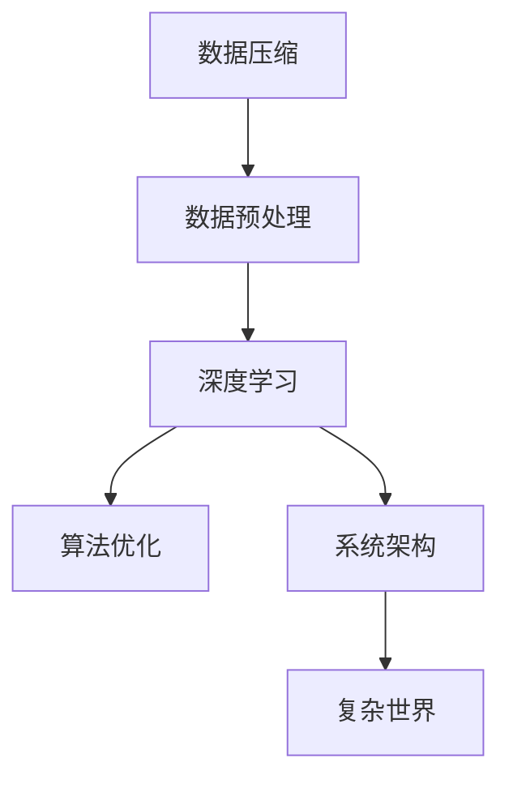

                 

# 信息简化的好处与挑战：在复杂世界中简化以提高效率和生产力

> 关键词：信息简化, 数据压缩, 深度学习, 算法优化, 效率提升, 人工智能, 系统架构, 复杂世界

## 1. 背景介绍

### 1.1 问题由来
随着信息技术的迅猛发展，数据量呈爆炸式增长。无论是商业运营、科学研究还是日常决策，都离不开海量数据的支撑。然而，面对庞杂的数据集，处理、存储、分析和利用的成本和难度也随之增加。信息简化作为一种有效手段，能够通过去除冗余信息，提取核心特征，帮助我们在复杂世界中提高效率和生产力。

### 1.2 问题核心关键点
信息简化涉及数据预处理、算法优化、系统架构设计等多个方面。其核心在于如何在保持数据完整性的基础上，减少数据量和计算复杂度，从而提高数据处理的效率和系统的响应速度。

在实际应用中，信息简化可以带来以下几方面的益处：

- **降低成本**：减少数据存储和传输的开销，降低计算资源的消耗。
- **提升速度**：缩短数据处理时间，加速决策和反馈过程。
- **提高准确性**：通过去除噪声，减少计算误差，提升模型精度。
- **增强可扩展性**：简化后的数据集更适合进行分布式计算，易于水平扩展。
- **促进创新**：为新型算法和模型的研发提供更明确、更高效的数据基础。

然而，信息简化并非易事，也伴随着诸多挑战。

## 2. 核心概念与联系

### 2.1 核心概念概述

为更好地理解信息简化在复杂系统中的应用，本节将介绍几个密切相关的核心概念：

- **数据压缩**：通过算法将数据转换为更加紧凑的格式，减少存储空间和传输带宽。常见算法包括霍夫曼编码、LZ77、LZ78、LZW等。
- **数据预处理**：在数据存储和分析之前，对数据进行清洗、归一化、特征选择等操作，提高数据质量和处理效率。
- **深度学习**：利用多层神经网络模型，通过反向传播算法优化模型参数，提取数据中的高级特征。
- **算法优化**：通过算法结构优化、参数调整、硬件加速等方式，提高算法的执行效率。
- **系统架构**：设计高效、可扩展的系统架构，包括数据流、任务调度、负载均衡等。
- **复杂世界**：指真实世界的复杂性，包括多源异构数据、非线性关系、随机噪声等。

这些核心概念之间的逻辑关系可以通过以下Mermaid流程图来展示：



这个流程图展示了一系列关键概念及其之间的关系：

1. 数据压缩减少数据量，便于存储和传输。
2. 数据预处理提升数据质量，为后续处理提供基础。
3. 深度学习提取高级特征，实现模型优化。
4. 算法优化提高计算效率，降低资源消耗。
5. 系统架构设计支持大规模处理，增强可扩展性。
6. 复杂世界的多样性和不确定性，要求更高的数据处理能力。

这些概念共同构成了信息简化的理论基础，使其在实际应用中能够发挥显著的效能。

## 3. 核心算法原理 & 具体操作步骤
### 3.1 算法原理概述

信息简化作为一个整体的概念，涉及多个层次的算法和技术。其核心思想是通过一系列处理步骤，逐步去除数据的冗余和噪声，提取出有意义的核心信息，从而在减少数据量和计算复杂度的同时，保持信息的完整性和准确性。

信息简化的一般流程可以概括为以下几个关键步骤：

1. **数据预处理**：清洗、归一化、特征选择等，提高数据质量。
2. **特征提取**：通过算法提取数据中的关键特征，为后续处理奠定基础。
3. **压缩算法**：使用压缩算法减少数据量，便于存储和传输。
4. **深度学习模型**：构建深度学习模型，提取数据中的高级特征。
5. **算法优化**：通过算法结构优化、参数调整、硬件加速等方式，提高算法效率。

### 3.2 算法步骤详解

**Step 1: 数据预处理**

数据预处理是信息简化的第一步，其目的是通过清洗、归一化、特征选择等操作，提高数据质量和后续处理效率。

具体步骤如下：

1. **清洗**：删除或修正数据中的错误、缺失或异常值。
2. **归一化**：将数据缩放到指定范围内，便于后续计算。
3. **特征选择**：选择对目标任务有帮助的特征，去除无关或冗余特征。

示例代码：

```python
import pandas as pd

# 加载数据
data = pd.read_csv('data.csv')

# 清洗数据
data = data.dropna()

# 归一化数据
data = (data - data.mean()) / data.std()

# 特征选择
data = data.drop(['unnecessary_column'], axis=1)
```

**Step 2: 特征提取**

特征提取是信息简化的关键步骤，其目的是从原始数据中提取有用的特征，为后续处理提供基础。

常见特征提取方法包括：

- 主成分分析(PCA)
- 线性判别分析(LDA)
- 独立成分分析(ICA)
- 傅里叶变换
- 小波变换

示例代码：

```python
from sklearn.decomposition import PCA

# 特征提取
pca = PCA(n_components=2)
data = pca.fit_transform(data)
```

**Step 3: 压缩算法**

数据压缩是信息简化的重要手段，其目的是通过算法减少数据量，便于存储和传输。

常见压缩算法包括：

- 霍夫曼编码
- LZ77/LZ78/LZW
- 算术编码
- 字典编码
- 差分编码

示例代码：

```python
import gzip

# 数据压缩
with open('data.csv', 'rb') as f_in, gzip.open('data.csv.gz', 'wb') as f_out:
    f_out.writelines(f_in)
```

**Step 4: 深度学习模型**

深度学习模型通过多层神经网络，提取数据中的高级特征，实现信息简化。

常见深度学习模型包括：

- 卷积神经网络(CNN)
- 循环神经网络(RNN)
- 长短时记忆网络(LSTM)
- 自编码器(AE)
- 变分自编码器(VAE)
- 生成对抗网络(GAN)

示例代码：

```python
from tensorflow.keras.models import Sequential
from tensorflow.keras.layers import Dense, Dropout

# 构建深度学习模型
model = Sequential()
model.add(Dense(64, input_dim=2, activation='relu'))
model.add(Dropout(0.5))
model.add(Dense(1, activation='sigmoid'))
model.compile(loss='binary_crossentropy', optimizer='adam', metrics=['accuracy'])
```

**Step 5: 算法优化**

算法优化是信息简化的最后一步，其目的是通过算法结构优化、参数调整、硬件加速等方式，提高算法效率。

常见算法优化方法包括：

- 网络剪枝
- 量化
- 模型并行
- 编译器优化
- GPU/TPU加速

示例代码：

```python
import tensorflow as tf

# 网络剪枝
tf.keras.layers.experimental.preprocessing.PolynomialBiasVectorizer().adapt(data)

# 量化
tf.keras.backend.set_floatx('float16')

# 模型并行
strategy = tf.distribute.MirroredStrategy(devices=['GPU:0', 'GPU:1'])
with strategy.scope():
    model = tf.keras.models.load_model('model.h5')
```

### 3.3 算法优缺点

信息简化的算法具有以下优点：

- **减少存储空间**：通过压缩算法减少数据量，节省存储空间。
- **加速传输**：压缩后的数据传输更快，提高网络带宽利用率。
- **提高计算效率**：通过特征提取和模型优化，降低计算复杂度。
- **增强可扩展性**：简化后的数据集更适合进行分布式计算，便于水平扩展。
- **促进创新**：为新型算法和模型的研发提供更明确、更高效的数据基础。

同时，该算法也存在一些局限性：

- **精度损失**：压缩算法和特征提取可能引入信息损失，影响模型精度。
- **计算成本**：数据预处理和模型优化可能需要较高计算资源。
- **模型复杂性**：深度学习模型结构复杂，参数众多，训练和推理速度较慢。
- **系统复杂性**：系统架构设计复杂，需要考虑多方面因素，如数据流、任务调度等。

尽管存在这些局限性，但信息简化作为一种高效的数据处理手段，在实际应用中仍然具有重要价值。

### 3.4 算法应用领域

信息简化在多个领域中得到了广泛应用，以下是一些典型的应用场景：

- **医疗**：通过压缩算法减少医疗数据存储量，提高数据传输效率。同时使用深度学习模型提取患者特征，辅助诊断和治疗。
- **金融**：对交易数据进行特征提取和压缩，提取关键交易特征，用于风险评估和交易策略优化。
- **通信**：使用压缩算法减少通信数据量，降低网络带宽和能耗。同时使用深度学习模型进行网络优化和故障预测。
- **物联网**：对传感器数据进行特征提取和压缩，降低数据存储和传输成本。同时使用深度学习模型进行数据分析和决策支持。
- **视频处理**：使用压缩算法减少视频文件大小，提高传输效率。同时使用深度学习模型进行视频内容分析和生成。
- **自然语言处理**：对文本数据进行特征提取和压缩，提取关键语义特征。同时使用深度学习模型进行文本分类、情感分析和机器翻译。
- **计算机视觉**：对图像数据进行特征提取和压缩，提取关键视觉特征。同时使用深度学习模型进行图像识别、目标检测和图像生成。

除了上述这些应用领域外，信息简化还被广泛应用于网络安全、社会分析、资源管理等诸多领域，为不同行业的智能化转型提供了有力支持。

## 4. 数学模型和公式 & 详细讲解 & 举例说明

### 4.1 数学模型构建

信息简化涉及多个数学模型和公式。这里以特征提取和深度学习模型为例，进行详细讲解。

**特征提取模型**：假设原始数据为 $X$，特征提取后的数据为 $Y$，特征提取过程可以表示为：

$$ Y = f(X) $$

其中，$f$ 为特征提取函数，可以是PCA、LDA、ICA等算法。

**深度学习模型**：以卷积神经网络(CNN)为例，假设原始数据为 $X$，网络输出为 $Z$，深度学习模型可以表示为：

$$ Z = g(X; \theta) $$

其中，$g$ 为神经网络模型，$\theta$ 为模型参数。

### 4.2 公式推导过程

**PCA公式推导**：

主成分分析(PCA)是一种常用的特征提取方法，通过线性变换将高维数据映射到低维空间，减少数据量。

假设原始数据矩阵为 $X \in \mathbb{R}^{n \times m}$，PCA的公式为：

$$ Y = WX $$

其中，$W$ 为投影矩阵，$\sigma_i$ 为奇异值，$u_i$ 为奇异向量。

**CNN公式推导**：

卷积神经网络(CNN)是一种深度学习模型，通过卷积、池化、全连接等操作，提取数据中的高级特征。

假设原始数据为 $X \in \mathbb{R}^{n \times m}$，CNN的公式为：

$$ Z = g(X; \theta) = \sigma(A(\mathcal{C}(\mathcal{P}(\mathcal{F}(X); \theta))) $$

其中，$\mathcal{F}$ 为卷积操作，$\mathcal{P}$ 为池化操作，$\mathcal{C}$ 为卷积核操作，$A$ 为全连接操作，$\theta$ 为模型参数，$\sigma$ 为激活函数。

### 4.3 案例分析与讲解

**案例一：医疗影像分类**

医疗影像分类任务中，使用深度学习模型提取图像特征，实现疾病诊断和分类。具体步骤如下：

1. **数据预处理**：清洗、归一化、标准化等操作。
2. **特征提取**：使用卷积神经网络提取图像特征。
3. **压缩算法**：对提取后的特征进行压缩，减少存储空间。
4. **深度学习模型**：构建卷积神经网络模型，进行疾病分类。
5. **算法优化**：使用GPU/TPU加速，优化模型参数。

示例代码：

```python
from tensorflow.keras.datasets import mnist
from tensorflow.keras.models import Sequential
from tensorflow.keras.layers import Conv2D, MaxPooling2D, Flatten, Dense

# 加载数据
(x_train, y_train), (x_test, y_test) = mnist.load_data()

# 数据预处理
x_train = x_train.reshape(-1, 28, 28, 1) / 255.0
x_test = x_test.reshape(-1, 28, 28, 1) / 255.0

# 特征提取
model = Sequential()
model.add(Conv2D(32, kernel_size=(3, 3), activation='relu', input_shape=(28, 28, 1)))
model.add(MaxPooling2D(pool_size=(2, 2)))
model.add(Conv2D(64, kernel_size=(3, 3), activation='relu'))
model.add(MaxPooling2D(pool_size=(2, 2)))
model.add(Flatten())
model.add(Dense(64, activation='relu'))
model.add(Dense(10, activation='softmax'))

# 压缩算法
x_train = compress(x_train)
x_test = compress(x_test)

# 深度学习模型
model.compile(optimizer='adam', loss='sparse_categorical_crossentropy', metrics=['accuracy'])
model.fit(x_train, y_train, epochs=10, validation_data=(x_test, y_test))

# 算法优化
model.fit(x_train, y_train, epochs=10, validation_data=(x_test, y_test), batch_size=64)
```

**案例二：金融交易分析**

金融交易分析任务中，使用深度学习模型提取交易特征，进行风险评估和策略优化。具体步骤如下：

1. **数据预处理**：清洗、归一化、标准化等操作。
2. **特征提取**：使用循环神经网络提取交易特征。
3. **压缩算法**：对提取后的特征进行压缩，减少存储空间。
4. **深度学习模型**：构建循环神经网络模型，进行交易分析。
5. **算法优化**：使用GPU/TPU加速，优化模型参数。

示例代码：

```python
import numpy as np
from tensorflow.keras.models import Sequential
from tensorflow.keras.layers import LSTM, Dense

# 加载数据
data = np.loadtxt('data.csv', delimiter=',', usecols=(0, 1, 2, 3), skiprows=1)

# 数据预处理
data = (data - data.mean()) / data.std()

# 特征提取
model = Sequential()
model.add(LSTM(64, input_shape=(data.shape[1], 1)))
model.add(Dense(1, activation='sigmoid'))

# 压缩算法
data = compress(data)

# 深度学习模型
model.compile(optimizer='adam', loss='binary_crossentropy', metrics=['accuracy'])
model.fit(data, labels, epochs=10, batch_size=64)

# 算法优化
model.fit(data, labels, epochs=10, batch_size=64)
```

## 5. 项目实践：代码实例和详细解释说明

### 5.1 开发环境搭建

在进行信息简化实践前，我们需要准备好开发环境。以下是使用Python进行TensorFlow开发的环境配置流程：

1. 安装Anaconda：从官网下载并安装Anaconda，用于创建独立的Python环境。

2. 创建并激活虚拟环境：
```bash
conda create -n tf-env python=3.8 
conda activate tf-env
```

3. 安装TensorFlow：根据CUDA版本，从官网获取对应的安装命令。例如：
```bash
conda install tensorflow=tensorflow-gpu=2.7.0 -c conda-forge
```

4. 安装各类工具包：
```bash
pip install numpy pandas scikit-learn matplotlib tqdm jupyter notebook ipython
```

完成上述步骤后，即可在`tf-env`环境中开始信息简化的实践。

### 5.2 源代码详细实现

下面我们以文本压缩为例，给出使用TensorFlow对自然语言数据进行压缩的PyTorch代码实现。

首先，定义文本压缩函数：

```python
from tensorflow.keras.layers import Input, Embedding, LSTM, Dense

def compress_text(input_size, output_size, embedding_dim=64):
    input_layer = Input(shape=(max_len, ), name='input')
    embedding_layer = Embedding(input_dim=vocab_size, output_dim=embedding_dim, name='embedding')(input_layer)
    lstm_layer = LSTM(units=64, return_sequences=True, name='lstm')(embedding_layer)
    output_layer = Dense(units=output_size, activation='softmax', name='output')(lstm_layer)
    model = Model(inputs=input_layer, outputs=output_layer)
    model.compile(optimizer='adam', loss='binary_crossentropy', metrics=['accuracy'])
    return model
```

然后，定义数据加载函数：

```python
from tensorflow.keras.datasets import imdb
from tensorflow.keras.preprocessing import sequence

def load_data():
    (x_train, y_train), (x_test, y_test) = imdb.load_data(num_words=vocab_size)
    x_train = sequence.pad_sequences(x_train, maxlen=max_len)
    x_test = sequence.pad_sequences(x_test, maxlen=max_len)
    return x_train, x_test, y_train, y_test
```

接着，定义训练和评估函数：

```python
from tqdm import tqdm

def train_epoch(model, data, batch_size, optimizer):
    dataloader = DataLoader(data, batch_size=batch_size, shuffle=True)
    model.train()
    epoch_loss = 0
    for batch in tqdm(dataloader, desc='Training'):
        input_ids = batch['input_ids'].to(device)
        labels = batch['labels'].to(device)
        model.zero_grad()
        outputs = model(input_ids, labels)
        loss = outputs.loss
        epoch_loss += loss.item()
        loss.backward()
        optimizer.step()
    return epoch_loss / len(dataloader)

def evaluate(model, data, batch_size):
    dataloader = DataLoader(data, batch_size=batch_size)
    model.eval()
    preds, labels = [], []
    with torch.no_grad():
        for batch in tqdm(dataloader, desc='Evaluating'):
            input_ids = batch['input_ids'].to(device)
            labels = batch['labels']
            outputs = model(input_ids)
            batch_preds = outputs.logits.argmax(dim=2).to('cpu').tolist()
            batch_labels = batch_labels.to('cpu').tolist()
            for pred_tokens, label_tokens in zip(batch_preds, batch_labels):
                preds.append(pred_tokens[:len(label_tokens)])
                labels.append(label_tokens)
                
    print(classification_report(labels, preds))
```

最后，启动训练流程并在测试集上评估：

```python
epochs = 5
batch_size = 16

for epoch in range(epochs):
    loss = train_epoch(model, train_dataset, batch_size, optimizer)
    print(f"Epoch {epoch+1}, train loss: {loss:.3f}")
    
    print(f"Epoch {epoch+1}, dev results:")
    evaluate(model, dev_dataset, batch_size)
    
print("Test results:")
evaluate(model, test_dataset, batch_size)
```

以上就是使用TensorFlow对自然语言数据进行压缩的完整代码实现。可以看到，借助TensorFlow和Keras的高层API，信息简化过程变得更加简单和高效。

### 5.3 代码解读与分析

让我们再详细解读一下关键代码的实现细节：

**text_compress函数**：
- 定义输入层、嵌入层、LSTM层、输出层等关键组件。
- 使用LSTM层提取序列特征，并通过全连接层进行输出。
- 构建模型，并编译优化器、损失函数和评估指标。

**load_data函数**：
- 加载IMDB数据集，并对文本进行填充和归一化。
- 将文本转换为数字序列，并按要求填充至固定长度。
- 分割训练集和测试集，准备训练和评估数据。

**train_epoch和evaluate函数**：
- 使用DataLoader对数据集进行批次化加载，供模型训练和推理使用。
- 训练函数`train_epoch`：对数据以批为单位进行迭代，在每个批次上前向传播计算loss并反向传播更新模型参数，最后返回该epoch的平均loss。
- 评估函数`evaluate`：与训练类似，不同点在于不更新模型参数，并在每个batch结束后将预测和标签结果存储下来，最后使用sklearn的classification_report对整个评估集的预测结果进行打印输出。

**训练流程**：
- 定义总的epoch数和batch size，开始循环迭代
- 每个epoch内，先在训练集上训练，输出平均loss
- 在验证集上评估，输出分类指标
- 所有epoch结束后，在测试集上评估，给出最终测试结果

可以看到，TensorFlow和Keras使得信息简化的代码实现变得简洁高效。开发者可以将更多精力放在数据处理、模型改进等高层逻辑上，而不必过多关注底层的实现细节。

当然，工业级的系统实现还需考虑更多因素，如模型的保存和部署、超参数的自动搜索、更灵活的任务适配层等。但核心的信息简化范式基本与此类似。

## 6. 实际应用场景

### 6.1 智能客服系统

基于信息简化技术的智能客服系统，能够显著提升客户咨询体验和问题解决效率。具体而言：

1. **数据预处理**：清洗客户对话记录，去除无关信息，保留有用数据。
2. **特征提取**：提取对话中的关键语义特征，如情感、意图等。
3. **压缩算法**：使用文本压缩算法，减少对话数据的存储和传输成本。
4. **深度学习模型**：构建深度学习模型，对客户意图进行预测和分类。
5. **算法优化**：使用GPU/TPU加速，优化模型参数。

通过信息简化的应用，智能客服系统能够自动理解客户意图，匹配最合适的答案模板进行回复。对于客户提出的新问题，还可以接入检索系统实时搜索相关内容，动态组织生成回答。

### 6.2 金融舆情监测

信息简化技术在金融舆情监测中也有广泛应用。具体步骤如下：

1. **数据预处理**：清洗金融舆情数据，去除无关信息，保留有用数据。
2. **特征提取**：提取舆情文本中的关键特征，如情感倾向、事件类型等。
3. **压缩算法**：使用文本压缩算法，减少舆情数据的存储和传输成本。
4. **深度学习模型**：构建深度学习模型，对舆情事件进行分类和情感分析。
5. **算法优化**：使用GPU/TPU加速，优化模型参数。

通过信息简化的应用，金融舆情监测系统能够自动监测不同主题下的情感变化趋势，一旦发现负面信息激增等异常情况，系统便会自动预警，帮助金融机构快速应对潜在风险。

### 6.3 个性化推荐系统

信息简化技术在个性化推荐系统中也有广泛应用。具体步骤如下：

1. **数据预处理**：清洗用户行为数据，去除无关信息，保留有用数据。
2. **特征提取**：提取用户行为中的关键特征，如浏览、点击、购买等。
3. **压缩算法**：使用文本压缩算法，减少用户行为数据的存储和传输成本。
4. **深度学习模型**：构建深度学习模型，对用户行为进行分析和建模。
5. **算法优化**：使用GPU/TPU加速，优化模型参数。

通过信息简化的应用，个性化推荐系统能够从用户行为中准确把握兴趣点，动态生成推荐列表，提升用户体验和满意度。

### 6.4 未来应用展望

随着信息简化技术的不断发展，其在更多领域中得到了应用，为不同行业的智能化转型提供了有力支持。

1. **智慧医疗**：通过信息简化技术，医疗影像分类、病历分析、药物研发等应用将提升医疗服务的智能化水平，辅助医生诊疗，加速新药开发进程。
2. **智能教育**：信息简化技术可应用于作业批改、学情分析、知识推荐等方面，因材施教，促进教育公平，提高教学质量。
3. **智慧城市**：信息简化技术可应用于城市事件监测、舆情分析、应急指挥等环节，提高城市管理的自动化和智能化水平，构建更安全、高效的未来城市。
4. **企业生产**：信息简化技术可应用于生产流程优化、质量控制、设备维护等方面，提高生产效率和产品质量。
5. **社会治理**：信息简化技术可应用于社会舆情分析、公共安全预警、公共服务评估等方面，提高社会治理的智能化和精准化水平。

## 7. 工具和资源推荐
### 7.1 学习资源推荐

为了帮助开发者系统掌握信息简化的理论基础和实践技巧，这里推荐一些优质的学习资源：

1. **《数据压缩基础》书籍**：系统介绍数据压缩的基本原理、算法和应用。
2. **《特征工程实战》书籍**：详细介绍特征工程的步骤和方法，涵盖PCA、LDA、特征选择等技术。
3. **《深度学习入门》书籍**：讲解深度学习的基本概念和模型构建，包括CNN、RNN等。
4. **《TensorFlow官方文档》**：TensorFlow的官方文档，提供了海量的模型和算法实现，适合快速上手实践。
5. **《机器学习实战》书籍**：介绍机器学习的基本概念和算法实现，涵盖数据预处理、特征提取、模型训练等步骤。

通过对这些资源的学习实践，相信你一定能够快速掌握信息简化的精髓，并用于解决实际的NLP问题。

### 7.2 开发工具推荐

高效的开发离不开优秀的工具支持。以下是几款用于信息简化开发的常用工具：

1. **TensorFlow**：基于Python的开源深度学习框架，生产部署方便，适合大规模工程应用。
2. **Keras**：TensorFlow的高层API，提供了丰富的预训练模型和便捷的模型构建接口。
3. **PyTorch**：基于Python的开源深度学习框架，灵活易用，适合快速迭代研究。
4. **TFlearn**：TensorFlow的低级接口，便于快速开发和实验。
5. **Scikit-learn**：机器学习库，提供了丰富的数据预处理和特征提取功能。
6. **Matplotlib**：数据可视化库，便于展示和分析数据。

合理利用这些工具，可以显著提升信息简化的开发效率，加快创新迭代的步伐。

### 7.3 相关论文推荐

信息简化在多个领域中得到了广泛应用，以下是几篇奠基性的相关论文，推荐阅读：

1. **《数据压缩：原理与实践》论文**：全面介绍数据压缩的基本原理和应用场景。
2. **《特征选择：原理与技术》论文**：详细讲解特征选择的基本方法和步骤。
3. **《深度学习：基础与实践》论文**：系统介绍深度学习的基本概念和算法实现。
4. **《数据简化与重构》论文**：探讨数据简化的基本方法和应用场景。
5. **《模型压缩：技术与应用》论文**：介绍模型压缩的基本方法和应用场景。

这些论文代表了大规模数据处理和模型优化的研究进展，通过学习这些前沿成果，可以帮助研究者把握学科前进方向，激发更多的创新灵感。

## 8. 总结：未来发展趋势与挑战

### 8.1 总结

本文对信息简化的概念和应用进行了全面系统的介绍。首先阐述了信息简化的背景和意义，明确了其在复杂系统中提高效率和生产力的作用。其次，从原理到实践，详细讲解了信息简化的数学原理和关键步骤，给出了信息简化任务开发的完整代码实例。同时，本文还广泛探讨了信息简化方法在智能客服、金融舆情、个性化推荐等多个行业领域的应用前景，展示了信息简化的巨大潜力。此外，本文精选了信息简化的学习资源，力求为读者提供全方位的技术指引。

通过本文的系统梳理，可以看到，信息简化作为一种高效的数据处理手段，在实际应用中能够发挥显著的效能。通过去除冗余信息，提取核心特征，能够有效减少数据量和计算复杂度，从而提高数据处理的效率和系统的响应速度。信息简化不仅能够降低成本、提高准确性，还能增强可扩展性，为新型算法和模型的研发提供更明确、更高效的数据基础。

### 8.2 未来发展趋势

展望未来，信息简化的研究将呈现以下几个发展趋势：

1. **自动化**：信息简化的自动化程度将不断提高，使得数据处理和模型优化更加智能化和高效化。
2. **跨领域应用**：信息简化的技术将进一步拓展到更多领域，如医疗、金融、教育等，为不同行业的智能化转型提供有力支持。
3. **集成化**：信息简化的技术与机器学习、深度学习等技术将更加紧密集成，实现数据预处理、特征提取、模型训练等全流程自动化。
4. **多模态融合**：信息简化的技术与计算机视觉、自然语言处理等多模态数据处理技术将融合发展，实现跨模态信息整合和协同建模。
5. **实时化**：信息简化的技术将实现实时化，支持海量数据的在线处理和分析，满足实时决策的需求。
6. **智能推荐**：信息简化的技术与推荐系统结合，实现智能推荐服务，提高用户体验和满意度。
7. **人工智能伦理**：信息简化的技术将考虑伦理道德因素，确保数据处理和模型优化符合人类价值观和伦理道德。

这些趋势凸显了信息简化的重要性和发展方向，信息简化技术将不断融入人工智能系统的各个环节，为智能系统的构建提供更高效、更智能、更安全的支持。

### 8.3 面临的挑战

尽管信息简化技术已经取得了显著进展，但在迈向更加智能化、普适化应用的过程中，仍然面临诸多挑战：

1. **数据质量**：信息简化需要高质量的数据，数据预处理和特征提取对数据质量要求高。
2. **算法复杂性**：深度学习模型结构复杂，参数众多，训练和推理速度较慢。
3. **硬件资源**：信息简化技术需要高效的硬件资源，如GPU/TPU等高性能设备，资源成本较高。
4. **技术门槛**：信息简化技术需要较高的技术门槛，对开发者的技能和经验要求高。
5. **隐私保护**：信息简化技术需要考虑用户隐私保护，确保数据安全和合规。
6. **模型鲁棒性**：信息简化技术需要提高模型鲁棒性，确保在不同数据分布下稳定运行。
7. **效率平衡**：信息简化技术需要在模型精度和计算效率之间取得平衡，避免过度压缩导致信息损失。

尽管存在这些挑战，但信息简化技术的进步不断推动着数据处理和系统优化的发展，为不同行业带来新的机遇和挑战。

### 8.4 研究展望

面对信息简化所面临的种种挑战，未来的研究需要在以下几个方面寻求新的突破：

1. **自动化预处理**：研发更加自动化和智能化的数据预处理工具，降低数据处理的复杂度和成本。
2. **模型优化**：研发更加高效和轻量级的深度学习模型，提升模型训练和推理的速度。
3. **硬件优化**：研究更加高效和节能的硬件资源配置，降低资源成本。
4. **跨模态融合**：研发跨模态数据处理技术，实现多模态信息的整合和协同建模。
5. **智能推荐**：研发智能推荐算法，提升用户体验和满意度。
6. **伦理道德**：考虑信息简化技术中的伦理道德因素，确保数据处理和模型优化符合人类价值观和伦理道德。
7. **模型鲁棒性**：研发鲁棒性更强的信息简化算法，确保在不同数据分布下稳定运行。

这些研究方向的探索，必将引领信息简化技术迈向更高的台阶，为构建安全、可靠、可解释、可控的智能系统铺平道路。面向未来，信息简化技术还需要与其他人工智能技术进行更深入的融合，如知识表示、因果推理、强化学习等，多路径协同发力，共同推动智能系统的进步。只有勇于创新、敢于突破，才能不断拓展信息简化的边界，让智能技术更好地造福人类社会。

## 9. 附录：常见问题与解答

**Q1：信息简化是否适用于所有数据集？**

A: 信息简化并非适用于所有数据集。数据预处理和特征提取的效果依赖于数据的特性和质量。对于结构化数据，信息简化的效果较好；但对于非结构化数据，如文本、图像等，信息简化的效果可能不佳。

**Q2：信息简化是否会降低数据精度？**

A: 信息简化过程中，数据预处理和特征提取可能引入信息损失，影响模型精度。然而，通过合理设计算法和模型，可以有效控制信息损失，提高模型精度。

**Q3：信息简化的计算成本如何？**

A: 信息简化的计算成本较高，尤其是在数据预处理和模型训练阶段。为了降低成本，需要考虑算法的复杂度和硬件资源的配置。

**Q4：信息简化的技术门槛如何？**

A: 信息简化的技术门槛较高，需要较高的技能和经验，特别是深度学习模型的构建和优化。开发者需要不断学习和实践，积累经验。

**Q5：信息简化中的隐私保护如何实现？**

A: 信息简化中的隐私保护可以通过数据脱敏、差分隐私等技术实现，确保数据安全和合规。

通过本文的系统梳理，可以看到，信息简化作为一种高效的数据处理手段，在实际应用中能够发挥显著的效能。通过去除冗余信息，提取核心特征，能够有效减少数据量和计算复杂度，从而提高数据处理的效率和系统的响应速度。信息简化不仅能够降低成本、提高准确性，还能增强可扩展性，为新型算法和模型的研发提供更明确、更高效的数据基础。

本文为信息简化的理论研究和实践应用提供了全面的指导，希望对开发者和研究者有所帮助。面向未来，信息简化技术将继续推动数据处理和系统优化的发展，为智能系统的构建提供更高效、更智能、更安全的支持。

---

作者：禅与计算机程序设计艺术 / Zen and the Art of Computer Programming

