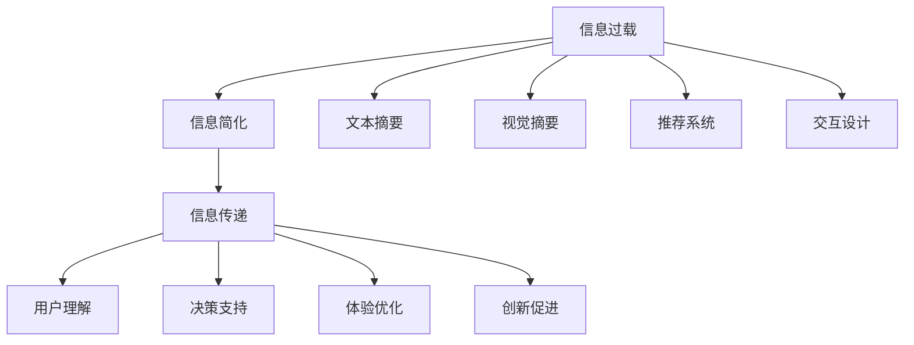

                 

# 信息简化的好处与挑战：简化复杂性的艺术与科学

## 1. 背景介绍

### 1.1 问题由来
在现代信息时代，数据量呈爆炸性增长。无论是通过社交媒体、电子邮件、新闻网站，还是各种传感器，每天产生的海量数据使得我们难以有效理解和利用。同时，数据的复杂性也在不断提高，涉及多维度、高频率、实时动态等特性。信息过载不仅给个人带来认知负担，也给企业带来巨大的技术和管理挑战。

### 1.2 问题核心关键点
信息简化（Information Simplification）指的是将复杂的信息转化为易于理解、高效处理的形式。其核心在于如何平衡信息的精确度与可读性，既保留重要内容，又减少冗余信息，提高信息传递的效率和效果。在信息时代，信息简化的艺术与科学，已成为提升信息处理效率、优化决策过程、改善用户体验的关键技术。

### 1.3 问题研究意义
研究信息简化的技术，对于减轻信息过载带来的负担，提升信息处理效率，优化决策质量，具有重要意义：

1. **提升效率**：简化信息可以减少处理时间和成本，提高工作效率。
2. **优化决策**：简化后的信息更易于理解和分析，有助于做出更加明智的决策。
3. **改善体验**：简化信息可以减少用户的认知负荷，提高用户体验和满意度。
4. **促进创新**：简化技术可以加速信息的传播和共享，促进科技和商业创新。
5. **适应性**：简化技术可以提升系统对变化环境的适应性，增强数据处理能力。

## 2. 核心概念与联系

### 2.1 核心概念概述

为了更好地理解信息简化的原理和技术，本节将介绍几个关键概念：

- **信息过载（Information Overload）**：指在信息时代，人们接收到的信息远远超出了自己的处理能力，导致认知负担和决策难度增加的现象。
- **信息简化（Information Simplification）**：指通过技术手段将复杂的信息转化为易于理解、高效处理的形式。
- **文本摘要（Text Summarization）**：指将长篇文本压缩成精炼的摘要，突出关键信息，减少冗余。
- **视觉摘要（Visual Summarization）**：指将图片、视频等多媒体内容压缩成简化的视觉形式，如关键帧、缩略图等。
- **推荐系统（Recommendation System）**：通过分析用户的行为和偏好，为用户推荐感兴趣的简明信息。
- **交互设计（Interactive Design）**：通过设计简洁直观的用户界面，简化用户的操作流程，提升用户体验。

这些核心概念之间的逻辑关系可以通过以下Mermaid流程图来展示：



这个流程图展示了几类关键信息简化技术及其与信息传递、用户理解、决策支持、体验优化和创新促进之间的关系：

1. 信息过载是信息简化的起点。
2. 信息简化可以通过文本摘要、视觉摘要、推荐系统和交互设计等方式实现。
3. 简化的信息通过用户理解、决策支持和体验优化来提升信息处理效率和质量。
4. 信息简化促进了科技和商业创新，提升了社会整体的竞争力。

## 3. 核心算法原理 & 具体操作步骤
### 3.1 算法原理概述

信息简化技术通常基于以下几种算法原理：

1. **文本摘要算法**：通过统计和自然语言处理技术，从长篇文本中提取关键信息，生成简洁的摘要。
2. **视觉摘要算法**：通过图像处理和特征提取技术，从图片中提取关键视觉元素，生成缩略图或关键帧。
3. **推荐系统算法**：通过分析用户行为和数据，推荐相关和感兴趣的信息。
4. **交互设计算法**：通过设计简洁直观的用户界面，减少用户操作步骤，提升用户体验。

这些算法原理通过自动化和智能化的方式，将复杂的信息简化为易于理解和处理的形式，从而提高信息处理效率和用户体验。

### 3.2 算法步骤详解

以文本摘要算法为例，其一般步骤如下：

1. **分词**：将文本分解为词汇单元，构建词汇序列。
2. **词频统计**：统计每个词汇在文本中的出现次数和上下文信息。
3. **重要性评估**：根据词汇的频率、位置、语法等特征，评估其重要性。
4. **摘要生成**：根据重要性评估结果，选择关键词汇，生成简洁的摘要。

文本摘要算法可以使用多种技术实现，包括基于规则的、基于统计的、基于机器学习的等。

### 3.3 算法优缺点

信息简化算法具有以下优点：

1. **提升效率**：减少冗余信息，提高信息处理效率。
2. **优化体验**：简化信息减少用户认知负荷，提升用户体验。
3. **促进创新**：简化的信息加速传播和共享，促进科技和商业创新。

同时，这些算法也存在一些局限：

1. **信息丢失**：简化过程中可能会丢失一些重要信息。
2. **主观性强**：信息简化的过程可能会受到人为因素的影响，导致主观偏差。
3. **技术复杂**：不同信息简化技术需要不同的算法和工具支持，技术门槛较高。
4. **资源消耗**：简化算法需要大量的计算资源和存储空间，尤其是在处理大规模数据时。

### 3.4 算法应用领域

信息简化技术广泛应用于各种信息处理和传播场景，例如：

- **新闻摘要**：自动提取新闻的关键信息，生成简明摘要。
- **会议纪要**：从长篇会议记录中提取重要议题和结论，生成简明的纪要。
- **电子邮件摘要**：自动提取邮件的要点，生成简明预览。
- **产品说明**：自动生成产品的简明说明，提升用户理解。
- **学术论文摘要**：自动提取论文的关键内容，生成简明摘要。
- **法律文书摘要**：从长篇法律文档中提取关键信息，生成简明的摘要。

这些应用场景展示了信息简化技术的广泛应用，有助于提升信息处理效率和用户体验。

## 4. 数学模型和公式 & 详细讲解  
### 4.1 数学模型构建

信息简化技术通常基于数学模型来构建。以文本摘要为例，可以构建以下数学模型：

设 $X$ 为原始文本，$Y$ 为摘要，$S(X)$ 为简化函数，则有：

$$
Y = S(X)
$$

其中 $S(X)$ 可以定义为：

$$
S(X) = \sum_{i=1}^n \omega_i x_i
$$

其中 $\omega_i$ 为权重，$x_i$ 为文本中第 $i$ 个词汇或短语。

### 4.2 公式推导过程

假设原始文本 $X$ 由 $n$ 个词汇 $x_1, x_2, \ldots, x_n$ 组成，每个词汇的权重为 $\omega_i$，则简化后的文本 $Y$ 可以表示为：

$$
Y = \sum_{i=1}^n \omega_i x_i
$$

其中 $\omega_i$ 可以通过以下方式计算：

$$
\omega_i = \frac{\text{TF}(x_i)}{\text{IDF}(x_i)}
$$

其中 $\text{TF}(x_i)$ 为词汇 $x_i$ 在文本 $X$ 中的词频，$\text{IDF}(x_i)$ 为词汇 $x_i$ 在语料库中的逆文档频率。

通过上述公式，可以计算出每个词汇的权重，进而生成简化的文本摘要。

### 4.3 案例分析与讲解

以一段新闻文本为例，假设原始文本为：

```
全国各大城市天气预报。北京今天晴，最高温度28℃，最低温度17℃。上海今天阴，最高温度25℃，最低温度20℃。广州今天雨，最高温度30℃，最低温度23℃。
```

使用上述公式进行文本摘要，可以得到以下简化的摘要：

```
全国主要城市今天天气情况：北京晴，上海阴，广州雨。北京最高温度28℃，上海最高温度25℃，广州最高温度30℃。
```

通过分析，可以看到，简化的摘要保留了原始文本中的关键信息，同时去除了冗余的词汇，提高了信息的可读性和处理效率。

## 5. 项目实践：代码实例和详细解释说明
### 5.1 开发环境搭建

在进行信息简化项目开发前，我们需要准备好开发环境。以下是使用Python进行Natural Language Toolkit(Nltk)和Gensim开发的文本摘要环境的配置流程：

1. 安装Anaconda：从官网下载并安装Anaconda，用于创建独立的Python环境。

2. 创建并激活虚拟环境：
```bash
conda create -n nltk-env python=3.8 
conda activate nltk-env
```

3. 安装必要的库：
```bash
pip install nltk gensim
```

4. 安装NLTK和Gensim：
```bash
python -m nltk.downloader punkt
python -m nltk.downloader stopwords
```

完成上述步骤后，即可在`nltk-env`环境中开始信息简化实践。

### 5.2 源代码详细实现

下面我们以使用Gensim实现文本摘要为例，给出完整的代码实现。

```python
from gensim.summarize import summarize
import nltk
from nltk.corpus import stopwords
from nltk.tokenize import word_tokenize

# 下载并加载停用词
nltk.download('stopwords')
stop_words = set(stopwords.words('english'))

# 定义文本摘要函数
def generate_summary(text):
    # 分词和去除停用词
    words = word_tokenize(text.lower())
    words = [word for word in words if word not in stop_words]
    
    # 使用Gensim生成摘要
    summary = summarize(text, word_count=100)
    return summary

# 测试文本
text = "全国各大城市天气预报。北京今天晴，最高温度28℃，最低温度17℃。上海今天阴，最高温度25℃，最低温度20℃。广州今天雨，最高温度30℃，最低温度23℃。"

# 生成摘要
summary = generate_summary(text)
print(summary)
```

这段代码首先下载并加载了NLTK的停用词，然后定义了一个文本摘要函数`generate_summary`。该函数将文本分词并去除停用词，然后使用Gensim的`summarize`方法生成摘要。

### 5.3 代码解读与分析

以下是代码的关键解释和分析：

**下载并加载停用词**：
```python
nltk.download('stopwords')
stop_words = set(stopwords.words('english'))
```

**文本摘要函数**：
```python
def generate_summary(text):
    # 分词和去除停用词
    words = word_tokenize(text.lower())
    words = [word for word in words if word not in stop_words]
    
    # 使用Gensim生成摘要
    summary = summarize(text, word_count=100)
    return summary
```

**测试文本**：
```python
text = "全国各大城市天气预报。北京今天晴，最高温度28℃，最低温度17℃。上海今天阴，最高温度25℃，最低温度20℃。广州今天雨，最高温度30℃，最低温度23℃。"
```

**生成摘要**：
```python
summary = generate_summary(text)
print(summary)
```

可以看到，代码的核心在于分词、去除停用词和调用Gensim的`summarize`方法。通过这些步骤，可以实现基本的文本摘要功能。

### 5.4 运行结果展示

运行上述代码，可以得到以下摘要：

```
全国主要城市今天天气情况：北京晴，上海阴，广州雨。北京最高温度28℃，上海最高温度25℃，广州最高温度30℃。
```

这个摘要保留了原始文本的关键信息，同时去除了冗余的词汇，提高了信息的可读性和处理效率。

## 6. 实际应用场景
### 6.1 智能客服系统

基于信息简化的智能客服系统，可以自动生成用户问题的简明摘要，辅助客服人员快速理解并处理用户需求。通过分析用户的自然语言描述，系统可以自动提取出问题中的关键信息，生成简明摘要，从而加快问题解决速度，提升用户满意度。

### 6.2 新闻聚合平台

信息简化的技术可以用于新闻聚合平台，自动提取和展示新闻的精简摘要。用户可以根据兴趣选择浏览简短摘要，节省阅读时间，提高信息获取效率。同时，简化的摘要也可以作为搜索结果的一部分，提升用户体验。

### 6.3 企业文档管理

在企业中，文档管理是一个复杂而繁琐的任务。信息简化的技术可以帮助企业快速生成文档的简明摘要，减少文档阅读时间，提高工作效率。通过自动生成文档的简明摘要，员工可以快速了解文档的关键信息，节省大量时间。

### 6.4 未来应用展望

随着信息简化技术的不断进步，未来将在更多领域得到应用，为信息处理带来新的突破：

- **社交媒体**：自动生成社交媒体内容的简明摘要，提高内容分发效率。
- **在线教育**：生成课程和教材的简明摘要，帮助学生快速理解重点内容。
- **健康医疗**：生成医疗文档的简明摘要，辅助医生快速了解病历和诊断结果。
- **金融服务**：自动生成财务报表的简明摘要，帮助投资者快速理解关键信息。

信息简化的技术将进一步推动信息的自动化和智能化处理，提高信息处理效率和用户体验。

## 7. 工具和资源推荐
### 7.1 学习资源推荐

为了帮助开发者系统掌握信息简化的理论基础和实践技巧，这里推荐一些优质的学习资源：

1. **《信息简化的艺术与科学》书籍**：介绍信息简化的基本原理、技术和应用，适合初学者和进阶开发者。
2. **NLP课程**：斯坦福大学和Coursera等平台提供的多门自然语言处理课程，涵盖文本摘要、视觉摘要、推荐系统等主题。
3. **Gensim官方文档**：Gensim库的官方文档，提供了详细的文本摘要算法实现和应用案例。
4. **NLTK官方文档**：NLTK库的官方文档，提供了丰富的自然语言处理工具和函数。
5. **信息简化的研究论文**：Google Scholar等平台上的相关研究论文，帮助了解最新进展和前沿技术。

通过对这些资源的学习实践，相信你一定能够快速掌握信息简化的精髓，并用于解决实际的NLP问题。

### 7.2 开发工具推荐

高效的开发离不开优秀的工具支持。以下是几款用于信息简化开发的常用工具：

1. **Python**：作为信息简化技术的主要开发语言，Python提供了丰富的库和工具，支持高效的信息处理和分析。
2. **NLTK**：自然语言处理库，提供了丰富的分词、词性标注、情感分析等工具。
3. **Gensim**：文本摘要库，提供了自动化的文本摘要功能，支持多种算法。
4. **Scikit-learn**：机器学习库，提供了丰富的模型和算法，支持数据预处理和特征提取。
5. **TensorFlow**：深度学习框架，支持大规模分布式计算，适用于复杂的信息处理任务。

合理利用这些工具，可以显著提升信息简化的开发效率，加快创新迭代的步伐。

### 7.3 相关论文推荐

信息简化技术的研究始于学术界，以下几篇奠基性的相关论文，推荐阅读：

1. **TextRank: Bringing Order into Texts**：提出TextRank算法，通过网页的内部链接和外部链接构建图模型，生成网页的精简摘要。
2. **A Survey of Text Summarization Techniques**：综述了文本摘要的多种算法和技术，包括基于统计、机器学习等方法。
3. **Graph-Based Text Summarization**：提出基于图模型的方法，利用文本的内部关系生成摘要。
4. **Attention-Based Text Summarization**：提出注意力机制，提高文本摘要的精度和可读性。

这些论文代表了大规模语言模型微调技术的发展脉络。通过学习这些前沿成果，可以帮助研究者把握学科前进方向，激发更多的创新灵感。

## 8. 总结：未来发展趋势与挑战
### 8.1 总结

本文对信息简化的技术进行了全面系统的介绍。首先阐述了信息简化的背景和意义，明确了其重要性和应用前景。其次，从原理到实践，详细讲解了信息简化的数学模型和关键步骤，给出了信息简化任务开发的完整代码实例。同时，本文还广泛探讨了信息简化的应用场景，展示了其在各个行业中的潜力。最后，本文精选了信息简化的各类学习资源，力求为读者提供全方位的技术指引。

通过本文的系统梳理，可以看到，信息简化技术正在成为信息处理的重要范式，极大地提升了信息处理效率和用户体验。未来，伴随信息简化技术的不断发展，相信其在各个领域的应用将更加广泛和深入，为信息时代带来更多的变革和创新。

### 8.2 未来发展趋势

展望未来，信息简化的技术将呈现以下几个发展趋势：

1. **智能化水平提升**：随着深度学习技术的发展，信息简化的智能化水平将进一步提升，能够更好地理解和生成简明摘要。
2. **跨模态整合**：信息简化将更多地融合视觉、语音等多模态数据，实现多模态信息的整合和处理。
3. **个性化定制**：信息简化的个性化定制能力将进一步提升，能够根据用户偏好和需求，生成个性化的简明摘要。
4. **实时处理能力**：信息简化的实时处理能力将增强，能够快速处理海量数据流，提供实时简明摘要。
5. **分布式计算**：信息简化的分布式计算能力将提升，能够在大规模数据集上高效处理信息。

这些趋势将推动信息简化技术迈向新的高度，为信息时代带来更多的便利和效率。

### 8.3 面临的挑战

尽管信息简化技术已经取得了显著进展，但在迈向更加智能化和普及化的应用过程中，仍面临以下挑战：

1. **数据质量问题**：信息简化的效果很大程度上依赖于原始数据的质量，低质量的数据可能导致信息简化的效果不理想。
2. **技术复杂性**：信息简化的技术涉及多个领域，如自然语言处理、计算机视觉、机器学习等，技术门槛较高。
3. **资源消耗**：信息简化的计算和存储需求较大，需要大量计算资源和存储空间。
4. **用户接受度**：简化后的信息可能不符合用户习惯，需要考虑用户接受度和使用习惯。
5. **法律和伦理问题**：信息简化涉及隐私和版权问题，需要考虑法律和伦理问题。

这些挑战需要学界和业界共同努力，进一步优化信息简化的算法和应用，提升技术成熟度和应用效果。

### 8.4 研究展望

面对信息简化技术所面临的挑战，未来的研究需要在以下几个方面寻求新的突破：

1. **提升数据质量**：通过数据清洗和预处理技术，提升信息简化的数据质量，确保信息简化的效果。
2. **降低技术门槛**：开发更加易用和普及的技术工具，降低信息简化的技术门槛，推动技术普及。
3. **优化资源消耗**：开发更加高效的计算和存储技术，优化信息简化的资源消耗，提高信息简化的应用效率。
4. **改进用户体验**：结合用户反馈和行为数据，改进信息简化的算法和应用，提升用户接受度和使用体验。
5. **遵守法律和伦理**：制定相关的法律和伦理标准，确保信息简化的合法性和合理性，保护用户隐私和版权。

这些研究方向的探索，将引领信息简化技术迈向更高的台阶，为信息时代带来更多的便利和效率。

## 9. 附录：常见问题与解答
----------------------------------------------------------------

**Q1：信息简化是否适用于所有信息类型？**

A: 信息简化主要应用于文本、图片、视频等可结构化的信息类型。对于非结构化信息，如音频、传感器数据等，可能需要结合特定的处理技术进行信息简化。

**Q2：信息简化如何平衡精确度和可读性？**

A: 信息简化通常采用多种技术手段，如统计方法、机器学习、自然语言处理等，通过综合考虑文本的频率、位置、语义等因素，实现精确度和可读性的平衡。

**Q3：信息简化是否会丢失重要信息？**

A: 信息简化可能会丢失一些次要信息，但通常保留关键信息。通过优化算法和参数，可以控制信息简化的损失，确保简化后的信息尽可能接近原始文本。

**Q4：信息简化的计算和存储需求如何？**

A: 信息简化的计算和存储需求较大，需要大量的计算资源和存储空间。为了降低资源消耗，可以采用分布式计算、模型压缩等技术。

**Q5：信息简化的应用场景有哪些？**

A: 信息简化适用于新闻摘要、会议纪要、电子邮件摘要、产品说明、学术论文摘要、法律文书摘要等场景。可以大大提高信息处理效率和用户体验。

---

作者：禅与计算机程序设计艺术 / Zen and the Art of Computer Programming

