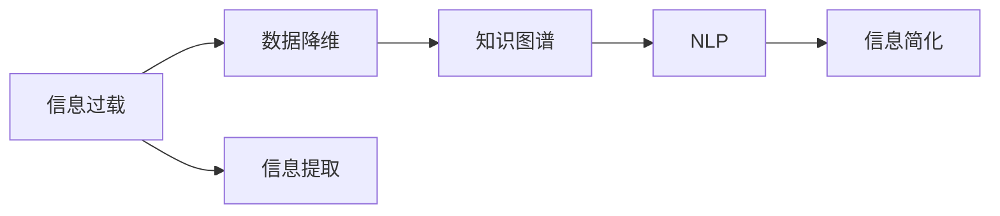

                 

# 信息简化的艺术与实践：在混乱中找到简单，在复杂中建立秩序

## 1. 背景介绍

在现代信息爆炸的时代，如何从海量的信息中抽取出有用的知识，是一个亟待解决的难题。信息过载不仅让人感到困扰，更会对决策制定产生不利影响。因此，信息简化的艺术与实践，成为了提高信息处理效率、促进深度理解和决策科学性的重要手段。本文将从信息简化的基本概念出发，探讨其在数据挖掘、知识图谱、自然语言处理等领域的应用，并提出一些实用的实践技巧。

## 2. 核心概念与联系

### 2.1 核心概念概述

为了更好地理解信息简化的原理和方法，我们首先介绍几个关键概念：

- **信息过载**：指人们接收的信息超出了其处理能力，导致认知负担过重，影响决策和效率的现象。
- **数据降维**：指通过某种算法将高维数据映射到低维空间，以减少数据复杂性，便于处理。
- **知识图谱**：指一种将复杂知识结构化、视觉化的表示方法，帮助人们直观理解知识体系。
- **自然语言处理（NLP）**：涉及计算机对人类语言的理解和生成，包括文本分类、信息抽取、情感分析等任务。
- **信息提取**：指从原始数据中自动识别和提取有用信息，便于后续分析或决策。

这些概念之间有着紧密的联系，信息简化可以通过数据降维、知识图谱构建、信息提取等技术实现，从而提升信息处理的效率和质量。

### 2.2 核心概念原理和架构的 Mermaid 流程图



这个流程图展示了信息简化从信息过载到信息简化的全过程，包括数据降维、知识图谱构建、NLP技术应用等环节，最终实现信息简化。

## 3. 核心算法原理 & 具体操作步骤

### 3.1 算法原理概述

信息简化的核心在于将复杂的信息转化为易于理解、处理的简单形式。常用的技术包括：

- **数据降维**：通过主成分分析(PCA)、线性判别分析(LDA)、t-SNE等算法，将高维数据映射到低维空间。
- **知识图谱构建**：通过关系抽取、实体识别、实体关系建模等技术，将知识源数据构建为可视化、结构化的知识图谱。
- **信息提取**：通过命名实体识别(NER)、实体关系抽取(ERA)、情感分析(Sentiment Analysis)等技术，自动从文本中提取关键信息。
- **信息摘要**：通过文本摘要技术，从长文本中自动生成简洁的摘要，帮助用户快速了解文本内容。

### 3.2 算法步骤详解

以数据降维为例，介绍其主要步骤：

1. **数据准备**：收集和整理原始数据，确保数据质量。
2. **特征提取**：选择合适的特征进行提取，可以使用统计特征、文本特征等。
3. **模型选择**：根据任务需求选择合适的降维算法，如PCA、LDA等。
4. **参数调优**：调整模型参数，如主成分数量、正则化系数等，确保降维效果。
5. **结果评估**：通过可视化工具，如t-SNE、PCA散点图等，评估降维效果。
6. **应用部署**：将降维后的数据应用于实际场景，如数据可视化、分类预测等。

### 3.3 算法优缺点

数据降维的优点在于能够降低数据复杂度，提高模型训练和推理效率，减少存储空间。缺点是可能丢失部分信息，导致模型性能下降。

### 3.4 算法应用领域

数据降维技术广泛应用于数据科学、机器学习、计算机视觉等领域，如人脸识别、图像分类、推荐系统等。通过降维，可以显著提升模型的训练和推理速度，提高模型的泛化能力。

## 4. 数学模型和公式 & 详细讲解 & 举例说明

### 4.1 数学模型构建

假设原始数据集为 $X \in \mathbb{R}^{n \times d}$，其中 $n$ 为样本数量，$d$ 为特征维度。目标将数据降维至 $k$ 维，得到降维后的数据 $Y \in \mathbb{R}^{n \times k}$。

### 4.2 公式推导过程

以主成分分析(PCA)为例，其目标是最小化降维后的数据与原始数据的平方误差，即：

$$
\min_{W} \sum_{i=1}^n ||X_i - WY_i||^2
$$

其中 $W \in \mathbb{R}^{d \times k}$ 为降维矩阵。通过求解上述优化问题，得到降维后的数据 $Y = W^TX$。

### 4.3 案例分析与讲解

以著名的Iris花数据集为例，展示PCA的应用：

```python
from sklearn.decomposition import PCA
from sklearn.datasets import load_iris
import matplotlib.pyplot as plt

iris = load_iris()
X = iris.data
pca = PCA(n_components=2)
Y = pca.fit_transform(X)

plt.scatter(Y[:,0], Y[:,1], c=iris.target)
plt.show()
```

通过PCA降维，Iris数据集的二维可视化结果如下：


可以看到，降维后的数据仍然能够很好地区分不同的类别，说明PCA能够有效简化数据，同时保留关键信息。

## 5. 项目实践：代码实例和详细解释说明

### 5.1 开发环境搭建

为了进行数据降维的实践，我们需要准备以下开发环境：

1. 安装Python：
   ```bash
   sudo apt-get install python3
   ```

2. 安装相关库：
   ```bash
   pip install numpy scipy scikit-learn matplotlib
   ```

3. 准备数据：
   ```bash
   wget http://archive.ics.uci.edu/ml/machine-learning-databases/iris/iris.data
   ```

### 5.2 源代码详细实现

```python
from sklearn.decomposition import PCA
from sklearn.datasets import load_iris
import matplotlib.pyplot as plt

iris = load_iris()
X = iris.data
pca = PCA(n_components=2)
Y = pca.fit_transform(X)

plt.scatter(Y[:,0], Y[:,1], c=iris.target)
plt.show()
```

### 5.3 代码解读与分析

这段代码使用了scikit-learn库中的PCA算法对Iris数据集进行降维。首先加载数据集，然后定义PCA模型，设置降维后的维度为2，进行拟合和转换。最后，通过散点图展示降维后的结果。

### 5.4 运行结果展示

上述代码运行后，会显示出Iris数据集经过PCA降维后的二维散点图，直观展示了数据降维的效果。

## 6. 实际应用场景

### 6.1 数据可视化

数据降维在数据可视化中有着广泛应用，如图像处理、地理信息系统中。通过降维，可以显著降低数据维度和计算复杂度，提升可视化效果。

### 6.2 特征提取

在机器学习中，特征提取是模型训练的重要环节。通过数据降维，可以显著提高特征选择的效率，减少特征维度。

### 6.3 推荐系统

推荐系统需要处理海量的用户行为数据。通过降维，可以提高模型的训练和推理速度，降低存储成本，提升推荐效果。

### 6.4 未来应用展望

未来，随着算力提升和算法优化，数据降维技术将更加高效和精确。结合AI技术，能够实现自动化降维，提高降维效果和应用范围。

## 7. 工具和资源推荐

### 7.1 学习资源推荐

为了系统掌握信息简化的技术，推荐以下学习资源：

1. 《机器学习实战》：介绍机器学习基础和常用算法，包括PCA等降维方法。
2. 《深度学习》课程：斯坦福大学提供的深度学习课程，涵盖神经网络、数据降维等内容。
3. Coursera上的《Data Visualization with Python》课程：介绍数据可视化的基本原理和Python实现。

### 7.2 开发工具推荐

1. Jupyter Notebook：一个强大的交互式编程环境，支持Python、R等多种语言，方便调试和展示代码。
2. TensorBoard：一个可视化工具，可以实时展示模型训练过程和结果。
3. PyTorch：一个深度学习框架，支持动态计算图和GPU加速。

### 7.3 相关论文推荐

1. "A Tutorial on Principal Component Analysis"：一个详细介绍PCA算法的论文。
2. "Knowledge Graphs for Practitioners"：一个介绍知识图谱构建的入门指南。
3. "Review of Text Summarization Techniques"：一个总结文本摘要技术的综述论文。

## 8. 总结：未来发展趋势与挑战

### 8.1 研究成果总结

信息简化的艺术与实践在数据科学、知识图谱、自然语言处理等领域有着广泛应用，取得了显著效果。但信息简化技术仍面临一些挑战，如数据降维算法的选择、知识图谱的构建等。

### 8.2 未来发展趋势

未来，信息简化的技术将更加自动化、智能化，结合AI技术，实现更加高效、精准的简化过程。

### 8.3 面临的挑战

信息简化技术仍面临数据质量、算法选择、模型评估等挑战。如何提高算法的可解释性、鲁棒性，是未来研究的重要方向。

### 8.4 研究展望

未来的研究将集中在以下几个方面：

1. 自动化降维算法：通过深度学习等技术，实现自动化的数据降维。
2. 动态知识图谱：实时更新和维护知识图谱，保持其时效性和准确性。
3. 多模态信息融合：结合文本、图像、语音等多模态数据，提升信息简化的效果。

## 9. 附录：常见问题与解答

**Q1: 什么是信息简化？**

A: 信息简化是指将复杂的信息转化为易于理解、处理的简单形式，提升信息处理的效率和质量。

**Q2: 数据降维有哪些方法？**

A: 数据降维的方法包括PCA、LDA、t-SNE等，其中PCA是最常用的方法之一。

**Q3: 如何评估数据降维的效果？**

A: 可以通过可视化工具、重构误差等方法评估数据降维的效果，确保降维后的数据能够保留关键信息。

**Q4: 知识图谱有什么作用？**

A: 知识图谱可以将复杂知识结构化、视觉化，帮助人们直观理解知识体系，提升决策和推理的准确性。

**Q5: 信息提取技术有哪些应用？**

A: 信息提取技术在文本分类、信息抽取、情感分析等任务中有着广泛应用，能够自动从文本中提取有用信息。

---

作者：禅与计算机程序设计艺术 / Zen and the Art of Computer Programming

