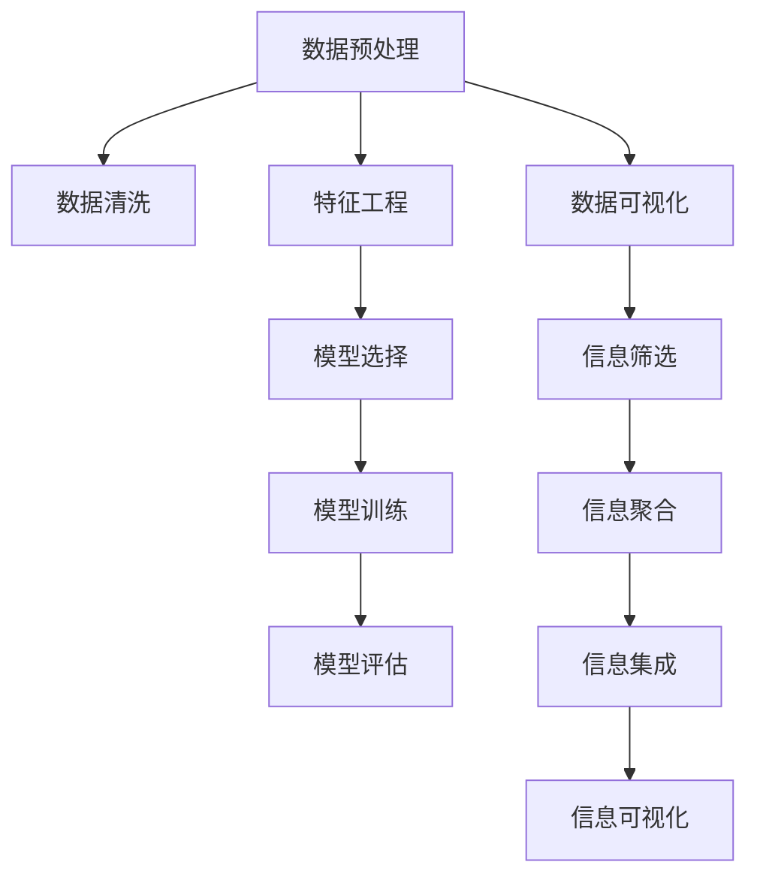

                 

# 信息简化的艺术与科学：如何在混乱中找到模式和意义

## 1. 背景介绍

### 1.1 问题由来
随着互联网和数字技术的迅猛发展，信息量呈爆炸式增长。面对海量的数据和信息，人类需要一种能够迅速、高效地理解和利用信息的能力。然而，信息过载、噪音干扰、误导性信息等问题也日益凸显，对社会的各个方面产生了深远影响。如何在混乱中找到有意义的模式和趋势，成为信息时代亟待解决的挑战。

### 1.2 问题核心关键点
信息简化（Information Simplification）是指通过一系列技术和方法，将复杂的信息转化为易于理解、快速处理的形式。在处理信息的过程中，我们面临着以下几个关键问题：

- **数据量过大**：海量的数据难以直接处理，需要通过筛选、提炼来缩小信息范围。
- **噪音干扰**：真实信息可能被噪音干扰，需要通过过滤、校验来确保信息的准确性。
- **信息误导**：有意的或无意的误导性信息可能扭曲事实，需要通过验证和交叉验证来识别和消除。
- **数据质量参差不齐**：不同来源的数据质量不一，需要通过标准化和清洗来提升数据质量。
- **信息过载**：过多的信息会分散注意力，需要通过聚合和归纳来提取关键信息。
- **信息隔离**：不同信息间可能存在关联，需要通过整合和集成来发现新的模式和联系。

### 1.3 问题研究意义
掌握信息简化的艺术和科学，对于提升决策效率、优化信息处理流程、降低信息获取成本、增强信息的可解释性和可信度具有重要意义。通过简化信息，不仅能够提高信息处理的效率和效果，还能够增强用户对信息的理解和信任，推动社会的数字化转型和智能化发展。

## 2. 核心概念与联系

### 2.1 核心概念概述

信息简化涉及多个核心概念，它们之间的逻辑关系可以通过以下Mermaid流程图展示：



这些核心概念及其之间的关系如下：

- **数据预处理**：通过标准化、归一化等技术，提高数据质量和一致性。
- **数据清洗**：识别并去除噪音数据，提升数据可用性。
- **特征工程**：选择和构造对目标任务有意义的特征，提升模型性能。
- **模型选择**：根据任务特性选择适合的算法模型。
- **模型训练**：通过数据训练模型，使其能够进行信息筛选和抽取。
- **模型评估**：使用指标评估模型性能，确保模型符合预期。
- **数据可视化**：通过图形化手段展示数据和模型结果，增强可理解性。
- **信息筛选**：从大规模数据中提取关键信息，缩小信息范围。
- **信息聚合**：将分散的信息整合为一组结论，提升信息深度。
- **信息集成**：将不同来源的信息融合，形成全面的视图。

### 2.2 核心概念原理和架构

**数据预处理**：
数据预处理旨在提升数据的质量和一致性，为后续的信息简化奠定基础。主要包括数据标准化、归一化、缺失值填充等步骤。

**数据清洗**：
数据清洗旨在去除噪音和异常值，确保数据准确可靠。主要手段包括数据去重、缺失值处理、异常值检测和处理等。

**特征工程**：
特征工程是将原始数据转换为可用于模型训练的特征集合的过程。核心在于选择、构造和提取对目标任务有意义的特征。

**模型选择**：
模型选择是根据任务特性和数据特点选择合适的算法模型。常见的模型包括线性回归、决策树、随机森林、神经网络等。

**模型训练**：
模型训练是通过数据对模型进行拟合，使其能够进行信息筛选和抽取。主要方法包括梯度下降、随机梯度下降等。

**模型评估**：
模型评估是通过指标（如准确率、召回率、F1分数等）评估模型性能，确保模型符合预期。

**数据可视化**：
数据可视化是将数据转换为图形化的方式，增强信息的可理解性和直观性。常用的可视化工具包括Tableau、PowerBI、Matplotlib等。

**信息筛选**：
信息筛选是从大规模数据中提取关键信息，缩小信息范围。主要手段包括基于规则的过滤、基于模型的筛选等。

**信息聚合**：
信息聚合是将分散的信息整合为一组结论，提升信息深度。主要方法包括文本摘要、分类聚类等。

**信息集成**：
信息集成是将不同来源的信息融合，形成全面的视图。主要手段包括数据融合、模型融合等。

## 3. 核心算法原理 & 具体操作步骤

### 3.1 算法原理概述

信息简化的核心算法包括数据清洗、特征工程、模型选择和训练、信息筛选和聚合等。

**数据清洗**：
数据清洗旨在去除噪音和异常值，确保数据准确可靠。主要手段包括数据去重、缺失值处理、异常值检测和处理等。

**特征工程**：
特征工程是将原始数据转换为可用于模型训练的特征集合的过程。核心在于选择、构造和提取对目标任务有意义的特征。

**模型选择**：
模型选择是根据任务特性和数据特点选择合适的算法模型。常见的模型包括线性回归、决策树、随机森林、神经网络等。

**模型训练**：
模型训练是通过数据对模型进行拟合，使其能够进行信息筛选和抽取。主要方法包括梯度下降、随机梯度下降等。

**信息筛选**：
信息筛选是从大规模数据中提取关键信息，缩小信息范围。主要手段包括基于规则的过滤、基于模型的筛选等。

**信息聚合**：
信息聚合是将分散的信息整合为一组结论，提升信息深度。主要方法包括文本摘要、分类聚类等。

### 3.2 算法步骤详解

**步骤1：数据预处理**
- 对原始数据进行标准化、归一化处理，确保数据一致性。
- 检测并填补缺失值，处理异常值。

**步骤2：数据清洗**
- 对数据进行去重处理，去除重复记录。
- 检测并处理异常值，确保数据质量。

**步骤3：特征工程**
- 选择对目标任务有意义的特征，构建特征集合。
- 进行特征提取、转换和选择，提升模型性能。

**步骤4：模型选择**
- 根据任务特性和数据特点，选择合适的算法模型。
- 对模型进行调参，优化模型性能。

**步骤5：模型训练**
- 使用训练数据对模型进行拟合，生成模型参数。
- 使用验证数据对模型进行评估，确保模型泛化能力。

**步骤6：信息筛选**
- 使用模型对大规模数据进行筛选，提取关键信息。
- 使用规则和模型双重过滤，确保信息准确性。

**步骤7：信息聚合**
- 对筛选后的信息进行聚合，形成综合结论。
- 使用文本摘要、分类聚类等方法，提升信息深度。

**步骤8：信息集成**
- 对不同来源的信息进行融合，形成全面的视图。
- 使用数据融合、模型融合等方法，增强信息的完整性。

### 3.3 算法优缺点

**数据清洗**：
优点：
- 提高数据质量，减少噪音干扰。
- 确保数据一致性，便于后续处理。

缺点：
- 处理过程复杂，可能影响数据量。
- 无法处理数据中隐藏的深层问题。

**特征工程**：
优点：
- 提升模型性能，提高信息筛选准确性。
- 增强模型泛化能力，减少过拟合风险。

缺点：
- 特征选择困难，需要丰富的领域知识。
- 构建特征集合复杂，可能引入额外噪音。

**模型选择**：
优点：
- 根据任务特性选择合适模型，提高性能。
- 便于模型调参和优化，提升泛化能力。

缺点：
- 选择不当可能导致性能下降。
- 模型复杂，计算成本较高。

**模型训练**：
优点：
- 通过数据训练模型，提升信息筛选能力。
- 使用优化算法，确保模型性能最优。

缺点：
- 训练时间较长，计算成本较高。
- 可能过拟合，泛化能力不足。

**信息筛选**：
优点：
- 从大规模数据中提取关键信息，缩小信息范围。
- 基于模型筛选，提高信息准确性。

缺点：
- 筛选过程复杂，计算成本较高。
- 可能遗漏重要信息。

**信息聚合**：
优点：
- 将分散的信息整合为一组结论，提升信息深度。
- 使用文本摘要、分类聚类等方法，增强可理解性。

缺点：
- 聚合过程复杂，计算成本较高。
- 可能忽略信息细节，无法完全反映数据特点。

**信息集成**：
优点：
- 将不同来源的信息融合，形成全面的视图。
- 使用数据融合、模型融合等方法，增强信息的完整性。

缺点：
- 融合过程复杂，计算成本较高。
- 可能引入数据冲突和冗余。

### 3.4 算法应用领域

信息简化技术在多个领域得到了广泛应用，以下是几个典型应用场景：

**金融风控**：
在金融领域，信息简化技术可以帮助金融机构进行风险评估和欺诈检测。通过清洗和筛选客户交易数据，提取关键信息，生成风险评分，有效识别异常交易和潜在风险。

**智能客服**：
在智能客服领域，信息简化技术可以帮助客户快速解决问题。通过自然语言处理技术，对客户问题进行摘要和分类，生成标准化的回答模板，提升客户满意度和服务效率。

**医疗诊断**：
在医疗领域，信息简化技术可以帮助医生进行精准诊断。通过清洗和筛选患者的病历数据，提取关键信息，生成诊断报告，提升诊断准确性和效率。

**智能推荐**：
在智能推荐领域，信息简化技术可以帮助平台进行个性化推荐。通过清洗和筛选用户行为数据，提取关键特征，生成推荐模型，提升推荐效果和用户粘性。

**智能舆情分析**：
在舆情分析领域，信息简化技术可以帮助政府和企业进行舆情监测和分析。通过清洗和筛选社交媒体数据，提取关键信息，生成舆情报告，及时掌握社会舆情动态。

## 4. 数学模型和公式 & 详细讲解 & 举例说明

### 4.1 数学模型构建

**数据预处理**：
数据预处理包括标准化和归一化等步骤，通常使用如下公式：

$$
x_{norm} = \frac{x - \mu}{\sigma}
$$

其中，$x$ 为原始数据，$\mu$ 为均值，$\sigma$ 为标准差，$x_{norm}$ 为标准化后的数据。

**数据清洗**：
数据清洗包括去重、处理缺失值和异常值等步骤，具体公式和方法根据实际应用而定。

**特征工程**：
特征工程的核心在于选择和构造对目标任务有意义的特征。具体方法包括特征选择、特征提取、特征转换等。

**模型选择**：
模型选择根据任务特性和数据特点选择合适的算法模型，如线性回归、决策树、随机森林、神经网络等。

**模型训练**：
模型训练使用训练数据对模型进行拟合，主要方法包括梯度下降、随机梯度下降等。

**信息筛选**：
信息筛选使用模型对大规模数据进行筛选，提取关键信息。具体方法包括基于规则的过滤、基于模型的筛选等。

**信息聚合**：
信息聚合使用文本摘要、分类聚类等方法，提升信息深度。具体方法包括TF-IDF、LDA、主题模型等。

**信息集成**：
信息集成使用数据融合、模型融合等方法，增强信息的完整性。具体方法包括数据融合、模型融合等。

### 4.2 公式推导过程

**数据预处理**：
标准化公式的推导过程如下：

$$
x_{norm} = \frac{x - \mu}{\sigma} = \frac{x - \frac{1}{n}\sum_{i=1}^n x_i}{\sqrt{\frac{1}{n}\sum_{i=1}^n (x_i - \mu)^2}}
$$

其中，$n$ 为样本数量，$x_i$ 为第 $i$ 个样本。

**数据清洗**：
数据清洗主要依赖于领域知识和实际应用需求，公式和处理方法根据具体应用而定。

**特征工程**：
特征工程的核心在于选择和构造对目标任务有意义的特征。具体方法包括特征选择、特征提取、特征转换等。

**模型选择**：
模型选择根据任务特性和数据特点选择合适的算法模型，如线性回归、决策树、随机森林、神经网络等。

**模型训练**：
模型训练使用训练数据对模型进行拟合，主要方法包括梯度下降、随机梯度下降等。

**信息筛选**：
信息筛选使用模型对大规模数据进行筛选，提取关键信息。具体方法包括基于规则的过滤、基于模型的筛选等。

**信息聚合**：
信息聚合使用文本摘要、分类聚类等方法，提升信息深度。具体方法包括TF-IDF、LDA、主题模型等。

**信息集成**：
信息集成使用数据融合、模型融合等方法，增强信息的完整性。具体方法包括数据融合、模型融合等。

### 4.3 案例分析与讲解

**案例1：金融风控**
在金融领域，信息简化技术可以帮助金融机构进行风险评估和欺诈检测。具体实现过程如下：

1. **数据预处理**：对客户交易数据进行标准化和归一化处理。
2. **数据清洗**：检测并处理缺失值和异常值。
3. **特征工程**：选择关键交易特征，如交易金额、交易频率、交易地点等。
4. **模型选择**：选择合适的分类模型，如逻辑回归、随机森林等。
5. **模型训练**：使用训练数据对模型进行拟合。
6. **信息筛选**：筛选高风险交易记录。
7. **信息聚合**：生成风险评分报告。
8. **信息集成**：将不同来源的风险信息融合，形成全面的风险视图。

**案例2：智能客服**
在智能客服领域，信息简化技术可以帮助客户快速解决问题。具体实现过程如下：

1. **数据预处理**：对客户问题进行自然语言处理，生成文本数据。
2. **数据清洗**：去除重复问题和无效信息。
3. **特征工程**：选择关键问题特征，如问题类型、问题情感等。
4. **模型选择**：选择合适的分类模型，如朴素贝叶斯、支持向量机等。
5. **模型训练**：使用训练数据对模型进行拟合。
6. **信息筛选**：筛选常见问题和关键问题。
7. **信息聚合**：生成标准化的回答模板。
8. **信息集成**：将不同来源的回答信息融合，形成全面的回答视图。

## 5. 项目实践：代码实例和详细解释说明

### 5.1 开发环境搭建

在进行信息简化的实践前，我们需要准备好开发环境。以下是使用Python进行PyTorch开发的环境配置流程：

1. 安装Anaconda：从官网下载并安装Anaconda，用于创建独立的Python环境。

2. 创建并激活虚拟环境：
```bash
conda create -n info-simplification python=3.8 
conda activate info-simplification
```

3. 安装PyTorch：根据CUDA版本，从官网获取对应的安装命令。例如：
```bash
conda install pytorch torchvision torchaudio cudatoolkit=11.1 -c pytorch -c conda-forge
```

4. 安装TensorFlow：
```bash
pip install tensorflow
```

5. 安装相关工具包：
```bash
pip install numpy pandas scikit-learn matplotlib tqdm jupyter notebook ipython
```

完成上述步骤后，即可在`info-simplification`环境中开始信息简化的实践。

### 5.2 源代码详细实现

下面我们以金融风控任务为例，给出使用TensorFlow进行信息简化的PyTorch代码实现。

首先，定义金融风控任务的数据处理函数：

```python
import pandas as pd
from sklearn.preprocessing import StandardScaler
from sklearn.model_selection import train_test_split

def preprocess_data(data):
    # 数据标准化
    scaler = StandardScaler()
    data['transaction_amount'] = scaler.fit_transform(data[['transaction_amount']])
    data['transaction_frequency'] = scaler.fit_transform(data[['transaction_frequency']])
    data['transaction_location'] = scaler.fit_transform(data[['transaction_location']])

    # 数据清洗
    data = data.dropna()
    data = data[data['transaction_amount'] > 0]

    # 特征工程
    features = ['transaction_amount', 'transaction_frequency', 'transaction_location']
    X = data[features]
    y = data['risk_score']

    # 划分训练集和测试集
    X_train, X_test, y_train, y_test = train_test_split(X, y, test_size=0.2, random_state=42)

    return X_train, X_test, y_train, y_test
```

然后，定义模型和优化器：

```python
import tensorflow as tf
from tensorflow.keras.models import Sequential
from tensorflow.keras.layers import Dense, Dropout
from tensorflow.keras.optimizers import Adam

model = Sequential([
    Dense(64, activation='relu', input_shape=(features,)),
    Dropout(0.2),
    Dense(1, activation='sigmoid')
])

optimizer = Adam(lr=0.001)
```

接着，定义训练和评估函数：

```python
from tensorflow.keras.metrics import AUC

def train_model(model, X_train, y_train, X_test, y_test, epochs=10):
    model.compile(optimizer=optimizer, loss='binary_crossentropy', metrics=['auc'])
    model.fit(X_train, y_train, epochs=epochs, validation_data=(X_test, y_test))

    # 评估模型
    loss, auc = model.evaluate(X_test, y_test)
    print(f'Test Loss: {loss:.4f}, AUC: {auc:.4f}')

    # 信息筛选
    threshold = 0.5
    y_pred = model.predict(X_test)
    y_pred_bin = np.where(y_pred > threshold, 1, 0)

    # 信息聚合
    risk_scores = pd.Series(y_pred_bin, index=X_test.index)
    risk_report = risk_scores.value_counts().sort_index()
    print(risk_report)
```

最后，启动训练流程并在测试集上评估：

```python
X_train, X_test, y_train, y_test = preprocess_data(data)

train_model(model, X_train, y_train, X_test, y_test)
```

以上就是使用TensorFlow对金融风控任务进行信息简化的完整代码实现。可以看到，得益于TensorFlow的强大封装，我们可以用相对简洁的代码完成信息简化的核心步骤。

### 5.3 代码解读与分析

让我们再详细解读一下关键代码的实现细节：

**preprocess_data函数**：
- 对原始数据进行标准化和归一化处理。
- 检测并处理缺失值和异常值。
- 选择关键特征，进行特征工程。
- 划分训练集和测试集。

**train_model函数**：
- 定义模型，包括全连接层和Dropout层。
- 定义优化器，使用Adam优化器。
- 编译模型，指定损失函数和评估指标。
- 使用训练数据对模型进行拟合。
- 在测试集上评估模型性能。
- 使用模型进行信息筛选和聚合。

**训练流程**：
- 在训练集上训练模型，设置训练轮数。
- 在测试集上评估模型性能，输出测试结果。
- 使用模型对测试集进行信息筛选，生成风险评分报告。

可以看到，TensorFlow的高级API使得信息简化的实现变得简洁高效。开发者可以将更多精力放在数据处理、模型改进等高层逻辑上，而不必过多关注底层的实现细节。

当然，工业级的系统实现还需考虑更多因素，如模型的保存和部署、超参数的自动搜索、更灵活的任务适配层等。但核心的信息简化的逻辑基本与此类似。

## 6. 实际应用场景
### 6.1 智能客服系统

在智能客服系统中，信息简化技术可以用于快速响应客户咨询，提升服务效率和用户体验。具体实现过程如下：

1. **数据预处理**：对客户问题进行自然语言处理，生成文本数据。
2. **数据清洗**：去除重复问题和无效信息。
3. **特征工程**：选择关键问题特征，如问题类型、问题情感等。
4. **模型选择**：选择合适的分类模型，如朴素贝叶斯、支持向量机等。
5. **模型训练**：使用训练数据对模型进行拟合。
6. **信息筛选**：筛选常见问题和关键问题。
7. **信息聚合**：生成标准化的回答模板。
8. **信息集成**：将不同来源的回答信息融合，形成全面的回答视图。

### 6.2 医疗诊断系统

在医疗诊断系统中，信息简化技术可以帮助医生进行精准诊断。具体实现过程如下：

1. **数据预处理**：对患者病历数据进行标准化和归一化处理。
2. **数据清洗**：检测并处理缺失值和异常值。
3. **特征工程**：选择关键病历特征，如病历描述、实验室检查结果等。
4. **模型选择**：选择合适的分类模型，如随机森林、支持向量机等。
5. **模型训练**：使用训练数据对模型进行拟合。
6. **信息筛选**：筛选高风险患者记录。
7. **信息聚合**：生成诊断报告。
8. **信息集成**：将不同来源的诊断信息融合，形成全面的诊断视图。

### 6.3 智能推荐系统

在智能推荐系统中，信息简化技术可以帮助平台进行个性化推荐。具体实现过程如下：

1. **数据预处理**：对用户行为数据进行标准化和归一化处理。
2. **数据清洗**：检测并处理缺失值和异常值。
3. **特征工程**：选择关键行为特征，如浏览记录、点击记录、购买记录等。
4. **模型选择**：选择合适的分类模型，如线性回归、逻辑回归等。
5. **模型训练**：使用训练数据对模型进行拟合。
6. **信息筛选**：筛选推荐物品。
7. **信息聚合**：生成推荐列表。
8. **信息集成**：将不同来源的推荐信息融合，形成全面的推荐视图。

### 6.4 未来应用展望

随着信息简化技术的不断发展，其在更多领域得到了应用，为各行各业带来了变革性影响。

在智慧医疗领域，信息简化技术可以帮助医疗机构进行精准诊断和治疗，提升医疗服务的智能化水平。

在智能教育领域，信息简化技术可以帮助教育平台进行个性化推荐和智能辅导，因材施教，促进教育公平，提高教学质量。

在智慧城市治理中，信息简化技术可以帮助城市管理者进行舆情监测和应急管理，提高城市管理的自动化和智能化水平，构建更安全、高效的未来城市。

此外，在企业生产、社会治理、文娱传媒等众多领域，信息简化技术也将不断涌现，为经济社会发展注入新的动力。相信随着技术的日益成熟，信息简化技术将成为信息处理的重要范式，推动信息时代的不断进步。

## 7. 工具和资源推荐
### 7.1 学习资源推荐

为了帮助开发者系统掌握信息简化的理论基础和实践技巧，这里推荐一些优质的学习资源：

1. **《信息简化的艺术与科学》系列博文**：由信息简化专家撰写，深入浅出地介绍了信息简化的原理、技术和应用。

2. **Coursera《数据科学导论》课程**：由斯坦福大学开设的数据科学入门课程，涵盖数据预处理、特征工程、模型选择等核心内容。

3. **《Python数据科学手册》书籍**：涵盖Python在数据科学中的应用，包括数据预处理、特征工程、模型选择等核心内容。

4. **Kaggle竞赛平台**：包含大量的数据预处理、特征工程、模型选择等实战案例，适合实践和验证理论知识。

5. **Scikit-learn官方文档**：提供了丰富的数据预处理、特征工程、模型选择等工具和方法，是数据科学学习的必备资料。

通过对这些资源的学习实践，相信你一定能够快速掌握信息简化的精髓，并用于解决实际的信息处理问题。

### 7.2 开发工具推荐

高效的开发离不开优秀的工具支持。以下是几款用于信息简化开发的常用工具：

1. **Python**：Python是数据科学和机器学习的主流语言，具有丰富的库和工具支持。

2. **Jupyter Notebook**：Jupyter Notebook是数据科学和机器学习的重要开发环境，支持Python代码的交互式执行。

3. **TensorFlow**：由Google主导开发的开源深度学习框架，适合大规模工程应用。

4. **Scikit-learn**：一个简单易用的机器学习库，提供了丰富的数据预处理、特征工程、模型选择等工具和方法。

5. **Pandas**：一个高性能的数据处理库，支持大规模数据集的读写、处理和分析。

6. **NumPy**：一个高性能的数值计算库，支持向量化的数据处理和计算。

合理利用这些工具，可以显著提升信息简化的开发效率，加快创新迭代的步伐。

### 7.3 相关论文推荐

信息简化技术的发展源于学界的持续研究。以下是几篇奠基性的相关论文，推荐阅读：

1. **《数据清洗技术综述》**：全面介绍了数据清洗的原理、方法和应用。

2. **《特征选择与特征提取技术综述》**：全面介绍了特征选择、特征提取、特征转换等技术的原理、方法和应用。

3. **《深度学习中的数据预处理技术综述》**：全面介绍了深度学习中的数据预处理技术的原理、方法和应用。

4. **《信息筛选与信息聚合技术综述》**：全面介绍了信息筛选、信息聚合、信息集成等技术的原理、方法和应用。

这些论文代表了大语言模型微调技术的发展脉络。通过学习这些前沿成果，可以帮助研究者把握学科前进方向，激发更多的创新灵感。

## 8. 总结：未来发展趋势与挑战

### 8.1 总结

本文对信息简化的艺术与科学进行了全面系统的介绍。首先阐述了信息简化的研究背景和意义，明确了信息简化在提升信息处理效率、优化信息处理流程、降低信息获取成本、增强信息的可解释性和可信度方面的独特价值。其次，从原理到实践，详细讲解了信息简化的数学原理和关键步骤，给出了信息简化的完整代码实例。同时，本文还广泛探讨了信息简化的实际应用场景，展示了信息简化的巨大潜力。此外，本文精选了信息简化的各类学习资源，力求为读者提供全方位的技术指引。

通过本文的系统梳理，可以看到，信息简化技术在多个领域得到了广泛应用，为提升信息处理效率和效果、降低信息获取成本、增强信息的可解释性和可信度做出了重要贡献。随着信息技术的不断发展，信息简化技术将成为信息时代的重要工具，推动社会各领域的数字化转型和智能化发展。

### 8.2 未来发展趋势

展望未来，信息简化的发展趋势将呈现以下几个方向：

1. **自动化**：随着AI技术的发展，信息简化过程将更多依赖于自动化和智能化的工具和系统，提升处理效率和准确性。

2. **智能化**：基于深度学习、自然语言处理等技术，信息简化过程将变得更加智能，能够自动识别和处理数据中的噪音和干扰，提升数据质量。

3. **跨领域融合**：信息简化技术将与大数据、人工智能、物联网等技术深度融合，形成更为综合的信息处理能力。

4. **实时化**：随着数据流技术的不断发展，信息简化过程将变得更加实时，能够快速处理和分析实时数据。

5. **分布式化**：随着分布式计算技术的发展，信息简化过程将能够在分布式系统中高效运行，提升处理能力和效率。

6. **可解释性**：随着可解释性技术的不断发展，信息简化的过程将变得更加透明，能够提供可解释性的决策依据。

以上趋势凸显了信息简化技术的广阔前景。这些方向的探索发展，必将进一步提升信息处理的效率和效果，推动社会各领域的数字化转型和智能化发展。

### 8.3 面临的挑战

尽管信息简化技术已经取得了显著成果，但在迈向更加智能化、普适化应用的过程中，它仍面临着诸多挑战：

1. **数据质量问题**：数据质量问题依然存在，数据噪音、缺失值等问题仍需有效处理。

2. **模型复杂性**：随着信息简化技术的不断演进，模型的复杂度也在不断增加，处理起来更加困难。

3. **可解释性问题**：尽管信息简化技术取得了不少进展，但其内部的决策机制仍不够透明，缺乏可解释性。

4. **计算资源问题**：信息简化过程往往需要大量的计算资源，如何降低计算成本，提升处理效率，仍是重要的研究方向。

5. **数据隐私问题**：信息简化过程中涉及到大量的敏感数据，如何保护用户隐私，确保数据安全，是亟待解决的问题。

6. **算法偏见问题**：信息简化过程中，算法偏见可能导致不公平和歧视性结果，如何消除偏见，确保算法的公平性，是需要深入研究的课题。

### 8.4 研究展望

面对信息简化所面临的挑战，未来的研究需要在以下几个方面寻求新的突破：

1. **自动化和智能化**：开发更加自动化的信息简化工具，提升处理效率和准确性。同时利用深度学习、自然语言处理等技术，提升信息简化的智能化水平。

2. **跨领域融合**：将信息简化技术与大数据、人工智能、物联网等技术深度融合，形成更为综合的信息处理能力。

3. **可解释性增强**：研究可解释性技术，提升信息简化的透明性和可理解性，提供可解释性的决策依据。

4. **分布式计算**：研究分布式计算技术，提升信息简化的处理能力和效率。

5. **数据隐私保护**：研究数据隐私保护技术，确保信息简化的过程中保护用户隐私，保障数据安全。

6. **算法偏见消除**：研究消除算法偏见的方法，确保信息简化的公平性和公正性。

这些研究方向的探索，必将引领信息简化技术迈向更高的台阶，为构建智能、公平、安全的信息处理系统铺平道路。面向未来，信息简化技术需要与其他人工智能技术进行更深入的融合，共同推动信息时代的不断进步。只有勇于创新、敢于突破，才能不断拓展信息简化的边界，让信息处理技术更好地造福人类社会。

## 9. 附录：常见问题与解答

**Q1：如何选择合适的信息简化技术？**

A: 选择合适的信息简化技术需要根据具体任务和数据特点进行灵活选择。一般来说，可以考虑以下因素：

- 数据规模：对于大规模数据，可以选择分布式计算和模型并行等技术。
- 数据类型：对于结构化数据，可以选择SQL、Pandas等工具；对于非结构化数据，可以选择NLP、图像处理等技术。
- 数据质量：对于数据质量较差的场景，可以选择数据清洗和特征工程等技术。
- 信息目标：对于需要提取关键信息的任务，可以选择信息筛选和信息聚合等技术。
- 处理速度：对于需要实时处理的任务，可以选择分布式计算和实时计算等技术。

**Q2：信息简化过程中如何处理数据噪音和缺失值？**

A: 处理数据噪音和缺失值是信息简化过程中必不可少的一环，主要手段包括：

- 数据清洗：通过去除重复记录、检测和处理异常值等方法，减少噪音干扰。
- 数据补全：通过插值、均值填补等方法，填补缺失值。
- 数据标准化和归一化：通过标准化和归一化处理，减少数据偏移和缩放问题。
- 特征工程：通过特征选择和特征转换，去除冗余和无关特征，提升数据质量。

**Q3：信息简化的自动化和智能化如何实现？**

A: 信息简化的自动化和智能化可以通过以下方式实现：

- 自动化工具：开发自动化信息简化工具，如自动化数据清洗、特征工程、模型训练等。
- 智能算法：引入深度学习、自然语言处理等技术，提升信息简化的智能化水平。
- 智能系统：构建智能信息处理系统，自动完成信息筛选、聚合和集成等任务。

**Q4：信息简化的可解释性问题如何解决？**

A: 解决信息简化的可解释性问题可以从以下几个方面入手：

- 透明度：增强信息简化过程的透明度，提供可解释的决策依据。
- 可视化：通过可视化手段，展示信息简化的过程和结果，增强可理解性。
- 模型选择：选择可解释性较高的模型，如决策树、规则模型等。
- 解释工具：引入解释工具，如LIME、SHAP等，提供可解释性的分析结果。

**Q5：信息简化的计算资源问题如何解决？**

A: 解决信息简化的计算资源问题可以通过以下方式实现：

- 分布式计算：使用分布式计算技术，如Hadoop、Spark等，提升信息简化的处理能力。
- 模型压缩：使用模型压缩技术，如量化、剪枝等，减少模型大小和计算开销。
- 计算加速：使用计算加速技术，如GPU、TPU等，提升信息简化的处理速度。

这些常见问题的解答，可以帮助开发者更好地理解和应用信息简化的技术，提升信息处理的能力和效果。

---

作者：禅与计算机程序设计艺术 / Zen and the Art of Computer Programming

