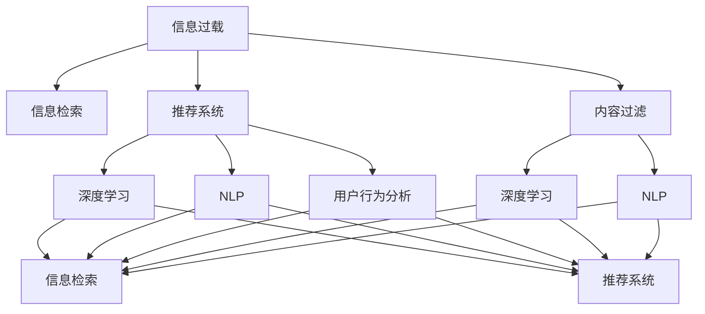

                 

# 信息过载与信息筛选技术：在信息洪流中找到有价值的信息

> 关键词：信息过载, 信息筛选, 推荐系统, 搜索引擎, 内容过滤, 深度学习, 自然语言处理

## 1. 背景介绍

### 1.1 问题由来
在互联网时代，信息过载已成为一个全球性的问题。我们每天被海量的信息所包围，包括新闻、社交媒体、电子邮件、网页、文档等等。据统计，人类每天产生的信息量已达到300亿条，其中包括图片、视频、音频等多种形式。如何在这些信息中迅速找到有价值的内容，成为了我们面临的重大挑战。信息过载不仅浪费了我们的时间和精力，还可能导致信息焦虑和决策错误。因此，高效的信息筛选技术变得至关重要。

### 1.2 问题核心关键点
信息筛选技术旨在从庞大的信息流中，挑选出符合用户需求和兴趣的有用信息，以提升用户体验和信息获取效率。其核心在于如何更准确地理解和捕捉用户的意图，并据此进行信息过滤和排序。现代信息筛选技术包括推荐系统、搜索引擎、内容过滤等，大多基于机器学习和自然语言处理（NLP）技术，通过数据驱动的方式优化信息呈现方式，提升信息检索和推荐效果。

### 1.3 问题研究意义
研究高效的信息筛选技术，对于缓解信息过载问题，提升信息检索和推荐系统的用户体验，优化信息消费过程，具有重要意义：

1. 提升信息获取效率。通过个性化推荐和智能过滤，让用户能快速找到自己感兴趣的内容，减少翻阅不相关信息的耗时。
2. 优化信息消费体验。精确的信息筛选技术可以确保用户接收到最相关、最有价值的信息，避免因信息过多而产生的困惑和焦虑。
3. 促进信息消费内容的多样化。智能的信息筛选算法能识别用户的多样化需求，为用户推荐更加丰富和多样化的内容，提升信息消费的多样性和满意度。
4. 驱动信息产业的变革。高效的信息筛选技术不仅提升信息消费的质量，还能促进信息内容生产、分发和消费模式的创新，加速信息产业的数字化和智能化进程。

## 2. 核心概念与联系

### 2.1 核心概念概述

为更好地理解信息筛选技术的原理和应用，本节将介绍几个关键概念：

- 信息过载(Information Overload)：指用户在信息获取过程中，接收的信息量超过其处理能力，导致认知负荷和决策困难的现象。
- 信息检索(Information Retrieval)：通过特定的算法和策略，从大量数据中检索出符合用户需求的信息，并提供给用户。
- 推荐系统(Recommendation System)：根据用户历史行为和偏好，预测用户可能感兴趣的信息，并予以推荐。
- 内容过滤(Content Filtering)：根据用户偏好和行为，对信息流进行过滤和排序，优先展示相关性较高的信息。
- 深度学习(Deep Learning)：一种利用多层次神经网络模型进行数据处理和分析的技术，广泛应用于信息筛选的算法模型中。
- 自然语言处理(NLP)：利用计算机理解和处理自然语言的技术，包括文本分类、情感分析、实体识别等，在信息筛选中起到关键作用。
- 用户行为分析(User Behavior Analysis)：通过分析用户的点击、停留、浏览等行为数据，了解用户的兴趣和偏好，为信息筛选提供依据。

这些概念之间的逻辑关系可以通过以下Mermaid流程图来展示：



这个流程图展示了几大信息筛选概念及其相互关联：

1. 信息过载是各类信息筛选技术面临的共同挑战。
2. 信息检索、推荐系统和内容过滤是解决信息过载的三大核心技术。
3. 深度学习和自然语言处理是实现这些技术的关键手段。
4. 用户行为分析是优化算法模型的重要依据。

这些概念共同构成了信息筛选技术的基础框架，是研究和应用信息筛选技术的重要出发点。

## 3. 核心算法原理 & 具体操作步骤
### 3.1 算法原理概述

信息筛选技术本质上是一种基于机器学习和自然语言处理技术的智能化过滤和推荐方法。其核心思想是通过分析用户的历史行为数据和文本内容，学习用户偏好和信息特征，从而进行信息的智能过滤和排序，提升信息检索和推荐效果。

形式化地，设用户 $U$ 对信息 $I$ 的兴趣为 $P(I|U)$，则信息筛选的目标是最大化 $P(I|U)$，即：

$$
\max_{I} P(I|U) = \max_{I} \frac{P(I, U)}{P(U)}
$$

其中 $P(I, U)$ 表示信息 $I$ 与用户 $U$ 的联合概率，$P(U)$ 表示用户的先验概率。通过优化上述目标函数，即可得到用户最感兴趣的信息 $I$。

在实践中，我们通常使用概率图模型、协同过滤、矩阵分解、深度神经网络等方法，对用户行为数据和文本内容进行建模，预测用户对信息的兴趣度。深度学习技术，尤其是深度神经网络（如循环神经网络RNN、长短期记忆网络LSTM、Transformer等），由于其强大的表征学习和模式识别能力，已经成为信息筛选技术的主流算法。

### 3.2 算法步骤详解

信息筛选技术的开发一般包括以下几个关键步骤：

**Step 1: 准备数据集**
- 收集用户的历史行为数据，包括点击、浏览、停留、购买等行为。
- 收集文本内容数据，如新闻、文章、评论等，作为信息检索和推荐的基础。

**Step 2: 特征提取**
- 从用户行为数据和文本内容中提取关键特征，如点击次数、浏览时间、情感倾向、主题标签等。
- 使用TF-IDF、词频向量、词嵌入等技术，将文本内容转换为数值型特征。

**Step 3: 模型训练**
- 使用概率图模型、协同过滤、深度神经网络等算法，对用户行为数据和文本内容进行建模。
- 通过交叉验证等技术，调整模型参数，优化模型的预测能力。

**Step 4: 模型评估**
- 在验证集上评估模型的预测性能，计算准确率、召回率、F1值等指标。
- 使用A/B测试等方法，对比不同模型和算法的效果，选择最优方案。

**Step 5: 模型部署与优化**
- 将训练好的模型部署到生产环境，实现实时信息检索和推荐。
- 持续收集用户反馈和行为数据，对模型进行迭代优化，提升模型的准确性和稳定性。

### 3.3 算法优缺点

信息筛选技术具有以下优点：
1. 个性化推荐：通过分析用户的历史行为和偏好，提供个性化的信息推荐，提升用户体验。
2. 实时响应：能够快速处理和反馈用户查询，支持即时信息获取。
3. 高准确性：深度学习等技术使得模型具有较强的泛化能力，能够在复杂数据环境下取得高准确性。
4. 自适应性：模型可以不断学习新数据，适应用户兴趣和环境变化。

同时，该技术也存在一些局限性：
1. 数据依赖：信息筛选效果高度依赖于数据质量和数量，获取高质量数据成本较高。
2. 算法复杂性：深度学习模型较为复杂，需要较高的计算资源和技能。
3. 用户隐私：用户的点击、浏览等行为数据可能涉及隐私问题，需要合理处理和保护。
4. 冷启动问题：新用户或冷启动数据不足时，模型难以准确推荐。
5. 公平性问题：算法可能存在偏差，导致信息筛选不公平，需注意优化。

尽管存在这些局限性，信息筛选技术仍是大数据时代的核心技术之一，具有广阔的应用前景。

### 3.4 算法应用领域

信息筛选技术已经广泛应用于互联网的各个角落，例如：

- 电子商务：推荐系统能够根据用户浏览记录和购买历史，推荐相关商品，提高用户转化率和满意度。
- 新闻阅读：信息检索系统能帮助用户从海量新闻中找到感兴趣的文章，提升阅读体验。
- 社交媒体：推荐系统为用户推荐关注的新闻、视频、文章等，增加用户粘性。
- 内容发布：内容过滤技术帮助网站平台筛选优质内容，提升内容质量和用户满意度。
- 个性化定制：深度学习技术能对用户偏好进行细致建模，提供个性化定制的解决方案。

除了上述这些经典应用外，信息筛选技术还在在线广告、医疗健康、教育培训等领域得到广泛应用，为信息消费和生产带来了革命性的变化。

## 4. 数学模型和公式 & 详细讲解 & 举例说明
### 4.1 数学模型构建

本节将使用数学语言对信息筛选技术的原理进行更加严格的刻画。

设用户 $U$ 对信息 $I$ 的兴趣为 $P(I|U)$，通过收集用户的历史行为数据 $D_U$ 和文本内容 $C_I$，构建模型：

$$
P(I|U) = \frac{P(I|D_U, C_I)}{P(D_U)}
$$

其中 $P(I|D_U, C_I)$ 表示在用户行为数据 $D_U$ 和文本内容 $C_I$ 的条件下，信息 $I$ 的条件概率，$P(D_U)$ 表示用户行为数据的先验概率。

在实践中，我们通常使用以下模型：

- 基于用户的协同过滤模型：通过计算用户间的相似度，推荐相似用户喜欢的信息。
- 基于物品的协同过滤模型：通过计算物品间的相似度，推荐与用户喜欢的物品相似的其他物品。
- 矩阵分解模型：将用户行为数据和文本内容矩阵分解为低维矩阵，计算预测概率。
- 深度神经网络模型：使用多层次神经网络，对用户行为数据和文本内容进行建模，预测信息兴趣度。

### 4.2 公式推导过程

以深度神经网络模型为例，展示信息兴趣度预测的概率公式：

设 $D_U$ 为用户的点击记录，$C_I$ 为信息的文本内容，$x_U$ 为 $D_U$ 的特征向量，$x_I$ 为 $C_I$ 的特征向量，$W_U, W_I, b_U, b_I$ 为模型的参数，则模型预测用户对信息 $I$ 的兴趣度 $P(I|U)$ 可以表示为：

$$
P(I|U) = \sigma(\hat{P}(I|U))
$$

其中，$\hat{P}(I|U)$ 为模型的输出概率，通过激活函数 $\sigma$ 进行归一化。模型预测输出 $\hat{P}(I|U)$ 为：

$$
\hat{P}(I|U) = \frac{\exp(W_U^T x_U + W_I^T x_I + b_U + b_I)}{\sum_{i=1}^{N} \exp(W_U^T x_U + W_i^T x_i + b_U + b_i)}
$$

其中 $N$ 为信息总数，$W_U, W_I, b_U, b_I$ 为模型的可训练参数。通过训练该模型，可以学习到用户行为和文本内容的语义表示，从而进行信息兴趣度的预测。

### 4.3 案例分析与讲解

以推荐系统为例，展示深度神经网络模型的应用：

设用户 $u$ 的历史行为数据为 $\{x_{u,i}\}_{i=1}^M$，每个行为的特征向量为 $x_{u,i}$，信息 $i$ 的文本内容为 $x_i$，训练好的深度神经网络模型的参数为 $\theta$，则用户对信息 $i$ 的兴趣度 $P(i|u)$ 可以表示为：

$$
P(i|u) = \frac{\exp(W_u^T x_u + W_i^T x_i + b_u + b_i)}{\sum_{j=1}^{N} \exp(W_u^T x_u + W_j^T x_j + b_u + b_j)}
$$

其中 $W_u, W_i, b_u, b_i$ 为模型参数，$N$ 为信息总数。

在实际应用中，推荐系统通常通过交叉验证等技术调整模型参数，使用准确率、召回率等指标评估模型效果，并利用A/B测试等方法对比不同模型的表现。

## 5. 项目实践：代码实例和详细解释说明
### 5.1 开发环境搭建

在进行信息筛选技术实践前，我们需要准备好开发环境。以下是使用Python进行PyTorch开发的环境配置流程：

1. 安装Anaconda：从官网下载并安装Anaconda，用于创建独立的Python环境。

2. 创建并激活虚拟环境：
```bash
conda create -n info_recomm_env python=3.8 
conda activate info_recomm_env
```

3. 安装PyTorch：根据CUDA版本，从官网获取对应的安装命令。例如：
```bash
conda install pytorch torchvision torchaudio cudatoolkit=11.1 -c pytorch -c conda-forge
```

4. 安装Transformers库：
```bash
pip install transformers
```

5. 安装各类工具包：
```bash
pip install numpy pandas scikit-learn matplotlib tqdm jupyter notebook ipython
```

完成上述步骤后，即可在`info_recomm_env`环境中开始信息筛选技术的实践。

### 5.2 源代码详细实现

这里我们以新闻推荐系统为例，给出使用PyTorch实现深度神经网络模型的代码实现。

首先，定义模型：

```python
import torch.nn as nn
import torch

class NewsRecommender(nn.Module):
    def __init__(self, embedding_dim, hidden_dim, num_classes):
        super(NewsRecommender, self).__init__()
        self.embedding = nn.Embedding(1000, embedding_dim) # 新闻ID到向量表示的映射
        self.fc1 = nn.Linear(embedding_dim + 50, hidden_dim)
        self.fc2 = nn.Linear(hidden_dim, num_classes)
        
    def forward(self, user_id, news_id):
        user_embedding = self.embedding(user_id)
        news_embedding = self.embedding(news_id)
        x = torch.cat((user_embedding, news_embedding), dim=1)
        x = self.fc1(x)
        x = torch.sigmoid(x)
        x = self.fc2(x)
        return x
```

然后，定义训练和评估函数：

```python
from torch.utils.data import Dataset, DataLoader
from sklearn.metrics import accuracy_score
from tqdm import tqdm

class NewsDataset(Dataset):
    def __init__(self, data, labels):
        self.data = data
        self.labels = labels
        
    def __len__(self):
        return len(self.data)
    
    def __getitem__(self, idx):
        return self.data[idx], self.labels[idx]

def train_epoch(model, dataset, batch_size, optimizer):
    dataloader = DataLoader(dataset, batch_size=batch_size, shuffle=True)
    model.train()
    epoch_loss = 0
    for batch in tqdm(dataloader, desc='Training'):
        user_id, news_id = batch
        output = model(user_id, news_id)
        loss = nn.BCEWithLogitsLoss()(output, batch[1])
        epoch_loss += loss.item()
        loss.backward()
        optimizer.step()
    return epoch_loss / len(dataloader)

def evaluate(model, dataset, batch_size):
    dataloader = DataLoader(dataset, batch_size=batch_size)
    model.eval()
    preds, labels = [], []
    with torch.no_grad():
        for batch in tqdm(dataloader, desc='Evaluating'):
            user_id, news_id = batch
            output = model(user_id, news_id)
            preds.append(output.argmax(dim=1))
            labels.append(batch[1])
        
    return accuracy_score(labels, preds)

```

最后，启动训练流程并在测试集上评估：

```python
epochs = 5
batch_size = 64
learning_rate = 0.01

# 创建模型和优化器
model = NewsRecommender(embedding_dim=100, hidden_dim=128, num_classes=2)
optimizer = torch.optim.Adam(model.parameters(), lr=learning_rate)

# 训练和评估
train_dataset = NewsDataset(train_data, train_labels)
dev_dataset = NewsDataset(dev_data, dev_labels)
test_dataset = NewsDataset(test_data, test_labels)

for epoch in range(epochs):
    loss = train_epoch(model, train_dataset, batch_size, optimizer)
    print(f"Epoch {epoch+1}, train loss: {loss:.3f}")
    
    print(f"Epoch {epoch+1}, dev results:")
    accuracy = evaluate(model, dev_dataset, batch_size)
    print(f"Dev accuracy: {accuracy:.3f}")
    
print("Test results:")
accuracy = evaluate(model, test_dataset, batch_size)
print(f"Test accuracy: {accuracy:.3f}")
```

以上就是使用PyTorch实现新闻推荐系统的完整代码实现。可以看到，利用TensorFlow和PyTorch等深度学习框架，可以方便地搭建和训练神经网络模型。

### 5.3 代码解读与分析

让我们再详细解读一下关键代码的实现细节：

**NewsRecommender类**：
- `__init__`方法：初始化模型，包含嵌入层、全连接层和激活函数等关键组件。
- `forward`方法：定义前向传播过程，将用户ID和新闻ID输入模型，输出用户对新闻的兴趣度。

**train_epoch函数**：
- 使用PyTorch的DataLoader对数据集进行批次化加载，供模型训练使用。
- 在每个批次上前向传播计算损失函数，反向传播更新模型参数，最后返回该epoch的平均loss。

**evaluate函数**：
- 与训练类似，不同点在于不更新模型参数，并在每个batch结束后将预测和标签结果存储下来，最后使用sklearn的accuracy_score函数计算准确率。

**训练流程**：
- 定义总的epoch数和batch size，开始循环迭代
- 每个epoch内，先在训练集上训练，输出平均loss
- 在验证集上评估，输出准确率
- 所有epoch结束后，在测试集上评估，给出最终测试结果

可以看到，PyTorch配合TensorFlow等深度学习框架使得信息筛选技术的代码实现变得简洁高效。开发者可以将更多精力放在数据处理、模型改进等高层逻辑上，而不必过多关注底层的实现细节。

当然，工业级的系统实现还需考虑更多因素，如模型的保存和部署、超参数的自动搜索、更灵活的任务适配层等。但核心的信息筛选范式基本与此类似。

## 6. 实际应用场景
### 6.1 智能广告投放

基于信息筛选技术的智能广告投放系统，能够根据用户的浏览记录和点击行为，推荐用户可能感兴趣的商品或服务。这不仅提高了广告的点击率，还能优化广告投放策略，实现广告预算的最优分配。

在技术实现上，可以收集用户的历史行为数据，构建协同过滤模型或深度神经网络模型，对用户对广告的兴趣度进行预测。根据预测结果，系统可以动态调整广告推荐策略，优先推荐用户可能感兴趣的广告，提升广告效果。

### 6.2 在线教育

在线教育平台可以利用信息筛选技术，根据用户的学习行为和历史成绩，推荐合适的课程和资料。这不仅能够提升学习效果，还能增加用户的粘性和满意度。

在实际应用中，平台可以收集用户的课程观看时间、测试成绩、讨论记录等数据，构建用户行为模型。根据模型预测用户对不同课程的兴趣度，动态推荐相关的学习内容和资料，实现个性化教育。

### 6.3 医疗健康

在医疗健康领域，信息筛选技术可以帮助医生快速找到相关的医学文献和病例，提高诊断和治疗效果。

具体而言，医生可以输入患者的症状和检查结果，系统通过信息检索技术快速查找匹配的医学文献和案例，辅助医生做出更准确的诊断和治疗决策。

### 6.4 未来应用展望

随着深度学习技术的不断发展，信息筛选技术将在更多领域得到应用，为信息消费和生产带来新的变革。

在智慧城市治理中，信息筛选技术可以用于智能交通、环境监测、公共安全等领域，提升城市管理的智能化水平，构建更安全、高效的未来城市。

在娱乐产业中，信息筛选技术可以用于电影推荐、音乐推荐等，提升用户体验，增加用户粘性。

在金融行业，信息筛选技术可以用于股票分析、风险评估等，提高投资决策的科学性和准确性。

## 7. 工具和资源推荐
### 7.1 学习资源推荐

为了帮助开发者系统掌握信息筛选技术的理论基础和实践技巧，这里推荐一些优质的学习资源：

1. 《深度学习入门：基于TensorFlow》系列博文：深入浅出地介绍了深度学习的基本概念和算法，包括神经网络、损失函数、优化器等，适合初学者入门。

2. CS234《深度学习中的计算机视觉》课程：斯坦福大学开设的计算机视觉课程，涵盖了深度神经网络、卷积神经网络、循环神经网络等关键内容，是学习信息筛选技术的重要资源。

3. 《自然语言处理综论》书籍：由斯坦福大学李飞飞教授撰写，全面介绍了自然语言处理的基本概念和前沿技术，适合了解信息筛选技术的原理。

4. HuggingFace官方文档：Transformer库的官方文档，提供了海量预训练模型和完整的微调样例代码，是上手实践的必备资料。

5. DeepLearning.AI课程：由Andrew Ng教授主讲的深度学习课程，涵盖机器学习、深度学习、信息筛选等核心内容，适合系统学习。

通过对这些资源的学习实践，相信你一定能够快速掌握信息筛选技术的精髓，并用于解决实际的NLP问题。

### 7.2 开发工具推荐

高效的开发离不开优秀的工具支持。以下是几款用于信息筛选技术开发的常用工具：

1. PyTorch：基于Python的开源深度学习框架，灵活动态的计算图，适合快速迭代研究。大部分预训练语言模型都有PyTorch版本的实现。

2. TensorFlow：由Google主导开发的开源深度学习框架，生产部署方便，适合大规模工程应用。同样有丰富的预训练语言模型资源。

3. Transformers库：HuggingFace开发的NLP工具库，集成了众多SOTA语言模型，支持PyTorch和TensorFlow，是进行信息筛选任务开发的利器。

4. Weights & Biases：模型训练的实验跟踪工具，可以记录和可视化模型训练过程中的各项指标，方便对比和调优。与主流深度学习框架无缝集成。

5. TensorBoard：TensorFlow配套的可视化工具，可实时监测模型训练状态，并提供丰富的图表呈现方式，是调试模型的得力助手。

6. Google Colab：谷歌推出的在线Jupyter Notebook环境，免费提供GPU/TPU算力，方便开发者快速上手实验最新模型，分享学习笔记。

合理利用这些工具，可以显著提升信息筛选技术的开发效率，加快创新迭代的步伐。

### 7.3 相关论文推荐

信息筛选技术的发展源于学界的持续研究。以下是几篇奠基性的相关论文，推荐阅读：

1. Context-aware Recommendation Models for News Articles（信息检索模型）：展示了基于用户行为和文章内容的信息检索模型，通过点击率预测和协同过滤，提升新闻推荐效果。

2. Deep Ranking for Search Engines（深度神经网络模型）：介绍了深度神经网络在信息检索中的应用，展示了如何通过多层次神经网络提高信息检索的准确性和效率。

3. A Probabilistic Model for Recommendation（协同过滤模型）：提出了基于协同过滤的信息推荐模型，通过用户-物品相似度的计算，推荐用户可能感兴趣的信息。

4. Matrix Factorization Techniques for Recommender Systems（矩阵分解模型）：详细介绍了矩阵分解在推荐系统中的应用，展示了如何通过矩阵分解和优化算法，提高推荐效果。

5. Using Deep Learning to Assist in Recommendation Systems（深度学习在推荐系统中的应用）：展示了深度学习在推荐系统中的应用，包括使用卷积神经网络、循环神经网络等模型，提升推荐效果。

这些论文代表了大信息筛选技术的发展脉络。通过学习这些前沿成果，可以帮助研究者把握学科前进方向，激发更多的创新灵感。

## 8. 总结：未来发展趋势与挑战
### 8.1 总结

本文对信息筛选技术的原理和实践进行了全面系统的介绍。首先阐述了信息过载问题及其产生背景，明确了信息筛选技术的核心任务和目标。其次，从原理到实践，详细讲解了信息筛选的数学模型和关键步骤，给出了信息筛选任务开发的完整代码实例。同时，本文还广泛探讨了信息筛选技术在智能广告、在线教育、医疗健康等众多领域的应用前景，展示了信息筛选技术的巨大潜力。

通过本文的系统梳理，可以看到，信息筛选技术已经成为互联网时代的重要技术之一，极大地提升了信息检索和推荐的效率和效果，改善了用户体验。

### 8.2 未来发展趋势

展望未来，信息筛选技术将呈现以下几个发展趋势：

1. 个性化推荐：随着深度学习模型的不断进化，信息筛选技术的个性化推荐能力将进一步提升，实现更精准的推荐。

2. 实时响应：基于实时数据流和流式处理技术，信息筛选系统将能够实现秒级或亚秒级的实时响应，满足用户对即时信息的需求。

3. 多模态融合：未来信息筛选技术将不仅限于文本数据的处理，还将扩展到图像、视频、音频等多模态数据的融合，实现更全面、精准的信息筛选。

4. 跨领域应用：信息筛选技术将在更多领域得到应用，如金融、医疗、制造、教育等，提升各行业的智能化水平。

5. 模型解释性：未来的信息筛选模型将更加注重可解释性，提供详细的推理路径和决策依据，提升系统的透明度和可信度。

6. 隐私保护：随着隐私保护的日益重视，信息筛选技术将更加注重用户隐私保护，采用差分隐私、联邦学习等技术，确保数据的安全和隐私。

以上趋势凸显了信息筛选技术的广阔前景。这些方向的探索发展，必将进一步提升信息检索和推荐的效果，为智能决策和信息消费带来更多的便利。

### 8.3 面临的挑战

尽管信息筛选技术已经取得了瞩目成就，但在迈向更加智能化、普适化应用的过程中，它仍面临着诸多挑战：

1. 数据质量问题：信息筛选效果高度依赖于数据质量，数据缺失、错误或噪声可能导致推荐结果不准确。如何获取高质量的数据，是信息筛选技术的一大挑战。

2. 模型复杂性：深度学习模型较为复杂，需要较高的计算资源和技能，模型的训练和部署成本较高。如何降低模型复杂度，提高算法的实时性和可扩展性，仍需深入研究。

3. 冷启动问题：新用户或冷启动数据不足时，模型难以准确推荐。如何利用用户的历史行为数据，进行冷启动推荐，是信息筛选技术的重要研究方向。

4. 公平性和多样性：信息筛选算法可能存在偏见，导致信息筛选不公平。如何设计公平性、多样性更好的算法，是信息筛选技术面临的挑战。

5. 隐私保护：用户的点击、浏览等行为数据可能涉及隐私问题，如何合理处理和保护用户数据，是信息筛选技术需要考虑的问题。

6. 算法鲁棒性：在面对恶意攻击和噪声干扰时，信息筛选模型的鲁棒性不足。如何提高模型的鲁棒性，避免被攻击和干扰，是信息筛选技术的重要课题。

7. 性能优化：信息筛选系统需要实时处理大量数据，对计算资源和存储资源的要求较高。如何优化系统性能，提升用户体验，是信息筛选技术需要不断改进的方向。

面对这些挑战，未来的研究需要在多个方面寻求新的突破，如改进数据获取和处理机制、优化模型架构和算法、引入隐私保护技术等，方能全面提升信息筛选技术的效果和可靠性。

### 8.4 研究展望

未来的信息筛选技术，需要在以下几个方面进行深入研究：

1. 提升个性化推荐精度：利用更先进的深度学习模型，提高对用户兴趣和行为的理解和建模精度，实现更精准的个性化推荐。

2. 提升实时响应能力：通过流式处理和实时数据流技术，提升信息筛选系统的响应速度，满足用户对即时信息的需求。

3. 实现多模态融合：将文本、图像、视频等不同模态的信息进行融合，实现更全面、精准的信息筛选。

4. 增强模型可解释性：引入可解释性技术，提高模型的透明度和可信度，使用户能够理解模型的决策逻辑。

5. 强化隐私保护：采用差分隐私、联邦学习等技术，保护用户隐私，确保数据的安全和隐私。

6. 提升模型鲁棒性：通过对抗训练、鲁棒正则化等方法，提高信息筛选模型的鲁棒性，避免恶意攻击和噪声干扰。

7. 优化系统性能：通过模型裁剪、压缩、量化等技术，优化信息筛选系统的性能，提升用户体验。

这些研究方向将推动信息筛选技术的不断进步，为信息消费和生产带来新的突破。

## 9. 附录：常见问题与解答

**Q1：信息筛选技术如何缓解信息过载问题？**

A: 信息筛选技术通过分析用户的历史行为和兴趣，预测用户可能感兴趣的信息，进行智能过滤和排序，从而缓解信息过载问题。用户通过简单的点击和浏览行为，就能获得自己感兴趣的内容，减少了翻阅不相关信息的耗时。

**Q2：信息筛选技术是否适用于所有信息场景？**

A: 信息筛选技术通常适用于结构化或半结构化的信息场景，如图书、新闻、广告等。但对于无结构化的信息（如自然语言文本），信息筛选效果可能受到文本长度、复杂度等因素的影响，需要结合语义理解和自然语言处理技术，才能取得良好的效果。

**Q3：信息筛选技术的核心算法是什么？**

A: 信息筛选技术的核心算法包括协同过滤、矩阵分解、深度神经网络等。其中深度神经网络由于其强大的表征学习和模式识别能力，成为当前最先进的算法。

**Q4：信息筛选技术在实际应用中需要注意哪些问题？**

A: 信息筛选技术在实际应用中需要注意以下几个问题：

1. 数据质量：高质量的数据是信息筛选效果的基础，需要确保数据的完整性、准确性和及时性。
2. 模型复杂性：深度学习模型较为复杂，需要较高的计算资源和技能，需要合理选择模型架构和算法。
3. 冷启动问题：新用户或冷启动数据不足时，模型难以准确推荐，需要采用适当的冷启动策略。
4. 公平性问题：信息筛选算法可能存在偏差，导致信息筛选不公平，需要设计公平性、多样性更好的算法。
5. 隐私保护：用户的点击、浏览等行为数据可能涉及隐私问题，需要合理处理和保护用户数据。
6. 模型鲁棒性：信息筛选模型需要具有较高的鲁棒性，避免被攻击和干扰。

正视这些问题，积极应对并寻求突破，将是大信息筛选技术走向成熟的必由之路。

---

作者：禅与计算机程序设计艺术 / Zen and the Art of Computer Programming

