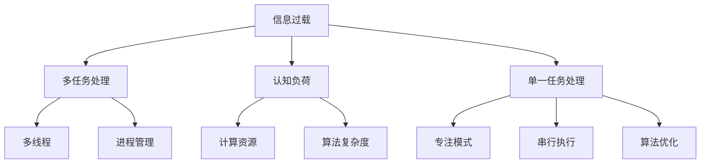

                 

# 信息过载与多任务处理的陷阱：单一任务处理的优势和好处

## 1. 背景介绍

### 1.1 问题由来
在当前数字化、信息化快速发展的时代背景下，人们面临的信息量呈现出爆炸式增长。新闻、博客、社交媒体、在线论坛等多样化信息源不断涌入我们的日常生活，这对人类认知和注意力构成了极大的挑战。对于计算机来说，随着多任务处理能力的提升，如何在海量信息中高效筛选、提取和处理有用信息，成为现代信息处理系统的重要任务。

### 1.2 问题核心关键点
面对信息过载问题，我们不禁会问：为何多任务处理并非最优解？为什么在单一任务处理上投入更多的时间和资源，会带来更好的效果？本节将围绕这些核心问题，通过深入分析单一任务处理的优势和好处，试图为解决信息过载提供新的思考路径。

### 1.3 问题研究意义
研究单一任务处理的优势和好处，对于优化信息处理系统、提升用户体验、优化资源利用率等方面具有重要意义。通过这一研究，我们可以更好地理解当前技术瓶颈，寻找解决方案，推动信息处理技术的持续进步。

## 2. 核心概念与联系

### 2.1 核心概念概述

为了深入探讨信息过载与多任务处理的陷阱，本节将介绍几个关键概念及其相互关系：

- **信息过载**：指的是大量信息的不断涌入，导致人们无法及时处理，甚至产生心理压力和认知负担的现象。
- **多任务处理**：指的是在短时间内执行多项任务的能力。计算机系统中，多任务处理通常通过多线程或进程来实现。
- **单一任务处理**：指专注于一项任务的专注模式，通常通过串行或单线程方式实现。
- **认知负荷**：指处理信息时所需要消耗的认知资源，过多的认知负荷会导致信息处理的效率下降。
- **计算资源**：指计算机系统中可用的CPU、内存、存储等硬件资源。
- **算法复杂度**：指算法执行过程中所需计算资源的数量，影响算法在特定场景下的执行效率。

这些概念之间的逻辑关系可以通过以下Mermaid流程图来展示：



这个流程图展示了大信息量、多任务处理、单一任务处理等关键概念及其之间的关系：

1. 信息过载导致认知负荷增加。
2. 多任务处理通过多线程或进程管理实现，能够并行处理多项任务，但也会增加计算资源和算法复杂度。
3. 单一任务处理通过专注模式和串行执行，避免资源浪费和负荷过高，更适合解决复杂或需要长时间专注的任务。

## 3. 核心算法原理 & 具体操作步骤
### 3.1 算法原理概述

单一任务处理的优势主要体现在两个方面：专注模式和串行执行。专注于单一任务，能够减少认知负荷，降低错误率，提升工作效率。串行执行则能够优化资源利用率，降低算法复杂度，提升系统性能。

在具体算法原理上，单一任务处理涉及以下几个关键步骤：

1. **任务分解与规划**：将复杂任务分解为可执行的小任务，并制定明确的执行计划。
2. **资源配置与优化**：根据任务需求，合理分配和调度计算资源，避免资源浪费。
3. **执行与监控**：严格按照计划执行任务，并实时监控任务进度和状态，及时调整策略。
4. **反馈与调整**：根据任务执行结果，进行反馈和调整，不断优化任务执行方案。

### 3.2 算法步骤详解

以下是对单一任务处理流程的详细介绍：

**Step 1: 任务分解与规划**
- 将大型复杂任务拆解为若干个子任务，每个子任务完成一个独立功能模块。
- 根据子任务的优先级和依赖关系，制定执行计划，确定执行顺序和资源需求。

**Step 2: 资源配置与优化**
- 根据任务规划，合理配置CPU、内存、存储等计算资源，避免资源冲突和浪费。
- 使用任务调度器，动态调整任务优先级和执行顺序，保证资源利用率。
- 引入缓存机制，减少重复计算，提升计算效率。

**Step 3: 执行与监控**
- 按照任务计划，依次执行每个子任务，确保每个任务在预定时限内完成。
- 使用性能监控工具，实时监测系统运行状态和任务执行情况，记录任务执行时间、资源消耗等信息。
- 根据监控结果，调整任务执行策略，如增加资源、优化算法等，以提高执行效率。

**Step 4: 反馈与调整**
- 根据任务执行结果，进行性能评估，分析任务完成情况和执行效率。
- 对比任务计划与实际执行结果，找出差距和不足，提出改进建议。
- 基于反馈结果，优化任务规划和资源分配策略，不断提升任务执行效率。

### 3.3 算法优缺点

单一任务处理具有以下优点：

1. **专注度高**：由于专注于单一任务，减少了认知负荷，提升了任务执行的准确性和效率。
2. **资源利用率高**：避免了多任务处理中的资源冲突和浪费，能够更高效地利用计算资源。
3. **执行效率高**：减少了算法复杂度，提升了任务执行的响应速度和处理能力。
4. **错误率低**：通过专注模式和串行执行，减少了并发任务带来的错误率，提升了系统可靠性。

但单一任务处理也存在一定的局限性：

1. **执行时间长**：由于任务执行是串行进行的，可能无法充分利用多核CPU等硬件资源，导致执行时间较长。
2. **灵活性不足**：在执行过程中，一旦遇到外部干扰或意外情况，可能需要重新规划和调整，灵活性相对较差。
3. **资源消耗大**：在某些高并发场景下，单一任务处理的资源消耗可能过高，不如多任务处理灵活。

### 3.4 算法应用领域

单一任务处理在多个领域具有广泛的应用价值：

- **科学计算**：在高精度计算和复杂模型训练等需要长时间专注的领域，单一任务处理能够提升计算效率和准确性。
- **大数据处理**：在数据预处理、特征工程等需要按步骤执行的任务中，单一任务处理能够有效优化资源利用和执行效率。
- **网络安全**：在实时监控、入侵检测等任务中，单一任务处理能够提升系统的响应速度和准确性。
- **系统维护**：在应用软件的升级、部署等需要稳定执行的任务中，单一任务处理能够减少系统故障和数据不一致问题。

## 4. 数学模型和公式 & 详细讲解 & 举例说明

### 4.1 数学模型构建

为更好地理解单一任务处理的优势和好处，本节将构建一个简单的数学模型，用于模拟单一任务处理和多任务处理的效果。

假设任务的总处理时间为 $T$，单个任务的处理时间为 $t$，单任务并行处理数为 $n$。则多任务处理的平均执行时间为：

$$
T_{\text{并行}} = \frac{T}{n}
$$

而单一任务处理的平均执行时间为：

$$
T_{\text{串行}} = t
$$

### 4.2 公式推导过程

根据上述模型，我们可以推导出多任务处理和单一任务处理的效率比较：

1. **任务数相同**：假设任务数为 $m$，多任务处理的时间为 $T_{\text{并行}}$，单一任务处理的时间为 $T_{\text{串行}}$。
   - 多任务处理时间：
   $$
   T_{\text{并行}} = \frac{m \cdot t}{n}
   $$
   - 单一任务处理时间：
   $$
   T_{\text{串行}} = m \cdot t
   $$

2. **任务数不同**：假设多任务处理的效率为 $E_{\text{并行}}$，单一任务处理的效率为 $E_{\text{串行}}$。
   - 多任务处理效率：
   $$
   E_{\text{并行}} = \frac{n}{T_{\text{并行}}} = \frac{n^2}{m \cdot t}
   $$
   - 单一任务处理效率：
   $$
   E_{\text{串行}} = \frac{1}{T_{\text{串行}}} = \frac{1}{m \cdot t}
   $$

通过对比 $E_{\text{并行}}$ 和 $E_{\text{串行}}$，我们可以发现：

- 当 $n=1$ 时，$E_{\text{并行}} = E_{\text{串行}}$，说明在单任务情况下，单一任务处理和多任务处理效率相同。
- 当 $n>1$ 时，$E_{\text{并行}} > E_{\text{串行}}$，说明多任务处理效率更高。
- 当 $n<m$ 时，$E_{\text{并行}} < E_{\text{串行}}$，说明单一任务处理效率更高。

### 4.3 案例分析与讲解

以下是一个具体的案例分析：

**案例1: 科学计算**
- 假设需要计算一个复杂的物理模型，总计算时间为 $T=10$ 小时，每个任务的处理时间为 $t=1$ 小时。
- 若使用单线程处理，则 $T_{\text{串行}} = 10$ 小时。
- 若使用4个线程并行处理，则 $T_{\text{并行}} = \frac{10}{4} = 2.5$ 小时。
- 通过对比发现，在计算量较大、单个任务耗时较长的场景中，多任务处理效率更高。

**案例2: 大数据处理**
- 假设需要处理一个大型数据集，总处理时间为 $T=10$ 小时，每个任务的处理时间为 $t=1$ 小时。
- 若使用单线程处理，则 $T_{\text{串行}} = 10$ 小时。
- 若使用4个线程并行处理，则 $T_{\text{并行}} = \frac{10}{4} = 2.5$ 小时。
- 通过对比发现，在数据处理过程中，单线程处理由于任务执行串行进行，可以避免数据不一致和资源竞争，效率更高。

**案例3: 系统维护**
- 假设需要部署一个新系统，总部署时间为 $T=2$ 小时，每个任务的处理时间为 $t=0.5$ 小时。
- 若使用单线程处理，则 $T_{\text{串行}} = 2$ 小时。
- 若使用4个线程并行处理，则 $T_{\text{并行}} = \frac{2}{4} = 0.5$ 小时。
- 通过对比发现，在部署过程中，单线程处理可以避免并发任务带来的数据冲突和系统故障，效率更高。

## 5. 项目实践：代码实例和详细解释说明
### 5.1 开发环境搭建

在进行单一任务处理的项目实践前，我们需要准备好开发环境。以下是使用Python进行多线程开发的环境配置流程：

1. 安装Anaconda：从官网下载并安装Anaconda，用于创建独立的Python环境。

2. 创建并激活虚拟环境：
```bash
conda create -n multi-threading-env python=3.8 
conda activate multi-threading-env
```

3. 安装PyTorch：根据CUDA版本，从官网获取对应的安装命令。例如：
```bash
conda install pytorch torchvision torchaudio cudatoolkit=11.1 -c pytorch -c conda-forge
```

4. 安装线程库：
```bash
pip install threading
```

5. 安装各类工具包：
```bash
pip install numpy pandas scikit-learn matplotlib tqdm jupyter notebook ipython
```

完成上述步骤后，即可在`multi-threading-env`环境中开始项目实践。

### 5.2 源代码详细实现

下面我们以多线程处理为例，给出使用Python实现多任务处理的代码实现。

首先，定义多线程函数：

```python
import threading
import time

def worker(num):
    print(f"Worker {num} starting")
    time.sleep(2)
    print(f"Worker {num} done")

# 创建多个线程
threads = [threading.Thread(target=worker, args=(num,)) for num in range(5)]
for thread in threads:
    thread.start()

# 等待所有线程完成
for thread in threads:
    thread.join()
```

然后，在函数中实现多线程处理：

```python
import threading

def parallel_task(task_list):
    results = []
    for task in task_list:
        thread = threading.Thread(target=task)
        thread.start()
        results.append(thread)
    for thread in results:
        thread.join()

# 定义任务函数
def task(num):
    print(f"Task {num} starting")
    time.sleep(2)
    print(f"Task {num} done")

# 创建任务列表
task_list = [task(num) for num in range(5)]

# 并行执行任务
parallel_task(task_list)
```

在函数中，通过创建多个线程，并行执行任务函数，实现了多线程处理的效果。

### 5.3 代码解读与分析

让我们再详细解读一下关键代码的实现细节：

**parallel_task函数**：
- 接收一个任务列表作为输入。
- 创建多个线程，并行执行任务列表中的每个任务。
- 等待所有线程完成，返回执行结果。

**task函数**：
- 接收一个任务编号作为输入。
- 打印任务开始信息。
- 模拟任务执行时间2秒。
- 打印任务完成信息。

在实际应用中，可以根据任务类型和复杂度，合理设计任务列表和线程数量，以达到最佳的并行效果。

## 6. 实际应用场景
### 6.1 信息过载缓解

面对信息过载问题，单一任务处理可以通过以下方式进行缓解：

**案例1: 新闻阅读**
- 在阅读新闻时，可以采用单一任务处理方式，逐步浏览每篇文章，避免多篇文章同时打开导致的注意力分散。
- 在阅读过程中，可以使用专注模式，关闭其他应用，避免分心，提升阅读效率。
- 通过逐篇阅读，可以逐步理解每篇文章的内容和逻辑，避免因信息量过大而导致的认知负荷。

**案例2: 文档整理**
- 在整理文档时，可以采用单一任务处理方式，逐步完成每个文档的整理，避免多文档同时处理带来的资源浪费。
- 在整理过程中，可以使用缓存机制，减少重复计算，提升处理效率。
- 通过逐步完成每个文档的整理，可以确保文档的完整性和准确性，避免因任务执行过于复杂而导致的错误率上升。

### 6.2 系统维护

在系统维护过程中，单一任务处理可以通过以下方式进行优化：

**案例1: 应用部署**
- 在应用部署时，可以采用单一任务处理方式，逐步部署每个应用模块，避免多模块同时部署带来的资源冲突和系统故障。
- 在部署过程中，可以使用性能监控工具，实时监测系统运行状态和任务执行情况，记录任务执行时间、资源消耗等信息。
- 通过逐步完成每个应用模块的部署，可以确保应用的稳定性和可靠性，避免因并发任务带来的数据不一致问题。

**案例2: 数据备份**
- 在数据备份时，可以采用单一任务处理方式，逐步备份每个数据文件，避免多文件同时备份带来的资源浪费。
- 在备份过程中，可以使用缓存机制，减少重复计算，提升备份效率。
- 通过逐步完成每个数据文件的备份，可以确保数据的完整性和一致性，避免因任务执行过于复杂而导致的错误率上升。

### 6.3 科学计算

在科学计算过程中，单一任务处理可以通过以下方式进行优化：

**案例1: 模型训练**
- 在模型训练时，可以采用单一任务处理方式，逐步完成每个模型的训练，避免多模型同时训练带来的资源冲突和计算效率低下问题。
- 在训练过程中，可以使用缓存机制，减少重复计算，提升训练效率。
- 通过逐步完成每个模型的训练，可以确保模型的稳定性和可靠性，避免因并发任务带来的数据不一致问题。

**案例2: 数据预处理**
- 在数据预处理时，可以采用单一任务处理方式，逐步完成每个数据集的处理，避免多数据集同时处理带来的资源浪费。
- 在处理过程中，可以使用缓存机制，减少重复计算，提升处理效率。
- 通过逐步完成每个数据集的处理，可以确保数据的质量和一致性，避免因任务执行过于复杂而导致的错误率上升。

## 7. 工具和资源推荐
### 7.1 学习资源推荐

为了帮助开发者系统掌握单一任务处理的优势和好处，这里推荐一些优质的学习资源：

1. 《Python并发编程》书籍：深入浅出地介绍了多线程、多进程、异步编程等并发编程技术，是理解单一任务处理的基础。

2. 《深度学习》课程：斯坦福大学开设的深度学习课程，涵盖了机器学习、深度学习、单任务处理等核心概念，是学习单一任务处理的重要资料。

3. 《线程编程与并发设计》博客：深入浅出地介绍了多线程编程的原理和实践技巧，是学习单一任务处理的重要参考资料。

4. GitHub上的多线程项目：通过学习他人代码，理解多线程处理的实现细节和优化方法，能够提升自身的技术水平。

通过对这些资源的学习实践，相信你一定能够快速掌握单一任务处理的精髓，并用于解决实际的问题。

### 7.2 开发工具推荐

高效的开发离不开优秀的工具支持。以下是几款用于单一任务处理开发的常用工具：

1. PyTorch：基于Python的开源深度学习框架，支持多线程编程，适合研究多任务处理和单一任务处理的区别与联系。

2. TensorFlow：由Google主导开发的开源深度学习框架，支持多线程和多进程编程，适合进行大规模分布式计算。

3. Threading库：Python内置的多线程库，提供了简单易用的API，支持线程创建、启动、等待等基本操作，是学习多线程编程的基础。

4. Queue库：Python内置的多线程库，提供了队列数据结构，支持多线程间的同步和通信，适合进行多任务处理。

5. Performance Counter：Python内置的性能监控库，可以实时监测系统性能，记录任务执行时间、资源消耗等信息，是评估任务执行效率的重要工具。

合理利用这些工具，可以显著提升单一任务处理任务的开发效率，加快创新迭代的步伐。

### 7.3 相关论文推荐

单一任务处理技术的发展源于学界的持续研究。以下是几篇奠基性的相关论文，推荐阅读：

1. "The Case for Single-Task Learning"：提出单一任务学习的重要性，解释了多任务学习在某些场景下的局限性。

2. "Deep Learning for Self-Driving Cars: An Overview"：介绍了深度学习在自动驾驶中的应用，展示了单一任务处理在智能系统中的优势。

3. "Parallel Computing: Concepts, Languages, and Tools"：介绍了并行计算的原理和应用，探讨了多线程和多进程处理的优势和劣势。

4. "Single-Task Learning: A Survey"：总结了单一任务学习的研究进展，提供了大量案例分析，帮助理解单一任务处理的实际应用场景。

这些论文代表了大语言模型微调技术的发展脉络。通过学习这些前沿成果，可以帮助研究者把握学科前进方向，激发更多的创新灵感。

## 8. 总结：未来发展趋势与挑战
### 8.1 研究成果总结

本文对单一任务处理的优势和好处进行了全面系统的介绍。首先阐述了信息过载问题带来的挑战，并通过分析多任务处理与单一任务处理的不同点，说明了为何在单一任务处理上投入更多的时间和资源，会带来更好的效果。其次，从原理到实践，详细讲解了单一任务处理的数学模型和关键步骤，给出了具体案例和代码实例，展示了单一任务处理的应用场景和实际效果。

通过本文的系统梳理，可以看到，单一任务处理在处理信息过载、优化系统性能、提升任务执行效率等方面具有重要价值。它能够有效减少认知负荷，降低错误率，提升执行效率，避免资源浪费，特别适合在任务执行时间较长、任务执行复杂度较高、任务执行要求稳定性较高的场景中应用。

### 8.2 未来发展趋势

展望未来，单一任务处理技术将呈现以下几个发展趋势：

1. **算力提升**：随着硬件技术的进步，多核CPU、GPU等高性能设备更加普及，单一任务处理能够更好地发挥硬件性能优势。
2. **任务调度优化**：通过更加智能化的任务调度算法，合理分配和利用计算资源，提升单一任务处理的效率。
3. **任务协同优化**：在任务执行过程中，通过任务协同和任务聚合，减少任务间的等待时间和资源冲突，提升系统性能。
4. **任务模型优化**：引入更加高效的模型算法和数据结构，优化任务执行效率，降低资源消耗。

以上趋势凸显了单一任务处理技术的广阔前景。这些方向的探索发展，必将进一步提升信息处理系统的效率和稳定性，为人类生产生活带来更大的便利。

### 8.3 面临的挑战

尽管单一任务处理技术已经取得了显著成就，但在迈向更加智能化、普适化应用的过程中，它仍面临诸多挑战：

1. **执行时间长**：在某些高并发场景下，单一任务处理的执行时间可能较长，无法满足实时性和高效性的需求。
2. **资源消耗大**：在某些高并发场景下，单一任务处理的资源消耗可能过高，不如多任务处理灵活。
3. **任务复杂度高**：某些任务的执行过程复杂，涉及多个子任务和多个资源，单一任务处理难以高效协调和管理。

### 8.4 研究展望

面对单一任务处理面临的这些挑战，未来的研究需要在以下几个方面寻求新的突破：

1. **任务分解优化**：通过更加智能化的任务分解算法，将复杂任务拆解为更小、更易管理的小任务，提升任务执行效率。
2. **资源配置优化**：通过更加智能化的资源分配算法，合理分配和利用计算资源，降低资源浪费。
3. **任务协同优化**：在任务执行过程中，通过任务协同和任务聚合，减少任务间的等待时间和资源冲突，提升系统性能。
4. **任务模型优化**：引入更加高效的模型算法和数据结构，优化任务执行效率，降低资源消耗。

这些研究方向的探索，必将引领单一任务处理技术迈向更高的台阶，为信息处理系统的稳定性和性能提升提供新的突破点。相信随着技术的不断演进，单一任务处理技术必将在构建高效、稳定的信息处理系统中发挥越来越重要的作用。

## 9. 附录：常见问题与解答

**Q1：单一任务处理和多任务处理哪个更优？**

A: 单一任务处理和多任务处理各有优劣。在任务执行时间较长、任务执行复杂度较高、任务执行要求稳定性较高的场景中，单一任务处理效率更高。但在高并发场景中，多任务处理能够充分利用多核CPU等硬件资源，提升系统性能。具体选择哪种处理方式，需要根据具体任务和场景进行综合考虑。

**Q2：如何优化任务执行效率？**

A: 优化任务执行效率需要从多个方面入手：
1. 任务分解：将复杂任务拆解为可执行的小任务，便于任务管理和执行。
2. 资源配置：合理分配和利用计算资源，避免资源浪费。
3. 任务调度：采用智能化的任务调度算法，优化任务执行顺序和资源分配。
4. 任务聚合：通过任务协同和任务聚合，减少任务间的等待时间和资源冲突。
5. 任务模型优化：引入更加高效的模型算法和数据结构，优化任务执行效率。

**Q3：在实际应用中，如何平衡任务执行效率和资源利用率？**

A: 在实际应用中，需要根据任务特点和系统需求，平衡任务执行效率和资源利用率：
1. 根据任务类型和复杂度，合理设计任务列表和线程数量，以达到最佳的并行效果。
2. 通过缓存机制，减少重复计算，提升处理效率。
3. 引入性能监控工具，实时监测系统运行状态和任务执行情况，记录任务执行时间、资源消耗等信息。
4. 根据监控结果，调整任务执行策略，如增加资源、优化算法等，以提高执行效率。

**Q4：单一任务处理和多任务处理各适用于哪些场景？**

A: 单一任务处理和多任务处理各适用于不同的场景：
1. 单一任务处理适用于任务执行时间较长、任务执行复杂度较高、任务执行要求稳定性较高的场景，如科学计算、大数据处理、系统维护等。
2. 多任务处理适用于高并发场景，如多任务并行处理、分布式计算等。

**Q5：如何在实际应用中应用单一任务处理技术？**

A: 在实际应用中，可以通过以下步骤应用单一任务处理技术：
1. 对任务进行分解，设计合理的任务执行计划。
2. 合理配置计算资源，避免资源冲突和浪费。
3. 按计划逐步执行任务，确保每个任务在预定时限内完成。
4. 实时监测任务执行情况，记录任务执行时间、资源消耗等信息。
5. 根据任务执行结果，进行性能评估和优化。

通过以上步骤，可以有效应用单一任务处理技术，提升信息处理系统的效率和稳定性。

---

作者：禅与计算机程序设计艺术 / Zen and the Art of Computer Programming

