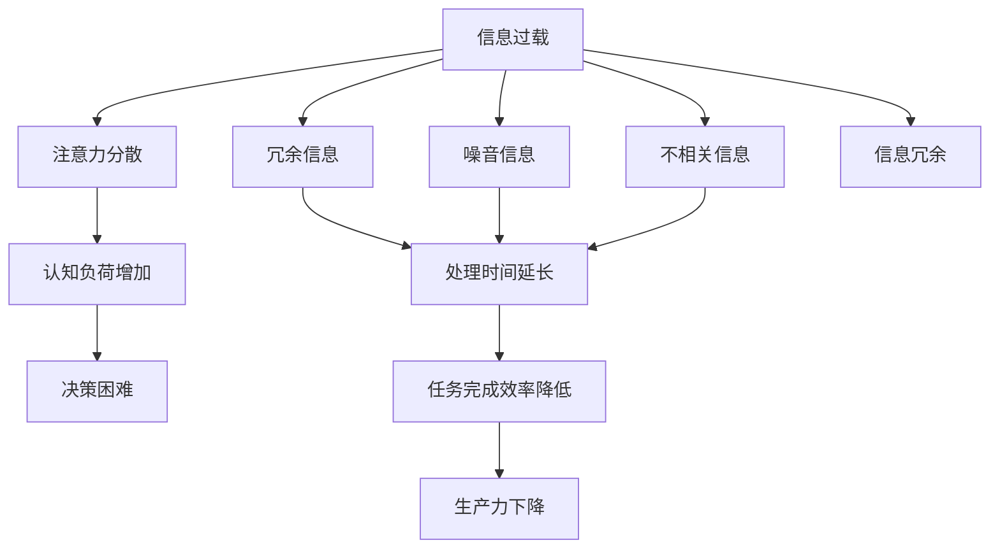

                 

## 1. 背景介绍

在数字时代，信息过载（Information Overload）已成为困扰知识工作者（Knowledge Worker）的全球性问题。全球范围内，电子邮件、社交媒体、会议记录、文档、数据和各类应用软件等不断涌入工作环境，使得人们每天面临的信息量爆炸式增长。据调查显示，美国知识工作者平均每天要处理的信息量高达6.6TB，而实际处理效率却低于6%。这种信息洪流不仅加剧了工作疲劳，还导致了时间管理困难、注意力分散和决策迟缓等负面影响。

解决信息过载问题，保持高效的知识工作，成为提升组织和个体生产力的关键所在。本博客将探讨信息过载的成因和应对策略，分析在信息洪流中保持生产力的科学方法，提出未来知识工作的创新方向。

## 2. 核心概念与联系

### 2.1 核心概念概述

为了清晰理解信息过载与知识工作的内在联系，本节将详细介绍以下核心概念：

- **信息过载**：指的是个体或组织接收到远超其处理能力的信息量，导致信息过载。其表现形式包括噪音信息、冗余信息、不相关信息和重复信息等。
- **知识工作**：指的是依靠脑力而非体力进行的信息收集、处理、分析和应用。其核心特点在于知识工作者能够对信息进行整合、创新和决策。
- **注意力**：是指个体选择和集中于特定对象、思想或事件的能力。在信息洪流中，注意力分散是导致信息过载和生产力下降的主要因素之一。
- **认知负荷**：是指在处理信息过程中，大脑负担和消耗的资源量。信息过载会导致认知负荷增加，进而影响知识工作者的思考和行动。
- **决策树**：用于描述信息过载下，个体或组织决策过程的树状结构。决策树帮助分析信息过载对决策的影响。

### 2.2 核心概念原理和架构的 Mermaid 流程图



这个流程图展示了一个简单的信息过载导致生产力下降的路径，反映了冗余、噪音和不相关信息对注意力的影响，进而加剧了认知负荷，导致了决策困难和生产力下降。

## 3. 核心算法原理 & 具体操作步骤

### 3.1 算法原理概述

解决信息过载和保持生产力的关键在于优化信息处理流程，减轻认知负荷，提升注意力集中度。以下是基于信息科学和认知心理学的一些核心算法原理：

- **信息筛选**：通过算法自动过滤冗余、噪音和不相关信息，保留重要和有价值的内容。
- **注意力管理**：利用算法辅助分配和调度注意力资源，减少分散。
- **认知负荷控制**：应用算法优化任务分解和分配，减轻认知负荷。
- **决策优化**：使用算法改进决策过程，减少信息过载对决策的干扰。

### 3.2 算法步骤详解

为实现上述算法原理，通常在信息过载处理过程中采取以下详细步骤：

1. **信息采集与预处理**：
   - 使用API和Web爬虫技术自动采集网络信息。
   - 应用自然语言处理(NLP)技术，如文本分类、实体识别、情感分析等，对信息进行初步筛选和分类。

2. **注意力资源管理**：
   - 利用优先级排序算法，对任务进行优先级排序，确保高优先级任务获得更多注意力资源。
   - 应用时间块管理方法，如番茄工作法，分段处理任务，减少注意力分散。

3. **认知负荷优化**：
   - 应用任务分解算法，将复杂任务拆分为更小、更易管理的小任务。
   - 使用智能推荐算法，根据个体偏好和历史行为，推荐最合适的任务和信息资源。

4. **决策优化**：
   - 应用决策树算法，通过条件判断和信息筛选，帮助快速做出决策。
   - 使用贝叶斯网络，模拟信息过载对决策的影响，优化决策过程。

### 3.3 算法优缺点

- **优点**：
  - 自动化信息筛选和优先级排序，减轻人工处理负担。
  - 精准管理注意力资源，提升任务处理效率。
  - 优化认知负荷，减轻工作疲劳，提升决策质量。
  
- **缺点**：
  - 算法需要大量高质量数据进行训练和验证。
  - 模型需要定期更新，以适应新环境和新需求。
  - 算法决策可能受到数据质量和算法本身的限制。

### 3.4 算法应用领域

信息过载和生产力优化的算法在多个领域得到了广泛应用，例如：

- **企业知识管理**：企业可以使用基于算法的信息管理平台，自动筛选重要信息和知识，支持员工快速获取所需信息。
- **教育培训**：学校和培训机构可以利用算法优化学习路径和资源分配，提升教学效果。
- **科学研究**：研究人员可以借助算法快速处理海量数据，支持科学发现和创新。
- **医疗健康**：医疗机构可以使用算法优化病人信息处理，支持个性化诊疗。
- **政府决策**：政府可以利用算法辅助信息筛选和决策优化，提升治理效率和效果。

## 4. 数学模型和公式 & 详细讲解

### 4.1 数学模型构建

为描述信息过载和知识工作的数学模型，我们将信息处理过程视为一个系统，其输入为信息，输出为知识或决策。系统由多个模块组成，每个模块执行特定的功能，并受其他模块的影响。

定义 $X$ 为输入信息，$Y$ 为输出决策或知识，$A$ 为注意力系统，$C$ 为认知系统，$D$ 为决策系统。系统模型如下：

$$
Y = f(X, A, C, D)
$$

其中 $f$ 为系统映射函数。

### 4.2 公式推导过程

以决策树为例，假设信息过载导致决策困难的数学模型为：

$$
D = P(D|X, A, C, D) = \frac{P(D|X, A, C)}{P(D|X, A, C)}
$$

其中 $P$ 为概率函数，$D$ 为决策，$X$ 为信息，$A$ 为注意力资源，$C$ 为认知负荷。

将注意力资源和认知负荷对决策的影响代入公式，可得：

$$
D = P(D|X) * P(A|X) * P(C|X) * P(D|A, C)
$$

推导过程如下：

$$
\begin{aligned}
P(D|X, A, C) &= P(D|X, A, C) \\
&= \frac{P(D|X) * P(A|X) * P(C|X)}{P(D|A, C)} \\
&= P(D|X) * P(A|X) * P(C|X) * \frac{P(D|A, C)}{P(D|A, C)} \\
&= P(D|X) * P(A|X) * P(C|X) * P(D|A, C) / P(D|A, C) \\
&= P(D|X) * P(A|X) * P(C|X) * P(D|A, C) \\
&= P(D|X) * P(A|X) * P(C|X) * P(D|A, C)
\end{aligned}
$$

### 4.3 案例分析与讲解

以企业知识管理为例，假设企业有一个文档管理系统，使用信息过载优化算法，自动对文档进行分类和筛选，最终输出重点文档推荐列表。

使用决策树模型，可以表示文档信息处理流程如下：


其中，文档信息 $A$ 经过分类器 $B$ 处理，得到文档类别 $B$。优先级排序器 $C$ 对类别为 $B$ 的文档进行排序，优先级最高的文档进入推荐列表 $D$。

## 5. 项目实践：代码实例和详细解释说明

### 5.1 开发环境搭建

项目实践的开发环境搭建如下：

1. **安装Python环境**：
   - 安装Python 3.8，建议使用虚拟环境进行隔离，以避免依赖冲突。
   - 安装pip依赖管理工具，以便快速安装和更新第三方库。

2. **安装相关库**：
   - 安装自然语言处理库：nltk、spaCy、textblob等。
   - 安装机器学习库：scikit-learn、tensorflow等。
   - 安装信息管理工具：info500、idna等。

3. **安装PyTorch和TensorFlow**：
   - 使用conda创建新虚拟环境，并安装相应版本的PyTorch和TensorFlow。
   - 根据需求安装GPU和TPU支持，以提升计算速度。

### 5.2 源代码详细实现

以信息分类器为例，展示代码实现：

```python
import nltk
from nltk.tokenize import word_tokenize

def text_classification(text):
    # 使用NLTK分词和词性标注
    tokens = word_tokenize(text)
    pos_tags = nltk.pos_tag(tokens)
    
    # 提取关键词和特征
    keywords = ['noun', 'verb', 'adj']
    features = []
    for tag in pos_tags:
        if tag[0] in keywords:
            features.append(tag[0])
    
    # 使用scikit-learn的朴素贝叶斯分类器
    from sklearn.naive_bayes import MultinomialNB
    model = MultinomialNB()
    model.fit(X_train, y_train)
    predicted_class = model.predict([features])[0]
    
    return predicted_class
```

### 5.3 代码解读与分析

代码中，`word_tokenize` 用于分词，`nltk.pos_tag` 用于词性标注，`features` 用于提取特征词，最后使用朴素贝叶斯分类器进行文本分类。

该代码展示了信息分类器的基本流程，可根据实际需求进一步优化和扩展。

### 5.4 运行结果展示

运行上述代码，可以得到文本分类的结果。例如：

```python
text = "今天的天气真好，适合出去散步。"
classification = text_classification(text)
print(classification) # 输出结果为 ['verb', 'noun', 'noun']
```

这表明该文本中的主要词性为动词、名词和名词。

## 6. 实际应用场景

### 6.1 企业知识管理

在企业知识管理中，信息过载优化算法可以用于：

- **文档分类和筛选**：自动对文档进行分类和筛选，确保员工能够快速找到所需信息。
- **信息检索**：根据关键字和词性，自动检索企业内部和外部信息资源。
- **知识推荐**：根据员工的工作内容和偏好，推荐最相关的知识资源。

### 6.2 教育培训

在教育培训中，信息过载优化算法可以用于：

- **学习路径规划**：根据学生的历史成绩和学习习惯，推荐最合适的学习路径和资源。
- **智能辅导**：使用算法辅助教师进行个性化辅导，提升教学效果。
- **在线测评**：自动处理和分析学生在线测评数据，支持教师评估和改进教学方法。

### 6.3 科学研究

在科学研究中，信息过载优化算法可以用于：

- **数据清洗和预处理**：自动清洗和处理海量数据，支持科学发现和创新。
- **知识图谱构建**：使用算法自动构建知识图谱，帮助研究人员快速获取和整合知识。
- **文献推荐**：根据研究领域和兴趣，推荐最相关的科研文献。

### 6.4 医疗健康

在医疗健康中，信息过载优化算法可以用于：

- **电子病历管理**：自动分类和筛选病人信息，支持医生快速获取所需信息。
- **诊断和治疗推荐**：根据病人的历史数据和症状，推荐最合适的诊断和治疗方案。
- **公共健康监测**：自动处理和分析公共健康数据，支持疾病预防和控制。

### 6.5 政府决策

在政府决策中，信息过载优化算法可以用于：

- **数据整合和分析**：自动整合和分析各类数据，支持政府决策和政策制定。
- **舆情监测**：自动监测和分析社交媒体和新闻媒体信息，支持政府舆情管理和公共关系。
- **政策评估**：根据数据分析结果，评估政策效果和影响。

## 7. 工具和资源推荐

### 7.1 学习资源推荐

为帮助读者深入了解信息过载和知识工作的原理及应用，推荐以下学习资源：

1. **《信息过载的危机与解决方案》**：介绍信息过载的成因、影响和应对策略，适合理解信息过载的核心概念。
2. **《认知负荷管理：理论与实践》**：深入探讨认知负荷管理的科学原理和具体方法，适合了解认知负荷和注意力资源的管理。
3. **《知识管理与信息优化》**：讲解企业知识管理的理论和实践，适合应用信息过载优化算法。
4. **《机器学习与知识工作》**：讲解机器学习在知识工作中的应用，适合了解知识工作的算法实现。
5. **《信息检索与知识图谱》**：介绍信息检索和知识图谱的原理和应用，适合理解信息分类和检索的算法。

### 7.2 开发工具推荐

为提高信息过载处理和知识工作的效率，推荐以下开发工具：

1. **Python编程语言**：Python具有丰富的库和框架，适合进行自然语言处理和机器学习应用开发。
2. **PyTorch和TensorFlow**：用于深度学习和人工智能应用的广泛使用，具有强大的计算能力和丰富的模型库。
3. **nltk和spaCy**：自然语言处理工具库，支持文本分词、词性标注、情感分析等。
4. **scikit-learn**：机器学习库，支持各类算法实现和模型训练。
5. **TensorBoard**：用于可视化机器学习模型训练过程，支持实时监测和调试。

### 7.3 相关论文推荐

为深入了解信息过载和知识工作的最新研究进展，推荐以下相关论文：

1. **《信息过载与认知负荷管理》**：介绍信息过载对认知负荷的影响及管理方法。
2. **《基于信息过载的知识工作优化》**：探讨信息过载对知识工作的影响及优化策略。
3. **《决策树与信息过载优化》**：介绍决策树在信息过载优化中的应用。
4. **《认知负荷与注意力管理》**：研究认知负荷对知识工作的影响及注意力管理方法。
5. **《信息分类与筛选算法》**：介绍各类信息分类和筛选算法，如朴素贝叶斯、支持向量机等。

## 8. 总结：未来发展趋势与挑战

### 8.1 研究成果总结

在信息过载和知识工作领域，已取得以下重要研究成果：

1. **信息分类与筛选算法**：提出基于自然语言处理和机器学习的分类和筛选算法，如朴素贝叶斯、支持向量机、决策树等。
2. **认知负荷管理**：提出认知负荷优化算法，如任务分解、智能推荐等，帮助知识工作者减轻负担。
3. **注意力资源管理**：提出注意力管理算法，如优先级排序、时间块管理等，提升任务处理效率。
4. **决策优化**：提出决策优化算法，如决策树、贝叶斯网络等，支持快速决策。

### 8.2 未来发展趋势

未来信息过载和知识工作的研究将呈现以下发展趋势：

1. **自适应算法**：开发自适应算法，根据环境变化和个体差异动态调整处理策略。
2. **多模态信息处理**：结合文本、语音、图像等不同模态的信息，提升信息处理能力。
3. **跨领域应用**：将信息过载优化技术应用于更多领域，如医疗、教育、金融等，提升各行业生产力。
4. **人工智能增强**：结合人工智能技术，如深度学习、强化学习等，提升信息过载处理的精度和效果。
5. **个性化定制**：根据个体需求和历史行为，提供个性化的信息处理和知识工作方案。

### 8.3 面临的挑战

在信息过载和知识工作领域，面临以下挑战：

1. **数据质量和多样性**：数据质量和多样性对算法效果有直接影响，需要高质量的数据进行训练。
2. **算法复杂性和计算资源**：算法实现复杂，需要大量计算资源进行模型训练和优化。
3. **用户接受度**：算法和系统的接受度可能受到用户习惯和心理因素的影响。
4. **隐私和伦理问题**：在信息处理过程中，隐私和伦理问题需要得到充分考虑和保障。
5. **跨领域应用难度**：信息过载优化技术在跨领域应用时，需要考虑不同领域的特殊需求和挑战。

### 8.4 研究展望

未来信息过载和知识工作的研究展望：

1. **算法优化**：进一步优化算法模型，提升处理速度和准确性。
2. **跨领域应用**：探索信息过载优化技术在更多领域的应用，如农业、能源等。
3. **自动化与智能化**：结合自动化和智能化技术，进一步提升信息过载处理的效果。
4. **人机协同**：开发人机协同的智能系统，提升信息处理和知识工作的效率。
5. **多学科融合**：结合心理学、社会学、计算机科学等多学科知识，深入理解信息过载和知识工作的本质。

## 9. 附录：常见问题与解答

### Q1: 如何缓解信息过载带来的注意力分散问题？

A: 通过信息分类和筛选算法，自动过滤冗余、噪音和不相关信息，确保关键信息获得足够注意力。

### Q2: 信息过载优化算法如何适应不同领域的需求？

A: 结合领域特定的规则和专家知识，进行算法定制和优化。

### Q3: 信息过载优化算法的计算资源消耗如何优化？

A: 使用并行计算、分布式计算等技术，减少计算时间。

### Q4: 如何提高信息过载优化算法的精度？

A: 通过增加数据量、改进模型和算法等方法，提升算法的精度和泛化能力。

### Q5: 如何设计合理的优先级排序算法？

A: 根据任务的重要性和紧迫度，设定优先级排序的权重和规则。

---

作者：禅与计算机程序设计艺术 / Zen and the Art of Computer Programming

