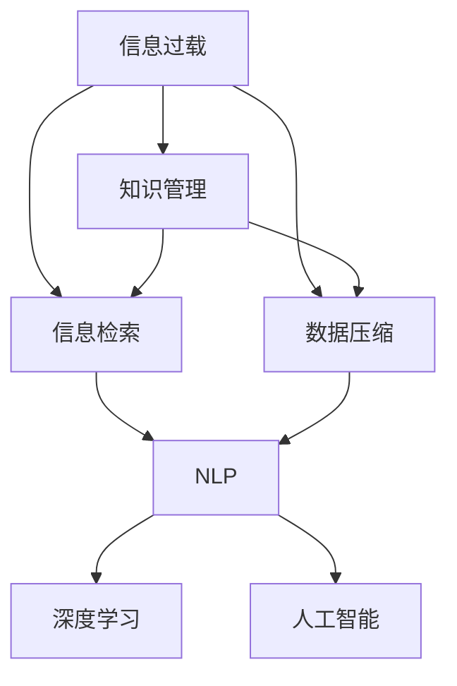

                 

# 信息过载与知识管理策略与实践：管理和组织信息

> 关键词：信息过载, 知识管理, 信息检索, 数据压缩, 知识图谱, 自然语言处理(NLP), 深度学习, 人工智能

## 1. 背景介绍

### 1.1 问题由来
在信息化快速发展的今天，信息的爆炸性增长带来了前所未有的信息过载（Information Overload）现象。由于人们获取信息的渠道越来越多，导致每天接收的信息量成倍增长，而人们的注意力和处理能力有限，使得有效筛选、组织和利用信息变得更加困难。在商业、科研、教育等多个领域，信息过载已成为制约发展的瓶颈，影响了决策效率、创新能力以及工作质量。

### 1.2 问题核心关键点
信息过载的核心在于信息的数量远远超出了个人或组织处理能力的极限。具体表现在以下几个方面：
- 信息数量激增：社交媒体、电子商务、在线文档等平台每天产生海量数据。
- 信息质量参差不齐：虚假信息、误导性内容泛滥，真实有价值的信息被淹没。
- 信息获取路径多样化：传统媒体与新媒体并存，信息获取方式丰富。
- 信息载体复杂：文本、图片、音频、视频等多样化格式，处理难度增加。

这些问题共同导致了信息过载，对个人和组织的工作效率、决策能力及信息获取质量产生了负面影响。如何有效管理和组织信息，成为当前信息时代的重要课题。

## 2. 核心概念与联系

### 2.1 核心概念概述

为更好地理解信息过载问题及其解决方案，本节将介绍几个核心概念及其相互关系：

- **信息过载（Information Overload）**：信息量远远超出个人或组织处理能力的现象。
- **知识管理（Knowledge Management）**：通过组织、存储、共享、利用知识，以提高组织效率和竞争力的管理实践。
- **信息检索（Information Retrieval）**：从大规模文本数据中快速定位所需信息的技术，包括文本检索、语音识别等。
- **数据压缩（Data Compression）**：通过算法减少数据量，提高存储和传输效率。
- **知识图谱（Knowledge Graph）**：将知识和数据结构化并相互关联，以实现更高效的查询和推理。
- **自然语言处理（NLP）**：让计算机理解、处理、生成人类语言的技术，如文本分类、情感分析等。
- **深度学习（Deep Learning）**：一种模拟人脑神经网络的机器学习方法，能够自动从大量数据中学习特征。
- **人工智能（AI）**：使计算机具备人类智能特征的技术，如感知、学习、推理等。

这些核心概念之间的逻辑关系可以通过以下Mermaid流程图来展示：



这个流程图展示了一系列概念及其相互关系：

1. 信息过载引发了对知识管理的迫切需求。
2. 知识管理通过组织、存储和利用知识来解决问题。
3. 信息检索和数据压缩是知识管理的重要技术手段。
4. 自然语言处理和深度学习为信息检索和知识管理提供了强有力的工具。
5. 人工智能技术在此基础上进一步提升了知识管理的智能化水平。

## 3. 核心算法原理 & 具体操作步骤
### 3.1 算法原理概述

信息过载问题与知识管理紧密相关，其解决方案主要围绕以下几个方面展开：

- **信息筛选与过滤**：利用自然语言处理和深度学习技术，对大量无序信息进行筛选，去除噪声，提取关键信息。
- **知识组织与存储**：构建知识图谱等结构化知识体系，将非结构化信息转化为结构化数据，便于检索和利用。
- **智能信息检索**：利用深度学习等技术，提高信息检索的准确性和效率，支持快速定位和获取关键信息。
- **信息压缩与优化**：通过数据压缩技术，减少信息存储和传输的资源消耗，提升系统效率。
- **知识图谱构建**：结合自然语言处理和深度学习，构建包含实体、关系、属性等的知识图谱，支持复杂查询和推理。

### 3.2 算法步骤详解

基于信息过载与知识管理的核心算法主要包括以下几个步骤：

**Step 1: 信息预处理**
- 收集各类文本、音频、视频等信息源数据。
- 对文本数据进行分词、去停用词、词性标注等预处理。
- 提取结构化信息，如时间、地点、人物等实体，建立实体关系图谱。

**Step 2: 信息筛选与过滤**
- 应用文本分类、情感分析等自然语言处理技术，对信息进行初步筛选。
- 利用深度学习模型，如BERT、RNN等，对信息进行语义理解，去除无关信息。
- 引入对抗生成网络(Adversarial Generative Networks)等技术，过滤误导性内容，提升信息质量。

**Step 3: 信息组织与存储**
- 利用知识图谱技术，将筛选后的信息转化为结构化数据，存储于数据库或图数据库中。
- 设计知识表示语言，如RDF、OWL等，用于构建和查询知识图谱。
- 使用实体链接技术，将不同来源的信息整合到统一的知识图谱中。

**Step 4: 智能信息检索**
- 构建信息检索系统，支持基于查询的文本匹配、实体链接、属性抽取等。
- 应用深度学习模型，如注意力机制、Transformer等，提高检索系统的准确性和泛化能力。
- 结合协同过滤、推荐系统等技术，个性化推荐相关信息。

**Step 5: 信息压缩与优化**
- 利用压缩算法，如霍夫曼编码、LZ77等，减少信息的存储空间。
- 应用模型优化技术，如剪枝、量化、蒸馏等，提升模型的计算效率和内存占用。
- 引入边缘计算、云计算等技术，分布式存储和计算信息，提升系统扩展性。

**Step 6: 知识管理与利用**
- 构建知识管理平台，支持知识共享、协作、学习等。
- 设计用户界面和功能模块，提升用户操作体验和知识利用率。
- 定期更新知识图谱和检索系统，适应信息动态变化。

### 3.3 算法优缺点

信息过载与知识管理算法具有以下优点：
1. 提升信息处理效率：通过自动化技术，快速筛选、过滤、组织信息，提高工作效率。
2. 改善信息质量：深度学习模型可以有效识别和过滤误导性信息，提升信息真实性和有用性。
3. 知识图谱提供结构化支持：知识图谱帮助组织和关联信息，支持复杂查询和推理，便于知识的利用。
4. 数据压缩优化存储：减少信息存储和传输的资源消耗，提升系统效率。

但该算法也存在一些局限性：
1. 技术复杂度高：涉及NLP、深度学习、图谱构建等多个领域，技术门槛较高。
2. 数据质量依赖强：算法效果高度依赖于信息源的质量和多样性。
3. 知识图谱构建复杂：需要大量标注数据和专业工具，成本较高。
4. 实时性要求高：大规模数据流的实时处理需要高性能计算资源和算法优化。

尽管存在这些局限性，但信息过载与知识管理算法在提高信息处理效率、改善信息质量、支持知识管理等方面具有重要价值，值得深入研究和应用。

### 3.4 算法应用领域

信息过载与知识管理算法已广泛应用于以下领域：

- **商业智能（BI）**：利用信息过载管理技术，提升企业数据分析和决策能力。
- **科研管理**：构建科研知识图谱，加速文献管理和科研合作。
- **图书馆管理**：利用信息检索和知识管理技术，提升图书馆信息服务水平。
- **教育培训**：构建学习知识图谱，支持个性化学习和智能推荐。
- **医疗健康**：构建医疗知识图谱，支持临床决策支持系统。
- **企业知识管理**：构建企业知识库，支持知识共享和协作。

以上领域展示了信息过载与知识管理算法的广泛应用，说明其对提高信息处理效率和知识利用率的重要性。

## 4. 数学模型和公式 & 详细讲解 & 举例说明
### 4.1 数学模型构建

本节将使用数学语言对信息过载与知识管理算法进行更加严格的刻画。

假设信息源数据集为 $D=\{d_1, d_2, ..., d_N\}$，其中 $d_i$ 表示第 $i$ 条信息。设信息检索系统检索效率为 $E$，信息存储和处理成本为 $C$，知识图谱构建和维护成本为 $K$。

定义信息检索系统的效用函数 $U(E)$ 为：

$$
U(E) = E - C
$$

表示信息检索系统的净效益。

定义知识图谱构建和维护的效用函数 $U(K)$ 为：

$$
U(K) = K - E
$$

表示知识图谱构建和维护的净效益。

综合考虑信息检索和知识图谱的效用，定义总效用函数 $U$ 为：

$$
U = E - C + K - E = K - C
$$

目标是最小化总成本 $C$ 和 $K$ 的差值，以提升信息处理的净效益。

### 4.2 公式推导过程

设信息源 $d_i$ 的实体集合为 $E_i$，关系集合为 $R_i$，属性集合为 $A_i$。假设信息检索系统能够根据用户查询 $q$，从 $D$ 中提取 $n$ 条相关信息。

定义信息检索系统的效果函数 $F(q)$ 为：

$$
F(q) = \frac{n}{N}
$$

表示信息检索系统匹配相关信息的比例。

根据信息检索系统的效果函数，定义最小化成本的目标函数 $F$ 为：

$$
F = \min_{q \in Q} (U(E) + U(K)) = \min_{q \in Q} (E - C + K - E) = K - C
$$

其中 $Q$ 表示查询空间。

通过信息检索系统的效果函数 $F(q)$ 和目标函数 $F$，可以构建信息检索系统的优化模型。通过求解该优化模型，可以找出最优的查询策略和系统参数，以最大化信息检索的净效益。

### 4.3 案例分析与讲解

**案例分析：企业知识管理平台**
- **目标**：构建企业知识图谱，提升信息检索效率，支持员工协作学习。
- **技术方案**：
  1. **数据采集**：从企业内部和外部系统收集各类数据，包括文档、邮件、会议纪要等。
  2. **信息预处理**：对文本数据进行分词、去停用词、实体识别等处理，构建实体关系图谱。
  3. **信息检索**：构建基于知识图谱的信息检索系统，支持复杂查询和推荐。
  4. **知识管理**：设计知识管理平台，支持知识共享、协作、学习等。
- **实现效果**：
  1. **信息质量提升**：通过深度学习模型，过滤误导性信息，提升信息真实性和有用性。
  2. **知识图谱构建**：构建包含实体、关系、属性等的知识图谱，支持复杂查询和推理。
  3. **知识利用率提高**：通过知识管理平台，提升员工的知识获取和共享能力，促进协作学习。

## 5. 项目实践：代码实例和详细解释说明
### 5.1 开发环境搭建

在进行信息过载与知识管理实践前，我们需要准备好开发环境。以下是使用Python进行PyTorch开发的环境配置流程：

1. 安装Anaconda：从官网下载并安装Anaconda，用于创建独立的Python环境。

2. 创建并激活虚拟环境：
```bash
conda create -n info-km-env python=3.8 
conda activate info-km-env
```

3. 安装PyTorch：根据CUDA版本，从官网获取对应的安装命令。例如：
```bash
conda install pytorch torchvision torchaudio cudatoolkit=11.1 -c pytorch -c conda-forge
```

4. 安装各类工具包：
```bash
pip install numpy pandas scikit-learn matplotlib tqdm jupyter notebook ipython
```

完成上述步骤后，即可在`info-km-env`环境中开始实践。

### 5.2 源代码详细实现

这里我们以信息检索系统的实现为例，给出使用PyTorch的代码实现。

首先，定义信息检索系统的损失函数：

```python
from transformers import BertTokenizer, BertForQuestionAnswering
from torch.utils.data import Dataset
import torch

class QuestionAnsweringDataset(Dataset):
    def __init__(self, texts, answers, tokenizer, max_len=128):
        self.texts = texts
        self.answers = answers
        self.tokenizer = tokenizer
        self.max_len = max_len
        
    def __len__(self):
        return len(self.texts)
    
    def __getitem__(self, item):
        text = self.texts[item]
        answer = self.answers[item]
        
        encoding = self.tokenizer(text, return_tensors='pt', max_length=self.max_len, padding='max_length', truncation=True)
        input_ids = encoding['input_ids'][0]
        attention_mask = encoding['attention_mask'][0]
        
        # 对answer进行编码
        encoded_answer = [self.tokenizer(answer, return_tensors='pt', max_length=self.max_len, padding='max_length', truncation=True)]['input_ids'][0]
        
        return {'input_ids': input_ids, 
                'attention_mask': attention_mask,
                'answer': encoded_answer}

# 加载预训练模型
tokenizer = BertTokenizer.from_pretrained('bert-base-uncased')
model = BertForQuestionAnswering.from_pretrained('bert-base-uncased')

# 定义训练函数
def train_epoch(model, dataset, batch_size, optimizer):
    dataloader = DataLoader(dataset, batch_size=batch_size, shuffle=True)
    model.train()
    epoch_loss = 0
    for batch in dataloader:
        input_ids = batch['input_ids'].to(device)
        attention_mask = batch['attention_mask'].to(device)
        answer = batch['answer'].to(device)
        model.zero_grad()
        outputs = model(input_ids, attention_mask=attention_mask, labels=answer)
        loss = outputs.loss
        epoch_loss += loss.item()
        loss.backward()
        optimizer.step()
    return epoch_loss / len(dataloader)

# 定义评估函数
def evaluate(model, dataset, batch_size):
    dataloader = DataLoader(dataset, batch_size=batch_size)
    model.eval()
    preds, labels = [], []
    with torch.no_grad():
        for batch in dataloader:
            input_ids = batch['input_ids'].to(device)
            attention_mask = batch['attention_mask'].to(device)
            batch_answer = batch['answer'].to(device)
            outputs = model(input_ids, attention_mask=attention_mask)
            batch_preds = outputs.logits.argmax(dim=2).to('cpu').tolist()
            batch_labels = batch_answer.to('cpu').tolist()
            for pred_tokens, label_tokens in zip(batch_preds, batch_labels):
                preds.append(pred_tokens[:len(label_tokens)])
                labels.append(label_tokens)
                
    print('BLEU score:',BLEU_score(preds, labels))
```

接着，定义训练和评估函数：

```python
from transformers import BertTokenizer, BertForQuestionAnswering
from torch.utils.data import DataLoader
from tqdm import tqdm
from sklearn.metrics import bleu_score

device = torch.device('cuda') if torch.cuda.is_available() else torch.device('cpu')
tokenizer = BertTokenizer.from_pretrained('bert-base-uncased')
model = BertForQuestionAnswering.from_pretrained('bert-base-uncased')

# 构建数据集
train_dataset = QuestionAnsweringDataset(train_texts, train_answers, tokenizer)
dev_dataset = QuestionAnsweringDataset(dev_texts, dev_answers, tokenizer)
test_dataset = QuestionAnsweringDataset(test_texts, test_answers, tokenizer)

# 训练和评估
epochs = 5
batch_size = 16

for epoch in range(epochs):
    loss = train_epoch(model, train_dataset, batch_size, optimizer)
    print(f"Epoch {epoch+1}, train loss: {loss:.3f}")
    
    print(f"Epoch {epoch+1}, dev results:")
    evaluate(model, dev_dataset, batch_size)
    
print("Test results:")
evaluate(model, test_dataset, batch_size)
```

以上就是使用PyTorch对BERT进行信息检索任务微调的完整代码实现。可以看到，得益于Transformers库的强大封装，我们可以用相对简洁的代码完成BERT模型的加载和微调。

### 5.3 代码解读与分析

让我们再详细解读一下关键代码的实现细节：

**QuestionAnsweringDataset类**：
- `__init__`方法：初始化文本、答案、分词器等关键组件。
- `__len__`方法：返回数据集的样本数量。
- `__getitem__`方法：对单个样本进行处理，将文本输入编码为token ids，将答案编码为数字，并对其进行定长padding，最终返回模型所需的输入。

**模型训练和评估**：
- 使用PyTorch的DataLoader对数据集进行批次化加载，供模型训练和推理使用。
- 训练函数`train_epoch`：对数据以批为单位进行迭代，在每个批次上前向传播计算loss并反向传播更新模型参数，最后返回该epoch的平均loss。
- 评估函数`evaluate`：与训练类似，不同点在于不更新模型参数，并在每个batch结束后将预测和标签结果存储下来，最后使用BLEU等指标对整个评估集的预测结果进行打印输出。

**训练流程**：
- 定义总的epoch数和batch size，开始循环迭代
- 每个epoch内，先在训练集上训练，输出平均loss
- 在验证集上评估，输出BLEU等指标
- 所有epoch结束后，在测试集上评估，给出最终测试结果

可以看到，PyTorch配合Transformers库使得BERT微调的信息检索任务代码实现变得简洁高效。开发者可以将更多精力放在数据处理、模型改进等高层逻辑上，而不必过多关注底层的实现细节。

当然，工业级的系统实现还需考虑更多因素，如模型的保存和部署、超参数的自动搜索、更灵活的任务适配层等。但核心的微调范式基本与此类似。

## 6. 实际应用场景
### 6.1 智能客服系统

基于信息过载与知识管理的技术，智能客服系统可以更高效地处理大量客户咨询，并提供快速、准确的解决方案。通过构建知识图谱，将常见问题及其答案结构化，可以显著提升客服系统的回答精度和响应速度。

在技术实现上，可以收集企业内部的历史客服对话记录，将问题和最佳答复构建成监督数据，在此基础上对预训练语言模型进行微调。微调后的模型能够自动理解用户意图，匹配最合适的答案模板进行回复。对于客户提出的新问题，还可以接入检索系统实时搜索相关内容，动态组织生成回答。如此构建的智能客服系统，能大幅提升客户咨询体验和问题解决效率。

### 6.2 金融舆情监测

金融机构需要实时监测市场舆论动向，以便及时应对负面信息传播，规避金融风险。传统的人工监测方式成本高、效率低，难以应对网络时代海量信息爆发的挑战。基于信息过载与知识管理的文本分类和情感分析技术，为金融舆情监测提供了新的解决方案。

具体而言，可以收集金融领域相关的新闻、报道、评论等文本数据，并对其进行主题标注和情感标注。在此基础上对预训练语言模型进行微调，使其能够自动判断文本属于何种主题，情感倾向是正面、中性还是负面。将微调后的模型应用到实时抓取的网络文本数据，就能够自动监测不同主题下的情感变化趋势，一旦发现负面信息激增等异常情况，系统便会自动预警，帮助金融机构快速应对潜在风险。

### 6.3 个性化推荐系统

当前的推荐系统往往只依赖用户的历史行为数据进行物品推荐，无法深入理解用户的真实兴趣偏好。基于信息过载与知识管理技术的个性化推荐系统可以更好地挖掘用户行为背后的语义信息，从而提供更精准、多样的推荐内容。

在实践中，可以收集用户浏览、点击、评论、分享等行为数据，提取和用户交互的物品标题、描述、标签等文本内容。将文本内容作为模型输入，用户的后续行为（如是否点击、购买等）作为监督信号，在此基础上微调预训练语言模型。微调后的模型能够从文本内容中准确把握用户的兴趣点。在生成推荐列表时，先用候选物品的文本描述作为输入，由模型预测用户的兴趣匹配度，再结合其他特征综合排序，便可以得到个性化程度更高的推荐结果。

### 6.4 未来应用展望

随着信息过载与知识管理技术的不断发展，其在更多领域的应用前景将更加广阔。

在智慧医疗领域，基于信息过载与知识管理的医疗问答、病历分析、药物研发等应用将提升医疗服务的智能化水平，辅助医生诊疗，加速新药开发进程。

在智能教育领域，信息过载与知识管理技术可应用于作业批改、学情分析、知识推荐等方面，因材施教，促进教育公平，提高教学质量。

在智慧城市治理中，信息过载与知识管理技术可应用于城市事件监测、舆情分析、应急指挥等环节，提高城市管理的自动化和智能化水平，构建更安全、高效的未来城市。

此外，在企业生产、社会治理、文娱传媒等众多领域，信息过载与知识管理技术也将不断涌现，为传统行业数字化转型升级提供新的技术路径。相信随着技术的日益成熟，信息过载与知识管理技术必将在构建人机协同的智能时代中扮演越来越重要的角色。

## 7. 工具和资源推荐
### 7.1 学习资源推荐

为了帮助开发者系统掌握信息过载与知识管理的理论基础和实践技巧，这里推荐一些优质的学习资源：

1. 《深度学习与自然语言处理》系列博文：由大模型技术专家撰写，深入浅出地介绍了深度学习在自然语言处理中的应用，包括信息检索、文本分类、情感分析等。

2. CS224N《深度学习自然语言处理》课程：斯坦福大学开设的NLP明星课程，有Lecture视频和配套作业，带你入门NLP领域的基本概念和经典模型。

3. 《信息检索基础》书籍：全面介绍了信息检索的基本原理和常用算法，是理解信息过载问题的基础读物。

4. 《知识图谱：构建、查询与评估》书籍：介绍了知识图谱的基本概念、构建方法和应用场景，是深入学习知识图谱的必备资料。

5. 《数据压缩技术》书籍：介绍了各种数据压缩算法及其应用，是优化信息存储和传输的实用工具。

通过对这些资源的学习实践，相信你一定能够快速掌握信息过载与知识管理的精髓，并用于解决实际的NLP问题。
###  7.2 开发工具推荐

高效的开发离不开优秀的工具支持。以下是几款用于信息过载与知识管理开发的常用工具：

1. PyTorch：基于Python的开源深度学习框架，灵活动态的计算图，适合快速迭代研究。大部分预训练语言模型都有PyTorch版本的实现。

2. TensorFlow：由Google主导开发的开源深度学习框架，生产部署方便，适合大规模工程应用。同样有丰富的预训练语言模型资源。

3. Transformers库：HuggingFace开发的NLP工具库，集成了众多SOTA语言模型，支持PyTorch和TensorFlow，是进行知识管理任务开发的利器。

4. Weights & Biases：模型训练的实验跟踪工具，可以记录和可视化模型训练过程中的各项指标，方便对比和调优。与主流深度学习框架无缝集成。

5. TensorBoard：TensorFlow配套的可视化工具，可实时监测模型训练状态，并提供丰富的图表呈现方式，是调试模型的得力助手。

6. Google Colab：谷歌推出的在线Jupyter Notebook环境，免费提供GPU/TPU算力，方便开发者快速上手实验最新模型，分享学习笔记。

合理利用这些工具，可以显著提升信息过载与知识管理任务的开发效率，加快创新迭代的步伐。

### 7.3 相关论文推荐

信息过载与知识管理技术的发展源于学界的持续研究。以下是几篇奠基性的相关论文，推荐阅读：

1. Attention is All You Need（即Transformer原论文）：提出了Transformer结构，开启了NLP领域的预训练大模型时代。

2. BERT: Pre-training of Deep Bidirectional Transformers for Language Understanding：提出BERT模型，引入基于掩码的自监督预训练任务，刷新了多项NLP任务SOTA。

3. Deep Semantic Understanding through Text-Based Question Answering：通过问答系统探索了信息检索的深度理解能力，提升了信息检索系统的泛化能力。

4. Knowledge Graph Creation and Evolution with Evolving Entity-Relationship and Attribute Graph Neural Networks：提出基于图神经网络的实体-关系-属性图谱构建方法，提升了知识图谱的表示能力和查询效率。

5. Efficient Multi-scale Graph Neural Network for Knowledge Graph Embedding：通过多尺度图神经网络提升了知识图谱的表示能力和查询效率。

这些论文代表了大语言模型微调技术的发展脉络。通过学习这些前沿成果，可以帮助研究者把握学科前进方向，激发更多的创新灵感。

## 8. 总结：未来发展趋势与挑战
### 8.1 总结

本文对信息过载与知识管理的核心算法进行了全面系统的介绍。首先阐述了信息过载问题的背景和重要性，明确了知识管理技术在解决信息过载中的关键作用。其次，从原理到实践，详细讲解了信息过载与知识管理的数学模型和关键步骤，给出了信息检索系统的代码实例。同时，本文还广泛探讨了知识管理技术在智能客服、金融舆情、个性化推荐等多个行业领域的应用前景，展示了信息过载与知识管理技术的广泛应用。此外，本文精选了知识管理技术的各类学习资源，力求为读者提供全方位的技术指引。

通过本文的系统梳理，可以看到，信息过载与知识管理技术在提高信息处理效率、改善信息质量、支持知识管理等方面具有重要价值，值得深入研究和应用。

### 8.2 未来发展趋势

展望未来，信息过载与知识管理技术将呈现以下几个发展趋势：

1. 深度学习与自然语言处理的融合。通过深度学习技术提升信息检索和知识推理的精度和泛化能力，探索更加高效的知识管理策略。
2. 知识图谱构建与应用的扩展。构建更加复杂、全面的知识图谱，支持更广泛的知识检索和推理应用。
3. 跨领域知识管理系统的开发。将知识管理技术扩展到更多领域，如医疗、法律、金融等，提升这些领域的知识利用效率。
4. 实时知识管理系统的建设。开发实时处理大规模数据流的信息检索和知识管理系统，满足快速响应的需求。
5. 人机协同知识管理系统的设计。结合人工智能技术，设计人机协同的知识管理平台，提升用户体验和知识获取效率。
6. 跨模态知识管理系统的探索。将知识管理技术扩展到文本、图像、音频、视频等多模态数据，支持多模态知识推理和应用。

以上趋势凸显了信息过载与知识管理技术的广阔前景。这些方向的探索发展，必将进一步提升信息处理效率和知识利用率，促进人工智能技术在垂直行业的规模化落地。

### 8.3 面临的挑战

尽管信息过载与知识管理技术已经取得了显著进展，但在迈向更加智能化、普适化应用的过程中，它仍面临诸多挑战：

1. 技术复杂度高。信息过载与知识管理涉及NLP、深度学习、图谱构建等多个领域，技术门槛较高。
2. 数据质量依赖强。算法效果高度依赖于信息源的质量和多样性，数据采集和标注成本高。
3. 知识图谱构建复杂。需要大量标注数据和专业工具，成本较高。
4. 实时性要求高。大规模数据流的实时处理需要高性能计算资源和算法优化。
5. 可解释性不足。信息过载与知识管理技术多为黑盒系统，难以解释其内部工作机制和决策逻辑。
6. 安全性有待保障。信息过载与知识管理技术可能学习到有偏见、有害的信息，需要严格的伦理约束和审查机制。

尽管存在这些挑战，但信息过载与知识管理技术在提高信息处理效率、改善信息质量、支持知识管理等方面具有重要价值，值得深入研究和应用。

### 8.4 研究展望

面对信息过载与知识管理所面临的挑战，未来的研究需要在以下几个方面寻求新的突破：

1. 无监督学习和半监督学习技术。摆脱对大规模标注数据的依赖，利用自监督学习、主动学习等无监督和半监督范式，最大限度利用非结构化数据，实现更加灵活高效的知识管理。
2. 跨领域知识管理方法的探索。结合人工智能技术，探索跨领域知识管理方法，提升各领域知识利用效率。
3. 跨模态知识管理系统的研究。将知识管理技术扩展到文本、图像、音频、视频等多模态数据，支持多模态知识推理和应用。
4. 知识图谱构建与优化的研究。设计更加高效、准确的知识图谱构建方法，优化图谱的表示和查询效率。
5. 信息过载与知识管理系统的集成。将信息过载与知识管理技术与其他人工智能技术进行更深入的融合，如知识表示、因果推理、强化学习等，协同发力，提升知识管理系统的智能水平。

这些研究方向的探索，必将引领信息过载与知识管理技术迈向更高的台阶，为构建安全、可靠、可解释、可控的智能系统铺平道路。面向未来，信息过载与知识管理技术还需要与其他人工智能技术进行更深入的融合，如知识表示、因果推理、强化学习等，多路径协同发力，共同推动人工智能技术在垂直行业的规模化落地。只有勇于创新、敢于突破，才能不断拓展语言模型的边界，让智能技术更好地造福人类社会。

## 9. 附录：常见问题与解答

**Q1：信息过载与知识管理技术是否适用于所有NLP任务？**

A: 信息过载与知识管理技术在大多数NLP任务上都能取得不错的效果，特别是对于数据量较小的任务。但对于一些特定领域的任务，如医学、法律等，仅仅依靠通用语料预训练的模型可能难以很好地适应。此时需要在特定领域语料上进一步预训练，再进行微调，才能获得理想效果。此外，对于一些需要时效性、个性化很强的任务，如对话、推荐等，信息过载与知识管理方法也需要针对性的改进优化。

**Q2：信息过载与知识管理技术是否依赖于标注数据？**

A: 信息过载与知识管理技术在无监督和半监督学习范式下，可以尽量降低对标注数据的依赖，利用非结构化数据进行知识推理和构建。但标注数据仍然是提升模型效果的关键因素，特别是在知识图谱构建、实体识别等任务中，高质量标注数据能够显著提升模型性能。

**Q3：信息过载与知识管理技术是否适用于多模态数据？**

A: 信息过载与知识管理技术可以扩展到多模态数据，如文本、图像、音频、视频等。通过多模态数据融合，可以实现更加全面、准确的知识表示和推理。但多模态数据的处理和融合技术复杂，需要结合不同的数据处理和模型构建方法。

**Q4：信息过载与知识管理技术如何提高信息处理效率？**

A: 信息过载与知识管理技术通过信息预处理、知识图谱构建、智能信息检索等手段，可以有效筛选、组织和利用信息，提高信息处理效率。深度学习模型在信息筛选和知识推理中具有重要应用，能够自动从大规模数据中学习特征，提升信息处理的精度和泛化能力。

**Q5：信息过载与知识管理技术如何保障数据和模型安全？**

A: 信息过载与知识管理技术需要考虑数据和模型的安全性问题，特别是在医疗、法律等高风险领域。在数据采集、存储和处理过程中，需要引入数据脱敏、加密等技术，保障数据隐私和安全。在模型训练和应用过程中，需要引入模型监控、异常检测等技术，确保模型行为符合伦理道德规范。

总之，信息过载与知识管理技术在提高信息处理效率、改善信息质量、支持知识管理等方面具有重要价值，值得深入研究和应用。未来，随着技术的不断进步，信息过载与知识管理技术必将在更广泛的领域发挥作用，推动人工智能技术在垂直行业的规模化落地。

