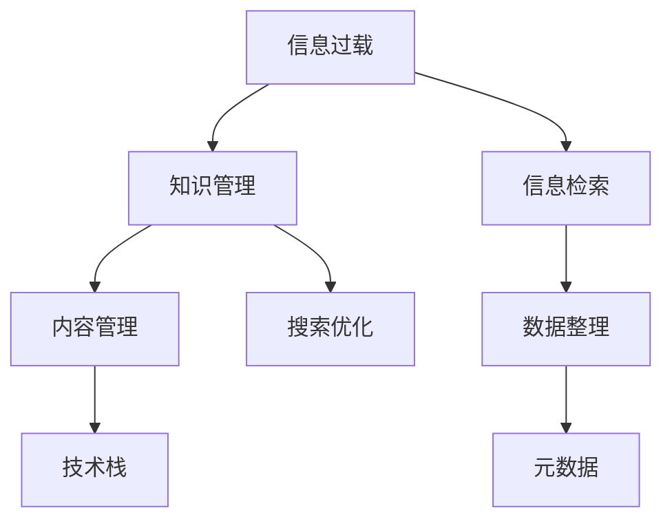

                 

# 信息过载与知识管理策略：有效组织和检索信息的技巧

> 关键词：信息过载,知识管理,信息检索,数据整理,元数据,搜索优化,内容管理,技术栈,数据库,数据可视化,应用场景

## 1. 背景介绍

在现代社会中，信息如潮水般涌来，各种数据、文档、网页充斥着我们的工作和生活。这种信息过载现象使得信息检索、知识管理成为摆在企业和个人面前的重大挑战。如何高效组织和利用这些信息，已成为提升工作效率、促进创新和决策的重要因素。本文将从信息过载的现状入手，深入探讨知识管理的核心策略和高效检索的技巧。

### 1.1 信息过载的现状
信息过载是指个人或组织每天接收到的信息量远超出其处理能力的现象。随着互联网、社交媒体、数字文档等的普及，信息量呈爆炸式增长，且结构复杂、格式多样，包括文本、图片、视频等。信息过载不仅造成时间和精力的浪费，还会降低信息质量，影响决策效率和创新能力。

### 1.2 信息过载的后果
1. **决策迟缓**：过多信息可能导致决策迟缓，员工难以快速响应变化。
2. **知识遗忘**：在面对海量信息时，很难记住所有重要的细节，甚至出现认知偏误。
3. **创新受限**：缺乏有效组织和检索机制，创新灵感容易被淹没在信息的海洋中。

### 1.3 信息过载的应对策略
- **自动化工具**：利用自动化工具进行信息采集、分类和整理。
- **知识管理系统**：构建高效的知识管理系统，提升信息检索和知识重用效率。
- **数据素养**：提升员工的数据素养，提高数据理解和分析能力。

## 2. 核心概念与联系

### 2.1 核心概念概述

为了更好地理解信息管理和检索技术，本文将介绍几个关键概念及其相互关系：

- **信息过载**：指在处理信息时遇到的困难，导致信息难以检索和利用。
- **知识管理**：指通过技术手段管理知识的获取、整理、存储和检索过程，提升知识共享和重用效率。
- **信息检索**：指从大规模数据集中找到符合用户需求的文档或信息的过程。
- **数据整理**：指对数据进行清洗、分类、标准化等处理，便于检索和分析。
- **元数据**：描述数据属性的信息，如标题、作者、日期等，帮助检索和组织数据。
- **搜索优化**：通过算法和工具提升搜索结果的相关性和排序，提高信息检索的准确性和效率。
- **内容管理**：指对文档、图片、视频等多媒体内容的收集、组织和检索。
- **技术栈**：包括数据库、搜索引擎、数据可视化工具等，用于实现信息管理系统的核心功能。

这些概念之间的关系可以通过以下Mermaid流程图来展示：



这个流程图展示了信息过载与知识管理的逻辑关系：

1. 信息过载需要通过知识管理进行解决。
2. 信息检索是知识管理的重要环节，直接影响信息的查找效率。
3. 数据整理和元数据是信息检索的基础，提高检索精度。
4. 搜索优化和内容管理通过技术手段提升信息检索的效果。
5. 技术栈是实现信息管理功能的工具集，提供系统构建和运行支持。

## 3. 核心算法原理 & 具体操作步骤
### 3.1 算法原理概述

知识管理系统的核心在于高效组织和检索信息。其基本原理是利用算法和技术手段对数据进行整理、分类和标准化，并通过元数据和搜索优化技术，提升信息检索的准确性和效率。

### 3.2 算法步骤详解

1. **数据采集与整理**：
   - 使用爬虫等工具采集不同来源的信息，如网页、数据库、社交媒体等。
   - 对采集的数据进行清洗、去重、格式化处理，提升数据质量。

2. **数据分类与标签**：
   - 利用机器学习算法对数据进行自动分类，如文本分类、图像识别等。
   - 为每条数据打上标签，便于检索和组织。

3. **元数据添加**：
   - 为每条数据添加元数据，如标题、作者、日期、关键词等。
   - 元数据通过搜索索引提升检索效率。

4. **搜索算法优化**：
   - 使用倒排索引、TF-IDF、BM25等算法对搜索结果进行排序。
   - 引入自然语言处理技术，提升关键词匹配效果。

5. **内容管理系统部署**：
   - 使用开源或商业内容管理系统（CMS），如WordPress、Drupal等。
   - 部署搜索引擎，如Elasticsearch、Solr，实现全文检索。

### 3.3 算法优缺点

**优点**：
- **高效检索**：利用搜索算法提升检索速度和准确性。
- **自动化处理**：通过机器学习和自动化工具降低人工工作量。
- **便于组织**：通过分类、标签、元数据等手段，有效组织信息。

**缺点**：
- **初始成本高**：知识管理系统建设需要大量人力和技术投入。
- **维护成本高**：需要持续维护和优化，确保系统稳定运行。
- **依赖技术栈**：对技术栈的复杂性和维护要求较高。

### 3.4 算法应用领域

知识管理系统的应用范围非常广泛，涵盖多个行业和领域，如：

- **企业知识管理**：提升企业内部文档、知识库的管理和检索效率。
- **教育资源管理**：构建在线教育资源库，便于教学资源的管理和检索。
- **科研数据管理**：管理科研数据、文献和实验记录，提升科研效率。
- **数字档案馆**：保存和检索历史文献、档案，便于学术研究和文化传承。
- **政府信息公开**：管理政府公开信息，提升信息透明和利用效率。

## 4. 数学模型和公式 & 详细讲解 & 举例说明
### 4.1 数学模型构建

本文将通过数学模型来解释信息检索的核心算法，以提升理解深度。

**TF-IDF模型**：
- 文本A在文档中出现的次数为1，频率（Term Frequency, TF）为1。
- 文本A在整个语料库中出现的次数为3，逆文档频率（Inverse Document Frequency, IDF）为log(总文档数/文档包含A的个数)。
- 文本A的权重（TF-IDF）为TF*IDF。

**BM25算法**：
- 文本A的权值与TF-IDF类似，但还包括文档长度、平均词频等因素。

**文本分类算法**：
- 利用朴素贝叶斯、逻辑回归、支持向量机等算法对文本进行分类。

### 4.2 公式推导过程

**TF-IDF公式推导**：
$$
TF(A)=\frac{\text{文本A在文档中出现的次数}}{\text{文档的总词数}}
$$
$$
IDF(A)=\log(\frac{\text{总文档数}}{\text{文档包含A的个数}})
$$
$$
TF-IDF(A)=TF(A)*IDF(A)
$$

**BM25公式推导**：
$$
\text{权值}(A)=K_1*(1-K_1)\frac{TF(A)*IDF(A)}{K_1+(1-K_1)Q^3*IDF(A)}
$$
其中 $K_1$ 为常数，$Q$ 为查询词的权值。

### 4.3 案例分析与讲解

**案例1：企业知识库的构建**

企业知识库的构建过程包括以下几个步骤：

1. **数据采集**：通过爬虫工具从不同渠道收集文档、报告、会议记录等。
2. **数据清洗**：去除重复和错误数据，提升数据质量。
3. **分类与标签**：利用机器学习算法对文档进行自动分类，如技术文档、培训资料、市场报告等。
4. **元数据添加**：为每篇文档添加标题、作者、关键词、发布日期等元数据。
5. **检索优化**：使用TF-IDF或BM25算法优化搜索排序，提升检索速度和准确性。
6. **部署系统**：使用CMS和搜索引擎搭建知识管理系统，提供全文检索和知识管理功能。

**案例2：科研数据管理**

科研数据管理包括文献管理、实验记录、数据存储和检索等多个环节。其构建过程如下：

1. **数据采集**：从学术数据库、实验平台、文献管理软件等收集科研数据。
2. **数据整理**：清洗数据格式，去除噪声。
3. **分类与标签**：利用元数据对数据进行分类，如预处理步骤、实验结果、文献引用等。
4. **元数据添加**：添加实验设计、参数配置、样本信息等元数据，便于检索和分析。
5. **检索优化**：使用TF-IDF算法对搜索结果进行排序，提升检索效果。
6. **系统部署**：部署科研管理系统，提供文献管理和数据检索功能。

## 5. 项目实践：代码实例和详细解释说明
### 5.1 开发环境搭建

为了快速构建信息管理系统，我们建议使用Python作为开发语言，结合常用的数据处理和搜索库。以下是一个简单的开发环境搭建流程：

1. **安装Python**：
   - 下载Python安装程序，根据操作系统进行安装。
   - 添加Python到环境变量，可以使用命令行进行测试。

2. **安装相关库**：
   - 安装Pandas、NumPy、SciPy等数据处理库。
   - 安装Scikit-learn、NLTK、SpaCy等机器学习库。
   - 安装Elasticsearch、Solr等搜索引擎。

3. **配置开发环境**：
   - 配置IDE（如PyCharm），并添加必要插件。
   - 创建虚拟环境，以便独立管理项目依赖。

### 5.2 源代码详细实现

以下是一个简单的文本分类模型实现，用于展示知识管理系统的基础功能。

**代码1：文本预处理**

```python
import pandas as pd
import numpy as np
from sklearn.feature_extraction.text import CountVectorizer
from sklearn.naive_bayes import MultinomialNB

# 读取数据
data = pd.read_csv('data.csv')

# 数据预处理
texts = data['text']
labels = data['label']
vectorizer = CountVectorizer()
X = vectorizer.fit_transform(texts)

# 模型训练
model = MultinomialNB()
model.fit(X, labels)

# 预测新数据
new_texts = ['文本1', '文本2']
X_new = vectorizer.transform(new_texts)
predictions = model.predict(X_new)
print(predictions)
```

**代码2：全文检索**

```python
from elasticsearch import Elasticsearch
import json

# 创建Elasticsearch客户端
es = Elasticsearch([{'host': 'localhost', 'port': 9200}])

# 添加文档
doc = {'name': 'Tom', 'age': 18}
res = es.index(index='people', doc_type='person', body=doc)
print(res)

# 检索文档
query = {'query': {'match': {'name': 'Tom'}}}
res = es.search(index='people', body=query)
print(json.dumps(res, indent=4))
```

### 5.3 代码解读与分析

**代码1解读**：
- 使用Pandas读取数据，并进行预处理。
- 使用CountVectorizer将文本转换为稀疏矩阵。
- 使用MultinomialNB训练朴素贝叶斯分类器。
- 使用新文本进行预测。

**代码2解读**：
- 使用Elasticsearch客户端连接本地Elasticsearch服务。
- 添加文档，并查询匹配的文档。

### 5.4 运行结果展示

- **文本分类结果**：根据输入的文本，模型可以预测其类别。
- **全文检索结果**：根据输入的关键词，可以检索到匹配的文档列表。

## 6. 实际应用场景
### 6.1 企业知识管理

企业知识管理的核心在于提升内部信息检索和知识共享效率。通过构建企业知识库，员工可以快速找到所需文档、资料，提升工作效率。例如，通过搜索“市场营销策略”，可以迅速找到相关的市场分析报告和案例研究。

### 6.2 教育资源管理

在线教育平台需要高效管理大量教学资源。通过构建资源库，教师和学生可以轻松查找和共享资源。例如，使用“统计学”作为查询词，可以检索到相关教材、视频、案例等。

### 6.3 科研数据管理

科研数据管理需要高效组织和检索大量的实验数据和文献。通过构建数据管理系统，科研人员可以快速检索到所需数据和文献，提升科研效率。例如，使用“DNA测序”作为查询词，可以检索到相关的实验记录和文献引用。

## 7. 工具和资源推荐
### 7.1 学习资源推荐

为了帮助开发者深入理解信息管理和检索技术，这里推荐一些优质的学习资源：

1. **《信息检索导论》**：该书系统介绍了信息检索的基本原理和算法，是信息检索领域的经典教材。
2. **Coursera的“数据科学与机器学习”课程**：涵盖了数据处理、机器学习、信息检索等多个主题，由知名大学提供。
3. **Kaggle竞赛**：参与数据科学和信息检索相关的Kaggle竞赛，实践学习。
4. **GitHub项目**：搜索和参与开源信息管理系统项目，学习代码实现。

### 7.2 开发工具推荐

高效的信息管理工具是构建知识系统的关键。以下是几款常用的开发工具：

1. **Python**：使用Python语言进行信息处理和检索，具有丰富的库和框架支持。
2. **Elasticsearch**：开源搜索引擎，支持全文检索和分布式部署。
3. **Solr**：Apache基金会维护的搜索引擎，提供强大的查询优化功能。
4. **Hadoop**：大数据处理框架，支持分布式数据存储和处理。
5. **Django**：开源Web框架，支持快速构建内容管理系统。

### 7.3 相关论文推荐

信息管理和检索技术的研究非常活跃，以下是几篇经典论文，推荐阅读：

1. **《信息检索中的倒排索引与BM25算法》**：详细介绍了倒排索引和BM25算法的原理和实现。
2. **《文本分类与信息检索》**：介绍了文本分类和信息检索的基本原理和算法。
3. **《机器学习与数据挖掘在信息检索中的应用》**：探讨了机器学习技术在信息检索中的应用。

## 8. 总结：未来发展趋势与挑战
### 8.1 研究成果总结

本文介绍了信息过载的现状和应对策略，探讨了知识管理的核心技术和实践技巧。通过构建知识管理系统，提升了信息检索和知识共享的效率。

### 8.2 未来发展趋势

未来信息管理和检索技术将呈现以下几个趋势：

1. **智能化和自动化**：利用AI技术提升信息管理和检索的智能化水平，减少人工干预。
2. **多模态信息处理**：处理图片、视频等多媒体信息，提升信息管理系统的功能。
3. **实时化和大规模处理**：支持实时处理大规模数据流，满足实时查询需求。
4. **数据可视化**：通过数据可视化技术，提升信息展示和分析的效率和效果。
5. **个性化推荐**：利用推荐算法提升信息推荐的精准度和个性化程度。

### 8.3 面临的挑战

尽管信息管理技术取得了长足进步，但仍面临以下挑战：

1. **数据质量问题**：数据来源多样，数据格式和质量参差不齐，影响系统效果。
2. **检索准确性和效率**：在大规模数据集中快速准确检索信息仍是一个难题。
3. **系统复杂度**：信息管理系统的构建和维护需要较高的技术门槛。
4. **隐私和安全性**：如何保护用户隐私和数据安全，防止数据泄露和滥用。

### 8.4 研究展望

面对这些挑战，未来需要在以下几个方面进行深入研究：

1. **自动化数据清洗**：研究自动化数据清洗技术，提升数据质量。
2. **深度学习算法**：利用深度学习技术提升检索算法的效果。
3. **分布式存储和处理**：研究分布式存储和处理技术，支持大规模数据管理。
4. **隐私保护技术**：研究隐私保护技术，保障用户数据安全。
5. **系统评估标准**：制定信息管理系统的评估标准，提升系统效果。

## 9. 附录：常见问题与解答

**Q1: 如何处理数据质量问题？**

A: 数据质量问题可以通过以下方式解决：
1. 使用数据清洗工具进行预处理，去除噪声和异常数据。
2. 引入数据标注和校验机制，确保数据的准确性和完整性。
3. 采用数据验证和监控工具，实时检测数据质量问题。

**Q2: 如何提高检索准确性和效率？**

A: 提高检索准确性和效率可以采用以下方法：
1. 使用倒排索引和BM25等算法，提升检索效果。
2. 引入机器学习模型，对检索算法进行优化和训练。
3. 对搜索结果进行排序和过滤，提高相关性。

**Q3: 如何保护用户隐私和数据安全？**

A: 保护用户隐私和数据安全可以采取以下措施：
1. 使用数据加密和匿名化技术，防止数据泄露。
2. 实施访问控制和权限管理，限制数据访问权限。
3. 引入安全审计和监控工具，防止非法访问和操作。

**Q4: 如何提升信息管理的智能化水平？**

A: 提升信息管理的智能化水平可以采用以下方法：
1. 引入自然语言处理技术，提升文本检索和分类效果。
2. 利用机器学习算法，进行自动分类和标签化。
3. 引入智能推荐系统，提升信息推荐精准度。

**Q5: 如何处理多模态信息？**

A: 处理多模态信息可以采用以下方法：
1. 使用多模态数据融合技术，将文本、图片、视频等信息进行整合。
2. 引入深度学习模型，处理多模态数据。
3. 利用数据可视化工具，展示多模态信息。

---

作者：禅与计算机程序设计艺术 / Zen and the Art of Computer Programming

