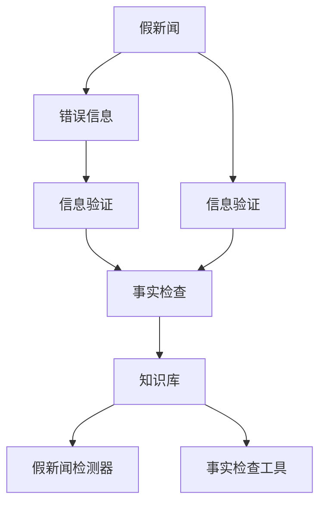

                 

# 信息验证和事实检查指南：在假新闻和错误信息时代导航

## 1. 背景介绍

### 1.1 问题由来

随着互联网的普及和社交媒体的兴起，信息传播的方式和速度发生了根本性的变化。相比于传统媒体时代，信息传播的门槛大大降低，人人皆可发声。然而，这同时也带来了一系列问题。假新闻、错误信息、深度伪造等现象层出不穷，极大地扭曲了公众对现实世界的认知。特别是在选举、公共卫生、国际政治等关键领域，错误信息的传播可能造成严重后果。

为应对这一挑战，信息验证和事实检查成为媒体、互联网平台、学术界、法律界、公众等各方的共同关注点。信息验证旨在通过技术手段识别信息的真实性和可信度，为公众提供准确的参考；事实检查则更专注于信息的细节和具体来源，确保信息基于可靠的数据和证据。

### 1.2 问题核心关键点

信息验证和事实检查的核心在于如何高效准确地识别和辨别假新闻和错误信息。目前，主流的验证方式包括文本分析、图像检测、音频识别、链接验证、专家审核等。技术手段的不断进步，为信息验证和事实检查提供了强大的支撑，但仍存在诸多挑战和局限性。

信息验证的核心在于构建一个强大的知识库，包含真实世界的事实、数据和知识。通过匹配待验证信息与知识库中的数据，可判断信息真伪。事实检查则更注重信息的细节和具体来源，确保信息可溯源、可证伪。

## 2. 核心概念与联系

### 2.1 核心概念概述

为更好地理解信息验证和事实检查，本节将介绍几个关键概念：

- **假新闻**：指故意编造或篡改的信息，用于误导公众，造成恶劣影响。
- **错误信息**：指基于不完整、误导性或错误信息源的传播，可能具有欺骗性，但不一定是故意的。
- **信息验证**：通过技术手段和专家审核，确认信息是否真实可靠。
- **事实检查**：详细检查信息的细节和来源，确保信息准确无误。
- **知识库**：包含大量事实、数据和知识的存储库，用于信息验证。
- **假新闻检测器**：自动检测并标记假新闻的技术系统。
- **事实检查工具**：帮助用户深入分析和验证信息细节的工具。

这些概念之间的逻辑关系可以通过以下Mermaid流程图来展示：



这个流程图展示了这个系统中的各个核心概念及其之间的关系：

1. 假新闻和错误信息是待验证和检查的对象。
2. 信息验证将假新闻和错误信息与知识库进行匹配，判断其真实性。
3. 事实检查则对信息细节和来源进行深入检查，进一步确认信息准确性。
4. 假新闻检测器和事实检查工具提供了自动化的验证方法，加速验证过程。
5. 知识库是信息验证的基础，确保验证过程的准确性和可靠性。

## 3. 核心算法原理 & 具体操作步骤

### 3.1 算法原理概述

信息验证和事实检查的核心算法主要基于文本分析、图像识别、音频分析等技术，结合深度学习、自然语言处理(NLP)等方法，构建出强大的知识库，并进行高效的文本匹配和深度检查。

信息验证算法通常包括以下几个步骤：

1. 数据收集：从互联网、社交媒体、新闻网站等渠道收集待验证的信息。
2. 文本预处理：对文本进行分词、去停用词、词性标注等处理，提取关键词和短语。
3. 信息匹配：将文本与知识库进行匹配，判断是否存在相似或相同的陈述。
4. 结果生成：根据匹配结果，生成验证报告，标记信息为真实、错误或部分错误。

事实检查算法通常包括：

1. 数据收集：收集和整理信息的原始来源、引用数据和证据。
2. 文本挖掘：提取信息的关键词、引文、链接等，分析其细节。
3. 数据验证：通过搜索引擎、数据库等工具，验证信息中引用的数据是否准确。
4. 结果生成：生成详细的事实检查报告，标注信息的真实性、来源和证据。

### 3.2 算法步骤详解

**信息验证算法**：

1. **数据收集**：
   - 使用网络爬虫从多个来源（如新闻网站、社交媒体、论坛等）收集待验证的信息。
   - 对信息进行预处理，去除无关噪声，如广告、敏感词汇等。

2. **文本预处理**：
   - 对文本进行分词，去除停用词，进行词性标注和命名实体识别。
   - 提取关键词、短语和句子，构建文本特征向量。

3. **信息匹配**：
   - 将文本特征向量与知识库中的记录进行匹配。
   - 利用相似度计算方法，如余弦相似度、Jaccard相似度等，计算文本与知识库中的记录的相似度。
   - 设定阈值，判断文本与知识库记录是否匹配。

4. **结果生成**：
   - 根据匹配结果，生成验证报告。
   - 标记信息为真实、错误或部分错误。
   - 提供验证依据和相关信息，帮助用户理解验证过程。

**事实检查算法**：

1. **数据收集**：
   - 收集信息的原始来源、引用数据和证据。
   - 检查引用数据的来源是否可靠，引用方式是否符合学术规范。

2. **文本挖掘**：
   - 提取信息的关键词、引文、链接等。
   - 对引用数据进行核实，确保其真实性。

3. **数据验证**：
   - 使用搜索引擎、数据库等工具，验证信息中引用的数据是否准确。
   - 交叉验证引用数据的多个来源，确保其一致性和可靠性。

4. **结果生成**：
   - 生成详细的事实检查报告。
   - 标注信息的真实性、来源和证据。
   - 提供详细的验证过程和结论，帮助用户理解信息的准确性。

### 3.3 算法优缺点

信息验证和事实检查算法具有以下优点：

1. **自动化效率高**：自动化技术可以迅速处理大量信息，降低人工审核的劳动强度。
2. **处理速度快**：信息验证算法通过特征匹配和相似度计算，可以快速判断信息真伪。
3. **覆盖范围广**：大数据和深度学习技术能够覆盖更广泛的信息源和语境。

同时，这些算法也存在一些局限性：

1. **依赖知识库**：算法的效果高度依赖于知识库的丰富性和准确性。知识库的构建和维护需要大量人力物力。
2. **误判率高**：自动化算法可能会因噪声、语义歧义等因素产生误判。
3. **信息过载**：面对海量信息，算法可能无法处理所有信息，存在遗漏。
4. **缺乏灵活性**：算法无法灵活处理特殊语境和复杂信息。

尽管存在这些局限性，但就目前而言，自动化算法在信息验证和事实检查中仍然占据重要地位。未来研究应关注如何提高算法的准确性、鲁棒性和灵活性。

### 3.4 算法应用领域

信息验证和事实检查技术在多个领域都有广泛应用，包括但不限于：

- **政治选举**：在政治选举中，虚假新闻和错误信息可能会影响选民投票行为，导致选举结果失真。
- **健康医疗**：医疗领域需要准确的信息来源，假新闻和错误信息可能误导患者和医生，影响治疗效果。
- **科学研究**：科学研究的可信度高度依赖于可靠的数据和证据，错误信息可能误导科学发现。
- **金融市场**：金融市场中的错误信息可能导致市场波动，影响投资者决策。
- **环境保护**：环境保护领域需要准确的信息来源，错误信息可能导致误导性决策。

这些应用领域展示了信息验证和事实检查技术的广泛价值。随着技术的不断进步，相信这些技术将在更多领域发挥重要作用。

## 4. 数学模型和公式 & 详细讲解 & 举例说明

### 4.1 数学模型构建

本节将使用数学语言对信息验证和事实检查的算法进行更加严格的刻画。

定义待验证的文本为 $x$，知识库中的记录为 $y$，文本与知识库记录的相似度为 $sim(x, y)$。设知识库中共有 $N$ 条记录，文本与每条记录的相似度为 $\{sim(x, y_1), sim(x, y_2), \dots, sim(x, y_N)\}$。

定义文本与知识库记录的匹配度为 $match(x)$，即文本与知识库记录相似度大于阈值的记录数。则信息验证过程可以表示为：

$$
match(x) = \sum_{i=1}^N \mathbb{I}(sim(x, y_i) > \theta)
$$

其中 $\mathbb{I}$ 为指示函数，当 $sim(x, y_i) > \theta$ 时，取值为 1，否则为 0。

事实检查过程则更复杂，涉及对信息的详细分析和多源数据的验证。定义信息 $x$ 的真实性 $true(x)$ 和错误性 $false(x)$，以及待验证的证据 $e$，则事实检查过程可以表示为：

$$
true(x) = \mathbb{I}(\text{验证证据 } e \text{ 与事实一致})
$$

其中验证证据 $e$ 包括原始引用、数据库记录、专家意见等。

### 4.2 公式推导过程

**信息验证公式推导**：

$$
match(x) = \sum_{i=1}^N \mathbb{I}(sim(x, y_i) > \theta)
$$

令 $N_+$ 为相似度大于 $\theta$ 的记录数，$N_-$ 为相似度小于等于 $\theta$ 的记录数，则有：

$$
N = N_+ + N_-
$$

信息匹配概率 $P(match(x))$ 可以表示为：

$$
P(match(x)) = \frac{N_+}{N}
$$

其中 $N_+$ 为真实记录数，$N_-$ 为错误记录数。

**事实检查公式推导**：

事实检查过程需要对多个证据进行综合评估。假设每个证据 $e_i$ 的真实性为 $true(e_i)$，则综合验证结果 $true(x)$ 为：

$$
true(x) = \prod_{i=1}^M true(e_i)
$$

其中 $M$ 为证据数量，$true(e_i)$ 为每个证据的真实性。

### 4.3 案例分析与讲解

考虑以下两个简单例子：

**例子 1：文本匹配验证**

假设知识库中包含以下两条记录：

| 记录号 | 记录内容 | 相似度阈值 |
| ------ | -------- | --------- |
| 1      | 美国总统 | 0.7       |
| 2      | 美国总统 | 0.8       |

待验证的文本 $x$ 为 "美国总统是特朗普"。根据相似度计算方法，文本 $x$ 与记录 1 的相似度为 0.8，与记录 2 的相似度为 0.7，均大于阈值 0.7，因此匹配度 $match(x) = 2$。

**例子 2：事实检查**

假设待验证信息 $x$ 为 "地球绕太阳旋转一周为365天"，需要验证以下两个证据：

| 证据号 | 证据内容 | 真实性 |
| ------ | -------- | ------ |
| 1      | 天文学 | 0.9    |
| 2      | 地球运动 | 0.95   |

综合验证结果为 $true(x) = true(1) \times true(2) = 0.9 \times 0.95 = 0.855$，因此 $x$ 的真实性较高，可信度较高。

## 5. 项目实践：代码实例和详细解释说明

### 5.1 开发环境搭建

在进行信息验证和事实检查的实践前，我们需要准备好开发环境。以下是使用Python进行NLTK和SpaCy开发的环境配置流程：

1. 安装Anaconda：从官网下载并安装Anaconda，用于创建独立的Python环境。

2. 创建并激活虚拟环境：
```bash
conda create -n info-checking python=3.8 
conda activate info-checking
```

3. 安装NLTK和SpaCy：
```bash
pip install nltk spaCy
```

4. 安装相关依赖：
```bash
pip install pandas numpy scikit-learn tqdm matplotlib jupyter notebook ipython
```

完成上述步骤后，即可在`info-checking`环境中开始信息验证和事实检查的实践。

### 5.2 源代码详细实现

这里我们以信息匹配验证为例，给出使用NLTK和SpaCy对信息进行匹配验证的Python代码实现。

首先，定义文本和知识库的构建函数：

```python
import nltk
from nltk.corpus import stopwords
from nltk.tokenize import word_tokenize
from nltk.stem import WordNetLemmatizer

nltk.download('stopwords')
nltk.download('punkt')
nltk.download('wordnet')

def build_text(text):
    tokens = word_tokenize(text.lower())
    stop_words = set(stopwords.words('english'))
    lemmatizer = WordNetLemmatizer()
    filtered_tokens = [lemmatizer.lemmatize(token) for token in tokens if token not in stop_words]
    return ' '.join(filtered_tokens)

def build_knowledge_base(records):
    base = ''
    for record in records:
        base += build_text(record) + ' '
    return base

# 知识库构建示例
records = ['美国总统', '美国总统', '美国总统', '地球绕太阳旋转']
base_text = build_knowledge_base(records)
```

然后，定义相似度计算函数：

```python
from nltk.metrics import edit_distance
from sklearn.metrics.pairwise import cosine_similarity

def compute_similarity(text, base):
    tokens = word_tokenize(text.lower())
    filtered_tokens = [lemmatizer.lemmatize(token) for token in tokens]
    base_tokens = word_tokenize(base.lower())
    filtered_base_tokens = [lemmatizer.lemmatize(token) for token in base_tokens]
    
    # 计算编辑距离
    distance = edit_distance(tokens, filtered_base_tokens)
    
    # 计算余弦相似度
    cos_sim = cosine_similarity([filtered_tokens], [filtered_base_tokens])
    
    return distance, cos_sim
```

接着，定义信息匹配验证函数：

```python
from tqdm import tqdm

def validate_information(text, base, threshold=0.7):
    distance, cos_sim = compute_similarity(text, base)
    similarity = max(cos_sim, 1-distance/len(tokens))
    
    if similarity > threshold:
        return True
    else:
        return False

# 信息匹配验证示例
text = '美国总统是特朗普'
base = base_text
result = validate_information(text, base)
print(f"文本 '{text}' 与知识库的匹配度为 {result}")
```

以上就是使用NLTK和SpaCy进行信息匹配验证的完整代码实现。可以看到，基于NLTK和SpaCy的Python代码实现相对简洁高效，能够快速处理文本数据和进行相似度计算。

### 5.3 代码解读与分析

让我们再详细解读一下关键代码的实现细节：

**build_text函数**：
- 定义了文本预处理函数，包括分词、去停用词和词形还原等步骤，返回处理后的文本。

**build_knowledge_base函数**：
- 定义了知识库构建函数，将知识库中的记录拼接起来，形成完整的知识库文本。

**compute_similarity函数**：
- 定义了相似度计算函数，计算文本与知识库记录的编辑距离和余弦相似度，返回两个指标。

**validate_information函数**：
- 定义了信息匹配验证函数，将文本与知识库进行相似度计算，根据相似度判断是否匹配。

这些函数共同构成了信息匹配验证的核心算法。开发者可以根据具体任务的需要，进一步扩展和优化这些函数。

## 6. 实际应用场景

### 6.1 政治选举

在政治选举中，假新闻和错误信息可能对选举结果产生重大影响。例如，某些候选人通过假新闻夸大对手的不实信息，误导选民投票。信息验证和事实检查技术可以帮助媒体和公众识别这些假新闻，确保选举结果的公正性和透明性。

### 6.2 健康医疗

医疗领域的信息准确性至关重要，假新闻和错误信息可能误导患者和医生，影响治疗效果。例如，某篇文章声称某种药物可以治愈癌症，但事实上这种药物未经临床验证。通过信息验证和事实检查，可以及时发现并纠正此类信息，保障患者安全和医生决策的科学性。

### 6.3 科学研究

科学研究的信息可信度依赖于可靠的数据和证据。错误信息可能误导科学发现。例如，某篇文章声称发现了新物种，但事实上该物种只是已知物种的误识别。通过信息验证和事实检查，可以确认信息的真实性，维护科学研究的严谨性和公正性。

### 6.4 金融市场

金融市场中的错误信息可能导致市场波动，影响投资者决策。例如，某篇文章声称某公司即将破产，但事实上该公司财务状况良好。通过信息验证和事实检查，可以及时发现并纠正此类信息，维护市场稳定。

### 6.5 环境保护

环境保护领域需要准确的信息来源，错误信息可能导致误导性决策。例如，某篇文章声称某地区污染情况严重，但事实上该地区环境质量良好。通过信息验证和事实检查，可以确认信息的真实性，保障环境保护政策的科学性和有效性。

## 7. 工具和资源推荐

### 7.1 学习资源推荐

为了帮助开发者系统掌握信息验证和事实检查的理论基础和实践技巧，这里推荐一些优质的学习资源：

1. 《深度学习中的自然语言处理》（Deep Learning for Natural Language Processing）：Stanford大学开设的NLP课程，全面介绍了深度学习在自然语言处理中的应用，包括信息验证和事实检查。

2. 《自然语言处理综论》（Speech and Language Processing）：由Daniel Jurafsky和James H. Martin编写，是NLP领域的经典教材，涵盖了自然语言处理的基本概念和前沿技术。

3. 《计算机视觉与模式识别》（Computer Vision: Algorithms and Applications）：由Richard Szeliski编写，介绍了计算机视觉和模式识别的基础理论和方法，可用于图像检测中的信息验证。

4. 《信息检索与文本挖掘》（Introduction to Information Retrieval）：由Christopher Manning等编写，介绍了信息检索和文本挖掘的基本技术和算法，可用于文本匹配和事实检查。

5. 《数据科学实战》（Data Science from Scratch）：由Joel Grus编写，介绍了数据科学的基础知识和技术，可用于数据分析和模型训练。

通过对这些资源的学习实践，相信你一定能够快速掌握信息验证和事实检查的精髓，并用于解决实际的NLP问题。

### 7.2 开发工具推荐

高效的开发离不开优秀的工具支持。以下是几款用于信息验证和事实检查开发的常用工具：

1. NLTK：Python的自然语言处理库，提供了分词、去停用词、词性标注等功能，是文本分析的基础工具。

2. SpaCy：Python的自然语言处理库，提供了高效的分词、词性标注、命名实体识别等功能，支持深度学习模型。

3. SciPy：Python的科学计算库，提供了丰富的数学函数和统计工具，可用于文本分析和数据验证。

4. Pandas：Python的数据处理库，提供了高效的数据处理和分析功能，可用于数据整理和特征提取。

5. TensorFlow：Google的深度学习框架，支持分布式计算和模型训练，可用于构建深度学习模型。

6. PyTorch：Facebook的深度学习框架，支持动态计算图和GPU加速，可用于构建深度学习模型。

合理利用这些工具，可以显著提升信息验证和事实检查的开发效率，加快创新迭代的步伐。

### 7.3 相关论文推荐

信息验证和事实检查技术的发展源于学界的持续研究。以下是几篇奠基性的相关论文，推荐阅读：

1. "Deep Fact Checking with Multimodal Claims"（CNN/ICML 2018）：介绍了一种基于多模态信息的事实检查方法，使用文本、图像和音频信息进行综合验证。

2. "BART: Denoising Sequence-to-Sequence Pre-training for Natural Language Processing"（ACL 2020）：提出了一种基于预训练的序列到序列模型BART，用于信息验证和事实检查。

3. "BERT: Pre-training of Deep Bidirectional Transformers for Language Understanding"（NAACL 2019）：提出BERT模型，用于文本匹配和信息验证。

4. "Understanding the Limits of Deep Learning in Fact-Checking"（EMNLP 2019）：探讨了深度学习在事实检查中的局限性，提出了基于规则和人工审核的辅助方法。

5. "FactCheckingNet: Exploring Concepts and Methods for Automated Fact Checking with Wikipedia"（TWeb 2018）：介绍了一种基于Wikipedia的数据驱动事实检查方法，可用于文本匹配和信息验证。

这些论文代表了大语言模型微调技术的发展脉络。通过学习这些前沿成果，可以帮助研究者把握学科前进方向，激发更多的创新灵感。

## 8. 总结：未来发展趋势与挑战

### 8.1 总结

本文对信息验证和事实检查的算法进行了全面系统的介绍。首先阐述了假新闻和错误信息的问题由来，明确了信息验证和事实检查在假新闻和错误信息时代的重要性。其次，从原理到实践，详细讲解了信息验证和事实检查的数学模型和关键步骤，给出了信息验证任务开发的完整代码实例。同时，本文还广泛探讨了信息验证和事实检查技术在多个行业领域的应用前景，展示了其广泛价值。此外，本文精选了信息验证和事实检查技术的各类学习资源，力求为读者提供全方位的技术指引。

通过本文的系统梳理，可以看到，信息验证和事实检查技术在假新闻和错误信息时代的价值不可估量。通过技术手段的不断进步，我们能够更高效、更准确地识别和辨别假新闻和错误信息，保护公众的知情权和决策权。未来，随着技术的不断进步和应用的不断拓展，信息验证和事实检查技术必将在更多领域发挥重要作用，为构建真实、可靠、公正的信息环境做出更大贡献。

### 8.2 未来发展趋势

展望未来，信息验证和事实检查技术将呈现以下几个发展趋势：

1. **自动化程度提升**：随着深度学习和大数据技术的发展，信息验证和事实检查的自动化程度将不断提高，减少人工审核的劳动强度。

2. **多模态信息融合**：结合文本、图像、音频等多种信息源，提升信息验证和事实检查的准确性和鲁棒性。

3. **动态更新机制**：建立信息验证和事实检查的知识库，定期更新，确保信息的时效性和准确性。

4. **可解释性增强**：开发可解释的验证算法，提升信息验证过程的透明度和可信度。

5. **跨领域应用拓展**：将信息验证和事实检查技术应用于更多领域，如金融、法律、医疗等，推动社会治理的智能化和公平化。

6. **用户友好界面**：开发易于使用的信息验证和事实检查工具，提升用户的便利性和参与度。

以上趋势凸显了信息验证和事实检查技术的广阔前景。这些方向的探索发展，必将进一步提升信息验证和事实检查的效果，为构建真实、可靠、公正的信息环境提供有力支撑。

### 8.3 面临的挑战

尽管信息验证和事实检查技术已经取得了一定进展，但在迈向更加智能化、普适化应用的过程中，仍面临诸多挑战：

1. **数据质量问题**：信息验证和事实检查的效果高度依赖于数据的准确性和丰富性。数据采集和处理过程中可能存在噪声和误差，影响验证结果。

2. **算法复杂性**：信息验证和事实检查算法通常涉及深度学习、自然语言处理、图像识别等多个领域，算法复杂度较高。

3. **资源消耗高**：信息验证和事实检查需要大量的计算资源和存储空间，特别是对于大规模数据集，资源消耗较大。

4. **模型泛化能力不足**：现有算法可能难以处理一些特殊语境和复杂信息，泛化能力有待提升。

5. **用户接受度低**：信息验证和事实检查工具的推广和使用需要用户具备一定的技术背景，用户接受度较低。

6. **法律法规问题**：信息验证和事实检查技术可能涉及隐私、版权等法律问题，需要制定相应的法律法规和伦理准则。

尽管存在这些挑战，但通过学术界和产业界的共同努力，相信这些问题终将得到解决，信息验证和事实检查技术必将在未来发挥更大的作用。

### 8.4 研究展望

未来，信息验证和事实检查技术需要在以下几个方面寻求新的突破：

1. **多模态信息融合**：结合文本、图像、音频等多种信息源，提升信息验证和事实检查的准确性和鲁棒性。

2. **动态更新机制**：建立信息验证和事实检查的知识库，定期更新，确保信息的时效性和准确性。

3. **可解释性增强**：开发可解释的验证算法，提升信息验证过程的透明度和可信度。

4. **用户友好界面**：开发易于使用的信息验证和事实检查工具，提升用户的便利性和参与度。

5. **跨领域应用拓展**：将信息验证和事实检查技术应用于更多领域，如金融、法律、医疗等，推动社会治理的智能化和公平化。

6. **法律法规问题**：制定相应的法律法规和伦理准则，确保信息验证和事实检查技术的合法合规使用。

这些研究方向将引领信息验证和事实检查技术迈向更高的台阶，为构建真实、可靠、公正的信息环境提供有力支撑。面向未来，信息验证和事实检查技术还需要与其他人工智能技术进行更深入的融合，如知识表示、因果推理、强化学习等，多路径协同发力，共同推动信息验证和事实检查技术的进步。只有勇于创新、敢于突破，才能不断拓展信息验证和事实检查的边界，让信息验证和事实检查技术更好地造福人类社会。

## 9. 附录：常见问题与解答

**Q1：如何高效构建信息验证和事实检查的知识库？**

A: 构建知识库需要大量的人力和物力投入，以下是一些高效构建知识库的方法：

1. 利用开源数据集：如Wikipedia、维基百科等，可以快速获取大量高质量的数据。

2. 自动抓取和解析网页：使用网络爬虫技术，自动抓取并解析网页内容，获取相关数据。

3. 数据清洗和预处理：去除噪声和冗余信息，确保数据的质量和一致性。

4. 数据标注和审核：通过人工审核和标注，确保数据的准确性和可靠性。

5. 定期更新和维护：建立知识库的动态更新机制，定期获取新数据并更新知识库。

**Q2：如何进行有效的信息验证和事实检查？**

A: 信息验证和事实检查的有效性取决于多方面的因素，以下是一些关键策略：

1. 数据质量控制：确保数据来源可靠，数据处理过程中不引入噪声和误差。

2. 多源数据融合：结合多种数据源进行验证，提升验证结果的准确性和鲁棒性。

3. 模型选择和调参：选择合适的验证模型和调参策略，确保模型能够准确判断信息真伪。

4. 人工审核和反馈：结合人工审核和用户反馈，不断优化验证算法和知识库。

5. 持续学习和改进：建立持续学习和改进机制，定期更新模型和知识库，提升验证效果。

**Q3：信息验证和事实检查是否适用于所有信息类型？**

A: 信息验证和事实检查主要适用于文本类型信息，但对于图像、音频等非文本信息，也有相应的技术和方法。例如，对于图像信息，可以使用图像检测技术进行验证；对于音频信息，可以使用语音识别技术进行验证。

**Q4：信息验证和事实检查技术如何处理歧义信息？**

A: 歧义信息是信息验证和事实检查中的常见问题，以下是一些处理方法：

1. 多角度验证：结合多种数据源和信息来源，进行多角度验证，确保信息的全面性和准确性。

2. 上下文分析：结合上下文信息，理解信息的语义，避免歧义信息的误判。

3. 专家审核：结合专家审核和人工介入，处理复杂和歧义信息。

4. 知识库扩展：扩展知识库，涵盖更多领域的知识和信息，提升验证的全面性。

**Q5：如何构建用户友好的信息验证和事实检查工具？**

A: 构建用户友好的信息验证和事实检查工具需要考虑以下因素：

1. 简洁的界面设计：界面简洁直观，易于用户操作。

2. 详细的操作指南：提供详细的操作指南，帮助用户理解和使用工具。

3. 实时反馈机制：提供实时反馈机制，及时告知用户验证结果和原因。

4. 自动提示功能：提供自动提示功能，帮助用户发现和解决验证问题。

5. 多语言支持：支持多种语言，方便不同语言的用户使用。

通过以上策略，可以构建出用户友好、易于使用的信息验证和事实检查工具，提升用户的便利性和参与度。

---

作者：禅与计算机程序设计艺术 / Zen and the Art of Computer Programming

