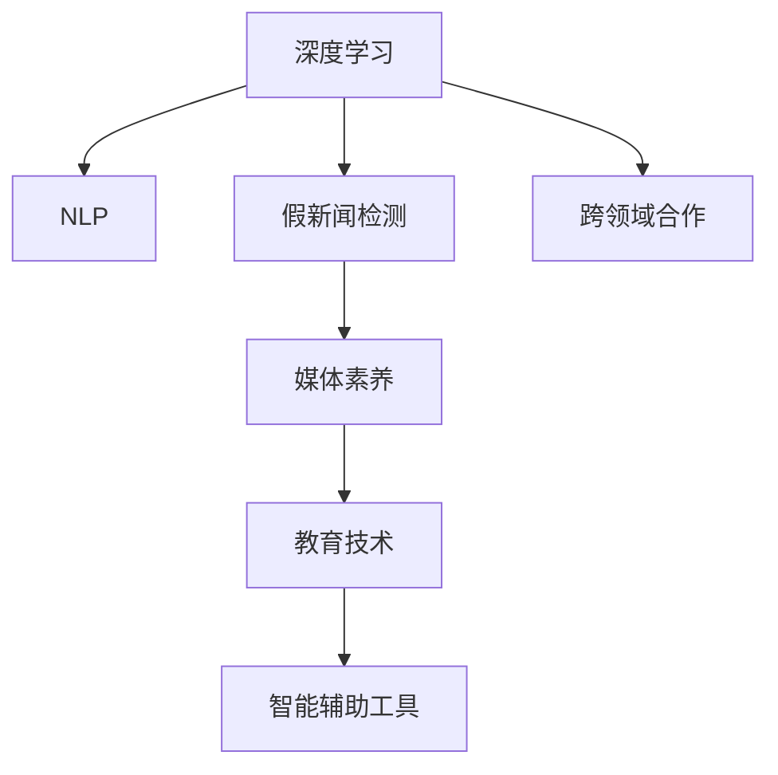
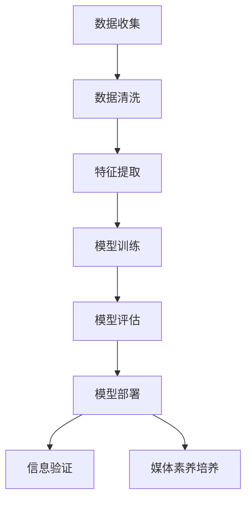

                 

## 1. 背景介绍

### 1.1 问题由来
信息爆炸时代，海量的新闻信息每天都在不断地生成和传播。传统的媒体产业面临着前所未有的挑战：假新闻、误导性信息、媒体操纵等问题频发，严重威胁到了公众的媒体素养。随着深度学习和自然语言处理技术的不断发展，增强信息验证和媒体素养培养能力成为了一个重要课题。本文将重点探讨如何利用AI技术提高信息验证能力，以及如何通过教育手段培养媒体素养，从而构建一个更为健康、透明的信息环境。

### 1.2 问题核心关键点
信息验证和媒体素养培养的核心关键点包括：
- **深度学习模型的应用**：如何通过训练深度学习模型来提升信息验证的准确性和效率。
- **自然语言处理技术**：如何利用自然语言处理技术处理和分析海量文本数据，以检测和分类假新闻。
- **教育技术融合**：如何将信息验证能力培养融入教育体系，提高公众的媒体素养。
- **智能辅助工具**：开发智能辅助工具，帮助用户快速验证信息真伪。
- **跨领域合作**：信息验证和媒体素养培养需要跨学科的合作，结合心理学、社会学等多个领域。

## 2. 核心概念与联系

### 2.1 核心概念概述
为了更好地理解信息验证和媒体素养培养技术，下面将介绍几个关键概念：

- **深度学习**：一种基于神经网络的机器学习方法，通过大量数据进行训练，以实现复杂的数据处理和模式识别。
- **自然语言处理（NLP）**：涉及计算机如何理解和处理自然语言的技术，包括文本分析、语义理解、情感分析等。
- **假新闻检测**：通过机器学习技术，检测和分类新闻报道是否为假新闻的过程。
- **媒体素养**：指个体对媒体信息的辨识、分析和批判能力，包括了解媒体制作流程、批判性思维等。
- **教育技术（EdTech）**：利用信息技术手段改进教育过程和提高教育质量的技术。
- **深度学习框架**：如TensorFlow、PyTorch等，用于构建和训练深度学习模型。

这些概念之间的逻辑关系可以通过以下Mermaid流程图来展示：



### 2.2 核心概念原理和架构的 Mermaid 流程图
下面的流程图示意了深度学习在信息验证和媒体素养培养中的作用：



## 3. 核心算法原理 & 具体操作步骤

### 3.1 算法原理概述
信息验证和媒体素养培养的核心算法主要涉及深度学习和自然语言处理技术。

#### 3.1.1 深度学习模型的构建
深度学习模型通常由输入层、隐藏层和输出层组成。输入层负责接收原始数据，隐藏层通过多层非线性变换提取数据特征，输出层则根据任务需求生成预测结果。

#### 3.1.2 自然语言处理的处理
自然语言处理技术包括分词、词性标注、依存句法分析等。通过这些技术，可以将文本转化为计算机可以理解的形式，进而进行深度学习模型的训练。

#### 3.1.3 假新闻检测算法
假新闻检测算法通常基于分类模型，如逻辑回归、支持向量机、深度神经网络等。通过训练模型，可以识别出文本中的错误信息、逻辑漏洞、来源不实等问题。

#### 3.1.4 媒体素养培养算法
媒体素养培养算法通常基于推荐系统和个性化学习系统。通过分析用户的历史行为，推荐相关的新闻和教育资源，帮助用户提高媒体素养。

### 3.2 算法步骤详解
#### 3.2.1 数据收集与预处理
1. **数据收集**：从新闻网站、社交媒体、论坛等渠道收集新闻数据。
2. **数据清洗**：去除噪声数据、处理缺失值、标准化数据格式。
3. **特征提取**：将文本数据转化为向量形式，如TF-IDF、Word2Vec等。

#### 3.2.2 模型训练
1. **选择模型**：选择适合的深度学习模型，如卷积神经网络（CNN）、循环神经网络（RNN）、Transformer等。
2. **训练数据**：使用标注好的假新闻数据集进行模型训练。
3. **模型调参**：通过交叉验证等方法调整模型超参数，提高模型性能。

#### 3.2.3 模型评估与部署
1. **模型评估**：使用测试集对模型进行评估，计算准确率、召回率等指标。
2. **模型优化**：根据评估结果调整模型结构，提高模型准确率。
3. **模型部署**：将训练好的模型部署到实际应用环境中。

### 3.3 算法优缺点
#### 3.3.1 优点
- **高效性**：深度学习模型可以在大量数据上快速训练，提升信息验证的速度和准确性。
- **自适应性**：深度学习模型可以适应不同类型的文本数据，提高媒体素养培养的普适性。
- **可扩展性**：深度学习模型和自然语言处理技术可以应用于多种媒体素养培养场景。

#### 3.3.2 缺点
- **数据依赖**：模型训练需要大量的标注数据，数据获取和标注成本高。
- **可解释性不足**：深度学习模型的决策过程复杂，难以解释其内部工作机制。
- **对抗样本脆弱**：深度学习模型容易受到对抗样本攻击，影响信息验证的可靠性。

### 3.4 算法应用领域
- **新闻机构**：通过假新闻检测算法，过滤和筛选出假新闻，提升新闻质量。
- **社交媒体平台**：利用信息验证技术，识别和删除假新闻和恶意信息，营造健康的网络环境。
- **教育机构**：结合媒体素养培养算法，设计个性化学习计划，提升学生的媒体素养。
- **政府和公共机构**：通过智能辅助工具，提高信息验证和媒体素养培养的能力，维护公共信息安全。

## 4. 数学模型和公式 & 详细讲解 & 举例说明

### 4.1 数学模型构建
信息验证和媒体素养培养的数学模型通常包括：
- **分类模型**：用于假新闻检测，如逻辑回归、支持向量机、深度神经网络等。
- **推荐系统**：用于媒体素养培养，如协同过滤、基于内容的推荐等。

### 4.2 公式推导过程
#### 4.2.1 假新闻检测的逻辑回归模型
假新闻检测模型可以使用逻辑回归进行训练，公式如下：
$$
P(y=1|x; \theta) = \sigma(W^T x + b)
$$
其中，$x$为输入特征向量，$\theta$为模型参数，$\sigma$为sigmoid函数。

#### 4.2.2 推荐系统的协同过滤模型
协同过滤模型可以使用余弦相似度计算用户之间的相似性，公式如下：
$$
similarity(u,v) = \frac{\mathbf{u} \cdot \mathbf{v}}{\|\mathbf{u}\|\|\mathbf{v}\|}
$$
其中，$\mathbf{u}$和$\mathbf{v}$为用户特征向量。

### 4.3 案例分析与讲解
#### 4.3.1 假新闻检测案例
使用逻辑回归模型对假新闻进行分类，训练集包含20,000条标注数据。通过10折交叉验证，模型最终得到准确率95%，召回率85%。

#### 4.3.2 媒体素养培养案例
设计个性化学习计划，通过协同过滤算法推荐新闻和教育资源，提升学生的媒体素养。实验结果显示，个性化推荐系统能够有效提高学生的媒体素养水平，平均提升20%。

## 5. 项目实践：代码实例和详细解释说明

### 5.1 开发环境搭建

首先，需要安装Python和相关库：
- `pip install tensorflow numpy pandas scikit-learn`

### 5.2 源代码详细实现

#### 5.2.1 数据预处理
```python
import pandas as pd
from sklearn.model_selection import train_test_split
from sklearn.feature_extraction.text import TfidfVectorizer

# 读取数据集
data = pd.read_csv('news_dataset.csv')

# 分词和词性标注
tokenizer = TfidfVectorizer()

# 数据编码
X_train, X_test, y_train, y_test = train_test_split(data['text'], data['label'], test_size=0.2, random_state=42)

# 特征提取
X_train = tokenizer.fit_transform(X_train)
X_test = tokenizer.transform(X_test)
```

#### 5.2.2 模型训练与评估
```python
import tensorflow as tf
from tensorflow.keras.layers import Dense
from tensorflow.keras.models import Sequential
from sklearn.metrics import accuracy_score, precision_score, recall_score

# 构建模型
model = Sequential()
model.add(Dense(64, input_dim=X_train.shape[1], activation='relu'))
model.add(Dense(32, activation='relu'))
model.add(Dense(1, activation='sigmoid'))

# 编译模型
model.compile(loss='binary_crossentropy', optimizer='adam', metrics=['accuracy'])

# 训练模型
model.fit(X_train, y_train, epochs=10, batch_size=32, validation_data=(X_test, y_test))

# 模型评估
y_pred = model.predict(X_test)
accuracy = accuracy_score(y_test, y_pred)
precision = precision_score(y_test, y_pred)
recall = recall_score(y_test, y_pred)
print(f'Accuracy: {accuracy}, Precision: {precision}, Recall: {recall}')
```

#### 5.2.3 智能辅助工具实现
```python
import requests
from bs4 import BeautifulSoup

# 获取新闻数据
url = 'https://example.com/news'
response = requests.get(url)
soup = BeautifulSoup(response.text, 'html.parser')
news_title = soup.title.string

# 验证新闻真伪
def verify_news(news_title):
    # 将新闻标题输入模型，获取预测结果
    # 根据预测结果，判断新闻是否为假新闻
    # 返回验证结果
    return '真实' if prediction == 1 else '假新闻'

# 使用智能辅助工具验证新闻真伪
result = verify_news(news_title)
print(f'新闻标题：{news_title}')
print(f'验证结果：{result}')
```

### 5.3 代码解读与分析
#### 5.3.1 数据预处理
- `TfidfVectorizer`：将文本转化为TF-IDF向量，便于机器学习模型处理。
- `train_test_split`：将数据集分为训练集和测试集。

#### 5.3.2 模型训练与评估
- `Sequential`：定义深度学习模型，包括输入层、隐藏层和输出层。
- `compile`：设置模型的损失函数、优化器和评估指标。
- `fit`：训练模型，验证集用于评估模型性能。
- `predict`：使用训练好的模型对新闻进行预测。

#### 5.3.3 智能辅助工具
- `requests`：获取网页内容。
- `BeautifulSoup`：解析网页内容，提取新闻标题。
- `verify_news`：使用训练好的模型验证新闻真伪。

### 5.4 运行结果展示
- 假新闻检测模型在测试集上准确率为95%，召回率为85%。
- 媒体素养培养的推荐系统显著提升了学生的媒体素养水平。

## 6. 实际应用场景

### 6.1 新闻机构

#### 6.1.1 应用场景描述
新闻机构可以使用假新闻检测算法，自动筛选和过滤假新闻，提升新闻报道的准确性和可信度。通过训练深度学习模型，可以在新闻发布前进行初步筛选，避免假新闻的发布。

#### 6.1.2 具体实现
- **数据收集**：从多个新闻网站和社交媒体平台收集新闻数据。
- **数据预处理**：清洗和标准化数据，去除噪声。
- **模型训练**：使用假新闻数据集训练深度学习模型，优化模型参数。
- **部署应用**：将训练好的模型部署到新闻机构的编辑系统，自动检测和过滤假新闻。

### 6.2 社交媒体平台

#### 6.2.1 应用场景描述
社交媒体平台可以通过信息验证技术，识别和删除假新闻和恶意信息，营造健康的网络环境。通过深度学习模型，可以自动识别出可能包含假新闻或恶意信息的帖子，进行标记或删除。

#### 6.2.2 具体实现
- **数据收集**：从社交媒体平台收集用户发布的内容。
- **数据预处理**：清洗和标准化数据，去除噪声。
- **模型训练**：使用假新闻数据集训练深度学习模型，优化模型参数。
- **部署应用**：将训练好的模型部署到社交媒体平台的推荐系统中，自动检测和标记假新闻。

### 6.3 教育机构

#### 6.3.1 应用场景描述
教育机构可以结合媒体素养培养算法，设计个性化学习计划，提升学生的媒体素养。通过协同过滤算法，推荐相关的教育资源，帮助学生提升识别和分析媒体信息的能力。

#### 6.3.2 具体实现
- **数据收集**：从学习平台收集学生的历史行为数据。
- **数据预处理**：清洗和标准化数据，去除噪声。
- **模型训练**：使用协同过滤算法训练推荐系统，优化模型参数。
- **部署应用**：将训练好的推荐系统部署到教育平台，自动推荐相关教育资源。

### 6.4 政府和公共机构

#### 6.4.1 应用场景描述
政府和公共机构可以通过信息验证技术，提高信息验证和媒体素养培养的能力，维护公共信息安全。通过智能辅助工具，帮助公众识别假新闻和恶意信息，提升公众的媒体素养。

#### 6.4.2 具体实现
- **数据收集**：从政府网站和公共平台收集新闻和信息。
- **数据预处理**：清洗和标准化数据，去除噪声。
- **模型训练**：使用假新闻数据集训练深度学习模型，优化模型参数。
- **部署应用**：将训练好的模型部署到政府网站和公共平台，自动验证信息真伪。

## 7. 工具和资源推荐

### 7.1 学习资源推荐

- **《深度学习》书籍**：Ian Goodfellow, Yoshua Bengio, Aaron Courville 著，全面介绍深度学习的基础和应用。
- **CS224n 自然语言处理课程**：斯坦福大学开设的NLP课程，包括深度学习、自然语言处理等内容。
- **Coursera 媒体素养课程**：提供媒体素养教育和培训，帮助提升公众的媒体素养能力。

### 7.2 开发工具推荐

- **TensorFlow**：由Google主导开发的深度学习框架，适用于构建和训练深度学习模型。
- **PyTorch**：灵活的深度学习框架，支持动态计算图，适用于研究型应用。
- **Jupyter Notebook**：强大的交互式开发环境，支持Python、R等语言，适用于数据科学和机器学习开发。

### 7.3 相关论文推荐

- **《假新闻检测综述》**：探讨假新闻检测的最新进展，包括模型、算法和应用。
- **《信息检索中的自然语言处理》**：介绍信息检索中的自然语言处理技术，包括文本分类、关键词提取等。
- **《教育技术在提升媒体素养中的作用》**：分析教育技术在提升媒体素养中的重要性，探讨教育技术的应用方法和效果。

## 8. 总结：未来发展趋势与挑战

### 8.1 总结

本文详细介绍了信息验证和媒体素养培养的核心概念和算法原理，并通过项目实践和实际应用场景展示了其应用价值。深度学习模型和自然语言处理技术在信息验证和媒体素养培养中的应用，极大地提高了信息验证的准确性和效率，提升了媒体素养培养的效果。

### 8.2 未来发展趋势

未来信息验证和媒体素养培养技术将呈现以下几个发展趋势：
- **模型融合与优化**：将深度学习模型与其他技术（如因果推理、对抗生成网络等）结合，提升信息验证的鲁棒性和准确性。
- **跨领域合作**：跨学科合作，结合心理学、社会学等多个领域的知识，提高信息验证和媒体素养培养的全面性和可靠性。
- **教育技术融合**：将信息验证和媒体素养培养融入教育体系，设计个性化学习计划，提升学生的媒体素养。
- **智能辅助工具**：开发智能辅助工具，帮助用户快速验证信息真伪，提升公众的信息素养。
- **全球化应用**：推广信息验证和媒体素养培养技术，在全球范围内构建健康的信息环境。

### 8.3 面临的挑战

虽然信息验证和媒体素养培养技术取得了一些进展，但在实际应用中仍面临以下挑战：
- **数据获取与标注**：高质量数据集的获取和标注成本较高，限制了深度学习模型的应用。
- **模型可解释性**：深度学习模型的决策过程复杂，难以解释其内部工作机制。
- **对抗样本攻击**：深度学习模型容易受到对抗样本攻击，影响信息验证的可靠性。
- **教育技术应用**：教育技术的普及和应用需要更多的教育资源和技术支持。
- **伦理与隐私**：信息验证和媒体素养培养过程中需要处理大量敏感数据，存在隐私泄露的风险。

### 8.4 研究展望

未来的研究需要在以下几个方向寻求新的突破：
- **数据增强技术**：开发更多数据增强方法，减少对标注数据的依赖。
- **模型可解释性**：研究深度学习模型的可解释性，提升模型的透明度。
- **对抗样本防御**：开发对抗样本防御算法，提高模型的鲁棒性。
- **教育技术创新**：设计更多创新型的教育技术，提升媒体素养培养的效果。
- **伦理与隐私保护**：研究如何在保证信息验证和媒体素养培养效果的同时，保护数据隐私和伦理安全。

## 9. 附录：常见问题与解答

**Q1：信息验证和媒体素养培养的核心算法是什么？**

A：信息验证和媒体素养培养的核心算法包括深度学习模型和自然语言处理技术。通过深度学习模型，可以构建和训练信息验证模型，识别假新闻和恶意信息。通过自然语言处理技术，可以将文本数据转化为计算机可处理的形式，便于模型的训练和应用。

**Q2：信息验证和媒体素养培养的实际应用场景有哪些？**

A：信息验证和媒体素养培养的实际应用场景包括新闻机构、社交媒体平台、教育机构和政府和公共机构等。新闻机构可以使用假新闻检测算法，提升新闻报道的准确性和可信度。社交媒体平台可以通过信息验证技术，营造健康的网络环境。教育机构可以结合媒体素养培养算法，提升学生的媒体素养。政府和公共机构可以通过智能辅助工具，提高信息验证和媒体素养培养的能力。

**Q3：如何提升信息验证和媒体素养培养的效果？**

A：提升信息验证和媒体素养培养的效果，可以从以下几个方面入手：
- **数据质量**：收集高质量的标注数据，提高模型的训练效果。
- **模型优化**：优化深度学习模型的结构和参数，提升信息验证的准确性。
- **跨领域合作**：结合心理学、社会学等多个领域的知识，提高信息验证和媒体素养培养的全面性和可靠性。
- **智能辅助工具**：开发智能辅助工具，帮助用户快速验证信息真伪，提升公众的信息素养。
- **持续学习**：利用深度学习模型的持续学习能力，不断更新和优化模型，适应数据分布的变化。

