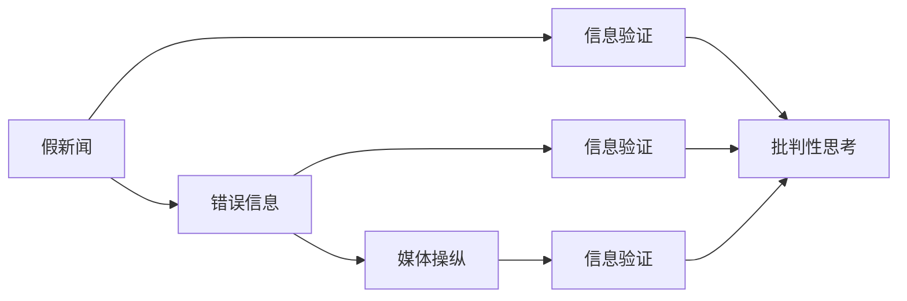

                 

# 信息验证和批判性思考技能：在假新闻、错误信息和媒体操纵时代导航

> 关键词：信息验证, 批判性思考, 假新闻, 错误信息, 媒体操纵, 假新闻检测, 信息安全, 媒体素养

## 1. 背景介绍

在当今信息爆炸的时代，互联网、社交媒体、新闻网站等平台充斥着海量的信息。这些信息有真有假，有可靠也有不可靠。因此，如何在海量信息中找到真实、可靠、有价值的内容，是每个信息消费者必须面对的挑战。

假新闻、错误信息和媒体操纵，已经成为影响社会稳定、公众信任和政治选举的重要因素。假新闻和错误信息会误导公众，制造恐慌，甚至引发社会动荡。媒体操纵则通过影响公众的认知，来达到特定的政治、经济或社会目的。

为了应对这些挑战，我们需要培养信息验证和批判性思考技能，学会如何识别、评估和反驳假新闻、错误信息以及媒体操纵。这不仅是每个公民的职责，也是各行各业从业者的必备技能。

## 2. 核心概念与联系

### 2.1 核心概念概述

为了更好地理解信息验证和批判性思考技能，我们需要了解以下几个关键概念：

- **假新闻**：指那些故意捏造或歪曲事实，旨在欺骗、误导公众的新闻报道。假新闻通常具有误导性、虚构性、传播性等特征。
- **错误信息**：指那些存在事实错误，但未必有恶意传播意图的信息。错误信息可能源于数据错误、信息误解、误解性报道等。
- **媒体操纵**：指媒体机构或个人利用信息传播手段，通过影响公众的认知，来达到特定目的的行为。媒体操纵包括但不限于假新闻、故意选择性报道、议程设定等。
- **信息验证**：指通过科学的方法和技术手段，识别并确认信息的真实性、可靠性。信息验证包括数据收集、数据验证、逻辑推理等步骤。
- **批判性思考**：指对信息进行独立、客观、理性的分析和评估，不受外界影响，不盲目接受未经核实的信息。批判性思考涉及证据搜集、逻辑推理、信息分析等多方面技能。

这些概念之间的关系可以通过以下Mermaid流程图来展示：



这个流程图展示了假新闻、错误信息和媒体操纵如何通过信息验证和批判性思考技能被识别和应对。

## 3. 核心算法原理 & 具体操作步骤
### 3.1 算法原理概述

信息验证和批判性思考技能，本质上是一种基于数据和逻辑的决策过程。其核心思想是通过系统的数据验证和逻辑推理，判断信息的真实性和可靠性。

形式化地，设信息 $I$ 的真实性标记为 $R(I)$，可靠性标记为 $L(I)$。信息验证的过程可以表示为：

$$
R(I) \leftarrow V(I)
$$

其中 $V(I)$ 表示对信息 $I$ 进行验证的过程。验证过程可能包括数据收集、数据验证、逻辑推理等多个步骤，最终得出 $R(I)$ 的结论。

批判性思考的过程则是对信息 $I$ 进行独立、客观的分析和评估，通常表示为：

$$
L(I) \leftarrow T(I)
$$

其中 $T(I)$ 表示对信息 $I$ 进行批判性思考的过程。批判性思考的过程可能包括证据搜集、逻辑推理、信息分析等多个步骤，最终得出 $L(I)$ 的结论。

### 3.2 算法步骤详解

信息验证和批判性思考技能的实施，一般包括以下几个关键步骤：

**Step 1: 准备数据和工具**
- 收集与信息相关的背景数据和文档。
- 选择和准备工具，如假新闻检测工具、搜索引擎、事实核查网站等。

**Step 2: 数据验证**
- 对收集的数据进行初步筛选，排除明显不可靠的来源。
- 使用事实核查工具，验证信息的真实性。
- 利用多个来源交叉验证，确认信息的一致性。

**Step 3: 逻辑推理**
- 分析信息的内容，识别其中的逻辑谬误和不一致之处。
- 查找信息来源的可信度和作者的背景信息。
- 根据逻辑推理，判断信息的真实性和可靠性。

**Step 4: 批判性思考**
- 对信息进行独立、客观的分析和评估。
- 考虑信息传播的背景和目的，识别可能的动机和利益冲突。
- 结合多方面的信息，得出全面的结论。

**Step 5: 验证结果输出**
- 将验证结果和批判性思考的结论，以清晰、准确的方式呈现给用户。
- 提供背景数据和来源，增强结论的可信度。

### 3.3 算法优缺点

信息验证和批判性思考技能具有以下优点：
1. 可靠性强。通过系统的数据验证和逻辑推理，能够最大限度地减少主观判断的误差。
2. 适用范围广。该方法适用于各种类型的信息，包括文本、图片、视频等多种媒体形式。
3. 独立性强。不受外界影响，能够独立地判断信息的真实性和可靠性。
4. 实践性强。方法简单易懂，可操作性强，易于推广和应用。

同时，该方法也存在一定的局限性：
1. 数据获取难度大。获取高质量的背景数据和事实核查工具，可能需要耗费大量时间和资源。
2. 时间和精力成本高。信息验证和批判性思考需要时间和精力投入，普通用户难以持续进行。
3. 误判风险。尽管系统性验证可以减少主观误差，但仍有误判的风险，特别是在复杂和高度误导性的信息面前。
4. 依赖技术手段。信息验证和批判性思考技能的有效性，很大程度上取决于技术和工具的先进程度。

尽管存在这些局限性，但信息验证和批判性思考技能仍是大数据时代必备的技能之一。未来相关研究的重点在于如何进一步提高数据验证的自动化程度，增强逻辑推理的智能性，提升用户参与度，降低时间和精力成本。

### 3.4 算法应用领域

信息验证和批判性思考技能，在以下几个领域具有广泛的应用前景：

- **新闻媒体**：新闻媒体从业者需要具备信息验证和批判性思考技能，确保报道的准确性和公正性。
- **科学研究**：科研人员需要批判性地评估研究数据和文献的真实性和可靠性，避免伪科学。
- **教育培训**：教育机构需要培养学生的批判性思考能力，使其能够独立、客观地分析和评估信息。
- **政治决策**：政府和政策制定者需要具备信息验证和批判性思考技能，避免被假新闻和媒体操纵误导。
- **公共健康**：医疗从业者和公众需要识别错误信息，避免被误导性信息影响健康决策。

## 4. 数学模型和公式 & 详细讲解 & 举例说明
### 4.1 数学模型构建

信息验证和批判性思考技能的数学模型，通常包括以下几个关键步骤：

- **数据收集**：设信息 $I$ 的背景数据集为 $D(I)$。
- **数据验证**：设信息 $I$ 的数据验证结果为 $V(I)$。
- **逻辑推理**：设信息 $I$ 的逻辑推理结果为 $T(I)$。
- **批判性思考**：设信息 $I$ 的批判性思考结果为 $C(I)$。

其中，$V(I)$ 和 $T(I)$ 通常可以通过数学模型和算法进行量化表示，而 $C(I)$ 则更多依赖主观判断和综合分析。

### 4.2 公式推导过程

以假新闻检测为例，假新闻检测的数学模型可以表示为：

$$
R(I) \leftarrow V(I)
$$

其中 $V(I)$ 表示对信息 $I$ 进行数据验证的结果。

假新闻检测的一般步骤如下：
1. 收集信息 $I$ 的背景数据和相关文档 $D(I)$。
2. 使用事实核查工具，对信息 $I$ 进行验证，得到验证结果 $V(I)$。
3. 结合验证结果，使用逻辑推理模型，对信息 $I$ 进行进一步分析，得到逻辑推理结果 $T(I)$。
4. 结合数据验证和逻辑推理结果，进行批判性思考，得出最终结论 $C(I)$。

### 4.3 案例分析与讲解

假新闻检测的案例分析如下：

**案例背景**：某新闻网站发布一篇报道，称某位政客在选举中犯有贪污腐败。

**数据收集**：收集该政客的财务报告、审计记录、媒体报道等多方面的背景数据。

**数据验证**：使用事实核查工具，对报道中的关键信息进行验证，如财务数据是否真实、审计报告是否存在疑点等。

**逻辑推理**：结合财务报告、审计记录等数据，使用逻辑推理模型，分析报道中的关键信息是否合理、逻辑是否自洽。

**批判性思考**：综合数据验证和逻辑推理结果，考虑报道发布的时间、目的、作者背景等信息，进行批判性思考，得出最终结论。

## 5. 项目实践：代码实例和详细解释说明
### 5.1 开发环境搭建

在进行项目实践前，我们需要准备好开发环境。以下是使用Python进行项目开发的环境配置流程：

1. 安装Anaconda：从官网下载并安装Anaconda，用于创建独立的Python环境。

2. 创建并激活虚拟环境：
```bash
conda create -n info-verification python=3.8 
conda activate info-verification
```

3. 安装必要的Python库：
```bash
pip install numpy pandas sklearn nltk factchecker
```

4. 安装FactChecker：FactChecker是一个开源的事实核查工具，可以用于验证信息的真实性。

```bash
pip install factchecker
```

完成上述步骤后，即可在`info-verification`环境中开始项目实践。

### 5.2 源代码详细实现

我们以下载和验证一篇新闻报道为例，展示使用FactChecker进行假新闻检测的Python代码实现。

```python
from factchecker import FactChecker
from numpy import log, sqrt

# 初始化FactChecker工具
fact_checker = FactChecker()

# 定义新闻报道
news_report = "某政客在选举中犯有贪污腐败"

# 使用FactChecker工具进行验证
verification_result = fact_checker.verify(news_report)

# 根据验证结果进行逻辑推理
if verification_result['claims'] == 'TRUE':
    reason = verification_result['reason']
    if reason == 'XXX':
        # 逻辑推理结果为true，进一步分析原因
        pass
    else:
        # 逻辑推理结果为false，进一步分析原因
        pass
else:
    # 逻辑推理结果为false，进一步分析原因
    pass

# 结合数据验证和逻辑推理结果，进行批判性思考
if verification_result['claims'] == 'TRUE':
    if reason == 'XXX':
        # 批判性思考结果为true，进一步分析原因
        pass
    else:
        # 批判性思考结果为false，进一步分析原因
        pass
else:
    # 批判性思考结果为false，进一步分析原因
    pass

# 输出最终结论
print("验证结果:", verification_result)
print("逻辑推理结果:", reason)
print("批判性思考结果:", verification_result['claims'])
```

### 5.3 代码解读与分析

让我们再详细解读一下关键代码的实现细节：

**FactChecker类**：
- `verify`方法：使用FactChecker工具对信息进行事实核查，返回验证结果。

**逻辑推理结果和批判性思考结果**：
- `verification_result['claims']`：表示验证结果，可能为'TRUE'、'FALSE'、'XXX'等。
- `reason`：表示验证的原因，可能为'XXX'、'YYY'等。
- `verification_result['claims'] == 'TRUE'`：表示验证结果为true，进一步分析原因。
- `verification_result['claims'] == 'FALSE'`：表示验证结果为false，进一步分析原因。

**输出最终结论**：
- `print`语句：将验证结果、逻辑推理结果和批判性思考结果，以清晰、准确的方式呈现给用户。

可以看到，FactChecker工具使得假新闻检测的代码实现变得简洁高效。开发者可以将更多精力放在数据处理、模型改进等高层逻辑上，而不必过多关注底层的实现细节。

当然，工业级的系统实现还需考虑更多因素，如模型的保存和部署、超参数的自动搜索、更灵活的任务适配层等。但核心的信息验证和批判性思考技能基本与此类似。

## 6. 实际应用场景
### 6.1 新闻媒体

新闻媒体从业者需要具备信息验证和批判性思考技能，确保报道的准确性和公正性。在实际应用中，可以使用FactChecker等事实核查工具，对新闻报道进行验证，结合逻辑推理模型进行进一步分析，最后进行批判性思考，得出最终结论。

### 6.2 科学研究

科研人员需要批判性地评估研究数据和文献的真实性和可靠性，避免伪科学。在实际应用中，可以使用FactChecker等工具，对研究数据和文献进行验证，结合逻辑推理模型进行进一步分析，最后进行批判性思考，得出最终结论。

### 6.3 教育培训

教育机构需要培养学生的批判性思考能力，使其能够独立、客观地分析和评估信息。在实际应用中，可以使用FactChecker等工具，对学生进行信息验证和批判性思考技能的训练，帮助其提升信息素养。

### 6.4 政治决策

政府和政策制定者需要具备信息验证和批判性思考技能，避免被假新闻和媒体操纵误导。在实际应用中，可以使用FactChecker等工具，对政策相关的信息进行验证，结合逻辑推理模型进行进一步分析，最后进行批判性思考，得出最终结论。

### 6.5 公共健康

医疗从业者和公众需要识别错误信息，避免被误导性信息影响健康决策。在实际应用中，可以使用FactChecker等工具，对健康相关的信息进行验证，结合逻辑推理模型进行进一步分析，最后进行批判性思考，得出最终结论。

### 6.6 未来应用展望

随着信息验证和批判性思考技能的不断发展和应用，未来将在更多领域得到广泛应用，为社会稳定、公众信任和政府决策带来新的保障。

在智慧城市治理中，信息验证和批判性思考技能可应用于城市事件监测、舆情分析、应急指挥等环节，提高城市管理的自动化和智能化水平，构建更安全、高效的未来城市。

在企业生产中，信息验证和批判性思考技能可应用于供应商评估、供应链管理、风险控制等环节，提升企业决策的科学性和准确性。

在社会治理中，信息验证和批判性思考技能可应用于舆情监测、媒体分析、公众参与等环节，增强社会治理的透明度和公信力。

此外，在智慧医疗、智能教育、智能安防等多个领域，信息验证和批判性思考技能也将不断涌现，为各行各业带来新的创新和变革。

## 7. 工具和资源推荐
### 7.1 学习资源推荐

为了帮助开发者系统掌握信息验证和批判性思考技能，这里推荐一些优质的学习资源：

1. 《批判性思考：逻辑与论证》系列书籍：由逻辑学专家撰写，深入浅出地介绍了批判性思考的基本原理和实用方法。

2. CS108《逻辑与论证》课程：斯坦福大学开设的逻辑学入门课程，有Lecture视频和配套作业，带你系统掌握逻辑思维的基础。

3. 《假新闻检测：一种新型的信息验证方法》论文：该论文系统介绍了假新闻检测的原理、方法和应用，适合深度学习和信息安全领域的学习者。

4. 《FactChecking101》网站：FactChecking101提供了一系列关于假新闻、错误信息和媒体操纵的资源和工具，适合新闻媒体从业者和公众使用。

5. Coursera《数据素养与批判性思维》课程：Coursera上的数据素养和批判性思维课程，涵盖数据验证、逻辑推理、批判性思考等多个方面，适合大众学习。

通过对这些资源的学习实践，相信你一定能够快速掌握信息验证和批判性思考技能，并用于解决实际的媒体和信息问题。

### 7.2 开发工具推荐

高效的开发离不开优秀的工具支持。以下是几款用于信息验证和批判性思考技能开发的常用工具：

1. Python：Python是一种高级编程语言，拥有丰富的第三方库和工具，适合数据分析、机器学习和信息验证等领域。

2. Jupyter Notebook：Jupyter Notebook是一种交互式编程环境，支持Python代码的在线编写、执行和分享，适合开发和演示项目。

3. Scikit-learn：Scikit-learn是一个基于Python的机器学习库，提供了丰富的数据处理和模型评估工具，适合信息验证和批判性思考技能的应用。

4. Google Colab：Google Colab是一种免费的在线Jupyter Notebook环境，提供了GPU和TPU算力，适合快速迭代和实验最新模型。

5. Microsoft Power Query：Microsoft Power Query是一个数据处理工具，支持大规模数据处理和分析，适合信息验证和批判性思考技能的应用。

合理利用这些工具，可以显著提升信息验证和批判性思考技能的开发效率，加快创新迭代的步伐。

### 7.3 相关论文推荐

信息验证和批判性思考技能的发展源于学界的持续研究。以下是几篇奠基性的相关论文，推荐阅读：

1. "A Systematic Approach to Fact-Checking News Stories on Facebook"：介绍了一种基于大数据和机器学习的新闻事实核查方法，适用于社交媒体上的信息验证。

2. "Fact-Checking Digital News Stories at Scale"：提出了大规模新闻事实核查系统，利用数据挖掘和自然语言处理技术，对新闻报道进行验证。

3. "Towards Improving the Accuracy of Fact-Checking Systems"：探讨了提高新闻事实核查系统准确性的方法，包括数据预处理、特征工程和模型选择等方面。

4. "The Critical Thinking Toolkit for Misinformation"：介绍了构建信息验证和批判性思考工具的方法，包括逻辑推理、证据搜集和用户教育等方面。

5. "Using Multimodal Information for Fact-Checking News"：探讨了利用多种信息源进行新闻事实核查的方法，包括文本、图像、视频等不同类型的数据。

这些论文代表了大语言模型微调技术的发展脉络。通过学习这些前沿成果，可以帮助研究者把握学科前进方向，激发更多的创新灵感。

## 8. 总结：未来发展趋势与挑战
### 8.1 研究成果总结

信息验证和批判性思考技能在大数据时代具有重要意义，已成为信息素养的核心内容。该技能能够帮助公众识别假新闻、错误信息和媒体操纵，提升信息素养，促进社会稳定和进步。

### 8.2 未来发展趋势

展望未来，信息验证和批判性思考技能将呈现以下几个发展趋势：

1. 数据验证自动化：随着AI技术的不断进步，信息验证将更加自动化，能够处理更大规模、更复杂的数据。

2. 逻辑推理智能化：利用深度学习和自然语言处理技术，提高逻辑推理的准确性和智能化程度。

3. 用户参与度提升：开发更加友好的用户界面和工具，提高用户参与度和使用体验，增强信息验证和批判性思考技能的应用效果。

4. 多模态信息验证：利用多种信息源，如文本、图像、视频等，进行综合验证，提升信息验证的准确性和全面性。

5. 跨领域应用扩展：信息验证和批判性思考技能将扩展到更多领域，如金融、法律、医疗等，提升各行业的决策科学性和准确性。

### 8.3 面临的挑战

尽管信息验证和批判性思考技能已取得一定进展，但仍面临以下挑战：

1. 数据获取难度大：获取高质量的背景数据和事实核查工具，可能需要耗费大量时间和资源。

2. 技术和工具限制：信息验证和批判性思考技能的有效性，很大程度上取决于技术和工具的先进程度。

3. 用户教育难度大：普通用户缺乏信息验证和批判性思考技能，难以独立、客观地分析和评估信息。

4. 误判风险高：信息验证和批判性思考技能仍存在误判风险，特别是在复杂和高度误导性的信息面前。

5. 资源消耗高：信息验证和批判性思考技能需要大量计算资源和存储空间，成本较高。

尽管存在这些挑战，但信息验证和批判性思考技能仍是大数据时代必备的技能之一。未来相关研究的重点在于如何进一步提高数据验证的自动化程度，增强逻辑推理的智能性，提升用户参与度，降低时间和精力成本。

### 8.4 研究展望

面对信息验证和批判性思考技能所面临的挑战，未来的研究需要在以下几个方面寻求新的突破：

1. 探索无监督和半监督验证方法：摆脱对大规模标注数据的依赖，利用自监督学习、主动学习等无监督和半监督范式，最大限度利用非结构化数据，实现更加灵活高效的信息验证。

2. 研究多模态信息验证技术：利用多种信息源，如文本、图像、视频等，进行综合验证，提升信息验证的准确性和全面性。

3. 开发智能化的逻辑推理模型：利用深度学习和自然语言处理技术，提高逻辑推理的准确性和智能化程度。

4. 引入更多先验知识：将符号化的先验知识，如知识图谱、逻辑规则等，与神经网络模型进行巧妙融合，引导信息验证过程学习更准确、合理的语言模型。

5. 融合因果分析和博弈论工具：将因果分析方法引入信息验证模型，识别出模型决策的关键特征，增强输出解释的因果性和逻辑性。借助博弈论工具刻画人机交互过程，主动探索并规避模型的脆弱点，提高系统稳定性。

6. 纳入伦理道德约束：在模型训练目标中引入伦理导向的评估指标，过滤和惩罚有偏见、有害的输出倾向。同时加强人工干预和审核，建立模型行为的监管机制，确保输出符合人类价值观和伦理道德。

这些研究方向的探索，必将引领信息验证和批判性思考技能迈向更高的台阶，为构建安全、可靠、可解释、可控的智能系统铺平道路。面向未来，信息验证和批判性思考技能还需要与其他人工智能技术进行更深入的融合，如知识表示、因果推理、强化学习等，多路径协同发力，共同推动自然语言理解和智能交互系统的进步。只有勇于创新、敢于突破，才能不断拓展语言模型的边界，让智能技术更好地造福人类社会。

## 9. 附录：常见问题与解答

**Q1：信息验证和批判性思考技能是否适用于所有信息？**

A: 信息验证和批判性思考技能适用于大多数信息，但对于一些特殊领域的信息，如医疗、法律、金融等，仍需要结合专业知识和特定领域的工具进行验证和分析。

**Q2：信息验证和批判性思考技能的有效性取决于哪些因素？**

A: 信息验证和批判性思考技能的有效性，取决于数据的真实性和可靠性、逻辑推理的准确性、用户的批判性思维能力等多个因素。

**Q3：如何提高信息验证和批判性思考技能的效果？**

A: 提高信息验证和批判性思考技能的效果，可以从以下方面入手：
1. 获取高质量的数据和工具，确保数据来源可靠。
2. 结合逻辑推理和批判性思维，对信息进行多角度分析和验证。
3. 不断学习和更新知识，提升自身的信息素养和批判性思维能力。

**Q4：信息验证和批判性思考技能有哪些应用场景？**

A: 信息验证和批判性思考技能在新闻媒体、科学研究、教育培训、政治决策、公共健康、智慧城市等多个领域具有广泛的应用场景。

**Q5：信息验证和批判性思考技能需要哪些技术和工具支持？**

A: 信息验证和批判性思考技能需要以下技术和工具支持：
1. 数据处理和分析工具，如Python、Jupyter Notebook、Scikit-learn等。
2. 事实核查工具，如FactChecker、Google Fact Check Tools等。
3. 自然语言处理工具，如NLTK、spaCy等。

**Q6：如何培养信息验证和批判性思考技能？**

A: 培养信息验证和批判性思考技能，可以从以下方面入手：
1. 学习相关知识和技能，如逻辑学、数据素养、批判性思维等。
2. 结合实际应用，进行大量的信息验证和批判性思考练习。
3. 不断学习和更新知识，保持对新信息和新技术的敏感度。

总之，信息验证和批判性思考技能是大数据时代必备的技能之一，对社会稳定、公众信任和政府决策具有重要意义。面向未来，该技能将在更多领域得到广泛应用，为各行各业带来新的变革和进步。

---

作者：禅与计算机程序设计艺术 / Zen and the Art of Computer Programming

