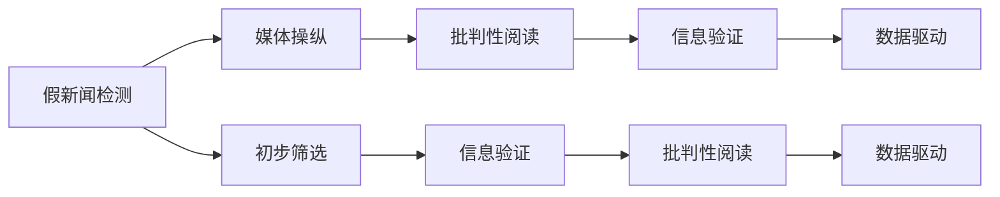

                 

# 信息验证和批判性阅读指南：在假新闻和媒体操纵时代导航

> 关键词：假新闻检测, 媒体操纵, 批判性阅读, 信息验证, 数据驱动

## 1. 背景介绍

在数字化、信息化的时代，信息的获取变得前所未有的便利。互联网、社交媒体、新闻网站等平台上，海量信息如潮水般涌现，但同时也充斥着各种虚假信息、误导性报道和媒体操纵。这种信息泛滥的背后，潜藏着对公众认知的深刻影响，甚至可能导致社会动荡、政治冲突和信任危机。因此，如何有效地识别假新闻、批判性阅读和验证信息的真实性，已成为每个现代公民必须掌握的“基本技能”。

### 1.1 问题由来

假新闻、虚假报道和媒体操纵已经成为困扰全球的信息环境的问题。特别是在政治、经济和社会等敏感领域，虚假信息可能被恶意利用，对公众认知和社会秩序造成严重破坏。例如，某些国家为了操纵公众情绪、干预选举，会故意传播虚假信息。这些信息可能包含虚假数据、断章取义的报道、恶意扭曲的图像和视频等。此外，社交媒体平台上的信息传播往往不受管制，“假新闻”的传播速度和范围惊人，极大地威胁到信息真实性。

### 1.2 问题核心关键点

识别和应对假新闻、虚假报道和媒体操纵，其核心在于：

1. **信息验证**：通过科学的方法和技术，对信息进行交叉验证，确认其真实性和准确性。
2. **批判性阅读**：培养对信息的质疑精神和批判性思维，对信息的来源、内容、逻辑进行深入分析。
3. **数据驱动**：利用数据科学和大数据分析技术，发现和验证信息中的异常和矛盾。

这些问题不仅是媒体机构和信息科技工作者的职责，更是每个公众应当具备的基本素养。因此，本指南将围绕这些核心问题，详细探讨如何通过技术手段和批判性思维，应对假新闻和媒体操纵的挑战。

## 2. 核心概念与联系

### 2.1 核心概念概述

要有效应对假新闻和媒体操纵，首先需要了解以下几个核心概念：

1. **假新闻检测（False News Detection）**：通过算法和模型，识别出虚假新闻或具有误导性的报道。
2. **媒体操纵（Media Manipulation）**：利用技术手段和信息传播策略，操控公众情绪和舆论，影响社会认知和行为。
3. **批判性阅读（Critical Reading）**：对信息进行深入分析和质疑，培养独立思考和判断能力。
4. **信息验证（Information Verification）**：通过多方交叉验证，确认信息的真实性和准确性。
5. **数据驱动（Data-Driven）**：依赖数据科学和大数据分析，发现和验证信息中的异常和矛盾。

这些概念通过以下方式联系在一起：

- **假新闻检测**是信息验证和批判性阅读的基础，通过技术手段对信息进行初步筛选。
- **媒体操纵**与假新闻检测密切相关，但更依赖于对信息传播策略的深入理解。
- **批判性阅读**和**信息验证**相互促进，批判性思维引导信息验证的方法和路径，信息验证则提供批判性阅读的基础。
- **数据驱动**技术为假新闻检测、批判性阅读和信息验证提供了科学的工具和方法。

### 2.2 核心概念原理和架构的 Mermaid 流程图



## 3. 核心算法原理 & 具体操作步骤

### 3.1 算法原理概述

假新闻检测和媒体操纵的识别，主要依赖于以下算法和模型：

1. **自然语言处理（NLP）**：利用语言模型、语义分析和情感分析等技术，识别文本中的异常和矛盾。
2. **图像处理（Image Processing）**：通过图像识别和特征提取，识别出被篡改或虚假的图片和视频。
3. **社交网络分析（Social Network Analysis）**：分析社交媒体上的信息传播模式和用户行为，识别出可能的媒体操纵手段。
4. **深度学习（Deep Learning）**：利用卷积神经网络（CNN）、循环神经网络（RNN）和生成对抗网络（GAN）等模型，学习识别虚假信息的模式。
5. **分布式计算（Distributed Computing）**：利用大规模并行计算，提高信息验证的速度和效率。

这些算法和技术相互配合，构建了一个多层次、多维度的信息验证体系，帮助识别和应对假新闻和媒体操纵。

### 3.2 算法步骤详解

以下是基于深度学习模型的假新闻检测步骤：

1. **数据收集**：收集大量的真实新闻和假新闻数据，用于训练和验证模型。
2. **预处理**：对收集到的文本和图片数据进行清洗、分词、去除停用词等预处理步骤。
3. **特征提取**：利用NLP技术提取文本特征，如TF-IDF、word2vec等，或利用图像处理技术提取图片特征，如卷积特征、局部二值模式等。
4. **模型训练**：使用深度学习模型如CNN、RNN、LSTM、BERT等，对特征进行训练，得到假新闻检测模型。
5. **模型评估**：在测试集上评估模型的准确率、召回率和F1分数等性能指标，调整模型参数。
6. **部署应用**：将训练好的模型部署到实际应用场景，如新闻网站、社交媒体平台等，实时检测虚假信息。

### 3.3 算法优缺点

假新闻检测和媒体操纵识别的深度学习算法，具有以下优点和缺点：

**优点**：

1. **自适应性强**：深度学习模型能够自适应不同的数据分布和特征，提高检测的准确率。
2. **处理能力强**：深度学习模型能够处理大规模、复杂的数据集，实时检测能力较强。
3. **精度高**：深度学习模型在图像识别、自然语言处理等领域，能够达到较高的检测精度。

**缺点**：

1. **数据依赖性高**：深度学习模型需要大量的标注数据进行训练，数据获取和标注成本较高。
2. **模型复杂度高**：深度学习模型结构复杂，训练和推理计算量大，需要高性能计算资源。
3. **解释性差**：深度学习模型是“黑盒”模型，难以解释其内部工作机制和决策逻辑。

### 3.4 算法应用领域

假新闻检测和媒体操纵识别的算法和技术，广泛应用于以下领域：

1. **新闻网站和媒体机构**：用于实时检测和拦截假新闻和虚假报道，保护品牌信誉和公众信任。
2. **社交媒体平台**：用于识别和删除虚假信息、恶意传播内容，维护平台秩序和用户安全。
3. **政府和公共机构**：用于识别和应对政治操纵、社会动员等威胁，保护国家安全和公共利益。
4. **教育机构**：用于培养学生的批判性思维和信息素养，提高社会的信息素质。
5. **公共健康领域**：用于识别和应对虚假健康信息，保护公众健康和安全。

## 4. 数学模型和公式 & 详细讲解 & 举例说明

### 4.1 数学模型构建

假新闻检测和媒体操纵识别主要依赖于以下数学模型：

1. **卷积神经网络（CNN）**：用于图像处理和特征提取，可以自动学习图像中的局部特征。
2. **循环神经网络（RNN）**：用于处理序列数据，如自然语言处理中的文本序列。
3. **长短期记忆网络（LSTM）**：用于处理长序列数据，能够记忆和提取长期依赖关系。
4. **BERT（Bidirectional Encoder Representations from Transformers）**：用于自然语言处理中的预训练和微调，能够学习语义和语法信息。

### 4.2 公式推导过程

以卷积神经网络（CNN）为例，其基本公式为：

$$
y = h(x; W, b) = \sigma(W \cdot x + b)
$$

其中，$h(x; W, b)$表示网络输出，$\sigma$表示激活函数，$x$表示输入数据，$W$表示权重矩阵，$b$表示偏置向量。

对于图像处理，CNN通过卷积层、池化层和全连接层，提取和处理图像特征。卷积层的公式为：

$$
f_k = \frac{1}{|F_k|} \sum_{(x,y) \in F_k} x_k * w_k
$$

其中，$f_k$表示卷积核输出，$x_k$表示输入数据，$w_k$表示卷积核权重。

### 4.3 案例分析与讲解

以CNN用于假新闻检测为例，其基本流程为：

1. **图像预处理**：将假新闻图片进行归一化、裁剪和缩放等预处理。
2. **卷积层**：通过卷积操作提取图片特征，形成卷积核输出。
3. **池化层**：对卷积核输出进行池化操作，保留重要特征信息。
4. **全连接层**：将池化层的输出进行全连接，得到分类结果。
5. **softmax层**：对分类结果进行softmax操作，得到每个类别的概率分布。
6. **交叉熵损失函数**：计算预测结果与真实标签的交叉熵损失，反向传播更新模型参数。

## 5. 项目实践：代码实例和详细解释说明

### 5.1 开发环境搭建

为了进行假新闻检测的实践，需要以下开发环境：

1. **Python**：作为主要编程语言，Python生态系统丰富，适合深度学习和数据分析。
2. **TensorFlow或PyTorch**：两个流行的深度学习框架，支持CNN、RNN、LSTM等模型。
3. **Keras**：高层次的深度学习API，便于快速搭建和训练模型。
4. **Pandas**：用于数据处理和分析，适合处理大规模数据集。
5. **Scikit-learn**：用于机器学习模型评估和优化，支持多种分类和回归算法。
6. **Jupyter Notebook**：轻量级的交互式开发环境，便于调试和验证模型。

### 5.2 源代码详细实现

以下是一个使用TensorFlow和Keras框架，实现假新闻检测的代码示例：

```python
import tensorflow as tf
from tensorflow.keras import layers
from tensorflow.keras.preprocessing.image import ImageDataGenerator

# 加载数据集
train_data = ImageDataGenerator(rescale=1./255)
train_generator = train_data.flow_from_directory(
    'train_directory',
    target_size=(224, 224),
    batch_size=32,
    class_mode='binary')

# 定义CNN模型
model = tf.keras.Sequential([
    layers.Conv2D(32, (3, 3), activation='relu', input_shape=(224, 224, 3)),
    layers.MaxPooling2D((2, 2)),
    layers.Conv2D(64, (3, 3), activation='relu'),
    layers.MaxPooling2D((2, 2)),
    layers.Conv2D(128, (3, 3), activation='relu'),
    layers.MaxPooling2D((2, 2)),
    layers.Flatten(),
    layers.Dense(256, activation='relu'),
    layers.Dense(1, activation='sigmoid')
])

# 编译模型
model.compile(optimizer='adam',
              loss='binary_crossentropy',
              metrics=['accuracy'])

# 训练模型
model.fit(train_generator, epochs=10, validation_data=val_generator)

# 评估模型
test_generator = ImageDataGenerator(rescale=1./255)
test_generator = test_generator.flow_from_directory(
    'test_directory',
    target_size=(224, 224),
    batch_size=32,
    class_mode='binary')
model.evaluate(test_generator)
```

### 5.3 代码解读与分析

上述代码实现了一个基于CNN的假新闻检测模型，其主要步骤如下：

1. **数据加载**：使用ImageDataGenerator加载训练和测试数据集，进行数据预处理和归一化。
2. **模型定义**：定义包含卷积层、池化层和全连接层的CNN模型结构。
3. **模型编译**：使用Adam优化器和二分类交叉熵损失函数，编译模型。
4. **模型训练**：在训练数据集上训练模型，记录训练过程和验证结果。
5. **模型评估**：在测试数据集上评估模型性能，输出准确率和损失函数。

## 6. 实际应用场景

### 6.1 假新闻检测

假新闻检测是假新闻和媒体操纵识别中最关键的一环，其应用场景包括：

1. **新闻网站和媒体机构**：实时检测和拦截假新闻和虚假报道，保护品牌信誉和公众信任。
2. **社交媒体平台**：识别和删除虚假信息、恶意传播内容，维护平台秩序和用户安全。
3. **政府和公共机构**：识别和应对政治操纵、社会动员等威胁，保护国家安全和公共利益。

### 6.2 媒体操纵识别

媒体操纵识别是指识别出媒体机构或个人故意制造的虚假信息、断章取义的报道和恶意传播的策略。其应用场景包括：

1. **政治选举**：识别出政治广告中的虚假信息和误导性报道，保护选举公正。
2. **公共健康**：识别出虚假健康信息，保护公众健康和安全。
3. **社交媒体**：识别出媒体操纵策略，如虚假新闻和信息扩散，维护平台秩序。

### 6.3 数据驱动信息验证

数据驱动的信息验证是指利用数据科学和大数据分析技术，发现和验证信息中的异常和矛盾。其应用场景包括：

1. **新闻机构**：利用数据分析技术，验证报道的真实性和准确性。
2. **研究机构**：利用大数据分析技术，验证研究结果的可靠性。
3. **政府机构**：利用数据挖掘技术，验证政策执行和效果。

## 7. 工具和资源推荐

### 7.1 学习资源推荐

为了深入学习和掌握假新闻和媒体操纵识别的技术和方法，推荐以下学习资源：

1. **《深度学习》书籍**：由Ian Goodfellow、Yoshua Bengio和Aaron Courville合著，系统介绍了深度学习的基本概念和算法。
2. **《自然语言处理综论》书籍**：由Daniel Jurafsky和James H. Martin合著，全面覆盖了自然语言处理的基本理论和应用。
3. **Coursera和edX**：提供多种深度学习和自然语言处理的在线课程，适合不同层次的学习者。
4. **Kaggle**：数据科学竞赛平台，提供大量真实世界的数据集和挑战，适合实战练习。
5. **GitHub**：代码托管平台，提供大量开源假新闻检测和媒体操纵识别的项目和资源，适合参考和复现。

### 7.2 开发工具推荐

为了进行假新闻和媒体操纵的识别和验证，推荐以下开发工具：

1. **TensorFlow**：由Google开发的深度学习框架，支持分布式计算和GPU加速。
2. **PyTorch**：由Facebook开发的深度学习框架，灵活性强，适合研究和实验。
3. **Keras**：高层次的深度学习API，易于使用和调试。
4. **Jupyter Notebook**：交互式开发环境，适合快速迭代和验证模型。
5. **Gatshick-learn**：用于机器学习模型评估和优化的库，支持多种分类和回归算法。

### 7.3 相关论文推荐

为了深入了解假新闻和媒体操纵识别的最新进展，推荐以下相关论文：

1. **Fake News Detection: A Survey**：一篇系统综述，介绍了假新闻检测的主要技术和方法。
2. **Media Manipulation: A Survey**：一篇综述论文，讨论了媒体操纵的主要手段和策略。
3. **Critical Reading and Information Verification**：一篇关于批判性阅读和信息验证的论文，探讨了提高信息素养的有效方法。
4. **Using Deep Learning for Fake News Detection**：一篇使用深度学习技术进行假新闻检测的论文。
5. **Data-Driven Approach for Media Manipulation Detection**：一篇数据驱动的媒体操纵识别方法论文。

## 8. 总结：未来发展趋势与挑战

### 8.1 研究成果总结

假新闻和媒体操纵识别的研究已经取得了显著进展，主要成果包括：

1. **深度学习模型**：基于CNN、RNN、LSTM等深度学习模型，实现了高精度的假新闻检测和媒体操纵识别。
2. **自然语言处理**：利用NLP技术，提取和分析文本中的语义和语法信息，提高了信息验证的准确性。
3. **数据驱动方法**：利用大数据分析和机器学习技术，发现了信息中的异常和矛盾，提高了识别能力。

### 8.2 未来发展趋势

假新闻和媒体操纵识别的未来发展趋势包括：

1. **模型集成**：将多种模型和技术进行集成，构建更加复杂和鲁棒的信息验证体系。
2. **多模态融合**：结合图像、视频和文本等多种数据类型，提高信息验证的全面性和准确性。
3. **实时检测**：利用分布式计算和GPU加速，实现实时检测和分析，提高响应速度。
4. **联邦学习**：利用联邦学习技术，在保护隐私的前提下，共享模型参数和知识。
5. **跨领域应用**：将假新闻和媒体操纵识别技术，应用于更多领域，如政治、金融、公共健康等。

### 8.3 面临的挑战

假新闻和媒体操纵识别的研究仍面临诸多挑战，主要包括以下几点：

1. **数据获取和标注**：获取大量高质量的标注数据，是假新闻检测和媒体操纵识别的基础，但数据获取和标注成本较高。
2. **模型复杂度**：深度学习模型结构复杂，训练和推理计算量大，需要高性能计算资源。
3. **数据隐私**：在数据驱动方法中，如何保护用户隐私和数据安全，是一个重要的问题。
4. **解释性**：深度学习模型是“黑盒”模型，难以解释其内部工作机制和决策逻辑。
5. **跨领域泛化**：将假新闻和媒体操纵识别技术，应用于不同领域时，如何保证泛化能力。

### 8.4 研究展望

未来假新闻和媒体操纵识别的研究方向包括：

1. **无监督学习和半监督学习**：利用无监督学习和半监督学习技术，降低数据依赖性，提高泛化能力。
2. **多任务学习**：结合假新闻检测和媒体操纵识别，实现多任务联合学习，提高模型效率和效果。
3. **对抗性学习**：利用对抗性学习技术，提高模型鲁棒性和泛化能力，防范攻击和对抗样本。
4. **可解释性模型**：开发可解释性强的模型，增强模型的透明性和可信度。
5. **跨领域应用研究**：将假新闻和媒体操纵识别技术，应用于更多领域，如医疗、金融、司法等。

## 9. 附录：常见问题与解答

**Q1：假新闻和媒体操纵识别的核心是什么？**

A: 假新闻和媒体操纵识别的核心是信息验证和批判性阅读。信息验证通过多种技术和方法，对信息进行交叉验证，确认其真实性和准确性。批判性阅读则培养对信息的质疑精神和批判性思维，对信息的来源、内容、逻辑进行深入分析。

**Q2：如何进行假新闻和媒体操纵识别？**

A: 假新闻和媒体操纵识别主要依赖于深度学习模型、自然语言处理技术和数据科学方法。具体步骤如下：
1. 数据收集：收集大量的真实新闻和假新闻数据，用于训练和验证模型。
2. 预处理：对收集到的文本和图片数据进行清洗、分词、去除停用词等预处理步骤。
3. 特征提取：利用NLP技术提取文本特征，如TF-IDF、word2vec等，或利用图像处理技术提取图片特征，如卷积特征、局部二值模式等。
4. 模型训练：使用深度学习模型如CNN、RNN、LSTM等，对特征进行训练，得到假新闻检测模型。
5. 模型评估：在测试集上评估模型的准确率、召回率和F1分数等性能指标，调整模型参数。
6. 部署应用：将训练好的模型部署到实际应用场景，如新闻网站、社交媒体平台等，实时检测虚假信息。

**Q3：如何提升假新闻和媒体操纵识别的效果？**

A: 提升假新闻和媒体操纵识别的效果，主要从以下几个方面入手：
1. 数据质量：获取高质量的标注数据，减少数据噪声和偏差。
2. 模型优化：使用多种模型和技术，如CNN、RNN、LSTM等，提高模型的鲁棒性和泛化能力。
3. 数据增强：使用数据增强技术，如回译、近义替换等，丰富训练集的多样性。
4. 对抗训练：引入对抗样本，提高模型的鲁棒性和泛化能力。
5. 跨领域泛化：将假新闻和媒体操纵识别技术，应用于更多领域，提高模型的泛化能力。

**Q4：如何应对假新闻和媒体操纵的挑战？**

A: 应对假新闻和媒体操纵的挑战，主要从以下几个方面入手：
1. 数据获取和标注：利用无监督学习和半监督学习技术，降低数据依赖性，提高泛化能力。
2. 模型复杂度：利用分布式计算和GPU加速，提高模型的训练和推理速度。
3. 数据隐私：在数据驱动方法中，采用差分隐私等技术，保护用户隐私和数据安全。
4. 解释性：开发可解释性强的模型，增强模型的透明性和可信度。
5. 跨领域应用：将假新闻和媒体操纵识别技术，应用于更多领域，如医疗、金融、司法等。

