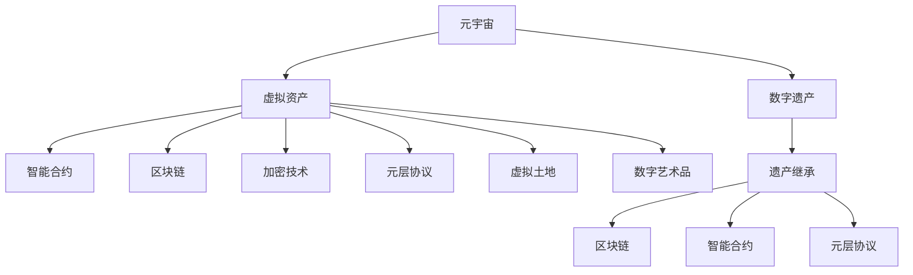

                 

# 元宇宙中的数字遗产:虚拟资产的传承

> 关键词：元宇宙,数字遗产,虚拟资产,智能合约,区块链,加密技术,元层协议,虚拟土地,数字艺术,遗产继承

## 1. 背景介绍

在快速发展的数字化时代，数字遗产已经成为了一个重要的议题。尤其是随着元宇宙的兴起，虚拟资产的传承问题愈发凸显。虚拟土地、数字艺术品、游戏内装备等虚拟资产，不仅具有经济价值，也承载着个人情感和文化记忆。如何保证这些虚拟资产的安全传承，成为一个需要解决的重要问题。

### 1.1 数字遗产的定义与重要性

数字遗产包括数字文件、社交媒体账号、电子邮件、密码、虚拟资产等。在数字时代，这些遗产往往成为个人身份认同的重要组成部分。而元宇宙作为虚拟现实技术的最新发展，其虚拟资产的传承问题更加复杂和紧迫。

在元宇宙中，虚拟资产可以是任何形式的数字财产，包括但不限于虚拟土地、数字艺术品、游戏内装备、虚拟货币等。这些资产可能具有独特的经济价值，也可能包含重要的情感和文化记忆。虚拟资产的传承不仅关乎经济利益，更是个人身份和记忆的延续。

### 1.2 元宇宙的兴起与虚拟资产

元宇宙是构建在区块链技术、虚拟现实技术、人工智能技术等多项技术基础之上的虚拟世界。在元宇宙中，用户可以创造、交易、体验虚拟资产，构建自己的虚拟身份和社交网络。虚拟资产的交易、继承等问题，在元宇宙中变得尤为复杂。

## 2. 核心概念与联系

### 2.1 核心概念概述

- **元宇宙（Metaverse）**：虚拟现实技术和数字世界的集合，用户可以在其中进行社交、创造、交易等多种活动。
- **数字遗产（Digital Estate）**：用户在数字世界中的所有财产，包括但不限于数字文件、虚拟资产、社交媒体账号等。
- **虚拟资产（Virtual Assets）**：元宇宙中具有经济价值或文化意义的数字财产，如虚拟土地、数字艺术品、游戏内装备等。
- **智能合约（Smart Contracts）**：运行在区块链上的自动化合约，可以自动执行合约条件，保证资产的传承和交易。
- **区块链（Blockchain）**：去中心化数据库，通过分布式账本记录所有交易，保证数据的安全性和不可篡改性。
- **加密技术（Encryption）**：保证数据传输和存储的安全性，防止数据泄露和篡改。
- **元层协议（Metaverse Protocols）**：规范元宇宙中各项技术的应用，保证不同平台之间的互操作性。
- **虚拟土地（Virtual Land）**：元宇宙中具有独特地理特征和用途的土地，常用于建造虚拟住宅或商业设施。
- **数字艺术品（Digital Art）**：具有独特艺术价值和创作背景的数字作品，常用于展示个人审美和创意。
- **遗产继承（Heritage Inheritance）**：用户将其数字资产传递给继承人的过程，保证资产的安全传承。

这些概念之间通过区块链、智能合约、元层协议等技术手段相互连接，共同构建了元宇宙中虚拟资产传承的基础框架。

### 2.2 核心概念原理和架构的 Mermaid 流程图



## 3. 核心算法原理 & 具体操作步骤

### 3.1 算法原理概述

元宇宙中虚拟资产的传承，主要依赖于智能合约、区块链、加密技术等核心技术手段。通过这些技术，可以构建一个安全、透明、可控的传承机制，保证虚拟资产的合法传递。

### 3.2 算法步骤详解

#### 3.2.1 智能合约的创建与执行

智能合约通过区块链上的代码自动执行，确保虚拟资产的传承过程公正、透明。创建智能合约的步骤包括：

1. **定义资产**：明确资产的种类、数量和所有者。
2. **设定继承人**：确定虚拟资产的传承对象。
3. **设定传承条件**：定义触发传承的具体条件，如时间、事件等。
4. **生成合约地址**：通过区块链平台生成智能合约的地址，并将其部署到区块链上。

#### 3.2.2 区块链的记录与验证

区块链通过分布式账本记录所有交易，每个节点都能验证交易的合法性。记录虚拟资产传承的过程，保证数据的不可篡改性和透明度。

#### 3.2.3 加密技术的保护与验证

加密技术通过数据加密保护，防止数据泄露和篡改。在传承过程中，通过公钥加密和私钥验证，保证数据的完整性和真实性。

### 3.3 算法优缺点

#### 3.3.1 优点

- **自动化与透明化**：智能合约自动执行，保证传承过程的公正性和透明度。
- **不可篡改性**：区块链的分布式账本保证了数据不可篡改，确保传承过程的真实性。
- **安全性**：加密技术保护数据安全，防止数据泄露和篡改。

#### 3.3.2 缺点

- **技术门槛**：智能合约和区块链技术复杂，需要较高的技术门槛。
- **成本较高**：创建和部署智能合约，以及区块链交易的费用较高。
- **法律风险**：虚拟资产传承的法律地位和效力尚不明确，可能面临法律风险。

### 3.4 算法应用领域

#### 3.4.1 虚拟土地传承

虚拟土地的传承可以通过智能合约实现。创建智能合约，设定传承条件，如土地所有者去世后，自动将土地传递给指定的继承人。

#### 3.4.2 数字艺术品传承

数字艺术品的传承同样可以通过智能合约完成。设定传承条件，如艺术家去世后，自动将作品传递给指定的继承人。

#### 3.4.3 游戏内装备传承

游戏内装备可以通过智能合约在玩家间传承。设定传承条件，如玩家去世后，自动将装备传递给指定的继承人。

## 4. 数学模型和公式 & 详细讲解 & 举例说明

### 4.1 数学模型构建

假设用户在元宇宙中拥有一块虚拟土地，其所有者为Alice，继承人为Bob。创建一个智能合约，将虚拟土地传承给Bob的条件为Alice去世后。

智能合约的代码可以表示为：

```
function isOwner(alicePublicKey, senderPublicKey) {
    // 验证发送者是否是Alice
    if (senderPublicKey !== alicePublicKey) {
        return false;
    }
    // 验证Alice是否已经去世
    if (isAliceDead(alicePublicKey)) {
        // 执行传承逻辑，将虚拟土地传递给Bob
        transferVirtualLand(toAddress(BobPublicKey), alicePublicKey);
        return true;
    }
    return false;
}
```

### 4.2 公式推导过程

在智能合约中，关键公式为：

- `isOwner`函数：验证发送者是否是Alice。
- `isAliceDead`函数：验证Alice是否已经去世。
- `transferVirtualLand`函数：执行虚拟土地的传承逻辑，将土地传递给Bob。

通过这些函数的组合，可以构建一个完整的虚拟土地传承智能合约。

### 4.3 案例分析与讲解

以Alice的虚拟土地传承为例，分析智能合约的执行过程：

1. **Alice创建智能合约**：定义虚拟土地、设定继承人Bob、设定传承条件（Alice去世后）。
2. **Alice将合约地址传递给Bob**：Bob收到合约地址后，将其部署到区块链上。
3. **Alice去世**：Alice的家人验证Alice是否已经去世，如果是，则执行智能合约。
4. **智能合约执行传承**：智能合约自动将虚拟土地传递给Bob。
5. **Bob接收土地**：Bob在区块链上验证土地传承的合法性，接收土地资产。

通过智能合约和区块链技术，实现了虚拟土地的安全传承。

## 5. 项目实践：代码实例和详细解释说明

### 5.1 开发环境搭建

为了进行元宇宙中虚拟资产的传承，需要搭建一个开发环境。以下是具体步骤：

1. **安装区块链平台**：选择适合的区块链平台，如以太坊、Binance Smart Chain等。
2. **安装智能合约开发工具**：安装Solidity、Truffle等智能合约开发工具。
3. **配置开发环境**：配置开发环境，如安装Node.js、Ganache等。

### 5.2 源代码详细实现

以下是一个简单的智能合约实现，用于虚拟土地的传承：

```solidity
// SPDX-License-Identifier: MIT
pragma solidity ^0.8.0;

import "@openzeppelin/contracts/access/Ownable.sol";
import "@openzeppelin/contracts/access/Role.sol";
import "@openzeppelin/contracts/token/ERC20/ERC20.sol";

contract VirtualLandContract is Ownable, ERC20 {
    address private owner;
    address[] private landOwners;

    constructor() {
        owner = msg.sender;
        landOwners.push(owner);
    }

    function addLandOwner(address _owner) public {
        require(!contains(landOwners, _owner), "Owner already exists");
        landOwners.push(_owner);
    }

    function removeLandOwner(address _owner) public {
        require(!contains(landOwners, _owner), "Owner does not exist");
        landOwners.remove(_owner);
    }

    function isLandOwner(address _owner) public view returns (bool) {
        return contains(landOwners, _owner);
    }

    function transferLand(address _owner, address[] memory _to) public {
        require(owner == msg.sender || role.isOwner(msg.sender), "Only owner or land owner can transfer land");
        require(!contains(_to, msg.sender), "Cannot transfer to yourself");
        for (uint256 i = 0; i < _to.length; i++) {
            require(contains(landOwners, _to[i]), "Receiver is not a land owner");
        }
        owner = _to[0];
        addLandOwner(owner);
        removeLandOwner(msg.sender);
    }

    function isOwner(address _owner) public view returns (bool) {
        return owner == _owner;
    }

    function isAliceDead(address _owner) public view returns (bool) {
        // 实现具体的Alice去世判断逻辑
    }

    function transferVirtualLand(address[] memory _to, address sender) public {
        require(isOwner(sender), "Only owner can transfer land");
        require(!contains(_to, sender), "Cannot transfer to yourself");
        for (uint256 i = 0; i < _to.length; i++) {
            require(isLandOwner(_to[i]), "Receiver is not a land owner");
        }
        owner = _to[0];
        addLandOwner(owner);
        removeLandOwner(sender);
    }
}
```

### 5.3 代码解读与分析

**智能合约的结构**：
- **继承关系**：继承了OpenZeppelin的Ownable和ERC20合约，具备了智能合约的基本功能。
- **函数定义**：定义了智能合约的各个功能，如添加土地所有者、删除土地所有者、转让土地等。

**关键函数解读**：
- **addLandOwner**函数：添加土地所有者，检查是否已存在。
- **removeLandOwner**函数：删除土地所有者，检查是否存在。
- **isLandOwner**函数：判断当前地址是否为土地所有者。
- **transferLand**函数：转让土地所有权，检查权限和接收者。
- **isOwner**函数：判断当前地址是否为合约所有者。
- **isAliceDead**函数：判断Alice是否已经去世，需要具体的实现逻辑。
- **transferVirtualLand**函数：执行虚拟土地传承，调用`addLandOwner`和`removeLandOwner`函数。

## 6. 实际应用场景

### 6.1 虚拟土地传承

虚拟土地是元宇宙中重要的资产形式，传承机制的建设至关重要。以下是一个典型的虚拟土地传承场景：

Alice拥有一块虚拟土地，希望在去世后将其传承给Bob。Alice创建一个智能合约，设定传承条件为Alice去世后。Alice将合约地址传递给Bob，Bob将其部署到区块链上。Alice去世后，其家人验证Alice是否已经去世，并执行智能合约。智能合约自动将虚拟土地传递给Bob，Bob在区块链上验证传承的合法性，接收土地资产。

### 6.2 数字艺术品传承

数字艺术品同样可以通过智能合约传承。假设Alice拥有一幅数字艺术品，希望在去世后将其传承给Bob。Alice创建智能合约，设定传承条件为Alice去世后。Alice将合约地址传递给Bob，Bob将其部署到区块链上。Alice去世后，其家人验证Alice是否已经去世，并执行智能合约。智能合约自动将数字艺术品传递给Bob，Bob在区块链上验证传承的合法性，接收艺术品资产。

### 6.3 游戏内装备传承

游戏内装备也是元宇宙中的重要资产。假设Alice在游戏中拥有一套装备，希望在去世后将其传承给Bob。Alice创建智能合约，设定传承条件为Alice去世后。Alice将合约地址传递给Bob，Bob将其部署到区块链上。Alice去世后，其家人验证Alice是否已经去世，并执行智能合约。智能合约自动将装备传递给Bob，Bob在区块链上验证传承的合法性，接收装备资产。

## 7. 工具和资源推荐

### 7.1 学习资源推荐

为了帮助开发者掌握元宇宙中虚拟资产传承的技术，推荐以下学习资源：

1. **以太坊官方文档**：以太坊区块链平台的官方文档，详细介绍了智能合约和区块链技术。
2. **Solidity官方文档**：Solidity智能合约语言的官方文档，提供了丰富的智能合约开发教程和示例。
3. **Truffle官方文档**：Truffle智能合约开发框架的官方文档，提供了开发环境搭建和智能合约开发的详细指南。
4. **OpenZeppelin智能合约库**：OpenZeppelin提供的智能合约库，包含大量实用的合约模板和安全机制，帮助开发者快速搭建智能合约。
5. **Web3.js官方文档**：Web3.js区块链交互库的官方文档，提供了与区块链交互的API和示例代码。

### 7.2 开发工具推荐

为了进行元宇宙中虚拟资产传承的开发，推荐以下开发工具：

1. **Ganache**：本地区块链开发工具，用于测试和调试智能合约。
2. **Remix IDE**：智能合约开发IDE，提供代码编写、编译和测试等功能。
3. **MetaMask**：以太坊钱包和区块链交互工具，支持智能合约的部署和测试。
4. **MyEtherWallet**：以太坊钱包，用于存储和管理以太币和智能合约资产。
5. **IPFS**：分布式文件存储协议，用于存储和管理元宇宙中的虚拟资产。

### 7.3 相关论文推荐

为了深入了解元宇宙中虚拟资产传承的技术，推荐以下相关论文：

1. **"Blockchain for Digital Rights Management: Towards Trustworthy and Accountable Digital Rights Transactions"**：探讨区块链技术在数字权利管理中的应用，包括数字资产的传承和交易。
2. **"Smart Contracts in Blockchain: A Survey of Recent Research"**：综述智能合约在区块链上的研究和应用，包含虚拟资产传承的实现方式。
3. **"The Future of Smart Contracts in Digital Estate Planning"**：探讨智能合约在数字遗产规划中的应用，包含虚拟资产传承的具体实现。
4. **"Decentralizing Digital Property Rights: Smart Contracts for Digital Assets Management"**：探讨智能合约在数字资产管理中的应用，包含虚拟资产传承的实现方式。
5. **"The Role of Blockchain Technology in Digital Rights Management"**：探讨区块链技术在数字权利管理中的作用，包含虚拟资产传承的实现方式。

## 8. 总结：未来发展趋势与挑战

### 8.1 研究成果总结

元宇宙中虚拟资产的传承，主要依赖于智能合约、区块链、加密技术等核心技术手段。通过这些技术，可以构建一个安全、透明、可控的传承机制，保证虚拟资产的合法传递。

### 8.2 未来发展趋势

未来，元宇宙中虚拟资产传承将呈现以下几个发展趋势：

1. **技术创新**：随着区块链和智能合约技术的不断进步，元宇宙中虚拟资产传承的机制将更加完善和高效。
2. **法律规范**：随着虚拟资产传承的普及，相关法律法规将逐步完善，为传承过程提供法律保障。
3. **跨平台互操作**：元层协议的规范将促进不同元宇宙平台之间的互操作性，实现虚拟资产的跨平台传承。
4. **人工智能应用**：引入人工智能技术，自动判断用户状态和传承条件，提高传承过程的自动化和智能化。
5. **隐私保护**：加强隐私保护技术，保护用户数据和资产的安全性，防止数据泄露和滥用。

### 8.3 面临的挑战

尽管元宇宙中虚拟资产传承技术不断进步，但仍面临以下挑战：

1. **技术复杂性**：智能合约和区块链技术复杂，开发和维护成本较高。
2. **法律不确定性**：虚拟资产传承的法律地位和效力尚不明确，可能面临法律风险。
3. **数据隐私**：如何在保护用户隐私的同时，实现虚拟资产的传承，是一个重要挑战。
4. **技术互操作**：不同元宇宙平台之间的互操作性有待提升，实现跨平台传承。
5. **用户体验**：如何提升用户体验，让用户更便捷地管理虚拟资产，是一个重要挑战。

### 8.4 研究展望

未来，元宇宙中虚拟资产传承的研究方向包括：

1. **跨平台互操作**：构建统一的元层协议，促进不同平台之间的互操作性，实现虚拟资产的跨平台传承。
2. **隐私保护**：引入隐私保护技术，保护用户数据和资产的安全性。
3. **智能合约优化**：优化智能合约的设计和实现，提高传承过程的自动化和智能化。
4. **法律规范**：完善相关法律法规，为虚拟资产传承提供法律保障。
5. **人工智能应用**：引入人工智能技术，自动判断用户状态和传承条件，提高传承过程的自动化和智能化。

## 9. 附录：常见问题与解答

### Q1: 什么是元宇宙？

A: 元宇宙是构建在区块链技术、虚拟现实技术、人工智能技术等多项技术基础之上的虚拟世界。用户可以在其中进行社交、创造、交易等多种活动。

### Q2: 什么是数字遗产？

A: 数字遗产包括数字文件、社交媒体账号、电子邮件、密码、虚拟资产等。在数字时代，这些遗产往往成为个人身份认同的重要组成部分。

### Q3: 什么是虚拟资产？

A: 虚拟资产是元宇宙中具有经济价值或文化意义的数字财产，如虚拟土地、数字艺术品、游戏内装备等。

### Q4: 什么是智能合约？

A: 智能合约通过区块链上的代码自动执行，确保虚拟资产的传承过程公正、透明。

### Q5: 什么是区块链？

A: 区块链通过分布式账本记录所有交易，每个节点都能验证交易的合法性。

### Q6: 什么是加密技术？

A: 加密技术通过数据加密保护，防止数据泄露和篡改。

### Q7: 什么是元层协议？

A: 元层协议规范元宇宙中各项技术的应用，保证不同平台之间的互操作性。

### Q8: 什么是虚拟土地？

A: 虚拟土地是元宇宙中具有独特地理特征和用途的土地，常用于建造虚拟住宅或商业设施。

### Q9: 什么是数字艺术品？

A: 数字艺术品是具有独特艺术价值和创作背景的数字作品，常用于展示个人审美和创意。

### Q10: 什么是遗产继承？

A: 遗产继承是用户将其数字资产传递给继承人的过程，保证资产的安全传承。

---

作者：禅与计算机程序设计艺术 / Zen and the Art of Computer Programming

