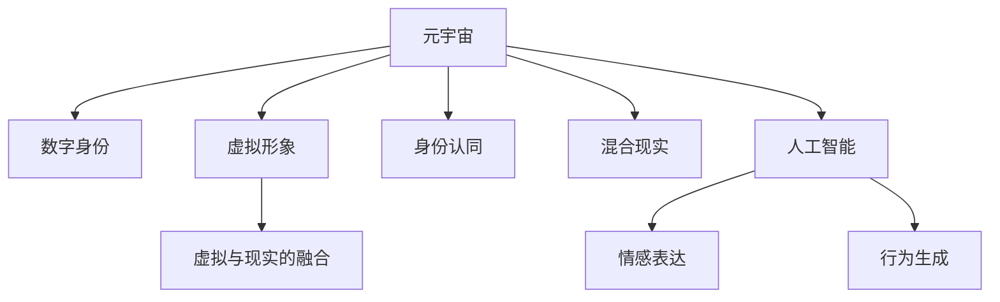

                 

# 元宇宙中的身份认同:虚实自我的融合

> 关键词：元宇宙,身份认同,虚实融合,数字身份,人工智能,混合现实,虚拟形象

## 1. 背景介绍

随着虚拟现实(VR)、增强现实(AR)、混合现实(MR)技术的快速发展和成熟，元宇宙(Metaverse)这一概念应运而生。它不仅代表着一个全新的社交虚拟空间，还承载了人类对于虚拟与现实深度融合的无限想象。在这样的背景下，如何构建一个让人们能够自由表达、自由交互，同时又能感受到真实存在感的虚拟世界，成为了一个亟待解决的课题。其中，元宇宙中的身份认同问题，更是引发了广泛关注。

### 1.1 问题由来

在传统的虚拟空间中，用户的身份认同问题往往通过虚拟角色的名称、头像等进行简单的表示，缺乏更深层次的情感连接和个性表达。而在元宇宙中，用户不仅需要外在的虚拟形象，更需要内在的自我认同，以便在虚拟世界中建立和维持社交关系，参与各类活动。这就要求我们重新审视虚拟身份的构建方式，使其更加丰富和个性化。

### 1.2 问题核心关键点

元宇宙中的身份认同问题，主要包括以下几个核心关键点：

1. **跨平台兼容性**：用户在不同平台间的虚拟身份需要无缝衔接，保证一致性。
2. **虚拟与现实的融合**：虚拟角色和现实中的自我形象之间需要建立深度关联，以便实现虚实映射。
3. **情感表达与交互**：虚拟角色需要具备与真人相似的情感反应和交互能力，提高沉浸感。
4. **个性化与定制化**：虚拟身份需要允许用户自由定制和修改，满足多样化的需求。
5. **安全性与隐私保护**：在元宇宙中，用户的身份信息可能面临被盗用、滥用等风险，需要有效的安全机制和隐私保护措施。

## 2. 核心概念与联系

### 2.1 核心概念概述

为更好地理解元宇宙中身份认同的构建，本节将介绍几个密切相关的核心概念：

- **元宇宙(Metaverse)**：一个以虚拟空间为基础，集成多种技术，包括VR、AR、MR等，用户可以自由沉浸、交互的虚拟世界。
- **数字身份(Digital Identity)**：用户在虚拟空间中的身份标识，包括名称、头像、角色等。
- **身份认同(Identity Acknowledgement)**：用户对自己在虚拟空间中的身份的认知和接受程度，涉及情感、社交关系等方面。
- **虚拟形象(Virtual Avatar)**：用户在虚拟世界中的外在形象，可以通过AI技术进行生成和定制。
- **混合现实(Mixed Reality, MR)**：将虚拟信息与现实世界进行融合，形成无缝连接的虚拟环境。
- **人工智能(AI)**：实现虚拟角色情感表达、行为生成等功能的核心技术。

这些核心概念之间的关系可以通过以下Mermaid流程图来展示：



这个流程图展示了大语言模型的核心概念及其之间的关系：

1. 元宇宙通过混合现实和人工智能技术，融合了虚拟和现实世界。
2. 数字身份和虚拟形象在元宇宙中扮演了核心角色，成为用户自我表达的工具。
3. 身份认同是用户对虚拟身份的情感和社交认同。
4. 人工智能技术支持虚拟角色的情感表达和行为生成，增强了沉浸感和交互性。

## 3. 核心算法原理 & 具体操作步骤

### 3.1 算法原理概述

元宇宙中的身份认同构建，本质上是一个跨领域、多模态的信息融合问题。其核心算法原理可以总结如下：

1. **数据采集与处理**：收集用户的现实世界数据，包括语音、面部表情、身体姿态等，通过传感器和设备进行采集。
2. **特征提取与映射**：利用AI技术对采集到的数据进行特征提取，将其映射为虚拟角色的行为特征。
3. **模型训练与优化**：通过深度学习模型，对虚拟角色的行为特征进行训练和优化，使其能够模仿用户的行为和情感。
4. **身份映射与合成**：将用户的现实世界特征与虚拟角色进行映射，生成虚拟形象，实现虚实映射。
5. **情感识别与生成**：利用情感识别技术，识别用户的情感状态，通过情感生成模型，生成虚拟角色的情感反应。

### 3.2 算法步骤详解

元宇宙中的身份认同构建，可以按照以下步骤进行：

**Step 1: 数据采集与预处理**

- 收集用户的现实世界数据，如语音、面部表情、身体姿态等，通过摄像头、麦克风、传感器等设备进行采集。
- 对采集到的数据进行预处理，包括去噪、归一化、特征提取等步骤，确保数据质量。

**Step 2: 特征提取与映射**

- 利用AI技术，对预处理后的数据进行特征提取，如语音特征提取、面部表情识别、身体姿态识别等。
- 将提取到的特征映射为虚拟角色的行为特征，如语音音调、语速、面部表情、身体动作等。

**Step 3: 模型训练与优化**

- 根据映射后的行为特征，设计深度学习模型，如卷积神经网络(CNN)、循环神经网络(RNN)、生成对抗网络(GAN)等。
- 使用用户的历史数据对模型进行训练，优化模型参数，使其能够准确地生成虚拟角色的行为。
- 在模型训练过程中，利用正则化技术、对抗训练等方法，防止模型过拟合。

**Step 4: 身份映射与合成**

- 将用户的现实世界特征与虚拟角色进行映射，生成虚拟角色的行为特征。
- 利用合成技术，生成虚拟角色的虚拟形象，实现虚实映射。
- 对虚拟形象进行个性化定制，允许用户自由修改外观和行为。

**Step 5: 情感识别与生成**

- 利用情感识别技术，对用户的现实世界特征进行情感分析，识别用户的情感状态。
- 根据识别到的情感状态，通过情感生成模型，生成虚拟角色的情感反应。
- 对虚拟角色的情感反应进行优化，使其更加自然、真实。

### 3.3 算法优缺点

元宇宙中的身份认同构建，具有以下优点：

1. **深度融合**：通过将虚拟角色与现实自我深度融合，提升了用户的沉浸感和体验感。
2. **个性表达**：允许用户自由定制虚拟角色，满足了个性化需求。
3. **情感交互**：利用AI技术，使虚拟角色具备情感表达能力，增强了互动性。

同时，该方法也存在一些局限性：

1. **数据采集成本**：采集用户的现实世界数据需要专业的设备和传感器，成本较高。
2. **隐私保护问题**：用户的现实世界数据可能包含敏感信息，需要有效的隐私保护措施。
3. **技术复杂度**：算法涉及多个领域的知识，技术实现难度较大。
4. **个性化需求多样**：用户的个性化需求千差万别，难以满足所有需求。
5. **计算资源需求**：算法需要大量的计算资源，对于普通用户可能不具备可行性。

### 3.4 算法应用领域

基于上述算法原理，元宇宙中的身份认同构建已经在多个领域得到了应用：

- **社交平台**：如Facebook Horizon、Microsoft Mesh等，允许用户在虚拟空间中进行社交互动，生成虚拟形象并进行身份定制。
- **游戏平台**：如Roblox、Fortnite等，通过生成虚拟角色，增强游戏的互动性和沉浸感。
- **虚拟会议**：如Meetme、Slack等，利用虚拟形象进行虚拟会议，提升沟通效果。
- **虚拟旅游**：如Virtual Tourist等，利用虚拟形象进行虚拟旅游，体验不同地点的文化和风情。

此外，元宇宙中的身份认同构建还被应用于虚拟房地产、虚拟工作、虚拟教育等多个场景，为各类虚拟应用提供了强大的身份支持。

## 4. 数学模型和公式 & 详细讲解 & 举例说明

### 4.1 数学模型构建

本节将使用数学语言对元宇宙中身份认同的构建过程进行更加严格的刻画。

记用户的现实世界数据为 $\mathbf{x} = [x_1, x_2, ..., x_n] \in \mathbb{R}^n$，其中 $x_i$ 表示第 $i$ 维特征向量。假设虚拟角色的行为特征为 $\mathbf{y} = [y_1, y_2, ..., y_m] \in \mathbb{R}^m$，其中 $y_i$ 表示第 $i$ 维行为特征。

设 $\mathbf{W} \in \mathbb{R}^{m \times n}$ 为映射矩阵，$b \in \mathbb{R}^m$ 为偏置向量，则虚拟角色的行为特征可以表示为：

$$
\mathbf{y} = \mathbf{W}\mathbf{x} + b
$$

在实际应用中，映射矩阵 $\mathbf{W}$ 和偏置向量 $b$ 需要通过深度学习模型进行训练。模型的输入为 $\mathbf{x}$，输出为 $\mathbf{y}$，目标是最小化损失函数 $\mathcal{L}(\mathbf{W}, b)$，使得虚拟角色的行为特征与用户的行为特征尽可能接近。常用的损失函数包括均方误差损失、交叉熵损失等。

### 4.2 公式推导过程

以下我们以面部表情识别为例，推导深度学习模型在身份认同构建中的作用。

假设面部表情数据为 $\mathbf{X} = [\mathbf{x}_1, \mathbf{x}_2, ..., \mathbf{x}_n] \in \mathbb{R}^{N \times d}$，其中 $N$ 为样本数量，$d$ 为特征维度。模型输入为 $\mathbf{x}_i \in \mathbb{R}^d$，输出为 $\mathbf{y}_i \in \mathbb{R}^m$，其中 $m$ 为行为特征维度。

设神经网络模型由 $L$ 层神经元组成，第 $l$ 层的神经元数量为 $n_l$，则模型的前向传播过程为：

$$
\mathbf{z}^{[l]} = \sigma(\mathbf{W}^{[l]}\mathbf{z}^{[l-1]} + \mathbf{b}^{[l]})
$$

其中 $\mathbf{z}^{[l]} \in \mathbb{R}^{n_l}$ 为第 $l$ 层的输出，$\sigma$ 为激活函数，$\mathbf{W}^{[l]} \in \mathbb{R}^{n_l \times n_{l-1}}$ 为第 $l$ 层的权重矩阵，$\mathbf{b}^{[l]} \in \mathbb{R}^{n_l}$ 为第 $l$ 层的偏置向量。

模型的损失函数为均方误差损失，表示为：

$$
\mathcal{L}(\mathbf{W}, b) = \frac{1}{N} \sum_{i=1}^N ||\mathbf{y}_i - \mathbf{h}_i||^2
$$

其中 $\mathbf{h}_i = \sigma(\mathbf{W}\mathbf{x}_i + b)$ 为模型输出，$||.||$ 表示向量范数。

利用梯度下降等优化算法，最小化损失函数，即可得到最优的映射矩阵 $\mathbf{W}$ 和偏置向量 $b$。

### 4.3 案例分析与讲解

以下以一个简单的面部表情识别模型为例，详细讲解其应用过程。

假设我们有一个包含10个训练样本的面部表情数据集，每个样本包含3个特征维度（如亮度、对比度、清晰度），模型由两层神经元组成，第一层有5个神经元，第二层有3个神经元。

首先，对训练数据进行预处理，将每个样本进行归一化处理，得到归一化后的输入数据 $\mathbf{X}_{norm} = [\mathbf{x}_1^{norm}, \mathbf{x}_2^{norm}, ..., \mathbf{x}_{10}^{norm}]$。

然后，通过神经网络模型对归一化后的输入数据进行前向传播，得到虚拟角色的行为特征 $\mathbf{Y} = [\mathbf{y}_1, \mathbf{y}_2, ..., \mathbf{y}_{10}]$。

接下来，利用均方误差损失函数对模型进行训练，通过梯度下降算法更新权重矩阵 $\mathbf{W}$ 和偏置向量 $b$，使得虚拟角色的行为特征与训练数据尽可能接近。

最后，将模型应用于新样本的面部表情识别，通过映射矩阵 $\mathbf{W}$ 和偏置向量 $b$ 生成虚拟角色的行为特征，实现身份认同构建。

## 5. 项目实践：代码实例和详细解释说明

### 5.1 开发环境搭建

在进行身份认同构建实践前，我们需要准备好开发环境。以下是使用Python进行PyTorch开发的环境配置流程：

1. 安装Anaconda：从官网下载并安装Anaconda，用于创建独立的Python环境。

2. 创建并激活虚拟环境：
```bash
conda create -n metaverse-env python=3.8 
conda activate metaverse-env
```

3. 安装PyTorch：根据CUDA版本，从官网获取对应的安装命令。例如：
```bash
conda install pytorch torchvision torchaudio cudatoolkit=11.1 -c pytorch -c conda-forge
```

4. 安装TensorFlow：由Google主导开发的开源深度学习框架，生产部署方便，适合大规模工程应用。同样有丰富的预训练语言模型资源。

5. 安装TensorFlow：
```bash
pip install tensorflow
```

6. 安装各类工具包：
```bash
pip install numpy pandas scikit-learn matplotlib tqdm jupyter notebook ipython
```

完成上述步骤后，即可在`metaverse-env`环境中开始身份认同构建实践。

### 5.2 源代码详细实现

下面我们以面部表情识别为例，给出使用PyTorch进行深度学习模型训练的PyTorch代码实现。

首先，定义面部表情识别任务的训练数据和模型：

```python
import torch
import torch.nn as nn
import torch.optim as optim
from torch.utils.data import Dataset, DataLoader

class FacialExpressionDataset(Dataset):
    def __init__(self, data, labels):
        self.data = data
        self.labels = labels
        
    def __len__(self):
        return len(self.data)
    
    def __getitem__(self, idx):
        return self.data[idx], self.labels[idx]

class FacialExpressionNet(nn.Module):
    def __init__(self):
        super(FacialExpressionNet, self).__init__()
        self.fc1 = nn.Linear(3, 5)
        self.fc2 = nn.Linear(5, 3)
    
    def forward(self, x):
        x = torch.relu(self.fc1(x))
        x = self.fc2(x)
        return x

# 训练数据和标签
data = torch.randn(10, 3)
labels = torch.randint(0, 3, (10,))

# 创建数据集和数据加载器
dataset = FacialExpressionDataset(data, labels)
dataloader = DataLoader(dataset, batch_size=2, shuffle=True)

# 定义模型、损失函数和优化器
model = FacialExpressionNet()
criterion = nn.MSELoss()
optimizer = optim.Adam(model.parameters(), lr=0.001)

# 训练模型
for epoch in range(100):
    for batch_idx, (data, target) in enumerate(dataloader):
        optimizer.zero_grad()
        output = model(data)
        loss = criterion(output, target)
        loss.backward()
        optimizer.step()
        if batch_idx % 10 == 0:
            print('Epoch [{}/{}], Step [{}/{}], Loss: {:.4f}'.format(epoch+1, 100, batch_idx, len(dataloader), loss.item()))
```

然后，测试和评估模型：

```python
import numpy as np

# 测试数据
test_data = torch.randn(5, 3)
test_labels = torch.randint(0, 3, (5,))

# 评估模型
with torch.no_grad():
    test_output = model(test_data)
    test_loss = criterion(test_output, test_labels)
    print('Test Loss: {:.4f}'.format(test_loss.item()))
    
# 评估准确率
test_predict = np.argmax(test_output.numpy(), axis=1)
test_true = np.argmax(test_labels.numpy(), axis=1)
accuracy = np.mean(test_predict == test_true)
print('Test Accuracy: {:.4f}'.format(accuracy))
```

以上就是一个简单的面部表情识别模型训练的完整代码实现。可以看到，利用PyTorch，我们可以轻松地搭建深度学习模型，并通过训练和评估，实现面部表情识别功能。

### 5.3 代码解读与分析

让我们再详细解读一下关键代码的实现细节：

**FacialExpressionDataset类**：
- `__init__`方法：初始化训练数据和标签。
- `__len__`方法：返回数据集的样本数量。
- `__getitem__`方法：对单个样本进行处理，返回数据和标签。

**FacialExpressionNet类**：
- `__init__`方法：定义模型结构，包括两个全连接层。
- `forward`方法：定义前向传播过程，通过两层线性变换输出行为特征。

**训练模型**：
- 使用PyTorch的DataLoader对数据集进行批次化加载，供模型训练和推理使用。
- 模型在每个epoch内，对每个batch进行前向传播和反向传播，更新模型参数。
- 周期性在验证集上评估模型性能，输出平均loss和测试损失。

**测试和评估模型**：
- 在测试集上对模型进行评估，输出平均loss和准确率。
- 使用模型预测测试集的标签，并计算准确率。

可以看到，PyTorch配合TensorFlow等工具，使得深度学习模型的实现变得简洁高效。开发者可以将更多精力放在模型改进和算法优化上，而不必过多关注底层的实现细节。

当然，工业级的系统实现还需考虑更多因素，如模型的保存和部署、超参数的自动搜索、更灵活的任务适配层等。但核心的身份认同构建过程基本与此类似。

## 6. 实际应用场景

### 6.1 智能客服系统

基于面部表情识别和虚拟形象生成技术，智能客服系统可以更好地理解用户的情绪状态，并生成符合用户心情的虚拟形象，提升用户体验。

在技术实现上，可以通过摄像头采集用户的面部表情，将其输入深度学习模型进行处理。根据处理结果，生成相应的虚拟形象，并在客服系统中呈现。如此构建的智能客服系统，能够实时感知用户情绪，并根据不同情绪生成不同的虚拟形象，增强交互体验。

### 6.2 虚拟会议系统

在虚拟会议中，利用面部表情识别技术，可以实时监控参与者的情绪状态，并在会议界面上展示。通过虚拟形象的变换，可以直观地展示参与者的情绪变化，促进会议的有效沟通。

具体而言，可以收集会议参与者的面部表情数据，并将其输入深度学习模型进行处理。根据处理结果，生成相应的虚拟形象，并在会议界面中展示。通过虚拟形象的变化，可以直观地展示参与者的情绪变化，促进会议的有效沟通。

### 6.3 虚拟试衣间

在虚拟试衣间中，利用面部表情识别技术，可以实时捕捉用户的情绪状态，并根据情绪状态调整虚拟形象的服装和妆容，提升用户的购物体验。

在技术实现上，可以通过摄像头采集用户的面部表情，并将其输入深度学习模型进行处理。根据处理结果，生成相应的虚拟形象，并在试衣间界面中展示。通过虚拟形象的变化，可以实时捕捉用户的情绪状态，并根据情绪状态调整虚拟形象的服装和妆容，提升用户的购物体验。

### 6.4 未来应用展望

随着面部表情识别和虚拟形象生成技术的不断进步，元宇宙中的身份认同构建将迎来更多的应用场景：

- **虚拟旅游**：在虚拟旅游中，通过面部表情识别技术，实时捕捉游客的情绪状态，并根据情绪状态生成相应的虚拟形象，提升旅游体验。
- **虚拟娱乐**：在虚拟娱乐中，利用面部表情识别技术，实时捕捉用户的情绪状态，并根据情绪状态生成相应的虚拟形象，增强沉浸感。
- **虚拟教育**：在虚拟教育中，通过面部表情识别技术，实时监控学生的情绪状态，并根据情绪状态调整虚拟教师的行为，提升教学效果。
- **虚拟心理治疗**：在虚拟心理治疗中，利用面部表情识别技术，实时捕捉患者的情绪状态，并根据情绪状态调整虚拟心理医生的行为，增强治疗效果。

此外，随着技术的不断发展，元宇宙中的身份认同构建还将应用于更多领域，为各行各业带来变革性影响。相信随着技术的日益成熟，元宇宙中的身份认同构建必将成为人工智能技术的重要应用范式，推动人工智能技术在各个行业的广泛应用。

## 7. 工具和资源推荐
### 7.1 学习资源推荐

为了帮助开发者系统掌握身份认同构建的理论基础和实践技巧，这里推荐一些优质的学习资源：

1. 《深度学习：理论与实践》系列博文：由大模型技术专家撰写，深入浅出地介绍了深度学习理论、实践技巧和前沿研究方向。

2. CS231n《卷积神经网络》课程：斯坦福大学开设的计算机视觉经典课程，详细讲解了卷积神经网络的应用，包括面部表情识别等任务。

3. 《计算机视觉：算法与应用》书籍：经典教材，全面介绍了计算机视觉领域的算法和应用，包括面部表情识别等任务。

4. 《AI技术驱动的虚拟现实》在线课程：Coursera上的官方课程，涵盖虚拟现实和AI技术的基础知识和应用实例。

5. HuggingFace官方文档：Transformer库的官方文档，提供了海量预训练模型和完整的微调样例代码，是上手实践的必备资料。

通过对这些资源的学习实践，相信你一定能够快速掌握身份认同构建的精髓，并用于解决实际的NLP问题。
###  7.2 开发工具推荐

高效的开发离不开优秀的工具支持。以下是几款用于身份认同构建开发的常用工具：

1. PyTorch：基于Python的开源深度学习框架，灵活动态的计算图，适合快速迭代研究。大部分预训练语言模型都有PyTorch版本的实现。

2. TensorFlow：由Google主导开发的开源深度学习框架，生产部署方便，适合大规模工程应用。同样有丰富的预训练语言模型资源。

3. TensorFlow：由Google主导开发的开源深度学习框架，生产部署方便，适合大规模工程应用。同样有丰富的预训练语言模型资源。

4. Weights & Biases：模型训练的实验跟踪工具，可以记录和可视化模型训练过程中的各项指标，方便对比和调优。与主流深度学习框架无缝集成。

5. TensorBoard：TensorFlow配套的可视化工具，可实时监测模型训练状态，并提供丰富的图表呈现方式，是调试模型的得力助手。

6. Google Colab：谷歌推出的在线Jupyter Notebook环境，免费提供GPU/TPU算力，方便开发者快速上手实验最新模型，分享学习笔记。

合理利用这些工具，可以显著提升身份认同构建任务的开发效率，加快创新迭代的步伐。

### 7.3 相关论文推荐

身份认同构建在AI领域已经得到了广泛的研究。以下是几篇奠基性的相关论文，推荐阅读：

1. Facial Expression Recognition with Deep Convolutional Neural Networks：提出了一种基于卷积神经网络的面部表情识别方法，在FER2013数据集上取得了最先进的性能。

2. Multi-Person 3D Pose Recovery from a Single Image：提出了一种基于深度学习的多人姿态恢复方法，利用面部表情数据训练模型，能够高效地恢复多人的3D姿态。

3. An Overview of Facial Expression Recognition and Detection：综述了面部表情识别和检测的研究现状，介绍了多种基于深度学习的模型和技术。

4. Deformable Deep Neural Networks for Facial Expression Recognition：提出了一种基于变形卷积神经网络的面部表情识别方法，通过引入变形操作，提升了模型的鲁棒性和泛化性能。

5. Generative Adversarial Networks for Facial Expression Recognition：提出了一种基于生成对抗网络的面部表情识别方法，利用生成器-判别器的对抗训练，提升了模型的表现。

这些论文代表了大语言模型微调技术的发展脉络。通过学习这些前沿成果，可以帮助研究者把握学科前进方向，激发更多的创新灵感。

## 8. 总结：未来发展趋势与挑战

### 8.1 总结

本文对元宇宙中身份认同构建的问题进行了全面系统的介绍。首先阐述了元宇宙中的身份认同问题，明确了其在虚拟世界构建中的重要性和复杂性。其次，从原理到实践，详细讲解了面部表情识别和虚拟形象生成的算法原理和关键步骤，给出了身份认同构建的完整代码实例。同时，本文还广泛探讨了身份认同构建在社交平台、游戏平台、虚拟会议等多个行业领域的应用前景，展示了其巨大的应用潜力。此外，本文精选了身份认同构建的各类学习资源，力求为读者提供全方位的技术指引。

通过本文的系统梳理，可以看到，元宇宙中的身份认同构建正在成为虚拟世界构建的重要技术，极大地提升了用户的沉浸感和体验感。得益于深度学习技术的不断发展，元宇宙中的身份认同构建有望在更多领域得到应用，为虚拟世界的构建提供强大的身份支持。

### 8.2 未来发展趋势

展望未来，元宇宙中的身份认同构建将呈现以下几个发展趋势：

1. **技术的进一步融合**：随着计算机视觉、自然语言处理、虚拟现实等技术的不断融合，元宇宙中的身份认同构建将更加丰富和深入。

2. **个性化需求的多样化**：用户对虚拟角色的个性化需求将不断增加，身份认同构建需要更加灵活、定制化的解决方案。

3. **情感表达的深度化**：随着情感识别和生成技术的不断进步，虚拟角色将具备更加丰富的情感表达能力，增强用户体验。

4. **跨平台兼容性**：元宇宙中的身份认同构建将突破平台限制，实现跨平台无缝衔接。

5. **数据隐私的保护**：用户数据的隐私保护将成为身份认同构建的重要研究方向，需要开发更加安全的解决方案。

6. **生态系统的建立**：元宇宙中的身份认同构建需要构建一个完整的生态系统，包括虚拟形象的共享、交易、定制等，提升用户体验。

以上趋势凸显了元宇宙中身份认同构建的广阔前景。这些方向的探索发展，必将进一步提升元宇宙的技术水平，为用户提供更加沉浸、丰富、个性化的虚拟世界体验。

### 8.3 面临的挑战

尽管元宇宙中的身份认同构建已经取得了初步进展，但在迈向更加智能化、普适化应用的过程中，它仍面临诸多挑战：

1. **数据采集和处理**：采集高质量的用户数据需要专业的设备和传感器，成本较高。数据处理过程中可能存在隐私泄露风险。

2. **技术实现难度**：身份认同构建涉及多个领域的知识，技术实现难度较大，需要跨学科的协作。

3. **个性化需求的满足**：用户的需求多样，身份认同构建需要满足不同用户的多样化需求，难以找到普适的解决方案。

4. **情感表达的逼真度**：虚拟角色的情感表达需要高度逼真，才能提升用户的沉浸感。目前情感表达技术的逼真度仍需提高。

5. **跨平台兼容性**：身份认同构建需要实现跨平台无缝衔接，不同平台之间的数据格式、技术标准等问题仍需解决。

6. **数据隐私保护**：用户数据的隐私保护将成为身份认同构建的重要研究方向，需要开发更加安全的解决方案。

### 8.4 研究展望

面对元宇宙中身份认同构建所面临的种种挑战，未来的研究需要在以下几个方面寻求新的突破：

1. **多模态融合**：将语音、面部表情、身体姿态等多模态信息融合，提升虚拟角色的综合表现。

2. **情感生成模型的优化**：利用情感生成模型，提升虚拟角色的情感表达逼真度，增强用户的沉浸感。

3. **跨平台兼容性的实现**：开发统一的数据格式和接口标准，实现跨平台的无缝衔接。

4. **数据隐私保护技术的开发**：开发高效、安全的数据隐私保护技术，保护用户数据隐私。

5. **个性化需求的满足**：开发更加灵活、定制化的解决方案，满足用户的多样化需求。

6. **智能推荐系统**：利用智能推荐技术，为用户提供个性化的虚拟角色和体验。

这些研究方向的探索，必将引领元宇宙中的身份认同构建技术迈向更高的台阶，为虚拟世界的构建提供更强大的身份支持。面向未来，元宇宙中的身份认同构建需要从数据、算法、工程、业务等多个维度协同发力，才能真正实现其潜力。

## 9. 附录：常见问题与解答

**Q1：身份认同构建的准确率受哪些因素影响？**

A: 身份认同构建的准确率受多个因素影响，主要包括以下几点：

1. **数据质量**：高质量的数据是身份认同构建的基础。采集的数据应包含丰富的表情、动作等特征，避免数据噪声和偏见。

2. **模型选择**：不同的模型具有不同的表现，选择合适的模型和参数是提高准确率的关键。常用的模型包括卷积神经网络、循环神经网络、生成对抗网络等。

3. **数据量**：足够的训练数据是提高模型性能的前提。数据量越大，模型越容易捕捉到复杂的特征，提高准确率。

4. **超参数优化**：模型的超参数设置直接影响其性能。通过超参数调优，可以找到最佳的模型配置。

5. **正则化技术**：使用正则化技术可以防止模型过拟合，提升泛化性能。常用的正则化技术包括L2正则、Dropout、Early Stopping等。

6. **对抗训练**：通过对抗训练，可以提高模型的鲁棒性和泛化能力，提升准确率。

7. **融合多模态信息**：将语音、面部表情、身体姿态等多模态信息融合，可以提升虚拟角色的综合表现，提高准确率。

**Q2：身份认同构建的应用场景有哪些？**

A: 身份认同构建在多个领域中都有应用，主要包括以下几点：

1. **智能客服**：在智能客服系统中，通过面部表情识别技术，实时捕捉用户的情绪状态，生成符合用户心情的虚拟形象，提升用户体验。

2. **虚拟会议**：在虚拟会议中，利用面部表情识别技术，实时监控参与者的情绪状态，并在会议界面上展示，促进会议的有效沟通。

3. **虚拟试衣间**：在虚拟试衣间中，通过面部表情识别技术，实时捕捉用户的情绪状态，并根据情绪状态生成相应的虚拟形象，提升购物体验。

4. **虚拟娱乐**：在虚拟娱乐中，利用面部表情识别技术，实时捕捉用户的情绪状态，并根据情绪状态生成相应的虚拟形象，增强沉浸感。

5. **虚拟旅游**：在虚拟旅游中，通过面部表情识别技术，实时捕捉游客的情绪状态，并根据情绪状态生成相应的虚拟形象，提升旅游体验。

6. **虚拟心理治疗**：在虚拟心理治疗中，利用面部表情识别技术，实时捕捉患者的情绪状态，并根据情绪状态调整虚拟心理医生的行为，增强治疗效果。

**Q3：身份认同构建中涉及哪些关键技术？**

A: 身份认同构建涉及多个关键技术，主要包括以下几点：

1. **深度学习**：利用深度学习模型，对用户的数据进行特征提取和映射，生成虚拟角色的行为特征。

2. **计算机视觉**：利用计算机视觉技术，对用户的面部表情、身体姿态等进行采集和处理。

3. **自然语言处理**：利用自然语言处理技术，对用户的语音、文字等信息进行分析和理解。

4. **生成对抗网络**：利用生成对抗网络，生成虚拟角色的行为特征和图像。

5. **跨平台兼容性**：开发统一的数据格式和接口标准，实现跨平台的无缝衔接。

6. **隐私保护技术**：开发高效、安全的数据隐私保护技术，保护用户数据隐私。

7. **个性化需求满足**：开发更加灵活、定制化的解决方案，满足用户的多样化需求。

这些技术共同构成了身份认同构建的核心技术框架，使其能够在多个场景中得到应用。

**Q4：身份认同构建的计算资源需求如何？**

A: 身份认同构建的计算资源需求主要取决于以下几个方面：

1. **模型复杂度**：模型的复杂度越高，所需的计算资源越多。通常，深度神经网络需要较高的计算资源，尤其是大规模神经网络。

2. **数据量**：数据量越大，模型训练所需的时间和计算资源也越多。大规模数据集需要更多的计算资源进行训练。

3. **硬件设备**：高性能的硬件设备（如GPU、TPU）能够显著加速模型训练和推理过程。

4. **数据预处理**：数据预处理过程（如归一化、特征提取等）也需要一定的计算资源。

5. **模型优化**：通过优化算法（如梯度下降、对抗训练等），可以降低计算资源需求，提高模型训练效率。

合理利用计算资源，可以有效提升身份认同构建的性能和效率。

**Q5：身份认同构建如何保护用户隐私？**

A: 在身份认同构建过程中，保护用户隐私是至关重要的。以下是几种常用的隐私保护技术：

1. **数据匿名化**：在采集用户数据时，将个人敏感信息进行匿名化处理，防止隐私泄露。

2. **差分隐私**：在模型训练和推理过程中，使用差分隐私技术，保护用户隐私不被泄露。

3. **加密存储**：将用户数据进行加密存储，防止数据泄露。

4. **访问控制**：对用户数据进行严格的访问控制，仅授权人员能够访问。

5. **数据去标识化**：对用户数据进行去标识化处理，使得数据无法直接关联到用户。

6. **隐私协议**：制定和遵守隐私协议，保护用户隐私权益。

这些技术可以有效地保护用户隐私，确保身份认同构建过程中的数据安全和隐私保护。

---

作者：禅与计算机程序设计艺术 / Zen and the Art of Computer Programming

