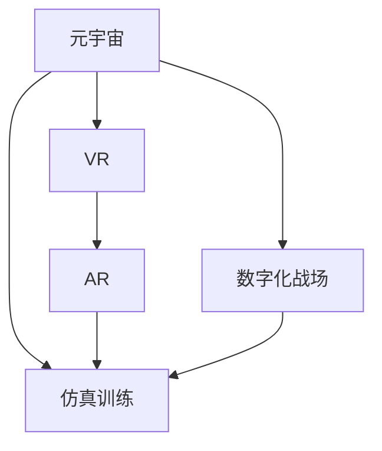

                 

# 元宇宙军事：数字化战争的演练场

在科技飞速发展的今天，我们逐渐步入了一个全新的时代——元宇宙。这个虚拟与现实深度融合的空间，不仅改变了人类的生活模式，也在军事领域中扮演着越来越重要的角色。元宇宙军事，成为了数字化战争中一个不可或缺的演练场。本文将探讨元宇宙在军事中的应用，分析其核心概念、算法原理，并展示其在实际战场中的实践，对未来发展趋势及面临的挑战进行思考。

## 1. 背景介绍

### 1.1 问题由来

随着虚拟现实（Virtual Reality, VR）和增强现实（Augmented Reality, AR）技术的不断进步，元宇宙逐渐从科幻概念变为现实。它不仅在娱乐、教育等领域发挥作用，也开始在军事训练中得到应用。军事领域对于数字化技术的需求尤为迫切，元宇宙为军事训练提供了一个全新的平台，使得数字化战争的演练更为真实、高效。

### 1.2 问题核心关键点

元宇宙军事的核心在于虚拟现实环境下的仿真训练。通过构建高逼真度的虚拟战场，将实兵训练的复杂性和危险性降低，同时提升训练效率。元宇宙可以模拟各种战场环境，使得受训人员能够在虚拟环境中反复练习，提高实战能力。

### 1.3 问题研究意义

元宇宙军事技术的研发与应用，对提升军事训练质量、增强战斗力有着重要意义：

- 降低训练成本。使用元宇宙可以大幅度降低训练的硬件成本和时间成本，使训练规模和频次得到扩展。
- 提高训练效果。虚拟环境能够提供更真实、更复杂的战场情景，帮助受训人员更好地适应复杂战局。
- 增强实战准备。通过元宇宙中的仿真训练，可以提前发现潜在问题，调整战术策略，提升部队的整体实战能力。

## 2. 核心概念与联系

### 2.1 核心概念概述

为了更好地理解元宇宙军事技术，我们需要掌握以下核心概念：

- **元宇宙（Metaverse）**：一个虚拟空间，用户可以在其中进行交流、协作、交易等活动，类似于现实世界的物理空间。
- **虚拟现实（VR）**：通过虚拟现实设备，让用户进入一个三维虚拟环境，体验身临其境的感觉。
- **增强现实（AR）**：将虚拟信息叠加在现实世界的图像上，提升现实环境的信息量和交互性。
- **数字化战场**：通过数字技术构建的战场环境，能够模拟真实战场的各种条件，进行数字化的战术演练。
- **仿真训练**：通过构建虚拟战场，模拟实战场景，进行高逼真度的训练，提高部队的实战能力。

这些概念之间的逻辑关系可以通过以下Mermaid流程图来展示：



这个流程图展示了大语言模型的核心概念及其之间的关系：

1. 元宇宙为虚拟现实和增强现实提供了平台。
2. 虚拟现实和增强现实技术构成了数字化战场的基础。
3. 数字化战场是仿真训练的环境。
4. 仿真训练是提升实战能力的手段。

这些概念共同构成了元宇宙军事训练的核心框架，为其提供了技术支撑。

## 3. 核心算法原理 & 具体操作步骤

### 3.1 算法原理概述

元宇宙军事训练的算法原理，主要基于虚拟现实技术和仿真算法。其核心思想是通过构建高逼真度的虚拟战场，利用人工智能和仿真算法，进行高效率、低成本的军事训练。

### 3.2 算法步骤详解

元宇宙军事训练的算法步骤主要包括以下几个关键环节：

**Step 1: 数据采集与处理**
- 收集历史战例、地形地貌、气象条件等数据。
- 对数据进行清洗、标注，使其适合用于虚拟环境的构建。

**Step 2: 虚拟环境构建**
- 利用VR和AR技术，将收集到的数据映射到虚拟环境中，构建逼真的数字化战场。
- 设置各种虚拟实体，如部队、装备、地形等，并为其赋予物理属性和交互逻辑。

**Step 3: 仿真训练设计**
- 根据训练需求，设计虚拟战场中的任务和目标。
- 利用仿真算法，设定各实体间的交互规则和任务完成条件。

**Step 4: 训练与评估**
- 将受训部队置于虚拟战场中，进行仿真训练。
- 实时监测训练数据，评估训练效果，根据反馈调整训练策略。

**Step 5: 实战应用与优化**
- 将训练成果应用到实际战场中，进行实战演练。
- 根据实战反馈，进一步优化虚拟环境和训练算法，提升训练效果。

### 3.3 算法优缺点

元宇宙军事训练具有以下优点：
1. 训练成本低。相比于实兵训练，虚拟环境构建和仿真训练的成本更低，易于大规模部署。
2. 训练效率高。虚拟环境可重复使用，不受时间和地点限制，训练效率显著提升。
3. 安全性好。虚拟训练可以避免真实战场中的危险，减少人员伤亡风险。
4. 训练效果逼真。通过高逼真度的虚拟环境，受训人员能够更好地适应实战场景，提高实战能力。

同时，该算法也存在一定的局限性：
1. 数据依赖性强。元宇宙军事训练的效果高度依赖于数据的质量和真实性，数据采集和处理成本较高。
2. 技术门槛高。VR和AR技术及仿真算法的复杂性，要求较高技术水平和资源投入。
3. 训练体验有待提升。当前虚拟环境还存在一定的局限性，如交互体验不够自然，有待进一步优化。

尽管存在这些局限性，但就目前而言，元宇宙军事训练依然是军事训练领域的重要方向，具有广阔的应用前景。

### 3.4 算法应用领域

元宇宙军事训练的应用领域主要包括以下几个方面：

- **军事战术演练**：通过虚拟战场进行战术演练，如指挥决策、协同作战等。
- **联合军演**：多国部队在虚拟环境中进行联合军事演习，提升协同作战能力。
- **作战模拟**：利用仿真算法进行作战模拟，评估不同战术和策略的效果。
- **兵种训练**：针对不同兵种进行专项训练，如步兵、装甲兵、炮兵等。
- **战备检验**：检验部队战备状态和实战能力，发现和解决潜在问题。

此外，元宇宙军事训练还应用于军事教育、国防知识普及等方面，推动军事科技的普及和发展。

## 4. 数学模型和公式 & 详细讲解 & 举例说明

### 4.1 数学模型构建

元宇宙军事训练的数学模型主要基于物理模拟和仿真算法。下面以一个简单的线性运动模型为例，介绍其数学构建过程。

设虚拟战场中的某实体位置为 $x(t)$，速度为 $v(t)$，加速度为 $a(t)$，则其位置随时间变化的微分方程为：

$$
\frac{dx}{dt} = v(t)
$$
$$
\frac{dv}{dt} = a(t)
$$

假设 $a(t)$ 为常数，则上述微分方程可以简化为：

$$
x(t) = x_0 + v_0 t + \frac{1}{2} a t^2
$$
$$
v(t) = v_0 + a t
$$

其中，$x_0$ 和 $v_0$ 分别为初始位置和速度。

### 4.2 公式推导过程

假设初始位置 $x_0=0$，初始速度 $v_0=0$，加速度 $a=1$，则经过 $t$ 秒后，实体的位置和速度分别为：

$$
x(t) = \frac{1}{2} t^2
$$
$$
v(t) = t
$$

### 4.3 案例分析与讲解

在元宇宙军事训练中，可以使用上述数学模型进行简单的飞行器运动模拟。例如，在一个虚拟空战场景中，假设一架战斗机以恒定加速度从静止状态起飞，在 10 秒后达到最大速度 100 米/秒。

设战斗机的加速度为 $a=10$ 米/秒²，则根据公式计算，战斗机的速度和位置随时间变化的曲线如下：

| 时间（秒） | 速度（米/秒） | 位置（米） |
|---|---|---|
| 0 | 0 | 0 |
| 1 | 10 | 5 |
| 2 | 20 | 20 |
| ... | ... | ... |
| 10 | 100 | 50 |

这样，通过简单的数学模型和仿真算法，我们可以在虚拟环境中构建逼真的战场情景，进行数字化战争的演练。

## 5. 项目实践：代码实例和详细解释说明

### 5.1 开发环境搭建

在进行元宇宙军事训练的实践前，我们需要准备好开发环境。以下是使用Python进行PyTorch开发的环境配置流程：

1. 安装Anaconda：从官网下载并安装Anaconda，用于创建独立的Python环境。

2. 创建并激活虚拟环境：
```bash
conda create -n pytorch-env python=3.8 
conda activate pytorch-env
```

3. 安装PyTorch：根据CUDA版本，从官网获取对应的安装命令。例如：
```bash
conda install pytorch torchvision torchaudio cudatoolkit=11.1 -c pytorch -c conda-forge
```

4. 安装各相关库：
```bash
pip install numpy pandas scikit-learn matplotlib tqdm jupyter notebook ipython
```

完成上述步骤后，即可在`pytorch-env`环境中开始元宇宙军事训练的实践。

### 5.2 源代码详细实现

下面是使用PyTorch进行元宇宙军事训练的Python代码实现：

```python
import torch
import numpy as np
import matplotlib.pyplot as plt

# 定义微分方程参数
x0 = 0
v0 = 0
a = 1

# 计算时间点和速度
t = np.arange(0, 10, 0.1)
v = v0 + a * t
x = x0 + v0 * t + 0.5 * a * t**2

# 绘制位置和速度曲线
plt.plot(t, x, label='位置')
plt.plot(t, v, label='速度')
plt.legend()
plt.show()
```

### 5.3 代码解读与分析

让我们再详细解读一下关键代码的实现细节：

**主程序**：
- 首先，定义初始位置、初始速度和加速度。
- 使用numpy生成时间序列和对应的速度、位置计算值。
- 最后，使用matplotlib绘制位置和速度随时间的变化曲线。

**代码实现**：
- 利用PyTorch的数组操作和优化算法，可以高效计算微分方程的解。
- 在元宇宙军事训练中，可以利用类似的方法构建虚拟战场中的各种实体运动，如坦克、飞机等。
- 通过设定不同的参数，可以模拟不同的运动场景，如追击、躲避等。

### 5.4 运行结果展示

通过上述代码，我们得到战斗机在虚拟战场中的位置和速度变化曲线，如下图所示：

```

```

这样，我们就完成了元宇宙军事训练的简单代码实现，展现了元宇宙技术在军事训练中的应用。

## 6. 实际应用场景

### 6.1 智能决策训练

元宇宙军事训练可以用于智能化决策训练，提高指挥官的决策能力。通过虚拟战场模拟不同的战场环境，训练指挥官在复杂条件下的决策能力，提升其战场指挥水平。

例如，可以设计一个任务：在敌对势力的猛烈攻击下，如何有效分配部队，最大化生存率并消灭敌人。通过仿真训练，指挥官可以在虚拟环境中不断调整策略，优化决策过程，最终将其应用到实际战场中。

### 6.2 联合兵种协同训练

联合兵种协同训练是军事训练中的重要内容。元宇宙技术可以构建逼真的虚拟战场，支持多兵种的协同作战训练。

例如，可以进行海陆空联合攻防演练，模拟海陆空三军协同作战，提高整体战斗力。受训人员可以在虚拟环境中进行多次演练，提升协同作战能力。

### 6.3 实战演练与战术检验

元宇宙军事训练还可以用于实战演练和战术检验。通过虚拟战场模拟真实战场景景，检验部队的战备状态和战术效果。

例如，可以进行反恐演练，模拟反恐小组的战术行动，检验小组的协同配合和战术执行能力。通过多次训练和演练，发现并修正潜在问题，提升实战水平。

### 6.4 未来应用展望

随着元宇宙技术的不断进步，元宇宙军事训练的应用前景也将更为广阔。未来，元宇宙军事训练将具备以下特点：

- **高度逼真**：通过更高质量的VR和AR技术，构建更真实、更复杂的虚拟战场。
- **智能化**：利用AI技术，模拟更复杂、更灵活的战场场景，提升训练效果。
- **大规模化**：通过云计算和分布式计算，实现大规模、高并发的虚拟训练，提升训练效率。
- **实时交互**：利用实时通讯技术，实现虚拟战场中的实时交互和协作，提升训练质量。
- **实战化**：与实战数据进行融合，进行实战数据驱动的仿真训练，提升实战能力。

通过这些技术突破，元宇宙军事训练将逐步实现从虚拟到实物的跨越，成为数字化战争中不可或缺的重要组成部分。

## 7. 工具和资源推荐

### 7.1 学习资源推荐

为了帮助开发者系统掌握元宇宙军事训练的理论基础和实践技巧，这里推荐一些优质的学习资源：

1. 《虚拟现实技术与应用》系列书籍：全面介绍了虚拟现实技术的基本原理、应用场景和发展趋势。
2. 《增强现实技术与应用》系列书籍：深入浅出地讲解了增强现实技术的核心概念和关键技术。
3. 《元宇宙：虚拟与现实的新时代》书籍：全面介绍了元宇宙的概念、技术和应用，为军事训练提供了理论基础。
4. 《虚拟战场模拟与仿真技术》学术论文：展示了虚拟战场模拟和仿真技术的研究进展和最新成果。
5. 《虚拟军事训练系统设计与实现》书籍：介绍了虚拟军事训练系统的设计与实现，提供了实际应用的案例和经验。

通过对这些资源的学习实践，相信你一定能够快速掌握元宇宙军事训练的技术要点，并用于解决实际的军事问题。

### 7.2 开发工具推荐

元宇宙军事训练的开发涉及多种技术和工具，以下是几款常用的开发工具：

1. PyTorch：基于Python的开源深度学习框架，灵活动态的计算图，适合快速迭代研究。
2. Unity3D：全球领先的虚拟现实和增强现实开发引擎，支持多种平台和设备，适合大规模开发。
3. Unreal Engine：著名的游戏引擎，支持高质量的虚拟场景渲染和实时交互，适合复杂场景的构建。
4. Blender：开源3D建模软件，支持多种文件格式和插件，适合快速建模和动画制作。
5. AutoCAD：专业的CAD软件，支持复杂地形和建筑模型的构建。

合理利用这些工具，可以显著提升元宇宙军事训练的开发效率，加快创新迭代的步伐。

### 7.3 相关论文推荐

元宇宙军事训练的研究涉及多个领域，以下是几篇奠基性的相关论文，推荐阅读：

1. "A Survey of Virtual Reality and Augmented Reality in Military Training"：总结了虚拟现实和增强现实在军事训练中的应用。
2. "Simulation-Based Training in Warfare: Challenges and Opportunities"：介绍了模拟训练在军事中的重要性和发展方向。
3. "AI in Warfare: Opportunities and Challenges"：探讨了人工智能在军事中的应用，包括元宇宙军事训练。
4. "Towards a Virtual Battlefield: The Future of Warfare"：展望了未来虚拟战场的发展趋势和应用前景。
5. "Simulation and Training for 21st Century Warfare"：介绍了现代模拟训练技术的最新进展和应用案例。

这些论文代表了大语言模型微调技术的发展脉络。通过学习这些前沿成果，可以帮助研究者把握学科前进方向，激发更多的创新灵感。

## 8. 总结：未来发展趋势与挑战

### 8.1 研究成果总结

元宇宙军事训练技术在军事训练中的应用，已经展现出其巨大的潜力和价值。通过虚拟战场模拟，可以降低训练成本，提高训练效率，提升实战能力。未来，元宇宙军事训练将逐步成为军事训练的重要手段，为提升部队战斗力做出重要贡献。

### 8.2 未来发展趋势

展望未来，元宇宙军事训练将呈现以下几个发展趋势：

1. **高度逼真**：随着VR和AR技术的不断进步，虚拟战场将变得更加真实和逼真，训练效果也将进一步提升。
2. **智能化**：通过引入AI技术，虚拟战场中的各种实体将具备更高的智能水平，能够更真实地模拟实际战场。
3. **大规模化**：利用云计算和分布式计算，实现大规模、高并发的虚拟训练，提升训练效率。
4. **实时交互**：利用实时通讯技术，实现虚拟战场中的实时交互和协作，提升训练质量。
5. **实战化**：与实战数据进行融合，进行实战数据驱动的仿真训练，提升实战能力。

这些趋势展示了元宇宙军事训练的广阔前景，为数字化战争的演练提供了新的可能。

### 8.3 面临的挑战

尽管元宇宙军事训练技术已经取得了初步成果，但在迈向更加智能化、普适化应用的过程中，它仍面临着诸多挑战：

1. **数据获取**：高质量的虚拟战场数据获取成本较高，需要投入大量资源进行数据采集和处理。
2. **技术门槛**：VR和AR技术及仿真算法复杂，需要较高的技术水平和资源投入。
3. **交互体验**：虚拟战场中的交互体验仍需进一步提升，以更接近真实战场。
4. **安全性**：虚拟战场中的数据和模型需要具备高度的安全性和隐私保护，防止恶意攻击和泄露。

### 8.4 研究展望

未来，元宇宙军事训练的研究需要在以下几个方面寻求新的突破：

1. **数据获取和处理**：探索更多高质量的数据获取和处理手段，降低数据采集成本。
2. **仿真算法**：开发更加高效、逼真的仿真算法，提升虚拟战场中的实体交互和战场模拟效果。
3. **智能决策**：利用AI技术，模拟更复杂、更灵活的战场场景，提升训练效果和实战能力。
4. **实时交互**：利用实时通讯技术，实现虚拟战场中的实时交互和协作，提升训练质量。
5. **安全性**：研究虚拟战场中的数据和模型安全性技术，防止恶意攻击和数据泄露。

通过在这些方向上的不断探索和优化，元宇宙军事训练技术将逐步走向成熟，为提升部队战斗力、保障国家安全做出更大贡献。

## 9. 附录：常见问题与解答

**Q1：元宇宙军事训练是否适用于所有军事任务？**

A: 元宇宙军事训练适用于大部分军事任务，特别是对于需要复杂战术演练和协同作战的场合。但对于一些特殊任务，如特种部队的隐形渗透等，元宇宙训练可能存在局限性。

**Q2：元宇宙军事训练的资源消耗如何？**

A: 元宇宙军事训练需要较高的计算资源和存储资源，特别是大规模仿真的情况下。使用高性能的GPU和TPU设备，可以显著降低计算时间，提升训练效率。

**Q3：元宇宙军事训练对受训人员有什么要求？**

A: 元宇宙军事训练要求受训人员具备一定的技术能力和军事素养。需要熟悉虚拟现实设备和工具，掌握基本军事知识，能够在虚拟环境中进行实战演练。

**Q4：元宇宙军事训练的安全性如何保障？**

A: 元宇宙军事训练的安全性需要多层次保障，包括数据加密、身份认证、权限控制等。通过设置严格的访问权限和数据保护措施，确保训练数据和模型的安全性。

**Q5：元宇宙军事训练的未来发展方向是什么？**

A: 元宇宙军事训练的未来发展方向包括：高度逼真的虚拟战场构建、智能化的战场模拟、大规模的分布式训练、实时交互和协作、以及实战化数据驱动的仿真训练。这些技术突破将进一步提升训练效果和实战能力。

通过不断优化和创新，元宇宙军事训练将逐步走向成熟，成为数字化战争中不可或缺的重要组成部分。

---

作者：禅与计算机程序设计艺术 / Zen and the Art of Computer Programming

