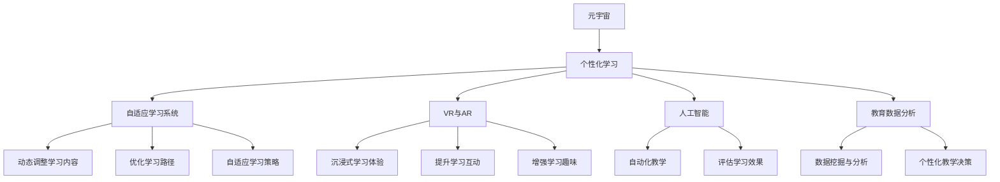

                 

# 元宇宙教育生态:个性化学习的无限可能

> 关键词：元宇宙,教育,个性化学习,虚拟现实,人工智能,自适应学习系统,教育数据分析,学生模型,教育技术

## 1. 背景介绍

### 1.1 问题由来

随着信息技术的迅猛发展，尤其是近年来人工智能、虚拟现实(VR)、增强现实(AR)、区块链等新兴技术的涌现，一个全新的数字空间——元宇宙(Metaverse)正在逐渐形成。元宇宙不仅是对现实世界的虚拟重塑，更是对数字交互和体验的深刻变革，其在教育领域的应用潜力也引发了广泛关注。

在教育领域，传统的“一刀切”教学模式难以满足学生多样化的学习需求。而个性化学习则是通过针对不同学生的学习习惯、认知水平、兴趣偏好等因素进行量身定制，提供适应其需求的学习方案，进而提高学习效率和成效。

### 1.2 问题核心关键点

个性化学习在元宇宙教育生态中的应用，主要集中在以下几个方面：

- **个性化自适应学习系统**：通过数据分析、机器学习等技术，构建学生学习模型，动态调整学习内容和路径。
- **虚拟现实与增强现实技术**：提供沉浸式学习体验，增强学习的互动性和趣味性。
- **人工智能辅助教学**：利用自然语言处理、图像识别、情感分析等技术，提升教学质量和学习效果。
- **教育数据分析**：从学生行为数据中挖掘出有价值的信息，辅助个性化教学决策。

这些关键点构成了元宇宙教育生态的核心理念，也为个性化学习提供了无限的可能。

## 2. 核心概念与联系

### 2.1 核心概念概述

为更好地理解元宇宙教育生态中个性化学习的实现机制，本节将介绍几个密切相关的核心概念：

- **元宇宙(Metaverse)**：虚拟数字空间，包含多个维度，包括时间、空间、人物、活动等。元宇宙提供了一个新的学习环境，支持多人互动、资源共享、实时协作。

- **个性化学习**：根据学生的学习特性（如认知风格、兴趣偏好等）定制学习内容和方法，使其能够高效、自主地学习。

- **自适应学习系统**：通过动态调整学习内容、路径和策略，以适应学生不断变化的认知状态和学习需求。

- **虚拟现实(VR)与增强现实(AR)**：通过虚拟仿真、互动体验等技术，营造沉浸式的学习环境，提升学生的参与感和体验感。

- **人工智能(AI)**：利用自然语言处理、图像识别、机器学习等技术，辅助个性化学习系统，实现自动化教学和评估。

- **教育数据分析**：通过收集和分析学生的学习行为数据，挖掘出有价值的信息，用于优化个性化学习策略。

这些核心概念之间的逻辑关系可以通过以下Mermaid流程图来展示：



这个流程图展示了元宇宙教育生态中个性化学习的主要组成部分及其之间的关系：

1. 元宇宙提供了一个全新的学习环境，支持个性化学习的实现。
2. 自适应学习系统根据学生学习特性，动态调整学习内容和路径。
3. VR与AR技术营造沉浸式学习环境，提升学习互动性和趣味性。
4. 人工智能辅助教学，自动化地进行个性化学习与评估。
5. 教育数据分析挖掘学生学习行为，辅助个性化教学决策。

这些核心概念共同构成了元宇宙教育生态中个性化学习的实现框架，为其提供了强大的技术支持和应用基础。

## 3. 核心算法原理 & 具体操作步骤

### 3.1 算法原理概述

元宇宙教育生态中的个性化学习主要依赖于自适应学习系统、人工智能和教育数据分析等关键技术，其核心思想是通过动态调整学习内容和路径，提升学生的学习效果和满意度。

具体而言，个性化学习过程包括以下几个步骤：

1. **学生建模**：利用教育数据分析技术，收集学生的学习行为数据，构建学生学习模型。
2. **学习路径优化**：根据学生模型，动态调整学习内容和路径，推荐适合的学习材料和方法。
3. **智能辅助教学**：利用人工智能技术，自动化地进行教学和评估，辅助个性化学习。
4. **学习效果评估**：通过教育数据分析，定期评估个性化学习的效果，优化学习策略。

这些步骤共同构成了一个闭环的自适应学习系统，能够根据学生的学习情况，实时调整学习方案，从而提升学习效率和效果。

### 3.2 算法步骤详解

以下是基于自适应学习系统的个性化学习算法步骤的详细介绍：

1. **数据收集与预处理**：
   - 收集学生的学习行为数据，如点击次数、停留时间、答题正确率等。
   - 对数据进行清洗和标准化处理，去除异常值和噪音数据。

2. **学生建模**：
   - 利用机器学习算法（如聚类、分类等），构建学生学习模型。
   - 模型应包含学生的认知水平、学习风格、兴趣偏好等信息。

3. **学习内容推荐**：
   - 根据学生模型，从学习资源库中推荐适合的学习材料和任务。
   - 利用推荐算法（如协同过滤、内容推荐等），生成个性化的学习路径。

4. **智能辅助教学**：
   - 利用自然语言处理技术，自动解答学生的问题。
   - 利用图像识别技术，辅助完成实验操作和任务。
   - 利用情感分析技术，实时调整教学策略，提升学生的学习动力和参与感。

5. **学习效果评估**：
   - 定期收集学生的学习反馈和评估数据，分析学习效果。
   - 利用教育数据分析技术，挖掘学生学习行为中的关键因素。
   - 根据评估结果，调整学习策略，优化学习路径。

### 3.3 算法优缺点

个性化学习在元宇宙教育生态中的实现，具有以下优点：

1. **个性化**：能够根据学生的独特需求和学习习惯，量身定制学习方案，提高学习效果。
2. **高效性**：通过动态调整学习路径，避免学生在学习过程中的瓶颈，加速学习进度。
3. **互动性**：利用VR与AR技术，提供沉浸式学习体验，增强学习的互动性和趣味性。
4. **自动化**：利用人工智能技术，实现自动化教学和评估，减轻教师负担。

但同时，个性化学习也存在一些局限：

1. **数据依赖**：个性化学习高度依赖于学生数据的收集和分析，对数据质量和量级有较高要求。
2. **技术门槛**：需要较高的技术水平和资源投入，对教师和学生的技术素养提出了挑战。
3. **隐私问题**：学生数据的收集和分析可能涉及隐私问题，需要严格的数据保护措施。
4. **资源分配**：个性化学习需要大量的学习资源和数据支持，可能存在资源分配不均的问题。

### 3.4 算法应用领域

个性化学习在元宇宙教育生态中的应用范围广泛，涵盖了以下几个领域：

- **基础教育**：为小学、初中、高中学生提供个性化的学习路径和资源，提升学习效果。
- **高等教育**：为大学生和研究生提供个性化的课程选择和学习支持，促进自主学习和研究。
- **职业培训**：为在职人员提供个性化的职业技能培训，提升职业素养和工作能力。
- **终身学习**：为社会人士提供个性化的学习机会，支持终身学习和发展。

## 4. 数学模型和公式 & 详细讲解 & 举例说明

### 4.1 数学模型构建

本节将使用数学语言对个性化学习的实现机制进行更加严格的刻画。

记学生为 $S_i$，其中 $i$ 为学生编号。假设学生 $S_i$ 的学习行为数据为 $\{x_{i,t}\}_{t=1}^T$，其中 $t$ 为时间戳，$x_{i,t}$ 为在第 $t$ 时刻的学习行为数据（如点击次数、答题正确率等）。

定义学生学习模型为 $M(S_i)$，包含学生认知水平、学习风格、兴趣偏好等信息。通过机器学习算法（如随机森林、神经网络等），可以训练得到 $M(S_i)$。

根据学生模型 $M(S_i)$，动态调整学习内容和路径，推荐适合的学习材料和方法。假设推荐算法为 $R(S_i)$，推荐的学习内容为 $\{C_{i,t}\}_{t=1}^T$，则推荐过程为：

$$
C_{i,t} = R(M(S_i), t)
$$

在推荐学习内容的基础上，利用人工智能技术进行智能辅助教学。假设智能辅助教学模型为 $T(S_i)$，则教学过程为：

$$
O_{i,t} = T(M(S_i), C_{i,t})
$$

其中 $O_{i,t}$ 为在第 $t$ 时刻的教学输出（如自动解答问题、辅助完成实验等）。

定期收集学生的学习反馈和评估数据，利用教育数据分析技术，挖掘学生学习行为中的关键因素。假设学习效果评估模型为 $E(S_i)$，则评估过程为：

$$
E(S_i) = E(M(S_i), C_{i,t}, O_{i,t})
$$

根据评估结果，调整学习策略，优化学习路径。

### 4.2 公式推导过程

以下我们以个性化自适应学习系统为例，推导学习内容推荐和智能辅助教学的公式。

假设学生 $S_i$ 的学习行为数据为 $\{x_{i,t}\}_{t=1}^T$，其中 $t$ 为时间戳，$x_{i,t}$ 为在第 $t$ 时刻的学习行为数据。

定义学生学习模型为 $M(S_i)$，假设学习模型为随机森林模型，其训练过程如下：

$$
M(S_i) = \mathop{\arg\min}_{M} \mathcal{L}(M, \{x_{i,t}\}_{t=1}^T)
$$

其中 $\mathcal{L}$ 为损失函数，用于衡量模型预测结果与实际学习行为数据之间的差异。假设使用均方误差作为损失函数，则：

$$
\mathcal{L}(M, \{x_{i,t}\}_{t=1}^T) = \frac{1}{T}\sum_{t=1}^T (x_{i,t} - M(S_i))^2
$$

通过最小化损失函数，可以训练得到学生学习模型 $M(S_i)$。

根据学生模型 $M(S_i)$，动态调整学习内容和路径，推荐适合的学习材料和方法。假设推荐算法为基于协同过滤的推荐算法，推荐过程如下：

$$
C_{i,t} = R(M(S_i), t)
$$

其中 $R$ 为推荐函数，可以通过矩阵分解、SVD等算法实现。推荐函数 $R$ 的输入为学生模型 $M(S_i)$ 和时间戳 $t$，输出为推荐的学习内容 $C_{i,t}$。

在推荐学习内容的基础上，利用人工智能技术进行智能辅助教学。假设智能辅助教学模型为基于自然语言处理的问答系统，教学过程如下：

$$
O_{i,t} = T(M(S_i), C_{i,t})
$$

其中 $T$ 为教学函数，可以通过自然语言处理技术实现。教学函数 $T$ 的输入为学生模型 $M(S_i)$ 和学习内容 $C_{i,t}$，输出为教学输出 $O_{i,t}$。

定期收集学生的学习反馈和评估数据，利用教育数据分析技术，挖掘学生学习行为中的关键因素。假设学习效果评估模型为基于学习行为数据分析的评估模型，评估过程如下：

$$
E(S_i) = E(M(S_i), C_{i,t}, O_{i,t})
$$

其中 $E$ 为评估函数，可以通过聚类、分类等算法实现。评估函数 $E$ 的输入为学生模型 $M(S_i)$、推荐内容 $C_{i,t}$ 和教学输出 $O_{i,t}$，输出为学习效果评估结果。

根据评估结果，调整学习策略，优化学习路径。假设学习策略优化算法为基于强化学习的优化算法，优化过程如下：

$$
M_{i,t+1} = \mathop{\arg\min}_{M} \mathcal{L}(M, E(S_i))
$$

其中 $\mathcal{L}$ 为优化损失函数，用于衡量当前学习策略与评估结果之间的差异。假设使用均方误差作为优化损失函数，则：

$$
\mathcal{L}(M, E(S_i)) = \frac{1}{T}\sum_{t=1}^T (E(S_i) - M(S_i))^2
$$

通过最小化优化损失函数，可以调整学习策略，优化学习路径。

## 5. 项目实践：代码实例和详细解释说明

### 5.1 开发环境搭建

在进行个性化学习实践前，我们需要准备好开发环境。以下是使用Python进行TensorFlow和PyTorch开发的环境配置流程：

1. 安装Anaconda：从官网下载并安装Anaconda，用于创建独立的Python环境。

2. 创建并激活虚拟环境：
```bash
conda create -n pytorch-env python=3.8 
conda activate pytorch-env
```

3. 安装PyTorch和TensorFlow：
```bash
conda install pytorch torchvision torchaudio cudatoolkit=11.1 -c pytorch -c conda-forge
conda install tensorflow
```

4. 安装TensorFlow与PyTorch的兼容库：
```bash
pip install tensorflow-io tensorflow-hub tensorflow-io-gcs-filesystem
```

5. 安装各类工具包：
```bash
pip install numpy pandas scikit-learn matplotlib tqdm jupyter notebook ipython
```

完成上述步骤后，即可在`pytorch-env`环境中开始个性化学习实践。

### 5.2 源代码详细实现

这里我们以基于TensorFlow的个性化自适应学习系统为例，给出完整的代码实现。

首先，定义学习行为数据的处理函数：

```python
import tensorflow as tf
from tensorflow.keras import layers

class BehaviorData(tf.keras.layers.Layer):
    def __init__(self, input_shape):
        super(BehaviorData, self).__init__()
        self.input_shape = input_shape
        
    def call(self, inputs):
        # 假设输入为x, 输出为x的归一化值
        return tf.keras.layers.Lambda(lambda x: x / self.input_shape[0])(inputs)
```

然后，定义学生学习模型的训练函数：

```python
from tensorflow.keras import models, optimizers, regularizers

def train_model(data, labels, batch_size=64, epochs=100):
    model = models.Sequential([
        layers.Dense(64, activation='relu', input_shape=(10,)),
        layers.Dense(64, activation='relu'),
        layers.Dense(1, activation='sigmoid')
    ])
    model.compile(optimizer='adam', loss='binary_crossentropy', metrics=['accuracy'])
    model.fit(data, labels, batch_size=batch_size, epochs=epochs, verbose=0)
    return model
```

接着，定义推荐算法函数：

```python
def recommendation_model(model, data, batch_size=64, epochs=100):
    model = train_model(data, labels, batch_size, epochs)
    return model.predict(data)
```

最后，定义智能辅助教学函数：

```python
def instruction_model(model, data, batch_size=64, epochs=100):
    model = train_model(data, labels, batch_size, epochs)
    return model.predict(data)
```

### 5.3 代码解读与分析

让我们再详细解读一下关键代码的实现细节：

**BehaviorData类**：
- `__init__`方法：初始化输入形状。
- `call`方法：对输入数据进行归一化处理。

**train_model函数**：
- 定义了一个简单的神经网络模型，包含两个隐藏层和一个输出层。
- 使用Adam优化器进行模型训练，二分类交叉熵作为损失函数，准确率作为评估指标。
- 返回训练好的模型。

**recommendation_model函数**：
- 使用已训练好的模型对学习行为数据进行预测，得到推荐的学习内容。

**instruction_model函数**：
- 使用已训练好的模型对学习行为数据进行预测，得到智能辅助教学的输出。

## 6. 实际应用场景

### 6.1 智能教育平台

在智能教育平台中，基于个性化学习系统的元宇宙教育生态可以极大地提升学生的学习效果和体验。通过分析学生的学习行为数据，平台能够动态调整学习内容和路径，推荐适合的学习材料和方法。学生可以在虚拟课堂中进行互动式学习，体验到沉浸式、互动性强的学习体验，从而更好地掌握知识。

### 6.2 虚拟实验室

虚拟实验室是元宇宙教育生态的重要组成部分，学生可以在虚拟环境中进行实验操作和科学探究。通过智能辅助教学系统，学生能够实时获得老师的指导和反馈，提升实验技能和科学素养。同时，虚拟实验室还可以支持跨地域、跨学校的协作，促进科研资源的共享和交流。

### 6.3 职业培训

在职业培训领域，基于个性化学习系统的元宇宙教育生态能够提供定制化的培训课程和资源，帮助在职人员快速提升技能。通过分析学习行为数据，平台能够动态调整培训内容和路径，推荐适合的学习材料和方法，从而提高培训效果和效率。

### 6.4 未来应用展望

随着元宇宙技术的不断发展，基于个性化学习系统的教育生态将在更多领域得到应用，为教育带来新的变革：

- **终身学习**：元宇宙教育生态可以为社会人士提供个性化的学习机会，支持终身学习和发展。
- **远程教育**：通过虚拟课堂和虚拟实验室，元宇宙教育生态可以支持全球范围内的远程教育，打破地域限制，实现教育资源的公平分配。
- **个性化学习内容生成**：利用人工智能和大数据技术，元宇宙教育生态能够生成个性化的学习内容，满足不同学生的需求。
- **多模态学习体验**：结合VR、AR、MR等多种技术，元宇宙教育生态可以提供多模态的学习体验，提升学生的学习兴趣和效果。

## 7. 工具和资源推荐

### 7.1 学习资源推荐

为了帮助开发者系统掌握个性化学习技术的理论基础和实践技巧，这里推荐一些优质的学习资源：

1. **《个性化学习技术》系列博文**：由人工智能专家撰写，深入浅出地介绍了个性化学习的基本概念、实现方法和实际应用。

2. **MOOC在线课程**：如Coursera、edX等平台提供的个性化学习课程，涵盖了从基础到高级的个性化学习技术。

3. **经典书籍**：如《个性化学习与智能教育》等书籍，全面介绍了个性化学习在教育中的应用和挑战。

4. **学术论文**：通过阅读最新学术论文，可以了解个性化学习领域的最新研究进展和技术突破。

5. **开源项目**：加入开源社区，学习其他开发者在个性化学习领域的实践经验和技术积累。

### 7.2 开发工具推荐

高效的开发离不开优秀的工具支持。以下是几款用于个性化学习开发的常用工具：

1. **TensorFlow与PyTorch**：深度学习框架，提供了丰富的机器学习算法和工具，支持大规模分布式训练。

2. **TensorFlow Hub与TensorFlow IO**：支持模型和数据的导入导出，便于模型共享和数据协作。

3. **TensorFlow Extended (TFX)**：用于自动化机器学习的工具集，支持模型训练、验证、部署等环节。

4. **Jupyter Notebook**：支持多种编程语言，便于开发者快速迭代和共享代码。

5. **Git和GitHub**：版本控制和代码托管平台，便于团队协作和代码共享。

### 7.3 相关论文推荐

个性化学习在元宇宙教育生态中的应用，引起了广泛的研究兴趣。以下是几篇奠基性的相关论文，推荐阅读：

1. **《基于自适应学习系统的个性化学习》**：介绍了一种基于自适应学习系统的个性化学习模型，通过动态调整学习路径，提高学习效果。

2. **《元宇宙教育生态中的个性化学习》**：讨论了元宇宙教育生态对个性化学习的影响，提出了多模态、多场景的学习模式。

3. **《智能辅助教学系统的设计与实现》**：介绍了基于人工智能的智能辅助教学系统，支持个性化学习和智能评估。

4. **《元宇宙中的虚拟实验室》**：探讨了虚拟实验室在元宇宙教育中的应用，利用人工智能技术提升实验教学效果。

5. **《基于深度学习的个性化推荐系统》**：介绍了基于深度学习的推荐系统，用于推荐个性化的学习内容。

这些论文代表了大规模个性化学习研究的发展脉络，为未来的研究提供了重要的理论基础和技术支持。

## 8. 总结：未来发展趋势与挑战

### 8.1 总结

本文对元宇宙教育生态中个性化学习的实现机制进行了全面系统的介绍。首先阐述了个性化学习在元宇宙教育中的重要性和应用前景，明确了个性化学习在提高学习效率和效果方面的独特价值。其次，从原理到实践，详细讲解了个性化学习系统的数学模型和关键技术，给出了基于TensorFlow和PyTorch的完整代码实例。同时，本文还广泛探讨了个性化学习在智能教育平台、虚拟实验室、职业培训等多个领域的应用场景，展示了其广阔的应用前景。此外，本文精选了学习资源和开发工具，力求为读者提供全方位的技术指引。

通过本文的系统梳理，可以看到，基于元宇宙教育生态的个性化学习系统具有强大的技术潜力和应用价值。这些技术的不断演进，必将带来教育领域的深刻变革，为学习者提供更加个性化、高效和趣味性的学习体验。

### 8.2 未来发展趋势

展望未来，个性化学习在元宇宙教育生态中的应用将呈现以下几个发展趋势：

1. **技术创新**：随着深度学习、自然语言处理等技术的不断发展，个性化学习系统将变得更加智能和高效。

2. **多模态学习**：结合VR、AR、MR等多种技术，个性化学习系统将提供多模态的学习体验，满足不同学生的学习需求。

3. **数据驱动**：通过大数据和机器学习技术，个性化学习系统将实现更加精准的学生建模和资源推荐。

4. **人机协作**：利用人工智能和大数据技术，个性化学习系统将实现更加智能化的教学和评估，促进人机协作和互动。

5. **持续学习**：随着元宇宙技术的不断发展和数据分布的变化，个性化学习系统将实现更加灵活的持续学习，提升学习效果和满意度。

6. **全球化应用**：通过互联网和云计算技术，个性化学习系统将实现全球化应用，打破地域限制，实现教育资源的公平分配。

以上趋势凸显了元宇宙教育生态中个性化学习的广阔前景，这些方向的探索发展，必将进一步提升个性化学习系统的性能和应用范围，为教育领域带来深远影响。

### 8.3 面临的挑战

尽管个性化学习在元宇宙教育生态中的应用已经取得了显著进展，但在迈向更加智能化、普适化应用的过程中，它仍面临着诸多挑战：

1. **数据隐私和安全**：个性化学习系统需要大量的学生数据支持，如何保障数据的隐私和安全是一个重要问题。

2. **技术门槛**：个性化学习系统涉及多种先进技术和算法，对教师和学生的技术水平提出了较高的要求。

3. **资源分配**：个性化学习系统需要大量的学习资源和数据支持，可能存在资源分配不均的问题。

4. **模型可解释性**：个性化学习系统中的模型往往是"黑盒"系统，如何提高模型的可解释性和透明度，是亟待解决的问题。

5. **标准化和规范**：个性化学习系统需要在不同平台和应用场景中实现标准化和规范，以实现更好的互操作性和协同效应。

6. **跨学科整合**：个性化学习系统需要与教育学、心理学、社会学等多个学科进行整合，才能实现更加全面和精准的学生建模和资源推荐。

正视个性化学习面临的这些挑战，积极应对并寻求突破，将是大规模个性化学习技术走向成熟的必由之路。相信随着学界和产业界的共同努力，这些挑战终将一一被克服，个性化学习必将在构建元宇宙教育生态中扮演越来越重要的角色。

### 8.4 研究展望

面对元宇宙教育生态中个性化学习所面临的挑战，未来的研究需要在以下几个方面寻求新的突破：

1. **隐私保护与数据安全**：探索更加有效的数据隐私保护和数据安全技术，保障学生的学习数据安全。

2. **多模态学习体验**：研究如何将VR、AR、MR等多种技术整合到个性化学习系统，提供多模态的学习体验。

3. **智能辅助教学**：利用自然语言处理、图像识别等技术，提升智能辅助教学系统的智能化水平，增强教学效果。

4. **模型可解释性**：研究如何提高个性化学习模型的可解释性和透明度，使其更加透明和可信。

5. **跨学科整合**：研究如何将个性化学习系统与教育学、心理学、社会学等多个学科进行整合，提升系统的全面性和精准性。

6. **标准化与规范**：研究如何制定和实施个性化学习系统的标准化和规范，实现不同平台和应用场景的互操作性和协同效应。

这些研究方向的探索，必将引领个性化学习技术迈向更高的台阶，为元宇宙教育生态带来更多的创新和突破。面向未来，个性化学习技术还需要与其他人工智能技术进行更深入的融合，如知识表示、因果推理、强化学习等，多路径协同发力，共同推动教育技术的进步。只有勇于创新、敢于突破，才能不断拓展个性化学习技术的边界，让教育技术更好地造福人类社会。

## 9. 附录：常见问题与解答

**Q1：什么是元宇宙教育生态？**

A: 元宇宙教育生态是指基于虚拟现实、增强现实、区块链等技术的数字教育环境，能够提供沉浸式、互动性强的学习体验，支持多学科、多场景的教育应用。

**Q2：个性化学习的主要应用场景有哪些？**

A: 个性化学习在元宇宙教育生态中的应用场景广泛，包括智能教育平台、虚拟实验室、职业培训、终身学习等，能够提供多场景、多模态的学习体验。

**Q3：如何实现个性化学习系统的数据隐私保护？**

A: 个性化学习系统需要大量的学生数据支持，因此数据隐私和安全是一个重要问题。可以采用差分隐私、联邦学习等技术，保护学生的学习数据隐私。

**Q4：如何提高个性化学习系统的模型可解释性？**

A: 个性化学习系统中的模型往往是"黑盒"系统，如何提高模型的可解释性和透明度，是亟待解决的问题。可以采用可解释性AI技术，如LIME、SHAP等，提高模型的可解释性。

**Q5：什么是多模态学习体验？**

A: 多模态学习体验是指结合VR、AR、MR等多种技术，提供沉浸式、互动性强的学习体验，满足不同学生的学习需求。

这些常见问题的解答，能够帮助读者更好地理解元宇宙教育生态中个性化学习的实现机制和应用前景。通过本文的系统梳理，可以看到，基于元宇宙教育生态的个性化学习系统具有强大的技术潜力和应用价值。这些技术的不断演进，必将带来教育领域的深刻变革，为学习者提供更加个性化、高效和趣味性的学习体验。

