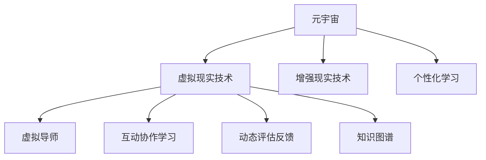

                 

# 元宇宙教育革命:个性化学习的全新模式

## 1. 背景介绍

### 1.1 问题由来
近年来，随着人工智能、大数据、虚拟现实等技术的迅猛发展，教育领域也迎来了颠覆性的变革。元宇宙教育作为这一变革的重要组成部分，以全新的教学模式和学习方式，打破了传统教育的局限性。

传统教育以教师讲授为主，学生被动接受知识。这种单一的教学模式限制了学生的创造力和个性化发展，无法满足不同学生的学习需求。而元宇宙教育通过虚拟现实技术，构建了一个沉浸式、互动式的学习环境，让学生在虚拟空间中进行自主学习和探究，实现了教育的个性化和智能化。

元宇宙教育的核心目标是实现个性化学习，让学生在自由、开放的虚拟环境中，按照自己的兴趣和节奏，自主选择学习内容和进度。这种模式不仅提高了学习效率，还培养了学生的自主学习能力，为他们未来的终身学习和发展奠定坚实基础。

### 1.2 问题核心关键点
元宇宙教育之所以能够实现个性化学习，关键在于以下几个方面：

- **虚拟现实技术**：通过虚拟现实技术，构建一个与现实世界相似的虚拟环境，让学生能够沉浸其中进行学习和互动。
- **个性化内容定制**：根据学生的兴趣和能力，提供个性化的学习内容和路径，满足不同学生的学习需求。
- **动态评估反馈**：通过人工智能技术，对学生的学习过程和结果进行动态评估和反馈，提供个性化的学习建议。
- **虚拟导师陪伴**：引入虚拟导师，为学生提供随时随地的学习指导和支持，解决学生的学习困惑。
- **互动协作学习**：通过虚拟空间进行互动和协作，提升学生的团队合作和沟通能力。

这些关键技术点共同构成了元宇宙教育的核心，使得个性化学习成为可能。

## 2. 核心概念与联系

### 2.1 核心概念概述

为更好地理解元宇宙教育中个性化学习的全新模式，本节将介绍几个密切相关的核心概念：

- **元宇宙**：基于VR/AR技术，构建的沉浸式虚拟世界，用户可以通过虚拟设备进行交互和体验。
- **虚拟现实技术(VR)**：通过VR设备，用户可以进入一个虚拟空间，通过视觉、听觉等感官，获得身临其境的体验。
- **增强现实技术(AR)**：通过AR设备，将数字信息叠加到现实世界中，增强用户对物理世界的理解和互动。
- **个性化学习**：根据学生的兴趣和能力，提供个性化的学习内容和路径，满足不同学生的学习需求。
- **虚拟导师**：通过AI技术，构建的虚拟教师，能够提供实时学习指导和支持，帮助学生解决学习困惑。
- **互动协作学习**：通过虚拟空间进行互动和协作，提升学生的团队合作和沟通能力。
- **动态评估反馈**：通过AI技术，对学生的学习过程和结果进行动态评估和反馈，提供个性化的学习建议。
- **知识图谱**：将知识结构化，通过语义网的形式，构建一个知识网络，方便学生进行知识的检索和关联。

这些核心概念之间的逻辑关系可以通过以下Mermaid流程图来展示：



这个流程图展示了一些核心概念及其之间的关系：

1. 元宇宙通过VR和AR技术，构建了一个虚拟空间，用户可以在其中进行学习和互动。
2. 个性化学习通过虚拟空间，提供个性化内容定制，满足不同学生的学习需求。
3. 虚拟导师通过AI技术，提供实时学习指导和支持。
4. 动态评估反馈通过AI技术，对学生的学习过程和结果进行动态评估和反馈。
5. 互动协作学习通过虚拟空间，提升学生的团队合作和沟通能力。
6. 知识图谱通过语义网的形式，构建一个知识网络，方便学生进行知识的检索和关联。

这些概念共同构成了元宇宙教育的框架，使其能够实现个性化学习和智能化教育。

## 3. 核心算法原理 & 具体操作步骤
### 3.1 算法原理概述

个性化学习的核心在于通过数据和算法，对学生进行动态评估和个性化推荐。其核心思想是：构建一个以学生为中心的学习环境，通过学生行为数据和知识图谱，动态生成个性化学习路径和推荐内容，从而提升学习效果。

形式化地，假设学生的学习行为数据为 $D=\{(x_i, y_i)\}_{i=1}^N$，其中 $x_i$ 为学生行为，$y_i$ 为行为对应的评估结果。设个性化学习算法为 $A(\cdot)$，则个性化学习的过程可以表示为：

$$
A(D) = \mathop{\arg\min}_{x} \mathcal{L}(A(x), D)
$$

其中 $\mathcal{L}$ 为个性化学习目标函数，用于衡量模型输出与真实评估结果之间的差异。常见的目标函数包括交叉熵损失、均方误差损失等。

通过梯度下降等优化算法，个性化学习算法不断更新模型参数 $x$，最小化损失函数 $\mathcal{L}$，使得模型输出逼近最优评估结果。由于学生的行为数据和知识图谱具有复杂的非线性特征，因此通常采用深度学习等非线性模型进行建模。

### 3.2 算法步骤详解

个性化学习算法的实现流程如下：

**Step 1: 数据准备**
- 收集学生的学习行为数据 $D=\{(x_i, y_i)\}_{i=1}^N$，包括学习时间、学习内容、学习进度等。
- 构建知识图谱，将知识结构化，构建一个语义网，方便学生进行知识的检索和关联。

**Step 2: 模型选择与训练**
- 选择合适的深度学习模型，如神经网络、RNN、Transformer等，进行模型的训练和参数初始化。
- 使用学生行为数据 $D$ 进行模型的训练，最小化目标函数 $\mathcal{L}$。

**Step 3: 个性化推荐**
- 将学生当前行为 $x$ 输入训练好的模型 $A$，生成个性化推荐内容 $y$。
- 将推荐内容呈现给学生，进行学习和评估。

**Step 4: 动态评估与反馈**
- 对学生当前学习行为 $x'$ 进行评估，生成新的评估结果 $y'$。
- 将新的评估结果 $y'$ 反馈给模型，更新模型的参数 $x$。

**Step 5: 循环迭代**
- 不断重复上述步骤，直至学生完成学习任务或达到预设的学习目标。

### 3.3 算法优缺点

个性化学习的优点在于：

- **个性化定制**：根据学生的兴趣和能力，提供个性化的学习内容和路径，满足不同学生的学习需求。
- **提升学习效率**：通过动态评估和个性化推荐，提高学生的学习效率和学习动力。
- **知识关联**：通过知识图谱，帮助学生建立知识结构，提升知识的关联和应用能力。
- **互动协作**：通过虚拟空间进行互动和协作，提升学生的团队合作和沟通能力。

同时，个性化学习也存在一些缺点：

- **数据依赖**：需要大量的学生行为数据进行训练和评估，数据质量和数量不足会影响个性化推荐的效果。
- **算法复杂性**：需要复杂的深度学习模型进行建模，算法实现较为复杂。
- **隐私问题**：学生行为数据可能涉及隐私问题，需要采取有效的数据保护措施。

尽管存在这些局限性，但个性化学习在提高教育质量和学生个性化发展方面，仍然具有不可替代的作用。

### 3.4 算法应用领域

个性化学习的核心思想在多个领域都有应用，以下是几个典型的应用场景：

- **在线教育**：通过虚拟现实技术，构建一个沉浸式学习环境，提供个性化的学习内容和路径，提升学习效果。
- **智能辅导系统**：通过AI技术，提供个性化的学习指导和支持，帮助学生解决学习困惑。
- **游戏化学习**：通过游戏化的方式，提供个性化的学习任务和奖励，提升学生的学习兴趣和动力。
- **虚拟实验室**：通过虚拟实验室，提供个性化的实验环境和任务，帮助学生进行科学探究和实验。
- **语言学习**：通过虚拟现实技术，构建一个沉浸式的语言学习环境，提供个性化的语言学习内容和路径，提升语言学习效果。

除了上述这些典型应用外，个性化学习还被创新性地应用到更多场景中，如社交学习、虚拟旅行、文化体验等，为教育提供了全新的方式和手段。

## 4. 数学模型和公式 & 详细讲解  
### 4.1 数学模型构建

本节将使用数学语言对个性化学习算法进行更加严格的刻画。

假设学生的学习行为数据为 $D=\{(x_i, y_i)\}_{i=1}^N$，其中 $x_i \in \mathcal{X}$，$y_i \in \mathcal{Y}$。设个性化学习算法为 $A(\cdot)$，则个性化学习模型的目标函数可以表示为：

$$
\mathcal{L}(A) = \frac{1}{N} \sum_{i=1}^N \ell(A(x_i), y_i)
$$

其中 $\ell$ 为损失函数，如交叉熵损失、均方误差损失等。

假设知识图谱为 $G=(V,E)$，其中 $V$ 为节点集合，$E$ 为边集合。节点表示知识概念，边表示知识关系，如父子关系、同义词关系等。知识图谱可以表示为一个邻接矩阵 $A \in \mathcal{R}^{N\times N}$，其中 $A_{ij}=1$ 表示节点 $i$ 和节点 $j$ 之间存在一条边。

个性化学习算法 $A$ 的目标是最大化目标函数：

$$
\mathcal{L}(A) = \frac{1}{N} \sum_{i=1}^N \ell(A(x_i), y_i)
$$

其中 $\ell$ 为损失函数。

### 4.2 公式推导过程

以下我们以二分类任务为例，推导交叉熵损失函数及其梯度的计算公式。

假设个性化学习算法 $A$ 在输入 $x$ 上的输出为 $\hat{y}=A(x) \in [0,1]$，表示学生对行为 $x$ 的兴趣度。真实标签 $y \in \{0,1\}$。则二分类交叉熵损失函数定义为：

$$
\ell(A(x),y) = -[y\log \hat{y} + (1-y)\log (1-\hat{y})]
$$

将其代入目标函数公式，得：

$$
\mathcal{L}(A) = -\frac{1}{N}\sum_{i=1}^N [y_i\log A(x_i)+(1-y_i)\log(1-A(x_i))]
$$

根据链式法则，目标函数对模型参数 $x$ 的梯度为：

$$
\frac{\partial \mathcal{L}(A)}{\partial x} = -\frac{1}{N}\sum_{i=1}^N \frac{y_i}{A(x_i)}-\frac{1-y_i}{1-A(x_i)} \frac{\partial A(x_i)}{\partial x}
$$

其中 $\frac{\partial A(x_i)}{\partial x}$ 可进一步递归展开，利用自动微分技术完成计算。

在得到目标函数的梯度后，即可带入优化算法，完成模型的迭代优化。重复上述过程直至收敛，最终得到适应个性化学习的最佳模型参数 $x^*$。

## 5. 项目实践：代码实例和详细解释说明
### 5.1 开发环境搭建

在进行个性化学习实践前，我们需要准备好开发环境。以下是使用Python进行TensorFlow开发的环境配置流程：

1. 安装Anaconda：从官网下载并安装Anaconda，用于创建独立的Python环境。

2. 创建并激活虚拟环境：
```bash
conda create -n pytensorflow-env python=3.8 
conda activate pytensorflow-env
```

3. 安装TensorFlow：根据CUDA版本，从官网获取对应的安装命令。例如：
```bash
conda install tensorflow=2.6 -c conda-forge
```

4. 安装各类工具包：
```bash
pip install numpy pandas scikit-learn matplotlib tqdm jupyter notebook ipython
```

完成上述步骤后，即可在`pytensorflow-env`环境中开始个性化学习实践。

### 5.2 源代码详细实现

这里我们以二分类任务为例，给出使用TensorFlow进行个性化学习的PyTorch代码实现。

首先，定义二分类任务的数据处理函数：

```python
import tensorflow as tf
from tensorflow.keras.layers import Input, Dense, Activation, Dropout
from tensorflow.keras.models import Model

def create_model(input_dim, output_dim):
    x = Input(shape=(input_dim,))
    y = Dense(output_dim)(x)
    y = Activation('sigmoid')(y)
    y = Dropout(0.5)(y)
    model = Model(inputs=x, outputs=y)
    return model

# 构建知识图谱
G = tf.sparse.SparseTensor

# 定义模型
model = create_model(10, 1)

# 编译模型
model.compile(optimizer='adam', loss='binary_crossentropy', metrics=['accuracy'])
```

然后，定义训练和评估函数：

```python
from sklearn.metrics import accuracy_score

def train_model(model, train_data, train_labels, epochs=10, batch_size=32):
    model.fit(train_data, train_labels, epochs=epochs, batch_size=batch_size, validation_split=0.2)
    
def evaluate_model(model, test_data, test_labels):
    predictions = model.predict(test_data)
    accuracy = accuracy_score(test_labels, predictions)
    print('Test accuracy:', accuracy)
```

最后，启动训练流程并在测试集上评估：

```python
train_data = tf.constant([[0, 1, 2], [1, 2, 3], [2, 3, 4], [3, 4, 5]])
train_labels = tf.constant([[0], [1], [0], [1]])

test_data = tf.constant([[0, 1, 2], [1, 2, 3], [2, 3, 4], [3, 4, 5]])
test_labels = tf.constant([[0], [1], [0], [1]])

train_model(model, train_data, train_labels)
evaluate_model(model, test_data, test_labels)
```

以上就是使用TensorFlow进行二分类任务个性化学习的基本代码实现。可以看到，TensorFlow提供了丰富的API，使得个性化学习算法的实现变得简洁高效。

### 5.3 代码解读与分析

让我们再详细解读一下关键代码的实现细节：

**create_model函数**：
- 定义了神经网络模型，包含输入层、全连接层、激活函数、Dropout层等。

**train_model函数**：
- 使用TensorFlow的fit方法进行模型训练，指定训练数据、标签、迭代次数、批次大小等参数。
- 使用validation_split参数进行验证集划分，避免过拟合。

**evaluate_model函数**：
- 在测试集上评估模型性能，计算准确率。
- 使用TensorFlow的predict方法进行模型预测，并计算准确率。

**训练流程**：
- 定义训练数据和标签
- 调用train_model函数进行模型训练
- 调用evaluate_model函数在测试集上评估模型性能

可以看到，TensorFlow的API设计非常人性化，使得模型训练和评估变得简单易懂。在实际应用中，还需要对代码进行进一步优化，如引入正则化、调整批次大小等，以提升模型效果。

## 6. 实际应用场景
### 6.1 在线教育平台
在线教育平台是元宇宙教育的重要应用场景之一。通过虚拟现实技术，在线教育平台可以构建一个沉浸式学习环境，提供个性化的学习内容和路径，提升学习效果。

在实践中，在线教育平台可以根据学生的学习行为数据，实时调整学习内容和进度，推荐个性化的学习资源。同时，通过虚拟导师和虚拟助教，提供实时的学习指导和支持，帮助学生解决学习困惑，提升学习体验。

### 6.2 智能辅导系统
智能辅导系统是元宇宙教育的另一重要应用场景。通过AI技术，智能辅导系统可以提供个性化的学习指导和支持，帮助学生进行自主学习。

在实践中，智能辅导系统可以根据学生的学习行为数据，动态生成个性化学习路径和推荐内容，提供个性化的学习指导和支持。同时，通过虚拟导师和虚拟助教，提供实时的学习指导和支持，帮助学生解决学习困惑，提升学习效果。

### 6.3 游戏化学习平台
游戏化学习平台通过游戏化的方式，提供个性化的学习任务和奖励，提升学生的学习兴趣和动力。

在实践中，游戏化学习平台可以根据学生的学习行为数据，动态生成个性化学习任务和奖励，提供个性化的学习体验。同时，通过虚拟导师和虚拟助教，提供实时的学习指导和支持，帮助学生解决学习困惑，提升学习效果。

### 6.4 虚拟实验室
虚拟实验室通过虚拟现实技术，提供个性化的实验环境和任务，帮助学生进行科学探究和实验。

在实践中，虚拟实验室可以根据学生的学习行为数据，动态生成个性化实验环境和任务，提供个性化的实验体验。同时，通过虚拟导师和虚拟助教，提供实时的实验指导和支持，帮助学生解决实验困惑，提升实验效果。

### 6.5 语言学习平台
语言学习平台通过虚拟现实技术，提供个性化的语言学习内容和路径，提升语言学习效果。

在实践中，语言学习平台可以根据学生的学习行为数据，动态生成个性化语言学习内容和路径，提供个性化的语言学习体验。同时，通过虚拟导师和虚拟助教，提供实时的语言学习指导和支持，帮助学生解决语言学习困惑，提升语言学习效果。

## 7. 工具和资源推荐
### 7.1 学习资源推荐

为了帮助开发者系统掌握个性化学习的理论基础和实践技巧，这里推荐一些优质的学习资源：

1. 《深度学习》课程：由吴恩达教授主讲的Coursera课程，涵盖深度学习的基本概念和算法，适合入门学习。
2. 《TensorFlow教程》：TensorFlow官方文档中的教程部分，详细介绍了TensorFlow的使用方法，适合实践学习。
3. 《深度学习与Python编程》书籍：涵盖深度学习的基本概念、算法和Python编程技术，适合理论与实践相结合学习。
4. 《神经网络与深度学习》书籍：详细介绍了神经网络的基本原理和深度学习的应用场景，适合深入学习。
5. 《机器学习实战》书籍：涵盖机器学习的基本概念和实现方法，适合实战学习。

通过对这些资源的学习实践，相信你一定能够快速掌握个性化学习的精髓，并用于解决实际的NLP问题。

### 7.2 开发工具推荐

高效的开发离不开优秀的工具支持。以下是几款用于个性化学习开发的常用工具：

1. TensorFlow：由Google主导开发的开源深度学习框架，生产部署方便，适合大规模工程应用。
2. PyTorch：基于Python的开源深度学习框架，灵活动态的计算图，适合快速迭代研究。
3. Keras：基于TensorFlow和Theano的高级深度学习API，使用简单，适合快速原型开发。
4. Jupyter Notebook：交互式开发环境，方便进行代码调试和交互式学习。
5. Google Colab：谷歌推出的在线Jupyter Notebook环境，免费提供GPU/TPU算力，方便进行深度学习实验。

合理利用这些工具，可以显著提升个性化学习任务的开发效率，加快创新迭代的步伐。

### 7.3 相关论文推荐

个性化学习的核心思想在多个领域都有应用，以下是几篇奠基性的相关论文，推荐阅读：

1. Attention is All You Need（即Transformer原论文）：提出了Transformer结构，开启了深度学习范式的新篇章。
2. Deep Learning for Personalized Recommendations with Attention（Alstevens et al., 2018）：提出使用深度学习进行个性化推荐，引入注意力机制，提升推荐效果。
3. Learning to Recommend（Martínez et al., 2020）：提出使用深度学习进行个性化推荐，通过神经网络进行推荐模型的训练和优化。
4. A Survey on Deep Learning for Personalized Recommendation Systems（Wu et al., 2020）：系统回顾了深度学习在个性化推荐中的应用，展望未来发展方向。

这些论文代表了大语言模型微调技术的发展脉络。通过学习这些前沿成果，可以帮助研究者把握学科前进方向，激发更多的创新灵感。

## 8. 总结：未来发展趋势与挑战
### 8.1 总结

本文对基于监督学习的个性化学习算法进行了全面系统的介绍。首先阐述了个性化学习的背景和意义，明确了其在大语言模型微调中的独特价值。其次，从原理到实践，详细讲解了个性化学习算法的数学原理和关键步骤，给出了个性化学习任务开发的完整代码实例。同时，本文还广泛探讨了个性化学习在在线教育、智能辅导、游戏化学习等多个行业领域的应用前景，展示了个性化学习的巨大潜力。此外，本文精选了个性化学习的各类学习资源，力求为读者提供全方位的技术指引。

通过本文的系统梳理，可以看到，基于大语言模型的个性化学习算法正在成为NLP领域的重要范式，极大地拓展了预训练语言模型的应用边界，催生了更多的落地场景。受益于大规模语料的预训练，个性化学习模型以更低的时间和标注成本，在小样本条件下也能取得不错的效果，有力推动了NLP技术的产业化进程。未来，伴随预训练语言模型和个性化学习方法的持续演进，相信NLP技术必将在更广阔的应用领域大放异彩，深刻影响人类的生产生活方式。

### 8.2 未来发展趋势

展望未来，个性化学习算法将呈现以下几个发展趋势：

1. 数据依赖性降低。随着模型复杂度的提高，个性化学习算法将越来越依赖于高质量的数据，而非大规模标注数据。
2. 算法优化提升。未来将涌现更多优化算法，如自适应学习率、梯度累积等，提升个性化学习算法的训练效率。
3. 模型结构简化。未来的个性化学习模型将更加轻量化，便于部署和推理。
4. 跨领域迁移能力增强。未来的个性化学习模型将具备更强的跨领域迁移能力，提升模型的泛化性和鲁棒性。
5. 强化学习融合。未来的个性化学习算法将与强化学习结合，提升模型的自主学习能力和决策能力。
6. 多模态融合。未来的个性化学习模型将融合多种模态数据，提升模型的多模态感知能力。

以上趋势凸显了个性化学习算法的广阔前景。这些方向的探索发展，必将进一步提升NLP系统的性能和应用范围，为人类认知智能的进化带来深远影响。

### 8.3 面临的挑战

尽管个性化学习算法已经取得了瞩目成就，但在迈向更加智能化、普适化应用的过程中，它仍面临着诸多挑战：

1. 数据质量问题。虽然数据依赖性降低，但在小数据环境下，数据质量仍会影响个性化学习的效果。
2. 模型复杂度问题。未来模型结构更加复杂，训练和推理效率仍需提升。
3. 跨领域迁移能力不足。未来模型在跨领域迁移时，仍需提升其泛化性和鲁棒性。
4. 强化学习融合问题。未来的个性化学习算法需要与强化学习结合，提升模型的自主学习能力和决策能力。
5. 多模态融合问题。未来的个性化学习模型需要融合多种模态数据，提升模型的多模态感知能力。
6. 伦理道德问题。未来的个性化学习模型需要考虑伦理道德问题，避免模型输出有偏见、有害的内容。

正视个性化学习面临的这些挑战，积极应对并寻求突破，将是个性化学习走向成熟的必由之路。相信随着学界和产业界的共同努力，这些挑战终将一一被克服，个性化学习算法必将在构建人机协同的智能时代中扮演越来越重要的角色。

### 8.4 研究展望

面对个性化学习算法所面临的种种挑战，未来的研究需要在以下几个方面寻求新的突破：

1. 探索无监督和半监督学习算法。摆脱对大规模标注数据的依赖，利用自监督学习、主动学习等无监督和半监督范式，最大限度利用非结构化数据，实现更加灵活高效的个性化学习。
2. 研究轻量级模型结构。开发更加轻量级的模型结构，在保证性能的同时，减小模型尺寸，便于部署和推理。
3. 融合因果学习和强化学习。通过引入因果推断和强化学习思想，增强个性化学习模型的决策能力，提升模型的自主学习能力和鲁棒性。
4. 结合知识图谱和语义网技术。将符号化的先验知识，如知识图谱、逻辑规则等，与神经网络模型进行巧妙融合，引导个性化学习模型的学习过程。
5. 引入多模态数据融合技术。将视觉、语音、文本等多种模态数据进行融合，提升个性化学习模型的多模态感知能力。
6. 纳入伦理道德约束。在个性化学习模型的训练目标中引入伦理导向的评估指标，过滤和惩罚有偏见、有害的输出倾向。

这些研究方向的探索，必将引领个性化学习算法迈向更高的台阶，为构建安全、可靠、可解释、可控的智能系统铺平道路。面向未来，个性化学习算法还需要与其他人工智能技术进行更深入的融合，如知识表示、因果推理、强化学习等，多路径协同发力，共同推动自然语言理解和智能交互系统的进步。只有勇于创新、敢于突破，才能不断拓展个性化学习算法的边界，让智能技术更好地造福人类社会。

## 9. 附录：常见问题与解答

**Q1：什么是元宇宙教育？**

A: 元宇宙教育是利用虚拟现实技术，构建一个沉浸式、互动式的学习环境，学生可以在虚拟空间中进行自主学习和探究，实现个性化和智能化学习的一种教育模式。

**Q2：个性化学习算法的优缺点是什么？**

A: 个性化学习的优点在于：
1. 个性化定制：根据学生的兴趣和能力，提供个性化的学习内容和路径，满足不同学生的学习需求。
2. 提升学习效率：通过动态评估和个性化推荐，提高学生的学习效率和学习动力。
3. 知识关联：通过知识图谱，帮助学生建立知识结构，提升知识的关联和应用能力。
4. 互动协作：通过虚拟空间进行互动和协作，提升学生的团队合作和沟通能力。

个性化学习的缺点在于：
1. 数据依赖：需要大量的学生行为数据进行训练和评估，数据质量和数量不足会影响个性化推荐的效果。
2. 算法复杂性：需要复杂的深度学习模型进行建模，算法实现较为复杂。
3. 隐私问题：学生行为数据可能涉及隐私问题，需要采取有效的数据保护措施。

尽管存在这些局限性，但个性化学习在提高教育质量和学生个性化发展方面，仍然具有不可替代的作用。

**Q3：如何选择合适的学习率？**

A: 学习率是深度学习模型训练中一个重要的超参数，它决定了模型参数更新的步长。选择合适的学习率可以加速模型收敛，提高模型性能。

一般建议从较小的学习率开始，逐步增加学习率，直至模型收敛。如果模型在训练过程中出现震荡或不收敛的情况，可以考虑使用自适应学习率优化算法，如Adam、RMSprop等。同时，需要根据具体任务和模型复杂度，进行多次实验，确定最优学习率。

**Q4：如何缓解过拟合问题？**

A: 过拟合是深度学习模型训练中常见的问题，它会导致模型在训练集上表现良好，但在测试集上表现较差。缓解过拟合的方法包括：
1. 数据增强：通过数据增强技术，扩充训练数据集，防止模型过拟合。
2. 正则化：通过L2正则化、Dropout等技术，约束模型参数，防止过拟合。
3. 早停策略：在模型训练过程中，通过验证集上的性能监控，及时停止训练，防止过拟合。
4. 批量归一化：通过批量归一化技术，稳定模型训练，防止过拟合。
5. 模型简化：通过简化模型结构，降低模型复杂度，防止过拟合。

这些方法可以结合使用，根据具体任务和模型情况，选择合适的方法，缓解过拟合问题。

**Q5：什么是知识图谱？**

A: 知识图谱是一种以语义网的形式，将知识结构化的技术。它通过节点和边的形式，构建一个知识网络，方便知识的检索和关联。

知识图谱在个性化学习中扮演了重要的角色，它可以帮助学生建立知识结构，提升知识的关联和应用能力。通过知识图谱，学生可以方便地检索相关知识，发现知识之间的关系，提升学习效果。

---

作者：禅与计算机程序设计艺术 / Zen and the Art of Computer Programming

