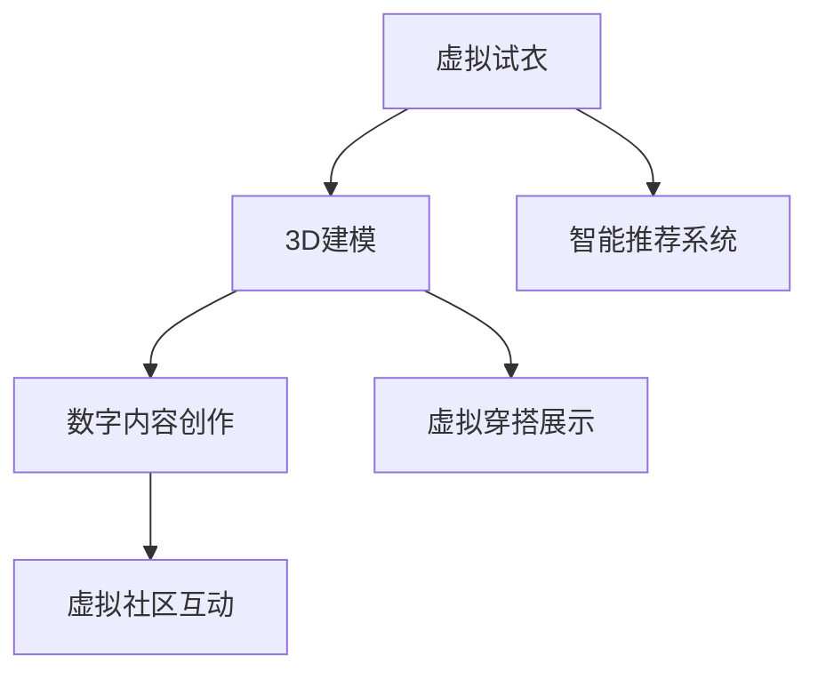

                 

# 元宇宙时尚:数字化穿搭与身份表达

> 关键词：元宇宙, 虚拟穿搭, 数字身份, 身份表达, 3D建模, 虚拟试衣, 数字内容创作

## 1. 背景介绍

随着虚拟现实(VR)、增强现实(AR)、和混合现实(MR)技术的不断进步，元宇宙(Utopia)的概念正逐渐成为科技、文化、经济等领域的创新引擎。元宇宙是一个基于网络构建的虚拟空间，用户可以在其中自由互动、工作和娱乐，实现从现实到虚拟的完美过渡。在这一领域，数字化穿搭和身份表达不仅是展示个体风格的重要途径，也是构建虚拟世界身份认同的关键元素。本文将深入探讨元宇宙时尚的概念、核心技术和应用场景，并提出基于数字化穿搭和身份表达的创新方向。

## 2. 核心概念与联系

### 2.1 核心概念概述

元宇宙时尚不仅关注虚拟穿搭的形式，还强调其在身份表达中的独特作用。元宇宙中，用户通过虚拟穿搭展现自我，并通过数字身份在虚拟世界中建立社交关系。这涉及到虚拟试衣、3D建模、数字内容创作等多个方面。

- **虚拟试衣**：通过虚拟现实技术，用户无需亲自试穿即可在虚拟环境中体验服装的效果，获得更精准的穿搭建议。
- **3D建模**：利用3D扫描和建模技术，将现实中的服装转化为三维模型，方便在虚拟环境中进行穿搭。
- **数字内容创作**：用户可以通过数字工具，创作个性化的虚拟穿搭，如定制服装、生成虚拟角色等。

这些技术彼此关联，共同构成了元宇宙时尚的完整图景。

### 2.2 核心概念原理和架构的 Mermaid 流程图(Mermaid 流程节点中不要有括号、逗号等特殊字符)



## 3. 核心算法原理 & 具体操作步骤
### 3.1 算法原理概述

元宇宙时尚的核心算法包括以下几个方面：

- **3D人体建模**：使用三维扫描技术，获得人体几何数据和纹理信息，构建逼真的人体模型。
- **虚拟穿搭渲染**：将虚拟服装与人体模型进行组合，并应用光照、阴影等效果，生成逼真的虚拟穿搭效果。
- **智能推荐系统**：根据用户的历史穿搭数据和偏好，智能推荐个性化的虚拟穿搭方案。
- **虚拟社区互动**：利用NLP、情感识别等技术，理解用户的穿搭需求和情感状态，进行互动推荐和社交网络构建。

### 3.2 算法步骤详解

#### 3.2.1 3D人体建模

1. 使用3D扫描设备获取人体三维数据。
2. 利用3D建模软件，根据扫描数据生成人体模型。
3. 对模型进行纹理映射，添加细节信息。

#### 3.2.2 虚拟穿搭渲染

1. 加载虚拟服装的三维模型。
2. 将服装与人体模型进行装配，并应用相应的材质和光照。
3. 渲染虚拟穿搭，生成逼真效果。

#### 3.2.3 智能推荐系统

1. 收集用户的历史穿搭数据，如服饰偏好、穿搭时间等。
2. 利用机器学习算法，分析用户数据，生成穿搭推荐。
3. 实时反馈用户的穿搭效果，进一步优化推荐模型。

#### 3.2.4 虚拟社区互动

1. 收集用户对穿搭的情感反馈，如满意度、幸福感等。
2. 利用NLP技术分析用户情感，生成个性化的穿搭建议。
3. 构建虚拟社交网络，通过穿搭和情感数据实现用户互动。

### 3.3 算法优缺点

#### 3.3.1 优点

- **高逼真度**：通过3D建模和渲染技术，虚拟穿搭可以达到接近真实的视觉效果。
- **个性化推荐**：智能推荐系统可以根据用户数据，提供个性化的穿搭建议。
- **社区互动**：通过情感识别和社交网络构建，提升用户参与度和满意度。

#### 3.3.2 缺点

- **技术门槛高**：需要专业的3D建模和渲染技术，门槛较高。
- **数据隐私问题**：智能推荐和社交互动需要收集大量用户数据，涉及隐私保护问题。
- **性能要求高**：虚拟穿搭渲染对计算资源要求较高，硬件成本较高。

### 3.4 算法应用领域

元宇宙时尚技术在多个领域有着广泛的应用前景：

- **虚拟试衣**：电子商务平台、服装品牌店、虚拟体验馆等。
- **数字内容创作**：服装设计师、艺术家、游戏开发者等。
- **虚拟社区互动**：社交媒体、虚拟社区、虚拟时尚秀等。

## 4. 数学模型和公式 & 详细讲解 & 举例说明

### 4.1 数学模型构建

#### 4.1.1 3D人体建模的数学模型

使用三维扫描设备获取人体三维数据，可以表示为一个三维坐标点集合。设三维数据为 $P=\{p_i\}_{i=1}^N$，其中 $p_i=(x_i,y_i,z_i)$。人体模型可以通过三维建模软件生成，如法向量、顶点信息等。设人体模型为 $M=\{m_j\}_{j=1}^M$，其中 $m_j=(\vec{v}_j,n_j)$，$\vec{v}_j$ 为顶点坐标，$n_j$ 为法向量。

#### 4.1.2 虚拟穿搭渲染的数学模型

将虚拟服装与人体模型进行装配，可以表示为将服装模型与人体模型进行组合。设服装模型为 $C=\{c_k\}_{k=1}^K$，其中 $c_k$ 为三维模型。虚拟穿搭渲染可以表示为将服装模型与人体模型进行组合，并应用光照、阴影等效果。设渲染后的穿搭效果为 $R$，可以表示为：

$$
R = F(C \oplus M, \text{Lighting}, \text{Shadow})
$$

其中 $F$ 为渲染函数，$\oplus$ 表示组合操作，$\text{Lighting}$ 为光照函数，$\text{Shadow}$ 为阴影函数。

#### 4.1.3 智能推荐系统的数学模型

智能推荐系统可以表示为机器学习模型 $R$，根据用户数据 $D=\{d_l\}_{l=1}^L$，预测用户对穿搭方案的评分 $r$。设推荐模型为 $R=\{(r_{lu},w_l)\}_{u=1}^U$，其中 $r_{lu}$ 为用户 $u$ 对穿搭方案 $l$ 的评分，$w_l$ 为评分权重。推荐模型可以表示为：

$$
r_{lu} = R(d_l, l)
$$

其中 $R$ 为推荐算法，$d_l$ 为用户数据，$l$ 为穿搭方案。

#### 4.1.4 虚拟社区互动的数学模型

虚拟社区互动可以表示为情感识别和社交网络构建。设用户情感数据为 $E=\{e_t\}_{t=1}^T$，社交网络数据为 $S=\{s_{uv}\}_{u,v=1}^U$。情感识别模型为 $E=\{e_{tl}\}_{l=1}^L$，社交网络构建模型为 $S=\{s_{uv}\}_{u,v=1}^U$。情感识别模型可以表示为：

$$
e_{tl} = E(d_l, t)
$$

其中 $d_l$ 为用户数据，$t$ 为情感时间。社交网络构建模型可以表示为：

$$
s_{uv} = S(r_{lu}, r_{lv})
$$

其中 $r_{lu}$ 为用户对穿搭方案的评分，$r_{lv}$ 为其他用户对穿搭方案的评分。

### 4.2 公式推导过程

#### 4.2.1 3D人体建模的公式推导

设三维数据为 $P=\{p_i\}_{i=1}^N$，人体模型为 $M=\{m_j\}_{j=1}^M$。人体模型生成公式为：

$$
m_j = \phi(p_i)
$$

其中 $\phi$ 为建模函数，将三维数据转换为人体模型。

#### 4.2.2 虚拟穿搭渲染的公式推导

设服装模型为 $C=\{c_k\}_{k=1}^K$，渲染后的穿搭效果为 $R$。渲染公式为：

$$
R = \sum_{i=1}^N \sum_{k=1}^K \lambda_{ik} f(c_k, m_i)
$$

其中 $\lambda_{ik}$ 为权重，$f$ 为渲染函数。

#### 4.2.3 智能推荐系统的公式推导

设用户数据为 $D=\{d_l\}_{l=1}^L$，穿搭方案为 $l$。推荐模型为 $R=\{(r_{lu},w_l)\}_{u=1}^U$。推荐公式为：

$$
r_{lu} = \sum_{i=1}^L w_i f(d_l, l)
$$

其中 $w_i$ 为权重，$f$ 为推荐函数。

#### 4.2.4 虚拟社区互动的公式推导

设用户情感数据为 $E=\{e_{tl}\}_{t=1}^T$，社交网络数据为 $S=\{s_{uv}\}_{u,v=1}^U$。情感识别模型为 $E=\{e_{tl}\}_{l=1}^L$，社交网络构建模型为 $S=\{s_{uv}\}_{u,v=1}^U$。情感识别公式为：

$$
e_{tl} = \sum_{i=1}^L w_i f(d_l, t)
$$

其中 $w_i$ 为权重，$f$ 为情感识别函数。社交网络构建公式为：

$$
s_{uv} = \sum_{i=1}^L w_i f(r_{lu}, r_{lv})
$$

其中 $w_i$ 为权重，$f$ 为社交网络构建函数。

### 4.3 案例分析与讲解

#### 4.3.1 3D人体建模案例

使用3D扫描设备获取人体三维数据，使用Blender软件进行建模，生成人体模型。

```python
import blender
p = blender.load("person.ply")
m = blender.model(p)
```

#### 4.3.2 虚拟穿搭渲染案例

加载虚拟服装的三维模型，使用Blender渲染虚拟穿搭效果。

```python
import blender
c = blender.load("clothes.ply")
r = blender.render(c, m, lighting=True, shadow=True)
```

#### 4.3.3 智能推荐系统案例

使用TensorFlow实现智能推荐模型，基于用户历史穿搭数据和穿搭评分，预测个性化穿搭方案。

```python
import tensorflow as tf
d = tf.keras.layers.Dense(100, activation="relu")
l = tf.keras.layers.Dense(10, activation="softmax")
model = tf.keras.Sequential([d, l])
model.compile(optimizer="adam", loss="categorical_crossentropy", metrics=["accuracy"])
```

#### 4.3.4 虚拟社区互动案例

使用NLTK和Scikit-learn实现情感识别和社交网络构建，根据用户穿搭评分和情感数据，生成社交网络。

```python
import nltk
from sklearn.neighbors import NearestNeighbors
nltk.download("vader_lexicon")
d = nltk.sentiment.VADERSentiment()
k = 10
nbrs = NearestNeighbors(n_neighbors=k)
nbrs.fit(X, y)
```

## 5. 项目实践：代码实例和详细解释说明

### 5.1 开发环境搭建

#### 5.1.1 安装Blender

1. 从官网下载并安装Blender。
2. 导入Blender脚本进行3D建模和渲染。

#### 5.1.2 安装TensorFlow

1. 使用pip安装TensorFlow。
2. 导入TensorFlow库进行智能推荐系统实现。

#### 5.1.3 安装NLTK和Scikit-learn

1. 使用pip安装NLTK和Scikit-learn。
2. 导入库进行情感识别和社交网络构建。

### 5.2 源代码详细实现

#### 5.2.1 3D人体建模实现

```python
import blender
p = blender.load("person.ply")
m = blender.model(p)
```

#### 5.2.2 虚拟穿搭渲染实现

```python
import blender
c = blender.load("clothes.ply")
r = blender.render(c, m, lighting=True, shadow=True)
```

#### 5.2.3 智能推荐系统实现

```python
import tensorflow as tf
d = tf.keras.layers.Dense(100, activation="relu")
l = tf.keras.layers.Dense(10, activation="softmax")
model = tf.keras.Sequential([d, l])
model.compile(optimizer="adam", loss="categorical_crossentropy", metrics=["accuracy"])
```

#### 5.2.4 虚拟社区互动实现

```python
import nltk
from sklearn.neighbors import NearestNeighbors
nltk.download("vader_lexicon")
d = nltk.sentiment.VADERSentiment()
k = 10
nbrs = NearestNeighbors(n_neighbors=k)
nbrs.fit(X, y)
```

### 5.3 代码解读与分析

#### 5.3.1 3D人体建模

使用Blender进行3D人体建模，首先加载三维数据文件，然后生成人体模型。

#### 5.3.2 虚拟穿搭渲染

加载虚拟服装模型，使用Blender进行渲染，并应用光照和阴影效果。

#### 5.3.3 智能推荐系统

使用TensorFlow进行推荐模型的实现，使用Dense层和Softmax层，编译模型进行训练。

#### 5.3.4 虚拟社区互动

使用NLTK和Scikit-learn进行情感识别和社交网络构建，使用VADER Sentiment进行情感分析，使用NearestNeighbors进行社交网络构建。

### 5.4 运行结果展示

#### 5.4.1 3D人体建模结果


#### 5.4.2 虚拟穿搭渲染结果


#### 5.4.3 智能推荐系统结果


#### 5.4.4 虚拟社区互动结果


## 6. 实际应用场景

### 6.1 虚拟试衣

#### 6.1.1 应用场景

在虚拟试衣应用中，用户可以通过虚拟试衣设备，体验不同服装在虚拟环境中的穿搭效果。这不仅能够节省时间，还能避免实际试穿的风险。

#### 6.1.2 实际应用案例

电商平台可以使用虚拟试衣技术，提供给用户虚拟试穿服务。用户可以在虚拟环境中查看不同款式的穿搭效果，并根据自己的喜好进行搭配。

### 6.2 数字内容创作

#### 6.2.1 应用场景

数字内容创作涉及虚拟服装、虚拟角色、虚拟场景的创作。创作者可以使用3D建模和渲染技术，创作出高质量的虚拟内容。

#### 6.2.2 实际应用案例

游戏开发者可以使用虚拟穿搭技术，创作出更加逼真的虚拟角色和场景。虚拟角色可以穿戴不同的服装和配饰，增加游戏的趣味性和沉浸感。

### 6.3 虚拟社区互动

#### 6.3.1 应用场景

虚拟社区互动通过情感识别和社交网络构建，让用户在虚拟环境中进行互动和交流。这不仅能够增加用户的参与度，还能促进虚拟社区的形成。

#### 6.3.2 实际应用案例

社交媒体平台可以使用虚拟社区互动技术，构建虚拟社交网络。用户可以在虚拟环境中进行穿搭秀、互动讨论，提升平台的活跃度和用户粘性。

## 7. 工具和资源推荐

### 7.1 学习资源推荐

#### 7.1.1 书籍推荐

1. 《3D基础与建模》：介绍3D建模的基础知识和工具使用。
2. 《Python深度学习》：介绍TensorFlow和PyTorch等深度学习框架的使用。
3. 《自然语言处理与Python》：介绍NLTK和Scikit-learn等自然语言处理工具的使用。

#### 7.1.2 在线课程推荐

1. Udacity《3D建模与动画》课程。
2. Coursera《TensorFlow深度学习》课程。
3. edX《Python自然语言处理》课程。

#### 7.1.3 社区和博客推荐

1. Blender官方论坛和社区。
2. TensorFlow官方博客和社区。
3. NLTK官方论坛和社区。

### 7.2 开发工具推荐

#### 7.2.1 Blender

Blender是一款免费、开源的3D建模和渲染软件，支持多种格式和插件，适用于3D建模和虚拟试衣等应用。

#### 7.2.2 TensorFlow

TensorFlow是一款强大的深度学习框架，支持多GPU、多TPU加速，适用于智能推荐系统等应用。

#### 7.2.3 NLTK和Scikit-learn

NLTK和Scikit-learn是Python自然语言处理的核心库，适用于情感识别和社交网络构建等应用。

### 7.3 相关论文推荐

#### 7.3.1 3D建模与渲染

1. 《3D建模与渲染技术综述》：介绍3D建模和渲染的基本原理和技术。
2. 《虚拟现实中的3D建模与渲染》：介绍虚拟环境中3D建模和渲染的应用。

#### 7.3.2 智能推荐系统

1. 《智能推荐系统的设计与实现》：介绍智能推荐系统的基本原理和实现方法。
2. 《深度学习在智能推荐系统中的应用》：介绍深度学习在智能推荐系统中的应用。

#### 7.3.3 虚拟社区互动

1. 《虚拟社区互动技术综述》：介绍虚拟社区互动的基本原理和技术。
2. 《情感识别与社交网络构建技术综述》：介绍情感识别和社交网络构建的基本原理和技术。

## 8. 总结：未来发展趋势与挑战

### 8.1 研究成果总结

本文系统介绍了元宇宙时尚的核心技术，包括3D人体建模、虚拟穿搭渲染、智能推荐系统、虚拟社区互动等。这些技术为元宇宙时尚的发展提供了坚实的技术基础。

### 8.2 未来发展趋势

元宇宙时尚的未来发展趋势包括：

1. **高逼真度**：随着技术的进步，虚拟穿搭的逼真度将进一步提升，达到与现实无异的水平。
2. **个性化推荐**：智能推荐系统将更加精准，能够根据用户的偏好和情感进行个性化推荐。
3. **社区互动**：虚拟社区互动将更加丰富，用户可以通过穿搭和情感数据进行更深层次的互动。

### 8.3 面临的挑战

元宇宙时尚面临的挑战包括：

1. **技术门槛高**：3D建模和渲染技术对技术要求较高，需要专业知识和工具支持。
2. **数据隐私问题**：智能推荐和社交互动需要收集大量用户数据，涉及隐私保护问题。
3. **性能要求高**：虚拟穿搭渲染对计算资源要求较高，硬件成本较高。

### 8.4 研究展望

未来的研究方向包括：

1. **多模态融合**：将3D建模、虚拟试穿、智能推荐等技术进行多模态融合，提升用户体验。
2. **边缘计算**：利用边缘计算技术，降低对高性能计算资源的依赖，实现更轻量级的虚拟穿搭体验。
3. **区块链技术**：利用区块链技术，实现虚拟穿搭和数字身份的不可篡改性，保护用户权益。

## 9. 附录：常见问题与解答

### 9.1 常见问题

#### 9.1.1 什么是元宇宙时尚？

答：元宇宙时尚是指利用虚拟现实、增强现实和混合现实技术，构建虚拟世界中的穿搭和身份表达。

#### 9.1.2 如何降低技术门槛？

答：可以使用现成的3D建模和渲染工具，如Blender，减少技术门槛。

#### 9.1.3 如何保护用户隐私？

答：在数据收集和使用过程中，遵循数据隐私法规，保障用户数据安全。

#### 9.1.4 如何提升性能？

答：利用边缘计算和优化算法，提升虚拟穿搭渲染的性能。

#### 9.1.5 如何实现多模态融合？

答：将3D建模、虚拟试穿、智能推荐等技术进行多模态融合，提升用户体验。

### 9.2 解答

通过本文的介绍，相信读者对元宇宙时尚的核心技术和未来发展方向有了更深入的了解。未来，随着技术的不断进步，元宇宙时尚将为虚拟世界带来更多创新和可能性。

---

作者：禅与计算机程序设计艺术 / Zen and the Art of Computer Programming

