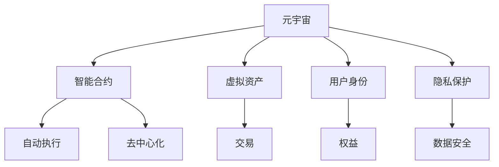

                 

# 元宇宙法律体系：虚拟世界的规则制定

> 关键词：元宇宙,虚拟现实,法律体系,规则制定,隐私保护,知识产权,用户权益,智能合约

## 1. 背景介绍

### 1.1 元宇宙的崛起

随着虚拟现实技术的发展和普及，元宇宙（Metaverse）正逐渐从科幻概念转变为现实。元宇宙是一个通过数字技术构建的虚拟世界，用户可以在其中进行社交、娱乐、工作、交易等活动。它融合了虚拟现实（VR）、增强现实（AR）、区块链、云计算等先进技术，为人类开辟了一个全新的数字生活空间。

### 1.2 法律问题的凸显

元宇宙的崛起带来了诸多法律挑战。虚拟世界中的财产、行为、交易等都是现实世界中法律所未涉及的新领域。如何制定适应虚拟世界的法律规则，保护用户权益，规范市场秩序，成为亟待解决的问题。本文旨在探讨元宇宙法律体系的核心概念、原则和具体措施，为虚拟世界的规则制定提供参考。

## 2. 核心概念与联系

### 2.1 核心概念概述

为更好地理解元宇宙法律体系，首先需要明确几个核心概念：

- **元宇宙**：由虚拟现实、区块链、人工智能等多种技术构建的数字生活空间，用户可以在其中自由活动、交流、交易。
- **智能合约**：一种无需人工干预的自动执行的合约，能够在区块链上实现自动化的交易和规则执行。
- **虚拟资产**：元宇宙中的数字财产，如虚拟土地、数字艺术品、游戏装备等。
- **用户身份**：元宇宙中的虚拟角色或账号，代表着用户的虚拟权益和行为。
- **隐私保护**：保护用户在虚拟世界中的个人信息和行为数据不被非法获取或滥用。

### 2.2 核心概念原理和架构的 Mermaid 流程图



以上流程图示意了元宇宙中关键概念之间的联系。元宇宙通过智能合约实现自动执行和去中心化，虚拟资产和用户身份是元宇宙中的核心要素，隐私保护是用户权益的重要保障。

## 3. 核心算法原理 & 具体操作步骤

### 3.1 算法原理概述

元宇宙法律体系的核心在于建立一套适应虚拟世界规则的法律框架。其原理包括以下几个方面：

- **分布式原则**：基于区块链技术的分布式原则，确保法律规则的透明和公正。
- **智能合约**：利用智能合约实现自动化的合约执行，减少人工干预，提升法律执行效率。
- **隐私保护**：通过数据加密和访问控制等技术手段，保护用户隐私和数据安全。
- **去中心化**：通过去中心化手段，避免单点故障和权力集中，提升系统的安全性和稳定性。

### 3.2 算法步骤详解

建立元宇宙法律体系需要经过以下几个步骤：

**Step 1: 设计法律框架**

- 确定法律原则和目标，如透明、公正、效率等。
- 定义法律适用的范围和边界。
- 制定基本法律条款，如用户身份认证、虚拟资产所有权、隐私保护等。

**Step 2: 实现智能合约**

- 选择合适的区块链平台，如以太坊、Polkadot等。
- 设计智能合约的逻辑，实现基本法律条款的自动化执行。
- 编写智能合约代码，并在区块链上进行部署和测试。

**Step 3: 数据加密与隐私保护**

- 定义数据加密标准和协议，如AES、RSA等。
- 实现用户数据的安全存储和传输。
- 设计访问控制机制，限制非授权访问和数据泄露。

**Step 4: 法律执行与监督**

- 建立法律执行机制，确保智能合约的正确执行。
- 设立法律监督机构，对智能合约和法律执行进行监督。
- 定期审查和更新法律框架，适应技术发展和社会变化。

### 3.3 算法优缺点

元宇宙法律体系的优势包括：

- 透明度高：智能合约和区块链技术的透明性，使得法律规则公开透明，便于监督。
- 执行效率高：自动化的智能合约执行，减少人工干预，提升效率。
- 安全性高：去中心化和数据加密技术，保障用户数据安全和法律执行的安全性。

缺点主要包括：

- 法律边界模糊：虚拟世界中的行为和财产可能与现实世界存在交叉，法律适用的边界不够清晰。
- 技术复杂度高：智能合约和区块链技术的复杂性，增加了法律制定和执行的难度。
- 社会接受度待提高：部分用户可能对新技术和新法律持怀疑态度，需要时间适应。

### 3.4 算法应用领域

元宇宙法律体系的应用领域广泛，包括：

- **虚拟财产交易**：通过智能合约自动执行虚拟财产的买卖、转让、租赁等操作。
- **用户身份认证**：利用区块链技术实现用户身份的唯一性和不可篡改性。
- **隐私保护**：通过数据加密和访问控制机制，保护用户个人信息和行为数据。
- **智能合约**：用于自动执行合同条款，减少人工干预，提升交易效率。
- **法律执行**：通过区块链和智能合约，确保法律规则的自动执行和监督。

## 4. 数学模型和公式 & 详细讲解 & 举例说明

### 4.1 数学模型构建

元宇宙法律体系主要依赖于智能合约和区块链技术的数学模型。智能合约通常基于图灵完备的编程语言，能够自动执行复杂的逻辑和算法。区块链技术的核心是分布式账本技术，保障数据的透明性和不可篡改性。

### 4.2 公式推导过程

以虚拟财产交易为例，推导智能合约的核心公式。假设虚拟财产的ID为`id`，当前所有者为`owner`，交易价格为`price`，智能合约的核心逻辑如下：

1. 验证交易价格：确保交易价格在合理的范围内。
2. 验证当前所有者身份：确保交易的合法性。
3. 转移财产所有权：在验证通过后，自动执行财产所有权的转移。

具体公式如下：

$$
\begin{aligned}
\text{validate\_price}(\text{price}) &= \text{price} \geq \text{min\_price} \wedge \text{price} \leq \text{max\_price} \\
\text{validate\_owner}(\text{id}, \text{owner}) &= \text{owner} = \text{get\_owner}(\text{id}) \\
\text{transfer\_owner}(\text{id}, \text{new\_owner}) &= \text{set\_owner}(\text{id}, \text{new\_owner})
\end{aligned}
$$

其中，`get_owner`函数用于获取财产当前所有者，`set_owner`函数用于设置财产新所有者。

### 4.3 案例分析与讲解

以虚拟土地交易为例，分析智能合约的实现过程：

- 用户通过智能合约的UI界面，输入虚拟土地的ID、当前所有者、交易价格等信息。
- 智能合约验证输入信息是否符合规则，包括交易价格是否合理、当前所有者身份是否合法等。
- 如果验证通过，智能合约自动执行财产所有权的转移，并将交易记录保存到区块链上。

## 5. 项目实践：代码实例和详细解释说明

### 5.1 开发环境搭建

要实现元宇宙法律体系，首先需要搭建开发环境。以下是使用Python进行智能合约开发的环境配置流程：

1. 安装Anaconda：从官网下载并安装Anaconda，用于创建独立的Python环境。

2. 创建并激活虚拟环境：
```bash
conda create -n smartcontract-env python=3.8 
conda activate smartcontract-env
```

3. 安装区块链开发工具：
```bash
pip install web3 pyethcontract
```

4. 安装测试框架：
```bash
pip install pytest
```

完成上述步骤后，即可在`smartcontract-env`环境中开始智能合约开发。

### 5.2 源代码详细实现

下面是使用Python编写的虚拟财产交易智能合约示例代码：

```python
from web3 import Web3, accounts
from pyethcontract import Address

class PropertyContract:
    def __init__(self, contract_address):
        self.w3 = Web3(Web3.HTTPProvider('http://localhost:8545'))
        self.contract = self.w3.eth.contract(address=contract_address, abi='...')  # 智能合约ABI
        self.accounts = accounts.load_accounts('accounts.json')  # 加载账号信息

    def validate_price(self, price):
        if price < 1 or price > 100:
            return False
        return True

    def validate_owner(self, id, owner):
        return self.contract.functions.getOwner(id).call() == owner

    def transfer_owner(self, id, new_owner):
        self.contract.functions.setOwner(id, new_owner).send({'from': self.accounts[0]})

# 加载智能合约
contract = PropertyContract('0x123456789012345678901234567890123')

# 验证价格
price = 50
if contract.validate_price(price):
    print('Price is valid')
else:
    print('Price is invalid')

# 验证所有者身份
id = 1
owner = '0x12345678901234567890123456789012'
if contract.validate_owner(id, owner):
    print('Owner is valid')
else:
    print('Owner is invalid')

# 转移所有权
new_owner = '0x12345678901234567890123456789013'
contract.transfer_owner(id, new_owner)
```

### 5.3 代码解读与分析

让我们再详细解读一下关键代码的实现细节：

- `Web3`：用于连接本地区块链节点，获取交易数据和执行智能合约。
- `pyethcontract`：用于解析智能合约的ABI（接口定义），执行智能合约函数。
- `accounts`：用于加载和管理账号信息。

在上述示例中，我们定义了一个`PropertyContract`类，用于验证和转移虚拟财产所有权。具体实现包括验证价格、验证所有者身份和转移所有权三个函数。这些函数通过智能合约的API接口，调用区块链上的函数执行相应的操作。

## 6. 实际应用场景

### 6.1 虚拟土地交易

虚拟土地交易是元宇宙中常见的应用场景之一。用户可以通过智能合约进行虚拟土地的买卖、租赁和转让。例如，用户A想要将一块虚拟土地卖给用户B，可以通过智能合约自动完成交易。用户A将虚拟土地ID、交易价格和用户B的地址信息发送到智能合约，智能合约验证通过后，自动执行所有权的转移和交易记录的上链。

### 6.2 虚拟游戏装备交易

虚拟游戏装备交易也是元宇宙中的重要应用场景。用户可以在虚拟游戏中购买、出售游戏装备，享受游戏乐趣。智能合约可以记录游戏装备的所有权信息，确保交易的透明和公正。例如，用户A想要将一件游戏装备卖给用户B，只需在智能合约中发起交易请求，智能合约自动验证价格和所有权，完成交易后更新区块链上的所有权信息。

### 6.3 虚拟资产抵押贷款

虚拟资产抵押贷款是元宇宙金融应用的重要场景。用户可以通过虚拟资产抵押获得贷款，用于购买虚拟物品或服务。例如，用户A拥有大量虚拟货币，想要借款购买虚拟装备。用户A将虚拟货币抵押给智能合约，智能合约评估抵押资产的价值，决定是否发放贷款。贷款发放后，智能合约自动更新抵押资产的债权债务信息，并记录交易记录。

## 7. 工具和资源推荐

### 7.1 学习资源推荐

为了帮助开发者系统掌握元宇宙法律体系的理论基础和实践技巧，这里推荐一些优质的学习资源：

1. 《区块链技术原理与实践》系列博文：由区块链专家撰写，深入浅出地介绍了区块链技术的原理、智能合约的实现和应用。

2. 《元宇宙法律指南》书籍：详细阐述了元宇宙法律体系的构建原则、法律框架和具体措施，为元宇宙法律制定提供权威参考。

3. 《NFT、智能合约与元宇宙法律》课程：由法律和区块链专家联合开设的在线课程，系统讲解元宇宙中的法律问题及解决方案。

4. 《元宇宙法律白皮书》：由行业专家联合发布的元宇宙法律白皮书，涵盖元宇宙法律框架、数据隐私保护、知识产权等方面的权威指南。

5. 《元宇宙伦理与社会》论文集：收集多篇学术研究论文，探讨元宇宙中的伦理问题、社会影响及法律规制策略。

通过对这些资源的学习实践，相信你一定能够快速掌握元宇宙法律体系的理论基础和实践技巧，为元宇宙的规则制定贡献力量。

### 7.2 开发工具推荐

高效的开发离不开优秀的工具支持。以下是几款用于元宇宙法律体系开发的常用工具：

1. Web3：用于连接本地区块链节点，获取交易数据和执行智能合约。

2. Solidity：以太坊官方支持的智能合约编程语言，具备图灵完备性，能够实现复杂的逻辑和算法。

3. Truffle Suite：一套集成了IDE、测试框架、部署工具的智能合约开发环境，方便快速开发和测试智能合约。

4. Remix IDE：一个支持以太坊智能合约开发的在线IDE，提供可视化的开发和测试环境，适合初学者使用。

5. Parity CLI：一个基于以太坊主网的命令行工具，支持智能合约的部署和测试。

合理利用这些工具，可以显著提升元宇宙法律体系的开发效率，加快创新迭代的步伐。

### 7.3 相关论文推荐

元宇宙法律体系的发展源于学界的持续研究。以下是几篇奠基性的相关论文，推荐阅读：

1. On the Design and Analysis of Smart Contracts：详细讨论了智能合约的设计原则和安全性问题，为智能合约的实现提供了理论基础。

2. Smart Contracts: Blockchain's Future Computing：探讨了智能合约在区块链上的实现和应用，指出智能合约的广泛前景和重要性。

3. The Future of Trust: Blockchain, Digital Identity, and Privacy：分析了区块链技术在数字身份和隐私保护中的应用，提出了隐私保护的法律框架。

4. Privacy-Preserving Smart Contracts in Blockchain：讨论了隐私保护在智能合约中的应用，提出了多方安全计算等技术手段。

5. Navigating the Legal and Ethical Considerations of Blockchain Technology：分析了区块链技术在法律和伦理层面的挑战，提出了相应的规制措施。

这些论文代表了大数据法律体系的发展脉络。通过学习这些前沿成果，可以帮助研究者把握学科前进方向，激发更多的创新灵感。

## 8. 总结：未来发展趋势与挑战

### 8.1 总结

本文对元宇宙法律体系的核心概念、设计原则和具体措施进行了全面系统的介绍。首先阐述了元宇宙的崛起及其带来的法律挑战，明确了法律框架的设计目标和核心要素。其次，从原理到实践，详细讲解了智能合约的实现步骤和关键技术，给出了智能合约开发的全套代码实例。同时，本文还广泛探讨了元宇宙法律体系在虚拟土地交易、虚拟游戏装备交易、虚拟资产抵押贷款等实际应用场景中的应用前景，展示了元宇宙法律体系的广阔应用前景。此外，本文精选了元宇宙法律体系的学习资源和开发工具，力求为读者提供全方位的技术指引。

通过本文的系统梳理，可以看到，元宇宙法律体系正在成为元宇宙发展的重要保障。智能合约的广泛应用，使得法律规则的执行更加高效透明，为元宇宙的稳定发展提供了坚实的基础。未来，伴随元宇宙技术的不断成熟，法律体系的持续完善，元宇宙必将在更广阔的领域带来深远影响，为人类社会带来全新的变革。

### 8.2 未来发展趋势

展望未来，元宇宙法律体系将呈现以下几个发展趋势：

1. 法律框架的完善：随着元宇宙应用的不断拓展，法律框架将更加细化和完善，涵盖虚拟财产、用户行为、隐私保护等多个方面。

2. 智能合约的标准化：智能合约的实现将逐步标准化，支持跨链互操作和通用接口，提升系统的互操作性和灵活性。

3. 隐私保护技术的进步：隐私保护技术将不断进步，通过多方安全计算、零知识证明等手段，实现更高强度的隐私保护。

4. 数据治理和伦理问题：数据治理和伦理问题将受到更多关注，元宇宙法律体系将进一步完善数据隐私和伦理规则。

5. 国际法律合作：元宇宙的全球化特性将促进国际法律合作，形成统一的法律标准和规范。

6. 用户参与和治理机制：用户将更多地参与到元宇宙的法律治理中，形成民主、透明、公正的法律环境。

以上趋势凸显了元宇宙法律体系的广阔前景。这些方向的探索发展，必将进一步提升元宇宙系统的性能和应用范围，为人类社会的数字化转型提供新的动力。

### 8.3 面临的挑战

尽管元宇宙法律体系已经取得了显著进展，但在迈向更加智能化、普适化应用的过程中，它仍面临着诸多挑战：

1. 法律适用复杂性：元宇宙中的行为和财产可能与现实世界存在交叉，法律适用的边界不够清晰。

2. 技术复杂度高：智能合约和区块链技术的复杂性，增加了法律制定和执行的难度。

3. 用户接受度待提高：部分用户可能对新技术和新法律持怀疑态度，需要时间适应。

4. 法律标准不统一：不同国家和地区的法律标准和规范存在差异，难以形成统一的国际标准。

5. 技术漏洞和安全风险：智能合约和区块链技术的漏洞可能被利用，导致资金盗窃等安全风险。

6. 隐私保护问题：用户数据隐私和安全问题仍需进一步解决，避免数据泄露和滥用。

面对元宇宙法律体系所面临的挑战，未来的研究需要在以下几个方面寻求新的突破：

1. 制定统一的法律标准：推动各国法律标准的统一，建立国际共识和规范。

2. 提升技术透明度和安全性：提高智能合约和区块链技术的透明度和安全性，减少漏洞和风险。

3. 加强用户教育和宣传：提升用户对元宇宙法律体系的认知和接受度，引导用户合理使用和参与。

4. 多层次的法律体系：建立多层次的法律体系，涵盖元宇宙的各个应用场景和细分类别。

5. 强化隐私保护技术：开发和应用隐私保护技术，保障用户数据的安全和隐私。

这些研究方向的探索，必将引领元宇宙法律体系向更加成熟和完善的阶段发展，为元宇宙的稳定和健康发展提供坚实保障。

### 8.4 研究展望

面对元宇宙法律体系所面临的挑战，未来的研究需要在以下几个方面寻求新的突破：

1. 制定统一的法律标准：推动各国法律标准的统一，建立国际共识和规范。

2. 提升技术透明度和安全性：提高智能合约和区块链技术的透明度和安全性，减少漏洞和风险。

3. 加强用户教育和宣传：提升用户对元宇宙法律体系的认知和接受度，引导用户合理使用和参与。

4. 多层次的法律体系：建立多层次的法律体系，涵盖元宇宙的各个应用场景和细分类别。

5. 强化隐私保护技术：开发和应用隐私保护技术，保障用户数据的安全和隐私。

这些研究方向将推动元宇宙法律体系的不断完善和发展，为元宇宙的稳定和健康发展提供坚实保障。面向未来，元宇宙法律体系还需与其他人工智能技术进行更深入的融合，如区块链、云计算、AI等，多路径协同发力，共同推动元宇宙法律体系的创新和进步。只有勇于创新、敢于突破，才能不断拓展元宇宙的法律边界，让智能技术更好地服务于人类社会。

## 9. 附录：常见问题与解答

**Q1：元宇宙法律体系是否适用于所有元宇宙应用？**

A: 元宇宙法律体系的设计原则和目标适用于大多数元宇宙应用，但具体实施可能需要根据不同的应用场景进行调整。例如，虚拟游戏、社交平台和金融交易等场景对法律要求不同，需要制定特定的法律条款。

**Q2：如何验证虚拟财产的所有权？**

A: 通过智能合约中的所有权管理函数，验证虚拟财产的所有权。智能合约会自动记录和验证所有权信息，确保交易的合法性和透明性。例如，通过调用`getOwner`函数获取虚拟财产当前所有者，或通过`setOwner`函数设置新所有者。

**Q3：元宇宙法律体系是否需要国际合作？**

A: 是的，元宇宙的全球化特性决定了其法律体系需要国际合作。不同国家和地区的法律标准和规范存在差异，需要通过国际合作，形成统一的法律标准和规范，确保法律的公平性和普适性。

**Q4：元宇宙中的隐私保护有哪些具体措施？**

A: 元宇宙中的隐私保护主要通过以下措施实现：
1. 数据加密：对用户数据进行加密存储和传输，防止数据泄露和窃取。
2. 访问控制：通过智能合约和区块链技术，限制非授权访问和数据读取。
3. 匿名化处理：对用户数据进行匿名化处理，保护用户隐私。
4. 隐私审计：设立专门的隐私审计机构，定期审查和评估数据保护措施的执行情况。

**Q5：元宇宙法律体系的未来发展方向是什么？**

A: 元宇宙法律体系的未来发展方向包括：
1. 法律框架的完善：涵盖虚拟财产、用户行为、隐私保护等多个方面，形成细化和完善的法律体系。
2. 智能合约的标准化：支持跨链互操作和通用接口，提升系统的互操作性和灵活性。
3. 隐私保护技术的进步：通过多方安全计算、零知识证明等手段，实现更高强度的隐私保护。
4. 用户参与和治理机制：用户将更多地参与到元宇宙的法律治理中，形成民主、透明、公正的法律环境。
5. 法律标准的统一：推动各国法律标准的统一，建立国际共识和规范。

这些研究方向将推动元宇宙法律体系向更加成熟和完善的阶段发展，为元宇宙的稳定和健康发展提供坚实保障。

---

作者：禅与计算机程序设计艺术 / Zen and the Art of Computer Programming

