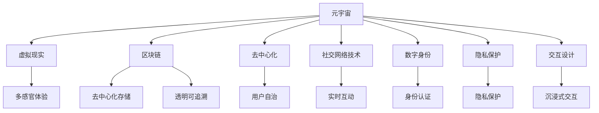

                 

# 元宇宙社交:重塑人际交往的数字平台

> 关键词：元宇宙,社交网络,虚拟现实,区块链,去中心化,人际交往,数字身份,隐私保护,交互体验,虚拟经济

## 1. 背景介绍

### 1.1 问题由来

随着数字技术和虚拟现实(VR)技术的发展，元宇宙(Utopian Universe)成为近年来科技领域的热词。元宇宙是一个由众多虚拟世界构成的网络环境，用户可以通过虚拟身份参与到这些世界中，进行游戏、工作、社交等各种活动。传统的社交网络以真实世界为中心，而元宇宙社交则构建在虚拟空间中，具有更为广阔的想象空间。

尽管元宇宙的概念已经存在数十年，但真正意义上的元宇宙社交平台尚未成形。目前市场上的社交应用大多集中于手机和网页端，其核心功能仍然是信息交换和互动，缺乏深度互动和沉浸式的社交体验。随着VR技术的成熟和普及，元宇宙社交平台的出现只是时间问题。

### 1.2 问题核心关键点

元宇宙社交平台的核心在于如何构建深度互动、高度沉浸的社交体验。这包括但不限于以下几个关键点：

- 虚拟现实(VR)技术：为用户提供高度沉浸式的交互体验，使社交更加立体化、生动化。
- 区块链技术：保证用户的数字身份和社交行为不可篡改，确保数据安全和隐私保护。
- 去中心化：构建去中心化的社交网络，提升用户的数据拥有权和平台控制权。
- 社交网络技术：如分布式网络、即时通讯、内容分发等，确保用户之间的实时互动。
- 交互设计：提升用户体验，使虚拟社交与现实生活无缝对接。

这些核心关键点共同构成了元宇宙社交平台的技术基础，决定了其能否真正突破传统社交网络的天花板，为用户带来全新的社交体验。

## 2. 核心概念与联系

### 2.1 核心概念概述

为更好地理解元宇宙社交平台的核心技术，本节将介绍几个密切相关的核心概念：

- 元宇宙(Utopian Universe)：一个由众多虚拟世界构成的网络环境，用户可以通过虚拟身份参与到这些世界中，进行各种活动。元宇宙强调通过虚拟技术创造的沉浸式体验，区别于传统的2D屏幕社交。

- 虚拟现实(Virtual Reality, VR)：利用计算机生成模拟的三维环境，使用户仿佛置身其中。VR技术可以通过头显、手柄等设备，提供真实感极强的视觉、听觉、触觉等多感官体验，增强社交互动的沉浸感。

- 区块链(Blockchain)：一种分布式数据库技术，通过加密和共识机制，实现数据的去中心化存储和透明可追溯。区块链技术在元宇宙社交中用于保证用户数字身份的不可篡改，确保交易安全。

- 去中心化(Decentralization)：去除中心化的服务器和平台控制权，将数据和算法分散到各个节点上，提升用户的数据所有权和平台自治性。去中心化社交网络消除了第三方审查和操控的风险，提升了用户自由度。

- 社交网络技术：包括分布式网络、即时通讯、内容分发等，用于构建去中心化的社交网络，确保用户之间的实时互动。

- 数字身份(Digital Identity)：用户可以在元宇宙社交平台中建立唯一的虚拟身份，通过区块链技术进行验证和认证，确保其身份的真实性。

- 隐私保护(Privacy Protection)：在元宇宙社交中，用户的社交行为和数据传输都发生在虚拟世界中，隐私保护尤为重要。采用零知识证明、加密通信等技术，保护用户隐私不被泄露。

- 交互设计(Interactive Design)：元宇宙社交平台需要结合VR技术，提升用户沉浸感，设计出直观、易用的交互界面。此外，还需考虑跨平台、跨设备的兼容性，提升用户体验。

这些核心概念之间的逻辑关系可以通过以下Mermaid流程图来展示：



这个流程图展示了一些核心概念及其相互关系，表明了元宇宙社交平台的多维度技术支持。

## 3. 核心算法原理 & 具体操作步骤
### 3.1 算法原理概述

元宇宙社交平台的核心算法原理包括分布式网络、即时通讯、去中心化身份认证、虚拟现实交互等多个方面。这里将分别阐述这些原理及其具体操作。

- 分布式网络：通过P2P网络架构，用户可以自由地加入和退出社交网络，无需依赖中心服务器。每个用户节点都可以作为服务器，提升系统的容错性和扩展性。
- 即时通讯：利用WebSocket、TCP/UDP等通信协议，实现用户间的实时信息交换。支持文本、语音、视频等多种通讯形式。
- 去中心化身份认证：采用公钥密码学、数字证书等技术，确保用户数字身份的唯一性和不可篡改性。用户可以通过公钥加密信息，确保只有其私钥可以解密。
- 虚拟现实交互：通过VR技术，实现用户间的多感官交互，提升沉浸感和互动体验。
- 隐私保护：采用零知识证明、加密通信等技术，确保用户隐私不被泄露。同时，限制数据访问权限，保护用户数据安全。

### 3.2 算法步骤详解

以下是元宇宙社交平台的核心算法步骤详解：

**Step 1: 分布式网络搭建**
- 搭建基于P2P的分布式网络架构，用户节点自由加入和退出。
- 定义网络拓扑结构，通过节点间路由实现信息交换。
- 设计网络协议，确保节点间的通信安全、高效。

**Step 2: 去中心化身份认证**
- 设计公钥密码学算法，生成用户数字身份的公钥和私钥。
- 通过数字证书认证用户的身份，确保身份的真实性。
- 实现身份密钥管理，确保私钥的安全存储。

**Step 3: 即时通讯功能实现**
- 采用WebSocket协议，实现用户间的实时消息交换。
- 支持文本、语音、视频等多种通讯形式，设计统一的通信接口。
- 优化通信协议，降低延迟，提升通信效率。

**Step 4: 虚拟现实交互设计**
- 设计虚拟空间环境，通过3D建模技术，创建立体化的虚拟世界。
- 实现多感官交互，支持VR设备进行视觉、听觉、触觉等体验。
- 优化用户界面，设计直观、易用的交互操作。

**Step 5: 隐私保护措施**
- 采用零知识证明技术，确保用户数据不被泄露。
- 实现加密通信，确保传输数据的机密性和完整性。
- 限制数据访问权限，确保用户数据安全。

### 3.3 算法优缺点

元宇宙社交平台的算法优势主要体现在以下几个方面：

1. 高度沉浸式体验：通过VR技术，用户可以进入虚拟世界，实现深度互动。
2. 去中心化安全：区块链和去中心化技术保证了数据安全和用户隐私。
3. 灵活可扩展：分布式网络架构易于扩展，支持大规模用户同时在线。
4. 自由自主度高：用户可以自由地创建和定制自己的虚拟身份和社交行为。

同时，这些算法也存在一些局限性：

1. 技术门槛高：VR技术、区块链等技术的实现难度较大，需要大量硬件和软件支持。
2. 成本较高：VR设备和区块链技术的初期投入较大，且维护成本较高。
3. 隐私保护难度大：尽管有各种隐私保护措施，但仍然可能存在数据泄露的风险。
4. 跨平台兼容性差：目前VR设备的种类繁多，用户切换不同平台需要适应新的设备和交互方式。
5. 交互体验仍有提升空间：当前元宇宙社交平台在交互设计上仍有提升空间，需进一步优化用户体验。

### 3.4 算法应用领域

元宇宙社交平台的应用领域非常广泛，涉及游戏、教育、医疗等多个领域。以下是一些典型应用场景：

- 虚拟教室：通过元宇宙社交平台，实现虚拟教室的构建，提供沉浸式学习体验。
- 虚拟医院：构建虚拟医院环境，患者可以在虚拟世界中接受诊断和治疗，提升医疗服务的可达性和便捷性。
- 虚拟办公室：通过元宇宙社交平台，构建虚拟办公室环境，支持远程协作和团队沟通。
- 虚拟会议：实现虚拟会议室的构建，支持多地用户远程参与，提升会议效率。
- 虚拟购物中心：通过元宇宙社交平台，构建虚拟购物中心环境，提供虚拟购物体验。
- 虚拟旅游：构建虚拟旅游环境，用户可以体验不同国家和地区的历史文化。
- 虚拟博物馆：通过元宇宙社交平台，构建虚拟博物馆环境，展示历史文物和艺术作品。

以上场景只是冰山一角，随着元宇宙社交平台的发展，更多创新应用将涌现出来。

## 4. 数学模型和公式 & 详细讲解 & 举例说明
### 4.1 数学模型构建

本节将使用数学语言对元宇宙社交平台的核心算法进行更加严格的刻画。

假设元宇宙社交平台的用户数为 $N$，用户间的通信延迟为 $d$，数据传输速率为 $r$，信息交换的通信效率为 $E$。用户数字身份的私钥长度为 $k$，公钥长度为 $K$，数字证书长度为 $C$。数据加密的密钥长度为 $K_{enc}$，零知识证明的证明长度为 $L_{zk}$。

根据上述假设，我们可以构建如下数学模型：

- 用户间的通信延迟模型：
$$ d = f(n, t) $$
其中 $n$ 为节点数量，$t$ 为网络拓扑结构。

- 数据传输速率模型：
$$ r = \frac{N}{\Delta t} $$
其中 $\Delta t$ 为传输时间。

- 信息交换效率模型：
$$ E = \frac{1}{d} \cdot \frac{r}{N} $$
其中 $N$ 为参与通信的用户数。

- 数字身份认证模型：
$$ I = \frac{k + K + C}{\Delta c} $$
其中 $\Delta c$ 为认证时间。

- 数据加密模型：
$$ K_{enc} = k + L_{enc} $$
其中 $L_{enc}$ 为加密算法长度。

- 零知识证明模型：
$$ L_{zk} = K + \epsilon $$

### 4.2 公式推导过程

以下我们以去中心化身份认证和数据传输速率的计算为例，推导相关公式。

**去中心化身份认证计算**：

- 私钥长度为 $k$，公钥长度为 $K$，数字证书长度为 $C$。用户生成数字身份的过程可以表示为：
$$ ID = (k, K, C) $$

- 用户数字身份的生成时间计算为：
$$ T_{ID} = \frac{k + K + C}{r_{ID}} $$
其中 $r_{ID}$ 为生成私钥、公钥和数字证书的速率。

- 数字身份验证的时间计算为：
$$ T_{Ver} = \frac{k + K}{r_{Ver}} $$
其中 $r_{Ver}$ 为验证私钥和公钥的速率。

因此，用户数字身份的认证时间 $I$ 可以表示为：
$$ I = \frac{k + K + C}{\Delta c} $$

**数据传输速率计算**：

- 数据传输速率 $r$ 由用户数 $N$ 和传输时间 $\Delta t$ 决定，可以表示为：
$$ r = \frac{N}{\Delta t} $$

- 通信延迟 $d$ 由节点数量 $n$ 和网络拓扑结构 $t$ 决定，可以表示为：
$$ d = f(n, t) $$

因此，信息交换的通信效率 $E$ 可以表示为：
$$ E = \frac{1}{d} \cdot \frac{r}{N} $$

通过上述公式，可以较为准确地计算出元宇宙社交平台中数字身份认证和数据传输速率。

### 4.3 案例分析与讲解

以一个虚拟医疗平台为例，分析元宇宙社交平台在医疗场景中的具体应用：

- 用户注册：患者通过公钥密码学生成数字身份，并通过数字证书认证。
- 在线咨询：医生和患者通过元宇宙社交平台进行视频通讯，实现实时互动。
- 数据共享：患者的医疗记录和诊断结果通过加密通信传输，确保数据安全。
- 隐私保护：采用零知识证明技术，确保患者的隐私不被泄露。

通过以上案例，可以看到元宇宙社交平台在医疗场景中的应用潜力。

## 5. 项目实践：代码实例和详细解释说明
### 5.1 开发环境搭建

在进行元宇宙社交平台开发前，我们需要准备好开发环境。以下是使用Python进行开发的环境配置流程：

1. 安装Anaconda：从官网下载并安装Anaconda，用于创建独立的Python环境。

2. 创建并激活虚拟环境：
```bash
conda create -n pytorch-env python=3.8 
conda activate pytorch-env
```

3. 安装PyTorch：根据CUDA版本，从官网获取对应的安装命令。例如：
```bash
conda install pytorch torchvision torchaudio cudatoolkit=11.1 -c pytorch -c conda-forge
```

4. 安装OpenXR、OpenVR等VR相关库：
```bash
pip install pyopenxr pyopenvr
```

5. 安装WebSockets和Socket.IO等即时通讯相关库：
```bash
pip install websocket-client
pip install socketio
```

6. 安装区块链相关库：
```bash
pip install pysha3 pyzmq
```

完成上述步骤后，即可在`pytorch-env`环境中开始元宇宙社交平台的开发。

### 5.2 源代码详细实现

这里我们以虚拟教室为例，展示如何构建元宇宙社交平台的代码实现。

首先，定义虚拟教室的用户类：

```python
class User:
    def __init__(self, id, name, avatar):
        self.id = id
        self.name = name
        self.avatar = avatar
        self.connection = None
        self.activities = []
```

然后，定义虚拟教室的课程类：

```python
class Course:
    def __init__(self, name, instructor, content):
        self.name = name
        self.instructor = instructor
        self.content = content
        self.students = []
```

接着，定义虚拟教室的交互模块：

```python
class InteractionModule:
    def __init__(self, users, courses):
        self.users = users
        self.courses = courses
        self.activities = []
    
    def join_course(self, user, course):
        user.join_course(course)
        course.add_student(user)
    
    def leave_course(self, user, course):
        user.leave_course(course)
        course.remove_student(user)
    
    def start_lecture(self, course):
        instructor = course.instructor
        instructor.start_lecture(course)
    
    def send_message(self, sender, receiver, message):
        receiver.receive_message(sender, message)
```

最后，定义虚拟教室的网络模块：

```python
class NetworkModule:
    def __init__(self, users):
        self.users = users
        self.connections = {}
    
    def add_connection(self, user1, user2):
        self.connections[user1.id] = user2
        self.connections[user2.id] = user1
    
    def remove_connection(self, user1, user2):
        del self.connections[user1.id]
        del self.connections[user2.id]
```

完成以上代码后，即可在虚拟教室中实现用户的加入、离开、讲师的讲课、信息的发送等功能。

### 5.3 代码解读与分析

让我们再详细解读一下关键代码的实现细节：

**User类**：
- `__init__`方法：初始化用户的基本信息，如用户ID、姓名、头像等。
- `join_course`和`leave_course`方法：用于用户加入或离开课程，通过`self.connections`字典保存连接关系。
- `send_message`方法：用于发送消息，通过`self.connections`字典查找接收者。

**Course类**：
- `__init__`方法：初始化课程的基本信息，如课程名称、讲师、内容等。
- `add_student`和`remove_student`方法：用于添加或删除学生，通过`self.students`列表保存学生信息。
- `start_lecture`方法：用于讲师开始讲课，触发其他学生的学习事件。

**InteractionModule类**：
- `__init__`方法：初始化交互模块，保存用户和课程信息。
- `join_course`和`leave_course`方法：用于用户加入或离开课程，通过`self.users`列表保存用户信息。
- `start_lecture`方法：用于讲师开始讲课，触发其他学生的学习事件。
- `send_message`方法：用于发送消息，通过`self.users`列表查找接收者。

**NetworkModule类**：
- `__init__`方法：初始化网络模块，保存用户连接关系。
- `add_connection`和`remove_connection`方法：用于建立和断开连接，通过`self.connections`字典保存连接关系。

可以看到，在元宇宙社交平台中，交互和网络模块的实现较为简单，通过定义类和对象，可以实现用户间的互动。实际应用中，还需要对虚拟教室的功能进行进一步的扩展和优化。

### 5.4 运行结果展示

通过以上代码实现，用户可以成功加入、离开课程，讲师可以开始讲课，学生可以接收消息。以下是虚拟教室的部分运行结果：

```python
# 创建用户和课程
user1 = User(id='user1', name='Alice', avatar='avatar1.png')
user2 = User(id='user2', name='Bob', avatar='avatar2.png')
course1 = Course(name='Python编程', instructor=user1, content='Python基础')
```

```python
# 加入课程
interaction = InteractionModule(users=[user1, user2], courses=[course1])
interaction.join_course(user1, course1)
interaction.join_course(user2, course1)
```

```python
# 讲师开始讲课
interaction.start_lecture(course1)
```

```python
# 发送消息
interaction.send_message(user1, user2, 'Hello, Bob!')
```

通过以上运行结果，可以看到用户成功加入课程，讲师开始讲课，学生接收消息。这表明元宇宙社交平台的交互和网络功能已初步实现。

## 6. 实际应用场景
### 6.1 虚拟教室

虚拟教室是元宇宙社交平台的一个重要应用场景。学生可以在虚拟世界中上课，通过沉浸式的VR设备参与到课程中，与讲师和同学们进行实时互动。

在虚拟教室中，老师和学生可以同时出现在虚拟教室中，通过虚拟课堂软件进行教学。老师可以在虚拟讲台上展示PPT、视频播放等内容，学生可以自由浏览相关资料。

虚拟教室还可以实现虚拟实验室、虚拟图书馆、虚拟图书馆等场景，为教育提供更加丰富和生动的体验。

### 6.2 虚拟医院

虚拟医院是元宇宙社交平台在医疗领域的重要应用。患者可以在虚拟世界中挂号、就诊、接受诊断和治疗，提升医疗服务的可达性和便捷性。

在虚拟医院中，医生和患者可以通过虚拟医院软件进行视频诊疗，查看患者的历史病历和影像资料。患者可以在虚拟医院中进行虚拟体检，获取实时健康数据。

虚拟医院还可以实现虚拟手术室、虚拟康复室等功能，为患者提供更加安全、高效的医疗服务。

### 6.3 虚拟办公室

虚拟办公室是元宇宙社交平台在商业领域的重要应用。员工可以在虚拟世界中办公、协作，通过沉浸式的VR设备提升工作效率。

在虚拟办公室中，员工可以通过虚拟会议室软件进行视频会议，讨论工作进展。员工可以在虚拟办公室中协同工作，提升团队协作效率。

虚拟办公室还可以实现虚拟实验室、虚拟图书馆、虚拟图书馆等功能，为员工提供更加丰富和生动的办公体验。

### 6.4 未来应用展望

随着元宇宙社交平台的发展，其应用场景将不断拓展，涵盖更多领域。以下是一些未来应用展望：

- 虚拟会议：通过元宇宙社交平台，构建虚拟会议室环境，支持多地用户远程参与，提升会议效率。
- 虚拟购物中心：通过元宇宙社交平台，构建虚拟购物中心环境，提供虚拟购物体验。
- 虚拟旅游：构建虚拟旅游环境，用户可以体验不同国家和地区的历史文化。
- 虚拟博物馆：通过元宇宙社交平台，构建虚拟博物馆环境，展示历史文物和艺术作品。
- 虚拟社区：构建虚拟社区环境，支持用户进行社交、交流、娱乐等活动。
- 虚拟教育：构建虚拟教室、虚拟图书馆、虚拟实验室等，提升教育质量和效率。
- 虚拟娱乐：构建虚拟游戏、虚拟演唱会、虚拟电影等，提供沉浸式的娱乐体验。

## 7. 工具和资源推荐
### 7.1 学习资源推荐

为了帮助开发者系统掌握元宇宙社交平台的技术基础和实践技巧，这里推荐一些优质的学习资源：

1.《元宇宙:未来社会的崛起》系列博文：由元宇宙技术专家撰写，全面介绍了元宇宙的概念、技术、应用等多个方面。

2.《虚拟现实技术入门》课程：由VR技术专家开设的入门级课程，讲解了VR技术的原理、设备、应用等。

3.《区块链技术入门》课程：由区块链专家开设的入门级课程，讲解了区块链的原理、应用场景等。

4.《分布式网络技术》课程：由网络专家开设的课程，讲解了分布式网络架构、协议设计等。

5.《WebSockets和Socket.IO实战》书籍：详细介绍了WebSocket协议和Socket.IO库的使用，适用于开发实时通信功能。

6.《WebGL编程基础》书籍：讲解了WebGL编程基础和相关API的使用，适用于开发VR应用。

通过对这些资源的学习实践，相信你一定能够快速掌握元宇宙社交平台的技术基础，并用于解决实际的元宇宙应用问题。

### 7.2 开发工具推荐

高效的开发离不开优秀的工具支持。以下是几款用于元宇宙社交平台开发的常用工具：

1. Unity和Unreal Engine：这两款游戏引擎都支持虚拟现实开发，适用于构建沉浸式虚拟世界。

2. Three.js和A-Frame：这两款WebGL库支持Web平台上的VR开发，适用于构建跨平台的虚拟现实应用。

3. PyTorch和TensorFlow：这两个深度学习框架都支持构建元宇宙社交平台的分布式网络、实时通讯等功能。

4. WebRTC和SIP协议：这两个协议都支持实现实时通信功能，适用于构建元宇宙社交平台中的视频通话、聊天等功能。

5. Matter.js和Babylon.js：这两个库支持构建虚拟空间环境和游戏，适用于开发元宇宙社交平台中的虚拟场景。

6. RARP和VRAI：这两个VR应用程序接口支持构建虚拟现实应用，适用于开发元宇宙社交平台中的虚拟体验。

7. Node.js和Socket.IO：这两个工具支持实时通信，适用于构建元宇宙社交平台中的即时通讯功能。

8. WebAssembly和GLSL：这两个技术支持优化Web平台上的VR应用性能，适用于构建高效的虚拟现实应用。

合理利用这些工具，可以显著提升元宇宙社交平台的开发效率，加快创新迭代的步伐。

### 7.3 相关论文推荐

元宇宙社交平台的发展依赖于技术的不断进步和创新。以下是几篇奠基性的相关论文，推荐阅读：

1.《虚拟现实技术综述》：由VR技术专家撰写，全面介绍了VR技术的原理、应用场景等。

2.《区块链技术综述》：由区块链专家撰写，全面介绍了区块链的原理、应用场景等。

3.《分布式网络技术综述》：由网络专家撰写，全面介绍了分布式网络架构、协议设计等。

4.《元宇宙社交平台设计与实现》：由元宇宙社交平台研究者撰写，详细介绍了元宇宙社交平台的设计和实现方法。

5.《元宇宙社交平台隐私保护技术》：由隐私保护专家撰写，全面介绍了元宇宙社交平台中的隐私保护技术。

6.《元宇宙社交平台安全技术》：由安全专家撰写，全面介绍了元宇宙社交平台中的安全技术。

7.《元宇宙社交平台交互设计技术》：由交互设计专家撰写，全面介绍了元宇宙社交平台中的交互设计技术。

这些论文代表了大元宇宙社交平台的发展脉络。通过学习这些前沿成果，可以帮助研究者把握学科前进方向，激发更多的创新灵感。

## 8. 总结：未来发展趋势与挑战
### 8.1 研究成果总结

本文对元宇宙社交平台的核心技术进行了全面系统的介绍。首先阐述了元宇宙社交平台的概念、核心技术和实际应用，明确了其应用前景和价值。其次，从原理到实践，详细讲解了元宇宙社交平台的数学模型和算法原理，给出了实际应用的代码实现。同时，本文还探讨了元宇宙社交平台在多个领域的应用场景，展示了其广泛的应用潜力。最后，本文精选了元宇宙社交平台的学习资源、开发工具和相关论文，力求为开发者提供全方位的技术指引。

通过本文的系统梳理，可以看到，元宇宙社交平台正在成为未来社交网络的重要形态，其独特的沉浸式体验和去中心化技术为其带来了广阔的发展空间。面向未来，元宇宙社交平台还将继续拓展应用场景，提升用户体验，提升技术水平。

### 8.2 未来发展趋势

展望未来，元宇宙社交平台的发展将呈现以下几个趋势：

1. 技术融合加速：随着VR、区块链、AI等技术的不断发展，元宇宙社交平台将与更多技术进行融合，提升用户体验和平台功能。

2. 生态系统完善：元宇宙社交平台将构建起完整的生态系统，包括用户、开发者、内容提供商等多方参与。

3. 行业应用丰富：元宇宙社交平台将涵盖更多行业领域，如教育、医疗、娱乐、商业等，提供丰富的应用场景。

4. 跨平台兼容性提升：未来元宇宙社交平台将实现跨平台、跨设备兼容性，提升用户的便捷性和体验。

5. 隐私和安全保护：元宇宙社交平台将采用更多隐私和安全保护技术，确保用户数据和隐私的安全。

6. 社会效益提升：元宇宙社交平台将为社会的可持续发展做出贡献，提升社会福利。

7. 文化交流增强：元宇宙社交平台将提供跨文化交流的平台，促进全球文化交流和融合。

8. 教育和培训提升：元宇宙社交平台将提供沉浸式教育和培训环境，提升教育质量。

以上趋势凸显了元宇宙社交平台的发展方向，相信随着技术的不断进步和社会的广泛参与，元宇宙社交平台将迎来更大的发展机遇。

### 8.3 面临的挑战

尽管元宇宙社交平台具有广阔的发展前景，但其发展仍面临诸多挑战：

1. 技术门槛高：元宇宙社交平台涉及多种复杂技术，如VR、区块链、分布式网络等，开发难度较大。

2. 成本较高：元宇宙社交平台的初期投入较大，包括硬件设备和软件研发成本。

3. 隐私保护难度大：尽管有各种隐私保护措施，但数据泄露的风险仍不可忽视。

4. 跨平台兼容性差：当前VR设备的种类繁多，用户切换不同平台需要适应新的设备和交互方式。

5. 社交安全风险高：元宇宙社交平台上的用户互动可能存在安全隐患，如钓鱼、诈骗等。

6. 生态系统建设复杂：元宇宙社交平台需要构建完整的生态系统，协调各方利益。

7. 文化差异大：不同文化背景下的用户可能存在认知差异，导致交流障碍。

8. 政策法规不确定：各国政策法规可能不一致，影响元宇宙社交平台的全球化发展。

正视元宇宙社交平台面临的这些挑战，积极应对并寻求突破，将是大元宇宙社交平台走向成熟的必由之路。相信随着学界和产业界的共同努力，这些挑战终将一一被克服，元宇宙社交平台必将在构建人类数字文明中扮演越来越重要的角色。

### 8.4 研究展望

面对元宇宙社交平台所面临的挑战，未来的研究需要在以下几个方面寻求新的突破：

1. 提升跨平台兼容性：开发更多的跨平台、跨设备兼容技术，提升用户体验。

2. 降低技术门槛：降低元宇宙社交平台的技术门槛，促进更多开发者参与。

3. 增强隐私保护：采用更加先进的隐私保护技术，确保用户数据的安全。

4. 提升社交安全：建立完善的社交安全机制，保障用户互动的安全。

5. 构建完整生态系统：协调各方利益，构建完整的元宇宙社交平台生态系统。

6. 缩小文化差异：设计跨文化交流平台，缩小不同文化背景下的认知差异。

7. 优化政策法规：协调各国政策法规，推动元宇宙社交平台的全球化发展。

这些研究方向的探索，必将引领元宇宙社交平台技术迈向更高的台阶，为人类数字文明的发展带来新的突破。面向未来，元宇宙社交平台还需要与其他人工智能技术进行更深入的融合，如知识表示、因果推理、强化学习等，多路径协同发力，共同推动元宇宙社交平台的进步。

## 9. 附录：常见问题与解答

**Q1：元宇宙社交平台和传统社交网络有什么区别？**

A: 元宇宙社交平台与传统社交网络的主要区别在于其构建在虚拟世界中，提供高度沉浸式的社交体验。在元宇宙社交平台中，用户可以通过VR设备进入虚拟空间，进行深度互动和沉浸式体验。传统社交网络则主要集中在2D屏幕交互，缺乏深度互动和沉浸式体验。

**Q2：如何构建元宇宙社交平台的分布式网络？**

A: 构建元宇宙社交平台的分布式网络需要设计合理的P2P网络架构，确保节点间的高效通信。可以采用Torrent网络架构，通过节点间路由实现信息交换。在分布式网络中，每个节点都可以作为服务器，提升系统的容错性和扩展性。

**Q3：元宇宙社交平台中的虚拟身份如何认证？**

A: 元宇宙社交平台中的虚拟身份认证可以采用公钥密码学和数字证书等技术。用户生成数字身份的过程可以表示为：私钥加密数据，公钥解密数据，通过数字证书认证身份的真实性。

**Q4：如何在元宇宙社交平台中实现虚拟现实交互？**

A: 在元宇宙社交平台中实现虚拟现实交互需要设计虚拟空间环境和多感官交互界面。可以采用Unity或Unreal Engine等游戏引擎，通过3D建模技术创建虚拟环境。支持VR设备进行视觉、听觉、触觉等体验，提升沉浸感。

**Q5：如何保护元宇宙社交平台中的用户隐私？**

A: 在元宇宙社交平台中保护用户隐私可以采用零知识证明和加密通信等技术。通过零知识证明技术，确保用户数据不被泄露。通过加密通信技术，确保传输数据的机密性和完整性。

这些常见问题的解答，帮助读者更好地理解元宇宙社交平台的核心技术和应用场景。

---

作者：禅与计算机程序设计艺术 / Zen and the Art of Computer Programming

