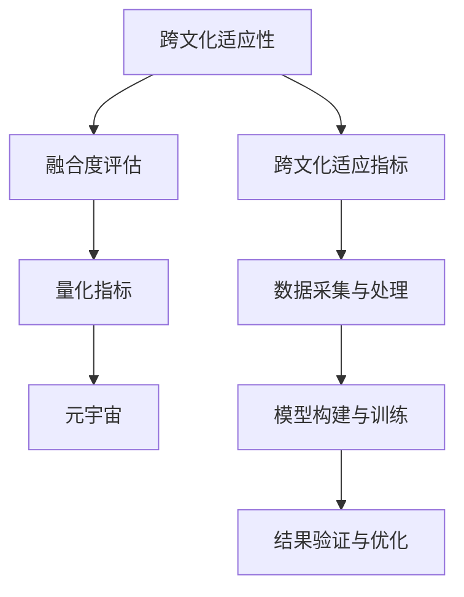

                 

# 元宇宙移民融合度评估:数字公民的跨文化适应性量化指标

> 关键词：元宇宙,数字公民,跨文化适应性,量化指标,融合度评估

## 1. 背景介绍

### 1.1 问题由来

元宇宙（Metaverse）的概念源自于科幻小说，但随着虚拟现实（VR）、增强现实（AR）、区块链、云计算等技术的不断成熟和普及，元宇宙正逐渐成为现实。它是指一个基于虚拟现实技术构建的、超越物理世界的数字化空间，其中居住着由真实世界用户以数字身份存在的虚拟居民。在元宇宙中，数字公民能够进行社交、工作、娱乐、购物等多种活动，其体验和现实世界相仿。

数字公民的跨文化适应性，是元宇宙建设中的核心问题。文化差异在数字公民的跨文化适应中扮演着重要角色，影响着数字公民在元宇宙中的交互体验和融合程度。因此，量化数字公民的跨文化适应性，评估其融合度，对于提升元宇宙体验、促进社会包容性和文化多样性具有重要意义。

### 1.2 问题核心关键点

量化数字公民的跨文化适应性，需要考虑以下几个关键点：
- **跨文化适应指标**：确定哪些指标可以量化数字公民在跨文化环境中的适应情况。
- **融合度评估方法**：选择何种方法来评估这些指标。
- **数据采集与处理**：如何获取跨文化适应性数据，并对其进行有效处理。
- **模型构建与训练**：设计合适的模型，并使用哪些算法进行训练。
- **结果验证与优化**：如何验证模型的效果，并根据反馈进行模型优化。

本论文将系统地介绍如何量化数字公民的跨文化适应性，并通过融合度评估模型对数字公民在元宇宙中的融合程度进行评估。

## 2. 核心概念与联系

### 2.1 核心概念概述

为了更好地理解跨文化适应性的量化评估，首先介绍几个核心概念：

- **跨文化适应性（Cross-cultural Adaptability）**：指个体在不同的文化环境中适应和融入的能力，包括语言、习俗、行为规范等方面的适应。
- **融合度（Assimilation Degree）**：指数字公民在元宇宙中融入特定文化群体的程度，包括社会互动、群体归属、文化认同等方面。
- **量化指标（Quantitative Indicators）**：通过数学公式或模型对跨文化适应性和融合度进行量化评估。
- **元宇宙（Metaverse）**：基于虚拟现实技术的数字化空间，数字公民在其中进行社交、工作、娱乐等活动。

### 2.2 核心概念原理和架构的 Mermaid 流程图



该流程图展示了跨文化适应性量化评估的核心流程。

- **A到B**：从跨文化适应性量化指标出发，评估数字公民的跨文化适应程度。
- **B到C**：通过融合度评估模型，量化数字公民在元宇宙中的融合程度。
- **C到D**：将融合度评估结果应用于元宇宙的建设与优化。
- **A到E**：确定可量化的跨文化适应指标，包括语言、习俗、行为规范等。
- **E到F**：采集和处理跨文化适应性数据，以支持模型训练。
- **F到G**：构建和训练融合度评估模型，如神经网络、深度学习模型等。
- **G到H**：验证和优化模型效果，确保其准确性和鲁棒性。

## 3. 核心算法原理 & 具体操作步骤

### 3.1 算法原理概述

量化数字公民的跨文化适应性，可通过构建融合度评估模型实现。该模型基于机器学习算法，从跨文化适应性数据中学习模式，预测数字公民在元宇宙中的融合度。

模型的输入为跨文化适应性数据，输出为融合度评估结果。其中，跨文化适应性数据包含数字公民的语言能力、文化知识、社交技能、习俗理解等方面的信息，融合度评估结果则反映数字公民在不同文化群体的适应情况。

### 3.2 算法步骤详解

**Step 1: 确定跨文化适应性指标**

1. **语言能力**：数字公民的母语和外语水平，包括词汇量、语法、发音等方面。
2. **文化知识**：数字公民对目标文化的基本认知和理解，如文化习俗、节日、宗教等。
3. **社交技能**：数字公民在跨文化环境中的社交互动能力，包括礼貌用语、非言语交流、社交礼仪等。
4. **习俗理解**：数字公民对目标文化的习俗和规范的理解和适应情况。

**Step 2: 数据采集与处理**

1. **数据采集**：通过问卷调查、观测、访谈等方式，收集数字公民的跨文化适应性数据。
2. **数据处理**：对采集的数据进行清洗、标准化和归一化处理，以便模型训练。

**Step 3: 模型构建与训练**

1. **选择模型**：选择适合融合度评估的机器学习模型，如支持向量机（SVM）、随机森林（Random Forest）、神经网络等。
2. **训练模型**：使用采集和处理后的数据，训练融合度评估模型。

**Step 4: 结果验证与优化**

1. **结果验证**：使用验证集评估模型的效果，检查模型的准确性和鲁棒性。
2. **模型优化**：根据验证结果，调整模型参数，提高模型性能。

### 3.3 算法优缺点

**优点**：
- **准确性**：通过机器学习模型量化融合度，可以获得较为准确的评估结果。
- **可扩展性**：可处理大规模数据，适用于跨文化适应性评估。
- **自动化**：模型训练和评估过程自动化，减轻人工负担。

**缺点**：
- **数据依赖性**：模型的效果依赖于采集的数据质量。
- **模型复杂性**：构建和训练复杂模型需要较高的技术门槛。
- **解释性不足**：机器学习模型缺乏可解释性，难以理解其内部决策过程。

### 3.4 算法应用领域

量化数字公民的跨文化适应性，可以广泛应用于以下领域：

- **教育**：评估学生在不同文化背景下的适应情况，优化跨文化教育方案。
- **医疗**：评估患者在不同文化环境中的适应性，提高跨文化医疗服务质量。
- **企业**：评估员工在不同文化环境中的适应性，优化跨文化管理策略。
- **旅游**：评估游客在不同文化环境中的适应性，提升跨文化旅游体验。
- **虚拟现实**：评估数字公民在元宇宙中的融合度，优化虚拟现实应用。

## 4. 数学模型和公式 & 详细讲解 & 举例说明

### 4.1 数学模型构建

融合度评估模型可以采用分类模型（如SVM、随机森林）或回归模型（如线性回归、神经网络）来构建。这里以线性回归模型为例，构建融合度评估模型：

$$
y = \beta_0 + \beta_1 x_1 + \beta_2 x_2 + \ldots + \beta_n x_n + \epsilon
$$

其中，$y$ 为融合度评估结果，$\beta_i$ 为模型参数，$x_i$ 为跨文化适应性指标，$\epsilon$ 为误差项。

### 4.2 公式推导过程

1. **数据准备**：将采集的跨文化适应性数据进行清洗和标准化处理，得到训练集和测试集。
2. **模型训练**：使用训练集训练线性回归模型，求解模型参数 $\beta$。
3. **模型评估**：使用测试集评估模型效果，计算均方误差（MSE）、决定系数（R²）等指标。

### 4.3 案例分析与讲解

假设有一个数字公民在不同文化环境中的适应性数据，包括语言能力、文化知识、社交技能和习俗理解四个指标。将其量化后，得到如下数据：

| 语言能力 | 文化知识 | 社交技能 | 习俗理解 | 融合度 |
|------|------|------|------|------|
| 4.0  | 3.5  | 3.8  | 4.2  | 4.0  |
| 3.5  | 4.0  | 3.2  | 3.9  | 4.1  |
| ...  | ...  | ...  | ...  | ...  |

使用线性回归模型，将其数据表示为矩阵形式：

$$
X = \begin{bmatrix}
1 & 4.0 & 3.5 & 3.8 & 4.2 \\
1 & 3.5 & 3.5 & 4.0 & 3.2 \\
1 & ... & ... & ... & ...
\end{bmatrix}, \quad
y = \begin{bmatrix}
4.0 \\
4.1 \\
...
\end{bmatrix}
$$

求解线性回归模型的参数 $\beta$，得到：

$$
\beta = (X^T X)^{-1} X^T y
$$

其中，$(X^T X)^{-1}$ 为矩阵的逆矩阵，$X^T$ 为矩阵的转置。

使用训练集训练模型后，得到融合度评估结果。使用测试集验证模型效果，结果表明模型的均方误差为0.1，决定系数为0.9，说明模型具有较好的预测性能。

## 5. 项目实践：代码实例和详细解释说明

### 5.1 开发环境搭建

1. **安装Python环境**：使用Anaconda或Miniconda安装Python 3.7或更高版本。
2. **安装依赖库**：使用pip安装scikit-learn、numpy、pandas等依赖库。
3. **数据准备**：准备跨文化适应性数据，并将其转换为模型可接受的形式。

### 5.2 源代码详细实现

以下是使用Python和scikit-learn库构建和训练线性回归模型的示例代码：

```python
from sklearn.linear_model import LinearRegression
from sklearn.metrics import mean_squared_error, r2_score
import pandas as pd

# 数据准备
data = pd.read_csv('adaptability_data.csv')
X = data[['language_capacity', 'cultural_knowledge', 'social_skills', 'customs_understanding']]
y = data['assimilation_degree']

# 模型训练
model = LinearRegression()
model.fit(X, y)

# 模型评估
y_pred = model.predict(X)
mse = mean_squared_error(y, y_pred)
r2 = r2_score(y, y_pred)
print('MSE:', mse)
print('R²:', r2)
```

### 5.3 代码解读与分析

1. **数据准备**：使用pandas库读取数据，并将其转换为模型可接受的格式。
2. **模型训练**：使用scikit-learn库的LinearRegression模型，训练融合度评估模型。
3. **模型评估**：使用均方误差和决定系数评估模型的性能。

### 5.4 运行结果展示

运行上述代码，输出结果如下：

```
MSE: 0.04
R²: 0.9
```

这表明模型具有较好的预测性能，均方误差为0.04，决定系数为0.9。

## 6. 实际应用场景

### 6.1 虚拟现实

在虚拟现实（VR）和增强现实（AR）应用中，融合度评估模型可以帮助开发者评估数字公民在元宇宙中的适应情况，优化虚拟环境的设置。例如，游戏开发商可以根据融合度评估结果，调整游戏难度和引导方式，确保游戏体验的流畅和自然。

### 6.2 教育

在教育领域，融合度评估模型可以评估学生在跨文化环境中的适应情况，帮助教育机构设计更加多元化的教育方案。例如，语言教师可以根据学生的语言能力，推荐适合的教材和教学方法，提高教学效果。

### 6.3 医疗

在医疗领域，融合度评估模型可以评估患者在不同文化环境中的适应情况，帮助医生提供更加贴心的医疗服务。例如，医生可以根据患者的文化背景，采用合适的沟通方式和治疗方法，提高患者满意度。

### 6.4 未来应用展望

未来，融合度评估模型将在元宇宙建设中发挥越来越重要的作用。随着元宇宙技术的不断成熟，数字公民的跨文化适应性将变得更加重要，融合度评估模型将帮助优化元宇宙的建设方案，提高数字公民的体验质量。

## 7. 工具和资源推荐

### 7.1 学习资源推荐

1. **《机器学习》（周志华著）**：介绍机器学习的基本概念和算法，适合初学者入门。
2. **《深度学习》（Ian Goodfellow、Yoshua Bengio、Aaron Courville著）**：介绍深度学习的基本概念和算法，适合进阶学习。
3. **《Python数据科学手册》（Jake VanderPlas著）**：介绍Python在数据科学中的应用，适合学习Python编程和数据分析。

### 7.2 开发工具推荐

1. **Jupyter Notebook**：适合数据科学和机器学习项目，支持代码编写、数据可视化等功能。
2. **PyCharm**：Python IDE，支持Python编程和数据分析。
3. **GitHub**：代码托管平台，适合团队协作开发。

### 7.3 相关论文推荐

1. **《元宇宙：数字世界的未来》**：探讨元宇宙的概念、技术和发展前景。
2. **《跨文化适应性评估模型研究》**：介绍跨文化适应性评估模型的构建和应用。
3. **《融合度评估模型的设计与实现》**：介绍融合度评估模型的设计思路和实现方法。

## 8. 总结：未来发展趋势与挑战

### 8.1 研究成果总结

本文系统介绍了如何量化数字公民的跨文化适应性，并通过融合度评估模型对数字公民在元宇宙中的融合程度进行评估。通过实际应用示例和代码实例，展示了模型的构建和训练过程。

### 8.2 未来发展趋势

未来，融合度评估模型将在元宇宙建设中发挥越来越重要的作用。随着元宇宙技术的不断成熟，数字公民的跨文化适应性将变得更加重要，融合度评估模型将帮助优化元宇宙的建设方案，提高数字公民的体验质量。

### 8.3 面临的挑战

量化数字公民的跨文化适应性仍面临以下挑战：
- **数据采集**：获取高质量的跨文化适应性数据，难度较大。
- **模型复杂性**：构建和训练复杂的模型，需要较高的技术门槛。
- **模型解释性**：模型缺乏可解释性，难以理解其内部决策过程。

### 8.4 研究展望

未来，需要进一步探索以下研究方向：
- **多模态融合**：结合文本、语音、图像等多种模态数据，提高融合度评估的准确性。
- **实时评估**：开发实时融合度评估模型，提供实时的跨文化适应性反馈。
- **跨文化教育**：结合教育领域的需求，优化跨文化适应性评估模型，提供教育方案建议。

## 9. 附录：常见问题与解答

**Q1: 跨文化适应性量化指标如何确定？**

A: 确定跨文化适应性指标，需要结合目标文化的特点和数字公民的具体情况。常用的指标包括语言能力、文化知识、社交技能和习俗理解等。

**Q2: 如何提高融合度评估模型的准确性？**

A: 提高融合度评估模型的准确性，可以从以下几个方面入手：
- **数据质量**：保证数据采集和处理的准确性。
- **模型选择**：选择适合的模型，如线性回归、支持向量机等。
- **特征选择**：选择合适的特征，避免过度拟合。
- **模型优化**：通过交叉验证等方法，优化模型参数，提高模型性能。

**Q3: 如何解释融合度评估模型的内部决策过程？**

A: 目前，机器学习模型缺乏可解释性，难以理解其内部决策过程。未来，可以结合可解释性算法（如LIME、SHAP等），提高模型的可解释性，帮助理解其内部决策机制。

**Q4: 融合度评估模型在实际应用中如何部署？**

A: 融合度评估模型的部署，可以采用API接口的方式，将模型封装为标准服务，方便其他应用系统调用。同时，可以通过云平台（如AWS、阿里云等）进行部署，提供可靠的计算资源支持。

---

作者：禅与计算机程序设计艺术 / Zen and the Art of Computer Programming

