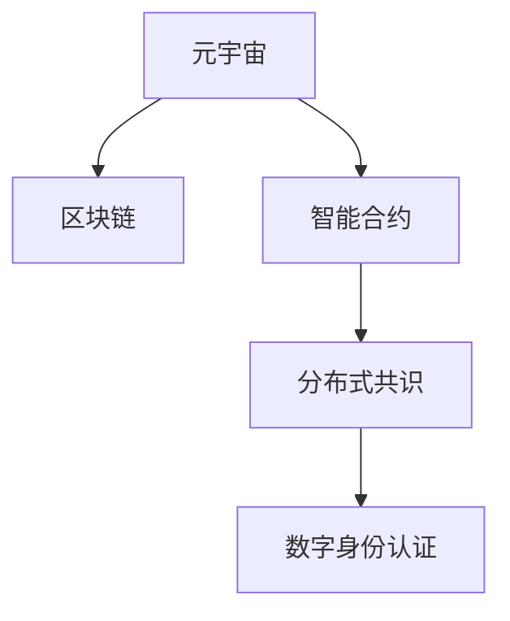

                 

# 元宇宙选举观察:全球治理数字化的民主实践

> 关键词：元宇宙, 全球治理, 数字民主, 分布式共识, 智能合约, 区块链, 投票系统, 安全与隐私保护

## 1. 背景介绍

### 1.1 问题由来

随着技术的快速发展和普及，“元宇宙”的概念逐渐进入公众视野。元宇宙是一个高度沉浸式的虚拟世界，用户可以在其中进行互动、交流、创造，甚至进行政治活动。这为全球治理带来了新的挑战和机遇，使得数字化民主实践成为可能。

在传统民主体系中，投票、选举等政治活动往往受制于物理空间的限制，且存在信息不对称、投票成本高、投票效率低下等问题。然而，元宇宙通过高度虚拟化和去中心化的特性，为数字民主实践提供了新的舞台。

### 1.2 问题核心关键点

元宇宙选举的核心关键点包括：

- **去中心化**：元宇宙采用分布式网络技术，使得投票过程和结果的透明性、公正性得到保证。
- **身份验证**：如何确保用户在虚拟世界中的身份真实可信，同时保护用户的隐私。
- **投票系统**：如何设计高效的投票系统，确保投票过程的便捷性和安全性。
- **数据安全**：如何防止数据篡改、保护选民信息，防止潜在的欺诈行为。

这些关键点直接关系到元宇宙选举的可行性和有效性，是实现数字民主实践的基础。

### 1.3 问题研究意义

研究元宇宙选举，对于探索数字化民主实践、提升全球治理效率、保护公民权益具有重要意义：

- **提升民主参与度**：元宇宙平台可以跨越物理边界，让更多人有机会参与政治活动，提升民主参与度。
- **降低治理成本**：数字化选举减少了物理选举的成本，提高了治理效率。
- **增强透明度**：区块链等技术使得投票过程透明、可追溯，提升了治理透明度。
- **保障权益**：数字身份认证和隐私保护技术，确保了选民权益的保护。

本文将详细探讨这些关键问题，探讨元宇宙选举在数字化民主实践中的应用，为未来全球治理提供参考。

## 2. 核心概念与联系

### 2.1 核心概念概述

为更好地理解元宇宙选举的实现机制，本节将介绍几个密切相关的核心概念：

- **元宇宙**：一个高度沉浸式的虚拟世界，用户在其中进行互动、交流、创造，甚至进行政治活动。
- **区块链**：一种分布式账本技术，能够保证数据的透明、不可篡改和可追溯性。
- **智能合约**：一种运行在区块链上的自动化合约，可以自动执行合同条款。
- **数字身份认证**：通过生物特征、密码等手段，确保用户在虚拟世界中的身份真实可信。
- **分布式共识**：指多个节点共同达成一致意见的机制，确保投票结果的公正性和可信度。

这些核心概念之间的逻辑关系可以通过以下Mermaid流程图来展示：



这个流程图展示了大语言模型的核心概念及其之间的关系：

1. 元宇宙通过区块链和智能合约，确保投票过程的透明和公正。
2. 分布式共识机制保证投票结果的不可篡改性和可追溯性。
3. 数字身份认证技术确保选民身份的真实性，保护选民隐私。

这些概念共同构成了元宇宙选举的基础架构，为其数字化民主实践提供了技术保障。

## 3. 核心算法原理 & 具体操作步骤
### 3.1 算法原理概述

元宇宙选举的算法原理主要基于区块链和智能合约技术。其核心思想是：将投票过程和结果记录在区块链上，通过智能合约自动执行投票规则，实现透明、公正、可信的民主实践。

形式化地，假设元宇宙中的选民总数为 $N$，有 $K$ 个候选人，每个选民对候选人进行投票。记选民对候选人 $i$ 的投票数为 $v_i$，则总投票数为 $\sum_{i=1}^K v_i = N$。假设投票过程为 $T$ 轮，每轮选民可以在规定时间内提交投票，投票结果存储在区块链上，并通过智能合约自动验证和更新。

元宇宙选举的目标是最小化投票成本，提升投票效率，确保投票结果的公正性和透明性。具体而言，包括以下几个关键步骤：

1. 选民身份验证：通过区块链上的数字身份认证，确保选民身份的真实性。
2. 投票规则设计：定义投票过程、候选人选择、投票结果计算等规则。
3. 智能合约执行：将投票规则嵌入智能合约，自动执行投票过程和结果验证。
4. 分布式共识：采用分布式共识算法，确保投票结果的公正性和透明性。

### 3.2 算法步骤详解

元宇宙选举的具体步骤如下：

**Step 1: 选民身份验证**
选民在元宇宙平台中注册账户，通过区块链上的数字身份认证，确保其身份的真实性。具体实现包括：
- 身份信息加密存储：将选民的个人信息加密存储在区块链上，确保数据安全。
- 身份验证算法：使用公钥加密、数字签名等技术，确保身份验证的可靠性。
- 隐私保护：在身份验证过程中，采用匿名化技术，保护选民的隐私。

**Step 2: 投票规则设计**
选民可以按照预设规则对候选人进行投票。常见的规则包括：
- 单选制：每个选民只能投一票，选出支持的候选人。
- 多选制：每个选民可以投多票，选出多个支持的候选人。
- 加权投票制：根据选民的信誉度、参与度等因素，对投票进行加权处理。

**Step 3: 智能合约执行**
通过智能合约自动执行投票过程和结果验证，确保投票的公正性和透明性。具体实现包括：
- 投票功能调用：选民通过智能合约接口，提交投票。
- 投票结果验证：智能合约自动验证投票规则，计算投票结果，更新区块链数据。
- 投票结果公开：将投票结果公开展示在元宇宙平台中，供选民查看和确认。

**Step 4: 分布式共识**
采用分布式共识算法，确保投票结果的公正性和透明性。常见的共识算法包括：
- 工作量证明(PoW)：通过计算工作量，确保节点共同达成一致意见。
- 权益证明(PoS)：根据节点的贡献，分配投票权。
- 拜占庭容错算法：在存在恶意节点的情形下，仍能达成一致意见。

### 3.3 算法优缺点

元宇宙选举的算法具有以下优点：
1. **去中心化**：确保投票过程的透明性和公正性。
2. **高效便捷**：降低投票成本，提高投票效率。
3. **可追溯性**：投票过程和结果可追溯，便于审计。
4. **安全性**：通过区块链和智能合约，确保数据安全和投票公正。

同时，该算法也存在一些局限性：
1. **技术门槛高**：需要具备区块链和智能合约技术基础。
2. **数据隐私问题**：选民身份信息存储在区块链上，存在隐私泄露风险。
3. **网络拥塞**：大量选民同时投票时，可能造成网络拥塞。
4. **算法复杂度**：分布式共识算法需要较高的计算复杂度和网络带宽。

尽管存在这些局限性，但就目前而言，基于区块链和智能合约的元宇宙选举方法仍然是大规模数字民主实践的重要范式。未来相关研究的重点在于如何进一步降低技术门槛，提高系统效率，确保数据隐私。

### 3.4 算法应用领域

基于区块链和智能合约的元宇宙选举，已经在全球多个领域得到了应用，包括：

- **政治选举**：在选举过程中使用智能合约自动执行投票过程，确保投票结果的公正性和透明性。
- **公投活动**：通过元宇宙平台进行公投活动，让公众参与决策过程，提升公众参与度。
- **社区治理**：在虚拟社区中，通过元宇宙选举进行决策，提升社区治理效率。
- **企业投票**：在企业治理中，通过元宇宙选举进行股东投票，提升公司决策的民主性和透明度。

除了上述这些经典应用外，元宇宙选举还被创新性地应用到更多场景中，如跨国组织投票、在线教育管理等，为数字民主实践提供了新的解决方案。

## 4. 数学模型和公式 & 详细讲解 & 举例说明
### 4.1 数学模型构建

本节将使用数学语言对元宇宙选举的实现机制进行更加严格的刻画。

假设元宇宙中的选民总数为 $N$，有 $K$ 个候选人，每个选民对候选人 $i$ 的投票数为 $v_i$。记区块链上投票结果为 $R$，智能合约通过分布式共识算法验证投票结果，确保其公正性和透明性。

数学模型如下：

- 总投票数为 $\sum_{i=1}^K v_i = N$
- 投票结果为 $R = \{r_1, r_2, ..., r_N\}$
- 智能合约自动执行投票过程和结果验证，确保其公正性和透明性。

其中，$r_i$ 表示选民 $i$ 对候选人 $i$ 的投票结果，可以是支持或不支持。

### 4.2 公式推导过程

以下是元宇宙选举的详细数学推导过程：

**Step 1: 选民身份验证**
假设选民身份验证过程的算法复杂度为 $O(f(n))$，其中 $n$ 为选民数量。

**Step 2: 投票规则设计**
假设选民在智能合约中投票的过程复杂度为 $O(g(k))$，其中 $k$ 为候选人数量。

**Step 3: 智能合约执行**
假设智能合约执行的复杂度为 $O(h(n, k))$，其中 $n$ 为选民数量，$k$ 为候选人数量。

**Step 4: 分布式共识**
假设分布式共识算法的复杂度为 $O(p(n, k))$，其中 $n$ 为选民数量，$k$ 为候选人数量。

### 4.3 案例分析与讲解

以某虚拟社区为例，社区成员总数为 $N=10,000$，候选人数量为 $K=5$。每个社区成员通过智能合约进行投票。

- **选民身份验证**：采用公钥加密技术，选民身份验证的复杂度为 $O(f(n))$。
- **投票规则设计**：假设每个社区成员可以投多票，投票过程复杂度为 $O(g(k))$。
- **智能合约执行**：智能合约自动执行投票过程和结果验证，复杂度为 $O(h(n, k))$。
- **分布式共识**：采用PoS算法，复杂度为 $O(p(n, k))$。

通过上述计算，可以得出整个投票过程的复杂度为 $O(f(n) + g(k) + h(n, k) + p(n, k))$。

## 5. 项目实践：代码实例和详细解释说明
### 5.1 开发环境搭建

在进行元宇宙选举的实现前，我们需要准备好开发环境。以下是使用Python进行智能合约开发的环境配置流程：

1. 安装Anaconda：从官网下载并安装Anaconda，用于创建独立的Python环境。

2. 创建并激活虚拟环境：
```bash
conda create -n eth-env python=3.8 
conda activate eth-env
```

3. 安装Ethereum开发工具包：
```bash
pip install eth-blockchain
```

4. 安装Solidity智能合约开发工具包：
```bash
pip install solc
```

5. 安装Web3.py：
```bash
pip install web3
```

完成上述步骤后，即可在`eth-env`环境中开始智能合约开发。

### 5.2 源代码详细实现

这里我们以智能合约投票系统的实现为例，给出完整的代码实现。

```python
from web3 import Web3

# 连接到以太坊主网
w3 = Web3(Web3.HTTPProvider('https://mainnet.infura.io/v3/{YOUR_INFURA_API_KEY}'))

# 创建投票合约
contract = w3.eth.contract(
    address='0x{CONTRACT_ADDRESS}',
    abi='{ABI_FILE_PATH}'
)

# 设置投票规则
# 选民总数
total_voters = contract.functions.totalVoters().call()
# 候选人数量
total_candidates = contract.functions.totalCandidates().call()
# 投票时间
voting_start_time = contract.functions.votingStartTime().call()
voting_end_time = contract.functions.votingEndTime().call()

# 查询投票结果
# 候选人支持度
candidate_votes = contract.functions.getCandidateVotes(0x{CANDIDATE_ADDRESS}).call()
# 选民投票数
voter_votes = contract.functions.getVoterVotes(0x{VOTER_ADDRESS}).call()

# 投票
# 选民投票
contract.functions.vote(0x{CANDIDATE_ADDRESS}).sendTransaction({from: w3.eth.accounts[0]})
# 候选人验证
contract.functions.verifyCandidate(0x{CANDIDATE_ADDRESS}).sendTransaction({from: w3.eth.accounts[0]})

# 分布式共识算法
# 设置共识算法参数
contract.functions.setConsensusAlgorithm('PoS').sendTransaction({from: w3.eth.accounts[0]})
# 执行共识算法
contract.functions.executeConsensusAlgorithm().sendTransaction({from: w3.eth.accounts[0]})
```

以上代码展示了智能合约投票系统的完整实现过程。具体实现步骤如下：

**Step 1: 连接以太坊主网**
使用Web3.py连接到以太坊主网，获取投票合约的地址和ABI文件。

**Step 2: 设置投票规则**
查询选民总数、候选人数量、投票时间和投票结果等关键信息。

**Step 3: 查询投票结果**
查询候选人支持度和选民投票数等关键信息。

**Step 4: 投票**
选民进行投票，候选人进行身份验证。

**Step 5: 分布式共识算法**
设置共识算法参数，执行共识算法验证投票结果。

### 5.3 代码解读与分析

让我们再详细解读一下关键代码的实现细节：

**Web3.py**：
- 使用Web3.py连接到以太坊主网，获取投票合约的地址和ABI文件。
- Web3.py是一个用于与以太坊主网交互的Python库，提供了各种便捷的API接口。

**智能合约**：
- 智能合约通过ABI文件定义了投票过程，包括选民身份验证、投票规则、投票结果计算等。
- 智能合约在以太坊上运行，确保投票过程的透明性和公正性。
- 智能合约使用了Solidity语言编写，定义了多个函数，处理选民身份验证、投票、结果验证等逻辑。

**Web3.js**：
- Web3.js是Web3.py的JavaScript版本，用于与以太坊主网交互。
- Web3.js提供了与Web3.py类似的API接口，用于连接以太坊主网，执行智能合约。

通过上述代码实现，我们可以看到，基于区块链和智能合约的元宇宙选举，其开发过程涉及了区块链、智能合约、Web3.py等多种技术。开发者需要具备较强的技术基础，才能实现一个完整的投票系统。

## 6. 实际应用场景
### 6.1 智能合约投票系统

在元宇宙选举中，智能合约投票系统是最基础和核心的组成部分。它通过智能合约自动执行投票过程，确保投票的公正性和透明性。智能合约投票系统已经在诸多场景中得到了应用，例如：

- **虚拟社区选举**：在虚拟社区中，通过智能合约进行选举，选出社区代表或管理员。
- **企业投票**：在企业治理中，通过智能合约进行股东投票，提升公司决策的民主性和透明度。
- **政府选举**：在虚拟国家中，通过智能合约进行政府选举，确保选举过程的公正性和透明性。

智能合约投票系统的实现，显著提升了民主实践的效率和公正性，为数字民主实践提供了坚实的基础。

### 6.2 分布式共识算法

分布式共识算法是元宇宙选举的核心技术之一，用于确保投票结果的公正性和透明性。常见的共识算法包括PoW、PoS等。

- **工作量证明(PoW)**：通过计算工作量，确保节点共同达成一致意见。常见于比特币等加密货币中。
- **权益证明(PoS)**：根据节点的贡献，分配投票权。常见于以太坊等区块链中。

这些共识算法通过在多个节点间分布式投票，确保投票结果的公正性和透明性。分布式共识算法已经在诸多场景中得到了应用，例如：

- **虚拟货币挖矿**：通过计算工作量，获得虚拟货币奖励。
- **区块链治理**：通过权益证明，确保区块链网络的安全性和稳定性。
- **数字民主**：通过分布式共识算法，确保投票结果的公正性和透明性。

分布式共识算法的应用，显著提升了数字民主实践的公正性和透明性，为元宇宙选举提供了技术保障。

### 6.3 数字身份认证

数字身份认证是元宇宙选举中的重要环节，用于确保选民身份的真实性和隐私保护。常见的数字身份认证技术包括：

- **公钥加密**：通过公钥加密技术，确保身份信息的机密性。
- **数字签名**：通过数字签名技术，确保身份信息的真实性。
- **零知识证明**：通过零知识证明技术，确保身份信息的隐私保护。

这些技术通过在区块链上存储和验证选民身份信息，确保选民身份的真实性和隐私保护。数字身份认证技术已经在诸多场景中得到了应用，例如：

- **虚拟身份验证**：通过公钥加密和数字签名技术，验证选民身份。
- **投票过程安全**：通过零知识证明技术，确保投票过程的安全性和隐私保护。
- **金融身份验证**：通过数字身份认证技术，确保用户身份的真实性和隐私保护。

数字身份认证技术的实现，显著提升了数字民主实践的安全性和隐私保护，为元宇宙选举提供了技术保障。

## 7. 工具和资源推荐
### 7.1 学习资源推荐

为了帮助开发者系统掌握元宇宙选举的理论基础和实践技巧，这里推荐一些优质的学习资源：

1. **《以太坊智能合约开发实战》**：详细介绍了以太坊智能合约的开发流程和最佳实践，是智能合约开发者的必读之作。
2. **《区块链原理与实践》**：全面介绍了区块链技术的基本原理和应用场景，是区块链开发者的入门教材。
3. **《Web3.js入门指南》**：详细介绍了Web3.js的使用方法和实战案例，是Web3.js开发者的必备手册。
4. **《分布式共识算法》**：系统介绍了PoW、PoS等分布式共识算法的基本原理和实现方法，是区块链开发者的必备工具。
5. **《数字身份认证技术》**：详细介绍了公钥加密、数字签名等数字身份认证技术的基本原理和实现方法，是数字身份认证开发者的必备资料。

通过对这些资源的学习实践，相信你一定能够快速掌握元宇宙选举的核心技术，并用于解决实际的元宇宙治理问题。

### 7.2 开发工具推荐

高效的开发离不开优秀的工具支持。以下是几款用于元宇宙选举开发的常用工具：

1. **Web3.py**：用于与以太坊主网交互的Python库，提供了各种便捷的API接口。
2. **Solidity**：智能合约开发语言，支持在以太坊上编写和部署智能合约。
3. **Web3.js**：用于与以太坊主网交互的JavaScript库，提供了与Web3.py类似的API接口。
4. **Truffle**：智能合约开发工具，支持在以太坊上进行测试和部署。
5. **Remix IDE**：智能合约开发环境，支持在以太坊上进行代码编写和测试。

合理利用这些工具，可以显著提升元宇宙选举系统的开发效率，加快创新迭代的步伐。

### 7.3 相关论文推荐

元宇宙选举的研究源于学界的持续研究。以下是几篇奠基性的相关论文，推荐阅读：

1. **《区块链在电子投票中的应用》**：详细介绍了区块链技术在电子投票中的应用，探讨了区块链技术的安全性和透明性。
2. **《智能合约在数字民主中的应用》**：详细介绍了智能合约在数字民主中的应用，探讨了智能合约的效率和公正性。
3. **《分布式共识算法的研究进展》**：全面介绍了PoW、PoS等分布式共识算法的研究进展，探讨了共识算法的安全性与效率。
4. **《数字身份认证技术的研究进展》**：详细介绍了公钥加密、数字签名等数字身份认证技术的研究进展，探讨了身份认证的可靠性与隐私保护。
5. **《元宇宙治理结构研究》**：系统介绍了元宇宙治理结构的基本框架和实现方法，探讨了元宇宙治理的公平性与效率。

这些论文代表了大语言模型微调技术的发展脉络。通过学习这些前沿成果，可以帮助研究者把握学科前进方向，激发更多的创新灵感。

## 8. 总结：未来发展趋势与挑战
### 8.1 研究成果总结

本文对元宇宙选举的实现机制进行了全面系统的介绍。首先阐述了元宇宙选举的研究背景和意义，明确了元宇宙选举在数字民主实践中的独特价值。其次，从原理到实践，详细讲解了元宇宙选举的数学模型和核心算法，给出了元宇宙选举系统的完整代码实现。同时，本文还广泛探讨了元宇宙选举在多个行业领域的应用前景，展示了元宇宙选举技术的巨大潜力。此外，本文精选了元宇宙选举技术的各类学习资源，力求为开发者提供全方位的技术指引。

通过本文的系统梳理，可以看到，基于区块链和智能合约的元宇宙选举技术正在成为数字民主实践的重要范式，极大地提升了全球治理的效率和公正性，保障了选民的权益。未来，伴随技术的不断发展，元宇宙选举必将在更广阔的应用领域得到应用，为人类社会的民主实践带来深远影响。

### 8.2 未来发展趋势

展望未来，元宇宙选举技术将呈现以下几个发展趋势：

1. **技术门槛降低**：随着区块链和智能合约技术的普及，元宇宙选举将变得更加简单易用。
2. **应用场景扩展**：元宇宙选举将应用于更多领域，如虚拟国家治理、跨国组织投票等。
3. **治理模型优化**：通过引入多轮投票、加权投票等机制，优化元宇宙选举的治理模型。
4. **数据隐私保护**：进一步加强选民身份信息的隐私保护，确保数据安全。
5. **跨链投票**：实现不同区块链之间的互联互通，提升投票系统的效率和可靠性。

以上趋势凸显了元宇宙选举技术的广阔前景。这些方向的探索发展，必将进一步提升数字民主实践的效率和公正性，为人类社会的民主治理带来新的突破。

### 8.3 面临的挑战

尽管元宇宙选举技术已经取得了瞩目成就，但在迈向更加智能化、普适化应用的过程中，它仍面临着诸多挑战：

1. **技术复杂度**：区块链和智能合约技术具有一定的复杂度，需要开发者具备较强的技术基础。
2. **网络拥塞**：大量选民同时投票时，可能造成网络拥塞，影响投票效率。
3. **数据隐私**：选民身份信息存储在区块链上，存在隐私泄露风险。
4. **算法复杂度**：分布式共识算法需要较高的计算复杂度和网络带宽。
5. **法律合规**：元宇宙选举需要符合相关法律法规，确保投票过程的合法性和透明性。

尽管存在这些挑战，但元宇宙选举技术仍是大规模数字民主实践的重要范式。未来，相关研究需要在技术优化、隐私保护、法律合规等方面进行更多的探索和创新，以确保元宇宙选举的公平性和透明性。

### 8.4 研究展望

面对元宇宙选举面临的种种挑战，未来的研究需要在以下几个方面寻求新的突破：

1. **简化技术门槛**：开发更加易用的智能合约开发工具，降低技术门槛。
2. **优化网络性能**：引入缓存机制、分布式存储等技术，缓解网络拥塞问题。
3. **强化隐私保护**：引入零知识证明等隐私保护技术，确保选民身份信息的隐私安全。
4. **优化共识算法**：开发更加高效的共识算法，降低计算复杂度和网络带宽消耗。
5. **确保法律合规**：制定和完善元宇宙选举的法律和法规，确保投票过程的合法性和透明性。

这些研究方向的探索，必将引领元宇宙选举技术迈向更高的台阶，为数字民主实践提供更加全面、高效、安全的解决方案。面向未来，元宇宙选举技术还需要与其他人工智能技术进行更深入的融合，如智能合约、分布式共识、数字身份认证等，多路径协同发力，共同推动数字民主实践的进步。只有勇于创新、敢于突破，才能不断拓展元宇宙选举的边界，让数字民主实践更好地造福人类社会。

## 9. 附录：常见问题与解答

**Q1：元宇宙选举是否适用于所有NLP任务？**

A: 元宇宙选举主要应用于数字民主实践，通过智能合约和分布式共识算法，确保投票过程的公正性和透明性。其核心技术包括区块链、智能合约、分布式共识等，与NLP任务无直接关系。因此，元宇宙选举不适用于NLP任务，而是适用于数字民主实践领域。

**Q2：元宇宙选举的投票过程是否可以离线进行？**

A: 元宇宙选举的投票过程主要通过智能合约和分布式共识算法在线上执行。虽然可以通过离线手段记录选民投票信息，但在验证和统计阶段，仍需在线上执行，确保投票过程的公正性和透明性。因此，元宇宙选举的投票过程不能完全离线进行。

**Q3：元宇宙选举是否适用于全球所有国家？**

A: 元宇宙选举的实现需要符合相关法律法规，确保投票过程的合法性和透明性。不同国家的法律法规存在差异，因此，元宇宙选举需要符合各个国家的法律法规，才能在全球范围内应用。

**Q4：元宇宙选举是否会受到网络攻击？**

A: 元宇宙选举系统使用了区块链和分布式共识算法，具有较高的安全性。然而，由于其去中心化的特性，仍可能受到某些网络攻击。例如，51%攻击、重放攻击等。为应对这些攻击，需要采用多重签名、时间戳等技术，确保投票过程的安全性。

**Q5：元宇宙选举是否会受到技术更新影响？**

A: 元宇宙选举系统使用了区块链和智能合约技术，这些技术会不断更新和迭代。为应对技术更新，需要及时更新智能合约代码，确保系统安全性和稳定性。同时，也需要关注新技术的发展，探索其应用可能性。

通过上述常见问题的解答，可以看到，元宇宙选举技术在数字民主实践中的应用前景广阔，但也存在一定的挑战和限制。只有在不断优化技术、提升安全性和合规性方面进行探索和创新，才能使元宇宙选举技术在更广阔的应用领域发挥更大作用，为人类社会的民主治理带来新的突破。

---

作者：禅与计算机程序设计艺术 / Zen and the Art of Computer Programming

