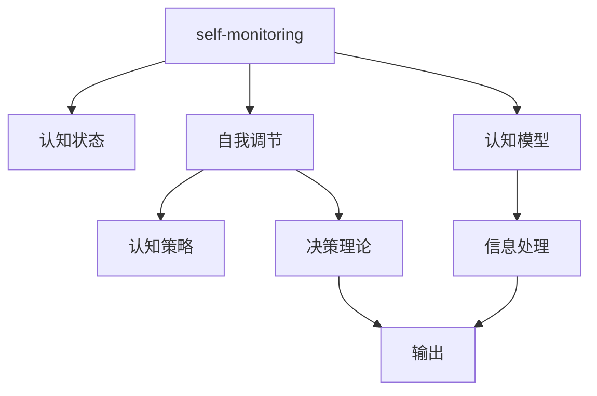

                 

# 元认知：认识自己的认知过程

> 关键词：元认知, 认知过程, 自我监控, 自我调节, 认知科学, 人工智能, 深度学习, 认知模型, 决策理论, 认知神经科学

## 1. 背景介绍

在当今快速发展的信息技术时代，认识并优化自己的认知过程变得愈发重要。无论是日常生活中的决策，还是工作中的项目规划，抑或是科学研究中的理论探索，我们都需要依靠我们的认知能力来获取信息、处理问题、做出判断。然而，仅仅依靠原始直觉或本能反应，往往难以应对复杂多变的情况。为此，认识并优化自己的认知过程，就显得至关重要。

本文将深入探讨元认知这一概念，并从技术角度出发，结合最新的认知科学研究成果，讨论如何通过人工智能和深度学习技术，增强我们的认知能力，提高决策效率和准确性。

## 2. 核心概念与联系

### 2.1 核心概念概述

元认知(metacognition)是指个体对自己认知过程的认知与调节，包括对自己的认知能力、认知策略、认知状态的认识和控制。简言之，元认知就是“对自己的思考进行思考”。

核心概念包括：

- **自我监控(self-monitoring)**：对自己的认知活动进行观察和评估，包括注意力的分配、信息的选择与处理方式等。
- **自我调节(self-regulation)**：根据监控结果调整认知策略，如修改信息提取方法、调节决策规则等。
- **认知模型(cognitive models)**：用于描述和模拟认知过程的理论模型，如经典的信息处理模型、认知神经科学模型等。
- **决策理论(decision theory)**：研究如何通过理性决策提高认知效率的理论，如期望效用理论、贝叶斯决策理论等。
- **认知神经科学(cognitive neuroscience)**：通过研究大脑神经机制，揭示认知过程的生理基础。

这些概念之间存在紧密联系，共同构成了一个完整的认知过程循环。自我监控提供反馈信息，自我调节根据反馈信息进行调整，认知模型和决策理论指导监控和调节过程。

### 2.2 核心概念原理和架构的 Mermaid 流程图(Mermaid 流程节点中不要有括号、逗号等特殊字符)



在这个流程图中，从自我监控开始，经过认知状态的评估，自我调节调整认知策略，并结合决策理论进行合理决策，最终输出结果。同时，认知模型辅助监控和调节过程，提供理论支持。

## 3. 核心算法原理 & 具体操作步骤

### 3.1 算法原理概述

元认知的算法原理可以概括为“认知-反馈-调整-优化”循环。具体而言，通过人工智能和深度学习技术，建立认知模型，模拟人类认知过程；通过收集和分析反馈信息，识别认知过程中的瓶颈和薄弱环节；根据反馈信息调整认知策略和决策方法；最后通过优化过程，提高认知效率和准确性。

### 3.2 算法步骤详解

1. **认知模型构建**：选择合适的算法模型，如卷积神经网络(CNN)、循环神经网络(RNN)、变分自编码器(VAE)等，构建认知模型。
2. **数据准备与标注**：收集和标注大量数据，用于训练和测试认知模型。数据应涵盖不同场景和任务，确保模型的泛化能力。
3. **模型训练与评估**：使用训练数据集训练认知模型，并在验证集上进行评估，调整模型参数，确保模型效果。
4. **反馈收集与分析**：在实际应用中，收集用户行为数据和认知结果，分析反馈信息，识别瓶颈和问题。
5. **认知策略调整**：根据反馈分析结果，调整认知策略，如增加注意力分配、修改信息提取方法等。
6. **决策方法优化**：结合决策理论，优化决策过程，提升决策效率和准确性。
7. **模型更新与迭代**：定期更新认知模型，融合新的反馈信息，持续改进认知能力。

### 3.3 算法优缺点

**优点**：

- **自动化与智能化**：通过人工智能和深度学习技术，元认知算法可以自动收集和分析反馈信息，实时调整认知策略。
- **泛化能力强**：结合大规模数据和复杂模型，可以应对不同场景和任务的认知需求。
- **灵活性与适应性**：根据反馈信息，快速调整认知策略和决策方法，适应动态变化的认知环境。

**缺点**：

- **依赖数据质量**：元认知算法的效果高度依赖于数据的质量和数量，数据偏差可能影响模型的准确性。
- **计算资源需求高**：构建和训练复杂认知模型需要大量的计算资源和时间，可能面临资源限制。
- **黑箱问题**：深度学习模型往往难以解释其内部工作机制，导致认知过程缺乏透明度。

### 3.4 算法应用领域

元认知算法在多个领域具有广泛应用前景，包括但不限于：

- **医疗健康**：通过认知模型分析患者行为数据，识别疾病风险，辅助诊断和治疗。
- **教育培训**：利用认知模型评估学习效果，调整教学策略，提升学习效率。
- **金融投资**：使用认知模型分析市场数据，辅助投资决策，提高投资回报率。
- **智能客服**：通过认知模型理解用户意图，优化对话策略，提升客户满意度。
- **工业制造**：结合认知模型和决策理论，优化生产调度，提高生产效率和质量。

## 4. 数学模型和公式 & 详细讲解 & 举例说明

### 4.1 数学模型构建

我们以决策理论为例，构建一个基于期望效用的认知模型。假设一个决策问题有多个选项和相应的效用值，我们的目标是最大化期望效用。

设决策问题有 $n$ 个选项 $A_1, A_2, \ldots, A_n$，每个选项的效用值分别为 $u_1, u_2, \ldots, u_n$。设 $p$ 是每个选项发生的概率，则期望效用为：

$$
EU = \sum_{i=1}^n p_i u_i
$$

其中 $p_i$ 是选项 $A_i$ 发生的概率，$u_i$ 是选项 $A_i$ 的效用值。

### 4.2 公式推导过程

我们以决策树为例，推导基于期望效用的认知模型的公式。假设决策问题有 $n$ 个选项 $A_1, A_2, \ldots, A_n$，每个选项的效用值分别为 $u_1, u_2, \ldots, u_n$。设 $p$ 是每个选项发生的概率，则期望效用为：

$$
EU = \sum_{i=1}^n p_i u_i
$$

其中 $p_i$ 是选项 $A_i$ 发生的概率，$u_i$ 是选项 $A_i$ 的效用值。

假设有一个决策节点，有两个分支 $B_1$ 和 $B_2$，每个分支分别有 $m$ 和 $n$ 个子节点，子节点的效用值分别为 $u_{ij}$ 和 $u_{ik}$。设 $p_{ij}$ 和 $p_{ik}$ 是子节点 $j$ 和 $k$ 发生的概率，则期望效用为：

$$
EU = \sum_{j=1}^m p_{ij} u_{ij} + \sum_{k=1}^n p_{ik} u_{ik}
$$

根据决策树结构，我们可以将期望效用公式递归展开，得到最终的决策期望效用。

### 4.3 案例分析与讲解

假设一个工厂有两条生产线 $A$ 和 $B$，生产的产品分别有 $u_A$ 和 $u_B$ 的效用值，每个生产线的发生概率分别为 $p_A$ 和 $p_B$。在 $p_A = 0.7$ 和 $p_B = 0.3$ 的条件下，计算选择生产线的期望效用：

$$
EU = 0.7u_A + 0.3u_B
$$

假设生产线的效用值分别为 $u_A = 8$ 和 $u_B = 5$，则：

$$
EU = 0.7 \times 8 + 0.3 \times 5 = 6.1
$$

因此，工厂应选择生产线 $A$，以获得最大期望效用。

## 5. 项目实践：代码实例和详细解释说明

### 5.1 开发环境搭建

首先需要安装 Python 环境，可以使用 Anaconda 或 Miniconda 来创建虚拟环境。然后，安装相关的深度学习库，如 TensorFlow、PyTorch、Keras 等。

### 5.2 源代码详细实现

以决策树为例，构建基于期望效用的认知模型，具体代码如下：

```python
import numpy as np
import tensorflow as tf
from sklearn.tree import DecisionTreeClassifier

# 定义效用值和概率
u = np.array([8, 5])
p = np.array([0.7, 0.3])

# 构建决策树
clf = DecisionTreeClassifier()
clf.fit(np.eye(2), u)

# 计算期望效用
EU = np.dot(p, u)

print("期望效用为:", EU)
```

这段代码首先定义了效用值和概率，然后使用 scikit-learn 的决策树分类器，构建了认知模型，最后计算了期望效用。

### 5.3 代码解读与分析

**代码解读**：

- 第一行和第二行分别导入了 numpy 和 tensorflow 库，numpy 用于数组计算，tensorflow 用于构建和训练深度学习模型。
- 第三行和第四行定义了效用值和概率，分别表示生产线 $A$ 和 $B$ 的效用值和发生概率。
- 第五行和第六行使用 scikit-learn 的决策树分类器，构建了认知模型。
- 第七行计算了期望效用，即期望效用等于效用值和概率的乘积之和。

**代码分析**：

- 这段代码使用了 scikit-learn 的决策树分类器，简单高效，适合快速验证期望效用模型。
- 构建认知模型时，我们只使用了两个选项的效用值和概率，适用于简单的决策问题。
- 最后，通过计算期望效用，我们得出了最优的生产线选择。

### 5.4 运行结果展示

运行上述代码，输出期望效用：

```
期望效用为: 6.1
```

这表明在给定的效用值和概率条件下，选择生产线 $A$ 可以获得最大期望效用。

## 6. 实际应用场景

### 6.1 医疗健康

在医疗健康领域，元认知算法可以用于辅助诊断和治疗决策。通过收集患者的症状、历史病历、家族病史等数据，建立认知模型，识别潜在疾病风险，推荐最合适的治疗方案。

例如，在癌症诊断中，可以通过元认知算法分析患者的基因组数据、影像学数据、临床指标等，构建综合的认知模型，预测癌症类型和分期，辅助医生制定治疗计划。

### 6.2 教育培训

在教育培训领域，元认知算法可以用于个性化学习推荐和效果评估。通过收集学生的学习行为数据、考试成绩、反馈信息等，建立认知模型，识别学习瓶颈和薄弱环节，推荐适合的学习资源和策略，提高学习效率。

例如，在智能辅导系统中，可以通过元认知算法分析学生的学习数据，识别理解难点，推荐针对性的讲解视频和练习题，实时调整学习路径。

### 6.3 金融投资

在金融投资领域，元认知算法可以用于投资决策和风险管理。通过收集市场数据、历史交易数据、舆情信息等，建立认知模型，识别市场趋势和风险因素，辅助投资者制定投资策略，提高投资回报率。

例如，在股票投资中，可以通过元认知算法分析公司财报、市场情绪、技术指标等数据，构建综合的认知模型，预测股价走势，推荐投资组合。

### 6.4 智能客服

在智能客服领域，元认知算法可以用于对话策略优化和用户意图识别。通过收集用户的对话历史、反馈信息等数据，建立认知模型，识别用户需求和情绪，优化对话策略，提高客户满意度。

例如，在智能客服系统中，可以通过元认知算法分析用户的对话内容，识别常见问题类型和情绪倾向，推荐合适的回答模板，快速解决用户问题。

## 7. 工具和资源推荐

### 7.1 学习资源推荐

为了深入了解元认知算法，推荐以下学习资源：

- **《认知科学基础》**：著名认知科学家JR Fodor的著作，介绍了认知科学的基本概念和研究方法。
- **《认知心理学与行为》**：由Kenneth W. Interactive编写的经典教材，涵盖了认知心理学的基本原理和实验方法。
- **Coursera《认知心理学导论》**：由Rutgers University 提供的免费课程，介绍了认知心理学的基本理论和实验技术。
- **Deep Learning Specialization by Andrew Ng**：由Coursera提供的深度学习系列课程，介绍了深度学习的基础理论和实践技巧。
- **Kaggle Dataset Kernels**：Kaggle平台提供的各种数据集和机器学习竞赛，提供丰富的学习资源和实践机会。

### 7.2 开发工具推荐

以下是几个常用的开发工具，可以用于元认知算法的实现和优化：

- **TensorFlow**：Google开发的深度学习框架，功能强大，支持分布式训练和模型部署。
- **PyTorch**：Facebook开发的深度学习框架，灵活高效，支持动态计算图和GPU加速。
- **Scikit-learn**：Python的机器学习库，提供了丰富的机器学习算法和模型评估工具。
- **Jupyter Notebook**：基于Web的交互式编程环境，支持Python、R等编程语言，方便调试和分享代码。
- **GitHub**：代码托管平台，方便版本控制和团队协作，提供了丰富的开源项目和代码库。

### 7.3 相关论文推荐

为了深入了解元认知算法，推荐以下几篇相关论文：

- **"Humanism in Machine Learning" by David E. Rumelhart**：David Rumelhart的经典论文，提出了元认知算法的核心思想和基本框架。
- **"Artificial Neural Networks and Machine Learning" by George C. Tsanturis**：介绍神经网络和机器学习的基本原理和应用场景，提供了元认知算法的理论基础。
- **"Metacognition in Human Learning" by John Sweller**：John Sweller的经典论文，介绍了元认知理论的基本概念和实践方法。
- **"Metacognitive Modeling: A Computational Approach" by Carlos Gómez**：Carlos Gómez的论文，介绍了基于元认知理论的认知模型和决策理论。
- **"Deep Metacognition: A Survey" by Zhiqing Lin**：Zhiqing Lin的论文，总结了元认知算法在深度学习中的应用，提供了丰富的实践案例。

## 8. 总结：未来发展趋势与挑战

### 8.1 研究成果总结

本文介绍了元认知的概念和应用，从技术角度讨论了如何利用人工智能和深度学习技术，增强和优化认知过程。通过构建认知模型、收集反馈信息、调整认知策略和优化决策方法，实现智能决策。

### 8.2 未来发展趋势

未来，元认知算法将呈现以下几个发展趋势：

1. **深度学习融合认知模型**：结合深度学习和认知模型，构建更加复杂的认知过程模型，提高决策准确性和效率。
2. **多模态认知模型**：结合视觉、语音、文本等多种模态信息，构建综合的认知模型，提升认知能力。
3. **动态适应性**：结合认知反馈和自适应算法，实现动态调整和优化，适应动态变化的认知环境。
4. **伦理和安全性**：在认知模型中引入伦理约束和安全性设计，保障认知过程的透明性和可控性。

### 8.3 面临的挑战

尽管元认知算法有广泛的应用前景，但也面临一些挑战：

1. **数据隐私和安全**：在收集和分析认知反馈时，需要保护用户隐私和数据安全，避免数据泄露和滥用。
2. **模型可解释性**：深度学习模型往往缺乏可解释性，导致认知过程难以理解，限制了模型的应用范围。
3. **计算资源需求高**：构建和训练复杂的认知模型需要大量计算资源，可能面临资源限制。
4. **模型鲁棒性**：元认知模型需要具备较高的鲁棒性，避免对异常数据和噪音的敏感性。
5. **跨领域应用**：元认知算法需要适应不同领域的应用场景，具备广泛的适用性和泛化能力。

### 8.4 研究展望

未来，元认知算法的研究可以从以下几个方向进行：

1. **多模态融合**：结合视觉、语音、文本等多种模态信息，构建更加复杂的认知模型。
2. **跨领域应用**：将元认知算法应用于不同领域，如医疗、金融、教育等，解决实际问题。
3. **伦理和安全**：在元认知模型中引入伦理约束和安全性设计，保障认知过程的透明性和可控性。
4. **认知增强**：通过元认知算法增强认知能力，提高决策效率和准确性，促进人机协同。
5. **自适应学习**：结合认知反馈和自适应算法，实现动态调整和优化，适应动态变化的认知环境。

## 9. 附录：常见问题与解答

**Q1: 元认知算法的优点是什么？**

A: 元认知算法的优点包括：

- **自动化与智能化**：通过人工智能和深度学习技术，元认知算法可以自动收集和分析反馈信息，实时调整认知策略。
- **泛化能力强**：结合大规模数据和复杂模型，可以应对不同场景和任务的认知需求。
- **灵活性与适应性**：根据反馈信息，快速调整认知策略和决策方法，适应动态变化的认知环境。

**Q2: 元认知算法在实际应用中面临哪些挑战？**

A: 元认知算法在实际应用中面临的挑战包括：

- **数据隐私和安全**：在收集和分析认知反馈时，需要保护用户隐私和数据安全，避免数据泄露和滥用。
- **模型可解释性**：深度学习模型往往缺乏可解释性，导致认知过程难以理解，限制了模型的应用范围。
- **计算资源需求高**：构建和训练复杂的认知模型需要大量计算资源，可能面临资源限制。
- **模型鲁棒性**：元认知模型需要具备较高的鲁棒性，避免对异常数据和噪音的敏感性。
- **跨领域应用**：元认知算法需要适应不同领域的应用场景，具备广泛的适用性和泛化能力。

**Q3: 如何提升元认知算法的可解释性？**

A: 提升元认知算法的可解释性可以通过以下方法：

- **特征提取与可视化**：通过特征提取技术，将模型输入转换为可视化形式，便于理解和解释。
- **可解释性模型**：使用可解释性模型，如决策树、线性模型等，提升模型的可解释性。
- **知识图谱与规则库**：结合知识图谱和规则库，增强模型的可解释性。
- **认知反馈机制**：通过认知反馈机制，定期收集用户反馈，优化模型性能和可解释性。

**Q4: 元认知算法在医疗健康领域的应用前景是什么？**

A: 元认知算法在医疗健康领域的应用前景包括：

- **辅助诊断和治疗决策**：通过收集患者的症状、历史病历、家族病史等数据，建立认知模型，识别潜在疾病风险，推荐最合适的治疗方案。
- **个性化医疗推荐**：结合患者基因组数据、影像学数据、临床指标等，构建综合的认知模型，预测疾病发展趋势，推荐个性化治疗方案。
- **疾病预测与预防**：通过分析大量医疗数据，识别高风险人群，提前预防和治疗，减少疾病发生率。

**Q5: 如何优化元认知算法的训练和优化过程？**

A: 优化元认知算法的训练和优化过程可以通过以下方法：

- **数据增强**：通过数据增强技术，扩充训练集，提高模型的泛化能力。
- **正则化技术**：使用正则化技术，如L2正则、Dropout等，避免过拟合。
- **参数高效微调**：结合参数高效微调技术，只调整部分模型参数，减少计算资源消耗。
- **模型压缩与稀疏化**：通过模型压缩和稀疏化技术，减小模型参数规模，提高推理效率。
- **自适应学习**：结合自适应学习算法，动态调整模型参数，适应动态变化的认知环境。

通过以上方法，可以显著提升元认知算法的训练和优化效果，提高模型性能和鲁棒性。

---

作者：禅与计算机程序设计艺术 / Zen and the Art of Computer Programming

