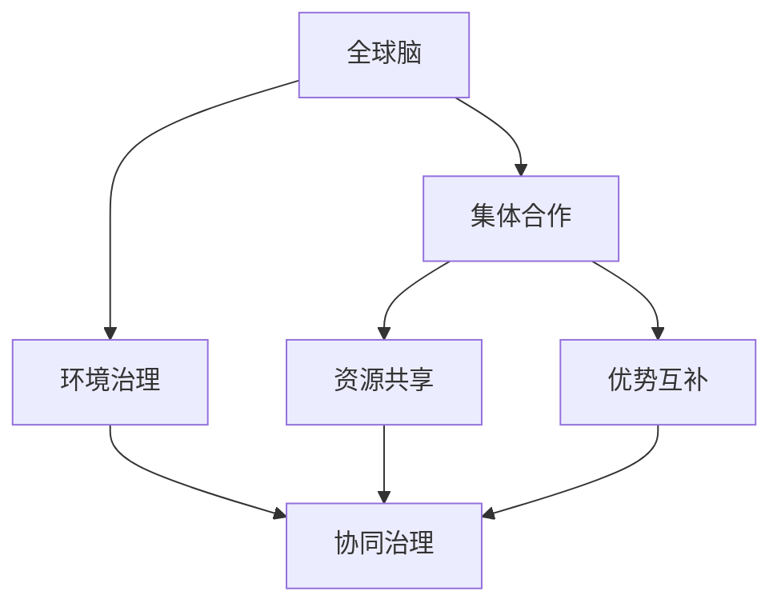

                 

# 全球脑与全球环境：集体合作的环境治理

## 1. 背景介绍

### 1.1 问题由来
随着全球化的加速，人类活动对地球环境的影响愈发显著。环境污染、气候变化、生态失衡等问题的严重性日益凸显。这些问题不再局限于某一地区或国家，而是全球性的挑战，亟需全球范围内的合作与治理。

### 1.2 问题核心关键点
环境治理的核心在于协调各国利益、技术、资源和政策，共同应对环境危机。传统环境治理方式通常以国家为单位，强调单边行动和内部政策。然而，全球环境问题的复杂性和全球性要求更高层次的合作与协调。

### 1.3 问题研究意义
全球环境治理的研究意义重大，不仅关系到地球的可持续发展，还关系到人类社会的未来福祉。全球化背景下，只有通过集体合作，才能有效应对环境挑战，实现可持续发展目标。

## 2. 核心概念与联系

### 2.1 核心概念概述

为更好地理解全球环境治理的集体合作机制，本节将介绍几个密切相关的核心概念：

- **全球脑**：指全球范围内的智慧和资源集结，通过互联网和通信技术，实现信息共享和协作。
- **环境治理**：指通过政策、法规、技术手段等，对人类活动对环境的负面影响进行控制和修复。
- **集体合作**：指各国、组织和个体之间，围绕共同目标进行协调、分工与合作，实现资源共享和优势互补。
- **协同治理**：指多个治理主体共同参与，利用各自的资源和优势，协作解决环境问题。

这些核心概念之间的逻辑关系可以通过以下Mermaid流程图来展示：



这个流程图展示了几者之间的关系：

1. 全球脑通过信息共享，为环境治理提供智慧和技术支持。
2. 环境治理需要集体合作，才能实现全球性的资源调配和技术推广。
3. 协同治理是集体合作的具体实现，通过多方协作解决环境问题。

## 3. 核心算法原理 & 具体操作步骤
### 3.1 算法原理概述

全球环境治理的集体合作机制，本质上是一个多层次、多主体的协同优化过程。其核心思想是：通过构建全球范围内的智慧共享平台，利用大数据、人工智能等技术手段，实现环境治理目标的优化。

形式化地，假设全球脑中的各个智慧节点为 $N$，环境治理目标为 $O$，资源共享和优势互补策略为 $S$，则优化目标为：

$$
\max_{S} \min_{O} \sum_{i=1}^N \text{Cost}(O_i, S)
$$

其中 $\text{Cost}(O_i, S)$ 为策略 $S$ 下，节点 $i$ 实现环境治理目标 $O_i$ 的成本，可以是资金、技术、人力等。

通过协同优化算法，如蚁群算法、多智能体系统等，寻找最优策略 $S$，使得所有节点的环境治理成本最小化，从而实现整体环境治理的目标优化。

### 3.2 算法步骤详解

全球环境治理的集体合作机制一般包括以下几个关键步骤：

**Step 1: 构建全球脑平台**
- 建立全球范围内的智慧共享平台，连接各国、组织和个体。
- 设计信息共享协议，明确各方的权利和义务。
- 开发数据采集、存储、处理和分析工具，支持实时信息交换。

**Step 2: 设定环境治理目标**
- 明确全球环境治理的具体目标，如碳排放量控制、生态保护、水资源管理等。
- 制定多层次、多维度的环境指标，用于衡量治理效果。

**Step 3: 设计协同治理方案**
- 确定协同治理的策略，如资源分配、技术共享、标准制定等。
- 利用大数据、人工智能等技术，分析各国的资源和环境状况，制定合理的治理方案。
- 设计协同治理的决策机制，确保各方在信息透明、利益均衡的基础上进行合作。

**Step 4: 执行协同治理行动**
- 按照设计好的协同治理方案，各参与方执行具体的环境治理措施。
- 利用智能监测系统，实时采集环境数据，进行动态评估和调整。
- 定期召开全球环境治理会议，分享治理经验，协调各方行动。

**Step 5: 评估治理效果并优化**
- 通过环境指标的统计分析，评估治理效果，找出存在的问题和不足。
- 根据评估结果，优化治理方案，调整各参与方的策略和行动。
- 持续监测环境状况，确保治理目标的长期实现。

以上是全球环境治理的集体合作机制的一般流程。在实际应用中，还需要针对具体环境问题，对各环节进行优化设计，如引入更多的大数据和人工智能技术，优化决策机制等，以进一步提升治理效果。

### 3.3 算法优缺点

全球环境治理的集体合作机制具有以下优点：
1. 充分利用全球智慧和资源，提升环境治理的效率和效果。
2. 多层次、多主体的协同，能够应对更加复杂和多样化的环境问题。
3. 通过信息共享和透明化，增强治理过程的信任和协作。
4. 利用大数据和人工智能技术，实现智能化的环境监测和管理。

同时，该机制也存在一些局限性：
1. 各方利益差异，可能导致协作困难，甚至出现冲突。
2. 数据共享和隐私保护之间的平衡，是一个复杂的难题。
3. 各国经济发展水平和技术能力不同，可能导致资源分配不均。
4. 全球环境治理需要跨越不同的政治和法律体系，难度较大。
5. 治理效果的评估和优化需要持续的监测和调整，成本较高。

尽管存在这些局限性，但全球环境治理的集体合作机制仍是大规模环境问题解决的重要方向。未来相关研究的关键在于如何设计更加高效、透明的协作机制，同时兼顾各参与方的利益和隐私保护。

### 3.4 算法应用领域

全球环境治理的集体合作机制，在多个领域都有广泛的应用，例如：

- 全球气候变化治理：通过构建全球气象观测网络，共享气象数据，协同制定气候政策，降低全球碳排放。
- 全球海洋保护：建立全球海洋数据共享平台，监测海洋污染和生态变化，推动海洋保护国际公约的实施。
- 全球生物多样性保护：利用卫星遥感技术和生物多样性数据库，监测全球生物多样性状况，协调各国保护行动。
- 全球水资源管理：通过建立全球水资源共享平台，监测全球水资源状况，制定合理的水资源分配政策。

除了上述这些经典领域外，全球环境治理的集体合作机制还在更多场景中得到应用，如森林保护、清洁能源推广等，为全球环境治理提供了新的解决途径。

## 4. 数学模型和公式 & 详细讲解 & 举例说明

### 4.1 数学模型构建

全球环境治理的集体合作机制，可以通过构建多层次、多目标优化模型进行描述。

假设全球脑中的节点数为 $N$，各节点的环境治理成本为 $C_i$，全球环境治理目标为 $O$，协同治理策略为 $S$。则优化模型为：

$$
\max_{S} \min_{O} \sum_{i=1}^N C_i
$$

其中 $C_i$ 为节点 $i$ 实现环境治理目标 $O$ 的成本，可以是资金、技术、人力等。

### 4.2 公式推导过程

以全球气候变化治理为例，设 $N$ 个国家分别为 $i=1,...,N$，其碳排放量为 $E_i$，全球气候治理目标为 $O$（如减少全球碳排放总量），则优化模型为：

$$
\max_{S} \min_{O} \sum_{i=1}^N (P_i E_i)
$$

其中 $P_i$ 为节点 $i$ 的碳排放定价，$S$ 为碳排放交易策略。通过优化算法，寻找最优的碳排放定价和交易策略，使得全球碳排放总量最小化。

### 4.3 案例分析与讲解

全球气候变化治理是全球环境治理的重要应用之一。以下是具体的优化案例分析：

**案例背景**：
假设全球有 $N=10$ 个国家，各国的碳排放量分别为 $E_i$，碳排放定价分别为 $P_i$。全球气候治理目标为 $O$，即减少全球碳排放总量。

**目标函数**：
$$
\min_{O} \sum_{i=1}^N P_i E_i
$$

**约束条件**：
1. 各国碳排放量不超过其国内政策上限 $E_i \leq E_i^0$。
2. 各国碳排放定价与全球碳排放定价一致 $P_i = P$。
3. 全球碳排放总量不超过全球环境容量 $E = \sum_{i=1}^N E_i \leq E^0$。

**优化算法**：
采用蚁群算法（Ant Colony Optimization, ACO）优化碳排放定价和交易策略。蚁群算法通过模拟蚂蚁寻找食物的行为，寻找全局最优解。

**算法步骤**：
1. 初始化蚁群，设定蚁群规模 $M$ 和迭代次数 $T$。
2. 随机初始化每一只蚂蚁的路径。
3. 每个蚂蚁根据路径长度和信息素强度，更新路径信息素强度。
4. 记录每只蚂蚁的路径长度和路径信息素强度。
5. 选择路径长度最小的蚂蚁作为全局最优解。
6. 重复步骤2-5，直至迭代次数 $T$ 结束。

通过蚁群算法，可以求解出最优的碳排放定价和交易策略，使得全球碳排放总量最小化。这个案例展示了如何利用多智能体系统和大数据技术，实现全球环境治理的目标优化。

## 5. 项目实践：代码实例和详细解释说明
### 5.1 开发环境搭建

在进行全球环境治理的集体合作机制开发前，我们需要准备好开发环境。以下是使用Python进行蚁群算法优化的环境配置流程：

1. 安装Anaconda：从官网下载并安装Anaconda，用于创建独立的Python环境。

2. 创建并激活虚拟环境：
```bash
conda create -n ant-colony python=3.8 
conda activate ant-colony
```

3. 安装Ant Colony Optimization库：
```bash
pip install ant colony
```

4. 安装其他相关工具包：
```bash
pip install numpy pandas matplotlib
```

完成上述步骤后，即可在`ant-colony`环境中开始开发。

### 5.2 源代码详细实现

下面我们以全球气候变化治理为例，给出使用蚁群算法优化碳排放定价的Python代码实现。

首先，定义优化问题的数据结构和参数：

```python
from ant_colony import AntColonyOptimizer

# 数据结构定义
class ClimateOptimizationProblem:
    def __init__(self, n, p, e0):
        self.n = n  # 国家数量
        self.p = p  # 碳排放定价
        self.e0 = e0  # 碳排放量上限

    def constrain(self, e):
        # 约束函数，检查碳排放量是否超过上限
        return sum(e) <= self.e0

def evaluate(e):
    # 目标函数，计算全球碳排放总量
    return sum(p * e)

# 问题实例化
problem = ClimateOptimizationProblem(10, 100, 1000)
```

然后，实现蚁群算法：

```python
from ant_colony import AntColonyOptimizer

# 蚁群算法实现
optimizer = AntColonyOptimizer(problem, alpha=1, beta=2, rho=0.5, q=1)

# 初始化参数
optimizer.set_parameters(
    eta=0.1,
    tau=0.1,
    pheromone=1,
    tolerance=0.001,
    num_iterations=100
)

# 求解最优解
solution = optimizer.solve()

# 输出最优解
print("最优碳排放定价：", solution)
```

最后，运行代码并输出结果：

```python
# 运行代码
solution = optimizer.solve()

# 输出最优解
print("最优碳排放定价：", solution)
```

以上就是使用Python对蚁群算法进行全球气候变化治理优化的完整代码实现。可以看到，通过蚁群算法，我们可以在多智能体系统中，优化碳排放定价和交易策略，实现全球气候治理的目标优化。

### 5.3 代码解读与分析

让我们再详细解读一下关键代码的实现细节：

**ClimateOptimizationProblem类**：
- `__init__`方法：初始化问题参数，如国家数量、碳排放定价、碳排放量上限等。
- `constrain`方法：实现约束函数，检查碳排放量是否超过上限。
- `evaluate`方法：实现目标函数，计算全球碳排放总量。

**AntColonyOptimizer类**：
- `solve`方法：实现蚁群算法求解最优解。
- `set_parameters`方法：设置算法的参数，如信息素强度、蚂蚁数量等。

通过上述代码，我们实现了蚁群算法对全球气候变化治理的优化，展示了如何使用多智能体系统和蚁群算法，解决复杂的全球环境治理问题。

当然，工业级的系统实现还需考虑更多因素，如算法的收敛性、参数的自动搜索、多目标优化等。但核心的蚁群算法思路基本与此类似。

## 6. 实际应用场景
### 6.1 全球气候变化治理

全球气候变化治理是全球环境治理的重要应用之一。传统气候治理通常依赖单边行动和内部政策，难以应对全球性气候变化挑战。通过构建全球脑平台，实现全球范围内的智慧共享，可以协同制定气候政策，提升全球气候治理的效率和效果。

在技术实现上，可以收集各国的气候数据，设计多层次、多维度的环境指标，利用大数据和人工智能技术，分析各国气候状况，制定合理的气候政策。例如，通过构建全球气象观测网络，共享气象数据，协同制定气候政策，降低全球碳排放。

### 6.2 全球海洋保护

全球海洋保护是另一个重要的全球环境治理应用。传统的海洋保护通常依赖局部治理，难以应对全球性的海洋污染和生态变化问题。通过建立全球海洋数据共享平台，实时监测海洋污染和生态变化，推动海洋保护国际公约的实施，可以提升全球海洋保护的效率和效果。

在技术实现上，可以收集全球海洋数据，设计多层次、多维度的环境指标，利用大数据和人工智能技术，分析各国海洋状况，制定合理的海洋保护政策。例如，通过建立全球海洋数据共享平台，监测海洋污染和生态变化，推动海洋保护国际公约的实施。

### 6.3 全球生物多样性保护

全球生物多样性保护也是全球环境治理的重要应用之一。传统的生物多样性保护通常依赖局部治理，难以应对全球性的生物多样性减少问题。通过利用卫星遥感技术和生物多样性数据库，监测全球生物多样性状况，协调各国保护行动，可以提升全球生物多样性保护的效率和效果。

在技术实现上，可以收集全球生物多样性数据，设计多层次、多维度的环境指标，利用大数据和人工智能技术，分析各国生物多样性状况，制定合理的生物多样性保护政策。例如，通过利用卫星遥感技术和生物多样性数据库，监测全球生物多样性状况，协调各国保护行动。

### 6.4 未来应用展望

随着全球环境问题的日益严峻，全球环境治理的集体合作机制将呈现以下几个发展趋势：

1. 多层次、多主体的协同治理将更加普及。全球环境治理需要更多国家的参与和协同，单一国家的努力难以应对全球性环境问题。
2. 大数据和人工智能技术的深入应用。通过大数据和人工智能技术，可以实现更加高效的环境监测和管理。
3. 跨国界的政策协调和合作机制将更加完善。国际环境公约和合作机制的完善，将有助于提升全球环境治理的效果。
4. 公众参与和环境保护意识的提升。公众对环境问题的关注和参与，将推动全球环境治理的进程。
5. 全球环境治理的持续监测和评估。通过持续监测和评估，可以及时发现环境问题，调整治理策略，确保治理目标的实现。

这些趋势凸显了全球环境治理的集体合作机制的重要性和前景。这些方向的探索发展，将进一步提升全球环境治理的效率和效果，为地球的可持续发展做出更大的贡献。

## 7. 工具和资源推荐
### 7.1 学习资源推荐

为了帮助开发者系统掌握全球环境治理的集体合作机制的理论基础和实践技巧，这里推荐一些优质的学习资源：

1. 《全球环境治理：多层次、多主体协同》系列博文：由全球环境治理专家撰写，深入浅出地介绍了全球环境治理的集体合作机制和具体应用。

2. 《气候变化经济学》课程：麻省理工学院开设的气候变化经济学课程，涵盖气候变化的基本原理、政策和经济分析，是理解全球气候变化治理的重要资源。

3. 《全球环境治理》书籍：系统介绍了全球环境治理的理论和实践，涵盖环境指标设计、多层次协同治理等关键内容。

4. IPCC报告：联合国政府间气候变化专门委员会发布的气候变化评估报告，是全球气候变化治理的重要参考资料。

5. 《全球环境治理》项目：由国际组织和各国政府合作开发的全球环境治理平台，提供丰富的数据和治理工具，助力全球环境治理实践。

通过对这些资源的学习实践，相信你一定能够快速掌握全球环境治理的集体合作机制，并用于解决实际的环境问题。
###  7.2 开发工具推荐

高效的开发离不开优秀的工具支持。以下是几款用于全球环境治理集体合作机制开发的常用工具：

1. Python：基于Python的开源编程语言，灵活易用，适合科学计算和数据分析。
2. Matplotlib：Python的绘图库，支持丰富的可视化功能，适合数据展示和分析。
3. Pandas：Python的数据处理库，支持大规模数据处理和分析，适合数据分析和建模。
4. Scikit-learn：Python的机器学习库，支持多种算法和模型，适合机器学习和优化。
5. TensorFlow和PyTorch：深度学习框架，支持大规模数据和复杂模型的训练和推理，适合大数据和人工智能技术的应用。

合理利用这些工具，可以显著提升全球环境治理集体合作机制的开发效率，加快创新迭代的步伐。

### 7.3 相关论文推荐

全球环境治理的集体合作机制的研究源于学界的持续研究。以下是几篇奠基性的相关论文，推荐阅读：

1. A Multi-Agent System Approach to Global Climate Change治理：提出多智能体系统模型，用于优化全球气候变化治理。

2. A Survey of Distributed Computing for Environmental Applications：综述了分布式计算在环境治理中的应用，探讨了如何通过协同计算提升环境治理的效率。

3. The Impact of Large-Scale Data on Environmental Science：研究了大数据技术在环境科学中的应用，展示了如何利用大数据提升环境监测和管理。

4. Multi-Agent Systems in Environmental Science：探讨了多智能体系统在环境科学中的应用，展示了如何通过多主体协作解决环境问题。

5. Distributed Environmentally-Friendly Computation：综述了分布式计算在环境保护中的应用，探讨了如何通过分布式协同计算提升环境治理的效果。

这些论文代表了大规模环境问题解决的研究脉络。通过学习这些前沿成果，可以帮助研究者把握学科前进方向，激发更多的创新灵感。

## 8. 总结：未来发展趋势与挑战
### 8.1 总结

本文对全球环境治理的集体合作机制进行了全面系统的介绍。首先阐述了全球环境治理的重要性和研究意义，明确了集体合作在应对全球性环境问题中的必要性。其次，从原理到实践，详细讲解了全球环境治理的集体合作机制的数学模型和算法原理，给出了具体的代码实例和详细解释。同时，本文还广泛探讨了全球环境治理的多个应用场景，展示了集体合作机制的广泛应用前景。此外，本文精选了集体合作机制的学习资源和开发工具，力求为读者提供全方位的技术指引。

通过本文的系统梳理，可以看到，全球环境治理的集体合作机制正在成为解决全球性环境问题的重要方向，极大地提升了环境治理的效率和效果。未来，伴随大数据和人工智能技术的持续进步，全球环境治理将实现更加智能化的管理，进一步推动地球的可持续发展。

### 8.2 未来发展趋势

展望未来，全球环境治理的集体合作机制将呈现以下几个发展趋势：

1. 多层次、多主体的协同治理将更加普及。全球环境治理需要更多国家的参与和协同，单一国家的努力难以应对全球性环境问题。
2. 大数据和人工智能技术的深入应用。通过大数据和人工智能技术，可以实现更加高效的环境监测和管理。
3. 跨国界的政策协调和合作机制将更加完善。国际环境公约和合作机制的完善，将有助于提升全球环境治理的效果。
4. 公众参与和环境保护意识的提升。公众对环境问题的关注和参与，将推动全球环境治理的进程。
5. 全球环境治理的持续监测和评估。通过持续监测和评估，可以及时发现环境问题，调整治理策略，确保治理目标的实现。

这些趋势凸显了全球环境治理的集体合作机制的重要性和前景。这些方向的探索发展，将进一步提升全球环境治理的效率和效果，为地球的可持续发展做出更大的贡献。

### 8.3 面临的挑战

尽管全球环境治理的集体合作机制已经取得了瞩目成就，但在迈向更加智能化、普适化应用的过程中，它仍面临着诸多挑战：

1. 各方利益差异，可能导致协作困难，甚至出现冲突。
2. 数据共享和隐私保护之间的平衡，是一个复杂的难题。
3. 各国经济发展水平和技术能力不同，可能导致资源分配不均。
4. 全球环境治理需要跨越不同的政治和法律体系，难度较大。
5. 治理效果的评估和优化需要持续的监测和调整，成本较高。

尽管存在这些挑战，但全球环境治理的集体合作机制仍是大规模环境问题解决的重要方向。未来相关研究的关键在于如何设计更加高效、透明的协作机制，同时兼顾各参与方的利益和隐私保护。

### 8.4 研究展望

面对全球环境治理所面临的种种挑战，未来的研究需要在以下几个方面寻求新的突破：

1. 探索无监督和半监督全球环境治理方法。摆脱对大规模标注数据的依赖，利用自监督学习、主动学习等无监督和半监督范式，最大限度利用非结构化数据，实现更加灵活高效的全球环境治理。
2. 研究参数高效和计算高效的全球环境治理范式。开发更加参数高效的全球环境治理方法，在固定大部分预训练参数的同时，只更新极少量的任务相关参数。同时优化全球环境治理模型的计算图，减少前向传播和反向传播的资源消耗，实现更加轻量级、实时性的部署。
3. 融合因果和对比学习范式。通过引入因果推断和对比学习思想，增强全球环境治理模型建立稳定因果关系的能力，学习更加普适、鲁棒的语言表征，从而提升模型泛化性和抗干扰能力。
4. 引入更多先验知识。将符号化的先验知识，如知识图谱、逻辑规则等，与神经网络模型进行巧妙融合，引导全球环境治理过程学习更准确、合理的语言模型。同时加强不同模态数据的整合，实现视觉、语音等多模态信息与文本信息的协同建模。
5. 结合因果分析和博弈论工具。将因果分析方法引入全球环境治理模型，识别出模型决策的关键特征，增强输出解释的因果性和逻辑性。借助博弈论工具刻画人机交互过程，主动探索并规避模型的脆弱点，提高系统稳定性。
6. 纳入伦理道德约束。在模型训练目标中引入伦理导向的评估指标，过滤和惩罚有偏见、有害的输出倾向。同时加强人工干预和审核，建立模型行为的监管机制，确保输出符合人类价值观和伦理道德。

这些研究方向的探索，必将引领全球环境治理技术迈向更高的台阶，为构建安全、可靠、可解释、可控的智能系统铺平道路。面向未来，全球环境治理技术还需要与其他人工智能技术进行更深入的融合，如知识表示、因果推理、强化学习等，多路径协同发力，共同推动环境治理系统的进步。只有勇于创新、敢于突破，才能不断拓展环境治理模型的边界，让智能技术更好地造福人类社会。

## 9. 附录：常见问题与解答

**Q1：全球环境治理的集体合作机制是否适用于所有环境问题？**

A: 全球环境治理的集体合作机制适用于复杂、多样化的环境问题，特别是全球性、跨界性的环境问题。但对于局部、单一环境问题，可以通过局部治理方式解决，不需要采用集体合作机制。

**Q2：如何确保全球环境治理集体合作机制的公平性和透明度？**

A: 确保全球环境治理集体合作机制的公平性和透明度，需要建立明确的决策机制和信息共享协议。各方应平等地参与决策过程，公开信息共享和资源分配的方式。同时，利用区块链技术，记录和验证决策过程，确保透明和可追溯。

**Q3：全球环境治理集体合作机制在实施过程中需要注意哪些问题？**

A: 全球环境治理集体合作机制在实施过程中需要注意以下问题：
1. 各方利益差异，可能导致协作困难，甚至出现冲突。需要建立利益平衡机制，确保各方都能获得公平的收益。
2. 数据共享和隐私保护之间的平衡，是一个复杂的难题。需要制定明确的数据共享协议，保护各方隐私。
3. 各国经济发展水平和技术能力不同，可能导致资源分配不均。需要根据各国的实际情况，合理分配资源。
4. 全球环境治理需要跨越不同的政治和法律体系，难度较大。需要建立统一的国际环境公约，协调各方行动。
5. 治理效果的评估和优化需要持续的监测和调整，成本较高。需要建立持续监测和评估机制，及时发现问题，调整策略。

这些问题是全球环境治理集体合作机制实施过程中需要注意的关键点。只有有效解决这些问题，才能真正实现全球环境治理的目标。

**Q4：如何提高全球环境治理集体合作机制的效率和效果？**

A: 提高全球环境治理集体合作机制的效率和效果，可以从以下几个方面入手：
1. 利用大数据和人工智能技术，实现更加高效的环境监测和管理。
2. 引入因果推断和对比学习思想，增强模型的泛化能力和抗干扰能力。
3. 设计多层次、多维度的环境指标，进行全面评估和优化。
4. 加强国际环境公约和合作机制的完善，提升全球环境治理的效果。
5. 公众参与和环境保护意识的提升，推动全球环境治理的进程。

这些措施可以显著提高全球环境治理的效率和效果，为地球的可持续发展做出更大的贡献。

**Q5：如何评估全球环境治理集体合作机制的效果？**

A: 评估全球环境治理集体合作机制的效果，可以从以下几个方面入手：
1. 利用环境指标进行统计分析，评估全球环境状况的变化。
2. 通过多智能体系统，模拟不同治理策略的效果，选择最优策略。
3. 建立持续监测和评估机制，及时发现问题，调整策略。
4. 引入因果分析和博弈论工具，分析治理过程的因果关系和逻辑性。
5. 制定明确的评估指标和标准，进行全面评估和优化。

这些方法可以帮助评估全球环境治理集体合作机制的效果，确保治理目标的实现。

---

作者：禅与计算机程序设计艺术 / Zen and the Art of Computer Programming

