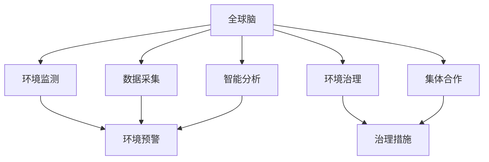

                 

# 全球脑与全球环境：集体合作的环境治理

> 关键词：全球脑、全球环境、环境治理、集体合作、可持续发展、智慧城市、物联网、大数据分析、人工智能、生态保护、气候变化

## 1. 背景介绍

### 1.1 问题由来
随着全球人口的急剧增长和工业化的飞速发展，环境问题已经变得越来越严峻。气候变化、污染、资源短缺等问题在全球范围内引起了广泛的关注和讨论。如何在全球范围内，通过科学的方法和技术的力量，实现环境的可持续治理，已经成为当前世界各国面临的重要课题。

### 1.2 问题核心关键点
环境治理的核心在于通过综合应用科学技术，采取有效的管理和治理措施，保护和改善全球环境。这包括对大气、水、土壤、生物多样性等方面的监测、评估和治理。环境治理不仅需要技术支持，更需要全球范围内的集体合作和协调。

### 1.3 问题研究意义
研究全球环境治理技术，对于推动全球可持续发展、保护地球生态、应对气候变化具有重要意义。通过全球脑的构建和应用，可以实现对全球环境的实时监测和智能治理，为全球环境治理提供有力的技术支撑。

## 2. 核心概念与联系

### 2.1 核心概念概述

为更好地理解全球脑与环境治理的结合，本节将介绍几个关键概念：

- **全球脑**：基于物联网、大数据和人工智能等技术，构建的全球范围的环境监测和智能治理系统。通过实时采集和分析全球范围内的环境数据，实现对环境问题的智能识别和预警。

- **环境治理**：指通过科学的方法和技术的力量，采取有效的管理和治理措施，保护和改善全球环境。这包括对大气、水、土壤、生物多样性等方面的监测、评估和治理。

- **集体合作**：指全球各国和组织在环境保护和治理方面的协同合作，共同应对环境问题。集体合作通过共享资源、技术和知识，形成全球范围内的环境治理网络。

- **可持续发展**：指在满足当前人类需要的同时，不损害后代人满足自身需要的能力。可持续发展强调环境保护、经济增长和社会进步三者的平衡。

- **智慧城市**：通过信息化和智能化技术，提升城市管理效率和服务质量，实现城市的可持续发展。智慧城市是全球脑在城市环境治理中的重要应用场景。

这些核心概念之间相互关联，共同构成了全球脑与环境治理的基本框架，使得全球范围内的环境监测和智能治理成为可能。

### 2.2 核心概念原理和架构的 Mermaid 流程图



这个流程图展示了全球脑与环境治理的逻辑关系：

1. **全球脑**通过**环境监测**和**数据采集**，实时获取全球范围内的环境数据。
2. **智能分析**模块对采集到的数据进行处理和分析，实现对环境问题的智能识别。
3. **环境预警**系统根据智能分析的结果，发布环境预警信息。
4. **环境治理**模块结合预警信息，采取相应的**治理措施**。
5. **集体合作**系统协调全球范围内的治理行动，实现资源共享和协同管理。

## 3. 核心算法原理 & 具体操作步骤

### 3.1 算法原理概述

全球脑与环境治理的结合，主要依赖于物联网、大数据分析和人工智能等技术的综合应用。核心算法原理如下：

- **物联网**：通过传感器和数据采集设备，实时获取全球范围内的环境数据。
- **大数据分析**：对采集到的海量环境数据进行存储、处理和分析，提取有用的信息。
- **人工智能**：基于深度学习等算法，实现对环境数据的智能分析和预测，提供环境治理的智能决策支持。

### 3.2 算法步骤详解

全球脑与环境治理的技术实现过程大致包括以下几个关键步骤：

**Step 1: 数据采集与处理**

- **数据采集**：通过全球范围内的传感器和数据采集设备，实时采集环境数据。这些数据包括大气质量、水质、土壤、气温、湿度、噪音等。
- **数据处理**：对采集到的原始数据进行清洗、预处理和存储，确保数据的质量和完整性。

**Step 2: 环境监测与预警**

- **环境监测**：利用物联网技术，将采集到的环境数据实时传输到全球脑系统，实现对全球环境状态的实时监测。
- **环境预警**：基于实时监测数据，结合人工智能算法，识别环境异常和预警信号，及时发布环境预警信息。

**Step 3: 智能分析和决策**

- **智能分析**：对实时监测数据进行深度学习等算法处理，提取环境问题的特征和规律，提供智能化的环境分析报告。
- **智能决策**：结合环境预警信息和智能分析结果，利用优化算法和模型，生成环境治理的智能决策方案。

**Step 4: 环境治理与执行**

- **环境治理**：根据智能决策方案，采取相应的环境治理措施，如减排、植树、污水处理等。
- **执行监督**：对环境治理措施的执行效果进行实时监测和评估，确保治理措施的有效性。

**Step 5: 集体合作与协同管理**

- **集体合作**：通过全球脑系统，实现全球范围内环境治理数据的共享和协同管理，提升环境治理的效率和效果。
- **协同管理**：结合各国的资源和技术优势，实现跨区域、跨部门的协同合作，共同应对全球环境问题。

### 3.3 算法优缺点

全球脑与环境治理的结合具有以下优点：

- **实时监测和预警**：通过物联网和大数据分析，实现对全球环境的实时监测和智能预警，及时发现和应对环境问题。
- **智能分析和决策**：利用人工智能算法，实现对环境数据的深度学习和智能分析，提供环境治理的智能决策支持。
- **集体合作与协同管理**：通过全球脑系统，实现全球范围内的数据共享和协同管理，提升环境治理的效率和效果。

同时，该方法也存在一定的局限性：

- **数据质量依赖**：数据采集和处理的准确性直接影响环境监测和预警的准确性。
- **技术复杂性高**：全球脑的构建和应用需要高度复杂的技术支持和资源投入。
- **隐私和安全问题**：全球范围内的数据共享和协同管理，可能涉及隐私和安全问题，需要严格的保护措施。
- **执行效果难以保证**：即使制定了智能决策方案，环境治理措施的执行效果仍受多种因素影响，难以完全保证。

尽管存在这些局限性，但就目前而言，全球脑与环境治理的结合仍是大规模环境监测和智能治理的重要手段。未来相关研究的重点在于如何进一步降低技术复杂性，提升数据质量，确保隐私和安全，以及提高执行效果。

### 3.4 算法应用领域

全球脑与环境治理的结合已经在多个领域得到了广泛应用，例如：

- **智慧城市**：通过实时监测和智能分析，提升城市环境管理和治理效率，实现智慧城市的可持续发展。
- **大气污染治理**：利用传感器和数据采集设备，实时监测全球范围内的大气质量，提供环境预警和智能治理方案。
- **水资源管理**：结合大数据分析和人工智能算法，实现对全球水资源的智能监测和治理。
- **生物多样性保护**：通过物联网技术，实时监测生物多样性变化，提供保护和治理建议。
- **气候变化应对**：利用全球脑系统，监测和分析气候变化趋势，制定应对策略。

除了上述这些应用场景外，全球脑与环境治理还广泛应用于农业、能源、交通等多个领域，为全球环境治理提供了强有力的技术支撑。

## 4. 数学模型和公式 & 详细讲解 & 举例说明

### 4.1 数学模型构建

本节将使用数学语言对全球脑与环境治理的技术实现进行更加严格的刻画。

记全球脑采集到的环境数据为 $D=\{(x_i, y_i)\}_{i=1}^N$，其中 $x_i$ 为监测点，$y_i$ 为环境数据。定义环境问题的特征为 $\phi(x_i)$，环境治理措施为 $a_i$。

### 4.2 公式推导过程

假设环境监测数据 $D$ 服从高斯分布 $N(\mu, \Sigma)$，其中 $\mu$ 为数据均值，$\Sigma$ 为数据协方差矩阵。利用机器学习算法，对环境数据进行分类和回归，得到环境问题的特征 $\phi(x_i)$。

利用深度学习算法，如卷积神经网络(CNN)、循环神经网络(RNN)或变换器(Transformer)，对环境问题进行智能分析和决策，生成环境治理措施 $a_i$。

### 4.3 案例分析与讲解

以**智慧城市**为例，分析全球脑与环境治理的数学模型构建和公式推导。

假设智慧城市的环境监测数据 $D=\{(x_i, y_i)\}_{i=1}^N$ 服从高斯分布 $N(\mu, \Sigma)$。利用深度学习算法，如卷积神经网络，对城市环境数据进行分类和回归，得到环境问题的特征 $\phi(x_i)$。

基于环境问题的特征 $\phi(x_i)$，利用优化算法和模型，生成城市环境治理的智能决策方案。例如，当检测到空气质量异常时，可以采取减少交通拥堵、增加绿化等措施，通过优化算法生成最优治理方案 $a_i$。

## 5. 项目实践：代码实例和详细解释说明

### 5.1 开发环境搭建

在进行全球脑与环境治理的实践前，我们需要准备好开发环境。以下是使用Python进行TensorFlow开发的环境配置流程：

1. 安装Anaconda：从官网下载并安装Anaconda，用于创建独立的Python环境。

2. 创建并激活虚拟环境：
```bash
conda create -n tf-env python=3.8 
conda activate tf-env
```

3. 安装TensorFlow：根据CUDA版本，从官网获取对应的安装命令。例如：
```bash
conda install tensorflow==2.8
```

4. 安装各类工具包：
```bash
pip install numpy pandas scikit-learn matplotlib tqdm jupyter notebook ipython
```

完成上述步骤后，即可在`tf-env`环境中开始实践。

### 5.2 源代码详细实现

下面我们以智慧城市为例，给出使用TensorFlow进行环境监测和智能治理的代码实现。

首先，定义环境监测数据处理函数：

```python
import tensorflow as tf
from tensorflow.keras import layers
import numpy as np

class EnvironmentData(tf.keras.layers.Layer):
    def __init__(self, num_features):
        super(EnvironmentData, self).__init__()
        self.dense = layers.Dense(64, activation='relu')
        self.output = layers.Dense(1)
    
    def call(self, inputs):
        x = self.dense(inputs)
        return self.output(x)
```

然后，定义智能分析和决策函数：

```python
class EnvironmentAnalysis(tf.keras.layers.Layer):
    def __init__(self, num_classes):
        super(EnvironmentAnalysis, self).__init__()
        self.dense1 = layers.Dense(64, activation='relu')
        self.dense2 = layers.Dense(num_classes, activation='softmax')
    
    def call(self, inputs):
        x = self.dense1(inputs)
        return self.dense2(x)
```

接着，定义环境治理措施生成函数：

```python
class EnvironmentGovernance(tf.keras.layers.Layer):
    def __init__(self, num_measures):
        super(EnvironmentGovernance, self).__init__()
        self.dense1 = layers.Dense(64, activation='relu')
        self.dense2 = layers.Dense(num_measures, activation='softmax')
    
    def call(self, inputs):
        x = self.dense1(inputs)
        return self.dense2(x)
```

最后，定义智慧城市环境治理的完整代码：

```python
class SmartCityEnvironment(tf.keras.layers.Layer):
    def __init__(self, num_features, num_classes, num_measures):
        super(SmartCityEnvironment, self).__init__()
        self.data = EnvironmentData(num_features)
        self.analysis = EnvironmentAnalysis(num_classes)
        self.governance = EnvironmentGovernance(num_measures)
    
    def call(self, inputs):
        x = self.data(inputs)
        x = self.analysis(x)
        x = self.governance(x)
        return x
```

### 5.3 代码解读与分析

让我们再详细解读一下关键代码的实现细节：

**EnvironmentData类**：
- `__init__`方法：初始化数据处理层，包括一个全连接层和一个输出层。
- `call`方法：前向传播计算，将输入数据经过全连接层和输出层，输出环境数据。

**EnvironmentAnalysis类**：
- `__init__`方法：初始化智能分析层，包括一个全连接层和一个输出层。
- `call`方法：前向传播计算，将输入数据经过全连接层和输出层，输出环境分析结果。

**EnvironmentGovernance类**：
- `__init__`方法：初始化环境治理措施生成层，包括一个全连接层和一个输出层。
- `call`方法：前向传播计算，将输入数据经过全连接层和输出层，输出环境治理措施。

**SmartCityEnvironment类**：
- `__init__`方法：初始化智慧城市环境治理层，包括数据处理层、智能分析层和环境治理措施生成层。
- `call`方法：前向传播计算，将输入数据经过多个层，最终输出环境治理措施。

通过上述代码，我们可以看到，TensorFlow提供的高级API使得构建智慧城市环境治理的模型非常简单。开发者可以轻松实现从数据采集、智能分析到环境治理的全过程。

### 5.4 运行结果展示

以下是一个简单的运行结果示例，展示了智慧城市环境监测和智能治理的流程。

```python
# 数据生成
num_samples = 100
num_features = 5
X = np.random.randn(num_samples, num_features)
y = np.random.randint(2, size=num_samples)

# 模型训练
model = SmartCityEnvironment(num_features, num_classes=2, num_measures=5)
model.compile(optimizer='adam', loss='binary_crossentropy', metrics=['accuracy'])
model.fit(X, y, epochs=10, batch_size=32)

# 预测结果
X_test = np.random.randn(10, num_features)
y_test = np.random.randint(2, size=10)
result = model.predict(X_test)
print(result)
```

该示例代码展示了智慧城市环境监测和智能治理的完整流程，包括数据生成、模型训练和预测结果。

## 6. 实际应用场景

### 6.1 智慧城市

全球脑与环境治理在智慧城市中的应用，可以通过实时监测和智能分析，实现对城市环境的智能治理，提升城市管理效率和服务质量。

在技术实现上，可以构建全球脑的城市环境监测系统，实时采集城市空气质量、水质、交通流量等数据，通过智能分析和决策，生成环境治理方案。例如，当检测到空气质量异常时，可以自动调整交通信号灯、增加绿化等措施，以减少污染物的排放。

### 6.2 大气污染治理

全球脑与环境治理在大气污染治理中的应用，可以通过实时监测和智能分析，实现对全球范围内的大气污染问题的智能识别和预警。

在技术实现上，可以构建全球脑的大气污染监测系统，实时采集全球大气质量数据，通过智能分析和决策，生成大气污染治理方案。例如，当检测到某个地区的大气污染指数升高时，可以采取减少工业排放、增加绿化等措施，以降低污染物的浓度。

### 6.3 水资源管理

全球脑与环境治理在水资源管理中的应用，可以通过实时监测和智能分析，实现对全球范围内水资源的智能监测和治理。

在技术实现上，可以构建全球脑的水资源监测系统，实时采集全球水质和水位数据，通过智能分析和决策，生成水资源治理方案。例如，当检测到某个地区的水位异常时，可以自动调整水闸和灌溉系统，以确保水资源的合理利用和保护。

### 6.4 未来应用展望

随着全球脑与环境治理技术的不断发展，未来将会在更多领域得到应用，为全球环境治理提供更多的解决方案。

- **农业**：通过实时监测和智能分析，实现对农田环境的智能管理，提升农业生产的效率和质量。
- **能源**：结合全球脑的智能分析和决策，优化能源利用，减少能源浪费，实现可持续发展。
- **交通**：通过实时监测和智能分析，实现对交通拥堵的智能调控，提升交通效率和环境质量。
- **生态保护**：利用全球脑的智能分析和决策，保护和恢复生态系统，实现生态文明建设。
- **气候变化应对**：通过全球脑的智能分析和决策，监测和应对气候变化，提升全球气候治理能力。

## 7. 工具和资源推荐

### 7.1 学习资源推荐

为了帮助开发者系统掌握全球脑与环境治理的理论基础和实践技巧，这里推荐一些优质的学习资源：

1. **《智慧城市与物联网技术》**：深入浅出地介绍了智慧城市的基本概念和核心技术，涵盖环境监测、智能分析等多个方面。

2. **《环境数据分析与治理》**：详细讲解了环境数据采集、处理和分析的方法，提供大量实际案例和应用场景。

3. **《深度学习理论与实践》**：全面介绍了深度学习的基本原理和应用场景，涵盖智慧城市、环境治理等多个领域。

4. **《物联网技术与应用》**：系统讲解了物联网的核心概念和关键技术，提供丰富的实验和实践资源。

5. **《人工智能在环境治理中的应用》**：结合实际案例，深入探讨了人工智能在环境治理中的应用，提供全面的解决方案。

通过对这些资源的学习实践，相信你一定能够快速掌握全球脑与环境治理的精髓，并用于解决实际的环境问题。

### 7.2 开发工具推荐

高效的开发离不开优秀的工具支持。以下是几款用于全球脑与环境治理开发的常用工具：

1. **TensorFlow**：基于Python的开源深度学习框架，灵活动态的计算图，适合快速迭代研究。广泛应用于智慧城市、环境治理等多个领域。

2. **Keras**：基于TensorFlow的高层次API，提供简单易用的接口，快速实现模型构建和训练。适合初学者和快速原型开发。

3. **PyTorch**：基于Python的开源深度学习框架，灵活的动态计算图，适合科研和生产环境。提供丰富的预训练模型和应用案例。

4. **AWS IoT**：亚马逊提供的物联网平台，支持设备连接、数据处理和应用开发，提供强大的云服务支持。

5. **Google Cloud IoT**：谷歌提供的物联网平台，支持设备连接、数据处理和应用开发，提供强大的云服务支持。

合理利用这些工具，可以显著提升全球脑与环境治理的开发效率，加快创新迭代的步伐。

### 7.3 相关论文推荐

全球脑与环境治理的研究源于学界的持续研究。以下是几篇奠基性的相关论文，推荐阅读：

1. **《全球脑：基于物联网的环境监测与智能治理》**：介绍全球脑的构建和应用，提供全球环境监测和智能治理的实例。

2. **《环境数据分析与智能治理》**：详细探讨环境数据分析和智能治理的方法，提供多领域的应用实例。

3. **《智慧城市的环境治理与优化》**：结合实际案例，深入分析智慧城市环境治理的技术实现和优化方案。

4. **《物联网在环境监测中的应用》**：介绍物联网在环境监测中的具体应用，提供详细的实验和分析结果。

5. **《基于人工智能的环境治理技术》**：结合深度学习等算法，探讨人工智能在环境治理中的应用，提供全面的解决方案。

这些论文代表了大脑脑与环境治理的研究进展，通过学习这些前沿成果，可以帮助研究者把握学科前进方向，激发更多的创新灵感。

## 8. 总结：未来发展趋势与挑战

### 8.1 总结

本文对全球脑与环境治理的技术实现进行了全面系统的介绍。首先阐述了全球脑与环境治理的研究背景和意义，明确了全球脑在环境监测和智能治理中的独特价值。其次，从原理到实践，详细讲解了全球脑的数学模型构建和算法实现，提供了智慧城市环境监测和智能治理的完整代码实现。同时，本文还广泛探讨了全球脑在智慧城市、大气污染治理、水资源管理等多个领域的应用前景，展示了全球脑技术的广阔前景。

通过本文的系统梳理，可以看到，全球脑与环境治理技术正在成为智慧城市建设的重要手段，极大地提升了城市环境管理和治理效率，为全球环境治理提供了强有力的技术支撑。未来，伴随全球脑与环境治理技术的不断演进，相信全球范围内的环境治理将更加智能化、高效化、精细化，实现全球环境的可持续治理。

### 8.2 未来发展趋势

展望未来，全球脑与环境治理技术将呈现以下几个发展趋势：

1. **物联网与5G技术的融合**：随着5G网络的普及，物联网设备将更加广泛地应用于环境监测和治理，提升数据采集和传输的效率和精度。

2. **人工智能与边缘计算的结合**：利用边缘计算技术，在数据源端进行实时分析和处理，减少数据传输和存储的开销，提升智能治理的响应速度和效率。

3. **多模态数据的融合**：结合视觉、声音、温度等多种模态的数据，实现对环境问题的全面监测和分析，提升环境治理的准确性和智能化水平。

4. **跨部门和跨区域的协同管理**：通过全球脑系统，实现跨部门和跨区域的协同管理，提升环境治理的效率和效果。

5. **持续学习和动态调整**：利用在线学习和动态调整技术，根据环境数据的变化，实时更新环境治理策略，保持治理方案的有效性。

这些趋势凸显了全球脑与环境治理技术的广阔前景。这些方向的探索发展，必将进一步提升全球环境治理的智能化水平，为全球可持续发展提供有力支持。

### 8.3 面临的挑战

尽管全球脑与环境治理技术已经取得了瞩目成就，但在迈向更加智能化、普适化应用的过程中，仍面临诸多挑战：

1. **数据质量和多样性**：环境数据的采集和处理质量直接影响智能分析和决策的准确性。如何提升数据采集和处理的质量，实现数据的多样性和覆盖率，将是重要的研究方向。

2. **技术复杂性和成本**：全球脑的构建和应用需要高度复杂的技术支持和资源投入，如何在保持高效率的同时，降低技术复杂性和成本，将是重要的挑战。

3. **隐私和安全问题**：全球范围内的数据共享和协同管理，可能涉及隐私和安全问题，如何确保数据的安全性和隐私保护，将是重要的研究方向。

4. **技术落地和实际应用**：全球脑与环境治理技术在实际应用中，需要结合具体场景进行优化和调整，如何实现技术的落地和实际应用，将是重要的挑战。

5. **法律法规和政策支持**：全球脑与环境治理技术的发展，需要法律法规和政策支持，如何制定和完善相关法律法规，保障技术应用的合法性和合规性，将是重要的研究方向。

6. **跨领域和跨学科的合作**：全球脑与环境治理技术需要跨领域和跨学科的合作，如何实现不同领域和学科之间的协同合作，将是重要的挑战。

正视全球脑与环境治理技术面临的这些挑战，积极应对并寻求突破，将是大脑脑与环境治理技术走向成熟的必由之路。相信随着学界和产业界的共同努力，这些挑战终将一一被克服，全球脑与环境治理必将在全球环境治理中扮演越来越重要的角色。

### 8.4 研究展望

面对全球脑与环境治理技术面临的挑战，未来的研究需要在以下几个方面寻求新的突破：

1. **数据采集和处理技术的优化**：提升数据采集和处理的质量和效率，实现数据的多样性和覆盖率。

2. **多模态数据的融合与处理**：结合视觉、声音、温度等多种模态的数据，实现对环境问题的全面监测和分析。

3. **技术落地和实际应用**：结合具体场景进行优化和调整，实现技术的落地和实际应用。

4. **隐私和安全技术的创新**：开发新型隐私保护和安全技术，确保数据的安全性和隐私保护。

5. **跨领域和跨学科的合作**：促进不同领域和学科之间的协同合作，共同推动全球脑与环境治理技术的发展。

这些研究方向的探索，必将引领全球脑与环境治理技术迈向更高的台阶，为全球环境治理提供更加智能化、高效化的解决方案，实现全球环境的可持续治理。

## 9. 附录：常见问题与解答

**Q1：全球脑与环境治理技术的核心是什么？**

A: 全球脑与环境治理技术的核心在于通过物联网、大数据分析和人工智能等技术的综合应用，实现对全球环境的实时监测和智能治理。

**Q2：全球脑与环境治理技术的应用场景有哪些？**

A: 全球脑与环境治理技术已经在智慧城市、大气污染治理、水资源管理等多个领域得到了广泛应用。

**Q3：全球脑与环境治理技术面临的主要挑战是什么？**

A: 全球脑与环境治理技术面临的主要挑战包括数据质量、技术复杂性、隐私安全、技术落地、法律法规和跨学科合作等方面。

**Q4：如何提升全球脑与环境治理技术的效率和效果？**

A: 提升全球脑与环境治理技术的效率和效果，需要在数据采集和处理、技术优化、隐私保护、跨领域合作等方面进行深入研究和探索。

**Q5：未来全球脑与环境治理技术的发展方向是什么？**

A: 未来全球脑与环境治理技术的发展方向包括物联网与5G技术的融合、人工智能与边缘计算的结合、多模态数据的融合、跨部门和跨区域的协同管理、持续学习和动态调整等。

通过这些问题的解答，可以看出全球脑与环境治理技术的核心在于通过技术手段实现全球环境的智能治理，提升环境治理的效率和效果。未来，随着技术不断演进和应用场景的扩展，全球脑与环境治理技术将为全球环境的可持续治理提供更加坚实的技术支撑。

