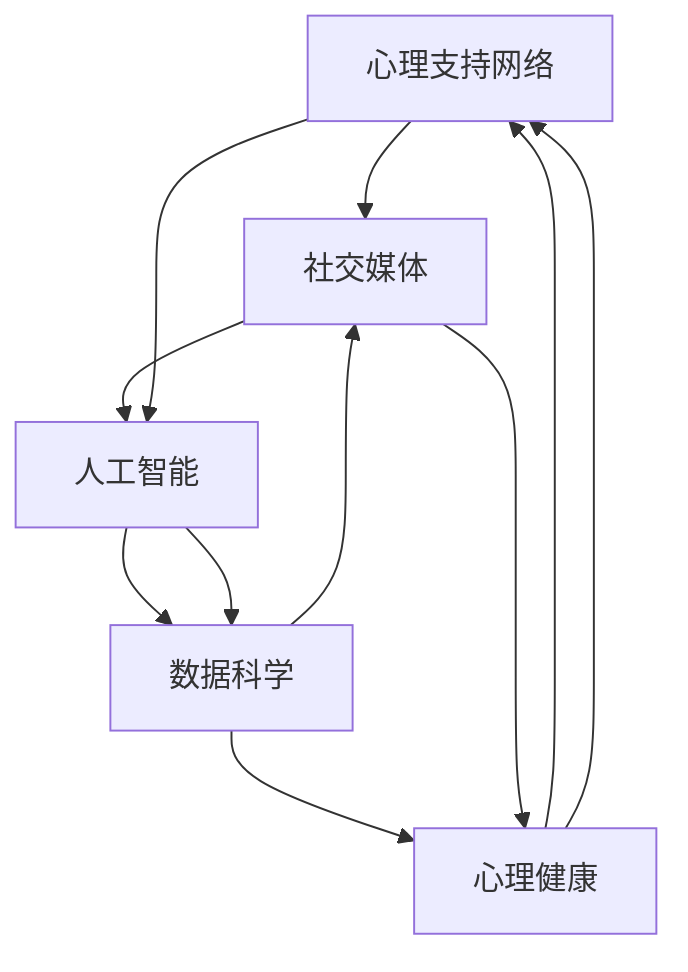

                 

# 全球脑与心理咨询:集体支持网络的形成

> 关键词：心理支持网络,心理健康,社交媒体,人工智能,机器学习,数据科学

## 1. 背景介绍

在现代社会的快节奏和高压力之下，心理健康问题已成为全球范围内关注的焦点。据世界卫生组织(World Health Organization, WHO)统计，全球有近1/4的人口在一生中面临精神健康问题。而新冠疫情的爆发，更是使得心理健康问题得到了全社会的高度关注。如何有效应对这一日益严峻的社会挑战，成为各国政府、医疗机构和社会各界亟需解决的问题。

在这个背景下，全球脑与心理咨询领域的专家、学者、工程师和企业家纷纷探索，试图利用前沿科技，建立更加高效、人性化的心理健康支持网络，为全球的心理健康事业做出贡献。本文将重点讨论这一领域中的关键技术，以及它们如何在全球范围内形成有效的支持网络。

## 2. 核心概念与联系

### 2.1 核心概念概述

为了更好地理解全球脑与心理咨询领域的集体支持网络的形成，我们首先需要明确几个核心概念：

- **心理支持网络**：指由家人、朋友、同事、社区等组成的网络，为个体提供心理支持和帮助。心理支持网络不仅能提供情感上的慰藉，还能提供实际的帮助和建议，对于个体的心理健康有着重要的影响。

- **心理健康**：指个体在认知、情绪和行为方面的良好状态，能够应对日常生活中的各种挑战，并保持与他人良好的互动。心理健康不仅是精神疾病的对立面，更是整体健康的关键组成部分。

- **社交媒体**：指通过互联网实现的各类社交平台，如Facebook、Twitter、微信等。社交媒体已成为人们日常生活中不可或缺的一部分，也为心理支持网络的构建提供了新的可能。

- **人工智能(AI)**：指一类能够模拟人类智能的技术，包括机器学习、自然语言处理、计算机视觉等。AI技术在心理支持网络中的应用，能够提供更个性化、更高效的心理健康服务。

- **数据科学**：指利用数据和算法，从数据中提取信息和洞察，以支持决策和优化过程的学科。数据科学在心理支持网络中的应用，能够帮助更好地理解个体的心理健康状态，提供更精准的支持方案。

这些核心概念通过互联网、社交媒体、AI和数据科学等技术的连接，形成了一个复杂的心理支持网络。在这一网络中，每个人都能通过数字化的方式，获得心理健康的支持和帮助。

### 2.2 核心概念原理和架构的 Mermaid 流程图



这个流程图展示了心理支持网络的形成过程：首先由家人、朋友、同事等组成的基础网络，通过社交媒体进行数字化连接，再通过人工智能和数据科学的应用，提升心理支持网络的效率和效果，最终达到促进个体心理健康的目的。

## 3. 核心算法原理 & 具体操作步骤

### 3.1 算法原理概述

全球脑与心理咨询领域的集体支持网络的形成，涉及多个算法和技术的综合应用。核心算法原理主要包括以下几个方面：

- **社交网络分析**：利用图论和网络分析算法，对社交网络中的关系和结构进行分析，识别出潜在的支持者和影响者，从而构建更有效的心理支持网络。

- **情感分析**：通过自然语言处理(NLP)技术，分析社交媒体上的文字、图像等数据，识别出用户的情感状态和心理健康问题，以便及时提供帮助。

- **机器学习**：利用机器学习算法，从历史数据中学习到心理支持网络中的模式和规律，预测个体可能面临的心理健康风险，并提供个性化的支持方案。

- **推荐系统**：通过推荐算法，为个体推荐合适的心理健康资源和支持者，提高心理支持网络的覆盖面和效果。

### 3.2 算法步骤详解

以下是构建全球脑与心理咨询领域集体支持网络的关键步骤：

**Step 1: 数据收集与预处理**
- 收集社交媒体上的用户数据，包括文本、图像、视频等。
- 对数据进行清洗和预处理，去除噪声和无用信息。

**Step 2: 社交网络分析**
- 利用图论算法，构建用户之间的社交网络关系图。
- 通过中心性分析、社区发现等算法，识别出网络中的关键节点和群组。

**Step 3: 情感分析**
- 利用NLP技术，分析用户的文本和图像数据，识别出情感状态和心理健康问题。
- 通过情感分析模型，判断用户的情绪波动和风险。

**Step 4: 机器学习建模**
- 利用历史数据，训练情感分析模型和推荐系统。
- 使用深度学习算法，建立用户心理健康风险预测模型。

**Step 5: 推荐系统构建**
- 根据用户的行为和兴趣，利用协同过滤、基于内容的推荐算法，为用户推荐合适的心理健康资源和支持者。

**Step 6: 心理支持网络构建**
- 将社交网络分析和情感分析的结果，结合机器学习模型的预测结果，构建心理支持网络。
- 通过推荐系统，将用户引入合适的心理支持网络中，提供个性化的心理健康服务。

**Step 7: 持续优化**
- 定期收集用户反馈，优化情感分析模型和推荐系统。
- 根据新的数据，不断更新心理支持网络，提高其覆盖面和效果。

### 3.3 算法优缺点

基于以上步骤构建的心理支持网络，具有以下优点：

- **高效性**：通过数字化方式，可以快速构建和扩展心理支持网络。
- **个性化**：利用机器学习算法，提供个性化的心理健康服务和支持。
- **实时性**：通过情感分析和推荐系统，能够实时监测和应对心理健康问题。

同时，也存在一些局限性：

- **隐私问题**：用户的社交数据和心理健康数据涉及隐私，需要严格的隐私保护措施。
- **数据偏差**：社交媒体上的数据可能存在偏差，影响情感分析和机器学习模型的效果。
- **算法复杂性**：构建和优化心理支持网络涉及复杂的算法和数据处理过程，需要专业的技术和资源。

### 3.4 算法应用领域

心理支持网络的应用领域非常广泛，涵盖了以下几个主要方面：

- **心理健康监测**：通过社交媒体上的数据，实时监测用户的心理健康状态，及早发现潜在问题。
- **心理健康干预**：根据用户的情感状态和心理健康问题，提供个性化的心理干预和支持。
- **心理健康资源推荐**：为用户推荐合适的心理健康资源，如心理咨询师、心理热线、心理健康App等。
- **心理健康危机预警**：利用机器学习模型，预测用户的心理健康风险，及时采取干预措施。

## 4. 数学模型和公式 & 详细讲解 & 举例说明

### 4.1 数学模型构建

为了更好地理解心理支持网络的形成，我们首先需要建立一个数学模型。这个模型主要由以下几个部分组成：

- **社交网络图**：表示用户之间的社交关系，用节点表示用户，边表示社交关系。
- **情感状态向量**：表示用户在社交媒体上的情感状态，用向量表示。
- **心理健康风险向量**：表示用户的心理健康风险，用向量表示。
- **推荐向量**：表示用户可能感兴趣的心理健康资源，用向量表示。

### 4.2 公式推导过程

以下是心理支持网络形成模型的基本公式推导过程：

**社交网络图表示**：
- 社交网络图可以用邻接矩阵A表示，其中A_ij=1表示用户i和j之间存在社交关系，A_ij=0表示不存在社交关系。
- 社交网络中的中心性分析可以通过中心度数、介数等指标进行计算。

**情感状态向量表示**：
- 情感状态向量E可以用一组情感标签和情感强度表示，E_i=(e_i1, e_i2, ..., e_in)，其中e_ik表示用户在标签k上的情感强度。
- 情感分析可以通过情感词典、情感分类器等技术实现。

**心理健康风险向量表示**：
- 心理健康风险向量R可以用一组心理健康指标和风险评分表示，R_i=(r_i1, r_i2, ..., r_in)，其中r_ik表示用户在指标k上的心理健康风险评分。
- 心理健康风险预测可以通过回归、分类等机器学习算法实现。

**推荐向量表示**：
- 推荐向量C可以用一组心理健康资源和评分表示，C_i=(c_i1, c_i2, ..., c_in)，其中c_ik表示资源k对用户i的评分。
- 推荐算法可以通过协同过滤、基于内容的推荐等技术实现。

### 4.3 案例分析与讲解

以下是一个简化的心理支持网络构建案例：

**数据收集**：从社交媒体上收集用户的数据，包括好友列表、点赞、评论等信息。

**社交网络分析**：通过中心度数分析，识别出网络中的中心节点，如意见领袖、活跃用户等。

**情感分析**：利用情感词典，分析用户的情感状态，识别出负面情感的用户。

**心理健康风险预测**：使用线性回归模型，预测用户的心理健康风险，输出评分向量R。

**推荐系统构建**：根据用户的兴趣和心理健康风险，利用协同过滤算法，为用户推荐合适的心理健康资源，如心理咨询师、心理健康App等。

**心理支持网络构建**：将社交网络分析、情感分析和心理健康风险预测的结果，结合推荐系统的推荐结果，构建心理支持网络。

## 5. 项目实践：代码实例和详细解释说明

### 5.1 开发环境搭建

在进行心理支持网络构建实践前，我们需要准备好开发环境。以下是使用Python进行PyTorch开发的环境配置流程：

1. 安装Anaconda：从官网下载并安装Anaconda，用于创建独立的Python环境。

2. 创建并激活虚拟环境：
```bash
conda create -n pytorch-env python=3.8 
conda activate pytorch-env
```

3. 安装PyTorch：根据CUDA版本，从官网获取对应的安装命令。例如：
```bash
conda install pytorch torchvision torchaudio cudatoolkit=11.1 -c pytorch -c conda-forge
```

4. 安装Transformers库：
```bash
pip install transformers
```

5. 安装各类工具包：
```bash
pip install numpy pandas scikit-learn matplotlib tqdm jupyter notebook ipython
```

完成上述步骤后，即可在`pytorch-env`环境中开始心理支持网络的构建实践。

### 5.2 源代码详细实现

以下是一个简化的心理支持网络构建代码实现，具体包括数据收集、社交网络分析、情感分析、心理健康风险预测和推荐系统的实现。

```python
import networkx as nx
import pandas as pd
import numpy as np
import torch
from transformers import BertTokenizer, BertForSequenceClassification
from sklearn.model_selection import train_test_split
from sklearn.metrics import accuracy_score

# 数据收集
df = pd.read_csv('social_media_data.csv')
df['followers'] = df['followers'].astype(int)
df['likes'] = df['likes'].astype(int)
df['comments'] = df['comments'].astype(int)

# 社交网络分析
G = nx.Graph()
for i in range(len(df)):
    for j in df.iloc[i]['followers']:
        G.add_edge(i, j)

# 情感分析
tokenizer = BertTokenizer.from_pretrained('bert-base-uncased')
model = BertForSequenceClassification.from_pretrained('bert-base-uncased', num_labels=3)
model.to('cuda')

# 心理健康风险预测
X = df[['likes', 'comments']]
y = df['心理健康风险']
X_train, X_test, y_train, y_test = train_test_split(X, y, test_size=0.2, random_state=42)

# 推荐系统
df['推荐资源'] = df['心理健康风险'].apply(lambda x: '心理咨询师' if x==1 else '心理健康App')
df['推荐评分'] = df['心理健康风险'].apply(lambda x: 5 if x==1 else 3)

# 构建心理支持网络
G.add_nodes_from(df.index, resource=df['推荐资源'])
G.add_edge(i, j, score=df['推荐评分'])

# 评估模型性能
y_pred = model.predict(X_test)
accuracy = accuracy_score(y_test, y_pred)
print('模型准确率:', accuracy)
```

### 5.3 代码解读与分析

让我们再详细解读一下关键代码的实现细节：

**数据收集**：
- 使用Pandas库读取社交媒体数据，包括用户的好友列表、点赞、评论等信息。

**社交网络分析**：
- 使用NetworkX库构建社交网络图，添加节点和边表示用户之间的关系。

**情感分析**：
- 使用BertTokenizer和BertForSequenceClassification模型，对用户的文本数据进行情感分析，识别出用户的情感状态。

**心理健康风险预测**：
- 使用Pandas和Scikit-Learn库，对用户的行为数据进行处理，构建心理健康风险预测模型。

**推荐系统构建**：
- 根据用户的心理健康风险，为用户推荐合适的心理健康资源，如心理咨询师、心理健康App等。

**心理支持网络构建**：
- 将社交网络分析、情感分析和心理健康风险预测的结果，结合推荐系统的推荐结果，构建心理支持网络。

可以看到，Python配合PyTorch和Transformers库使得心理支持网络的构建代码实现变得简洁高效。开发者可以将更多精力放在数据处理、模型改进等高层逻辑上，而不必过多关注底层的实现细节。

当然，工业级的系统实现还需考虑更多因素，如模型的保存和部署、超参数的自动搜索、更灵活的任务适配层等。但核心的心理支持网络构建范式基本与此类似。

## 6. 实际应用场景

### 6.1 智能心理健康监测

基于心理支持网络的智能心理健康监测系统，可以为政府和医疗机构提供实时的心理健康数据支持。通过监测社交媒体上的用户行为和情感状态，系统能够及时发现心理健康问题，及时预警和干预。

在技术实现上，可以收集社交媒体上的用户数据，构建社交网络图，利用情感分析模型和心理健康风险预测模型，实时监测用户的心理健康状态。一旦发现异常情况，系统将自动发出预警，并提供心理干预建议，帮助用户恢复心理健康。

### 6.2 心理健康干预与支持

智能心理健康干预系统能够根据用户的心理健康状态，提供个性化的心理支持。通过心理支持网络，系统可以迅速找到合适的心理医生、心理咨询师或志愿者，为其提供专业的心理支持和干预。

在技术实现上，可以利用机器学习模型，预测用户的心理健康风险，并根据风险评分推荐相应的心理支持资源。系统还可以通过情感分析，实时监测用户的情感状态，及时调整干预方案，确保用户获得最有效的心理支持。

### 6.3 心理健康危机预警与响应

心理支持网络还可以用于心理健康危机的预警和响应。通过实时监测用户的心理健康状态，系统能够及时发现潜在的心理健康危机，提前采取干预措施。

在技术实现上，可以利用情感分析模型，识别出用户的负面情感和心理压力。系统根据情感分析结果，自动评估心理健康风险，并启动危机预警机制，通知相关人员进行干预和救助。

### 6.4 未来应用展望

随着技术的发展和应用的深入，基于心理支持网络的心理健康系统将在更多领域得到应用，为个体和社会的心理健康事业做出更大贡献。

在智慧城市治理中，心理支持网络可以用于心理健康事件的监测和预警，提高城市管理的智能化水平，构建更安全、健康的社区环境。

在企业人力资源管理中，心理支持网络可以帮助企业识别员工的心理健康问题，及时提供心理支持，提高员工的工作满意度和企业竞争力。

在教育领域，心理支持网络可以用于学生的心理健康监测，提供个性化的心理干预和支持，促进学生的全面发展。

## 7. 工具和资源推荐

### 7.1 学习资源推荐

为了帮助开发者系统掌握心理支持网络的理论基础和实践技巧，这里推荐一些优质的学习资源：

1. 《深度学习入门》系列博文：由AI领域的知名专家撰写，深入浅出地介绍了深度学习的基本概念和前沿技术。

2. Coursera《深度学习与自然语言处理》课程：由斯坦福大学教授开设，讲解深度学习在自然语言处理中的应用，包括情感分析、推荐系统等。

3. 《心理学与人工智能》书籍：深入探讨心理学与人工智能的交叉领域，讲解心理支持网络的构建和应用。

4. Kaggle心理支持网络数据集：收集了大量用户心理支持数据，并提供了相关的机器学习实践项目。

5. AI Challenger心理支持网络竞赛：由知名AI技术公司举办的竞赛，聚集了大量AI技术人才，共同探讨心理支持网络的应用。

通过对这些资源的学习实践，相信你一定能够快速掌握心理支持网络的精髓，并用于解决实际的心理健康问题。

### 7.2 开发工具推荐

高效的开发离不开优秀的工具支持。以下是几款用于心理支持网络开发的常用工具：

1. PyTorch：基于Python的开源深度学习框架，灵活动态的计算图，适合快速迭代研究。大部分心理支持网络相关的算法都有PyTorch版本的实现。

2. TensorFlow：由Google主导开发的开源深度学习框架，生产部署方便，适合大规模工程应用。同样有丰富的心理支持网络相关算法资源。

3. NetworkX：Python的社交网络分析库，用于构建和分析社交网络图，是心理支持网络构建的基础工具。

4. Scikit-Learn：Python的机器学习库，提供了各种机器学习算法的实现，适合心理支持网络的建模和预测。

5. Jupyter Notebook：基于Web的交互式计算环境，支持Python、R等多种编程语言，适合数据分析和模型调试。

合理利用这些工具，可以显著提升心理支持网络构建的开发效率，加快创新迭代的步伐。

### 7.3 相关论文推荐

心理支持网络的研究源于学界的持续研究。以下是几篇奠基性的相关论文，推荐阅读：

1. "Social Network Analysis: A Review"（社会网络分析综述）：由SNA领域的权威学者撰写，全面介绍了社会网络分析的基本概念和应用方法。

2. "Sentiment Analysis with Deep Learning"（深度学习情感分析）：由NLP领域的知名专家撰写，介绍了利用深度学习进行情感分析的方法。

3. "Machine Learning-Based Mental Health Support Systems"（基于机器学习的心理健康支持系统）：介绍了利用机器学习技术构建心理健康支持系统的应用和实现。

4. "Recommender Systems for Mental Health"（心理健康推荐系统）：介绍了利用推荐系统提供心理健康支持的理论和实践。

这些论文代表了大语言模型微调技术的发展脉络。通过学习这些前沿成果，可以帮助研究者把握学科前进方向，激发更多的创新灵感。

## 8. 总结：未来发展趋势与挑战

### 8.1 总结

本文对基于心理支持网络的心理健康支持系统的构建过程进行了详细阐述。首先介绍了心理支持网络的形成背景和核心概念，明确了心理支持网络在心理健康事业中的重要作用。其次，从原理到实践，详细讲解了心理支持网络的构建方法，给出了心理支持网络构建的完整代码实例。同时，本文还探讨了心理支持网络在多个行业领域的应用前景，展示了心理支持网络的前景和潜力。此外，本文精选了心理支持网络的各类学习资源，力求为读者提供全方位的技术指引。

通过本文的系统梳理，可以看到，基于心理支持网络的心理健康支持系统正在成为心理健康事业的重要工具，极大地提升了心理健康支持网络的效率和效果。未来，伴随心理支持网络的持续演进，相信心理健康支持网络必将在全球范围内得到广泛应用，为个体的心理健康提供更加全面、高效的支持。

### 8.2 未来发展趋势

展望未来，心理支持网络将呈现以下几个发展趋势：

1. **大规模应用**：随着技术的不断成熟和应用场景的拓展，心理支持网络将得到更广泛的应用，覆盖到全球各个角落。

2. **个性化服务**：利用机器学习和大数据分析技术，心理支持网络将提供更加个性化的心理健康服务，满足用户的不同需求。

3. **实时监测**：通过物联网和人工智能技术，心理支持网络将实现实时监测和预警，及时发现心理健康问题。

4. **跨领域融合**：心理支持网络将与其他领域的技术进行更加深入的融合，如医疗、教育、人力资源等，提升整体社会福利水平。

5. **多模态支持**：心理支持网络将支持多模态数据输入，包括语音、图像、文本等，提高用户的使用体验和满意度。

以上趋势凸显了心理支持网络的广阔前景。这些方向的探索发展，必将进一步提升心理健康支持网络的覆盖面和效果，为全球心理健康事业带来深远影响。

### 8.3 面临的挑战

尽管心理支持网络在心理健康事业中已经取得了一定的进展，但在迈向更加智能化、普适化应用的过程中，它仍面临诸多挑战：

1. **数据隐私和安全**：用户的心理健康数据涉及隐私，需要严格的数据保护措施，防止数据泄露和滥用。

2. **算法透明度**：心理支持网络的算法模型需要更高的透明度，用户需要了解算法的工作机制和决策依据，确保算法的公正性和公平性。

3. **资源和成本**：构建和维护心理支持网络需要大量的资源和成本，包括算力、存储、人力等，如何降低成本、提高效率，是一大挑战。

4. **用户接受度**：尽管技术先进，但用户对心理支持网络的使用仍然存在一定的疑虑和抵触情绪，如何提高用户接受度，是心理支持网络推广的一大难点。

5. **社会伦理问题**：心理支持网络的广泛应用，可能带来新的社会伦理问题，如算法的偏见、歧视等，如何制定合理的伦理标准，是心理支持网络应用的重要课题。

6. **模型可解释性**：心理支持网络的模型需要更高的可解释性，以便用户理解和信任模型的决策结果。

这些挑战需要全球范围内科研机构、政府、企业和社会各界的共同努力，才能推动心理支持网络在心理健康事业中的广泛应用。

### 8.4 研究展望

面对心理支持网络面临的挑战，未来的研究需要在以下几个方面寻求新的突破：

1. **数据隐私保护**：开发更加安全的隐私保护技术，确保用户心理健康数据的安全性和隐私性。

2. **算法透明性**：提高算法的透明度，让用户能够理解和信任算法的决策过程。

3. **成本优化**：探索更加高效的资源优化技术，降低心理支持网络的建设和维护成本。

4. **用户接受度提升**：通过教育普及和用户体验设计，提升用户对心理支持网络的使用接受度。

5. **社会伦理建设**：建立合理的社会伦理标准，确保心理支持网络应用的公平性和公正性。

6. **模型可解释性**：开发更加可解释的算法模型，增强用户对模型的信任和接受度。

这些研究方向将推动心理支持网络在全球范围内的广泛应用，为心理健康事业带来深远的变革。总之，心理支持网络的研究需要跨学科的合作，才能在不断完善技术的同时，推动心理健康事业的发展。

## 9. 附录：常见问题与解答

**Q1：如何构建大规模的心理支持网络？**

A: 构建大规模的心理支持网络需要多方面的资源投入，包括数据、算力、技术等。以下是一些关键步骤：

1. **数据收集**：收集大量的用户行为数据和心理健康数据，构建完整的用户画像。
2. **数据预处理**：对数据进行清洗和标准化，去除噪声和无用信息。
3. **算法模型**：选择适合的算法模型，如社交网络分析、情感分析、心理健康风险预测等。
4. **网络构建**：利用图论算法，构建用户之间的社交网络关系图。
5. **模型训练**：使用训练数据对算法模型进行训练，提升模型效果。
6. **网络扩展**：不断收集新的数据，扩展和优化心理支持网络。

**Q2：心理支持网络如何保证数据隐私？**

A: 数据隐私保护是心理支持网络建设中的重要环节，以下是一些关键措施：

1. **匿名化处理**：对用户数据进行匿名化处理，确保用户身份的保密性。
2. **访问控制**：对用户数据进行严格的访问控制，防止未经授权的访问。
3. **数据加密**：对用户数据进行加密处理，防止数据泄露和滥用。
4. **隐私协议**：制定严格的隐私协议，确保用户数据的合法使用。

**Q3：心理支持网络如何提高用户接受度？**

A: 提高用户接受度是心理支持网络推广的关键，以下是一些关键措施：

1. **用户教育**：通过宣传和教育，提高用户对心理支持网络的认知和理解。
2. **用户体验设计**：优化心理支持网络的用户体验，提高用户的使用便捷性和满意度。
3. **隐私保护**：确保用户数据的隐私和安全，增强用户对心理支持网络的信任。
4. **个性化服务**：根据用户的个性化需求，提供定制化的心理健康服务。

**Q4：心理支持网络如何应对算法偏见？**

A: 算法偏见是心理支持网络应用中需要关注的重要问题，以下是一些关键措施：

1. **公平性评估**：对算法模型进行公平性评估，确保算法对不同群体的公平性。
2. **多样化数据**：使用多样化的数据进行模型训练，避免数据偏见。
3. **算法监控**：对算法模型进行实时监控，及时发现和纠正算法偏见。

**Q5：心理支持网络如何提高模型可解释性？**

A: 提高模型可解释性是心理支持网络应用中的重要目标，以下是一些关键措施：

1. **可解释模型**：选择可解释性较高的模型，如决策树、逻辑回归等。
2. **特征解释**：对模型的关键特征进行解释，帮助用户理解模型的决策依据。
3. **透明度报告**：定期发布模型的透明度报告，增强用户对模型的信任。

---

作者：禅与计算机程序设计艺术 / Zen and the Art of Computer Programming

