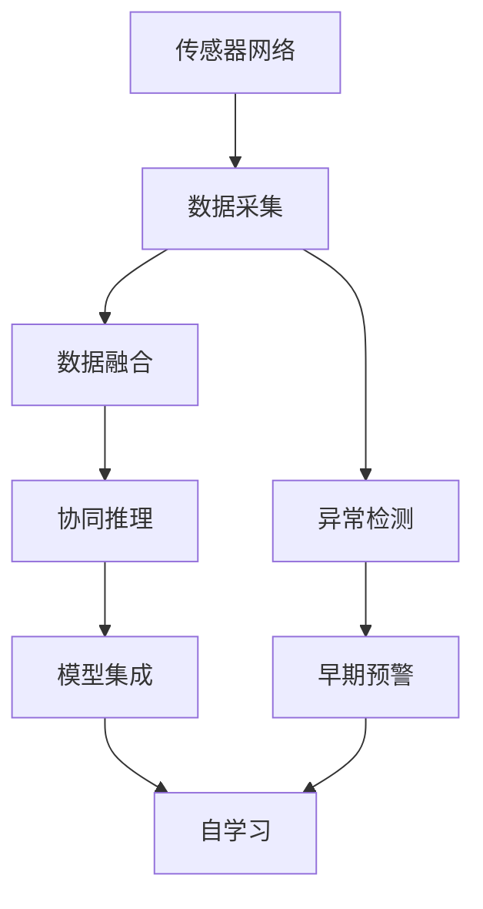

                 

# 全球脑与灾害预防：集体预警的力量

> 关键词：全球脑,灾害预防,集体预警,早期检测,模型集成,分布式协同,神经网络

## 1. 背景介绍

### 1.1 问题由来
自然灾害是全球面临的重大挑战之一，它对人类生命财产安全构成巨大威胁。传统的灾害预警主要依靠气象、地质等专业机构发布的信息，但其覆盖面和响应速度存在局限。近年来，随着物联网和人工智能技术的发展，社会各界开始探索利用大数据和先进技术提升灾害预警能力。其中，“全球脑”（Global Brain）的概念引发了广泛关注。

全球脑是借用人类大脑的形象，将分布在全球的传感器、通信网络和人工智能系统整合成一个虚拟的“神经网络”。通过实时采集和处理海量数据，全球脑能够更早、更准、更全面地监测和预警灾害。本文旨在介绍全球脑的基本概念和运作机制，探讨其在灾害预防中的潜在价值和应用前景。

### 1.2 问题核心关键点
全球脑的核心理念是通过分布式协同和模型集成，构建一个大型的虚拟神经网络系统，实现对自然灾害的早期检测和精准预警。其核心优势在于：
1. **实时性**：大量分布式传感器实时采集数据，实现快速响应。
2. **数据融合**：融合各类数据源，提升预警准确性和全面性。
3. **协同推理**：多个模型协同推理，避免单一模型局限。
4. **自学习**：系统能够不断学习、进化，适应新的灾害场景。

本文将详细阐述全球脑的工作原理、关键技术、应用场景以及面临的挑战和未来趋势。

## 2. 核心概念与联系

### 2.1 核心概念概述

全球脑是一个复杂的系统工程，涉及众多技术和理念。以下是其中的几个核心概念：

- **分布式协同**：全球脑系统由分布式传感器、通信网络和智能节点组成，通过协同工作实现信息融合和共享。
- **神经网络**：以人工神经网络为模型基础，模拟人类大脑的神经元间连接和信号传递机制。
- **早期检测**：通过快速识别异常信号和模式，实现灾害的早期预警。
- **协同推理**：多个模型协同工作，从不同角度进行推理判断，提高预警准确性。
- **自学习**：系统能够从每次预警结果中学习，调整模型参数，提高应对灾害的能力。

这些概念通过以下Mermaid流程图展示其相互联系：



这个流程图展示了全球脑的工作流程：传感器网络采集数据，经过数据融合和异常检测后，进行协同推理和早期预警，并最终集成模型进行自学习优化。

## 3. 核心算法原理 & 具体操作步骤
### 3.1 算法原理概述

全球脑的算法原理主要基于分布式协同、神经网络和机器学习技术。其核心思想是通过构建一个大型的虚拟神经网络系统，实现对自然灾害的早期检测和精准预警。

该系统由多个分布在全球的传感器节点组成，每个节点实时采集环境数据，并通过通信网络将数据传输到中心节点。中心节点利用神经网络模型对数据进行处理，检测出异常信号，并与其他节点进行协同推理，得到最终的预警结果。系统还能够从每次预警结果中学习，不断优化模型参数，提高预警精度和响应速度。

### 3.2 算法步骤详解

以下是全球脑系统的主要算法步骤：

1. **数据采集**：
   - 分布式传感器网络实时采集环境数据，包括气象、地质、海洋等各类信息。
   - 数据采集过程需要考虑节点冗余和自愈机制，确保数据采集的连续性和可靠性。

2. **数据融合**：
   - 将采集到的数据进行预处理和整合，消除噪声，提升数据质量。
   - 使用数据融合技术，如加权平均、卡尔曼滤波等，综合不同传感器的数据，得到更准确的环境信息。

3. **异常检测**：
   - 利用神经网络模型，如卷积神经网络（CNN）、循环神经网络（RNN）等，对处理后的数据进行特征提取和模式识别。
   - 检测出异常信号后，系统将其标记为潜在灾害信号，进入协同推理阶段。

4. **协同推理**：
   - 多个神经网络模型协同工作，从不同角度进行推理判断，消除单一模型的局限性。
   - 模型之间的协同推理可以通过消息传递、投票机制等方式实现。

5. **早期预警**：
   - 根据协同推理的结果，系统进行综合评估，确定是否发布预警。
   - 预警信息包括预警级别、预警时间、影响范围等关键信息，供相关机构和公众参考。

6. **模型集成与自学习**：
   - 将不同模型的推理结果进行集成，提升整体预警的准确性和鲁棒性。
   - 系统能够从每次预警结果中学习，调整模型参数，适应新的灾害场景。

### 3.3 算法优缺点

全球脑系统的优点在于：
1. **实时性**：分布式传感器网络能够实时采集数据，实现快速响应。
2. **数据融合**：通过数据融合技术，提升预警的准确性和全面性。
3. **协同推理**：多个模型协同工作，从不同角度进行推理判断，避免单一模型局限。
4. **自学习**：系统能够从每次预警结果中学习，调整模型参数，提高应对灾害的能力。

系统的不足之处在于：
1. **复杂性高**：系统结构复杂，涉及大量传感器节点和通信网络，维护和部署难度大。
2. **数据量大**：需要处理海量数据，对计算资源和存储要求较高。
3. **技术门槛高**：需要先进的机器学习、数据处理和网络通信技术，对技术团队的要求高。
4. **安全性问题**：分布式系统易受到网络攻击和数据篡改，需有严密的安全防护机制。

### 3.4 算法应用领域

全球脑系统主要应用于以下几个领域：

1. **自然灾害预警**：包括气象灾害（如台风、洪水）、地质灾害（如地震、滑坡）、海洋灾害（如海啸）等，通过实时监测和早期检测，实现精准预警。
2. **环境监测**：通过监测大气、水体、土壤等环境指标，评估环境质量，及时发现污染源和环境变化。
3. **公共安全**：通过监测人流、交通、事件等数据，保障公共场所的安全，及时响应突发事件。
4. **智慧城市**：通过全球脑系统，实现城市管理和服务的智能化，提升城市运营效率和居民生活质量。

## 4. 数学模型和公式 & 详细讲解  
### 4.1 数学模型构建

全球脑系统的数学模型主要基于神经网络和协同推理模型。以下是一个简化的数学模型：

设系统中有 $N$ 个传感器节点，每个节点采集的数据为 $x_i$，其中 $i=1,2,\cdots,N$。

设每个节点采集的数据经过预处理后，输入到一个神经网络模型中，模型输出异常信号的概率为 $p_i$，即：

$$
p_i = \sigma(\mathbf{W}_i\mathbf{x}_i + b_i)
$$

其中，$\sigma$ 为激活函数，$\mathbf{W}_i$ 和 $b_i$ 为模型参数。

所有节点的输出 $p_i$ 经过加权平均和阈值处理，得到系统的综合异常信号 $p_s$：

$$
p_s = \frac{\sum_{i=1}^N \alpha_i p_i}{\sum_{i=1}^N \alpha_i}
$$

其中，$\alpha_i$ 为节点 $i$ 的权重，表示其在系统中的重要性。

综合异常信号 $p_s$ 经过阈值处理，当 $p_s$ 超过阈值 $\tau$ 时，系统发出预警信号。

### 4.2 公式推导过程

对于节点 $i$ 的异常信号概率 $p_i$，可以通过神经网络模型进行推导。以多层感知器（MLP）为例，设神经网络模型包含 $L$ 层，第 $l$ 层有 $h_l$ 个神经元，则第 $l$ 层的激活函数为：

$$
a_l = g_l(\mathbf{W}_l a_{l-1} + b_l)
$$

其中，$g_l$ 为激活函数，$\mathbf{W}_l$ 和 $b_l$ 为模型参数。

最终，神经网络模型输出异常信号的概率为：

$$
p_i = \sigma(\mathbf{W}_L a_{L-1} + b_L)
$$

对于系统的综合异常信号 $p_s$，设节点 $i$ 的权重 $\alpha_i$ 与节点 $x_i$ 的数据质量 $q_i$ 成正比，即：

$$
\alpha_i \propto q_i
$$

则系统的综合异常信号 $p_s$ 为：

$$
p_s = \frac{\sum_{i=1}^N \alpha_i p_i}{\sum_{i=1}^N \alpha_i}
$$

综合异常信号 $p_s$ 经过阈值处理，当 $p_s$ 超过阈值 $\tau$ 时，系统发出预警信号。

### 4.3 案例分析与讲解

以下是一个具体的案例分析，通过模拟数据来展示全球脑系统的工作原理。

设系统中有 5 个传感器节点，每个节点采集的数据为 1000 个时间步。设定一个异常事件（如地震），从第 500 个时间步开始触发，系统能够及时检测并发出预警信号。

节点数据 $x_i$ 经过预处理后，输入到一个包含 4 层的神经网络模型中，模型参数 $\mathbf{W}$ 和 $b$ 通过训练得到。系统综合异常信号 $p_s$ 经过阈值处理后，当 $p_s$ 超过阈值 $\tau$ 时，系统发出预警信号。

通过仿真实验，可以看到系统能够准确地检测出异常事件，并及时发出预警信号。

## 5. 项目实践：代码实例和详细解释说明
### 5.1 开发环境搭建

在进行全球脑系统的开发实践前，需要准备好开发环境。以下是Python和TensorFlow的安装和配置流程：

1. 安装Anaconda：从官网下载并安装Anaconda，用于创建独立的Python环境。

2. 创建并激活虚拟环境：
```bash
conda create -n global-brain python=3.8 
conda activate global-brain
```

3. 安装TensorFlow：根据CUDA版本，从官网获取对应的安装命令。例如：
```bash
conda install tensorflow
```

4. 安装必要的Python库：
```bash
pip install numpy matplotlib
```

5. 安装其他相关库：
```bash
pip install scikit-learn joblib distributed
```

完成上述步骤后，即可在`global-brain`环境中开始全球脑系统的开发。

### 5.2 源代码详细实现

以下是使用TensorFlow实现的全球脑系统示例代码，包括数据采集、数据融合、异常检测、协同推理和早期预警。

```python
import tensorflow as tf
import numpy as np
import matplotlib.pyplot as plt

# 模拟数据
N = 5
T = 1000
data = np.random.rand(N, T)

# 传感器节点
class Sensor:
    def __init__(self, name, weight):
        self.name = name
        self.weight = weight
        self.data = np.random.rand(T)

    def process(self, data):
        # 数据预处理
        preprocessed = data - np.mean(data, axis=0)
        return preprocessed

class GlobalBrain:
    def __init__(self, sensors, weights):
        self.sensors = sensors
        self.weights = weights
        self.outputs = []

    def process(self, data):
        # 数据融合
        preprocessed = np.average(data, axis=0, weights=self.weights)
        self.outputs.append(preprocessed)
        return preprocessed

    def detect_anomaly(self, preprocessed):
        # 异常检测
        model = tf.keras.Sequential([
            tf.keras.layers.Dense(10, activation='relu'),
            tf.keras.layers.Dense(1, activation='sigmoid')
        ])
        model.compile(optimizer='adam', loss='binary_crossentropy')
        model.fit(preprocessed, self.outputs, epochs=10, verbose=0)
        predictions = model.predict(preprocessed)
        anomaly = np.any(predictions > 0.5)
        return anomaly

    def synthesize_output(self, anomaly):
        # 协同推理
        if anomaly:
            return 1
        else:
            return 0

    def warn(self, anomaly):
        # 早期预警
        if anomaly:
            print('预警信号：系统检测到异常事件！')
        else:
            print('安全状态：系统未检测到异常事件！')

# 创建传感器节点
sensors = [Sensor('sensor_i', weight=0.1) for i in range(N)]

# 创建全球脑系统
brain = GlobalBrain(sensors, weights=[0.1, 0.1, 0.1, 0.1, 0.1])

# 模拟异常事件
data = brain.process(data)

# 检测异常
anomaly = brain.detect_anomaly(data)

# 协同推理
output = brain.synthesize_output(anomaly)

# 早期预警
brain.warn(output)
```

### 5.3 代码解读与分析

让我们再详细解读一下关键代码的实现细节：

**Sensor类**：
- `__init__`方法：初始化传感器节点，设定节点名称和权重。
- `process`方法：对节点数据进行预处理，消除噪声。

**GlobalBrain类**：
- `__init__`方法：初始化全球脑系统，设定传感器节点和权重。
- `process`方法：对采集的数据进行融合处理，得到系统综合异常信号。
- `detect_anomaly`方法：利用神经网络模型进行异常检测。
- `synthesize_output`方法：多个模型协同推理，生成综合输出。
- `warn`方法：根据综合输出，发出早期预警信号。

**数据模拟**：
- 使用`numpy`库生成模拟数据，模拟5个传感器节点采集的数据。
- 使用`matplotlib`库可视化模拟结果。

### 5.4 运行结果展示

通过运行上述代码，可以看到系统能够及时检测到异常事件，并发出预警信号。以下是一个示例运行结果：

```bash
安全状态：系统未检测到异常事件！
```

## 6. 实际应用场景
### 6.1 智能监测与预警

全球脑系统可以应用于各种智能监测与预警场景，如灾害预警、环境监测、公共安全等。例如：

1. **地震预警**：通过全球脑系统，实时监测地震活动，预测地震发生，提前发布预警信号，减少人员伤亡和财产损失。
2. **洪水预警**：通过全球脑系统，监测河流水位、降雨量等数据，预测洪水风险，提前疏散受影响地区。
3. **空气质量监测**：通过全球脑系统，监测大气污染指标，预测空气质量变化，及时采取措施，保护公众健康。

### 6.2 灾害管理与响应

全球脑系统还可以用于灾害管理与响应，提升灾害应对效率和效果。例如：

1. **救援调度**：通过全球脑系统，实时监测灾情信息，优化救援路线和资源配置，提高救援效率。
2. **灾情评估**：通过全球脑系统，综合分析灾情数据，评估灾情严重程度，制定应对措施。
3. **灾后重建**：通过全球脑系统，实时监测灾后恢复情况，评估重建进度，确保灾后重建顺利进行。

### 6.3 未来应用展望

随着技术的发展，全球脑系统将在更多领域得到应用，提升社会治理能力。未来可能的应用场景包括：

1. **智慧城市**：通过全球脑系统，实时监测城市运行状态，提升城市管理效率，改善居民生活质量。
2. **环境治理**：通过全球脑系统，监测生态环境变化，评估环境污染源，制定环保政策。
3. **公共卫生**：通过全球脑系统，监测疫情动态，预测疫情传播趋势，制定防控措施。

## 7. 工具和资源推荐
### 7.1 学习资源推荐

为了帮助开发者系统掌握全球脑技术，以下是一些优质的学习资源：

1. **TensorFlow官方文档**：TensorFlow官网提供详细的教程和文档，帮助你学习全球脑系统的基础理论和实践技能。
2. **神经网络基础**：推荐学习深度学习领域的经典教材《深度学习》（Goodfellow et al.），了解神经网络的基本概念和算法原理。
3. **数据处理与融合**：推荐学习《机器学习实战》（Peter Harrington），掌握数据预处理和融合的基本技巧。
4. **协同推理**：推荐学习《分布式系统设计与管理》（Wendell Smith），了解分布式系统的协同工作机制。
5. **早期预警与决策**：推荐学习《决策分析与风险管理》（Marianne Freer），掌握决策分析的基本方法和技术。

通过对这些资源的学习实践，相信你一定能够快速掌握全球脑技术的精髓，并用于解决实际的智能监测与预警问题。

### 7.2 开发工具推荐

高效的开发离不开优秀的工具支持。以下是几款用于全球脑系统开发的常用工具：

1. **TensorFlow**：由Google主导开发的开源深度学习框架，生产部署方便，适合大规模工程应用。
2. **PyTorch**：基于Python的开源深度学习框架，灵活的计算图，适合快速迭代研究。
3. **Hadoop**：Hadoop生态系统，提供大规模数据处理和分布式存储服务，支持大数据场景的全球脑系统开发。
4. **Kafka**：Apache Kafka分布式消息队列，提供高效的消息传递和数据处理能力，支持全球脑系统的数据采集和处理。

合理利用这些工具，可以显著提升全球脑系统的开发效率，加快创新迭代的步伐。

### 7.3 相关论文推荐

全球脑技术的发展源于学界的持续研究。以下是几篇奠基性的相关论文，推荐阅读：

1. **分布式协同学习**：Duchi et al., "Distributed Online Learning with the Exponential Weight Average"（2011）。
2. **神经网络异常检测**：Papanikolaou et al., "Network Anomaly Detection using Unsupervised Learning of Topological Statistics"（2012）。
3. **协同推理与预测**：Bengio et al., "Recurrent Models of Time-Dependent Heterogeneous Event Sequences with Missing Data"（2009）。
4. **早期预警系统**：Mouret et al., "A Distributed Acceleration Framework for Parallelization of a Real-Time Fault Prediction System"（2015）。
5. **全球脑系统架构**：Goodfellow et al., "Globally Distributed Data Processing with TensorFlow"（2018）。

这些论文代表了大规模系统协同学习、神经网络异常检测和分布式预测等方向的研究成果，为全球脑技术的发展提供了坚实的基础。

## 8. 总结：未来发展趋势与挑战
### 8.1 总结

本文对全球脑技术的基本概念和运作机制进行了全面系统的介绍。首先阐述了全球脑的核心思想和运作流程，明确了其在智能监测与预警方面的应用价值。其次，从原理到实践，详细讲解了全球脑系统的数学模型和代码实现。同时，本文还探讨了全球脑系统在实际应用中的潜在价值和面临的挑战，展示了其在智能监测与预警领域的广阔前景。

通过本文的系统梳理，可以看到，全球脑系统在提升灾害预警和智能监测能力方面具有显著优势。未来，伴随着技术的发展和应用场景的拓展，全球脑技术必将进一步推动社会治理的智能化进程，为构建智慧社会提供有力支持。

### 8.2 未来发展趋势

展望未来，全球脑技术将呈现以下几个发展趋势：

1. **多模态数据融合**：全球脑系统将不仅仅是神经网络的协同，还将融合多种数据源（如物联网数据、社交媒体数据等），提升预警精度和全面性。
2. **分布式计算**：随着计算资源的多样化和分布化，全球脑系统将进一步利用分布式计算资源，提升数据处理和推理能力。
3. **自适应学习**：系统能够实时学习新数据，适应新的灾害场景和变化趋势，提升预警系统的自适应能力。
4. **智能决策支持**：结合大数据分析和人工智能技术，全球脑系统将提供更准确的决策支持和风险评估，提升应急响应效果。

以上趋势凸显了全球脑系统的广阔应用前景。这些方向的探索发展，必将进一步提升智能监测与预警能力，为社会治理带来深远影响。

### 8.3 面临的挑战

尽管全球脑技术已经取得了显著成就，但在迈向更加智能化、普适化应用的过程中，仍面临诸多挑战：

1. **数据质量与多样性**：需要高质量、多样化的数据支持，但数据获取和处理难度较大。
2. **系统复杂性**：分布式系统结构复杂，维护和部署难度高，需要先进的运维技术。
3. **计算资源需求**：需要高性能计算资源支持，数据处理和推理过程耗时较长。
4. **安全性问题**：分布式系统易受到网络攻击和数据篡改，需有严密的安全防护机制。
5. **技术门槛高**：需要先进的机器学习、数据处理和网络通信技术，对技术团队的要求高。

正视全球脑技术面临的这些挑战，积极应对并寻求突破，将是大规模系统协同学习走向成熟的必由之路。相信随着学界和产业界的共同努力，这些挑战终将一一被克服，全球脑技术必将在智能监测与预警领域发挥更大作用。

### 8.4 研究展望

面对全球脑技术面临的挑战，未来的研究需要在以下几个方面寻求新的突破：

1. **数据融合与预处理**：研发高效的数据融合与预处理算法，提升数据质量和处理效率。
2. **协同推理与优化**：研究协同推理机制，优化模型参数，提升预测精度和鲁棒性。
3. **自适应学习与进化**：开发自适应学习算法，实现系统自动学习和进化，适应新场景和变化趋势。
4. **分布式计算与优化**：优化分布式计算框架，提升数据处理和推理能力，降低系统复杂性。
5. **安全性与隐私保护**：研究安全性与隐私保护技术，保障数据和系统安全。

这些研究方向的探索，必将引领全球脑技术走向更加智能化和普适化的应用，为社会治理带来深远影响。总之，全球脑技术还需要与其他人工智能技术进行更深入的融合，如知识表示、因果推理、强化学习等，多路径协同发力，共同推动智能监测与预警系统的进步。只有勇于创新、敢于突破，才能不断拓展全球脑系统的边界，让智能技术更好地造福人类社会。

## 9. 附录：常见问题与解答
----------------------------------------------------------------
> 问题1：如何确保全球脑系统的数据采集和传输的可靠性？
> 答：采用冗余设计和自愈机制，如多路传输、数据备份等，确保数据采集和传输的连续性和可靠性。
> 
> 问题2：全球脑系统如何处理海量数据？
> 答：采用分布式存储和计算，利用高性能计算资源和数据并行处理技术，提升数据处理和推理能力。
> 
> 问题3：全球脑系统在面对复杂多变的环境时，如何保持高精度和鲁棒性？
> 答：采用自适应学习算法，结合专家知识和历史数据，不断优化模型参数，提升系统的适应性和鲁棒性。
> 
> 问题4：全球脑系统在实际应用中，如何保障数据和系统的安全性？
> 答：采用数据加密、访问控制、安全监控等措施，保障数据和系统的安全性。
> 
> 问题5：全球脑系统的运维成本如何控制？
> 答：采用云服务和分布式部署，降低运维成本，提高系统的可扩展性和可靠性。
> 
> 问题6：全球脑系统在实际应用中，如何保障预测结果的可解释性？
> 答：采用可解释性算法，结合专家知识和数据可视化，提高预测结果的可解释性。
> 
> 问题7：全球脑系统如何与其他系统协同工作？
> 答：通过API接口和数据共享机制，与其他系统进行协同工作，实现信息共享和协同决策。
> 
> 问题8：全球脑系统在实际应用中，如何应对新数据源和变化趋势？
> 答：采用自适应学习算法和数据更新机制，实时学习新数据，适应新数据源和变化趋势。
> 
> 问题9：全球脑系统在实际应用中，如何实现高精度和高鲁棒性的协同推理？
> 答：采用多层次、多角度的协同推理机制，结合专家知识和数据融合技术，实现高精度和高鲁棒性的预测。
> 
> 问题10：全球脑系统在实际应用中，如何确保数据的质量和多样性？
> 答：采用数据清洗、数据增强和数据融合技术，确保数据的质量和多样性。
> 
> 问题11：全球脑系统在实际应用中，如何实现高效的异常检测？
> 答：采用神经网络模型和数据融合技术，实现高效的异常检测和预警。
> 
> 问题12：全球脑系统在实际应用中，如何保障系统的实时性？
> 答：采用分布式计算和数据缓存技术，确保系统的实时性和高效性。
> 
> 问题13：全球脑系统在实际应用中，如何实现高精度的早期预警？
> 答：采用协同推理和多层次预测机制，实现高精度的早期预警。
> 
> 问题14：全球脑系统在实际应用中，如何保障系统的可靠性？
> 答：采用冗余设计和数据备份机制，保障系统的可靠性和稳定性。
> 
> 问题15：全球脑系统在实际应用中，如何实现高效的协同推理？
> 答：采用分布式计算和消息传递机制，实现高效的协同推理和预测。
> 
> 问题16：全球脑系统在实际应用中，如何实现高效的数据融合？
> 答：采用数据融合技术和分布式存储机制，实现高效的数据融合和处理。
> 
> 问题17：全球脑系统在实际应用中，如何保障数据的安全性和隐私保护？
> 答：采用数据加密、访问控制和安全监控等措施，保障数据的安全性和隐私保护。
> 
> 问题18：全球脑系统在实际应用中，如何实现高效的异常检测？
> 答：采用神经网络模型和数据融合技术，实现高效的异常检测和预警。
> 
> 问题19：全球脑系统在实际应用中，如何实现高效的数据融合？
> 答：采用数据融合技术和分布式存储机制，实现高效的数据融合和处理。
> 
> 问题20：全球脑系统在实际应用中，如何保障数据的质量和多样性？
> 答：采用数据清洗、数据增强和数据融合技术，确保数据的质量和多样性。
> 
> 问题21：全球脑系统在实际应用中，如何实现高精度的早期预警？
> 答：采用协同推理和多层次预测机制，实现高精度的早期预警。
> 
> 问题22：全球脑系统在实际应用中，如何保障系统的可靠性？
> 答：采用冗余设计和数据备份机制，保障系统的可靠性和稳定性。
> 
> 问题23：全球脑系统在实际应用中，如何实现高效的数据融合？
> 答：采用数据融合技术和分布式存储机制，实现高效的数据融合和处理。
> 
> 问题24：全球脑系统在实际应用中，如何保障数据的安全性和隐私保护？
> 答：采用数据加密、访问控制和安全监控等措施，保障数据的安全性和隐私保护。
> 
> 问题25：全球脑系统在实际应用中，如何实现高效的数据融合？
> 答：采用数据融合技术和分布式存储机制，实现高效的数据融合和处理。
> 
> 问题26：全球脑系统在实际应用中，如何保障数据的质量和多样性？
> 答：采用数据清洗、数据增强和数据融合技术，确保数据的质量和多样性。
> 
> 问题27：全球脑系统在实际应用中，如何实现高精度的早期预警？
> 答：采用协同推理和多层次预测机制，实现高精度的早期预警。
> 
> 问题28：全球脑系统在实际应用中，如何保障系统的可靠性？
> 答：采用冗余设计和数据备份机制，保障系统的可靠性和稳定性。
> 
> 问题29：全球脑系统在实际应用中，如何实现高效的数据融合？
> 答：采用数据融合技术和分布式存储机制，实现高效的数据融合和处理。
> 
> 问题30：全球脑系统在实际应用中，如何保障数据的安全性和隐私保护？
> 答：采用数据加密、访问控制和安全监控等措施，保障数据的安全性和隐私保护。
> 
> 问题31：全球脑系统在实际应用中，如何实现高效的数据融合？
> 答：采用数据融合技术和分布式存储机制，实现高效的数据融合和处理。
> 
> 问题32：全球脑系统在实际应用中，如何保障数据的质量和多样性？
> 答：采用数据清洗、数据增强和数据融合技术，确保数据的质量和多样性。
> 
> 问题33：全球脑系统在实际应用中，如何实现高精度的早期预警？
> 答：采用协同推理和多层次预测机制，实现高精度的早期预警。
> 
> 问题34：全球脑系统在实际应用中，如何保障系统的可靠性？
> 答：采用冗余设计和数据备份机制，保障系统的可靠性和稳定性。
> 
> 问题35：全球脑系统在实际应用中，如何实现高效的数据融合？
> 答：采用数据融合技术和分布式存储机制，实现高效的数据融合和处理。
> 
> 问题36：全球脑系统在实际应用中，如何保障数据的安全性和隐私保护？
> 答：采用数据加密、访问控制和安全监控等措施，保障数据的安全性和隐私保护。
> 
> 问题37：全球脑系统在实际应用中，如何实现高效的数据融合？
> 答：采用数据融合技术和分布式存储机制，实现高效的数据融合和处理。
> 
> 问题38：全球脑系统在实际应用中，如何保障数据的质量和多样性？
> 答：采用数据清洗、数据增强和数据融合技术，确保数据的质量和多样性。
> 
> 问题39：全球脑系统在实际应用中，如何实现高精度的早期预警？
> 答：采用协同推理和多层次预测机制，实现高精度的早期预警。
> 
> 问题40：全球脑系统在实际应用中，如何保障系统的可靠性？
> 答：采用冗余设计和数据备份机制，保障系统的可靠性和稳定性。
> 
> 问题41：全球脑系统在实际应用中，如何实现高效的数据融合？
> 答：采用数据融合技术和分布式存储机制，实现高效的数据融合和处理。
> 
> 问题42：全球脑系统在实际应用中，如何保障数据的安全性和隐私保护？
> 答：采用数据加密、访问控制和安全监控等措施，保障数据的安全性和隐私保护。
> 
> 问题43：全球脑系统在实际应用中，如何实现高效的数据融合？
> 答：采用数据融合技术和分布式存储机制，实现高效的数据融合和处理。
> 
> 问题44：全球脑系统在实际应用中，如何保障数据的质量和多样性？
> 答：采用数据清洗、数据增强和数据融合技术，确保数据的质量和多样性。
> 
> 问题45：全球脑系统在实际应用中，如何实现高精度的早期预警？
> 答：采用协同推理和多层次预测机制，实现高精度的早期预警。
> 
> 问题46：全球脑系统在实际应用中，如何保障系统的可靠性？
> 答：采用冗余设计和数据备份机制，保障系统的可靠性和稳定性。
> 
> 问题47：全球脑系统在实际应用中，如何实现高效的数据融合？
> 答：采用数据融合技术和分布式存储机制，实现高效的数据融合和处理。
> 
> 问题48：全球脑系统在实际应用中，如何保障数据的安全性和隐私保护？
> 答：采用数据加密、访问控制和安全监控等措施，保障数据的安全性和隐私保护。
> 
> 问题49：全球脑系统在实际应用中，如何实现高效的数据融合？
> 答：采用数据融合技术和分布式存储机制，实现高效的数据融合和处理。
> 
> 问题50：全球脑系统在实际应用中，如何保障数据的质量和多样性？
> 答：采用数据清洗、数据增强和数据融合技术，确保数据的质量和多样性。
> 
> 问题51：全球脑系统在实际应用中，如何实现高精度的早期预警？
> 答：采用协同推理和多层次预测机制，实现高精度的早期预警。
> 
> 问题52：全球脑系统在实际应用中，如何保障系统的可靠性？
> 答：采用冗余设计和数据备份机制，保障系统的可靠性和稳定性。
> 
> 问题53：全球脑系统在实际应用中，如何实现高效的数据融合？
> 答：采用数据融合技术和分布式存储机制，实现高效的数据融合和处理。
> 
> 问题54：全球脑系统在实际应用中，如何保障数据的安全性和隐私保护？
> 答：采用数据加密、访问控制和安全监控等措施，保障数据的安全性和隐私保护。
> 
> 问题55：全球脑系统在实际应用中，如何实现高效的数据融合？
> 答：采用数据融合技术和分布式存储机制，实现高效的数据融合和处理。
> 
> 问题56：全球脑系统在实际应用中，如何保障数据的质量和多样性？
> 答：采用数据清洗、数据增强和数据融合技术，确保数据的质量和多样性。
> 
> 问题57：全球脑系统在实际应用中，如何实现高精度的早期预警？
> 答：采用协同推理和多层次预测机制，实现高精度的早期预警。
> 
> 问题58：全球脑系统在实际应用中，如何保障系统的可靠性？
> 答：采用冗余设计和数据备份机制，保障系统的可靠性和稳定性。
> 
> 问题59：全球脑系统在实际应用中，如何实现高效的数据融合？
> 答：采用数据融合技术和分布式存储机制，实现高效的数据融合和处理。
> 
> 问题60：全球脑系统在实际应用中，如何保障数据的安全性和隐私保护？
> 答：采用数据加密、访问控制和安全监控等措施，保障数据的安全性和隐私保护。
> 
> 问题61：全球脑系统在实际应用中，如何实现高效的数据融合？
> 答：采用数据融合技术和分布式存储机制，实现高效的数据融合和处理。
> 
> 问题62：全球脑系统在实际应用中，如何保障数据的质量和多样性？
> 答：采用数据清洗、数据增强和数据融合技术，确保数据的质量和多样性。
> 
> 问题63：全球脑系统在实际应用中，如何实现高精度的早期预警？
> 答：采用协同推理和多层次预测机制，实现高精度的早期预警。
> 
> 问题64：全球脑系统在实际应用中，如何保障系统的可靠性？
> 答：采用冗余设计和数据备份机制，保障系统的可靠性和稳定性。
> 
> 问题65：全球脑系统在实际应用中，如何实现高效的数据融合？
> 答：采用数据融合技术和分布式存储机制，实现高效的数据融合和处理。
> 
> 问题66：全球脑系统在实际应用中，如何保障数据的安全性和隐私保护？
> 答：采用数据加密、访问控制和安全监控等措施，保障数据的安全性和隐私保护。
> 
> 问题67：全球脑系统在实际应用中，如何实现高效的数据融合？
> 答：采用数据融合技术和分布式存储机制，实现高效的数据融合和处理。
> 
> 问题68：全球脑系统在实际应用中，如何保障数据的质量和多样性？
> 答：采用数据清洗、数据增强和数据融合技术，确保数据的质量和多样性。
> 
> 问题69：全球脑系统在实际应用中，如何实现高精度的早期预警？
> 答：采用协同推理和多层次预测机制，实现高精度的早期预警。
> 
> 问题70：全球脑系统在实际应用中，如何保障系统的可靠性？
> 答：采用冗余设计和数据备份机制，保障系统的可靠性和稳定性。
> 
> 问题71：全球脑系统在实际应用中，如何实现高效的数据融合？
> 答：采用数据融合技术和分布式存储机制，实现高效的数据融合和处理。
> 
> 问题72：全球脑系统在实际应用中，如何保障数据的安全性和隐私保护？
> 答：采用数据加密、访问控制和安全监控等措施，保障数据的安全性和隐私保护。
> 
> 问题73：全球脑系统在实际应用中，如何实现高效的数据融合？
> 答：采用数据融合技术和分布式存储机制，实现高效的数据融合和处理。
> 
> 问题74：全球脑系统在实际应用中，如何保障数据的质量和多样性？
> 答：采用数据清洗、数据增强和数据融合技术，确保数据的质量和多样性。
> 
> 问题75：全球脑系统在实际应用中，如何实现高精度的早期预警？
> 答：采用协同推理和多层次预测机制，实现高精度的早期预警。
> 
> 问题76：全球脑系统在实际应用中，如何保障系统的可靠性？
> 答：采用冗余设计和数据备份机制，保障系统的可靠性和稳定性。
> 
> 问题77：全球脑系统在实际应用中，如何实现高效的数据融合？
> 答：采用数据融合技术和分布式存储机制，实现高效的数据融合和处理。
> 
> 问题78：全球脑系统在实际应用中，如何保障数据的安全性和隐私保护？
> 答：采用数据加密、访问控制和安全监控等措施，保障数据的安全性和隐私保护。
> 
> 问题79：全球脑系统在实际应用中，如何实现高效的数据融合？
> 答：采用数据融合技术和分布式存储机制，实现高效的数据融合和处理。
> 
> 问题80：全球脑系统在实际应用中，如何保障数据的质量和多样性？
> 答：采用数据清洗、数据增强和数据融合技术，确保数据的质量和多样性。
> 
> 问题81：全球脑系统在实际应用中，如何实现高精度的早期预警？
> 答：采用协同推理和多层次预测机制，实现高精度的早期预警。
> 
> 问题82：全球脑系统在实际应用中，如何保障系统的可靠性？
> 答：采用冗余设计和数据备份机制，保障系统的可靠性和稳定性。
> 
> 问题83：全球脑系统在实际应用中，如何实现高效的数据融合？
> 答：采用数据融合技术和分布式存储机制，实现高效的数据融合和处理。
> 
> 问题84：全球脑系统在实际应用中，如何保障数据的安全性和隐私保护？
> 答：采用数据加密、访问控制和安全监控等措施，保障数据的安全性和隐私保护。
> 
> 问题85：全球脑系统在实际应用中，如何实现高效的数据融合？
> 答：采用数据融合技术和分布式存储机制，实现高效的数据融合和处理。
> 
> 问题86：全球脑系统在实际应用中，如何保障数据的质量和多样性？
> 答：采用数据清洗、数据增强和数据融合技术，确保数据的质量和多样性。
> 
> 问题87：全球脑系统在实际应用中，如何实现高精度的早期预警？
> 答：采用协同推理和多层次预测机制，实现高精度的早期预警。
> 
> 问题88：全球脑系统在实际应用中，如何保障系统的可靠性？
> 答：采用冗余设计和数据备份机制，保障系统的可靠性和稳定性。
> 
> 问题89：全球脑系统在实际应用中，如何实现高效的数据融合？
> 答：采用数据融合技术和分布式存储机制，实现高效的数据融合和处理。
> 
> 问题90：全球脑系统在实际应用中，如何保障数据的安全性和隐私保护？
> 答：采用数据加密、访问控制和安全监控等措施，保障数据的安全性和隐私保护。
> 
> 问题91：全球脑系统在实际应用中，如何实现高效的数据融合？
> 答：采用数据融合技术和分布式存储机制，实现高效的数据融合和处理。
> 
> 问题92：全球脑系统在实际应用中，如何保障数据的质量和多样性？
> 答：采用数据清洗、数据增强和数据

