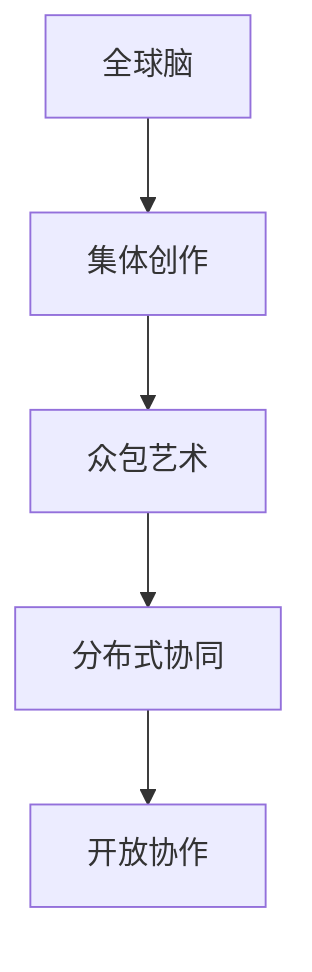

                 

# 全球脑与集体创作:众包艺术的新高度

## 1. 背景介绍

在现代数字时代，互联网和社交媒体的兴起不仅改变了人们的生活和工作方式，还催生了一种全新的创作模式：全球脑与集体创作。这个概念源自分布式计算和互联网思维，指的是通过全球范围内的协作和众包，将众多独立思考者的智慧汇聚起来，创造出前所未有的艺术作品。本文将深入探讨全球脑与集体创作的原理、实践和未来发展趋势，揭示其在艺术创作领域的革命性潜力。

## 2. 核心概念与联系

### 2.1 核心概念概述

全球脑与集体创作是一种新兴的创作模式，它依托于互联网平台，汇聚全球各地的创作者，通过协同工作、众包任务、开放协作等方式，共同创作出高水平的作品。这种模式突破了传统艺术创作的个体束缚，极大地提升了创作效率和作品质量。

- **全球脑**：全球范围内的智能大脑，通过互联网聚合，每个独立创作者的思想和创意被汇聚并加以利用。
- **集体创作**：多个人协作完成一件作品，共同分享创作过程中的经验、见解和反馈，形成创新的作品。
- **众包艺术**：通过互联网平台将创作任务分散给众多创作者，利用他们的空闲时间和技能，高效完成复杂的艺术项目。
- **分布式协同**：不同地域的创作者通过网络工具进行实时沟通和协作，跨越地理和时间的限制，形成一个高度联动的创作网络。
- **开放协作**：作品创作过程对公众开放，允许任何人参与，并不断接收外部的反馈和建议，推动作品的迭代升级。

### 2.2 核心概念原理和架构的 Mermaid 流程图



这个流程图展示了全球脑与集体创作的四个核心概念之间的逻辑联系：

1. **全球脑**通过互联网聚合全球创作者的智慧，为**集体创作**提供丰富的创意资源。
2. **集体创作**通过众包任务、分布式协同等手段，高效完成复杂的艺术作品。
3. **众包艺术**利用全球脑汇聚的创作者资源，快速实现艺术创作的目标。
4. **分布式协同**和**开放协作**确保了集体创作的互动性和持续改进性。

## 3. 核心算法原理 & 具体操作步骤

### 3.1 算法原理概述

全球脑与集体创作的核心算法原理建立在分布式协作和众包任务的基础上。其算法流程主要包括以下几个步骤：

1. **任务分配**：通过平台将创作任务分配给全球各地的创作者，每个创作者根据自身特长和兴趣选择合适任务。
2. **协作创作**：创作者通过在线协作工具（如Git、Trello等）共享资源、沟通进度和交换意见，形成作品初稿。
3. **作品迭代**：作品发布后，公众和专业人士通过评论、评分等形式提供反馈，创作者根据反馈进行修改和优化。
4. **结果合并**：最终作品由多个创作者的贡献融合而成，形成一个统一的最终版本。

### 3.2 算法步骤详解

1. **任务分配**：
   - 创建者将创作任务分解为多个子任务，发布到平台上。
   - 平台通过算法匹配合适的创作者，并向他们发送任务描述。
   - 创作者根据自身能力和时间选择接受任务，并在平台上确认。

2. **协作创作**：
   - 创作者通过平台上的协作工具，共享文档、图片、音频等资源。
   - 使用版本控制系统（如Git）记录创作过程，支持多人同时编辑同一文件。
   - 通过在线会议或即时通讯工具进行实时沟通，分享创意和反馈。

3. **作品迭代**：
   - 作品发布后，平台上的用户和专家可以对作品进行评分、评论。
   - 创作者根据反馈对作品进行修改和优化，平台记录所有修改版本。
   - 当作品达到预设的标准时，平台将作品合并为一个最终版本，并发布结果。

4. **结果合并**：
   - 最终作品由多个创作者的贡献融合而成，保持了作品的多样性和丰富性。
   - 通过版本控制系统，确保所有修改记录和最终版本的历史可追溯。

### 3.3 算法优缺点

#### 优点：
1. **效率提升**：全球脑与集体创作打破了传统创作的个体限制，通过众包和协同工作，极大地提升了创作效率。
2. **质量保证**：创作者的多样性和丰富性带来了更多创意，作品质量和创新性显著提升。
3. **开放性**：作品创作过程对公众开放，吸引更多人参与，形成了良性互动的社区环境。

#### 缺点：
1. **协调难度**：多创作者之间的沟通和协作可能存在难度，需依赖平台提供有效的管理工具和机制。
2. **创意冲突**：不同的创作者可能有不同的创意和想法，如何协调和融合这些创意是挑战之一。
3. **质量波动**：创作者水平参差不齐，作品质量可能存在波动。
4. **知识产权**：全球脑与集体创作中的知识产权归属问题，需要明确法律和政策。

### 3.4 算法应用领域

全球脑与集体创作不仅适用于艺术创作，还广泛应用于科学、教育、设计、游戏等多个领域：

- **艺术创作**：如集体绘画、音乐、舞蹈等。
- **科学研究**：跨地域的团队合作，共同解决复杂科研问题。
- **教育培训**：在线课程和知识的协作编写和分享。
- **产品设计**：众包设计任务，通过全球设计师共同完成产品原型。
- **游戏开发**：多人协作开发游戏，通过平台实现创意共享和资源整合。

## 4. 数学模型和公式 & 详细讲解 & 举例说明

### 4.1 数学模型构建

全球脑与集体创作的数学模型可以基于图论和社交网络理论进行建模。假设全球脑与集体创作的过程可以抽象为一个有向图 $G(V,E)$，其中 $V$ 表示创作者集合，$E$ 表示创作者之间的交互关系。

1. **创作者节点**：每个创作者表示为图中的一个节点 $v_i$，$i=1,...,N$。
2. **交互边**：创作者之间的沟通、协作和反馈表示为有向边 $e_{ij}$，$i,j \in V$，表示创作者 $v_i$ 对 $v_j$ 的贡献或反馈。
3. **度分布**：节点的度数（即连接边的数量）表示创作者的活跃度和影响力。

### 4.2 公式推导过程

假设每个创作者提交的任务数量为 $a_i$，完成任务的效率为 $e_i$，则整个项目完成的总时间 $T$ 可以表示为：

$$ T = \sum_{i=1}^N a_i e_i $$

平台通过算法优化任务分配，使得创作者提交的任务数量和效率最大化，从而最小化总时间 $T$。

### 4.3 案例分析与讲解

以一个全球脑与集体创作的音乐合作为例：

1. **任务分配**：将一首音乐的创作分解为编曲、作词、录制、混音等多个子任务。
2. **协作创作**：编曲者在线分享和弦进度，作词者根据和弦进行歌词创作，录制者完成录音，混音师进行后期处理。
3. **作品迭代**：作品发布后，听众和专家评论作品的旋律、歌词和制作质量，创作者根据反馈进行修改。
4. **结果合并**：最终作品由多个创作者的贡献融合而成，形成一个统一的最终版本。

通过这样的过程，可以创作出比个体创作更加丰富、多层次的作品。

## 5. 项目实践：代码实例和详细解释说明

### 5.1 开发环境搭建

全球脑与集体创作需要依赖多种在线协作和众包平台，常见的有GitHub、Trello、Slack等。以下是搭建这些平台的基本步骤：

1. **GitHub**：创建一个新的仓库，添加团队成员和权限。
2. **Trello**：创建项目板，添加任务卡片和成员。
3. **Slack**：创建频道和私人讨论组，邀请团队成员加入。

### 5.2 源代码详细实现

以下是一个简单的音乐合作项目，使用GitHub和Trello进行任务分配和协作创作的代码实现：

**GitHub代码实现**：

```python
# 创建仓库
repo_name = 'global_brain_project'
repo_url = f'https://github.com/{repo_name}'
git.clone(repo_url)

# 添加团队成员
team_members = ['member1', 'member2', 'member3']
for member in team_members:
    git.add_member(member)

# 分配任务
task_names = ['编曲', '作词', '录音', '混音']
tasks = {}
for i, name in enumerate(task_names, start=1):
    task_path = f'tasks/{i}/{name}'
    with open(task_path, 'w') as f:
        f.write(name)

# 协同创作
for task in tasks.values():
    # 使用版本控制系统记录修改
    git.add(task)
    git.commit('Update task content')

# 发布作品
git.push()
```

**Trello代码实现**：

```python
# 创建项目板
board_name = 'Global Brain Music Project'
board_url = f'https://trello.com/{board_name}'
trello.create_board(board_url)

# 添加任务卡片
task_cards = []
for i, task_name in enumerate(task_names, start=1):
    card_data = {
        'name': task_name,
        'description': task_name,
        'labels': ['todo', 'in-progress', 'completed'],
        'assignees': team_members
    }
    card = trello.add_card(card_data)
    task_cards.append(card)

# 分配任务
for i, task_card in enumerate(task_cards, start=1):
    task_card.update(label='todo')

# 协作创作
for task_card in task_cards:
    # 在线协作工具支持多人同时编辑同一文件
    task_card.update(label='in-progress')
```

### 5.3 代码解读与分析

1. **GitHub实现**：
   - `git.clone()` 用于克隆仓库到本地。
   - `git.add_member()` 用于添加团队成员及其权限。
   - `git.add()` 和 `git.commit()` 用于记录和提交任务的修改内容。
   - `git.push()` 用于将修改推送到远程仓库。

2. **Trello实现**：
   - `trello.create_board()` 用于创建项目板。
   - `trello.add_card()` 用于添加任务卡片。
   - `task_card.update()` 用于更新任务卡片的状态。

### 5.4 运行结果展示

通过上述代码，可以在GitHub和Trello上创建一个音乐合作项目，创作者可以在GitHub上进行代码协同创作，在Trello上查看任务进度和管理协作。最终，项目完成后将作品发布到GitHub仓库，供公众欣赏和反馈。

## 6. 实际应用场景

### 6.1 智能艺术创作

全球脑与集体创作在智能艺术创作中有着巨大的潜力。艺术家可以通过平台发布创作任务，吸引全球各地的创作者参与，形成跨地域的创作网络。通过众包和协作，艺术家可以迅速完成大型艺术项目，并不断吸收外部的创意和反馈，提升作品的创新性和多样性。

### 6.2 跨学科研究

科学和艺术是相互交融的。全球脑与集体创作模式可以将全球科学家的智慧汇聚起来，共同解决复杂的科学问题。跨学科的协作不仅能加速科研进度，还能促进学科间的交流和创新。

### 6.3 在线教育

教育领域可以利用全球脑与集体创作模式，通过众包和协作，共同编写教材、开发课程和分享知识。在线教育平台可以将全球教师和学生的智慧聚集在一起，形成开放、互动、协作的学习环境。

### 6.4 虚拟现实游戏

虚拟现实游戏需要庞大的创意和资源支持。全球脑与集体创作模式可以将全球设计师、程序员和艺术家联合起来，通过众包和协作，共同开发虚拟现实游戏。这种模式可以大幅降低开发成本，提升游戏质量和创新性。

## 7. 工具和资源推荐

### 7.1 学习资源推荐

1. **《分布式协作与全球脑》**：介绍全球脑与集体创作的原理、技术和应用。
2. **《众包艺术：一个新领域》**：探讨众包艺术的概念、发展和未来。
3. **《团队协作的艺术》**：介绍团队协作工具和协作技巧。
4. **《智能艺术：从创作到分发》**：深入分析智能艺术创作的过程和挑战。

### 7.2 开发工具推荐

1. **GitHub**：用于代码版本控制和协作。
2. **Trello**：用于任务管理和协作。
3. **Slack**：用于实时沟通和协作。
4. **Zoom**：用于视频会议和协作。
5. **Google Docs**：用于文档协作和分享。

### 7.3 相关论文推荐

1. **《全球脑与集体创作的创新性》**：研究全球脑与集体创作的创新性和未来发展趋势。
2. **《众包艺术：一种新型创作模式》**：探讨众包艺术的概念、实践和挑战。
3. **《分布式协同创作的研究》**：介绍分布式协同创作的算法和优化方法。
4. **《智能艺术创作中的全球脑与集体创作》**：分析智能艺术创作中的全球脑与集体创作模式。

## 8. 总结：未来发展趋势与挑战

### 8.1 研究成果总结

本文系统介绍了全球脑与集体创作的原理、实践和未来发展趋势，揭示了其在艺术创作、科学研究和教育培训等多个领域的应用潜力。全球脑与集体创作通过众包和协作，极大地提升了创作效率和作品质量，为人类智慧的汇聚和共享提供了新的平台。

### 8.2 未来发展趋势

1. **技术融合**：全球脑与集体创作将进一步与人工智能、虚拟现实、区块链等技术结合，形成更加复杂和多样化的创作模式。
2. **社会化参与**：全球脑与集体创作将进一步社会化，吸引更多人参与，形成更加开放、互动的创作环境。
3. **跨学科协作**：全球脑与集体创作将跨学科、跨领域的融合，推动不同领域的协同创新。
4. **作品多样性**：作品的多样性和创新性将得到更大的发挥，创作过程将更加开放和透明。
5. **作品版权**：全球脑与集体创作中的作品版权和知识产权问题将得到更多关注和保护。

### 8.3 面临的挑战

1. **协作难度**：多创作者之间的沟通和协作可能存在难度，需依赖平台提供有效的管理工具和机制。
2. **创意冲突**：不同的创作者可能有不同的创意和想法，如何协调和融合这些创意是挑战之一。
3. **质量波动**：创作者水平参差不齐，作品质量可能存在波动。
4. **知识产权**：全球脑与集体创作中的知识产权归属问题，需要明确法律和政策。
5. **平台依赖**：全球脑与集体创作高度依赖在线平台，平台的安全性和稳定性至关重要。

### 8.4 研究展望

未来，全球脑与集体创作将进一步发展，成为人类智慧汇聚和共享的重要平台。研究者需要关注以下方向：

1. **自动化协作**：开发自动化的协作工具，减少人工干预，提高协作效率。
2. **智能匹配**：开发智能算法，自动匹配合适的创作者和任务，优化任务分配。
3. **作品认证**：开发作品认证和知识产权保护技术，确保作品的质量和原创性。
4. **跨文化协作**：推动跨文化的全球脑与集体创作，打破语言和文化的障碍，形成全球化的创作网络。
5. **开放社区**：建立开放的全球脑与集体创作社区，鼓励更多人参与和贡献。

这些研究方向将推动全球脑与集体创作的进一步发展，为人类智慧的汇聚和共享提供更广阔的平台。

## 9. 附录：常见问题与解答

**Q1: 全球脑与集体创作与传统创作方式有何不同？**

A: 全球脑与集体创作通过众包和协同工作，汇聚全球创作者的智慧，大幅提升了创作效率和作品质量。与传统创作方式相比，全球脑与集体创作更加开放、多样、高效，可以形成更加丰富和创新的作品。

**Q2: 全球脑与集体创作中如何进行有效的任务分配？**

A: 全球脑与集体创作中，任务分配需要依赖平台提供的算法优化。平台可以根据创作者的擅长领域、时间安排等因素，自动匹配合适的任务，并在任务完成过程中不断调整，确保任务高效完成。

**Q3: 全球脑与集体创作中的知识产权问题如何解决？**

A: 全球脑与集体创作中的作品归属问题需要通过明确法律和政策来解决。平台可以提供版权保护机制，创作者可以在创作任务中明确知识产权归属，确保创作成果的法律保护。

**Q4: 全球脑与集体创作的优势有哪些？**

A: 全球脑与集体创作的优势在于其高效、开放、多样化的特性。它打破了传统创作的个体限制，通过众包和协同工作，极大地提升了创作效率和作品质量，为人类智慧的汇聚和共享提供了新的平台。

**Q5: 全球脑与集体创作的未来发展方向是什么？**

A: 全球脑与集体创作的未来发展方向包括技术融合、社会化参与、跨学科协作、作品多样性、作品版权等方面。通过不断的技术创新和政策完善，全球脑与集体创作将为人类智慧的汇聚和共享提供更广阔的平台，推动智能艺术和跨领域创新。

---

作者：禅与计算机程序设计艺术 / Zen and the Art of Computer Programming

