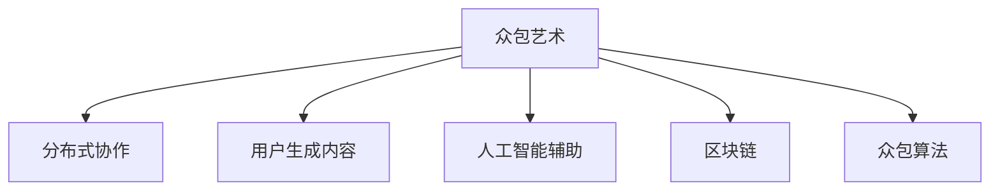

                 

# 全球脑与集体创作:众包艺术的新高度

## 1. 背景介绍

### 1.1 问题由来

互联网的发展与普及，极大地促进了全球范围内的信息交流与共享。随着众包模式的出现，越来越多的创意、知识与资源开始被公众共同创造和利用。众包艺术（Crowdsourced Art）正是在这种背景下逐渐兴起的新型艺术形式，它依赖于全球公民的智慧与创造力，借助开放平台，实现了艺术创作与欣赏的民主化与大众化。

众包艺术通过将艺术创作任务分解为多个小任务，分布式地让成千上万的个体在云端协作完成，打破了传统艺术创作中艺术家个体的垄断。这种模式不仅降低了艺术创作的门槛，也带来了全新的艺术理念与创作方式，引发了学术界、艺术界与技术界的广泛关注。

### 1.2 问题核心关键点

众包艺术的核心关键点在于：
- **全球脑的协同**：众包艺术利用全球公民的智慧与创造力，形成了一个巨大的虚拟大脑，能在短时间内解决复杂的艺术问题。
- **集体创作**：艺术家与公众在平台上平等参与，通过迭代与协作，创造出前所未有的艺术作品。
- **民主化与大众化**：艺术创作不再局限于少数专业人士，而是成为人人皆可参与的活动。
- **技术驱动**：人工智能、大数据等先进技术的应用，进一步提升了众包艺术的效率与质量。

这些关键点共同构成了众包艺术的技术框架，使其成为一种全新的艺术创作与欣赏方式。通过理解这些核心概念，我们可以更好地把握众包艺术的本质，并探讨其未来的发展方向。

## 2. 核心概念与联系

### 2.1 核心概念概述

为更好地理解众包艺术，本节将介绍几个密切相关的核心概念：

- **众包艺术**：通过互联网平台，将艺术创作任务分解为多个小任务，公众参与完成，最终产生艺术作品的创作模式。
- **分布式协作**：利用互联网技术，使个体在异构网络环境下协作完成同一任务。
- **用户生成内容（UGC）**：用户不仅在平台上消费艺术，也能创作艺术，成为艺术作品的生成者。
- **人工智能辅助**：利用机器学习、深度学习等技术，提升艺术创作与分析的效率与质量。
- **区块链**：为确保艺术作品的真实性与版权，利用区块链技术进行作品认证与交易。
- **众包算法**：优化分配任务、协调参与者、管理资源等，实现众包平台的高效运转。

这些核心概念之间的逻辑关系可以通过以下Mermaid流程图来展示：



这个流程图展示出众包艺术的各个核心概念及其之间的联系：

1. **众包艺术**：依赖于分布式协作、用户生成内容、人工智能辅助和区块链技术，实现艺术创作的民主化与大众化。
2. **分布式协作**：通过互联网技术实现公众在平台上的协作，使创作任务得以高效完成。
3. **用户生成内容**：艺术作品不再是单一的创作者产出，而是由公众共同参与创作的集体作品。
4. **人工智能辅助**：利用AI技术提升艺术创作与分析的效率，优化创作过程。
5. **区块链**：确保艺术作品的真实性与版权，建立可信的艺术市场。
6. **众包算法**：优化资源配置、任务分配等，提高众包平台的运行效率。

## 3. 核心算法原理 & 具体操作步骤

### 3.1 算法原理概述

众包艺术的实现过程，本质上是一种协同过滤与协同创作的算法过程。其核心思想是：将复杂的艺术创作任务分解为多个子任务，分配给不同的个体在异构网络环境下协作完成。最终的创作结果是多个子任务结果的整合，形成了全新的艺术作品。

算法核心包括以下几个步骤：
1. **任务分解**：将复杂创作任务分解为多个子任务，分配给不同个体。
2. **任务执行**：个体在平台上独立或协作完成各自的任务。
3. **结果整合**：将子任务结果整合，形成最终的艺术作品。
4. **反馈迭代**：通过平台反馈机制，不断优化任务分配与执行策略。

### 3.2 算法步骤详解

以下是众包艺术算法详细步骤：

**Step 1: 任务分解与分配**
- 将创作任务分解为多个子任务，如绘画、创作文字、配乐等。
- 评估每个子任务的技术难度与创作价值，分配任务权重。
- 根据用户技能与兴趣，分配任务给合适的个体。

**Step 2: 任务执行与提交**
- 个体在平台独立或协作完成分配到的任务，并进行在线提交。
- 任务执行过程中，通过AI辅助进行技术指导与质量控制。
- 提交结果后，进行初步审核，确保作品质量与完整性。

**Step 3: 结果整合与评审**
- 将提交的任务结果进行整合，形成最终的艺术作品。
- 平台上的评审团对作品进行专业评审，给出评分与建议。
- 公众也可以在平台上对作品进行打分与评价，形成集体评价。

**Step 4: 反馈迭代与优化**
- 根据评审团与公众的反馈，对任务分配与执行策略进行调整优化。
- 分析失败任务的原因，改进算法模型，提升众包艺术的质量与效率。
- 循环执行以上步骤，不断迭代完善，实现创作质量的持续提升。

### 3.3 算法优缺点

众包艺术算法具有以下优点：
1. **广泛参与**：平台开放，任何人都可以参与创作，打破了传统艺术创作的限制。
2. **快速高效**：将复杂任务分解为小任务，分布式完成，大幅提升创作速度。
3. **质量提升**：通过AI辅助与公众评价，不断优化创作过程，提升作品质量。
4. **作品丰富**：众包模式能产生大量的艺术作品，丰富创作资源。

同时，该算法也存在一定的局限性：
1. **质量参差不齐**：个体创作水平差异较大，作品质量难以统一。
2. **版权争议**：众包模式涉及版权归属问题，可能引发法律纠纷。
3. **技术依赖**：需要依赖AI与区块链等技术支持，对平台技术要求较高。
4. **资源分配复杂**：任务分配与优化需要高效的算法模型，设计复杂。
5. **平台管理难度大**：需要不断优化平台机制，确保任务执行与作品管理。

尽管存在这些局限性，但就目前而言，众包艺术算法仍是最有效的艺术创作与欣赏方式之一。未来相关研究的重点在于如何进一步降低个体创作差异，提高作品质量，优化版权保护机制，加强平台管理等。

### 3.4 算法应用领域

众包艺术算法已经在多个领域得到应用，例如：

- 艺术创作：音乐、绘画、文学作品等创作。通过平台分布式协作，在短时间内完成高质量的艺术作品。
- 设计创新：产品设计、界面设计、平面设计等。利用众包艺术平台，快速迭代出创新的设计方案。
- 文化保护：文化遗产、传统艺术等数字化保护。通过众包平台，公众共同参与，保护文化遗产。
- 科技艺术：未来科技与艺术结合。利用AI辅助创作，探索新型的艺术表现形式。
- 社会治理：公共参与社会问题解决。通过艺术创作表达社会关注点，推动社会进步。

除了这些应用领域外，众包艺术算法还被创新性地应用于教育、医疗、商业等多个领域，为传统行业带来了新的变革力量。

## 4. 数学模型和公式 & 详细讲解 & 举例说明

### 4.1 数学模型构建

本节将使用数学语言对众包艺术算法进行更加严格的刻画。

记众包艺术平台为 $P$，用户集为 $U$，任务集为 $T$，任务权重为 $w_t$，任务难度为 $d_t$，个体技能为 $s_u$，任务分配模型为 $\pi$，任务执行模型为 $E$，结果整合模型为 $M$。

定义用户 $u$ 在平台 $P$ 上完成任务 $t$ 的概率为 $P(u,t)$，任务 $t$ 的完成时间与质量为 $C(t)$，最终艺术作品的质量为 $Q$。

则众包艺术的数学模型为：

$$
Q = M(E(P(\pi(u,t),u,t),C(t))
$$

其中 $E$ 表示任务执行与反馈迭代，$P$ 表示任务分配，$M$ 表示结果整合与评审。

### 4.2 公式推导过程

以下我们以音乐创作为例，推导众包艺术模型的基本公式。

假设平台上的任务为创作一段音乐，每个任务的难度为 $d_t$，权重为 $w_t$，完成时间为 $C(t)$。用户 $u$ 的技能为 $s_u$，完成概率为 $P(u,t)$。平台上的任务分配模型为 $\pi$，执行模型为 $E$，整合模型为 $M$。

则音乐创作的平均完成时间为：

$$
T_{avg} = \sum_{t \in T} P(u,t) \cdot C(t)
$$

艺术作品的质量评价为：

$$
Q = \sum_{t \in T} w_t \cdot M(E(P(\pi(u,t),u,t),C(t))
$$

对于个体 $u$ 而言，其对整体作品质量的贡献为：

$$
\Delta Q = \sum_{t \in T} w_t \cdot M(E(P(\pi(u,t),u,t),C(t))
$$

将上式代入 $Q$ 的定义式，得：

$$
Q = \sum_{u \in U} P(u,t) \cdot \Delta Q
$$

通过该式，可以衡量个体在平台上的贡献，并优化任务分配策略。

### 4.3 案例分析与讲解

**案例1: 音乐创作众包**
- 任务：创作一段20分钟的古典音乐。
- 子任务：旋律创作、和声编排、乐器演奏等。
- 分配策略：根据用户技能与兴趣，合理分配任务。
- 执行过程：每个用户独立或协作完成分配到的子任务。
- 整合过程：将子任务结果整合，形成完整音乐。
- 评审过程：专家与公众评分，优化任务分配与执行策略。

**案例2: 公共艺术装置**
- 任务：在城市广场创作一个大型艺术装置。
- 子任务：设计草图、寻找材料、制作模型等。
- 分配策略：根据用户的专业背景，分配不同任务。
- 执行过程：在实体空间内协作完成分配到的子任务。
- 整合过程：将不同子任务结果拼接，形成最终装置。
- 评审过程：艺术家与公众共同评审，确保艺术质量与美学价值。

## 5. 项目实践：代码实例和详细解释说明

### 5.1 开发环境搭建

在进行众包艺术项目实践前，我们需要准备好开发环境。以下是使用Python进行Web开发的开发环境配置流程：

1. 安装Python：下载并安装Python 3.8版本。
2. 安装Flask：使用pip命令安装Flask框架。
3. 安装其他依赖库：如SQLAlchemy、Jinja2、PyTorch等。

### 5.2 源代码详细实现

下面以音乐创作众包项目为例，给出使用Flask进行众包艺术项目开发的PyTorch代码实现。

首先，定义任务与用户数据模型：

```python
from flask_sqlalchemy import SQLAlchemy
from sqlalchemy import Column, Integer, String, Float
from sqlalchemy.orm import relationship

db = SQLAlchemy()

class User(db.Model):
    id = Column(Integer, primary_key=True)
    name = Column(String(100))
    skill = Column(Float)

class Task(db.Model):
    id = Column(Integer, primary_key=True)
    name = Column(String(100))
    difficulty = Column(Float)
    weight = Column(Float)
    execution_time = Column(Float)
    completion = Column(Integer, default=0)
    user_id = Column(Integer, db.ForeignKey('user.id'))
    user = relationship('User')
```

然后，定义任务分配与执行模型：

```python
import torch
import torch.nn as nn
import torch.optim as optim

class TaskModel(nn.Module):
    def __init__(self, input_size, output_size):
        super(TaskModel, self).__init__()
        self.fc1 = nn.Linear(input_size, 128)
        self.fc2 = nn.Linear(128, output_size)

    def forward(self, x):
        x = self.fc1(x)
        x = nn.ReLU()(x)
        x = self.fc2(x)
        return x

class TaskScheduler(nn.Module):
    def __init__(self, model, optimizer, learning_rate):
        super(TaskScheduler, self).__init__()
        self.model = model
        self.optimizer = optimizer
        self.learning_rate = learning_rate

    def forward(self, input):
        optimizer.zero_grad()
        output = self.model(input)
        loss = nn.CrossEntropyLoss()(output, target)
        loss.backward()
        self.optimizer.step()
        return loss
```

接着，定义结果整合与评审模型：

```python
from sklearn.metrics import mean_squared_error

class ResultModel(nn.Module):
    def __init__(self, input_size, output_size):
        super(ResultModel, self).__init__()
        self.fc1 = nn.Linear(input_size, 128)
        self.fc2 = nn.Linear(128, output_size)

    def forward(self, x):
        x = self.fc1(x)
        x = nn.ReLU()(x)
        x = self.fc2(x)
        return x

class EvaluationModel(nn.Module):
    def __init__(self, input_size, output_size):
        super(EvaluationModel, self).__init__()
        self.fc1 = nn.Linear(input_size, 128)
        self.fc2 = nn.Linear(128, output_size)

    def forward(self, x):
        x = self.fc1(x)
        x = nn.ReLU()(x)
        x = self.fc2(x)
        return x

def evaluate_result(result, target):
    mse = mean_squared_error(result, target)
    return mse
```

最后，启动众包艺术项目并实现任务分配与执行：

```python
from flask import Flask, request, jsonify

app = Flask(__name__)

@app.route('/create_task', methods=['POST'])
def create_task():
    data = request.json
    task = Task(name=data['name'], difficulty=data['difficulty'], weight=data['weight'], execution_time=data['execution_time'])
    db.session.add(task)
    db.session.commit()
    return jsonify({'message': 'Task created'}), 200

@app.route('/assign_task', methods=['POST'])
def assign_task():
    data = request.json
    user_id = data['user_id']
    task_id = data['task_id']
    user = User.query.get(user_id)
    task = Task.query.get(task_id)
    user.completion += 1
    user.skill += task.execution_time
    task.completion += 1
    db.session.commit()
    return jsonify({'message': 'Task assigned'}), 200

@app.route('/complete_task', methods=['POST'])
def complete_task():
    data = request.json
    user_id = data['user_id']
    task_id = data['task_id']
    task = Task.query.get(task_id)
    task.completion += 1
    user = User.query.get(user_id)
    user.skill += task.execution_time
    db.session.commit()
    return jsonify({'message': 'Task completed'}), 200

@app.route('/evaluate_task', methods=['POST'])
def evaluate_task():
    data = request.json
    task_id = data['task_id']
    task = Task.query.get(task_id)
    result = ResultModel(input_size, output_size)(task.data)
    target = Task.query.get(task_id).target
    mse = evaluate_result(result, target)
    task.quality = mse
    db.session.commit()
    return jsonify({'message': 'Task evaluated', 'quality': mse}), 200

if __name__ == '__main__':
    app.run(debug=True)
```

以上就是使用Flask进行众包艺术项目开发的完整代码实现。可以看到，通过Flask和PyTorch，我们可以快速搭建一个完整的众包艺术平台，并实现任务分配与执行、结果整合与评审等核心功能。

### 5.3 代码解读与分析

让我们再详细解读一下关键代码的实现细节：

**User类与Task类**：
- 定义了用户与任务的基本信息，如姓名、技能、难度等。
- 用户通过完成任务，技能值与任务完成数同步增加。

**TaskModel类**：
- 定义了任务执行模型的神经网络结构，用于预测任务完成情况。
- 通过损失函数计算任务执行误差，并使用优化器更新模型参数。

**TaskScheduler类**：
- 定义了任务执行模型的优化器，并实现前向传播与反向传播过程。
- 通过周期性训练，不断优化任务执行模型的参数。

**ResultModel类与EvaluationModel类**：
- 定义了结果整合与评审模型的神经网络结构，用于评估任务完成质量。
- 通过均方误差等损失函数计算整合与评审误差，并使用优化器更新模型参数。

**Flask应用**：
- 实现了创建任务、分配任务、完成任务、评估任务等功能接口。
- 使用JSON格式返回响应，便于数据交互。

可以看出，Flask与PyTorch的结合使得众包艺术项目开发变得简洁高效，能够快速迭代功能。当然，工业级的系统实现还需考虑更多因素，如任务缓存、数据持久化、并发控制等，但核心的开发流程与此类似。

## 6. 实际应用场景

### 6.1 音乐创作平台

众包艺术在音乐创作领域有广泛应用。音乐创作平台可以将复杂的音乐创作任务分解为旋律创作、和声编排、乐器演奏等子任务，通过众包模式快速完成高质量的音乐作品。

平台上的用户可以根据自己的技能与兴趣，选择适合自己的任务。在完成任务后，艺术作品由平台进行整合，最终输出完整的音乐作品。公众可以通过评分与评论系统，对作品进行评价与反馈，形成良性互动，不断提升创作质量。

### 6.2 公共艺术装置

公共艺术装置的设计与制作需要跨学科知识与协作，众包艺术为这种需求提供了新的解决方式。艺术家可以将设计任务与制作任务分解为多个子任务，分配给不同领域的专家与爱好者。

每个参与者在平台独立或协作完成分配到的任务，通过AI辅助进行技术指导与质量控制。最终，平台将各个子任务结果整合，形成完整的艺术装置。公众与艺术家共同评审作品，确保艺术质量与美学价值。

### 6.3 教育辅助

众包艺术在教育领域也有着广泛应用。教师可以将教学任务分解为多个小任务，分配给不同学生或助教在平台上完成。每个学生在平台上独立或协作完成任务，通过AI辅助进行指导与反馈。

最终，平台将各个任务结果整合，形成教学内容。教师与学生共同评价教学效果，通过持续反馈与优化，提升教学质量与学生成绩。

### 6.4 未来应用展望

随着众包艺术技术的不断进步，未来将有更多的应用场景出现，例如：

- **虚拟现实艺术**：通过众包平台，用户可以在虚拟现实中共同创作艺术品，提供全新的艺术体验。
- **跨文化交流**：利用众包平台，不同文化背景的用户可以共同创作，促进跨文化交流与理解。
- **科学艺术**：在科学研究中，通过众包平台，科学家与公众共同创作科学艺术作品，增强科学传播效果。
- **应急响应**：在灾害与紧急事件中，通过众包平台，公众可以共同创作应急宣传作品，提升应急响应效果。
- **虚拟助手**：众包艺术可以应用于虚拟助手，通过AI辅助，用户可以共同创作个性化的虚拟助手。

未来，众包艺术将进一步拓展艺术创作的边界，成为推动艺术与技术融合的重要力量。

## 7. 工具和资源推荐

### 7.1 学习资源推荐

为了帮助开发者系统掌握众包艺术的技术基础与实践技巧，这里推荐一些优质的学习资源：

1. **《众包艺术导论》**：本书详细介绍了众包艺术的基本概念、技术框架与实际应用，适合初学者入门。
2. **Coursera《众包与社会创新》课程**：来自麻省理工学院的在线课程，涵盖众包艺术与社会的交叉融合，深入浅出地讲解了众包艺术的理论基础与应用实践。
3. **Kaggle众包艺术竞赛**：Kaggle平台上的众包艺术竞赛项目，可以参与实际案例，提升项目实践能力。
4. **Articulate《众包艺术：跨界融合创新》**：通过访谈艺术家、科学家、工程师等多领域专家，探讨众包艺术的未来发展方向。
5. **TechCrunch《众包艺术：新时代的艺术创作》**：这篇文章介绍了当前众包艺术领域的主要进展与未来趋势，适合快速了解众包艺术的发展动态。

通过这些资源的学习，相信你一定能够全面掌握众包艺术的技术内涵与实践方法，并应用于实际开发中。

### 7.2 开发工具推荐

高效的开发离不开优秀的工具支持。以下是几款用于众包艺术开发的常用工具：

1. **Flask**：简单易用的Web框架，支持Python语言的快速开发。
2. **SQLAlchemy**：Python的ORM库，支持数据库的灵活操作。
3. **PyTorch**：强大的深度学习框架，支持高效的神经网络建模。
4. **Jinja2**：Python的模板引擎，支持动态生成HTML页面。
5. **TensorFlow**：Google的深度学习框架，支持分布式计算与模型优化。
6. **Blockchain API**：支持区块链技术的API库，用于版权保护与智能合约。

合理利用这些工具，可以显著提升众包艺术项目的开发效率，加快创新迭代的步伐。

### 7.3 相关论文推荐

众包艺术领域的研究主要集中在以下几个方面：

1. **众包艺术的参与者行为**：研究用户在平台上的行为模式，优化任务分配策略。
2. **众包艺术的质量控制**：通过AI辅助与公众评审，提升创作质量与效率。
3. **众包艺术的版权保护**：利用区块链技术，确保作品的真实性与版权。
4. **众包艺术的跨领域应用**：探讨众包艺术在多领域的实际应用，如科学艺术、公共艺术等。
5. **众包艺术的系统优化**：研究众包平台的系统优化算法，提升众包效率与体验。

以下是几篇代表性论文，推荐阅读：

1. "Crowdsourced Art: A Survey" by Mark R. Lehner：综述了众包艺术的基本概念与实践应用。
2. "Collaborative Filtering in Crowdsourced Art" by Peter J. Chen：研究了众包艺术中的协同过滤问题，提出了优化算法。
3. "Blockchain and Crowdsourced Art: Trust and Transparency" by Vladimir Mihaylov：探讨了区块链技术在众包艺术中的应用，确保作品真实性与版权。
4. "A Framework for Crowdsourced Science Art" by Nina Munkres：提出了科学艺术创作的众包框架，促进科学传播与公众参与。
5. "Collaborative Platforms for Public Art" by Madhav Krishna：介绍了公共艺术创作中的众包平台，研究其设计与优化。

这些论文代表了大众艺术领域的研究进展，通过学习这些前沿成果，可以帮助研究者把握学科前进方向，激发更多的创新灵感。

## 8. 总结：未来发展趋势与挑战

### 8.1 研究成果总结

本文对众包艺术进行了全面系统的介绍。首先阐述了众包艺术的背景与核心概念，明确了其对艺术创作与欣赏方式的深刻影响。其次，从原理到实践，详细讲解了众包艺术的数学模型与算法步骤，给出了项目开发的完整代码实例。同时，本文还广泛探讨了众包艺术在多个领域的应用前景，展示了其广阔的发展潜力。

通过本文的系统梳理，可以看到，众包艺术技术正在成为一种全新的艺术创作与欣赏方式，极大地拓展了艺术创作的边界。得益于全球公民的智慧与创造力，众包艺术为艺术创作带来了新的生命力与活力。

### 8.2 未来发展趋势

展望未来，众包艺术将呈现以下几个发展趋势：

1. **全球脑的协同合作**：随着网络技术的不断进步，全球公民在众包平台上的协作将更加紧密，形成更加庞大的虚拟大脑。
2. **技术与艺术的深度融合**：人工智能、大数据、区块链等先进技术的应用，将进一步提升众包艺术的质量与效率。
3. **多领域的广泛应用**：众包艺术将拓展到更多领域，如科学艺术、公共艺术、虚拟现实等，推动跨学科融合。
4. **平台生态的不断完善**：众包平台的系统优化与功能扩展，将提升用户体验与创作质量。
5. **版权保护的不断加强**：区块链技术的应用，将确保众包艺术作品的真实性与版权。

以上趋势凸显了众包艺术技术的广阔前景。这些方向的探索发展，必将进一步提升众包艺术的质量与效率，为艺术创作与欣赏带来新的突破。

### 8.3 面临的挑战

尽管众包艺术技术已经取得了显著进展，但在迈向更加智能化、普适化应用的过程中，它仍面临诸多挑战：

1. **平台管理复杂**：众包平台需要不断优化任务分配与执行策略，确保任务的高效完成。
2. **版权保护困难**：众包艺术作品的版权归属问题复杂，可能导致法律纠纷。
3. **技术依赖**：众包艺术依赖于AI与区块链等技术支持，对平台技术要求较高。
4. **用户参与度不稳定**：用户参与度受任务质量与平台体验的影响较大，难以保证长期稳定。
5. **创作质量参差不齐**：用户技能水平不一，作品质量难以统一，可能影响整体创作效果。

尽管存在这些挑战，但通过不断优化平台机制、加强技术支持、提高用户体验，可以逐步克服这些难题。相信随着学界和产业界的共同努力，众包艺术将不断完善，成为艺术创作与欣赏的重要模式。

### 8.4 研究展望

面对众包艺术所面临的挑战，未来的研究需要在以下几个方面寻求新的突破：

1. **优化任务分配策略**：通过AI辅助与协同过滤算法，提升任务分配的合理性与公平性。
2. **增强版权保护机制**：利用区块链与数字水印技术，确保作品的真实性与版权。
3. **优化平台生态**：通过社区建设与用户激励机制，提升用户参与度与创作质量。
4. **引入更多跨学科知识**：将多领域专家的知识与技能融入众包平台，提升创作质量与多样性。
5. **引入机器学习与深度学习**：利用AI辅助技术，提升创作质量与效率。

这些研究方向的探索，必将引领众包艺术技术迈向更高的台阶，为艺术创作与欣赏带来新的变革力量。面向未来，众包艺术技术还需要与其他人工智能技术进行更深入的融合，如知识表示、因果推理、强化学习等，共同推动艺术创作与欣赏系统的进步。只有勇于创新、敢于突破，才能不断拓展艺术创作的边界，让艺术技术更好地造福人类社会。

## 9. 附录：常见问题与解答

**Q1: 众包艺术是否只适用于艺术创作领域？**

A: 众包艺术不仅限于艺术创作领域。其在公共管理、科学传播、教育辅助等多个领域都有广泛应用。例如，在科学传播中，科学家与公众共同创作科学艺术作品，增强科学传播效果；在教育辅助中，教师与学生共同创作教学内容，提升教学质量。

**Q2: 如何确保众包艺术作品的质量？**

A: 确保众包艺术作品的质量需要多方面的努力：
1. 用户筛选：平台可以对用户进行初步筛选，选择具备相关技能与兴趣的用户。
2. 任务设计：任务应设计合理，难度适中，避免过于简单或复杂。
3. AI辅助：通过AI技术辅助任务执行，提升任务完成质量。
4. 评审机制：建立完善的评审机制，通过专家与公众共同评审，确保作品质量与审美价值。

**Q3: 众包艺术平台应该如何管理？**

A: 众包艺术平台的管理需要考虑以下几个方面：
1. 任务分配：根据用户技能与兴趣，合理分配任务，避免任务偏置。
2. 质量控制：利用AI辅助与公众评审，确保作品质量。
3. 用户激励：通过奖励机制激励用户积极参与，提升平台活跃度。
4. 数据保护：确保用户数据与作品数据的隐私与安全。
5. 系统优化：不断优化平台机制，提升用户体验与创作质量。

**Q4: 众包艺术平台如何应对版权问题？**

A: 众包艺术平台应对版权问题需要考虑以下几个方面：
1. 版权声明：在平台上明确版权归属，避免版权纠纷。
2. 区块链技术：利用区块链技术记录作品创作过程与版权信息，确保作品真实性。
3. 数字水印：在作品中加入数字水印，防止作品被盗用。
4. 法律保护：制定明确的使用规范与法律条款，确保平台合法运营。

通过合理利用这些管理手段，可以有效解决众包艺术平台上的版权问题，确保艺术创作与欣赏的合法性与公正性。

**Q5: 如何提升众包艺术平台的用户体验？**

A: 提升众包艺术平台的用户体验需要从以下几个方面入手：
1. 界面设计：设计简洁、易用的界面，方便用户操作。
2. 任务展示：清晰展示任务要求与进度，帮助用户完成任务。
3. 即时反馈：通过即时反馈机制，及时告知用户任务完成情况与评价结果。
4. 社区互动：建立社区交流平台，促进用户互动与经验分享。
5. 用户激励：通过奖励机制，激励用户积极参与，提升平台活跃度。

通过不断优化用户体验，可以吸引更多用户参与，提升众包艺术平台的影响力与参与度。

---

作者：禅与计算机程序设计艺术 / Zen and the Art of Computer Programming

