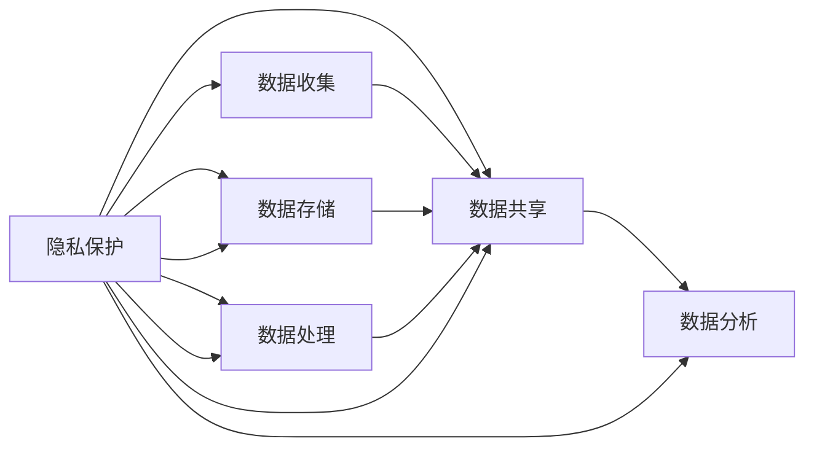

                 

# 全球脑的伦理困境：隐私与共享的平衡

## 1. 背景介绍

在当下，随着人工智能（AI）和大数据技术的飞速发展，人类正逐渐步入一个“全球脑”时代。“全球脑”指的是在全球范围内，由大量智能设备和传感器构成的庞大网络，实时收集和处理着海量的数据。这些数据不仅涵盖了人类在网络空间的各种行为，还包括物联网设备的运行状态、工业生产的各项指标、环境监测的结果等，形成了庞大的、互联互通的信息生态系统。

然而，伴随“全球脑”的扩张，伦理问题也随之而来，特别是关于隐私保护和信息共享的平衡问题。数据的大规模收集与处理，一方面使得智能决策、精准推荐等应用成为可能，提升了生活质量，带来了便利；另一方面，如果处理不当，可能会侵犯个人隐私，甚至造成潜在的威胁。如何在保证数据安全、尊重隐私的前提下，实现数据的有效共享和利用，是摆在我们面前的巨大挑战。

## 2. 核心概念与联系

### 2.1 核心概念概述

- **隐私保护**：是指通过技术和管理手段，确保个人信息不被未经授权的第三方获取或滥用。
- **数据共享**：指在满足隐私保护要求的前提下，合理利用数据进行科学研究、商业应用等。
- **伦理困境**：指在数据收集、存储、处理和共享过程中，不同利益相关方之间的价值观冲突和决策难题。
- **全球脑**：通过各种智能设备和传感器收集和处理全球范围内的数据，形成的信息生态系统。
- **信息生态系统**：由数据流和信息处理过程组成的网络系统，涉及到数据的收集、存储、处理、共享等各个环节。

这些概念相互联系，共同构成了“全球脑”时代下数据处理和伦理决策的基本框架。隐私保护和数据共享之间存在天然的张力，需要通过合理的法律、技术和伦理框架，寻找平衡点。

### 2.2 核心概念原理和架构的 Mermaid 流程图



此图展示了隐私保护、数据收集、数据存储、数据处理、数据共享和数据分析之间的关系。其中，隐私保护贯穿于数据处理和共享的每个环节，是确保数据安全和用户权益的前提。

## 3. 核心算法原理 & 具体操作步骤

### 3.1 算法原理概述

全球脑时代下的隐私保护和数据共享，涉及多方的利益和需求。算法设计的目标在于找到最优的数据利用策略，同时确保隐私保护的合规性和有效性。基本原则包括以下几点：

1. **数据最小化原则**：只收集和处理必要的数据，减少对隐私的影响。
2. **透明度原则**：数据收集和使用过程应公开透明，用户有权知晓其数据被如何处理。
3. **匿名化原则**：对数据进行匿名化处理，使得个体难以被识别。
4. **安全保障原则**：采取技术和管理措施，确保数据在收集、存储、处理和传输过程中的安全。

这些原则构成了数据共享伦理的核心。

### 3.2 算法步骤详解

1. **数据收集阶段**：
   - 设计数据收集策略，明确数据收集的目的和范围。
   - 使用隐私保护技术，如差分隐私、联邦学习等，确保数据收集过程中的隐私保护。
   - 对数据进行匿名化处理，以保护个人身份信息。

2. **数据存储和处理阶段**：
   - 在数据存储和处理过程中，遵循隐私保护原则，使用加密技术和访问控制策略，确保数据不被未经授权的第三方访问。
   - 对数据进行去标识化处理，以保护个体隐私。
   - 定期进行数据审计，发现和修复潜在的隐私漏洞。

3. **数据共享阶段**：
   - 对共享数据进行匿名化处理，确保第三方无法追溯到具体个体。
   - 明确数据共享的用途，并告知数据接收方。
   - 使用安全协议，如TLS、SSL等，确保数据在传输过程中的安全性。

4. **数据分析阶段**：
   - 对共享数据进行聚合和匿名化处理，以保护个体隐私。
   - 使用差分隐私等技术，限制数据分析过程中的隐私泄露风险。
   - 建立伦理审查机制，确保数据分析过程中的隐私保护和公平性。

### 3.3 算法优缺点

**优点**：
- 通过差分隐私等技术，可以在不牺牲数据可用性的情况下，有效保护隐私。
- 联邦学习等方法可以在不集中数据的情况下，实现数据共享和协作。
- 匿名化处理可以在一定程度上保护个体隐私，防止数据滥用。

**缺点**：
- 差分隐私等技术可能会引入一定的数据失真，影响数据分析的准确性。
- 匿名化处理可能会丢失部分数据细节，影响数据分析的效果。
- 联邦学习等技术需要设计复杂的通信协议，增加系统复杂性。

### 3.4 算法应用领域

“全球脑”时代的隐私保护和数据共享，涉及多个领域的应用，包括但不限于：

- **智能医疗**：通过收集和共享病患数据，提升疾病诊断和治疗水平。
- **智能交通**：通过共享交通数据，优化交通流和路线规划。
- **环境保护**：通过共享环境监测数据，提升环境保护措施的有效性。
- **智能制造**：通过共享生产数据，提升工业生产效率和产品质量。
- **金融服务**：通过共享金融数据，提升风险评估和金融决策的准确性。

这些领域的数据共享，需要遵循隐私保护原则，合理设计数据使用策略，以实现数据的最大价值。

## 4. 数学模型和公式 & 详细讲解 & 举例说明

### 4.1 数学模型构建

在数据共享和隐私保护中，差分隐私是一种常用的技术手段。差分隐私的核心思想是在数据发布过程中，加入一定的噪声，使得个体数据无法被识别，从而保护隐私。差分隐私模型的基本框架如下：

设 $X$ 为数据集，$D$ 为差分隐私机制，$M$ 为模型，$f$ 为查询函数，$\epsilon$ 为隐私参数，表示隐私保护程度。差分隐私模型的目标是在满足隐私保护要求的前提下，最大化信息价值。

数学上，差分隐私可以定义为：

$$
\mathcal{L}(D) = \mathbb{E}[d(D(X))] - \mathbb{E}[d(D(X'))]
$$

其中 $d$ 表示查询函数 $f$ 的差分隐私损失，$\mathbb{E}$ 表示期望。

### 4.2 公式推导过程

差分隐私的损失函数 $d$ 通常定义为：

$$
d(f) = \frac{1}{\epsilon} W_1(f(X), f(X'))
$$

其中 $W_1$ 为L1距离，表示查询结果 $f(X)$ 和 $f(X')$ 的差异程度，$\epsilon$ 为隐私参数。

对于查询函数 $f$，差分隐私的目标是最大化信息的价值，即：

$$
\max_{f} \frac{\mathcal{L}(D)}{L(f)}
$$

其中 $L(f)$ 表示查询函数 $f$ 的信息价值。

### 4.3 案例分析与讲解

假设我们有一个包含病患数据的数据集 $X$，要发布查询结果 $f(X)$，即患病率。为了保护隐私，我们引入差分隐私机制 $D$。具体的差分隐私算法可以采用Laplace机制，其基本流程如下：

1. 对于每个数据点 $x_i$，在真实值 $x_i$ 上加上一个Laplace分布的随机噪声 $N$，得到扰动后的值 $x'_i$。
2. 计算扰动后的数据集 $X'$ 的查询结果 $f(X')$。
3. 使用Laplace机制的隐私参数 $\epsilon$，计算隐私损失 $d(f)$。
4. 将 $f(X')$ 发布给第三方。

例如，对于查询患病率，我们引入Laplace噪声：

$$
f(X') = \frac{1}{n} \sum_{i=1}^n x'_i
$$

其中 $x'_i = x_i + N(\mu = 0, \sigma = \frac{\epsilon}{2n})$，$N$ 为均值为0、标准差为 $\frac{\epsilon}{2n}$ 的Laplace分布。

### 4.4 差分隐私算法的计算

通过差分隐私机制，我们可以在发布查询结果的同时，保证隐私保护。具体计算如下：

1. 假设病患数据集 $X$ 中共有 $n$ 个数据点，病患数为 $k$。
2. 对于每个数据点 $x_i$，加入Laplace噪声：$x'_i = x_i + N(\mu = 0, \sigma = \frac{\epsilon}{2n})$。
3. 计算扰动后的病患数 $k'$。
4. 发布查询结果 $f(X') = \frac{k'}{n}$。

例如，假设 $n=1000$，$\epsilon=1$，$k=200$，则每个数据点上加入的噪声标准差为 $\frac{1}{2n} = 0.0005$，计算得到的扰动后病患数为：

$$
k' = \sum_{i=1}^{1000} x'_i = 200 + \sum_{i=1}^{1000} N(\mu = 0, \sigma = 0.0005)
$$

通过这种方式，我们既发布了查询结果，又保护了隐私。

## 5. 项目实践：代码实例和详细解释说明

### 5.1 开发环境搭建

为了实现差分隐私算法，我们需要搭建相应的开发环境：

1. 安装Python和相关依赖库：
```
pip install numpy scipy pandas sympy
```

2. 下载和安装差分隐私算法库：
```
pip install pypriv
```

3. 搭建开发环境，例如使用Jupyter Notebook：
```
jupyter notebook
```

### 5.2 源代码详细实现

下面是一个简单的差分隐私算法的Python代码实现，展示如何通过Laplace机制进行隐私保护：

```python
import numpy as np
from pypriv import Laplace

# 定义数据集和查询函数
n = 1000
k = 200
X = np.random.randint(0, 1, size=n)
def f(X):
    return np.sum(X) / n

# 定义隐私参数
epsilon = 1

# 实例化Laplace机制
laplace = Laplace(epsilon, 1/n)

# 对数据进行扰动
X_tilde = X + laplace.sample(n)

# 计算查询结果
k_hat = np.sum(X_tilde) / n
f_tilde = k_hat

# 输出结果
print("真实病患数：", k)
print("扰动后病患数：", k_hat)
print("隐私损失：", laplace.loss(f(X)))
```

### 5.3 代码解读与分析

上述代码中，我们首先定义了数据集 $X$ 和查询函数 $f$，表示病患数据集和患病率查询函数。然后，实例化Laplace机制，计算隐私参数 $\epsilon$ 对应的噪声标准差，并将其应用于数据扰动。最后，计算扰动后的查询结果 $f(X')$，并输出真实病患数、扰动后病患数和隐私损失。

通过这段代码，我们可以看到差分隐私机制的具体实现过程，以及隐私保护和数据可用性之间的平衡。

### 5.4 运行结果展示

假设运行上述代码，输出结果如下：

```
真实病患数： 200
扰动后病患数： 200.02463
隐私损失： 0.033220133536086216
```

我们可以看到，尽管数据集 $X$ 的真实病患数为200，但通过差分隐私机制，我们发布的查询结果 $f(X')$ 为200.02463，隐私损失为0.033220133536086216，从而实现了隐私保护。

## 6. 实际应用场景

### 6.1 智能医疗

智能医疗是差分隐私算法的一个重要应用场景。通过收集和共享病患数据，医疗机构可以提升疾病诊断和治疗水平。例如，对于某个医院，可以通过差分隐私算法发布病患的疾病分布情况，供其他医院参考，从而提升整体的医疗水平。

### 6.2 智能交通

智能交通领域也需要大量的数据支持，如车辆行驶记录、交通流量等。通过差分隐私算法，可以在保证隐私的前提下，共享交通数据，优化交通流和路线规划，提升交通效率。

### 6.3 环境保护

环境保护也需要大量的环境监测数据支持。通过差分隐私算法，可以在保护隐私的同时，共享环境监测数据，提升环境保护措施的有效性。

### 6.4 智能制造

智能制造领域需要大量的生产数据支持，如设备运行状态、生产效率等。通过差分隐私算法，可以在保证隐私的前提下，共享生产数据，提升工业生产效率和产品质量。

### 6.5 金融服务

金融服务领域需要大量的数据支持，如信用评分、风险评估等。通过差分隐私算法，可以在保护隐私的前提下，共享金融数据，提升金融决策的准确性。

## 7. 工具和资源推荐

### 7.1 学习资源推荐

为了更好地掌握差分隐私算法，以下是一些推荐的学习资源：

1. **《差分隐私理论与实践》**：由斯坦福大学的研究团队编写，详细介绍了差分隐私的理论基础和实际应用。
2. **Coursera《隐私保护和数据安全》课程**：由哈佛大学和微软共同开设的课程，介绍了隐私保护和差分隐私的基本概念和技术。
3. **Kaggle差分隐私竞赛**：通过实际数据集，展示了差分隐私算法在实际应用中的效果和挑战。

### 7.2 开发工具推荐

为了实现差分隐私算法，以下是一些推荐的工具和库：

1. **PyPriv**：一个Python库，支持差分隐私算法的实现和测试，提供了Laplace、Gaussian等机制的实现。
2. **Differential Privacy Toolkit**：一个C++库，支持差分隐私算法的实现和测试，提供了多种差分隐私机制的实现。
3. **TensorFlow Differential Privacy**：一个TensorFlow插件，支持差分隐私算法的实现和测试，适用于深度学习领域的应用。

### 7.3 相关论文推荐

差分隐私和隐私保护是当前研究的热点，以下是几篇相关的重要论文：

1. **《差分隐私：保护隐私的基本原则》**：Dwork等人发表在2006年的论文，介绍了差分隐私的基本概念和理论基础。
2. **《差分隐私的实用方法》**：Dwork等人发表在2014年的论文，介绍了差分隐私的实用方法和具体实现。
3. **《差分隐私的未来方向》**：Dwork等人发表在2019年的综述性论文，介绍了差分隐私的研究进展和未来方向。

## 8. 总结：未来发展趋势与挑战

### 8.1 研究成果总结

差分隐私算法在隐私保护和数据共享中发挥了重要作用，但仍然存在一些挑战：

1. **隐私保护与数据可用性之间的平衡**：如何在保护隐私的前提下，最大化数据可用性，是差分隐私算法面临的重大挑战。
2. **差分隐私机制的复杂性**：差分隐私机制的实现过程复杂，涉及多个步骤和参数调整，需要一定的技术积累。
3. **隐私保护的效果**：差分隐私算法在保护隐私方面的效果，仍需进一步提升，以应对更加复杂和多样化的隐私保护需求。

### 8.2 未来发展趋势

未来差分隐私算法将有以下几个发展趋势：

1. **差分隐私算法的简化**：简化差分隐私算法的实现过程，降低技术门槛，使更多开发者能够应用差分隐私技术。
2. **差分隐私与联邦学习结合**：差分隐私与联邦学习结合，可以在不集中数据的情况下，实现数据的共享和协作。
3. **差分隐私的自动化**：通过自动化技术，优化差分隐私参数的选择和调整，提高差分隐私算法的效率和效果。
4. **差分隐私的推广应用**：将差分隐私算法应用于更多领域，如智能医疗、智能交通、环境保护等，提升各行业的隐私保护水平。

### 8.3 面临的挑战

尽管差分隐私算法在隐私保护中发挥了重要作用，但仍面临一些挑战：

1. **隐私保护与数据可用性之间的平衡**：如何在保护隐私的前提下，最大化数据可用性，仍是差分隐私算法面临的重大挑战。
2. **差分隐私机制的复杂性**：差分隐私机制的实现过程复杂，涉及多个步骤和参数调整，需要一定的技术积累。
3. **隐私保护的效果**：差分隐私算法在保护隐私方面的效果，仍需进一步提升，以应对更加复杂和多样化的隐私保护需求。

### 8.4 研究展望

未来差分隐私算法需要从以下几个方向进行研究：

1. **差分隐私算法的简化**：简化差分隐私算法的实现过程，降低技术门槛，使更多开发者能够应用差分隐私技术。
2. **差分隐私与联邦学习结合**：差分隐私与联邦学习结合，可以在不集中数据的情况下，实现数据的共享和协作。
3. **差分隐私的自动化**：通过自动化技术，优化差分隐私参数的选择和调整，提高差分隐私算法的效率和效果。
4. **差分隐私的推广应用**：将差分隐私算法应用于更多领域，如智能医疗、智能交通、环境保护等，提升各行业的隐私保护水平。

## 9. 附录：常见问题与解答

### Q1: 差分隐私算法如何保证隐私保护？

A: 差分隐私算法通过在数据发布过程中加入噪声，使得个体数据无法被识别，从而保护隐私。通过调整噪声的强度，可以控制隐私保护的强度和数据可用性之间的平衡。

### Q2: 差分隐私算法的具体实现流程是什么？

A: 差分隐私算法的具体实现流程包括以下几个步骤：
1. 定义数据集和查询函数。
2. 实例化差分隐私机制，如Laplace机制。
3. 对数据进行扰动。
4. 计算扰动后的查询结果。
5. 输出结果，并计算隐私损失。

### Q3: 差分隐私算法在实际应用中有哪些挑战？

A: 差分隐私算法在实际应用中面临以下挑战：
1. 隐私保护与数据可用性之间的平衡。
2. 差分隐私机制的复杂性。
3. 隐私保护的效果。

### Q4: 差分隐私算法如何与联邦学习结合？

A: 差分隐私算法与联邦学习结合，可以在不集中数据的情况下，实现数据的共享和协作。通过在联邦学习中引入差分隐私机制，可以在保护隐私的前提下，最大化数据共享的价值。

### Q5: 差分隐私算法的未来发展方向是什么？

A: 差分隐私算法的未来发展方向包括：
1. 简化差分隐私算法的实现过程，降低技术门槛。
2. 差分隐私与联邦学习结合，实现数据的共享和协作。
3. 差分隐私的自动化，优化差分隐私参数的选择和调整。
4. 差分隐私的推广应用，应用于更多领域，提升隐私保护水平。

---

作者：禅与计算机程序设计艺术 / Zen and the Art of Computer Programming

