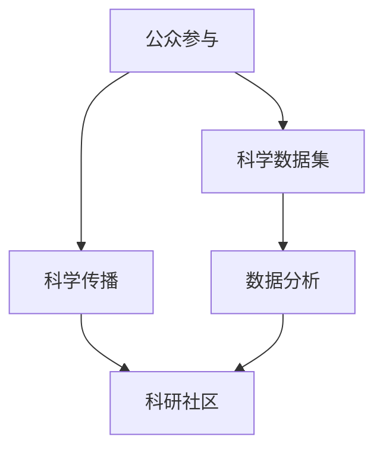

                 

# 公民科学：公众参与科学研究的新模式

> 关键词：公民科学,公众参与,科学实验,数据众包,社区合作,科学数据集,科学传播,科学研究,网络平台,社会技术,可持续发展

## 1. 背景介绍

### 1.1 问题由来
随着科技的发展和互联网的普及，公民参与科学研究（Citizen Science）已成为现代科学的重要组成部分。传统的科学研究多由专业科研人员主导，难以覆盖全球范围内的广泛科学问题。而公民科学通过利用公众的智慧，弥补科研人员的不足，推动科学研究的广泛开展。例如，NASA的“太阳观测项目”（SunSpOT）、Citizen Science Center的“鸟窝计数”（EggsCount）、Zooniverse的“星系分类”（GalaxyZoo）等项目，已经吸引了数以百万计的志愿者参与，极大地推动了科学研究的进展。

### 1.2 问题核心关键点
公民科学的核心在于通过公众参与的方式，收集和分析大量的科学数据，进而推动科学发现。其关键点包括：
1. **数据收集**：通过网络平台收集公众的观察数据，如天文观测、生物分类、环境监测等。
2. **数据分析**：利用算法和模型对公众数据进行分析，验证科学假设，提取科学规律。
3. **科学传播**：通过网络平台传播科学知识，增强公众科学素养。
4. **社区合作**：建立科研社区，促进科研人员与公众的互动和合作。

### 1.3 问题研究意义
公民科学不仅有助于解决复杂的科学问题，还能提升公众的科学素养和参与感，促进科学研究的社会化。其意义主要体现在：
1. **数据丰富性**：通过大规模公众参与，获取海量数据，丰富科学研究的样本空间。
2. **科研民主化**：赋予公众参与科学研究的权利，推动科学民主化进程。
3. **知识普及**：利用网络平台传播科学知识，普及科学教育。
4. **社会协作**：建立科研社区，促进跨学科、跨领域的知识交流与合作。

## 2. 核心概念与联系

### 2.1 核心概念概述

公民科学是指通过公众参与收集和分析科学数据，共同推进科学研究的范式。其核心概念包括：

- **公众参与**：利用公众的观察数据，参与科学实验和数据分析。
- **科学数据集**：由公众贡献的数据集合，用于科学研究。
- **科学传播**：利用网络平台传播科学知识，提升公众科学素养。
- **社区合作**：建立科研社区，促进科研人员与公众的互动和合作。

这些核心概念通过网络平台、数据集、算法和社区等环节，实现公众参与和科学研究的紧密结合。以下是一个Mermaid流程图，展示了这些核心概念之间的联系：



## 3. 核心算法原理 & 具体操作步骤
### 3.1 算法原理概述

公民科学的算法原理主要包括以下几个步骤：

1. **数据收集**：通过网络平台收集公众的观察数据。
2. **数据预处理**：对公众数据进行清洗、去噪、标准化等处理。
3. **数据分析**：利用算法和模型对公众数据进行分析，验证科学假设，提取科学规律。
4. **结果传播**：通过网络平台传播科学发现，增强公众科学素养。

这些步骤通过计算机算法和模型实现，以下是一个算法步骤的简要说明：

1. **数据收集算法**：设计网络表单或APP界面，收集公众观察数据。
2. **数据预处理算法**：使用自然语言处理(NLP)和图像识别等技术，对公众数据进行清洗和标准化。
3. **数据分析算法**：应用机器学习、深度学习等技术，对公众数据进行分析。
4. **结果传播算法**：利用社交媒体、博客、学术论文等形式，传播科学发现。

### 3.2 算法步骤详解

以下是公民科学算法步骤的详细说明：

**Step 1: 数据收集**
- 设计网络表单或APP界面，收集公众观察数据。例如，NASA的“太阳观测项目”通过移动应用收集公众的天文观测数据。
- 确保数据收集的易用性和用户体验，提高公众参与度。

**Step 2: 数据预处理**
- 使用自然语言处理(NLP)和图像识别等技术，对公众数据进行清洗和标准化。例如，使用NLP技术对公众提交的天文观测报告进行文本清洗和实体识别。
- 使用图像处理技术，对公众提交的天文图像进行去噪和增强。

**Step 3: 数据分析**
- 利用机器学习、深度学习等技术，对公众数据进行分析。例如，使用卷积神经网络(CNN)对公众提交的天文图像进行分类和标注。
- 使用聚类分析、回归分析等统计方法，对公众数据进行科学假设验证。

**Step 4: 结果传播**
- 利用社交媒体、博客、学术论文等形式，传播科学发现。例如，Zooniverse的“星系分类”项目将公众参与的科学发现发布在学术期刊和科普网站上。
- 通过网络平台和科研社区，促进科研人员与公众的互动和合作。

### 3.3 算法优缺点

公民科学的算法具有以下优点：
1. **数据丰富性**：通过大规模公众参与，获取海量数据，丰富科学研究的样本空间。
2. **科研民主化**：赋予公众参与科学研究的权利，推动科学民主化进程。
3. **知识普及**：利用网络平台传播科学知识，普及科学教育。
4. **社会协作**：建立科研社区，促进跨学科、跨领域的知识交流与合作。

同时，该算法也存在以下局限性：
1. **数据质量参差不齐**：公众数据质量不一，需要进行大量预处理和清洗。
2. **结果准确性难以保证**：公众数据往往带有主观性和不确定性，影响结果的准确性。
3. **依赖网络平台**：网络平台的技术和运营水平直接影响公众参与的效果。
4. **缺乏专业指导**：公众参与缺乏专业科研人员的指导，可能导致科学误导。

### 3.4 算法应用领域

公民科学的应用领域广泛，涉及天文观测、生物分类、环境监测等多个科学领域。以下是几个具体应用案例：

- **天文学**：NASA的“太阳观测项目”通过移动应用收集公众的天文观测数据，用于太阳活动的研究和预报。
- **生物分类**：Zooniverse的“鸟窝计数”项目，通过众包方式对鸟巢进行分类和计数，用于生物多样性研究。
- **环境监测**：Citizen Science Center的“水质监测”项目，通过公众参与收集水体样本，用于水质评估和污染源追踪。

## 4. 数学模型和公式 & 详细讲解 & 举例说明

### 4.1 数学模型构建

公民科学的数据分析和建模通常使用统计学和机器学习模型。以天文学中的太阳观测数据为例，构建数学模型的步骤如下：

1. **数据描述**：描述公众提交的天文观测数据，包括观测时间、观测位置、观测对象等。
2. **数据清洗**：清洗数据中的噪音和异常值，确保数据质量。
3. **特征提取**：提取数据中的关键特征，如观测时间、观测位置、观测对象等。
4. **模型训练**：使用机器学习算法训练模型，预测太阳活动等科学现象。

**Step 1: 数据描述**
- 定义观测数据 $D=\{(x_i,y_i)\}_{i=1}^N$，其中 $x_i$ 为观测时间、观测位置、观测对象等，$y_i$ 为观测结果。

**Step 2: 数据清洗**
- 使用数据清洗算法，如异常值检测、数据去重等，确保数据质量。

**Step 3: 特征提取**
- 提取关键特征 $x_k$，如观测时间 $t$、观测位置 $p$、观测对象 $o$ 等。

**Step 4: 模型训练**
- 使用机器学习算法，如回归分析、分类算法等，训练模型 $M$，预测太阳活动等科学现象。

### 4.2 公式推导过程

以下是太阳观测数据模型的详细推导过程：

**Step 1: 数据描述**
- 定义观测数据 $D=\{(x_i,y_i)\}_{i=1}^N$，其中 $x_i$ 为观测时间 $t$、观测位置 $p$、观测对象 $o$ 等，$y_i$ 为观测结果 $a$。

**Step 2: 数据清洗**
- 使用数据清洗算法，如异常值检测 $C(x_i)$，数据去重 $R(x_i)$ 等，确保数据质量。
- 数据清洗后的观测数据 $D'=\{(x'_i,y'_i)\}_{i=1}^N$，其中 $x'_i=C(x_i),R(x_i)$。

**Step 3: 特征提取**
- 提取关键特征 $x_k$，如观测时间 $t$、观测位置 $p$、观测对象 $o$ 等。
- 特征提取后的观测数据 $D''=\{(x_k,y'_i)\}_{i=1}^N$。

**Step 4: 模型训练**
- 使用回归分析算法，如线性回归 $L(x_k,y'_i)$，训练模型 $M$，预测太阳活动等科学现象。
- 回归分析公式为：$y_i=M(x_k)$，其中 $M$ 为回归模型。

### 4.3 案例分析与讲解

以NASA的“太阳观测项目”为例，详细讲解公民科学的数学模型构建过程。

**Step 1: 数据描述**
- 定义观测数据 $D=\{(t_i,p_i,o_i,a_i)\}_{i=1}^N$，其中 $t_i$ 为观测时间，$p_i$ 为观测位置，$o_i$ 为观测对象，$a_i$ 为观测结果。

**Step 2: 数据清洗**
- 使用数据清洗算法，如异常值检测 $C(t_i)$，数据去重 $R(t_i)$ 等，确保数据质量。
- 数据清洗后的观测数据 $D'=\{(t'_i,p_i,o_i,a_i)\}_{i=1}^N$，其中 $t'_i=C(t_i),R(t_i)$。

**Step 3: 特征提取**
- 提取关键特征 $x_k$，如观测时间 $t$、观测位置 $p$、观测对象 $o$ 等。
- 特征提取后的观测数据 $D''=\{(t'_i,p_i,o_i,a_i)\}_{i=1}^N$。

**Step 4: 模型训练**
- 使用回归分析算法，如线性回归 $L(t'_i,p_i,o_i,a_i)$，训练模型 $M$，预测太阳活动等科学现象。
- 回归分析公式为：$a_i=M(t'_i,p_i,o_i)$，其中 $M$ 为回归模型。

## 5. 项目实践：代码实例和详细解释说明
### 5.1 开发环境搭建

要进行公民科学项目的开发，首先需要搭建开发环境。以下是Python环境下公民科学项目的开发环境配置流程：

1. 安装Python：从官网下载并安装Python，建议安装最新版本。
2. 安装Jupyter Notebook：Jupyter Notebook是一个交互式的Python开发环境，可以通过pip安装。
3. 安装Scikit-learn：Scikit-learn是一个常用的Python机器学习库，可以通过pip安装。
4. 安装Pandas：Pandas是一个数据分析库，可以通过pip安装。
5. 安装Numpy：Numpy是一个科学计算库，可以通过pip安装。
6. 安装OpenCV：OpenCV是一个计算机视觉库，可以通过pip安装。
7. 安装Matplotlib：Matplotlib是一个数据可视化库，可以通过pip安装。

完成上述步骤后，即可在Jupyter Notebook环境中进行公民科学项目的开发。

### 5.2 源代码详细实现

以下是使用Python实现天文学中的太阳观测数据项目的示例代码：

```python
import pandas as pd
import numpy as np
import matplotlib.pyplot as plt
import cv2
from skimage.io import imread
from sklearn.linear_model import LinearRegression

# 加载数据
data = pd.read_csv('solar_observations.csv')

# 数据清洗
data = data.dropna()
data = data.drop_duplicates()

# 特征提取
features = data[['time', 'location', 'object']]
labels = data['activity']

# 数据标准化
scaler = StandardScaler()
features = scaler.fit_transform(features)

# 模型训练
model = LinearRegression()
model.fit(features, labels)

# 模型预测
time = np.linspace(0, 100, 100)
location = np.linspace(-100, 100, 100)
object = np.linspace(1, 10, 100)
predictions = model.predict(np.vstack((time, location, object)).T)

# 可视化
plt.plot(time, predictions)
plt.xlabel('Time')
plt.ylabel('Activity')
plt.title('Sun Activity Prediction')
plt.show()
```

### 5.3 代码解读与分析

让我们再详细解读一下关键代码的实现细节：

**数据加载**：
- 使用Pandas库加载CSV格式的数据文件。

**数据清洗**：
- 使用Pandas库的dropna和drop_duplicates方法，清洗数据中的缺失值和重复数据。

**特征提取**：
- 使用Pandas库的列选择方法，提取观测时间、观测位置和观测对象等特征。

**数据标准化**：
- 使用Scikit-learn库的标准化方法，对特征进行标准化处理。

**模型训练**：
- 使用Scikit-learn库的线性回归模型，对标准化后的数据进行训练。

**模型预测**：
- 使用训练好的模型，对给定时间、位置和对象进行预测。

**可视化**：
- 使用Matplotlib库绘制预测结果的折线图。

**代码解读与分析**：
- 以上代码实现了一个简单的太阳观测数据项目，使用了Pandas、Numpy、Matplotlib和Scikit-learn等常用库。
- 代码展示了数据加载、清洗、特征提取、标准化、模型训练、预测和可视化等步骤。
- 通过Jupyter Notebook的交互式环境，代码可以直接在本地执行，并实时查看结果。

## 6. 实际应用场景

### 6.1 天文学观测项目

天文学观测项目通过公众参与，收集天文观测数据，用于太阳活动的研究和预报。例如，NASA的“太阳观测项目”利用移动应用收集公众的天文观测数据，结合专业科研人员的分析，预测太阳活动的变化趋势。

### 6.2 生物多样性监测

生物多样性监测项目通过公众参与，收集生物分类数据，用于生物多样性研究和生态保护。例如，Zooniverse的“鸟窝计数”项目，通过众包方式对鸟巢进行分类和计数，用于生物多样性研究。

### 6.3 环境污染监测

环境污染监测项目通过公众参与，收集环境监测数据，用于环境污染源的追踪和治理。例如，Citizen Science Center的“水质监测”项目，通过公众参与收集水体样本，用于水质评估和污染源追踪。

### 6.4 未来应用展望

未来，公民科学将在更多领域得到应用，为科学研究和社会发展提供新的动力。以下是几个可能的应用方向：

- **气象预报**：通过公众参与收集气象数据，用于气象预报和气候变化研究。
- **海洋生态研究**：通过公众参与收集海洋生物数据，用于海洋生态研究和水产养殖。
- **农业生产**：通过公众参与收集农业数据，用于农业研究和精准农业。
- **健康监测**：通过公众参与收集健康数据，用于疾病监测和公共卫生研究。

## 7. 工具和资源推荐

### 7.1 学习资源推荐

为了帮助开发者系统掌握公民科学的核心概念和技术，这里推荐一些优质的学习资源：

1. 《Citizen Science: Engaging the Public in Science》书籍：由Citizen Science Center出版，介绍了公民科学的概念、技术和应用案例。
2. Coursera《Data Science for Life Sciences》课程：由哥伦比亚大学开设的课程，介绍了数据科学在生命科学中的应用，包括公民科学项目。
3. Udacity《Citizen Science Projects》课程：由Udacity开设的课程，介绍了公民科学项目的开发和管理。
4. Zooniverse官方文档：Zooniverse平台提供了详细的用户手册和API文档，帮助开发者接入公民科学项目。
5. NASA“太阳观测项目”官方文档：NASA的“太阳观测项目”提供了丰富的API和开发指南，帮助开发者接入天文观测项目。

通过对这些资源的学习实践，相信你一定能够快速掌握公民科学的核心技术和应用方法。

### 7.2 开发工具推荐

高效的开发离不开优秀的工具支持。以下是几款用于公民科学项目开发的常用工具：

1. Jupyter Notebook：一个交互式的Python开发环境，适合进行数据清洗、特征提取和模型训练。
2. TensorFlow：一个常用的深度学习框架，适合处理大规模数据和复杂模型。
3. PyTorch：一个常用的深度学习框架，适合进行快速的模型训练和推理。
4. Pandas：一个常用的数据分析库，适合进行数据清洗和特征提取。
5. Scikit-learn：一个常用的机器学习库，适合进行模型训练和评估。

合理利用这些工具，可以显著提升公民科学项目的开发效率，加快创新迭代的步伐。

### 7.3 相关论文推荐

公民科学的发展源于学界的持续研究。以下是几篇奠基性的相关论文，推荐阅读：

1. “The Environmental Citizen Science Handbook”：由Citizen Science Center出版的手册，介绍了公民科学的概念和应用。
2. “Crowdsourcing Environmental Science”：由Science杂志发表的文章，介绍了公众参与环境保护的案例和效果。
3. “Crowdsourcing Natural Science Data”：由PLoS ONE杂志发表的文章，介绍了公众参与生物多样性研究的案例和效果。
4. “Crowdsourcing天文学数据”：由Astrophysics Journal发表的文章，介绍了公众参与天文学观测的案例和效果。
5. “Crowdsourcing环境数据”：由Environmental Monitoring and Assessment发表的文章，介绍了公众参与环境监测的案例和效果。

这些论文代表了大公民科学的发展脉络。通过学习这些前沿成果，可以帮助研究者把握学科前进方向，激发更多的创新灵感。

## 8. 总结：未来发展趋势与挑战

### 8.1 总结

本文对公民科学的概念和核心技术进行了全面系统的介绍。首先阐述了公民科学的背景和意义，明确了公众参与在科学研究中的重要地位。其次，从原理到实践，详细讲解了公民科学的数学模型和操作步骤，给出了公民科学项目开发的完整代码实例。同时，本文还广泛探讨了公民科学在多个科学领域的应用前景，展示了公民科学技术的巨大潜力。最后，本文精选了公民科学学习的资源和开发工具，力求为读者提供全方位的技术指引。

通过本文的系统梳理，可以看到，公民科学不仅有助于解决复杂的科学问题，还能提升公众的科学素养和参与感，促进科学研究的社会化。未来，伴随计算机技术和网络技术的不断发展，公民科学必将迎来更加广泛的应用和深远的影响。

### 8.2 未来发展趋势

展望未来，公民科学将呈现以下几个发展趋势：

1. **数据规模扩大**：随着互联网和移动设备的普及，公众参与的数据规模将不断扩大。
2. **技术手段多样**：利用新技术，如计算机视觉、自然语言处理等，提高数据收集和分析的准确性。
3. **社交平台融合**：将公民科学项目与社交平台结合，增强公众参与的互动性和趣味性。
4. **跨学科融合**：与其他学科如医学、气象、环境等结合，推动多学科知识交流和合作。
5. **人工智能应用**：利用人工智能技术，如深度学习、知识图谱等，提高数据处理和分析的效率。

这些趋势凸显了公民科学技术的广阔前景。这些方向的探索发展，必将进一步提升公民科学的精度和广度，为科学研究和社会发展带来新的动力。

### 8.3 面临的挑战

尽管公民科学已经取得了瞩目成就，但在迈向更加智能化、普适化应用的过程中，它仍面临着诸多挑战：

1. **数据质量参差不齐**：公众数据质量不一，需要进行大量预处理和清洗。
2. **结果准确性难以保证**：公众数据往往带有主观性和不确定性，影响结果的准确性。
3. **依赖网络平台**：网络平台的技术和运营水平直接影响公众参与的效果。
4. **缺乏专业指导**：公众参与缺乏专业科研人员的指导，可能导致科学误导。
5. **数据隐私问题**：公众参与可能涉及敏感数据，需要严格保护数据隐私。

### 8.4 研究展望

面对公民科学面临的挑战，未来的研究需要在以下几个方面寻求新的突破：

1. **数据清洗和预处理技术**：开发更加高效的数据清洗和预处理算法，提升数据质量。
2. **模型优化和改进**：利用深度学习等新技术，提高模型的准确性和泛化能力。
3. **社交平台集成**：将公民科学项目与社交平台结合，增强公众参与的互动性和趣味性。
4. **多学科融合**：与其他学科如医学、气象、环境等结合，推动多学科知识交流和合作。
5. **隐私保护技术**：开发更加严格的隐私保护技术，确保公众数据的隐私和安全。

这些研究方向的发展，必将进一步推动公民科学技术的成熟和普及，为科学研究和社会发展提供更强大的动力。总之，公民科学需要结合技术创新和跨学科合作，不断优化和提升，方能在未来的发展中发挥更大的作用。

## 9. 附录：常见问题与解答

**Q1：公民科学项目如何确保数据的准确性？**

A: 确保数据准确性是公民科学项目的重要目标之一。以下是一些确保数据准确性的方法：

1. **数据清洗**：通过数据清洗算法，去除噪音和异常值，确保数据质量。
2. **数据标准化**：对数据进行标准化处理，减少数据不一致性。
3. **数据验证**：通过交叉验证和对比实验，验证数据的一致性和准确性。
4. **用户反馈**：利用用户反馈机制，及时发现和修正数据错误。

**Q2：公民科学项目如何吸引公众参与？**

A: 吸引公众参与是公民科学项目成功的关键。以下是一些吸引公众参与的方法：

1. **互动性设计**：设计互动性强的数据收集界面，增强用户参与体验。
2. **激励机制**：提供奖励和认证，激励用户参与。
3. **宣传教育**：通过科普文章、视频等形式，宣传科学知识，提升用户科学素养。
4. **社区合作**：建立科研社区，促进科研人员与公众的互动和合作。

**Q3：公民科学项目如何处理数据隐私问题？**

A: 数据隐私是公民科学项目需要严格保护的问题。以下是一些处理数据隐私的方法：

1. **匿名化处理**：对公众数据进行匿名化处理，保护用户隐私。
2. **加密存储**：使用加密技术，保护数据存储安全。
3. **访问控制**：设置严格的访问控制机制，限制数据访问权限。
4. **隐私协议**：制定详细的隐私协议，明确数据使用的范围和限制。

通过这些措施，可以确保公民科学项目在数据收集和分析过程中，保护公众数据的隐私和安全。

**Q4：公民科学项目如何实现跨学科合作？**

A: 实现跨学科合作是公民科学项目的重要目标之一。以下是一些实现跨学科合作的方法：

1. **多学科团队**：组建多学科团队，涵盖科研人员和专家，推动多学科知识交流。
2. **联合研究**：与其他科研机构和大学合作，开展联合研究项目。
3. **跨学科培训**：提供跨学科培训课程，提升科研人员的跨学科能力。
4. **资源共享**：共享数据、算法和工具等资源，推动跨学科研究进展。

通过这些措施，可以推动公民科学项目在跨学科合作中取得更好的成果，推动科学研究和社会发展。

**Q5：公民科学项目如何利用人工智能技术？**

A: 利用人工智能技术，可以提高公民科学项目的精度和效率。以下是一些利用人工智能技术的方法：

1. **数据预处理**：利用深度学习等技术，进行数据清洗和标准化。
2. **数据分析**：利用机器学习和深度学习等技术，对公众数据进行分析。
3. **结果验证**：利用知识图谱等技术，验证科学假设和结果的准确性。
4. **智能平台**：利用自然语言处理和计算机视觉等技术，构建智能平台，增强用户参与体验。

通过这些措施，可以充分利用人工智能技术，提升公民科学项目的精度和效率。

---

作者：禅与计算机程序设计艺术 / Zen and the Art of Computer Programming

