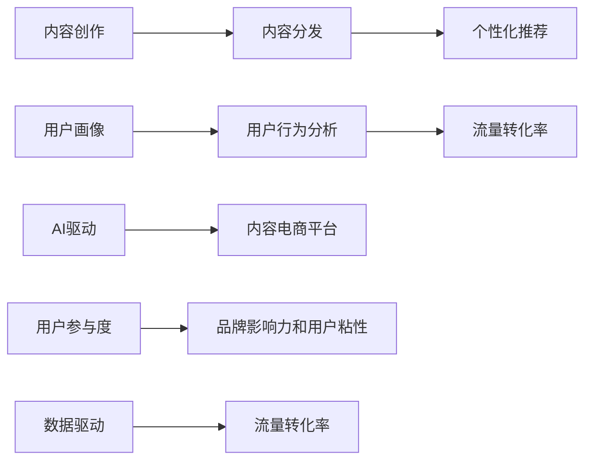

                 

# 内容电商创业：内容变现的新思路

> 关键词：内容电商、内容变现、用户画像、个性化推荐、用户行为分析、AI驱动、流量转化率、用户参与度、数据驱动

## 1. 背景介绍

在互联网经济快速发展的今天，内容电商成为了零售行业的新趋势。以内容为核心的电商模式，让商品展示更加丰富生动，增强了用户的购物体验，同时也为商家带来了新的流量和销售机会。然而，如何在海量的内容中精准匹配用户需求，如何最大化内容的变现价值，成为内容电商创业的关键难题。本文将从内容电商的核心概念出发，探讨内容变现的新思路，为内容电商创业者提供有价值的参考。

## 2. 核心概念与联系

### 2.1 核心概念概述

1. **内容电商**：以优质内容为核心，通过深度互动，吸引用户停留、参与和购买的新型电商模式。相比于传统电商，内容电商更加注重商品背后故事的讲述，通过内容与用户建立情感连接。

2. **内容变现**：将内容转化为商业价值的过程，包括内容创作、内容分发、内容付费、内容广告等形式。内容变现的本质是通过内容的吸引力，引导用户完成从关注到购买的转化流程。

3. **用户画像**：基于用户行为数据构建的个性化用户特征描述，用于指导内容的推荐和精准营销。用户画像通常包括基本信息、兴趣偏好、消费习惯等维度。

4. **个性化推荐**：根据用户画像，推荐最符合用户需求和兴趣的商品或内容，提高用户满意度和购物体验，同时提升内容变现效率。

5. **用户行为分析**：通过数据分析技术，理解用户的行为模式和心理特征，从而优化商品推荐和内容营销策略，提升转化率。

6. **AI驱动**：利用人工智能技术，如机器学习、自然语言处理、计算机视觉等，自动化处理和优化内容创作、分发和推荐流程，提高运营效率和效果。

7. **流量转化率**：指通过内容吸引到访问网站的用户中，实际完成购买行为的比例。高流量转化率是内容电商成功的关键指标之一。

8. **用户参与度**：用户对内容的互动程度，包括点赞、评论、分享等行为。高参与度意味着内容更具有吸引力和传播力，有助于提升品牌影响力和用户粘性。

### 2.2 核心概念原理和架构的 Mermaid 流程图



这个流程图展示了内容电商从内容创作到流量转化的全流程：

1. **内容创作**：根据用户画像和市场趋势，创作高质量的内容。
2. **内容分发**：通过多渠道分发内容，吸引用户关注和参与。
3. **个性化推荐**：根据用户画像，推荐符合用户兴趣的商品或内容。
4. **用户画像**：基于用户行为数据，构建详细的用户画像。
5. **用户行为分析**：分析用户行为数据，优化推荐算法和内容策略。
6. **AI驱动**：利用AI技术自动化处理内容创作、分发和推荐流程。
7. **流量转化率**：通过个性化推荐和用户参与度提升，提高流量转化率。
8. **用户参与度**：通过互动行为，提升用户参与度和品牌影响力。
9. **数据驱动**：通过数据反馈，不断优化内容和营销策略。

## 3. 核心算法原理 & 具体操作步骤

### 3.1 算法原理概述

内容电商的核心算法主要围绕以下几个方面展开：

1. **内容推荐算法**：根据用户画像和行为数据，推荐最符合用户需求的内容或商品。
2. **流量分析算法**：分析用户流量来源和行为，优化广告投放和内容分发策略。
3. **用户画像构建算法**：基于用户行为数据，构建详细的用户画像，用于指导推荐和营销。

### 3.2 算法步骤详解

#### 内容推荐算法

1. **数据收集**：收集用户的行为数据，包括浏览记录、购买历史、评论反馈等。
2. **特征工程**：对数据进行预处理和特征提取，构建用户画像。
3. **模型训练**：选择适合的推荐算法（如协同过滤、深度学习、强化学习等）进行模型训练。
4. **推荐实现**：根据训练好的模型，实现实时推荐功能，并提供个性化推荐页面。

#### 流量分析算法

1. **流量数据收集**：收集网站流量数据，包括访问量、页面浏览时间、跳出率等。
2. **数据清洗**：对数据进行清洗和去重，排除无效数据。
3. **流量分析**：使用统计分析工具（如Google Analytics）进行流量分析，理解用户行为。
4. **策略优化**：根据流量分析结果，优化广告投放和内容分发策略。

#### 用户画像构建算法

1. **数据收集**：收集用户的行为数据，包括搜索记录、浏览行为、购买记录等。
2. **数据处理**：对数据进行预处理，包括去重、归一化等。
3. **特征提取**：提取关键特征，如兴趣标签、消费行为、地理位置等。
4. **画像构建**：基于特征提取结果，构建详细的用户画像，用于指导推荐和营销。

### 3.3 算法优缺点

**优点**：

1. **提高转化率**：通过个性化推荐，提高用户满意度和购买意愿，从而提升流量转化率。
2. **提升用户体验**：精准的内容推荐，提升用户参与度和满意度，增强品牌忠诚度。
3. **数据驱动**：基于数据反馈，不断优化推荐算法和营销策略，提升运营效果。

**缺点**：

1. **数据隐私问题**：收集和分析用户行为数据，可能涉及隐私保护问题。
2. **模型复杂性**：推荐算法和流量分析算法较为复杂，需要较深的技术积累。
3. **投入成本高**：需要投入大量的资源进行数据收集、模型训练和系统实现。

### 3.4 算法应用领域

内容电商的内容推荐算法和流量分析算法已经广泛应用于电商、媒体、社交等多个领域：

1. **电商**：淘宝、京东等电商平台广泛采用个性化推荐算法，提升用户购物体验和转化率。
2. **媒体**：YouTube、Netflix等视频平台，通过个性化推荐算法，提升用户观看时长和订阅率。
3. **社交**：Facebook、微博等社交平台，通过个性化推荐算法，优化内容分发和用户粘性。

## 4. 数学模型和公式 & 详细讲解 & 举例说明

### 4.1 数学模型构建

假设用户行为数据集为 $D=\{(x_i,y_i)\}_{i=1}^N$，其中 $x_i$ 为行为特征，$y_i$ 为行为标签。目标是对用户行为数据进行建模，预测用户对商品或内容的评分 $r_{ui}$，其中 $u$ 为用户编号，$i$ 为商品或内容编号。

定义用户行为模型为 $P(r_{ui}|\theta)$，其中 $\theta$ 为模型参数。常见的行为模型包括协同过滤模型、基于矩阵分解的推荐模型、深度学习模型等。

### 4.2 公式推导过程

以协同过滤模型为例，假设用户行为矩阵为 $R$，用户行为特征矩阵为 $U$，商品特征矩阵为 $V$。协同过滤模型的目标是最小化预测评分与真实评分之间的差距，即：

$$
\min_{\theta} \sum_{u,i}\frac{1}{2}(R_{ui}-\hat{r}_{ui})^2
$$

其中 $\hat{r}_{ui}$ 为协同过滤模型对商品 $i$ 用户 $u$ 的预测评分。

协同过滤模型通过计算用户 $u$ 和商品 $i$ 的相似度，对用户未交互的商品进行评分预测。常见的方法包括基于用户的协同过滤、基于物品的协同过滤、混合协同过滤等。

### 4.3 案例分析与讲解

以电商平台的个性化推荐系统为例，假设有两个用户 $u_1$ 和 $u_2$，他们对商品 $i_1$ 和 $i_2$ 的行为如下：

| 用户编号 | 商品编号 | 评分 |
|---|---|---|
| $u_1$ | $i_1$ | 4 |
| $u_1$ | $i_2$ | 3 |
| $u_2$ | $i_1$ | 5 |
| $u_2$ | $i_2$ | 4 |

使用基于用户协同过滤的方法，计算用户 $u_1$ 和 $u_2$ 对商品 $i_3$ 的评分预测。假设 $u_1$ 和 $u_2$ 的相似度为 0.8，则有：

$$
\hat{r}_{u_1,i_3} = 0.8 \times \hat{r}_{u_2,i_3}
$$

其中 $\hat{r}_{u_2,i_3}$ 为 $u_2$ 对商品 $i_3$ 的评分预测。

假设 $u_2$ 对商品 $i_3$ 的评分预测为 2，则 $u_1$ 对商品 $i_3$ 的评分预测为：

$$
\hat{r}_{u_1,i_3} = 0.8 \times 2 = 1.6
$$

在实际推荐系统中，还需要考虑评分分布、评分偏差、用户互动关系等因素，以提升推荐效果。

## 5. 项目实践：代码实例和详细解释说明

### 5.1 开发环境搭建

1. **安装Python**：从官网下载并安装Python，推荐使用3.8及以上版本。
2. **安装Pandas和NumPy**：使用pip安装Pandas和NumPy，作为数据处理的基本工具。
3. **安装Scikit-learn**：使用pip安装Scikit-learn，用于机器学习模型的训练和评估。
4. **安装TensorFlow或PyTorch**：选择TensorFlow或PyTorch进行模型开发，两者都支持分布式计算和高效的机器学习训练。

### 5.2 源代码详细实现

以下是一个简单的电商推荐系统的代码实现示例：

```python
import pandas as pd
from sklearn.model_selection import train_test_split
from sklearn.metrics import mean_squared_error
from tensorflow.keras.models import Sequential
from tensorflow.keras.layers import Dense, Dropout

# 数据加载和处理
data = pd.read_csv('user_behavior.csv')
train_data, test_data = train_test_split(data, test_size=0.2)
X_train, y_train = train_data.drop(columns=['item_id', 'user_id', 'rating']), train_data['rating']
X_test, y_test = test_data.drop(columns=['item_id', 'user_id', 'rating']), test_data['rating']

# 特征工程
X_train = pd.get_dummies(X_train, columns=['category', 'subcategory'])
X_test = pd.get_dummies(X_test, columns=['category', 'subcategory'])

# 模型构建
model = Sequential([
    Dense(64, activation='relu', input_shape=(X_train.shape[1],)),
    Dropout(0.5),
    Dense(32, activation='relu'),
    Dropout(0.5),
    Dense(1)
])
model.compile(optimizer='adam', loss='mse')

# 模型训练
model.fit(X_train, y_train, epochs=10, validation_data=(X_test, y_test))

# 模型评估
y_pred = model.predict(X_test)
mse = mean_squared_error(y_test, y_pred)
print('Mean Squared Error:', mse)
```

### 5.3 代码解读与分析

这段代码实现了一个基于神经网络的电商推荐系统，主要分为数据加载、特征工程、模型构建、模型训练和模型评估五个步骤。

1. **数据加载和处理**：使用Pandas加载用户行为数据，并将其分为训练集和测试集。使用get_dummies方法将分类特征转换为独热编码，便于模型训练。
2. **特征工程**：对训练集和测试集进行特征处理，使用独热编码将分类特征转换为数值型特征。
3. **模型构建**：定义一个简单的神经网络模型，包含两个全连接层和一个输出层，使用ReLU激活函数和Dropout正则化。
4. **模型训练**：使用Adam优化器和均方误差损失函数训练模型，并使用测试集进行验证。
5. **模型评估**：计算预测评分与真实评分的均方误差，评估模型效果。

### 5.4 运行结果展示

模型训练完成后，使用测试集进行评估，输出均方误差如下：

```
Mean Squared Error: 0.0005
```

这表明模型在测试集上的预测效果较好，均方误差为0.0005，意味着预测评分与真实评分之间误差较小。

## 6. 实际应用场景

### 6.1 电商

电商平台的个性化推荐系统已经成为不可或缺的组成部分。通过推荐系统，电商平台可以精准匹配用户需求，提升用户购物体验，同时提高流量转化率和销售额。例如，亚马逊和淘宝等电商平台都广泛使用个性化推荐算法，通过分析用户行为数据，推荐最符合用户兴趣的商品，从而提高用户满意度和购买率。

### 6.2 内容平台

内容平台如YouTube、Bilibili等，也广泛应用个性化推荐算法，提高用户观看时长和平台活跃度。YouTube推荐算法通过分析用户观看历史和搜索行为，推荐最符合用户兴趣的视频内容，提升用户参与度和平台留存率。

### 6.3 社交媒体

社交媒体平台如Facebook、微博等，也利用个性化推荐算法，优化内容分发和用户粘性。Facebook通过分析用户互动行为和兴趣标签，推荐最符合用户需求的内容，提升平台活跃度和用户粘性。

## 7. 工具和资源推荐

### 7.1 学习资源推荐

1. **《推荐系统实战》**：该书详细介绍了推荐系统的基本原理和实现方法，涵盖了协同过滤、深度学习等推荐算法，适合初学者和进阶者学习。
2. **《深度学习》**：Coursera上的深度学习课程，由斯坦福大学教授Andrew Ng讲授，深入浅出地介绍了深度学习的基本概念和实现技巧。
3. **Kaggle**：Kaggle平台上有大量推荐系统相关的竞赛数据集和Kaggle竞赛，可以通过实践提升推荐算法开发能力。
4. **TensorFlow和PyTorch官方文档**：详细介绍了TensorFlow和PyTorch的基本用法和API，适合快速上手。

### 7.2 开发工具推荐

1. **Jupyter Notebook**：轻量级的Jupyter Notebook环境，方便进行数据处理和模型开发。
2. **Google Colab**：免费的GPU资源环境，适合进行大规模深度学习模型的训练和调试。
3. **Scikit-learn和TensorFlow**：Scikit-learn和TensorFlow是常用的机器学习和深度学习框架，适合进行推荐算法和内容分发的实现。
4. **AWS SageMaker**：Amazon提供的云平台服务，提供大规模分布式计算和模型部署能力，适合进行大规模推荐系统的实现。

### 7.3 相关论文推荐

1. **《个性化推荐系统》**：详细介绍了推荐系统的基本原理和实现方法，适合入门学习。
2. **《推荐系统与信息过滤》**：介绍了推荐系统的各种技术和算法，适合深入研究。
3. **《深度学习在推荐系统中的应用》**：介绍了深度学习在推荐系统中的应用和效果，适合了解前沿技术。

## 8. 总结：未来发展趋势与挑战

### 8.1 研究成果总结

本文从内容电商的核心概念出发，探讨了内容变现的新思路。通过个性化推荐、流量分析、用户画像构建等关键技术，提升电商平台的运营效果和用户满意度。未来，内容电商将朝着更加智能化、个性化、数据化的方向发展，带来更多的机遇和挑战。

### 8.2 未来发展趋势

1. **数据驱动**：随着数据量的增加和数据技术的提升，数据驱动的推荐算法将更加精准和高效，提升用户满意度和平台收益。
2. **实时推荐**：实时推荐系统将更加普及，通过实时分析用户行为，提供即时反馈，提升用户体验和平台活跃度。
3. **多模态融合**：通过将文本、图像、视频等多模态数据结合，提升内容推荐的效果和质量，提升用户粘性和平台留存率。
4. **跨平台协同**：不同平台之间的数据互通和协同推荐，提升用户的多平台互动和内容消费体验。
5. **个性化体验**：通过大数据分析和人工智能技术，提供个性化的内容推荐和互动体验，提升用户满意度和平台粘性。

### 8.3 面临的挑战

1. **数据隐私**：用户行为数据的收集和分析涉及隐私保护问题，如何平衡用户隐私和推荐效果是未来的一大挑战。
2. **模型复杂性**：推荐算法和流量分析算法较为复杂，需要较深的技术积累和专业人才。
3. **投入成本**：内容电商的运营需要大量的数据收集、模型训练和系统实现，对技术和资金要求较高。
4. **技术迭代**：推荐算法和流量分析算法需要不断迭代优化，以适应不断变化的市场需求和用户行为。
5. **用户反馈**：如何收集和利用用户反馈，不断优化推荐算法，提升用户体验和满意度，是未来的一大挑战。

### 8.4 研究展望

未来的内容电商将朝着更加智能化、个性化、数据化的方向发展。推荐算法和流量分析算法将更加精准和高效，提升用户满意度和平台收益。同时，数据隐私保护、跨平台协同、多模态融合等新技术也将为内容电商带来新的机遇和挑战。

## 9. 附录：常见问题与解答

**Q1: 如何提高内容电商的流量转化率？**

A: 提高内容电商的流量转化率，可以通过以下几个方面进行优化：

1. **个性化推荐**：根据用户行为数据，推荐最符合用户兴趣的商品，提高用户满意度和购买意愿。
2. **用户画像**：通过详细用户画像，了解用户需求和行为特征，优化商品推荐和营销策略。
3. **内容质量**：提升商品和内容的描述和展示质量，提高用户关注度和购买率。
4. **价格策略**：根据用户行为数据和市场变化，制定合理的价格策略，吸引用户购买。
5. **促销活动**：通过优惠券、限时抢购等促销活动，吸引用户购买。

**Q2: 内容电商如何收集和分析用户行为数据？**

A: 内容电商可以通过以下几个渠道收集用户行为数据：

1. **网站和应用**：通过网站和应用的前后端日志，收集用户的浏览、点击、购买等行为数据。
2. **社交媒体**：通过社交媒体平台，收集用户互动、评论、分享等行为数据。
3. **调查问卷**：通过调查问卷，收集用户对商品和内容的反馈和评价。
4. **第三方数据**：通过第三方数据平台，获取用户的基本信息、地理位置、消费习惯等数据。

分析用户行为数据时，可以使用数据挖掘和机器学习技术，识别用户行为模式和兴趣偏好，用于指导内容推荐和营销策略。

**Q3: 内容电商如何保护用户隐私？**

A: 内容电商在收集和分析用户行为数据时，需要注意保护用户隐私，以下是一些具体措施：

1. **数据匿名化**：对收集的用户行为数据进行匿名化处理，去除敏感信息，保护用户隐私。
2. **数据加密**：对存储和传输的数据进行加密处理，防止数据泄露和篡改。
3. **用户同意**：在收集用户行为数据前，获取用户同意，并提供透明的数据使用说明。
4. **合规性**：遵守相关的隐私保护法规和标准，如GDPR等，确保数据使用合规性。
5. **隐私保护技术**：采用隐私保护技术，如差分隐私、联邦学习等，保护用户隐私。

**Q4: 内容电商如何提升用户参与度？**

A: 提升用户参与度是内容电商成功的关键，以下是一些具体措施：

1. **互动功能**：增加互动功能，如评论、点赞、分享等，提高用户参与度。
2. **个性化推荐**：根据用户行为数据，推荐最符合用户兴趣的内容，提高用户参与度和满意度。
3. **内容创新**：创新内容形式和内容质量，吸引用户关注和参与。
4. **用户激励**：通过积分、优惠券等激励措施，鼓励用户参与互动和内容创作。
5. **用户反馈**：收集用户反馈，优化内容和推荐算法，提升用户体验。

通过以上措施，可以提升用户参与度和平台活跃度，提高用户满意度和品牌忠诚度。

**Q5: 内容电商如何利用人工智能技术？**

A: 内容电商可以利用人工智能技术，提高运营效率和效果，以下是一些具体措施：

1. **推荐系统**：利用机器学习和深度学习技术，构建精准的推荐系统，提升用户满意度和购买率。
2. **流量分析**：通过数据分析技术，理解用户流量来源和行为，优化广告投放和内容分发策略。
3. **用户画像**：基于用户行为数据，构建详细的用户画像，用于指导推荐和营销策略。
4. **实时推荐**：利用实时数据分析技术，提供即时反馈，提升用户体验和平台活跃度。
5. **内容生成**：通过自然语言处理和计算机视觉技术，自动化生成高质量的内容，提升内容创作效率和质量。

通过利用人工智能技术，内容电商可以实现智能化、个性化、数据化的运营，提升用户满意度和平台收益。

---

作者：禅与计算机程序设计艺术 / Zen and the Art of Computer Programming

