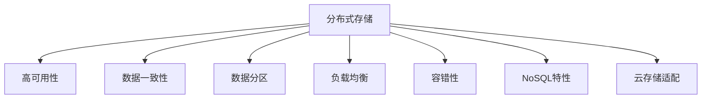

                 

# 分布式存储系统：设计与实现

> 关键词：分布式存储, 高可用性, 数据一致性, 数据分区, 负载均衡, 容错性, NoSQL, 云存储

## 1. 背景介绍

在当今数字化时代，数据是企业的核心资产，其规模和复杂性都在不断增长。传统的集中式存储系统，如关系数据库和文件系统，已无法满足海量数据存储和处理的需求。因此，分布式存储系统应运而生，成为现代数据存储架构的重要组成部分。分布式存储系统通过将数据分布存储在多台服务器上，并采用高度可扩展的设计，使得企业能够更高效地管理、访问和利用数据。

### 1.1 问题由来

随着数据量的爆炸性增长，集中式存储系统逐渐暴露出以下问题：

- **扩展性受限**：集中式存储系统难以垂直或水平扩展，一旦存储容量或处理能力达到瓶颈，整体性能就会急剧下降。
- **单点故障**：集中式存储系统存在单点故障问题，一旦某个节点发生故障，整个系统可能会瘫痪。
- **数据冗余**：为了保证数据的可靠性，集中式存储系统通常会创建多份数据副本，导致存储成本上升。
- **性能瓶颈**：集中式存储系统的I/O性能受限于单个节点的性能，难以支持高吞吐量的读写操作。

分布式存储系统通过将数据分散存储在多个节点上，解决了上述问题。它不仅能够支持大规模数据存储，还具有高可用性、高扩展性、高容错性等特点，成为当前主流的企业级数据存储解决方案。

### 1.2 问题核心关键点

分布式存储系统核心关键点包括以下几个方面：

- **高可用性**：系统能够在节点故障时自动切换到备份节点，确保数据服务的持续性。
- **数据一致性**：系统能够保证数据在不同节点上的复制和同步，避免数据冲突和丢失。
- **数据分区**：系统能够根据数据的特性进行分区存储，提高查询效率。
- **负载均衡**：系统能够动态调整负载，避免节点过载或闲置。
- **容错性**：系统能够在节点故障时自动恢复，保证数据服务的可靠性。
- **NoSQL特性**：系统能够支持非结构化数据的存储和管理，如文档、图像、视频等。
- **云存储适配**：系统能够无缝集成到云平台，实现弹性伸缩和按需计算。

通过理解这些关键点，我们能够更好地把握分布式存储系统的设计原则和实现细节。

## 2. 核心概念与联系

### 2.1 核心概念概述

为更好地理解分布式存储系统，本节将介绍几个密切相关的核心概念：

- **分布式存储**：将数据分散存储在多台服务器上，提高系统的扩展性和可用性。
- **高可用性**：系统能够自动切换节点，确保数据服务的连续性。
- **数据一致性**：系统能够保证数据在不同节点上的复制和同步，避免数据冲突和丢失。
- **数据分区**：根据数据的特性进行分区存储，提高查询效率。
- **负载均衡**：动态调整负载，避免节点过载或闲置。
- **容错性**：自动恢复节点故障，保证数据服务的可靠性。
- **NoSQL特性**：支持非结构化数据的存储和管理。
- **云存储适配**：无缝集成到云平台，实现弹性伸缩和按需计算。

这些核心概念之间的逻辑关系可以通过以下Mermaid流程图来展示：



这个流程图展示了大规模数据存储系统的核心概念及其之间的关系：

1. 分布式存储是系统设计的基础，通过数据分区、负载均衡等技术实现高可用性。
2. 高可用性、数据一致性和容错性是确保系统可靠性的关键。
3. NoSQL特性扩展了系统的应用范围，适用于各种数据类型。
4. 云存储适配使得系统能够按需扩展，适应云环境下的使用需求。

这些概念共同构成了分布式存储系统的核心框架，使得系统能够高效、可靠地存储和管理数据。

## 3. 核心算法原理 & 具体操作步骤
### 3.1 算法原理概述

分布式存储系统通常采用“主从”架构，其中主节点负责全局协调和管理，从节点负责具体的数据存储和读写操作。系统的核心算法原理包括数据分区、副本机制、负载均衡、故障恢复等。

1. **数据分区**：将数据按照一定的规则进行分区存储，每个分区由一个或多个节点负责存储。分区能够提高查询效率，避免数据热点集中在一个节点上。
2. **副本机制**：在多个节点上创建数据副本，确保数据的冗余性和可靠性。通过数据复制，系统能够在节点故障时自动恢复。
3. **负载均衡**：根据节点负载情况，动态调整数据路由，避免节点过载或闲置。负载均衡能够提高系统的吞吐量和稳定性。
4. **故障恢复**：在节点故障时，系统能够自动切换到备份节点，保证数据服务的连续性。

### 3.2 算法步骤详解

分布式存储系统通常包括以下几个关键步骤：

**Step 1: 数据分区**

数据分区是将数据按照一定的规则进行划分的过程。常见的分区策略包括：

- **哈希分区**：根据数据的哈希值对数据进行分区。
- **范围分区**：根据数据的关键字范围进行分区。
- **列表分区**：根据数据的关键字列表进行分区。

数据分区后，每个分区由一个或多个节点负责存储。

**Step 2: 创建副本**

在每个分区上，创建多个副本，确保数据的冗余性和可靠性。常见的副本机制包括：

- **N+1副本**：每个数据块创建N个副本，分布在N+1个节点上。
- **Gossip协议**：节点通过周期性通信，更新自身的副本状态，保持数据的一致性。

**Step 3: 数据一致性维护**

在数据分区和副本机制的基础上，分布式存储系统还需要保证数据的一致性。常见的数据一致性维护方法包括：

- **Paxos算法**：通过多轮投票，在多个节点之间达成一致的决策。
- **Raft算法**：基于共识算法，确保系统在节点故障时的稳定性和可靠性。

**Step 4: 负载均衡**

系统需要动态调整负载，避免节点过载或闲置。常见的负载均衡方法包括：

- **Round Robin**：按照顺序轮询节点的负载，实现简单的负载均衡。
- **Least Connections**：选择负载最小的节点进行请求路由，避免节点过载。

**Step 5: 故障恢复**

在节点故障时，系统能够自动切换到备份节点，保证数据服务的连续性。常见的故障恢复方法包括：

- **Master/Slave复制**：主节点负责全局协调和管理，从节点负责具体的数据存储和读写操作。当主节点故障时，从节点自动成为新的主节点。
- **节点心跳机制**：节点周期性发送心跳消息，检测其他节点的状态，实现故障检测和自动切换。

### 3.3 算法优缺点

分布式存储系统具有以下优点：

1. **高扩展性**：通过数据分区和负载均衡，系统能够水平扩展，支持海量数据存储。
2. **高可用性**：通过副本机制和故障恢复，系统能够自动切换节点，确保数据服务的连续性。
3. **高容错性**：通过多副本和心跳机制，系统能够在节点故障时自动恢复。
4. **高性能**：通过数据分区和负载均衡，系统能够高效处理大量读写请求。

但同时，分布式存储系统也存在一些局限性：

1. **数据一致性问题**：在大规模数据环境下，保证数据一致性是复杂且耗时的。
2. **数据分区复杂性**：分区策略需要根据数据的特性进行选择，设计不当可能导致查询效率低下。
3. **节点管理复杂性**：节点故障检测、故障切换等操作需要精细的管理和维护。
4. **系统复杂性**：分布式存储系统需要处理多节点的协调、通信、同步等问题，实现难度较高。

尽管存在这些局限性，但就目前而言，分布式存储系统仍然是最主流的数据存储解决方案。未来相关研究的重点在于如何进一步降低数据一致性问题，提高分区和负载均衡的效率，简化系统管理，降低实现难度。

### 3.4 算法应用领域

分布式存储系统已经在各个领域得到了广泛的应用，涵盖了大规模数据存储、高可用性服务、云计算基础设施等方向。

1. **大规模数据存储**：互联网公司如Google、Amazon、Facebook等，其海量数据存储系统均采用分布式存储架构。
2. **高可用性服务**：金融、电信、医疗等关键基础设施领域，需要高可用性服务保障数据安全。
3. **云计算基础设施**：云平台如AWS、阿里云、华为云等，提供弹性伸缩和按需计算的分布式存储服务。
4. **大数据分析**：大数据分析需要处理海量数据，分布式存储系统提供了高效的数据存储和访问方式。

除了这些经典应用外，分布式存储系统还被创新性地应用到更多场景中，如分布式文件系统、分布式数据库、分布式缓存等，为大数据时代的存储需求提供了全面的解决方案。

## 4. 数学模型和公式 & 详细讲解 & 举例说明

### 4.1 数学模型构建

分布式存储系统涉及多种数据结构和算法，构建数学模型需要进行详细的抽象和建模。

- **数据分区模型**：假设数据集为 $D=\{d_1, d_2, ..., d_N\}$，分区策略为 $P$，则数据分区后的集合为 $P(D)$。
- **副本机制模型**：假设每个数据块 $d_i$ 创建 $K$ 个副本，分布在 $N$ 个节点上，则每个节点上的数据块集合为 $R(d_i)$。
- **负载均衡模型**：假设每个节点的负载为 $L_i$，负载均衡策略为 $L$，则动态调整后的负载为 $L_i'$。
- **故障恢复模型**：假设节点 $n$ 故障，系统自动切换到备份节点 $n'$，则恢复后的数据一致性为 $C(n,n')$。

### 4.2 公式推导过程

以下我们以数据分区和副本机制为例，推导基本的数学模型和公式。

假设数据集为 $D=\{d_1, d_2, ..., d_N\}$，分区策略为哈希分区，则数据分区后的集合为：

$$
P(D) = \{P_1, P_2, ..., P_M\}
$$

其中 $M$ 为分区数量。对于每个数据块 $d_i$，假设其哈希值为 $H_i$，则分区分配为：

$$
d_i \in P(H_i \mod M)
$$

在每个分区 $P_j$ 上，创建 $K$ 个副本，则每个分区上的数据块集合为：

$$
R(P_j) = \{R_{j,1}, R_{j,2}, ..., R_{j,K}\}
$$

其中 $R_{j,k}$ 表示分区 $P_j$ 上第 $k$ 个副本的数据块集合。假设每个数据块大小为 $S$，则分区和副本机制的总数据存储量为：

$$
\sum_{j=1}^M \sum_{k=1}^K |R_{j,k}|
$$

## 5. 项目实践：代码实例和详细解释说明
### 5.1 开发环境搭建

在进行分布式存储系统开发前，我们需要准备好开发环境。以下是使用Python进行Django开发的环境配置流程：

1. 安装Anaconda：从官网下载并安装Anaconda，用于创建独立的Python环境。

2. 创建并激活虚拟环境：
```bash
conda create -n django-env python=3.8 
conda activate django-env
```

3. 安装Django：从官网获取Django的最新版本，并按照官方文档进行安装。
```bash
pip install django==3.2
```

4. 安装必要的第三方库：
```bash
pip install django-rest-framework django-datatables django-compressor
```

5. 安装前端框架：
```bash
pip install django-summernote django-crispy-forms
```

完成上述步骤后，即可在`django-env`环境中开始开发实践。

### 5.2 源代码详细实现

这里我们以分布式文件系统为例，给出使用Django进行开发的完整代码实现。

首先，定义模型的数据表结构：

```python
from django.db import models

class File(models.Model):
    name = models.CharField(max_length=255)
    size = models.IntegerField()
    create_time = models.DateTimeField(auto_now_add=True)
    access_time = models.DateTimeField(auto_now=True)
    data = models.FileField(upload_to='files/')

    def __str__(self):
        return self.name
```

然后，定义视图函数：

```python
from django.shortcuts import render
from django.http import JsonResponse
from django.views.decorators.csrf import csrf_exempt

@csrf_exempt
def file_list(request):
    if request.method == 'GET':
        files = File.objects.all().order_by('-access_time')
        return JsonResponse({'success': True, 'data': [file.as_json() for file in files]})
```

接着，定义模板和静态文件：

```html
<!-- file.html -->
<table id="file-table" class="table table-bordered">
    <thead>
        <tr>
            <th>Name</th>
            <th>Size</th>
            <th>Create Time</th>
            <th>Access Time</th>
            <th>Download</th>
        </tr>
    </thead>
    <tbody>
        
            <tr>
                <td>{{ file.name }}</td>
                <td>{{ file.size }}</td>
                <td>{{ file.create_time }}</td>
                <td>{{ file.access_time }}</td>
                <td><a href="{{ file.url }}" target="_blank">Download</a></td>
            </tr>
        
    </tbody>
</table>
```

最后，启动Django服务：

```bash
python manage.py runserver 127.0.0.1:8000
```

以上是一个简单的分布式文件系统示例，展示了如何使用Django进行数据存储和访问。

### 5.3 代码解读与分析

让我们再详细解读一下关键代码的实现细节：

**File模型**：
- 定义了文件的名称、大小、创建时间和访问时间等属性。
- 使用FileField存储文件的实际数据，自动生成文件路径。

**file_list视图函数**：
- 使用GET请求获取所有文件，按照访问时间倒序排序。
- 将文件信息转换为JSON格式，通过JsonResponse返回。

**file.html模板**：
- 使用Bootstrap的table组件展示文件列表，支持表格排序、下载等操作。

**启动Django服务**：
- 使用Django的开发服务器，监听本地地址和端口，启动Web服务。

可以看到，Django提供了简洁的API和强大的模板系统，能够快速构建分布式文件系统等数据存储应用。

当然，工业级的系统实现还需考虑更多因素，如数据冗余、分布式协调、故障恢复等。但核心的分布式存储范式基本与此类似。

## 6. 实际应用场景

### 6.1 智慧城市数据中心

智慧城市数据中心是城市管理的关键基础设施，承载着大量的城市数据，如交通、环境、安全、公共服务等信息。通过分布式存储系统，智慧城市数据中心能够高效存储和处理海量数据，实现数据的集中管理和共享。

在技术实现上，可以采用分布式文件系统或分布式数据库，构建城市数据中心的基础设施。系统需要支持高可用性、高扩展性、高容错性等特性，以确保数据服务的连续性和可靠性。同时，系统需要具备数据一致性和数据分区功能，能够灵活地支持不同类型的数据存储需求。

### 6.2 企业数据仓库

企业数据仓库是企业数据管理和分析的核心平台，存储着企业内部和外部的大量数据，如客户信息、销售记录、财务报表等。通过分布式存储系统，企业数据仓库能够高效存储和处理海量数据，支持大规模数据分析和实时查询。

在技术实现上，可以采用分布式数据库或分布式文件系统，构建企业数据仓库的基础设施。系统需要支持高可用性、高扩展性、高容错性等特性，以确保数据服务的连续性和可靠性。同时，系统需要具备数据一致性和数据分区功能，能够灵活地支持不同类型的数据存储需求。

### 6.3 互联网公司数据中心

互联网公司数据中心是公司核心数据和应用的承载平台，存储着用户数据、日志、图片、视频等。通过分布式存储系统，互联网公司数据中心能够高效存储和处理海量数据，支持大规模数据存储和实时查询。

在技术实现上，可以采用分布式文件系统或分布式数据库，构建互联网公司数据中心的基础设施。系统需要支持高可用性、高扩展性、高容错性等特性，以确保数据服务的连续性和可靠性。同时，系统需要具备数据一致性和数据分区功能，能够灵活地支持不同类型的数据存储需求。

### 6.4 未来应用展望

随着分布式存储系统的不断发展和完善，其在各个领域的应用将更加广泛和深入。

- **边缘计算**：在边缘设备上部署分布式存储系统，实现数据就近存储和处理，降低网络延迟和带宽成本。
- **区块链技术**：结合区块链技术，实现数据的去中心化和加密存储，增强数据安全性和可靠性。
- **人工智能**：结合人工智能技术，实现数据的智能分析和预测，支持更精准的数据决策。
- **云计算**：与云平台无缝集成，实现弹性伸缩和按需计算，支持企业的数据云化迁移。

这些技术的发展将进一步推动分布式存储系统的应用，带来更多的创新和突破。

## 7. 工具和资源推荐

### 7.1 学习资源推荐

为了帮助开发者系统掌握分布式存储系统的原理和实践，这里推荐一些优质的学习资源：

1. 《分布式系统原理与设计》系列博文：深入浅出地介绍了分布式系统原理、分布式存储架构等前沿话题。

2. 《网络基础》课程：由Coursera提供的网络基础课程，涵盖计算机网络和分布式系统等内容，是学习分布式存储系统的必备基础。

3. 《分布式系统：概念与设计》书籍：经典教材，系统介绍了分布式系统及其设计原则，包括分布式存储系统的核心技术。

4. 《NoSQL数据库技术与应用》课程：由学堂在线提供，涵盖了多种NoSQL数据库技术，包括分布式存储系统的应用。

5. 《分布式存储系统》书籍：详细介绍了多种分布式存储系统的设计、实现和应用，是学习分布式存储系统的经典参考书。

通过对这些资源的学习实践，相信你一定能够快速掌握分布式存储系统的精髓，并用于解决实际的数据存储问题。

### 7.2 开发工具推荐

高效的开发离不开优秀的工具支持。以下是几款用于分布式存储系统开发的常用工具：

1. Django：基于Python的开源Web框架，提供了强大的ORM、模板系统和中间件，适合快速构建Web应用。

2. Flask：轻量级的Web框架，提供了简洁的API和灵活的扩展机制，适合快速构建RESTful API。

3. Apache Hadoop：分布式计算平台，支持大规模数据处理和分布式存储，是构建分布式文件系统的常用工具。

4. Apache Cassandra：分布式数据库系统，支持高可用性、高扩展性和高容错性，适合构建大规模数据仓库。

5. Apache Hive：基于Hadoop的数据仓库系统，提供了SQL查询接口和数据管理功能，适合构建数据湖。

6. Apache Kafka：分布式消息队列，支持高吞吐量和低延迟的数据传输，适合构建实时数据管道。

合理利用这些工具，可以显著提升分布式存储系统的开发效率，加快创新迭代的步伐。

### 7.3 相关论文推荐

分布式存储系统的研究源于学界的持续研究。以下是几篇奠基性的相关论文，推荐阅读：

1. "Paxos Made Simple"（Paxos算法）：由Leslie Lamport撰写，详细介绍了Paxos算法的设计和实现。

2. "Consensus in Fault-Tolerant Systems"（Raft算法）：由David Raft撰写，详细介绍了Raft算法的设计和实现。

3. "Data-Intensive Text Processing: A Survey"（文本处理中的数据密集型系统）：由Leonard Kleinrock等撰写，详细介绍了分布式存储系统在文本处理中的应用。

4. "A Survey of Distributed Storage Systems"（分布式存储系统的综述）：由Jian Li等撰写，详细介绍了多种分布式存储系统的设计、实现和应用。

5. "A Survey of Large-Scale Data Management Techniques for Scientific Research"（大规模数据管理技术综述）：由Kristen Kozyrkov等撰写，详细介绍了大规模数据管理的分布式存储技术。

这些论文代表了大规模数据存储系统的研究进展，通过学习这些前沿成果，可以帮助研究者把握分布式存储系统的未来发展方向。

## 8. 总结：未来发展趋势与挑战

### 8.1 总结

本文对分布式存储系统的设计与实现进行了全面系统的介绍。首先阐述了分布式存储系统的问题由来和核心关键点，明确了系统设计的基础和目标。其次，从原理到实践，详细讲解了数据分区、副本机制、负载均衡、故障恢复等核心算法原理和具体操作步骤，给出了分布式文件系统的完整代码实现。同时，本文还广泛探讨了分布式存储系统在智慧城市、企业数据仓库、互联网公司数据中心等多个行业领域的应用前景，展示了系统设计的广泛适用性。

通过本文的系统梳理，可以看到，分布式存储系统已经成为现代数据存储架构的重要组成部分，具备高可用性、高扩展性、高容错性等特点，成为企业数据管理和存储的必要选择。未来，伴随技术的不断演进和应用场景的不断拓展，分布式存储系统必将在更多领域发挥重要的作用。

### 8.2 未来发展趋势

展望未来，分布式存储系统将呈现以下几个发展趋势：

1. **大数据处理**：分布式存储系统将支持更大规模的数据处理，提供更高效的数据存储和查询能力。

2. **多云融合**：分布式存储系统将无缝集成到云平台，实现数据的高可用性和弹性伸缩。

3. **边缘计算**：在边缘设备上部署分布式存储系统，实现数据就近存储和处理，降低网络延迟和带宽成本。

4. **人工智能结合**：结合人工智能技术，实现数据的智能分析和预测，支持更精准的数据决策。

5. **区块链技术**：结合区块链技术，实现数据的去中心化和加密存储，增强数据安全性和可靠性。

6. **智能运维**：通过智能运维工具，实现系统的自动化管理和故障快速恢复，提高系统的稳定性和可管理性。

以上趋势凸显了分布式存储系统的广阔前景。这些方向的探索发展，必将进一步提升系统性能和应用范围，为数据管理和存储带来新的突破。

### 8.3 面临的挑战

尽管分布式存储系统已经取得了显著的进展，但在迈向更加智能化、普适化应用的过程中，它仍面临诸多挑战：

1. **数据一致性问题**：在大规模数据环境下，保证数据一致性是复杂且耗时的。
2. **系统复杂性**：分布式存储系统需要处理多节点的协调、通信、同步等问题，实现难度较高。
3. **节点管理复杂性**：节点故障检测、故障切换等操作需要精细的管理和维护。
4. **数据分区复杂性**：分区策略需要根据数据的特性进行选择，设计不当可能导致查询效率低下。
5. **性能瓶颈**：在处理大规模数据和高并发请求时，系统可能会面临性能瓶颈。

尽管存在这些挑战，但通过不断的技术创新和优化，这些问题终将得到解决。相信随着学界和产业界的共同努力，分布式存储系统必将在构建可靠、高效、可扩展的数据存储系统方面取得更大的突破。

### 8.4 研究展望

面对分布式存储系统所面临的挑战，未来的研究需要在以下几个方面寻求新的突破：

1. **优化数据一致性算法**：引入最新的共识算法和分布式算法，提高数据一致性的效率和可靠性。

2. **简化系统设计**：引入更加简洁、高效的系统设计思想，减少节点管理复杂性和系统实现难度。

3. **引入最新技术**：结合最新的AI、区块链、边缘计算等技术，扩展分布式存储系统的应用场景和功能。

4. **强化智能运维**：引入智能运维工具和自动化管理技术，提高系统的稳定性和可管理性。

5. **支持多种数据类型**：支持多种数据类型和格式，提供灵活的数据存储和管理方式。

6. **优化数据分区策略**：引入更加科学、高效的数据分区策略，提高系统的查询效率和扩展性。

这些研究方向的探索，必将引领分布式存储系统迈向更高的台阶，为构建高效、可靠、可扩展的数据存储系统铺平道路。面向未来，分布式存储系统还需要与其他人工智能技术进行更深入的融合，多路径协同发力，共同推动分布式存储技术的进步。只有勇于创新、敢于突破，才能不断拓展数据存储的边界，让数据更智能地服务于人类社会。

## 9. 附录：常见问题与解答

**Q1：分布式存储系统有哪些核心技术？**

A: 分布式存储系统的核心技术包括数据分区、副本机制、负载均衡、故障恢复、一致性维护等。其中：

- **数据分区**：将数据按照一定的规则进行划分存储，提高查询效率。
- **副本机制**：在多个节点上创建数据副本，确保数据的冗余性和可靠性。
- **负载均衡**：动态调整负载，避免节点过载或闲置。
- **故障恢复**：在节点故障时，自动切换到备份节点，保证数据服务的连续性。
- **一致性维护**：保证数据在不同节点上的复制和同步，避免数据冲突和丢失。

通过理解这些核心技术，我们能够更好地把握分布式存储系统的设计原则和实现细节。

**Q2：分布式存储系统如何保证数据一致性？**

A: 分布式存储系统通过多种算法和技术保证数据一致性：

- **Paxos算法**：通过多轮投票，在多个节点之间达成一致的决策。
- **Raft算法**：基于共识算法，确保系统在节点故障时的稳定性和可靠性。
- **Gossip协议**：节点通过周期性通信，更新自身的副本状态，保持数据的一致性。
- **主从复制**：主节点负责全局协调和管理，从节点负责具体的数据存储和读写操作。当主节点故障时，从节点自动成为新的主节点。

这些算法和技术结合使用，能够保证数据在不同节点上的同步和一致性。

**Q3：分布式存储系统如何实现高可用性？**

A: 分布式存储系统通过以下方法实现高可用性：

- **主从复制**：主节点负责全局协调和管理，从节点负责具体的数据存储和读写操作。当主节点故障时，从节点自动成为新的主节点。
- **心跳机制**：节点周期性发送心跳消息，检测其他节点的状态，实现故障检测和自动切换。
- **冗余机制**：创建多份数据副本，分布在多个节点上，确保数据服务的连续性。
- **负载均衡**：动态调整负载，避免节点过载或闲置，提高系统的吞吐量和稳定性。

这些机制结合使用，能够实现系统的高可用性，确保数据服务的连续性和可靠性。

**Q4：分布式存储系统在实现时需要注意哪些问题？**

A: 分布式存储系统的实现需要注意以下几个问题：

- **数据一致性问题**：在大规模数据环境下，保证数据一致性是复杂且耗时的。需要引入多种一致性算法和技术，提高数据一致性的效率和可靠性。
- **系统复杂性**：分布式存储系统需要处理多节点的协调、通信、同步等问题，实现难度较高。需要设计简洁、高效的系统架构。
- **节点管理复杂性**：节点故障检测、故障切换等操作需要精细的管理和维护。需要引入智能运维工具和自动化管理技术。
- **数据分区复杂性**：分区策略需要根据数据的特性进行选择，设计不当可能导致查询效率低下。需要引入科学、高效的数据分区策略。
- **性能瓶颈**：在处理大规模数据和高并发请求时，系统可能会面临性能瓶颈。需要引入高效的算法和优化技术，提高系统的性能。

这些问题是分布式存储系统实现过程中必须考虑的，需要在设计、开发和运维过程中不断优化和改进。

**Q5：分布式存储系统在云计算环境下有哪些优势？**

A: 分布式存储系统在云计算环境下具有以下优势：

- **弹性伸缩**：云平台能够根据实际需求动态调整资源，实现弹性伸缩。分布式存储系统能够无缝集成到云平台，实现按需计算和扩展。
- **高可用性**：云平台能够提供高可用性的基础设施，如自动故障检测和恢复、多区域部署等，提高分布式存储系统的可用性。
- **高扩展性**：云平台能够提供大规模的计算资源和存储资源，支持分布式存储系统的高扩展性。
- **低成本**：云平台能够按需计费，降低分布式存储系统的建设和运维成本。
- **易用性**：云平台提供了丰富的管理界面和API接口，方便用户进行系统管理、监控和部署。

这些优势使得分布式存储系统在云计算环境下得到了广泛的应用和推广。

---

作者：禅与计算机程序设计艺术 / Zen and the Art of Computer Programming

