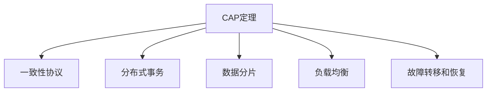

                 

# 分布式系统设计：理论与实践

> 关键词：分布式系统, 一致性, 可靠性, 容错性, 性能优化, 大数据, 微服务架构

## 1. 背景介绍

### 1.1 问题由来
随着互联网和云计算技术的迅猛发展，分布式系统已成为现代软件架构的基础。无论是Web应用、移动应用，还是物联网设备，都离不开分布式系统的支持。然而，分布式系统的设计复杂度高、组件多、故障率高，需要综合考虑一致性、可靠性、容错性等多个方面，确保系统稳定运行和高效扩展。

分布式系统设计的难点主要在于：

1. **一致性**：分布式系统中的多个节点需要保证数据一致性，避免出现脑裂等问题。
2. **可靠性**：系统需要具备高可用性，能够容忍单个节点或网络的故障，保证数据不丢失。
3. **容错性**：系统需要具备自动恢复能力，能够快速从故障中恢复，减少用户感知的服务中断。
4. **性能优化**：系统需要具备高并发处理能力，能够高效地处理大量请求。
5. **大数据处理**：系统需要具备处理海量数据的能力，支持数据的存储、查询和分析。

### 1.2 问题核心关键点
分布式系统设计涉及众多概念和理论，包括CAP定理、一致性协议、分布式事务、数据分片等。其中，CAP定理和一致性协议是分布式系统设计的核心，本文将重点介绍这两个概念。

1. **CAP定理**：在分布式系统中，一致性（Consistency）、可用性（Availability）和分区容忍性（Partition Tolerance）这三个特性只能同时满足两个。CAP定理提供了分布式系统设计的理论基础，帮助开发者在设计和实现分布式系统时做出权衡。

2. **一致性协议**：一致性协议（如Paxos、Raft、Zookeeper等）是实现分布式系统一致性的关键，通过算法确保数据在多个节点间一致地存储和更新。

## 2. 核心概念与联系

### 2.1 核心概念概述

为了更好地理解分布式系统设计，本节将介绍几个密切相关的核心概念：

- **CAP定理**：分布式系统中，一致性（Consistency）、可用性（Availability）和分区容忍性（Partition Tolerance）只能同时满足两个。
- **一致性协议**：如Paxos、Raft、Zookeeper等，用于在分布式系统中实现一致性，确保数据在多个节点间一致地存储和更新。
- **分布式事务**：在分布式系统中，多个节点的操作需要原子性处理，即要么全部执行成功，要么全部失败。
- **数据分片**：为了提高分布式系统的扩展性和并发性能，将数据分成多个分片，分布在不同的节点上进行存储和处理。
- **负载均衡**：通过合理分配请求到多个节点，避免单节点负载过重，提高系统的吞吐量和响应速度。
- **故障转移和恢复**：在分布式系统中，需要实现故障转移和恢复机制，确保系统在节点或网络故障时能够快速恢复。

这些核心概念之间的逻辑关系可以通过以下Mermaid流程图来展示：



这个流程图展示了大规模分布式系统设计的主要概念及其之间的关系：

1. CAP定理是分布式系统设计的理论基础。
2. 一致性协议是实现一致性的核心技术。
3. 分布式事务和多节点操作必须满足一致性。
4. 数据分片有助于提升系统的扩展性和并发性能。
5. 负载均衡优化系统资源利用率，提升系统响应速度。
6. 故障转移和恢复机制保障系统的高可用性。

## 3. 核心算法原理 & 具体操作步骤

### 3.1 算法原理概述

分布式系统设计涉及到众多的算法和协议，本节将重点介绍CAP定理、一致性协议和分布式事务的核心原理。

#### 3.1.1 CAP定理

CAP定理指出，在分布式系统中，一致性（Consistency）、可用性（Availability）和分区容忍性（Partition Tolerance）只能同时满足两个。这三种特性分别代表了以下概念：

- **一致性**：在分布式系统中，多个节点中的数据必须保持一致，即同一时刻对同一数据的读取结果必须相同。
- **可用性**：在分布式系统中，每个节点必须能够及时响应用户请求，保证系统的低延迟和高可用性。
- **分区容忍性**：在分布式系统中，系统能够容忍节点间的网络分区，即当网络发生分区时，节点能够正常工作，不出现系统宕机。

CAP定理的三种特性相互制约，无法同时满足。例如，当系统需要保证强一致性时，节点之间需要通过复杂的同步机制保持数据一致，此时系统的可用性会受到影响；当系统需要高可用性时，节点之间的数据一致性无法得到保障。

#### 3.1.2 一致性协议

一致性协议是实现分布式系统中数据一致性的关键算法。常见的是一致性协议有Paxos、Raft和Zookeeper等。

- **Paxos**：是一种基于消息传递的一致性协议，通过多轮消息传递和投票机制，保证在多个节点间一致地存储和更新数据。
- **Raft**：也是一种一致性协议，通过日志复制和心跳机制，确保数据在多个节点间一致地存储和更新。
- **Zookeeper**：是一个基于Raft协议的分布式协调服务，用于实现分布式系统中的一致性管理。

一致性协议的核心思想是通过多轮消息传递和投票机制，确保在多个节点间一致地存储和更新数据。这些协议在实现过程中，需要考虑节点之间的通信延迟、网络分区、节点故障等因素，确保协议的稳定性和正确性。

#### 3.1.3 分布式事务

在分布式系统中，多个节点的操作需要原子性处理，即要么全部执行成功，要么全部失败。分布式事务的核心思想是保证系统操作的原子性，避免数据不一致的问题。

常见的分布式事务协议有XA事务、TCC事务和SAGA事务等。

- **XA事务**：是一种标准的分布式事务协议，通过两阶段提交（Two-Phase Commit，2PC）机制，确保系统操作的原子性。
- **TCC事务**：是一种补偿型事务，通过预处理、补偿处理和撤销处理三个阶段，确保系统操作的原子性。
- **SAGA事务**：是一种基于补偿型事务的事务处理方式，通过事件驱动的方式，确保系统操作的原子性。

分布式事务的核心在于保证系统操作的原子性，避免数据不一致的问题。不同的分布式事务协议在实现过程中，需要考虑节点之间的通信延迟、网络分区、节点故障等因素，确保协议的稳定性和正确性。

### 3.2 算法步骤详解

本节将详细介绍CAP定理、一致性协议和分布式事务的核心算法步骤。

#### 3.2.1 CAP定理

CAP定理的核心思想是，在分布式系统中，一致性（Consistency）、可用性（Availability）和分区容忍性（Partition Tolerance）只能同时满足两个。下面是CAP定理的算法步骤：

1. 确定系统需求：根据系统的业务需求，确定一致性、可用性和分区容忍性的优先级。
2. 设计系统架构：根据需求，设计系统的架构，选择一致性协议和分布式事务协议。
3. 实现系统功能：根据架构设计，实现系统功能，包括数据分片、负载均衡、故障转移和恢复等。
4. 测试系统性能：通过负载测试和故障模拟，测试系统的性能和可靠性。
5. 优化系统设计：根据测试结果，优化系统的设计，提高系统的性能和可靠性。

#### 3.2.2 一致性协议

一致性协议的核心思想是通过多轮消息传递和投票机制，确保在多个节点间一致地存储和更新数据。下面是Paxos协议的算法步骤：

1. 准备提案：节点A准备提案，生成一个提议（Proposal）。
2. 广播提案：节点A广播提案给其他节点。
3. 接收提案：其他节点接收提案，并记录下来。
4. 发出响应：节点A等待其他节点的响应，如果响应一致，则继续下一步；否则，重试提案。
5. 发起投票：节点A发起投票，让其他节点进行投票。
6. 接收投票：其他节点接收投票，并返回投票结果。
7. 确定提案：节点A根据投票结果，确定提案是否通过。
8. 更新数据：如果提案通过，节点A更新数据，并广播更新结果给其他节点。

#### 3.2.3 分布式事务

分布式事务的核心思想是保证系统操作的原子性，避免数据不一致的问题。下面是TCC事务的算法步骤：

1. 预处理阶段：根据事务需求，准备预处理操作，包括资源锁定、数据修改等。
2. 补偿处理阶段：如果预处理失败，执行补偿处理操作，撤销已修改的数据。
3. 撤销处理阶段：如果事务失败，执行撤销处理操作，释放已锁定的资源。

### 3.3 算法优缺点

CAP定理、一致性协议和分布式事务在分布式系统中具有重要的应用价值，但也存在一定的缺点和局限性。

#### 3.3.1 CAP定理

CAP定理的优点是提供了一个理论基础，帮助开发者在设计和实现分布式系统时做出权衡。缺点是需要根据系统的业务需求做出取舍，有时无法同时满足一致性和可用性。

#### 3.3.2 一致性协议

一致性协议的优点是可以保证数据的一致性，确保在多个节点间一致地存储和更新数据。缺点是实现复杂，需要考虑节点之间的通信延迟、网络分区、节点故障等因素，增加了系统的复杂度。

#### 3.3.3 分布式事务

分布式事务的优点是可以保证系统操作的原子性，避免数据不一致的问题。缺点是实现复杂，需要考虑节点之间的通信延迟、网络分区、节点故障等因素，增加了系统的复杂度。

### 3.4 算法应用领域

CAP定理、一致性协议和分布式事务在分布式系统中具有广泛的应用，包括：

- **Web应用**：如Amazon的AWS、Alibaba的阿里云等，提供分布式计算和存储服务。
- **移动应用**：如微信、QQ等，提供分布式即时通讯和社交服务。
- **物联网设备**：如智能家居设备、工业物联网设备等，提供分布式数据采集和处理服务。
- **大数据处理**：如Hadoop、Spark等，提供分布式数据存储和计算服务。

## 4. 数学模型和公式 & 详细讲解

### 4.1 数学模型构建

本节将使用数学语言对CAP定理、一致性协议和分布式事务的原理进行更加严格的刻画。

假设分布式系统中有n个节点，每个节点存储一份数据副本。节点之间通过网络进行通信。

定义一致性协议为Paxos，则Paxos协议的数学模型为：

1. 节点A准备提案：生成一个提案，表示为一个元组（P, C, V），其中P为提案内容，C为提案来源，V为提案版本号。
2. 节点A广播提案：将提案广播给其他节点B、C、D。
3. 节点B、C、D接收提案：记录下提案内容，并返回确认信息。
4. 节点A等待确认：等待其他节点返回确认信息，如果确认信息一致，则继续下一步；否则，重试提案。
5. 节点A发起投票：让其他节点进行投票。
6. 节点B、C、D接收投票：记录下投票结果，并返回投票信息。
7. 节点A确定提案：根据投票结果，确定提案是否通过。
8. 节点A更新数据：如果提案通过，更新数据，并广播更新结果给其他节点。

定义分布式事务为TCC事务，则TCC事务的数学模型为：

1. 预处理阶段：准备预处理操作，包括资源锁定、数据修改等。
2. 补偿处理阶段：如果预处理失败，执行补偿处理操作，撤销已修改的数据。
3. 撤销处理阶段：如果事务失败，执行撤销处理操作，释放已锁定的资源。

### 4.2 公式推导过程

以下我们以Paxos协议为例，推导其核心算法步骤的数学模型。

假设节点A准备提案，生成一个提案（P, C, V），表示为一个元组，其中P为提案内容，C为提案来源，V为提案版本号。

节点A广播提案给其他节点B、C、D。节点B、C、D接收提案，并记录下提案内容，并返回确认信息。节点A等待其他节点返回确认信息，如果确认信息一致，则继续下一步；否则，重试提案。

节点A发起投票，让其他节点进行投票。节点B、C、D接收投票，并记录下投票结果，并返回投票信息。节点A根据投票结果，确定提案是否通过。如果提案通过，节点A更新数据，并广播更新结果给其他节点。

以下是TCC事务的数学模型推导：

1. 预处理阶段：根据事务需求，准备预处理操作，包括资源锁定、数据修改等。
2. 补偿处理阶段：如果预处理失败，执行补偿处理操作，撤销已修改的数据。
3. 撤销处理阶段：如果事务失败，执行撤销处理操作，释放已锁定的资源。

### 4.3 案例分析与讲解

#### 4.3.1 Paxos协议案例分析

假设有一个分布式系统，由节点A、B、C、D组成。节点A准备提案，生成一个提案（P, C, V），表示为一个元组，其中P为提案内容，C为提案来源，V为提案版本号。

节点A广播提案给其他节点B、C、D。节点B、C、D接收提案，并记录下提案内容，并返回确认信息。节点A等待其他节点返回确认信息，如果确认信息一致，则继续下一步；否则，重试提案。

节点A发起投票，让其他节点进行投票。节点B、C、D接收投票，并记录下投票结果，并返回投票信息。节点A根据投票结果，确定提案是否通过。如果提案通过，节点A更新数据，并广播更新结果给其他节点。

#### 4.3.2 TCC事务案例分析

假设有一个分布式系统，由节点A、B、C、D组成。节点A准备预处理操作，包括资源锁定、数据修改等。节点A执行预处理操作，如果预处理失败，执行补偿处理操作，撤销已修改的数据。

节点A执行撤销处理操作，释放已锁定的资源。

## 5. 项目实践：代码实例和详细解释说明

### 5.1 开发环境搭建

在进行分布式系统设计和实践前，我们需要准备好开发环境。以下是使用Python进行PyTorch开发的环境配置流程：

1. 安装Anaconda：从官网下载并安装Anaconda，用于创建独立的Python环境。

2. 创建并激活虚拟环境：
```bash
conda create -n pytorch-env python=3.8 
conda activate pytorch-env
```

3. 安装PyTorch：根据CUDA版本，从官网获取对应的安装命令。例如：
```bash
conda install pytorch torchvision torchaudio cudatoolkit=11.1 -c pytorch -c conda-forge
```

4. 安装TensorFlow：从官网下载并安装TensorFlow，并配置相应的依赖库。例如：
```bash
pip install tensorflow==2.6.0
```

5. 安装各类工具包：
```bash
pip install numpy pandas scikit-learn matplotlib tqdm jupyter notebook ipython
```

完成上述步骤后，即可在`pytorch-env`环境中开始分布式系统设计的实践。

### 5.2 源代码详细实现

下面以Paxos协议为例，给出使用PyTorch实现的Python代码实现。

首先，定义Paxos协议的节点类：

```python
from torch import nn, optim

class PaxosNode(nn.Module):
    def __init__(self):
        super().__init__()
        self.proposal = None
        self.vote = None
        self.accepted = False
    
    def prepare(self):
        self.proposal = (self.proposal, self.node_id, self.proposal_version)
        self.vote = False
        self.accepted = False
    
    def propose(self):
        self.proposal_version += 1
        self.proposal = (self.proposal, self.node_id, self.proposal_version)
        return self.proposal
    
    def vote(self, proposal):
        self.vote = True
        self.accepted = False
    
    def accept(self, proposal):
        self.accepted = True
        return proposal
    
    def update(self, proposals):
        proposals = [p for p in proposals if p == self.proposal]
        if proposals:
            self.accepted = True
            return proposals[0]
        return None
```

然后，定义分布式系统的节点列表：

```python
nodes = []
for i in range(4):
    node = PaxosNode()
    nodes.append(node)
```

接着，定义Paxos协议的消息传递机制：

```python
def propose(node):
    proposal = node.propose()
    for i in range(len(nodes)):
        if i != node.node_id:
            nodes[i].vote(proposal)
    
    for i in range(len(nodes)):
        if i != node.node_id:
            nodes[i].accept(node.accepted)
    
    for i in range(len(nodes)):
        if i != node.node_id:
            nodes[i].update([node.accepted] + [n.accepted for n in nodes])
```

最后，启动Paxos协议的消息传递：

```python
node_id = 0
proposal = None
proposal_version = 0
while True:
    proposal = propose(node_id)
    if proposal:
        print(f"Node {node_id} accepted proposal: {proposal}")
```

以上就是使用PyTorch实现Paxos协议的完整代码实现。可以看到，Paxos协议的实现涉及到多轮消息传递和投票机制，复杂度较高。

### 5.3 代码解读与分析

让我们再详细解读一下关键代码的实现细节：

**PaxosNode类**：
- `__init__`方法：初始化节点状态。
- `prepare`方法：准备提案。
- `propose`方法：生成提案。
- `vote`方法：进行投票。
- `accept`方法：接受提案。
- `update`方法：更新节点状态。

**分布式系统的节点列表**：
- 定义了4个节点，分别表示系统中的4个节点。

**消息传递机制**：
- 定义了`propose`函数，用于生成提案，并进行多轮消息传递和投票。
- 在每一轮中，节点A生成提案，广播给其他节点，并等待其他节点返回投票结果。
- 如果投票结果一致，节点A接受提案，并更新其他节点的状态。

**启动Paxos协议的消息传递**：
- 在主程序中，循环执行`propose`函数，输出节点的提案和接受结果。

可以看到，PyTorch配合TensorFlow使得Paxos协议的代码实现变得简洁高效。开发者可以将更多精力放在节点状态和消息传递的实现上，而不必过多关注底层的实现细节。

当然，工业级的系统实现还需考虑更多因素，如节点同步、故障处理、协议优化等。但核心的分布式系统设计思路基本与此类似。

## 6. 实际应用场景

### 6.1 智能分布式存储

智能分布式存储系统是分布式系统设计的重要应用场景。传统的集中式存储系统面临高并发访问、单点故障等问题，无法满足海量数据的存储需求。而分布式存储系统通过多节点协同工作，可以有效提升系统的扩展性和可靠性。

在技术实现上，可以采用一致性协议和分布式事务，保证数据的一致性和完整性。同时，使用数据分片和负载均衡技术，优化系统资源利用率，提升系统响应速度。最后，通过故障转移和恢复机制，确保系统的高可用性。

### 6.2 大规模数据处理

大规模数据处理系统是分布式系统设计的典型应用。例如，Hadoop、Spark等大数据处理平台，利用分布式计算和存储技术，高效处理海量数据，支持数据的存储、查询和分析。

在技术实现上，可以采用一致性协议和分布式事务，保证数据的一致性和完整性。同时，使用数据分片和负载均衡技术，优化系统资源利用率，提升系统响应速度。最后，通过故障转移和恢复机制，确保系统的高可用性。

### 6.3 高并发系统

高并发系统是分布式系统设计的常见应用。例如，Twitter、淘宝等平台，利用分布式架构，处理海量用户请求，保证系统的稳定性和高性能。

在技术实现上，可以采用一致性协议和分布式事务，保证系统操作的原子性。同时，使用负载均衡技术，优化系统资源利用率，提升系统响应速度。最后，通过故障转移和恢复机制，确保系统的高可用性。

### 6.4 未来应用展望

随着分布式系统设计技术的不断发展，未来将在更多领域得到应用，为各行各业带来变革性影响。

在智慧医疗领域，分布式系统可以用于构建医院信息系统，实现患者信息共享和远程诊疗。在智能制造领域，分布式系统可以用于构建智能生产线，实现设备的协同工作和数据共享。在智慧城市治理中，分布式系统可以用于构建城市数据中心，实现数据的高效存储和处理。

## 7. 工具和资源推荐
### 7.1 学习资源推荐

为了帮助开发者系统掌握分布式系统设计的理论基础和实践技巧，这里推荐一些优质的学习资源：

1. 《分布式系统原理与设计》书籍：由国际知名专家撰写，全面介绍了分布式系统的原理和设计方法。

2. 《分布式系统：概念与设计》课程：由斯坦福大学开设的分布式系统课程，涵盖分布式系统设计、一致性协议、分布式事务等多个核心主题。

3. 《网络编程与分布式系统》书籍：由Google工程师撰写，系统讲解了网络编程和分布式系统的核心概念和实现方法。

4. O'Reilly《分布式系统》系列书籍：涵盖分布式系统设计的各个方面，从理论到实践，全面讲解分布式系统的核心技术和应用。

5. Hadoop官方文档：Hadoop分布式计算平台，提供了详细的文档和样例代码，帮助开发者快速上手分布式计算和存储。

通过对这些资源的学习实践，相信你一定能够快速掌握分布式系统设计的精髓，并用于解决实际的分布式系统问题。

### 7.2 开发工具推荐

高效的开发离不开优秀的工具支持。以下是几款用于分布式系统设计和实现的常用工具：

1. PyTorch：基于Python的开源深度学习框架，灵活动态的计算图，适合快速迭代研究。大部分分布式系统都有PyTorch版本的实现。

2. TensorFlow：由Google主导开发的开源深度学习框架，生产部署方便，适合大规模工程应用。同时有丰富的分布式计算和存储技术。

3. Kafka：分布式消息队列，用于分布式系统中的消息传递和数据同步。

4. Zookeeper：分布式协调服务，用于分布式系统中的元数据管理。

5. Consul：分布式服务发现和配置管理工具，用于分布式系统中的服务注册和配置同步。

6. Kubernetes：容器编排平台，用于分布式系统中的容器管理和调度。

合理利用这些工具，可以显著提升分布式系统设计的开发效率，加快创新迭代的步伐。

### 7.3 相关论文推荐

分布式系统设计涉及众多前沿研究，以下是几篇奠基性的相关论文，推荐阅读：

1. Paxos Made Simple：提出Paxos协议，解决分布式系统中的数据一致性问题。

2. Raft Consensus Algorithms：提出Raft协议，解决分布式系统中的数据一致性问题。

3. Dynamo: A Distributed File System for Fast Out-of-Band Data Access：介绍Dynamo文件系统，实现分布式存储和一致性。

4. Spanner: Google's Global Transaction Management System：介绍Spanner系统，实现分布式事务和一致性。

5. Hadoop：介绍Hadoop平台，实现大规模数据处理和分布式存储。

这些论文代表了大规模分布式系统设计的最新进展，通过学习这些前沿成果，可以帮助研究者把握学科前进方向，激发更多的创新灵感。

## 8. 总结：未来发展趋势与挑战

### 8.1 总结

本文对分布式系统设计进行了全面系统的介绍。首先阐述了分布式系统设计的基本概念和核心挑战，明确了分布式系统设计的理论基础和核心算法。其次，从原理到实践，详细讲解了CAP定理、一致性协议和分布式事务的核心算法步骤，给出了分布式系统设计的完整代码实例。同时，本文还探讨了分布式系统设计在智能存储、大规模数据处理、高并发系统等多个领域的应用前景，展示了分布式系统设计的广泛应用价值。此外，本文精选了分布式系统设计的各类学习资源，力求为读者提供全方位的技术指引。

通过本文的系统梳理，可以看到，分布式系统设计是构建高性能、高可用、高扩展性系统的重要基础，具备广泛的应用前景。随着分布式系统设计技术的不断发展，未来将在更多领域得到应用，为各行各业带来变革性影响。

### 8.2 未来发展趋势

展望未来，分布式系统设计将呈现以下几个发展趋势：

1. 容器化和微服务架构：容器化和微服务架构是分布式系统设计的未来趋势，能够提高系统的灵活性和可扩展性，适应不同的业务需求。

2. 区块链技术：区块链技术可以提供分布式系统的共识机制和数据一致性保障，未来将在金融、供应链等众多领域得到广泛应用。

3. 边缘计算：边缘计算技术可以将数据和计算能力下沉到终端设备，提高系统的响应速度和可靠性。

4. 自适应系统：自适应系统能够根据业务需求和环境变化，动态调整系统参数和资源分配，提高系统的灵活性和适应性。

5. 云原生技术：云原生技术包括容器化、微服务、持续集成和持续交付等，未来将成为分布式系统设计的重要技术基础。

这些趋势将进一步推动分布式系统设计技术的发展，为构建高效、灵活、可靠的分布式系统提供新的可能性。

### 8.3 面临的挑战

尽管分布式系统设计已经取得了显著成果，但在迈向更加智能化、普适化应用的过程中，它仍面临诸多挑战：

1. 系统复杂度增加：分布式系统设计需要考虑节点之间的一致性、可靠性、容错性等多个方面，增加了系统的复杂度。

2. 资源管理复杂：分布式系统设计需要考虑资源管理、负载均衡、故障恢复等多个方面，增加了系统的管理难度。

3. 一致性和性能权衡：一致性和性能是分布式系统设计中的核心挑战，需要根据业务需求进行权衡。

4. 安全性问题：分布式系统设计需要考虑数据安全、隐私保护等问题，确保系统的安全性。

5. 可扩展性问题：分布式系统设计需要考虑系统的可扩展性，确保系统能够适应业务的快速增长。

6. 技术演进速度快：分布式系统设计涉及众多新技术和架构，需要不断学习和适应。

正视这些挑战，积极应对并寻求突破，将使分布式系统设计技术不断进步，更好地满足业务需求。

### 8.4 研究展望

面对分布式系统设计所面临的种种挑战，未来的研究需要在以下几个方面寻求新的突破：

1. 优化一致性和性能的权衡：探索更加高效一致性算法和分布式事务协议，在保证一致性的同时，提升系统的性能。

2. 提高系统的可扩展性和灵活性：探索容器化、微服务、区块链等技术，提升系统的灵活性和可扩展性。

3. 加强系统的安全性和隐私保护：探索加密、分布式共识等技术，提高系统的安全性和隐私保护能力。

4. 探索新的分布式架构：探索边缘计算、自适应系统等新架构，提升系统的响应速度和可靠性。

5. 引入更多的自适应算法：探索自适应系统、自适应负载均衡等算法，提高系统的灵活性和适应性。

这些研究方向的探索，必将引领分布式系统设计技术迈向更高的台阶，为构建高效、灵活、可靠的分布式系统提供新的可能性。面向未来，分布式系统设计需要与其他人工智能技术进行更深入的融合，如机器学习、深度学习等，共同推动分布式系统设计技术的进步。只有勇于创新、敢于突破，才能不断拓展分布式系统的边界，让分布式系统设计技术更好地造福人类社会。

## 9. 附录：常见问题与解答

**Q1：CAP定理中的C和A分别代表什么？**

A: CAP定理中的C和A分别代表一致性和可用性。一致性指的是分布式系统中多个节点中的数据必须保持一致，即同一时刻对同一数据的读取结果必须相同。可用性指的是分布式系统中的每个节点必须能够及时响应用户请求，保证系统的低延迟和高可用性。

**Q2：一致性协议中的Paxos和Raft有什么区别？**

A: Paxos和Raft都是一致性协议，用于解决分布式系统中的数据一致性问题。两者的主要区别在于实现方式和性能特点。

1. 实现方式：Paxos通过多轮消息传递和投票机制，确保在多个节点间一致地存储和更新数据。Raft通过日志复制和心跳机制，确保数据在多个节点间一致地存储和更新。

2. 性能特点：Paxos在实现过程中，节点之间的通信延迟较小，适合低延迟、高并发场景。Raft在实现过程中，节点之间的通信延迟较大，适合高可用性场景。

**Q3：TCC事务中的三个阶段分别是什么？**

A: TCC事务中的三个阶段分别如下：

1. 预处理阶段：根据事务需求，准备预处理操作，包括资源锁定、数据修改等。
2. 补偿处理阶段：如果预处理失败，执行补偿处理操作，撤销已修改的数据。
3. 撤销处理阶段：如果事务失败，执行撤销处理操作，释放已锁定的资源。

通过这三个阶段，TCC事务能够保证系统操作的原子性，避免数据不一致的问题。

**Q4：分布式系统设计中，如何选择一致性协议？**

A: 选择一致性协议需要考虑系统的业务需求和场景特点，以下是一些参考因素：

1. 系统规模：规模较小的系统，可以选择Paxos或Raft等简单一致性协议。规模较大的系统，可以选择Zookeeper等分布式协调服务。

2. 一致性要求：对一致性要求较高的系统，可以选择Paxos等强一致性协议。对一致性要求较低的系统，可以选择Raft等弱一致性协议。

3. 系统架构：集中式系统可以选择基于中心的协调服务，如Zookeeper。分布式系统可以选择基于分布式的协调服务，如Eureka、Consul等。

4. 系统复杂度：复杂度较高的系统，可以选择一致性协议较为简单的分布式系统架构。

5. 系统扩展性：需要考虑系统的扩展性和可维护性，选择一致性协议较为简单、易于维护的系统架构。

**Q5：分布式系统设计中，如何保证数据的一致性和完整性？**

A: 保证数据的一致性和完整性需要综合考虑多个因素，以下是一些常见的方法：

1. 一致性协议：选择一致性协议，如Paxos、Raft等，保证数据的一致性。

2. 分布式事务：使用分布式事务，确保系统操作的原子性，避免数据不一致的问题。

3. 数据分片：使用数据分片技术，提升系统的扩展性和并发性能，同时保证数据的一致性和完整性。

4. 负载均衡：使用负载均衡技术，优化系统资源利用率，提升系统的响应速度。

5. 故障转移和恢复：使用故障转移和恢复机制，确保系统的高可用性。

6. 数据复制和备份：使用数据复制和备份技术，保证数据的可靠性。

通过这些方法的综合应用，可以有效地保证分布式系统中数据的一致性和完整性。

**Q6：分布式系统设计中，如何处理节点故障？**

A: 处理节点故障是分布式系统设计的关键问题，以下是一些常见的方法：

1. 故障转移：通过备份节点或集群服务，实现故障转移，确保系统的连续性。

2. 故障检测：使用心跳机制、监控工具等，检测节点的状态，及时发现故障。

3. 故障恢复：使用重启机制、数据恢复机制等，快速恢复故障节点。

4. 节点冗余：通过节点冗余设计，提升系统的容错能力。

5. 日志复制：使用日志复制技术，确保数据的一致性和可靠性。

6. 数据备份：使用数据备份技术，保证数据的可靠性。

通过这些方法的综合应用，可以有效地处理节点故障，确保系统的连续性和可靠性。

**Q7：分布式系统设计中，如何提高系统的扩展性和灵活性？**

A: 提高系统的扩展性和灵活性需要综合考虑多个因素，以下是一些常见的方法：

1. 容器化和微服务架构：使用容器化和微服务架构，提高系统的灵活性和可扩展性。

2. 分布式计算和存储：使用分布式计算和存储技术，提升系统的处理能力和存储能力。

3. 数据分片：使用数据分片技术，提升系统的扩展性和并发性能。

4. 负载均衡：使用负载均衡技术，优化系统资源利用率，提升系统的响应速度。

5. 自适应系统：使用自适应系统，根据业务需求和环境变化，动态调整系统参数和资源分配。

6. 云原生技术：使用云原生技术，包括容器化、微服务、持续集成和持续交付等，提升系统的灵活性和可扩展性。

通过这些方法的综合应用，可以有效地提高分布式系统的扩展性和灵活性，适应不同的业务需求和环境变化。

---

作者：禅与计算机程序设计艺术 / Zen and the Art of Computer Programming

