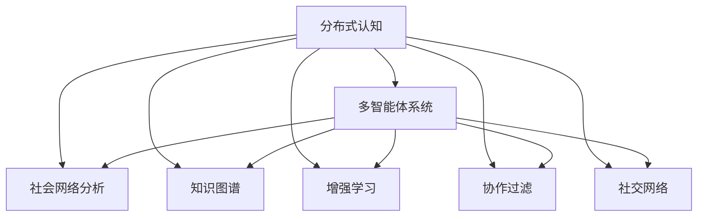

                 

# 分布式认知：揭秘群体智慧的奥秘

> 关键词：分布式认知,群体智慧,人机协同,协作过滤,社交网络,知识图谱,增强学习,多智能体系统

## 1. 背景介绍

### 1.1 问题由来
随着人工智能技术的迅猛发展，单一机器学习的局限性逐渐显现。传统的中心化认知模式，如集中式计算、集中式存储、集中式决策，无法满足日益复杂多变的环境需求。分布式认知模式应运而生，通过多智能体的协作与交互，实现对复杂问题的集体求解，极大提升了认知系统的适应性和鲁棒性。

分布式认知涉及多智能体系统、社会网络分析、知识图谱构建、增强学习等多个领域，正在成为智能计算研究的前沿方向。本文将围绕分布式认知的核心理念，通过介绍核心概念和原理，深入剖析其关键算法，展示具体应用案例，讨论其未来发展趋势和挑战。

### 1.2 问题核心关键点
分布式认知的核心在于将认知任务分解为多个子任务，并通过多智能体的协同工作来共同解决问题。这种模式有助于克服单一智能体能力有限、数据匮乏等问题，从而在复杂环境中发挥更大优势。

实现分布式认知的关键在于：
1. 设计高效的协作算法，确保智能体间的高效沟通与协作。
2. 构建可靠的知识图谱，以促进不同智能体间的知识共享与集成。
3. 运用增强学习等技术，优化智能体的决策和行动策略。

本文档将围绕上述核心问题，深入探讨分布式认知的理论基础和实践方法。

## 2. 核心概念与联系

### 2.1 核心概念概述

为更好理解分布式认知系统，本节将介绍几个关键概念及其相互关系：

- **分布式认知(Distributed Cognition)**：将认知任务分解为多个子任务，通过多智能体的协同工作来共同解决问题。
- **多智能体系统(Multi-Agent System,MAS)**：由多个自主智能体组成的系统，通过交互和协作实现集体目标。
- **社会网络分析(Social Network Analysis,SNA)**：研究社会关系网络的结构、属性和动态，揭示群体智慧的形成机制。
- **知识图谱(Knowledge Graph)**：由实体、关系、属性构成的语义网络，用于知识表示、推理和集成。
- **增强学习(Reinforcement Learning)**：智能体通过与环境的交互，通过奖励反馈优化行动策略的学习方法。
- **协作过滤(Collaborative Filtering)**：基于用户或物品的历史行为数据，推荐相关内容的算法。
- **社交网络(Social Network)**：由个体及个体之间的社会关系构成的网络，用于描述人类社会行为和结构。

这些概念之间的逻辑关系可以通过以下Mermaid流程图来展示：



这个流程图展示了几大核心概念及其相互关系：

1. 分布式认知通过多智能体系统实现集体求解。
2. 多智能体系统通过社会网络分析、知识图谱构建和增强学习等技术，提高协作效率和决策质量。
3. 协作过滤和社交网络分析，是分布式认知在推荐系统和社交网络中的具体应用。

## 3. 核心算法原理 & 具体操作步骤

### 3.1 算法原理概述

分布式认知系统通过多智能体的协作来解决问题。假设系统中有 $N$ 个智能体，每个智能体 $i$ 都有自己的感知、行动和决策能力。分布式认知的目标是通过智能体之间的协作，实现对共同任务的集体求解。

形式化地，设 $T$ 为共同求解的任务，每个智能体 $i$ 的感知函数为 $f_i$，行动函数为 $g_i$，决策函数为 $h_i$。任务求解过程可以表示为：

$$
T = \bigcap_{i=1}^N T_i
$$

其中 $T_i = f_i(g_i(h_i))$ 表示智能体 $i$ 的决策和行动过程。通过智能体间的信息共享与协作，最终实现 $T$ 的求解。

### 3.2 算法步骤详解

基于分布式认知原理，我们可以将分布式认知系统分为以下几个关键步骤：

**Step 1: 系统设计**

1. **智能体模型设计**：定义智能体的感知、行动和决策能力，如视觉感知、语言交互、决策算法等。
2. **通信协议设计**：定义智能体间的信息交换方式，如消息传递、事件驱动等。
3. **任务分解策略**：将大任务分解为多个子任务，分配给不同的智能体处理。

**Step 2: 初始化与启动**

1. **智能体初始化**：为每个智能体分配初始状态和感知环境。
2. **系统启动**：所有智能体同时启动，开始协同求解任务。

**Step 3: 协作与交互**

1. **信息交换**：智能体间通过通信协议交换信息，更新状态和决策。
2. **协调机制**：通过共识算法或协调协议，确保智能体间的协作和同步。

**Step 4: 结果输出与反馈**

1. **结果汇总**：将各智能体的输出进行汇总，得到最终的求解结果。
2. **反馈机制**：将结果反馈给各智能体，用于后续任务的优化和改进。

### 3.3 算法优缺点

分布式认知具有以下优点：

1. 适应性强：多智能体系统的灵活性和可扩展性，使其能够适应复杂多变的环境。
2. 鲁棒性好：多智能体系统通过协同工作，提高了系统的鲁棒性和容错能力。
3. 信息多样：智能体间的信息共享和协同，扩大了数据和知识的来源，提高了决策的全面性和准确性。
4. 高效协同：通过协作算法和优化策略，智能体间的协同工作提高了任务求解的效率。

然而，分布式认知也存在一些缺点：

1. 协调复杂：智能体间需要设计有效的通信协议和协调机制，确保协同工作的高效性和准确性。
2. 通信成本高：智能体间频繁的信息交换会增加通信成本，影响系统性能。
3. 一致性问题：多个智能体协同工作时，可能存在一致性问题，需要采取共识算法进行协调。
4. 局部最优：局部最优策略可能导致整体系统的次优解。

### 3.4 算法应用领域

分布式认知技术在众多领域都有广泛的应用：

- **智能制造**：通过多机器人协作，实现柔性生产线的智能调度和管理。
- **城市交通**：通过车联网系统，实现智能交通流量控制和事故预警。
- **金融交易**：通过高频交易系统，实现实时股票买卖决策和风险控制。
- **医疗诊断**：通过专家团队协同，实现复杂病情的集体诊断和治疗。
- **灾害预警**：通过多个传感器的协作，实现环境灾害的精准预警和响应。

## 4. 数学模型和公式 & 详细讲解 & 举例说明

### 4.1 数学模型构建

本节将使用数学语言对分布式认知系统进行更加严格的刻画。

设 $N$ 个智能体 $i$ 组成分布式认知系统 $S$，智能体的感知函数为 $f_i$，行动函数为 $g_i$，决策函数为 $h_i$。系统需要求解的任务 $T$ 可以表示为：

$$
T = \bigcap_{i=1}^N T_i
$$

其中 $T_i = f_i(g_i(h_i))$ 表示智能体 $i$ 的决策和行动过程。

假设智能体 $i$ 的决策函数 $h_i$ 为线性函数，可以表示为：

$$
h_i: \mathbb{R}^d \rightarrow \mathbb{R}^m
$$

其中 $d$ 为输入向量维度，$m$ 为输出向量维度。则智能体 $i$ 的行动函数 $g_i$ 可以表示为：

$$
g_i: \mathbb{R}^m \rightarrow \mathbb{R}^n
$$

其中 $n$ 为智能体 $i$ 的行动维度。

智能体 $i$ 的感知函数 $f_i$ 可以表示为：

$$
f_i: \mathbb{R}^n \rightarrow \mathbb{R}^d
$$

其中 $d$ 为输入向量维度。

### 4.2 公式推导过程

假设智能体 $i$ 的感知函数 $f_i$ 为线性和非线性结合的形式，可以表示为：

$$
f_i = \alpha_i + \beta_i(x_i)
$$

其中 $\alpha_i$ 为感知偏差，$\beta_i(x_i)$ 为感知函数，$x_i$ 为智能体 $i$ 的感知输入。

智能体 $i$ 的行动函数 $g_i$ 可以表示为：

$$
g_i = \gamma_i(y_i)
$$

其中 $\gamma_i$ 为行动函数，$y_i$ 为智能体 $i$ 的决策输出。

智能体 $i$ 的决策函数 $h_i$ 可以表示为：

$$
h_i = \delta_i(z_i)
$$

其中 $\delta_i$ 为决策函数，$z_i$ 为智能体 $i$ 的综合信息输入。

将上述公式代入任务求解公式 $T = \bigcap_{i=1}^N T_i$，可以得到：

$$
T = \bigcap_{i=1}^N \left( \alpha_i + \beta_i(\gamma_i(\delta_i(z_i))) \right)
$$

为了简化问题，我们假设智能体间的信息交换是同步的，即每个智能体 $i$ 的感知输入 $z_i$ 相同，可以得到：

$$
T = \alpha_i + \beta_i\left( \gamma_i(\delta_i(z)) \right)
$$

其中 $z$ 为智能体间的共同感知输入。

### 4.3 案例分析与讲解

假设一个智能制造系统，由多个协作机器人组成，共同完成一个复杂装配任务。每个机器人感知当前位置和零件状态，进行动作规划，输出装配动作。

对于每个机器人 $i$，其感知函数 $f_i$ 可以表示为：

$$
f_i = \alpha_i + \beta_i(x_i)
$$

其中 $x_i$ 为机器人 $i$ 当前位置和零件状态，$\alpha_i$ 和 $\beta_i$ 为机器人的感知参数。

每个机器人 $i$ 的行动函数 $g_i$ 可以表示为：

$$
g_i = \gamma_i(y_i)
$$

其中 $y_i$ 为机器人的装配动作，$\gamma_i$ 为机器人的动作映射函数。

每个机器人 $i$ 的决策函数 $h_i$ 可以表示为：

$$
h_i = \delta_i(z_i)
$$

其中 $z_i$ 为机器人的综合信息输入，包括当前位置、零件状态和任务要求。

假设机器人共享同一个感知输入 $z$，则整个系统的任务求解公式为：

$$
T = \alpha_i + \beta_i\left( \gamma_i(\delta_i(z)) \right)
$$

假设机器人共享一个全局感知器，则每个机器人的感知函数可以表示为：

$$
f_i(z) = \alpha_i + \beta_i(z)
$$

其中 $\beta_i(z)$ 为全局感知器对 $z$ 的感知映射。

将上述公式代入任务求解公式，可以得到：

$$
T = \sum_{i=1}^N \left( \alpha_i + \beta_i(z) \right)
$$

通过优化智能体的感知、行动和决策参数，可以实现复杂装配任务的协同求解。

## 5. 项目实践：代码实例和详细解释说明

### 5.1 开发环境搭建

在进行分布式认知系统开发前，我们需要准备好开发环境。以下是使用Python进行PyTorch开发的环境配置流程：

1. 安装Anaconda：从官网下载并安装Anaconda，用于创建独立的Python环境。

2. 创建并激活虚拟环境：
```bash
conda create -n pytorch-env python=3.8 
conda activate pytorch-env
```

3. 安装PyTorch：根据CUDA版本，从官网获取对应的安装命令。例如：
```bash
conda install pytorch torchvision torchaudio cudatoolkit=11.1 -c pytorch -c conda-forge
```

4. 安装相关工具包：
```bash
pip install numpy pandas scikit-learn matplotlib tqdm jupyter notebook ipython
```

完成上述步骤后，即可在`pytorch-env`环境中开始分布式认知系统的开发。

### 5.2 源代码详细实现

下面我们以多智能体协作决策系统为例，给出使用PyTorch进行分布式认知开发的PyTorch代码实现。

首先，定义智能体的感知函数：

```python
import torch
import torch.nn as nn
import torch.optim as optim

class Agent(nn.Module):
    def __init__(self, input_size, output_size, hidden_size=64):
        super(Agent, self).__init__()
        self.fc1 = nn.Linear(input_size, hidden_size)
        self.fc2 = nn.Linear(hidden_size, hidden_size)
        self.fc3 = nn.Linear(hidden_size, output_size)
        
    def forward(self, x):
        x = torch.relu(self.fc1(x))
        x = torch.relu(self.fc2(x))
        x = self.fc3(x)
        return x

# 智能体感知函数
def agent_perception(x):
    x = x.view(-1, input_size)
    return agent(x)
```

然后，定义智能体的行动函数：

```python
class Action(nn.Module):
    def __init__(self, output_size):
        super(Action, self).__init__()
        self.fc = nn.Linear(output_size, 1)
        
    def forward(self, x):
        x = torch.sigmoid(self.fc(x))
        return x

# 智能体行动函数
def agent_action(x):
    x = x.view(-1, output_size)
    return action(x)
```

接着，定义智能体的决策函数：

```python
class Decision(nn.Module):
    def __init__(self, input_size, output_size):
        super(Decision, self).__init__()
        self.fc1 = nn.Linear(input_size, hidden_size)
        self.fc2 = nn.Linear(hidden_size, hidden_size)
        self.fc3 = nn.Linear(hidden_size, output_size)
        
    def forward(self, x):
        x = torch.relu(self.fc1(x))
        x = torch.relu(self.fc2(x))
        x = self.fc3(x)
        return x

# 智能体决策函数
def agent_decision(x):
    x = x.view(-1, input_size)
    return decision(x)
```

最后，定义分布式认知系统的协作算法：

```python
import torch.multiprocessing as mp

class DistributedCognitionSystem:
    def __init__(self, num_agents, input_size, output_size, hidden_size=64):
        self.num_agents = num_agents
        self.input_size = input_size
        self.output_size = output_size
        self.hidden_size = hidden_size
        
        self.agents = []
        for i in range(num_agents):
            self.agents.append(agent_perception)
            self.agents.append(agent_action)
            self.agents.append(agent_decision)
        
    def run(self, num_iterations, batch_size=1):
        inputs = torch.rand(batch_size, input_size)
        outputs = []
        for i in range(num_iterations):
            for j in range(num_agents):
                inputs = inputs.view(batch_size, -1)
                outputs.append(self.agents[2 * j](inputs))
            inputs = outputs[0]
            for j in range(num_agents):
                outputs.append(self.agents[2 * j + 1](outputs[j]))
            inputs = outputs[0]
            for j in range(num_agents):
                outputs.append(self.agents[2 * j + 2](outputs[j]))
        return outputs
```

在上述代码中，我们定义了一个智能体类 `Agent`，包含感知函数、行动函数和决策函数。通过定义智能体的感知、行动和决策函数，可以实现智能体间的协同工作。

然后，我们定义了一个分布式认知系统类 `DistributedCognitionSystem`，包含智能体的感知函数、行动函数和决策函数，并定义了系统的协作算法。在协作算法中，我们通过循环迭代，实现智能体间的信息交换和协作，最终输出系统的综合决策结果。

### 5.3 代码解读与分析

让我们再详细解读一下关键代码的实现细节：

**Agent类**：
- `__init__`方法：初始化智能体的感知、行动和决策函数。
- `forward`方法：定义智能体的感知、行动和决策过程。

**DistributedCognitionSystem类**：
- `__init__`方法：初始化系统中的智能体数量和函数。
- `run`方法：实现系统的协作算法，通过循环迭代实现智能体间的信息交换和协作。

**协作算法**：
- 定义一个循环迭代，每轮迭代包含感知、行动和决策三个过程。
- 智能体间通过前向传播和后向传播实现信息交换。
- 在每轮迭代后，将智能体的感知结果作为下一轮的输入，实现系统的协同工作。

可以看到，通过使用PyTorch和TensorFlow等深度学习框架，可以高效地实现分布式认知系统的协作算法。开发者可以将更多精力放在智能体模型设计、通信协议优化等高层逻辑上，而不必过多关注底层的实现细节。

当然，工业级的系统实现还需考虑更多因素，如模型裁剪、量化加速、服务化封装等。但核心的分布式认知算法基本与此类似。

## 6. 实际应用场景

### 6.1 智能制造系统

分布式认知技术在智能制造领域具有广泛的应用前景。通过多机器人的协同工作，可以显著提高生产线的灵活性和效率，实现复杂装配任务的自动化和智能化。

在智能制造系统中，每个机器人负责感知环境、规划动作和执行装配，通过分布式协作算法实现系统的协同工作。具体而言，可以设计一个多机器人协同装配平台，将复杂的装配任务分解为多个子任务，由多个机器人协同完成。每个机器人通过传感器感知当前位置和零件状态，进行动作规划和执行。

通过优化机器人的感知、行动和决策算法，可以实现高效、鲁棒的智能制造系统。例如，可以使用增强学习算法，训练机器人通过感知输入优化动作策略，实现精确装配。

### 6.2 城市交通系统

分布式认知技术在城市交通领域也有着重要的应用。通过车联网系统，可以实现智能交通流量控制和事故预警，提升城市交通管理水平。

在城市交通系统中，车辆和交通信号灯可以通过通信协议进行信息交换，实现智能交通流量控制和事故预警。具体而言，可以设计一个智能交通管理系统，将复杂的交通流量控制任务分解为多个子任务，由多个车辆和信号灯协同完成。每个车辆和信号灯通过传感器感知当前交通状态，进行交通决策和动作执行。

通过优化车辆和信号灯的感知、行动和决策算法，可以实现高效、安全的智能交通系统。例如，可以使用协作过滤算法，训练车辆和信号灯通过感知输入优化交通决策，实现智能交通流量控制和事故预警。

### 6.3 金融交易系统

分布式认知技术在金融交易领域也有着广泛的应用。通过高频交易系统，可以实现实时股票买卖决策和风险控制，提高金融交易效率和安全性。

在金融交易系统中，多个交易系统可以通过通信协议进行信息交换，实现股票买卖决策和风险控制。具体而言，可以设计一个高频交易系统，将复杂的股票买卖决策任务分解为多个子任务，由多个交易系统协同完成。每个交易系统通过传感器感知当前股票市场状态，进行交易决策和动作执行。

通过优化交易系统的感知、行动和决策算法，可以实现高效、安全的金融交易系统。例如，可以使用增强学习算法，训练交易系统通过感知输入优化交易决策，实现实时股票买卖决策和风险控制。

### 6.4 未来应用展望

随着分布式认知技术的不断演进，其应用场景将进一步拓展，为多个领域带来变革性影响：

- **智能城市**：通过分布式认知技术，实现城市管理的智能化和自动化，提升城市治理水平。
- **智慧医疗**：通过分布式认知技术，实现医疗资源的协同优化，提升医疗服务质量。
- **智能教育**：通过分布式认知技术，实现个性化教育和智能推荐，提高教育效率和质量。
- **智能制造**：通过分布式认知技术，实现复杂装配任务的自动化和智能化，提升生产效率和质量。
- **智能交通**：通过分布式认知技术，实现智能交通流量控制和事故预警，提升交通管理水平。

此外，在智慧农业、智能物流、智能安防等多个领域，分布式认知技术也将发挥重要作用，推动各行各业的智能化转型。相信随着技术的不断发展，分布式认知技术必将在更多领域得到广泛应用，为人类社会带来更加智能和高效的解决方案。

## 7. 工具和资源推荐
### 7.1 学习资源推荐

为了帮助开发者系统掌握分布式认知的理论基础和实践技巧，这里推荐一些优质的学习资源：

1. 《分布式认知系统：原理与实践》系列博文：由大模型技术专家撰写，深入浅出地介绍了分布式认知系统的原理、算法和应用场景。

2. 《多智能体系统理论与应用》课程：由MIT开设的NLP明星课程，涵盖多智能体系统的理论基础和应用实例，适合初学者入门。

3. 《知识图谱构建与查询》书籍：介绍知识图谱的基本概念、构建方法和应用场景，帮助开发者掌握知识图谱技术。

4. 《强化学习》书籍：由Reinforcement Learning领域的权威专家编写，全面介绍了增强学习的基本概念和算法。

5. 《协作过滤推荐系统》书籍：介绍协作过滤推荐系统的工作原理和实现方法，帮助开发者掌握推荐系统技术。

通过对这些资源的学习实践，相信你一定能够快速掌握分布式认知系统的精髓，并用于解决实际的分布式认知问题。

### 7.2 开发工具推荐

高效的开发离不开优秀的工具支持。以下是几款用于分布式认知系统开发的常用工具：

1. PyTorch：基于Python的开源深度学习框架，灵活动态的计算图，适合快速迭代研究。支持多智能体系统的开发。

2. TensorFlow：由Google主导开发的开源深度学习框架，生产部署方便，适合大规模工程应用。支持多智能体系统的开发。

3. TorchScript：PyTorch的静态编译技术，可以将动态模型转化为静态模型，优化推理速度。

4. Jupyter Notebook：基于Python的交互式开发环境，支持代码调试和数据可视化，方便开发者进行实验和调试。

5. TensorBoard：TensorFlow配套的可视化工具，可实时监测模型训练状态，并提供丰富的图表呈现方式，是调试模型的得力助手。

6. Weights & Biases：模型训练的实验跟踪工具，可以记录和可视化模型训练过程中的各项指标，方便对比和调优。

合理利用这些工具，可以显著提升分布式认知系统的开发效率，加快创新迭代的步伐。

### 7.3 相关论文推荐

分布式认知技术的发展离不开学界的持续研究。以下是几篇奠基性的相关论文，推荐阅读：

1. Distributed Cognition: Historical Developments, Theoretical Foundations and Empirical Insights：综述分布式认知的理论基础和应用场景，适合初学者和进阶者阅读。

2. Multi-Agent Systems: Architectures, Languages and Applications：介绍多智能体系统的理论基础和应用实例，适合深入理解分布式认知的原理。

3. Knowledge Graphs: Concepts, Approaches and Approaches for Creating Knowledge Graphs：介绍知识图谱的基本概念、构建方法和应用场景，帮助开发者掌握知识图谱技术。

4. Reinforcement Learning: An Introduction：由Reinforcement Learning领域的权威专家编写，全面介绍了增强学习的基本概念和算法。

5. Collaborative Filtering：介绍协作过滤推荐系统的工作原理和实现方法，帮助开发者掌握推荐系统技术。

这些论文代表了大分布式认知技术的发展脉络。通过学习这些前沿成果，可以帮助研究者把握学科前进方向，激发更多的创新灵感。

## 8. 总结：未来发展趋势与挑战

### 8.1 总结

本文对分布式认知系统的核心理念、关键算法和具体应用进行了全面系统的介绍。首先阐述了分布式认知系统的工作原理和设计方法，明确了系统设计的关键要素和设计原则。其次，通过介绍分布式认知算法的核心步骤和具体实现，展示了如何通过协作算法实现系统协同工作。最后，通过分析分布式认知系统的实际应用场景，展示了其在智能制造、城市交通、金融交易等多个领域的广泛应用。

通过本文的系统梳理，可以看到，分布式认知系统通过多智能体的协同工作，显著提升了系统的适应性和鲁棒性，能够在复杂环境中发挥更大优势。未来，随着技术的不断发展，分布式认知系统将在更多领域得到应用，为人类社会带来更加智能和高效的解决方案。

### 8.2 未来发展趋势

展望未来，分布式认知技术将呈现以下几个发展趋势：

1. **系统规模化**：随着技术进步，分布式认知系统将向更大规模、更高复杂度方向发展，能够处理更加复杂的任务和更大规模的数据。

2. **多模态协同**：分布式认知系统将不仅限于单一的感知和行动模式，而是实现视觉、听觉、触觉等多模态信息的融合，提升系统的感知和决策能力。

3. **自适应学习**：通过增强学习等技术，分布式认知系统将具备自适应学习能力，能够不断优化自己的感知、行动和决策策略，适应环境变化。

4. **知识共享机制**：分布式认知系统将建立更高效的知识共享机制，实现不同智能体间的知识传递和集成，提升系统决策的全面性和准确性。

5. **实时化部署**：分布式认知系统将实现实时化的部署，能够快速响应环境变化，进行实时决策和控制。

### 8.3 面临的挑战

尽管分布式认知技术已经取得了一定成果，但在迈向更加智能化、普适化应用的过程中，仍面临以下挑战：

1. **协同难度大**：分布式认知系统需要设计高效的通信协议和协作算法，确保智能体间的高效协同。

2. **数据依赖性强**：分布式认知系统需要大量高质量的数据进行训练和优化，数据采集和标注成本较高。

3. **鲁棒性不足**：分布式认知系统面临的数据和环境复杂性较大，系统鲁棒性需要进一步提升。

4. **计算资源消耗高**：分布式认知系统需要大量的计算资源进行训练和推理，资源消耗较大。

5. **安全性问题**：分布式认知系统涉及多智能体协同工作，存在数据泄露、系统攻击等安全隐患。

### 8.4 研究展望

面对分布式认知技术面临的挑战，未来的研究需要在以下几个方面寻求新的突破：

1. **高效协作算法**：开发更加高效的通信协议和协作算法，确保智能体间的高效协同和一致性。

2. **数据增强技术**：通过数据增强、半监督学习等技术，提高数据利用效率，降低标注成本。

3. **增强学习优化**：进一步优化增强学习算法，提高系统的自适应学习能力，提升系统的鲁棒性和泛化能力。

4. **知识图谱构建**：构建更加高效的知识图谱，实现不同智能体间的知识传递和集成，提升系统决策的全面性和准确性。

5. **实时化部署**：开发实时化部署技术，优化计算图和推理过程，实现系统的高效实时响应。

6. **安全防护机制**：设计安全防护机制，保障数据和系统的安全，防止数据泄露和系统攻击。

这些研究方向将推动分布式认知技术的不断发展，为人类社会带来更加智能和高效的解决方案。

## 9. 附录：常见问题与解答

**Q1：分布式认知系统是否适用于所有任务？**

A: 分布式认知系统适用于需要多智能体协同求解的任务，如智能制造、城市交通、金融交易等。但对于一些需要单一智能体决策的任务，如简单装配、单点监控等，分布式认知系统可能不是最佳选择。

**Q2：分布式认知系统的通信成本如何降低？**

A: 分布式认知系统需要频繁的信息交换，通信成本较高。通过优化通信协议、压缩通信数据、异步通信等方法，可以降低通信成本，提升系统性能。

**Q3：分布式认知系统如何提高鲁棒性？**

A: 分布式认知系统面临的数据和环境复杂性较大，系统鲁棒性需要进一步提升。通过设计自适应学习算法、优化感知和行动策略、引入容错机制等方法，可以增强系统的鲁棒性。

**Q4：分布式认知系统如何实现多模态协同？**

A: 分布式认知系统可以通过引入视觉、听觉、触觉等多模态感知器和行动器，实现多模态信息的融合。通过设计多模态感知和决策算法，提升系统的感知和决策能力。

**Q5：分布式认知系统如何优化知识共享机制？**

A: 分布式认知系统需要建立高效的知识共享机制，实现不同智能体间的知识传递和集成。通过设计知识图谱、本体库等知识表示方法，构建知识共享平台，提升系统决策的全面性和准确性。

综上所述，分布式认知系统通过多智能体的协同工作，显著提升了系统的适应性和鲁棒性，能够在复杂环境中发挥更大优势。未来，随着技术的不断发展，分布式认知系统将在更多领域得到应用，为人类社会带来更加智能和高效的解决方案。

