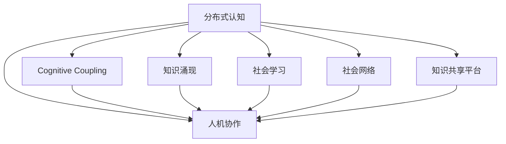

                 

# 分布式认知：揭秘群体智慧的涌现机制

分布式认知（Distributed Cognition）是一门研究人机交互、群体协作和知识共享的科学。它的目标是理解在群体智慧（Collective Intelligence）中，个体与系统如何通过合作、交流、共享知识，产生超越单一个体能力的新知识、新理解。本文将深入探讨分布式认知的原理，详细讲解其实现步骤，分析其优缺点，并展望其在多个领域的应用前景。

## 1. 背景介绍

### 1.1 问题由来
分布式认知理论起源于对人类社会协作行为的研究，特别是在20世纪60年代，认知科学和心理学领域的学者开始探讨复杂的社会认知系统如何运作。随着互联网和信息技术的发展，分布式认知的研究逐渐扩展到计算机科学和人工智能领域，成为跨学科研究的新兴热点。

分布式认知研究的兴起，源于以下几个方面的驱动：
- **人机协作的兴起**：现代信息社会中，越来越多的任务需要人机协作完成，单靠人类个体或单台机器往往无法满足需求。
- **大数据与复杂系统的挑战**：面对海量数据和大规模复杂系统的管理，传统的集中式知识处理方式难以应对，分布式认知成为一种更具适应性的解决方式。
- **社会网络与协作平台的普及**：社交媒体、在线协作工具的普及，使得跨地域、跨组织的知识共享成为可能，推动了分布式认知技术的发展。

### 1.2 问题核心关键点
分布式认知的核心问题在于理解个体、系统、环境三者之间的交互关系，如何通过协同工作产生智慧化的集体行为。具体包括：
- **认知耦合（Cognitive Coupling）**：个体与系统之间的知识共享与交流机制。
- **知识涌现（Emergent Knowledge）**：个体知识通过交互、融合、共享，形成超越单一个体知识的新知识。
- **社会学习（Social Learning）**：个体在协作中通过观察、模仿、反馈等机制进行知识更新和迭代。

## 2. 核心概念与联系

### 2.1 核心概念概述

- **分布式认知（Distributed Cognition）**：指在复杂的任务和环境中，通过分布式的人机交互、知识共享和协作，产生超越单一个体能力的群体智慧。

- **认知耦合（Cognitive Coupling）**：指个体与系统之间通过交互、交流、反馈等方式，共享知识和信息，形成相互依赖的认知结构。

- **知识涌现（Emergent Knowledge）**：指个体知识通过交互和融合，在分布式系统中产生新的、未被个体掌握的集体知识。

- **社会学习（Social Learning）**：指个体在协作中通过观察、模仿、反馈等方式，获取和更新知识。

- **社会网络（Social Network）**：指个体间通过交流、合作形成的社交关系网络，对分布式认知过程有重要影响。

- **知识共享平台（Knowledge Sharing Platform）**：指用于支持个体间知识交流、共享的技术和工具，如社交媒体、协作软件等。

- **人机协作（Human-Machine Collaboration）**：指人机系统之间的协同工作，结合各自优势，共同完成任务。

这些核心概念构成了分布式认知的理论基础，通过进一步分析和整合，形成完整的分布式认知框架。

### 2.2 核心概念原理和架构的 Mermaid 流程图



此图展示了分布式认知中关键概念间的联系，每一个概念都与其他概念紧密相关，共同构成了一个复杂的系统。

## 3. 核心算法原理 & 具体操作步骤

### 3.1 算法原理概述

分布式认知算法基于以下两个核心原理：
- **协同工作原理**：个体通过交互、协作，共同解决问题。
- **知识涌现原理**：个体间的协同工作产生新知识，这种新知识在分布式系统中自下而上涌现出来。

具体来说，分布式认知算法包括以下几个步骤：
1. **个体交互**：每个个体通过一定的交互方式（如语言、文字、工具等）共享信息和知识。
2. **协同工作**：个体通过协作解决问题，将各自的知识、技能、经验结合起来，形成集体智慧。
3. **知识融合**：个体知识通过交流、整合，形成新的集体知识。
4. **知识验证**：通过反馈机制，验证新知识的正确性，并在集体中传播。

### 3.2 算法步骤详解

#### 3.2.1 个体交互

个体交互是分布式认知的基础。具体包括以下几个方面：
- **交流渠道**：如语言、文字、图像、符号等，用于个体间的知识共享。
- **交流方式**：如讨论、协作、问答、协同编辑等，促进知识传播和共享。
- **交流平台**：如社交媒体、协作软件、即时通讯工具等，提供交流的物理平台。

#### 3.2.2 协同工作

协同工作是将个体知识整合为集体知识的关键步骤。具体包括以下几个方面：
- **任务分解**：将复杂任务分解为多个子任务，由不同个体负责解决。
- **协作机制**：如分工合作、轮换机制、同步工作等，确保个体间的协同工作。
- **沟通机制**：如定期会议、在线讨论、即时反馈等，保持信息同步和沟通顺畅。

#### 3.2.3 知识融合

知识融合是将个体知识整合为集体知识的过程。具体包括以下几个方面：
- **知识聚合**：通过汇总、总结、归纳等方法，将个体知识合并为集体知识。
- **知识整合**：通过分析和综合，形成新的集体知识结构。
- **知识验证**：通过实验、测试、验证等方法，确保新知识的正确性。

#### 3.2.4 知识验证

知识验证是通过反馈机制，确保新知识的正确性。具体包括以下几个方面：
- **反馈机制**：如测试、评估、同行评审等，获取反馈信息。
- **修正机制**：根据反馈信息，修正集体知识中的错误和不足。
- **传播机制**：将修正后的集体知识在集体中传播，确保信息的正确性。

### 3.3 算法优缺点

分布式认知算法的优点包括：
- **广泛适应性**：适用于多种任务和场景，包括科学研究、工程设计、商业决策等。
- **高效协同**：通过个体间的协作，充分发挥集体智慧，提高工作效率。
- **知识涌现**：个体知识通过交互和融合，产生超越单一个体的新知识。

同时，分布式认知算法也存在一些缺点：
- **沟通成本高**：个体间需要频繁交流和协作，可能会增加沟通成本和时间。
- **协同难度大**：复杂任务下，个体间的协作难度较大，协调和沟通需要精心设计。
- **知识融合困难**：个体知识差异较大时，知识融合可能面临挑战，需要较强的融合能力。

### 3.4 算法应用领域

分布式认知算法已经在多个领域得到广泛应用，具体包括：

- **科学研究**：通过分布式协作，加速科学发现和研究进展。
- **工程设计**：在复杂工程项目中，通过分布式设计，提高设计效率和质量。
- **商业决策**：在市场营销、金融分析等领域，通过分布式决策，优化决策过程。
- **社会创新**：在社会创新和公共事务中，通过分布式协作，推动社会进步。

## 4. 数学模型和公式 & 详细讲解 & 举例说明

### 4.1 数学模型构建

分布式认知的数学模型通常包括个体知识表示、集体知识表示和知识涌现模型三部分。

- **个体知识表示**：通过向量或矩阵表示个体知识，如向量 $\vec{k}_i$ 表示第 $i$ 个体的知识。
- **集体知识表示**：通过加权求和或聚合方法表示集体知识，如向量 $\vec{K}=\sum_{i=1}^n w_i \vec{k}_i$，其中 $w_i$ 为个体 $i$ 的权重。
- **知识涌现模型**：通过演化模型描述个体知识如何通过交互和融合，演变为集体知识。

### 4.2 公式推导过程

设 $k_i$ 为个体 $i$ 的知识向量，$K$ 为集体知识向量。根据知识涌现原理，个体知识通过交互和融合，形成集体知识。设 $\phi(\vec{k}_i, \vec{k}_j)$ 为个体 $i$ 和 $j$ 间的交互函数，$f(\vec{k}_i, \vec{k}_j)$ 为知识融合函数。则集体知识更新公式为：

$$
\vec{K}^{t+1} = \sum_{i=1}^n w_i \vec{k}_i^{t+1} = \sum_{i=1}^n w_i (f(\vec{k}_i, \vec{K}^t) + \phi(\vec{k}_i, \vec{k}_j))
$$

其中 $w_i$ 为个体 $i$ 的权重，$t$ 为时间步。

### 4.3 案例分析与讲解

假设一个科学团队需要合作研究一种新材料，每个团队成员都有不同的背景知识和实验数据。他们通过讨论、交换数据和共同分析，逐步形成集体的知识体系。具体步骤如下：

1. **初始化知识**：每个团队成员将自己的知识和数据编码为向量，如 $\vec{k}_1, \vec{k}_2, \vec{k}_3, \ldots, \vec{k}_n$。
2. **交互与融合**：通过讨论和交换，每个成员的知识和数据被整合，形成新的集体知识向量 $\vec{K}=\sum_{i=1}^n w_i \vec{k}_i$。
3. **验证与修正**：通过实验验证新材料的性质，修正集体知识中的错误和不足。
4. **传播与优化**：将修正后的集体知识传播给所有成员，并进行优化。

通过不断迭代上述步骤，团队逐步获得新的、更准确的集体知识，推动新材料的研究进展。

## 5. 项目实践：代码实例和详细解释说明

### 5.1 开发环境搭建

在分布式认知的项目实践中，通常需要搭建一个分布式协作平台。以下是使用Python Flask进行分布式协作平台的搭建流程：

1. **安装Python和Flask**：
```bash
pip install flask
```

2. **创建Flask应用**：
```python
from flask import Flask, request, jsonify

app = Flask(__name__)

@app.route('/api/interaction', methods=['POST'])
def interaction():
    data = request.get_json()
    # 处理交互请求
    return jsonify({'status': 'ok'})

@app.route('/api/knowledge', methods=['GET'])
def knowledge():
    # 获取集体知识
    return jsonify({'knowledge': 'example knowledge'})
```

3. **运行Flask应用**：
```bash
python app.py
```

### 5.2 源代码详细实现

以下是一个简单的分布式认知算法实现，通过Flask实现个体间的交互和知识融合：

```python
from flask import Flask, request, jsonify
import numpy as np

app = Flask(__name__)

# 初始化知识向量
k = np.random.rand(3, 3)

# 定义交互函数
def interaction(k, K):
    return k + K

# 定义知识融合函数
def fusion(k, K):
    return k @ K

# 交互接口
@app.route('/api/interaction', methods=['POST'])
def interaction():
    data = request.get_json()
    K = np.random.rand(3, 3)
    k_new = interaction(k, K)
    k = fusion(k, k_new)
    return jsonify({'status': 'ok', 'new_k': k.tolist()})

# 获取集体知识接口
@app.route('/api/knowledge', methods=['GET'])
def knowledge():
    return jsonify({'knowledge': k.tolist()})

if __name__ == '__main__':
    app.run(debug=True)
```

### 5.3 代码解读与分析

在上述代码中，我们使用了Flask搭建了一个简单的分布式协作平台，实现了个体间的交互和知识融合。具体解释如下：

- **初始化知识向量**：使用numpy生成一个随机知识向量 $k$。
- **交互函数**：通过交互函数 $\phi(\vec{k}_i, \vec{k}_j)$ 更新新知识向量 $k_{new}$。
- **知识融合函数**：通过知识融合函数 $f(\vec{k}_i, \vec{k}_j)$ 更新集体知识向量 $K$。
- **交互接口**：实现一个API，用于处理个体间的交互请求，更新个体知识向量。
- **获取集体知识接口**：实现一个API，用于获取集体知识向量。

### 5.4 运行结果展示

通过运行上述代码，可以观察到个体间的交互和集体知识的演变过程。具体步骤如下：

1. **启动Flask应用**：
```bash
python app.py
```

2. **发起交互请求**：
```bash
curl -X POST -H "Content-Type: application/json" -d '{"k": [0.1, 0.2, 0.3], "K": [0.4, 0.5, 0.6]}' http://localhost:5000/api/interaction
```

3. **获取集体知识**：
```bash
curl http://localhost:5000/api/knowledge
```

通过交互和融合，个体知识逐渐演变为集体知识，形成新的集体智慧。

## 6. 实际应用场景

### 6.1 科学研究

在科学研究中，分布式认知的应用主要体现在以下几个方面：

- **协同研究**：科研团队通过分布式协作平台，共享数据、文献和实验结果，加速科研进展。
- **数据整合**：通过分布式数据整合，形成综合性的数据库，支持更深入的研究。
- **远程实验**：通过分布式计算和实验平台，实现远程实验和数据分析，提升研究效率。

### 6.2 工程设计

在工程设计中，分布式认知的应用主要体现在以下几个方面：

- **设计协同**：工程师通过协作工具，共同设计复杂的工程系统，提升设计质量和效率。
- **仿真优化**：通过分布式仿真平台，优化设计参数，进行虚拟实验和模拟。
- **跨学科合作**：通过跨学科团队协作，解决复杂的工程问题，提升设计创新能力。

### 6.3 商业决策

在商业决策中，分布式认知的应用主要体现在以下几个方面：

- **市场分析**：通过分布式数据分析，预测市场趋势和消费者行为，优化市场策略。
- **供应链管理**：通过分布式协作平台，优化供应链管理，提高运营效率。
- **客户反馈**：通过分布式调查和反馈系统，获取客户需求和意见，提升客户满意度。

### 6.4 未来应用展望

随着技术的发展和应用场景的拓展，分布式认知将在更多领域得到应用，带来深远的影响：

- **智能制造**：通过分布式认知，提升智能制造系统的协同和自适应能力，实现智能生产。
- **智慧城市**：通过分布式认知，优化城市管理和服务，提升城市运行效率和居民幸福感。
- **教育创新**：通过分布式认知，推动教育资源的共享和优化，实现个性化教育。
- **健康医疗**：通过分布式认知，优化医疗资源配置和诊疗流程，提升医疗服务质量。

## 7. 工具和资源推荐

### 7.1 学习资源推荐

为了深入了解分布式认知的理论和技术，以下是一些优质的学习资源：

- **《分布式认知理论与应用》（中文）**：北京大学出版社，深入介绍分布式认知的理论基础和实际应用。
- **《协作智能：分布式认知、群智系统和合作》（英文）**：Springer出版社，系统阐述分布式认知的理论框架和前沿研究。
- **Coursera的“Collaborative Intelligence”课程**：由加州大学圣地亚哥分校开设，讲解分布式认知和群智系统。
- **EdX的“Distributed Cognition in Learning”课程**：由波士顿大学开设，聚焦教育中的分布式认知。

### 7.2 开发工具推荐

以下是几个常用的分布式协作工具，支持分布式认知的应用开发：

- **Confluence**：协作文档平台，支持团队协作和知识共享。
- **Slack**：即时通讯工具，提供高效的协作和沟通功能。
- **GitLab**：代码管理和版本控制系统，支持分布式软件开发。
- **JIRA**：项目管理和任务跟踪工具，帮助团队协同工作。

### 7.3 相关论文推荐

以下是几篇关于分布式认知的重要论文，推荐阅读：

- **"Leveraging Collective Intelligence in Open Innovation Platforms"**：探讨如何利用分布式认知平台，促进开放创新。
- **"Social Media Analytics for Collective Intelligence"**：研究社交媒体在分布式认知中的应用。
- **"Distributed Cognition and Collaborative Design"**：分析分布式认知在产品设计中的应用。
- **"The Sociology of Collaborative Intelligence"**：从社会学角度探讨分布式认知的本质和应用。

## 8. 总结：未来发展趋势与挑战

### 8.1 研究成果总结

分布式认知作为群体智慧的涌现机制，近年来在理论和应用上取得了显著进展。主要研究成果包括：
- **理论框架**：建立分布式认知的理论模型，描述个体与系统间的交互和知识涌现。
- **应用范式**：提出分布式认知的应用场景，包括科研、工程、商业等。
- **技术实现**：实现分布式协作平台和算法，支持大规模协作和知识共享。

### 8.2 未来发展趋势

未来，分布式认知将继续在多个领域发挥重要作用，呈现以下几个趋势：

- **自动化和智能化**：分布式认知系统将更多地利用自动化和智能技术，如机器学习、自然语言处理等，提高协作效率。
- **跨学科融合**：分布式认知将与其他学科（如心理学、社会学、经济学等）深度融合，形成更全面的研究视角。
- **社会网络分析**：利用社会网络分析技术，优化分布式协作平台的设计和应用。
- **人机协作**：推动人机协作的深度发展，实现更高效、更智能的分布式认知。

### 8.3 面临的挑战

尽管分布式认知已经取得了重要进展，但在实际应用中仍面临以下挑战：

- **沟通障碍**：分布式协作过程中，个体间需要频繁沟通，沟通障碍和信息不对称问题仍需解决。
- **协同难度大**：复杂任务下，个体间的协同工作难度较大，需要更高的组织和管理能力。
- **知识融合困难**：不同背景和知识结构的个体间，知识融合和整合面临较大挑战。
- **系统可扩展性**：大规模分布式系统需要更好的可扩展性和容错性，以应对数据和用户增长的压力。

### 8.4 研究展望

未来的研究应在以下几个方面寻求新的突破：

- **知识融合算法**：开发更高效的分布式知识融合算法，提升集体知识的准确性和完整性。
- **智能推荐系统**：利用智能推荐技术，提升分布式协作平台的用户体验。
- **隐私和安全**：研究分布式协作中的隐私保护和安全问题，确保数据和知识的安全性。
- **伦理和社会责任**：探讨分布式协作中的伦理和社会责任问题，确保协作系统的公正性和公平性。

## 9. 附录：常见问题与解答

**Q1：分布式认知与集中式认知有什么区别？**

A: 集中式认知指的是单一实体（如一个人、一台机器）集中控制和管理知识，而分布式认知是指多个实体（如一群人、多个机器）通过交互和协作，共同管理和共享知识。集中式认知往往效率较高，但灵活性差；分布式认知则灵活性高，但协调难度大。

**Q2：如何提高分布式认知的协同效率？**

A: 提高分布式认知的协同效率需要以下措施：
1. 设计合理的交互机制，确保信息流通顺畅。
2. 优化知识融合算法，提高集体知识的准确性。
3. 引入自动化和智能技术，提升协作效率。
4. 加强团队管理和协作培训，提升团队协作能力。

**Q3：分布式认知在商业决策中的优势是什么？**

A: 分布式认知在商业决策中的优势包括：
1. 汇聚多方智慧，提升决策质量。
2. 降低决策偏差，提高决策可靠性。
3. 加速决策过程，提高运营效率。
4. 增强创新能力，推动业务创新。

**Q4：如何评估分布式认知系统的性能？**

A: 评估分布式认知系统的性能需要以下指标：
1. 协作效率：衡量知识共享和交互的速度和质量。
2. 知识涌现效果：衡量集体知识的准确性和完备性。
3. 系统可扩展性：衡量系统的可扩展性和容错性。
4. 用户满意度：衡量用户对协作平台的满意度。

通过综合评估这些指标，可以全面了解分布式认知系统的性能和优劣。

---

作者：禅与计算机程序设计艺术 / Zen and the Art of Computer Programming

